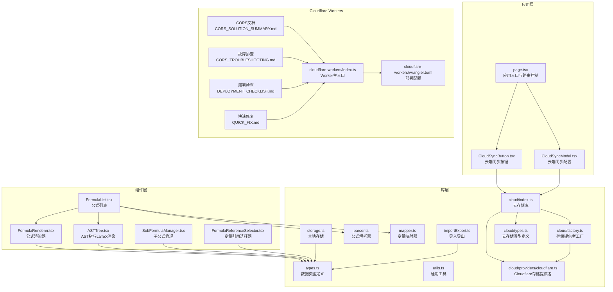
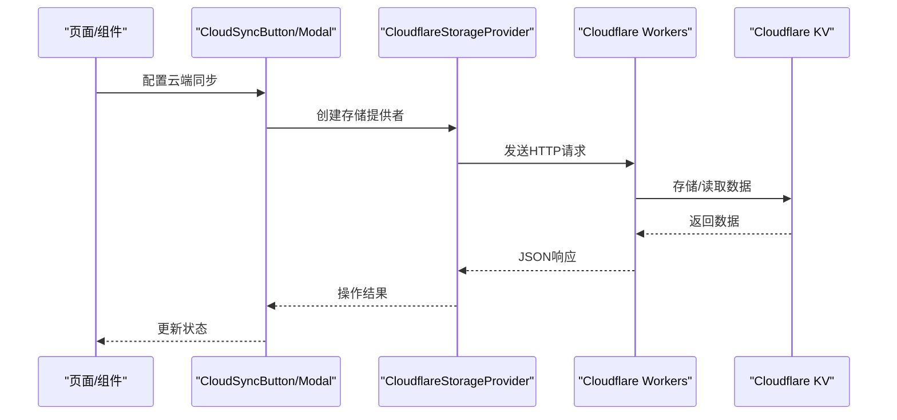
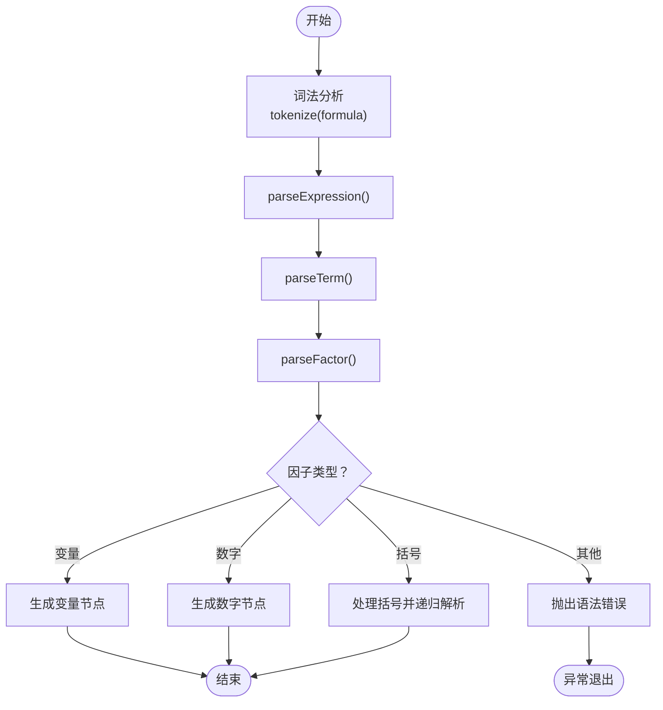
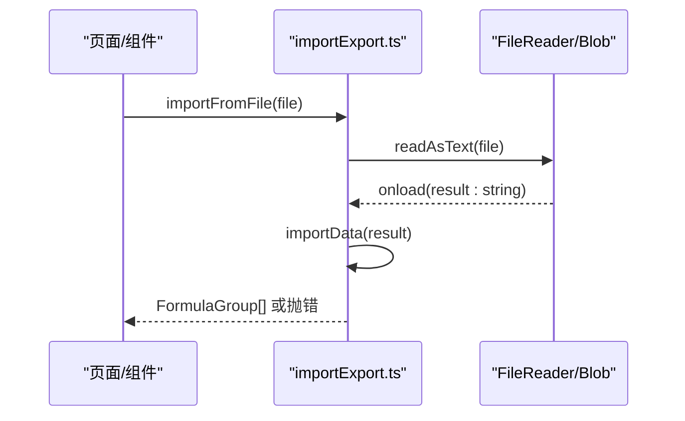
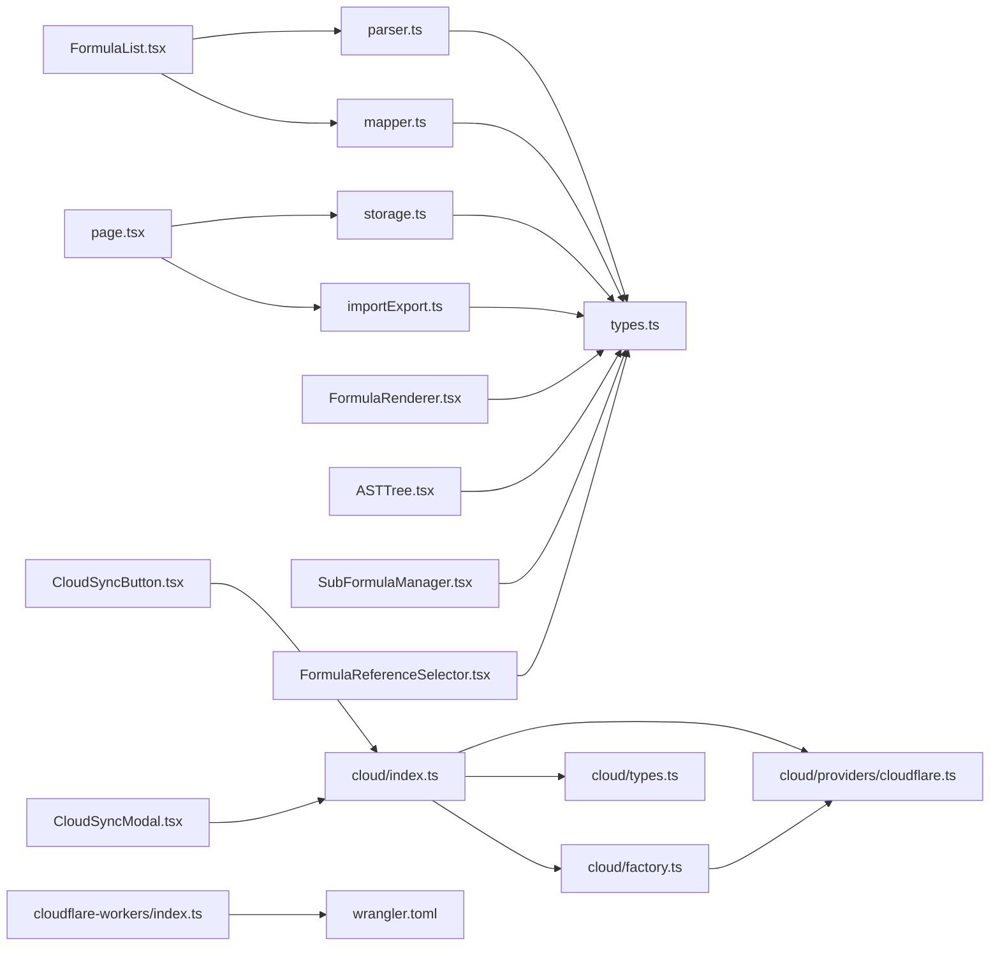

# API参考

<cite>
**本文档引用的文件**
- [src/lib/types.ts](file://src/lib/types.ts)
- [src/lib/storage.ts](file://src/lib/storage.ts)
- [src/lib/parser.ts](file://src/lib/parser.ts)
- [src/lib/mapper.ts](file://src/lib/mapper.ts)
- [src/lib/importExport.ts](file://src/lib/importExport.ts)
- [src/lib/utils.ts](file://src/lib/utils.ts)
- [src/lib/cloud/index.ts](file://src/lib/cloud/index.ts)
- [src/lib/cloud/factory.ts](file://src/lib/cloud/factory.ts)
- [src/lib/cloud/types.ts](file://src/lib/cloud/types.ts)
- [src/lib/cloud/providers/base.ts](file://src/lib/cloud/providers/base.ts)
- [src/lib/cloud/providers/cloudflare.ts](file://src/lib/cloud/providers/cloudflare.ts)
- [src/components/FormulaList.tsx](file://src/components/FormulaList.tsx)
- [src/components/FormulaRenderer.tsx](file://src/components/FormulaRenderer.tsx)
- [src/components/ASTTree.tsx](file://src/components/ASTTree.tsx)
- [src/components/SubFormulaManager.tsx](file://src/components/SubFormulaManager.tsx)
- [src/components/FormulaReferenceSelector.tsx](file://src/components/FormulaReferenceSelector.tsx)
- [src/components/CloudSyncButton.tsx](file://src/components/CloudSyncButton.tsx)
- [src/components/CloudSyncModal.tsx](file://src/components/CloudSyncModal.tsx)
- [src/app/page.tsx](file://src/app/page.tsx)
- [cloud/cloudflare-workers/index.ts](file://cloud/cloudflare-workers/index.ts)
- [cloud/cloudflare-workers/wrangler.toml](file://cloud/cloudflare-workers/wrangler.toml)
- [cloud/CORS_SOLUTION_SUMMARY.md](file://cloud/CORS_SOLUTION_SUMMARY.md)
- [cloud/CORS_TROUBLESHOOTING.md](file://cloud/CORS_TROUBLESHOOTING.md)
- [cloud/DEPLOYMENT_CHECKLIST.md](file://cloud/DEPLOYMENT_CHECKLIST.md)
- [cloud/QUICK_FIX.md](file://cloud/QUICK_FIX.md)
- [package.json](file://package.json)
</cite>

## 目录
1. [简介](#简介)
2. [项目结构](#项目结构)
3. [核心组件](#核心组件)
4. [架构总览](#架构总览)
5. [详细组件分析](#详细组件分析)
6. [Cloudflare Workers API](#cloudflare-workers-api)
7. [依赖分析](#依赖分析)
8. [性能考虑](#性能考虑)
9. [故障排查指南](#故障排查指南)
10. [结论](#结论)
11. [附录](#附录)

## 简介
本API参考文档面向"公式变量映射与可视化工具"的开发者，系统性梳理了数据模型、解析器、映射器、导入导出、本地存储以及前端组件的公共接口与使用方法。文档涵盖：
- 数据存储API：数据结构、持久化与工厂方法
- 解析器API：公式词法分析与语法解析
- 映射器API：变量提取、映射生成与格式化
- 导入导出API：JSON格式、校验与错误处理
- 工具函数API：通用工具与UI辅助
- 组件API：公式列表、渲染器、AST树、子公式管理、引用选择器等
- **新增**：Cloudflare Workers云存储API：完整的CORS配置、预检请求处理、版本管理API和部署配置

## 项目结构
项目采用Next.js应用结构，核心逻辑集中在src/lib目录，UI组件位于src/components，入口页面位于src/app/page.tsx。新增了Cloudflare Workers后端服务和相关的云存储组件。

**图表来源**
- [src/app/page.tsx:1-707](file://src/app/page.tsx#L1-L707)
- [src/components/CloudSyncButton.tsx:1-206](file://src/components/CloudSyncButton.tsx#L1-L206)
- [src/components/CloudSyncModal.tsx:1-390](file://src/components/CloudSyncModal.tsx#L1-L390)
- [src/lib/cloud/index.ts:1-20](file://src/lib/cloud/index.ts#L1-L20)
- [cloud/cloudflare-workers/index.ts:1-319](file://cloud/cloudflare-workers/index.ts#L1-L319)
- [cloud/cloudflare-workers/wrangler.toml:1-13](file://cloud/cloudflare-workers/wrangler.toml#L1-L13)

**章节来源**
- [src/app/page.tsx:1-707](file://src/app/page.tsx#L1-L707)
- [src/lib/types.ts:1-51](file://src/lib/types.ts#L1-L51)
- [src/lib/cloud/index.ts:1-20](file://src/lib/cloud/index.ts#L1-L20)

## 核心组件
本节概述各模块的职责与对外接口。

- 类型定义（src/lib/types.ts）
  - 定义Token、ASTNode、VariableMapping、MappingItem、Formula、SubFormula、FormulaGroup等核心数据结构，作为解析器、映射器、存储与UI组件共享的契约。

- 本地存储（src/lib/storage.ts）
  - 提供loadData、saveData、createGroup、createFormula等方法，封装localStorage读写与对象工厂。

- 公式解析器（src/lib/parser.ts）
  - 提供FormulaParser类，支持词法分析与递归下降解析，生成ASTNode树。

- 变量映射器（src/lib/mapper.ts）
  - 提供VariableMapper类，支持英文/中文变量提取、映射生成与格式化输出。

- 导入导出（src/lib/importExport.ts）
  - 提供exportData、downloadExportData、importData、importFromFile等方法，统一JSON格式与错误处理。

- 通用工具（src/lib/utils.ts）
  - 提供cn函数，用于Tailwind合并类名。

- **新增**：云存储库（src/lib/cloud/index.ts）
  - 提供云存储相关类型、工厂和配置管理器的统一导出接口。

- **新增**：页面与组件（src/app/page.tsx、src/components/*）
  - 应用入口负责状态管理、URL同步、数据导入导出；组件负责UI交互与可视化。

**章节来源**
- [src/lib/types.ts:1-51](file://src/lib/types.ts#L1-L51)
- [src/lib/storage.ts:1-50](file://src/lib/storage.ts#L1-L50)
- [src/lib/parser.ts:1-159](file://src/lib/parser.ts#L1-L159)
- [src/lib/mapper.ts:1-89](file://src/lib/mapper.ts#L1-L89)
- [src/lib/importExport.ts:1-101](file://src/lib/importExport.ts#L1-L101)
- [src/lib/utils.ts:1-7](file://src/lib/utils.ts#L1-L7)
- [src/lib/cloud/index.ts:1-20](file://src/lib/cloud/index.ts#L1-L20)

## 架构总览
系统采用"数据模型 + 解析/映射 + 可视化 + 本地存储 + 导入导出 + 云存储"的分层架构。页面通过组件驱动状态，组件调用库层API完成解析与映射，最终以渲染器与AST树呈现。新增的云存储层提供了基于Cloudflare Workers的远程数据持久化能力。

**图表来源**
- [src/components/CloudSyncButton.tsx:42-103](file://src/components/CloudSyncButton.tsx#L42-L103)
- [src/components/CloudSyncModal.tsx:91-200](file://src/components/CloudSyncModal.tsx#L91-L200)
- [src/lib/cloud/providers/cloudflare.ts](file://src/lib/cloud/providers/cloudflare.ts)
- [cloud/cloudflare-workers/index.ts:44-92](file://cloud/cloudflare-workers/index.ts#L44-L92)

## 详细组件分析

### 数据模型API（src/lib/types.ts）
- 数据结构
  - Token：词法单元，含type与value
  - ASTNode：抽象语法树节点，含type/operator/name/value/left/right
  - VariableMapping：变量映射结果，含mapping、englishVars、chineseVars、hasMoreChinese
  - MappingItem：映射项，含english与chinese
  - Formula：公式，含id、name、englishFormula、chineseFormula、createdAt、variableFormulaMapping、subFormulas
  - SubFormula：子公式，含id、name、englishFormula、chineseFormula
  - FormulaGroup：公式分组，含id、name、parentId、formulas、createdAt

- 使用建议
  - 作为跨模块契约，避免直接修改内部字段，优先使用工厂方法与转换函数
  - 在导入导出时严格遵循上述结构，确保兼容性

**章节来源**
- [src/lib/types.ts:1-51](file://src/lib/types.ts#L1-L51)

### 本地存储API（src/lib/storage.ts）
- 接口定义
  - loadData(): FormulaGroup[]
    - 返回localStorage中保存的分组数组，异常时返回空数组
  - saveData(groups: FormulaGroup[]): void
    - 将分组数组序列化后保存至localStorage，异常时记录错误
  - createGroup(name: string, parentId: string | null = null): FormulaGroup
    - 工厂方法，生成带唯一id、时间戳与默认字段的分组对象
  - createFormula(name: string, englishFormula: string, chineseFormula: string): Formula
    - 工厂方法，生成带唯一id、时间戳与默认字段的公式对象

- 注意事项
  - 仅在浏览器环境可用，服务端调用会直接返回默认值
  - 保存前需确保数据结构符合类型定义

**章节来源**
- [src/lib/storage.ts:5-49](file://src/lib/storage.ts#L5-L49)

### 公式解析器API（src/lib/parser.ts）
- 类：FormulaParser
  - 构造函数：FormulaParser(tokens: Token[])
  - 静态方法
    - parse(formula: string): ASTNode
      - 将字符串公式转为ASTNode，若存在未处理字符则抛出错误
    - tokenize(formula: string): Token[]
      - 词法分析，支持空白、运算符、变量、数字与多种括号
  - 实例方法
    - parseExpression(): ASTNode
    - parseTerm(): ASTNode
    - parseFactor(): ASTNode
    - peek(): Token | undefined
    - consume(): Token

- 语法与错误处理
  - 支持运算符：+, -, *, /
  - 支持括号：()、[]、{}、（）
  - 不匹配括号、不完整表达式、意外token均抛出错误
  - 词法阶段遇到不可识别字符抛出错误

- 使用示例
  - const ast = FormulaParser.parse("a*(b+c)");
  - const tokens = FormulaParser.tokenize("a + b");

- 复杂度
  - 词法分析：O(n)
  - 语法解析：O(n)

**图表来源**
- [src/lib/parser.ts:24-68](file://src/lib/parser.ts#L24-L68)
- [src/lib/parser.ts:78-157](file://src/lib/parser.ts#L78-L157)

**章节来源**
- [src/lib/parser.ts:1-159](file://src/lib/parser.ts#L1-L159)

### 变量映射器API（src/lib/mapper.ts）
- 类：VariableMapper
  - extractEnglishVariables(formula: string): string[]
    - 提取英文变量，去重并保持顺序
  - extractChineseVariables(formula: string): string[]
    - 按运算符分割中文公式，过滤纯数字与空串，去重
  - createMapping(englishFormula: string, chineseFormula: string): VariableMapping
    - 基于英文变量与中文变量生成映射，不足部分填充占位符
    - 计算hasMoreChinese标志
  - formatMapping(mappingResult: VariableMapping): { items: MappingItem[]; hasMoreChinese: boolean }
    - 将映射结果转换为MappingItem数组与标志位

- 使用示例
  - const mapping = VariableMapper.createMapping("a+b*c", "变量1+变量2*变量3");
  - const formatted = VariableMapper.formatMapping(mapping);

- 复杂度
  - 提取变量：O(n)
  - 映射生成：O(min(m,n))

**章节来源**
- [src/lib/mapper.ts:1-89](file://src/lib/mapper.ts#L1-L89)

### 导入导出API（src/lib/importExport.ts）
- 接口定义
  - ExportData结构：version、exportDate、groups
  - exportData(groups: FormulaGroup[]): string
    - 生成标准JSON字符串，包含版本与导出时间
  - downloadExportData(groups: FormulaGroup[], filename?: string): void
    - 下载JSON文件，使用Blob与临时URL
  - importData(json: string): FormulaGroup[]
    - 解析JSON并校验结构：version、groups、每个分组的id/name/formulas、每个公式id/name/english/chinese
    - 校验失败抛出错误
  - importFromFile(file: File): Promise<FormulaGroup[]>
    - 读取文件内容并委托importData，失败时reject

- 支持的数据格式
  - JSON，顶层包含version、exportDate、groups字段
  - groups为数组，元素为FormulaGroup对象
  - 每个FormulaGroup包含id、name、formulas字段
  - 每个Formula包含id、name、englishFormula、chineseFormula字段

- 错误处理
  - JSON语法错误：抛出明确错误信息
  - 结构校验失败：抛出具体位置与字段提示
  - 文件读取失败：reject错误

- 使用示例
  - const json = exportData(groups);
  - downloadExportData(groups, "my-formulas.json");
  - const imported = importData(json);
  - const imported = await importFromFile(file);

**图表来源**
- [src/lib/importExport.ts:80-100](file://src/lib/importExport.ts#L80-L100)
- [src/lib/importExport.ts:43-75](file://src/lib/importExport.ts#L43-L75)

**章节来源**
- [src/lib/importExport.ts:1-101](file://src/lib/importExport.ts#L1-L101)

### 工具函数API（src/lib/utils.ts）
- 函数：cn(...inputs: any[]): string
  - 作用：合并类名并进行Tailwind冲突修复
  - 依赖：clsx、tailwind-merge

- 使用示例
  - const className = cn("bg-blue-500", isActive && "text-white");

**章节来源**
- [src/lib/utils.ts:1-7](file://src/lib/utils.ts#L1-L7)

### 云存储库API（src/lib/cloud/index.ts）
- 统一导出接口
  - 类型导出：StorageConfig、CloudflareConfig、CloudStorageData、StorageResult、CloudStorageProvider
  - 枚举导出：StorageProviderType、StorageError
  - 工厂导出：StorageProviderFactory、CloudConfigManager
  - 基础提供者：BaseStorageProvider
  - Cloudflare提供者：CloudflareStorageProvider

**章节来源**
- [src/lib/cloud/index.ts:1-20](file://src/lib/cloud/index.ts#L1-L20)

### 组件API

#### 公式列表组件（src/components/FormulaList.tsx）
- 属性
  - groups: FormulaGroup[]
  - selectedGroupId: string | null
  - selectedFormulaId: string | null
  - onSelectFormula: (_formulaId: string | null) => void
  - onDeleteFormula: (_formulaId: string) => void
  - onEditFormula: (_formula: Formula) => void

- 行为
  - 支持分组筛选与搜索过滤
  - 展开公式时解析AST并生成变量映射
  - 支持公式引用（外部公式与子公式）

- 关键流程
  - 展开公式 -> VariableMapper.createMapping -> FormulaParser.parse -> 渲染AST与公式展示

**章节来源**
- [src/components/FormulaList.tsx:12-139](file://src/components/FormulaList.tsx#L12-L139)
- [src/components/FormulaList.tsx:151-387](file://src/components/FormulaList.tsx#L151-L387)

#### 公式渲染器（src/components/FormulaRenderer.tsx）
- 属性
  - formula: string
  - mapping: Record<string, string>
  - formulaReferences?: Record<string, { name; englishFormula; chineseFormula; id; isSubFormula }>
  - onFormulaReferenceClick?: (_formula: Formula | SubFormula) => void

- 行为
  - 将公式分词为变量/运算符/括号/数字
  - 为变量分配颜色并支持点击跳转引用
  - Tooltip展示变量映射或引用信息

- 关键流程
  - tokenizeFormula -> 为变量分配颜色 -> 渲染组件

**章节来源**
- [src/components/FormulaRenderer.tsx:6-116](file://src/components/FormulaRenderer.tsx#L6-L116)
- [src/components/FormulaRenderer.tsx:118-169](file://src/components/FormulaRenderer.tsx#L118-L169)

#### AST树组件（src/components/ASTTree.tsx）
- 属性
  - ast: ASTNode
  - mapping: Record<string, string>

- 行为
  - 将AST转换为LaTeX表达式
  - 支持切换英文/中文LaTeX
  - 动态加载KaTeX样式并渲染

- 关键流程
  - astToLatex -> 生成LaTeX -> 渲染器渲染 -> 变量说明展示

**章节来源**
- [src/components/ASTTree.tsx:6-112](file://src/components/ASTTree.tsx#L6-L112)
- [src/components/ASTTree.tsx:114-179](file://src/components/ASTTree.tsx#L114-L179)

#### 子公式管理（src/components/SubFormulaManager.tsx）
- 属性
  - subFormulas: SubFormula[]
  - onChange: (_subFormulas: SubFormula[]) => void

- 行为
  - 添加/编辑/删除子公式
  - 自动生成id（sub_前缀）
  - 校验必填字段

**章节来源**
- [src/components/SubFormulaManager.tsx:7-201](file://src/components/SubFormulaManager.tsx#L7-L201)

#### 变量引用选择器（src/components/FormulaReferenceSelector.tsx）
- 属性
  - groups: FormulaGroup[]
  - variableFormulaMapping: Record<string, string>
  - onChange: (_mapping: Record<string, string>) => void
  - englishFormula: string
  - subFormulas?: SubFormula[]

- 行为
  - 提取变量并生成下拉选择
  - 支持子公式与外部公式两种引用
  - 选中后回调onChange

**章节来源**
- [src/components/FormulaReferenceSelector.tsx:6-132](file://src/components/FormulaReferenceSelector.tsx#L6-L132)

#### 云端同步按钮（src/components/CloudSyncButton.tsx）
- 属性
  - groups: FormulaGroup[]
  - setGroups: (groups: FormulaGroup[]) => void
  - setSelectedGroupId: (id: string | null) => void
  - setSelectedFormulaId: (id: string | null) => void
  - setShowCloudSyncModal: (show: boolean) => void

- 行为
  - 管理Cloudflare Workers配置状态
  - 提供保存到云端、从云端加载、版本历史查看功能
  - 支持API密钥认证和命名空间配置

**章节来源**
- [src/components/CloudSyncButton.tsx:1-206](file://src/components/CloudSyncButton.tsx#L1-L206)

#### 云端同步配置模态框（src/components/CloudSyncModal.tsx）
- 属性
  - isOpen: boolean
  - onClose: () => void
  - groups: FormulaGroup[]
  - onLoadData: (groups: FormulaGroup[]) => void

- 行为
  - 提供Cloudflare Workers配置界面
  - 支持连接测试、配置保存、数据同步
  - 管理存储提供者选择和配置状态

**章节来源**
- [src/components/CloudSyncModal.tsx:1-390](file://src/components/CloudSyncModal.tsx#L1-L390)

#### 应用入口（src/app/page.tsx）
- 职责
  - 状态管理：groups、selectedGroupId、selectedFormulaId、sidebarCollapsed
  - URL同步：根据URL参数展开公式
  - 数据导入导出：downloadExportData、importFromFile
  - 分组与公式CRUD：createGroup、createFormula、handleDeleteFormula、handleEditFormula、handleUpdateFormula
  - 本地存储：loadData、saveData

- 关键流程
  - 初始化 -> 加载本地数据 -> 根据URL恢复展开状态 -> 用户操作 -> 保存到localStorage

**章节来源**
- [src/app/page.tsx:14-707](file://src/app/page.tsx#L14-L707)

## Cloudflare Workers API

### Worker服务端点
Cloudflare Workers提供RESTful API接口，支持完整的云端数据存储功能。

#### CORS配置
- 完整的CORS头配置
  - Access-Control-Allow-Origin: '*'（允许所有来源）
  - Access-Control-Allow-Methods: GET, POST, DELETE, OPTIONS, PUT
  - Access-Control-Allow-Headers: Content-Type, Authorization, X-Requested-With
  - Access-Control-Max-Age: 86400（预检请求缓存24小时）
  - Access-Control-Allow-Credentials: false

#### 健康检查
- 端点：/health
- 方法：GET
- 响应：{ status: 'ok', timestamp: number }

#### 数据操作API
- 保存数据：POST /save
  - 请求体：{ key: string, data: unknown, comment?: string }
  - 响应：{ success: boolean, message?: string, versionId: string, timestamp: number }

- 加载数据：GET /load?key=string
  - 查询参数：key（必需）
  - 响应：{ success: boolean, data: unknown, versionId: string, savedAt: string, comment?: string }

- 删除数据：DELETE /delete?key=string
  - 查询参数：key（必需）
  - 响应：{ success: boolean, message: string }

- 列出键：GET /list
  - 响应：{ success: boolean, keys: string[] }

#### 版本管理API
- 获取版本列表：GET /versions?key=string
  - 查询参数：key（必需）
  - 响应：{ success: boolean, versions: Array<{ versionId: string, savedAt: string, comment?: string }> }

- 加载指定版本：GET /load-version?key=string&versionId=string
  - 查询参数：key（必需）、versionId（必需）
  - 响应：{ success: boolean, data: unknown, versionId: string, savedAt: string, comment?: string }

#### 预检请求处理
- OPTIONS请求：所有端点均支持OPTIONS方法
- 状态码：200
- 包含完整CORS头

#### 认证机制
- API密钥支持（可选）
- 请求头：Authorization: Bearer {API_KEY}
- 配置方式：在wrangler.toml中设置vars.API_KEY

#### 版本控制
- 版本前缀：versions:{key}:
- 最大版本数：100个
- 自动清理旧版本
- 版本按时间戳排序

**章节来源**
- [cloud/cloudflare-workers/index.ts:31-92](file://cloud/cloudflare-workers/index.ts#L31-L92)
- [cloud/cloudflare-workers/index.ts:97-298](file://cloud/cloudflare-workers/index.ts#L97-L298)
- [cloud/cloudflare-workers/index.ts:144-161](file://cloud/cloudflare-workers/index.ts#L144-L161)

### 云存储客户端API

#### Cloudflare存储提供者
- 类：CloudflareStorageProvider
- 构造函数：CloudflareStorageProvider(config: CloudflareConfig)
- 方法：
  - save(key: string, data: CloudStorageData): Promise<StorageResult>
  - load(key: string): Promise<StorageResult>
  - list(): Promise<StorageResult>
  - delete(key: string): Promise<StorageResult>
  - getVersions(key: string): Promise<StorageResult>
  - loadVersion(key: string, versionId: string): Promise<StorageResult>
  - testConnection(): Promise<StorageResult>

#### 配置管理
- CloudConfigManager
  - save(config: SavedCloudConfig): void
  - load(): SavedCloudConfig | null
  - clear(): void

#### 存储提供者工厂
- StorageProviderFactory
  - createProvider(type: StorageProviderType, config: StorageConfig): CloudStorageProvider

**章节来源**
- [src/lib/cloud/providers/cloudflare.ts](file://src/lib/cloud/providers/cloudflare.ts)
- [src/lib/cloud/factory.ts](file://src/lib/cloud/factory.ts)
- [src/lib/cloud/types.ts](file://src/lib/cloud/types.ts)

### 部署配置

#### Wrangler配置
- 配置文件：cloudflare-workers/wrangler.toml
- 主要设置：
  - name: "formula-mapper-sync"
  - main: "index.ts"
  - compatibility_date: "2024-01-01"
  - kv_namespaces: 绑定FORMULA_DATA命名空间
  - vars: 可选API_KEY配置

#### 部署步骤
1. 创建KV命名空间：`wrangler kv:namespace create "FORMULA_DATA"`
2. 更新wrangler.toml中的namespace_id
3. 安装依赖：`npm install`
4. 部署：`wrangler deploy`

#### 部署检查清单
- [ ] 已创建KV命名空间
- [ ] 已更新namespace ID
- [ ] 已安装依赖
- [ ] Worker代码包含CORS配置
- [ ] 已部署到生产环境

**章节来源**
- [cloud/cloudflare-workers/wrangler.toml:1-13](file://cloud/cloudflare-workers/wrangler.toml#L1-L13)
- [cloud/DEPLOYMENT_CHECKLIST.md:1-96](file://cloud/DEPLOYMENT_CHECKLIST.md#L1-L96)

## 依赖分析
- 内部依赖
  - 组件依赖库层API：FormulaList依赖Parser与Mapper；FormulaRenderer/ASTTree依赖Types
  - 页面依赖库层API：storage与importExport
  - **新增**：CloudSync组件依赖cloud库的存储提供者
- 外部依赖
  - katex：LaTeX渲染
  - radix-ui：UI控件
  - tailwind相关：样式与类名合并
  - **新增**：Cloudflare Workers运行时API

**图表来源**
- [src/lib/parser.ts:1-159](file://src/lib/parser.ts#L1-L159)
- [src/lib/mapper.ts:1-89](file://src/lib/mapper.ts#L1-L89)
- [src/lib/storage.ts:1-50](file://src/lib/storage.ts#L1-L50)
- [src/lib/importExport.ts:1-101](file://src/lib/importExport.ts#L1-L101)
- [src/lib/types.ts:1-51](file://src/lib/types.ts#L1-L51)
- [src/lib/cloud/index.ts:1-20](file://src/lib/cloud/index.ts#L1-L20)
- [src/components/CloudSyncButton.tsx:1-206](file://src/components/CloudSyncButton.tsx#L1-L206)
- [src/components/CloudSyncModal.tsx:1-390](file://src/components/CloudSyncModal.tsx#L1-L390)
- [cloud/cloudflare-workers/index.ts:1-319](file://cloud/cloudflare-workers/index.ts#L1-L319)
- [cloud/cloudflare-workers/wrangler.toml:1-13](file://cloud/cloudflare-workers/wrangler.toml#L1-L13)

**章节来源**
- [package.json:15-34](file://package.json#L15-L34)

## 性能考虑
- 词法与语法解析
  - 时间复杂度线性，适合中等规模公式
  - 建议对长公式进行分段处理或延迟渲染
- 变量映射
  - 提取与映射为线性复杂度，注意避免重复计算
- 渲染器
  - LaTeX渲染为异步，避免阻塞主线程
  - 变量颜色分配基于Set去重，性能良好
- 存储
  - localStorage序列化/反序列化成本低，但受浏览器限制
  - 大数据量建议分批保存或压缩
- **新增**：Cloudflare Workers
  - KV存储延迟：~10-50ms（取决于地理位置）
  - 预检请求缓存：24小时减少重复预检
  - 版本清理：自动维护最多100个版本
  - 并发限制：Workers有内置的并发和内存限制

## 故障排查指南
- 解析错误
  - 症状：展开公式时报错
  - 排查：检查公式是否包含未识别字符、括号是否匹配、表达式是否完整
  - 参考：FormulaParser.parse与parseFactor的错误抛出点
- 映射不一致
  - 症状：英文变量与中文变量数量不匹配
  - 排查：确认extractChineseVariables的分割逻辑与输入格式
- 导入失败
  - 症状：导入报错或覆盖数据
  - 排查：确认JSON结构、字段完整性与版本号
- 渲染失败
  - 症状：LaTeX渲染异常
  - 排查：确认KaTeX资源加载与LaTeX字符串合法性
- **新增**：CORS错误
  - 症状：浏览器控制台显示CORS错误
  - 排查：确认Worker包含CORS头、OPTIONS预检返回200状态码
  - 参考：CORS_SOLUTION_SUMMARY.md和CORS_TROUBLESHOOTING.md
- **新增**：Cloudflare Workers连接失败
  - 症状：无法连接到Worker或返回401错误
  - 排查：确认Worker已部署、KV命名空间ID正确、API密钥配置
  - 参考：DEPLOYMENT_CHECKLIST.md和QUICK_FIX.md

**章节来源**
- [src/lib/parser.ts:120-157](file://src/lib/parser.ts#L120-L157)
- [src/lib/importExport.ts:43-75](file://src/lib/importExport.ts#L43-L75)
- [src/components/ASTTree.tsx:124-142](file://src/components/ASTTree.tsx#L124-L142)
- [cloud/CORS_SOLUTION_SUMMARY.md:1-154](file://cloud/CORS_SOLUTION_SUMMARY.md#L1-L154)
- [cloud/CORS_TROUBLESHOOTING.md:1-247](file://cloud/CORS_TROUBLESHOOTING.md#L1-L247)
- [cloud/DEPLOYMENT_CHECKLIST.md:1-96](file://cloud/DEPLOYMENT_CHECKLIST.md#L1-L96)
- [cloud/QUICK_FIX.md:1-48](file://cloud/QUICK_FIX.md#L1-L48)

## 结论
本API参考文档系统梳理了公式变量映射与可视化工具的核心接口与使用方法，并新增了完整的Cloudflare Workers云存储解决方案。通过清晰的数据模型、健壮的解析与映射、完善的导入导出与本地存储机制、直观的可视化组件以及可靠的云端数据持久化能力，开发者可以快速集成并扩展功能。新增的云存储API提供了完整的CORS配置、版本管理和部署指导，确保跨域访问的安全性和可靠性。建议在生产环境中关注错误处理、性能优化与用户体验细节，充分利用Cloudflare Workers的全球边缘网络优势。

## 附录
- 版本与运行
  - Next.js版本：参见package.json
  - LaTeX渲染依赖：katex
  - Tailwind样式：clsx与tailwind-merge
  - **新增**：Cloudflare Workers运行时：Cloudflare KV、CORS支持
- **新增**：相关文档
  - CORS完整解决方案：cloud/CORS_SOLUTION_SUMMARY.md
  - CORS详细排查指南：cloud/CORS_TROUBLESHOOTING.md
  - 部署检查清单：cloud/DEPLOYMENT_CHECKLIST.md
  - 快速修复指南：cloud/QUICK_FIX.md

**章节来源**
- [package.json:15-34](file://package.json#L15-L34)