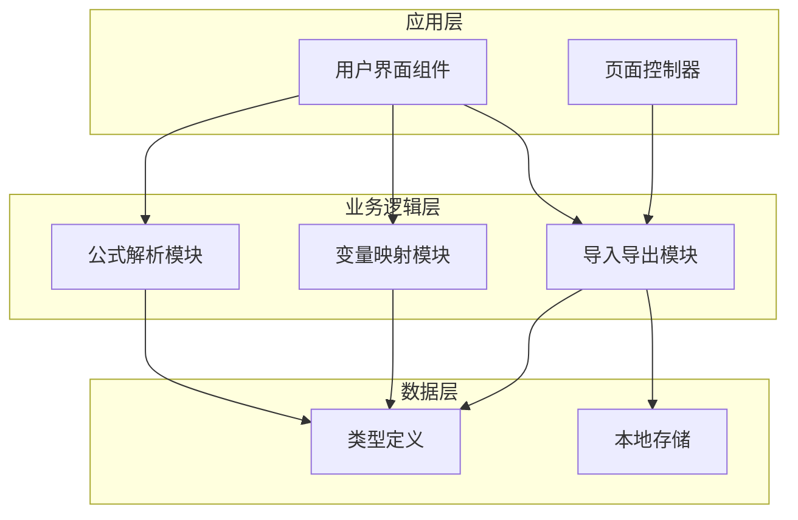
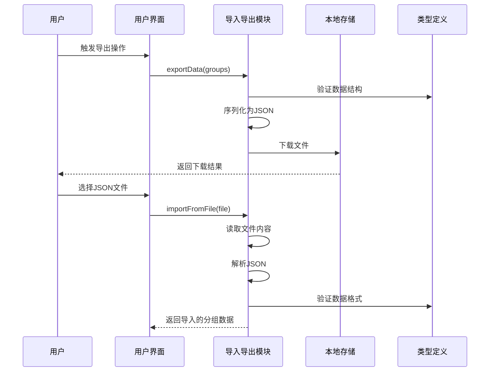
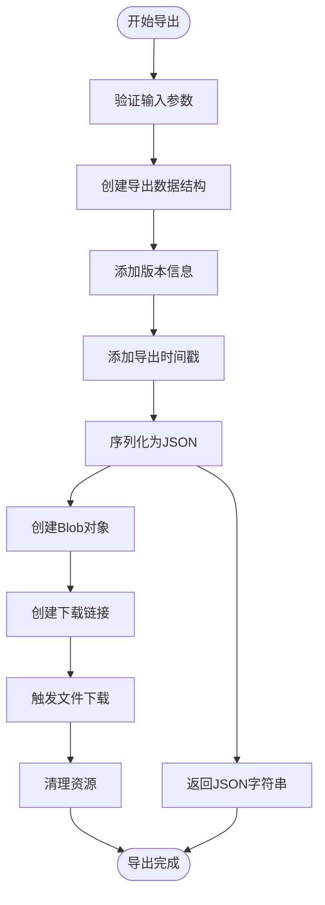
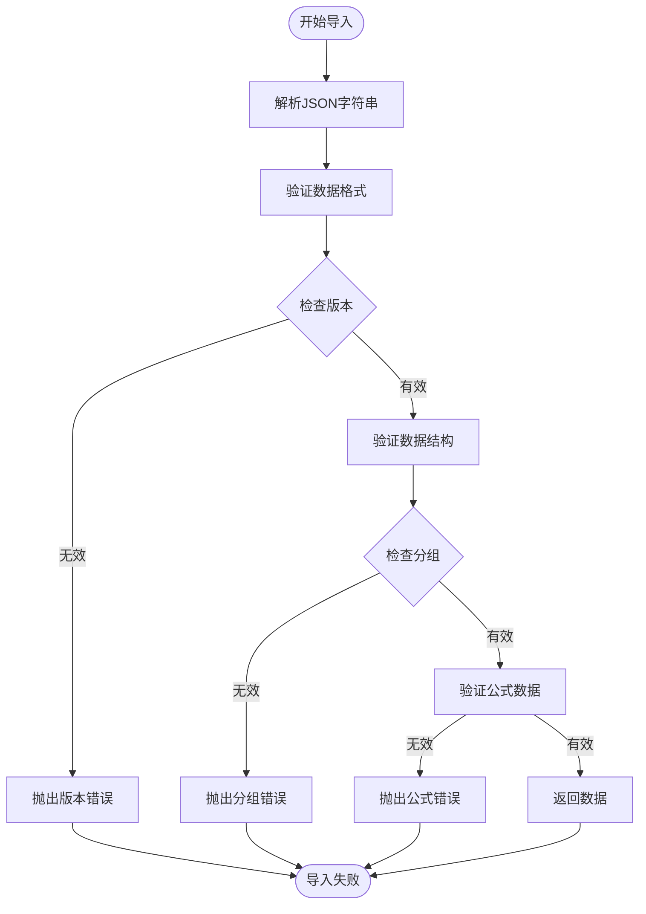
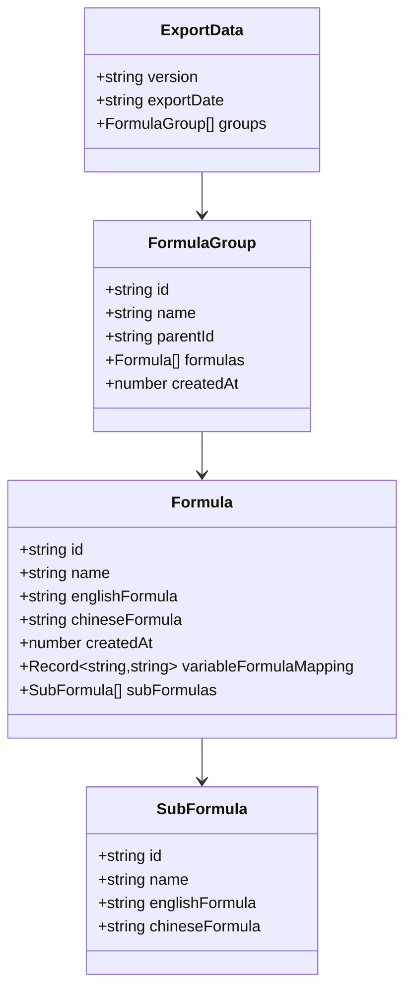
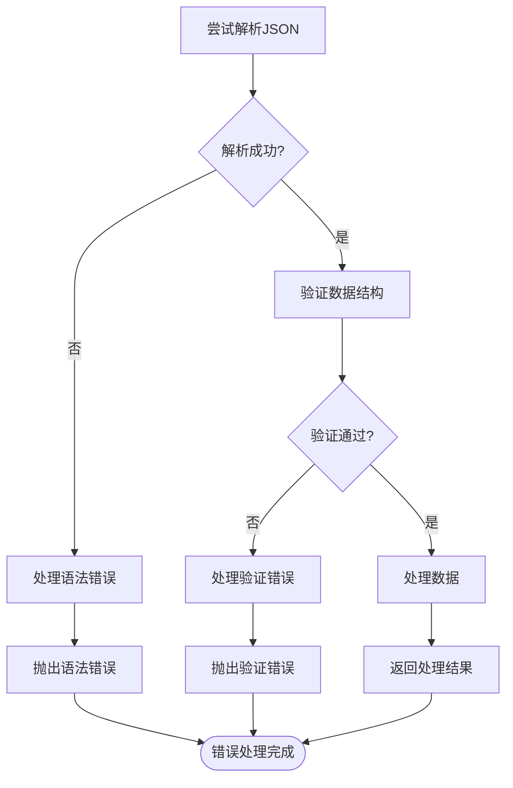
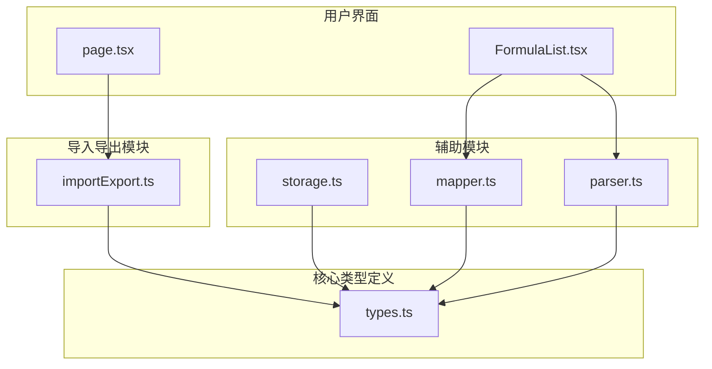
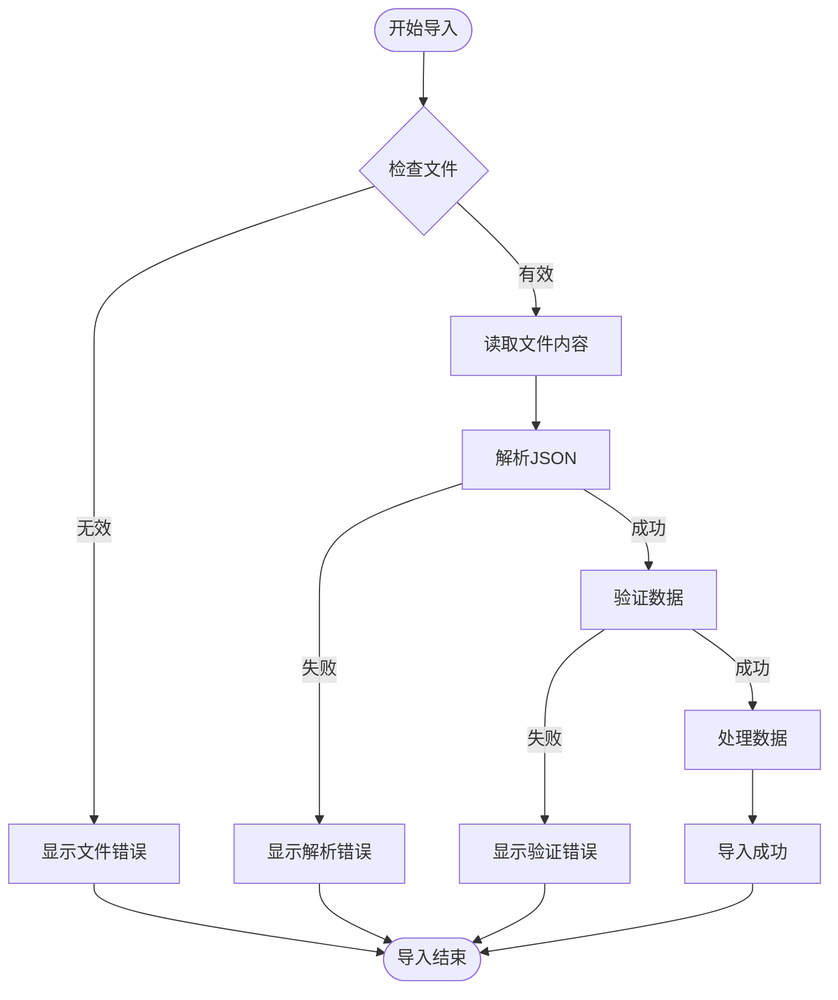

# 导入导出API

<cite>
**本文档引用的文件**
- [importExport.ts](file://src/lib/importExport.ts)
- [mapper.ts](file://src/lib/mapper.ts)
- [parser.ts](file://src/lib/parser.ts)
- [types.ts](file://src/lib/types.ts)
- [storage.ts](file://src/lib/storage.ts)
- [page.tsx](file://src/app/page.tsx)
- [FormulaList.tsx](file://src/components/FormulaList.tsx)
</cite>

## 目录
1. [简介](#简介)
2. [项目结构](#项目结构)
3. [核心组件](#核心组件)
4. [架构概览](#架构概览)
5. [详细组件分析](#详细组件分析)
6. [依赖分析](#依赖分析)
7. [性能考虑](#性能考虑)
8. [故障排除指南](#故障排除指南)
9. [结论](#结论)
10. [附录](#附录)

## 简介

公式变量映射与可视化工具的导入导出API提供了完整的数据持久化和数据交换功能。该系统支持将公式分组数据导出为标准JSON格式，以及从JSON文件导入数据，实现了数据的跨设备传输和备份恢复。

本API的核心功能包括：
- **数据导出**：将当前的公式分组结构导出为标准化的JSON格式
- **数据导入**：从JSON文件导入公式数据，支持数据验证和错误处理
- **数据格式规范**：定义了完整的数据结构规范和版本控制机制
- **数据转换逻辑**：实现了从内存数据到文件格式的转换和反向转换

## 项目结构

该项目采用模块化的架构设计，主要由以下核心模块组成：



**图表来源**
- [importExport.ts:1-101](file://src/lib/importExport.ts#L1-L101)
- [mapper.ts:1-89](file://src/lib/mapper.ts#L1-L89)
- [parser.ts:1-159](file://src/lib/parser.ts#L1-L159)
- [storage.ts:1-50](file://src/lib/storage.ts#L1-L50)

**章节来源**
- [importExport.ts:1-101](file://src/lib/importExport.ts#L1-L101)
- [mapper.ts:1-89](file://src/lib/mapper.ts#L1-L89)
- [parser.ts:1-159](file://src/lib/parser.ts#L1-L159)
- [storage.ts:1-50](file://src/lib/storage.ts#L1-L50)

## 核心组件

### 导入导出模块

导入导出模块是整个系统的核心，负责数据的序列化和反序列化工作。该模块提供了完整的API接口，支持JSON格式的数据交换。

**章节来源**
- [importExport.ts:12-101](file://src/lib/importExport.ts#L12-L101)

### 类型定义模块

类型定义模块定义了系统中使用的数据结构，确保导入导出过程中的数据一致性。

**章节来源**
- [types.ts:1-51](file://src/lib/types.ts#L1-L51)

### 变量映射模块

变量映射模块负责处理公式中的变量提取和映射关系建立，为导入导出提供数据转换支持。

**章节来源**
- [mapper.ts:3-89](file://src/lib/mapper.ts#L3-L89)

## 架构概览

系统采用分层架构设计，各组件职责明确，耦合度低，便于维护和扩展。



**图表来源**
- [importExport.ts:12-101](file://src/lib/importExport.ts#L12-L101)
- [page.tsx:362-390](file://src/app/page.tsx#L362-L390)

## 详细组件分析

### 导入导出API接口规范

#### 导出功能

导出功能提供了两种方式的数据导出：

1. **字符串导出**：将数据转换为JSON字符串
2. **文件下载**：直接下载JSON文件



**图表来源**
- [importExport.ts:12-38](file://src/lib/importExport.ts#L12-L38)

#### 导入功能

导入功能支持从JSON字符串和文件两种方式导入数据，并包含完整的数据验证机制。



**图表来源**
- [importExport.ts:43-101](file://src/lib/importExport.ts#L43-L101)

**章节来源**
- [importExport.ts:12-101](file://src/lib/importExport.ts#L12-L101)

### 数据格式规范

#### 导出数据结构

导出的JSON数据遵循严格的结构规范：



**图表来源**
- [types.ts:3-51](file://src/lib/types.ts#L3-L51)

#### 版本兼容性

系统采用版本控制机制，当前版本为1.0，支持未来的向后兼容性扩展。

**章节来源**
- [types.ts:3-51](file://src/lib/types.ts#L3-L51)

### 数据验证机制

导入过程包含多层次的数据验证：

1. **JSON格式验证**：检查JSON语法正确性
2. **结构完整性验证**：确保必需字段存在
3. **数据类型验证**：验证字段类型和格式
4. **业务规则验证**：检查数据之间的逻辑关系

**章节来源**
- [importExport.ts:43-75](file://src/lib/importExport.ts#L43-L75)

### 错误处理策略

系统实现了完善的错误处理机制：



**图表来源**
- [importExport.ts:69-75](file://src/lib/importExport.ts#L69-L75)

**章节来源**
- [importExport.ts:69-75](file://src/lib/importExport.ts#L69-L75)

## 依赖分析

系统各模块之间的依赖关系清晰明确：



**图表来源**
- [importExport.ts:1](file://src/lib/importExport.ts#L1)
- [types.ts:1](file://src/lib/types.ts#L1)
- [storage.ts:1](file://src/lib/storage.ts#L1)
- [mapper.ts:1](file://src/lib/mapper.ts#L1)
- [parser.ts:1](file://src/lib/parser.ts#L1)

**章节来源**
- [importExport.ts:1](file://src/lib/importExport.ts#L1)
- [types.ts:1](file://src/lib/types.ts#L1)
- [storage.ts:1](file://src/lib/storage.ts#L1)
- [mapper.ts:1](file://src/lib/mapper.ts#L1)
- [parser.ts:1](file://src/lib/parser.ts#L1)

## 性能考虑

### 内存使用优化

1. **流式处理**：导入功能使用FileReader进行异步文件读取，避免阻塞主线程
2. **增量处理**：导出功能支持增量数据处理，减少内存占用
3. **垃圾回收**：及时清理临时对象和DOM元素

### 文件处理优化

1. **Blob对象**：使用Blob对象处理大文件，提高下载性能
2. **缓存机制**：利用浏览器缓存机制，减少重复下载
3. **并发处理**：支持多个文件的并发导入处理

## 故障排除指南

### 常见导入错误

| 错误类型 | 错误信息 | 可能原因 | 解决方案 |
|---------|---------|---------|---------|
| JSON格式错误 | "JSON格式错误，请检查文件内容" | 文件不是有效的JSON格式 | 检查文件编码和格式 |
| 数据格式错误 | "无效的数据格式" | 缺少必需字段或字段类型错误 | 按照数据格式规范修正 |
| 分组格式错误 | "第 X 个分组的数据格式不正确" | 分组字段缺失或格式错误 | 检查分组的id、name、formulas字段 |
| 公式格式错误 | "第 X个分组中第 Y个公式的数据格式不正确" | 公式字段缺失或格式错误 | 检查公式的id、name、englishFormula、chineseFormula字段 |

### 导入流程调试



**图表来源**
- [importExport.ts:80-101](file://src/lib/importExport.ts#L80-L101)

**章节来源**
- [importExport.ts:80-101](file://src/lib/importExport.ts#L80-L101)

## 结论

公式变量映射与可视化工具的导入导出API提供了完整、可靠的数据管理解决方案。系统具有以下特点：

1. **完整的数据格式规范**：定义了清晰的数据结构和版本控制机制
2. **强大的数据验证**：多层级的数据验证确保数据质量
3. **健壮的错误处理**：完善的错误处理机制提供良好的用户体验
4. **高效的性能表现**：优化的内存使用和文件处理机制
5. **易于扩展的设计**：模块化的架构便于功能扩展和维护

该API为用户提供了便捷的数据导入导出功能，支持数据的备份、迁移和共享，是公式管理系统的重要组成部分。

## 附录

### 使用示例

#### 导出数据示例

```typescript
// 导出所有分组数据
const groups = getGroups(); // 获取当前分组数据
downloadExportData(groups);

// 自定义文件名导出
downloadExportData(groups, 'my-formula-data.json');
```

#### 导入数据示例

```typescript
// 从文件导入数据
const fileInput = document.getElementById('fileInput');
fileInput.addEventListener('change', async (event) => {
  const file = event.target.files[0];
  try {
    const importedGroups = await importFromFile(file);
    setGroups(importedGroups);
    alert('数据导入成功！');
  } catch (error) {
    alert('导入失败：' + error.message);
  }
});
```

### 最佳实践建议

1. **数据备份**：定期导出数据进行备份
2. **格式验证**：导入前检查JSON文件格式
3. **错误处理**：妥善处理导入过程中的各种异常情况
4. **性能优化**：大量数据导入时考虑分批处理
5. **版本兼容**：注意数据格式版本变化对导入的影响