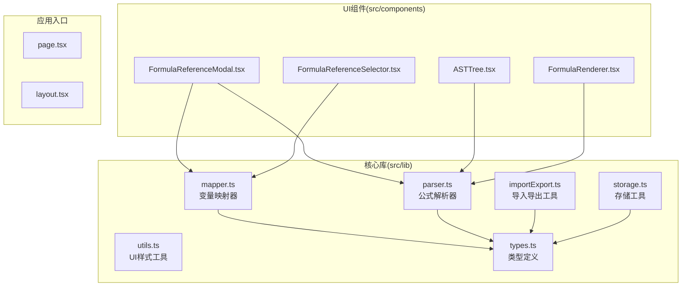
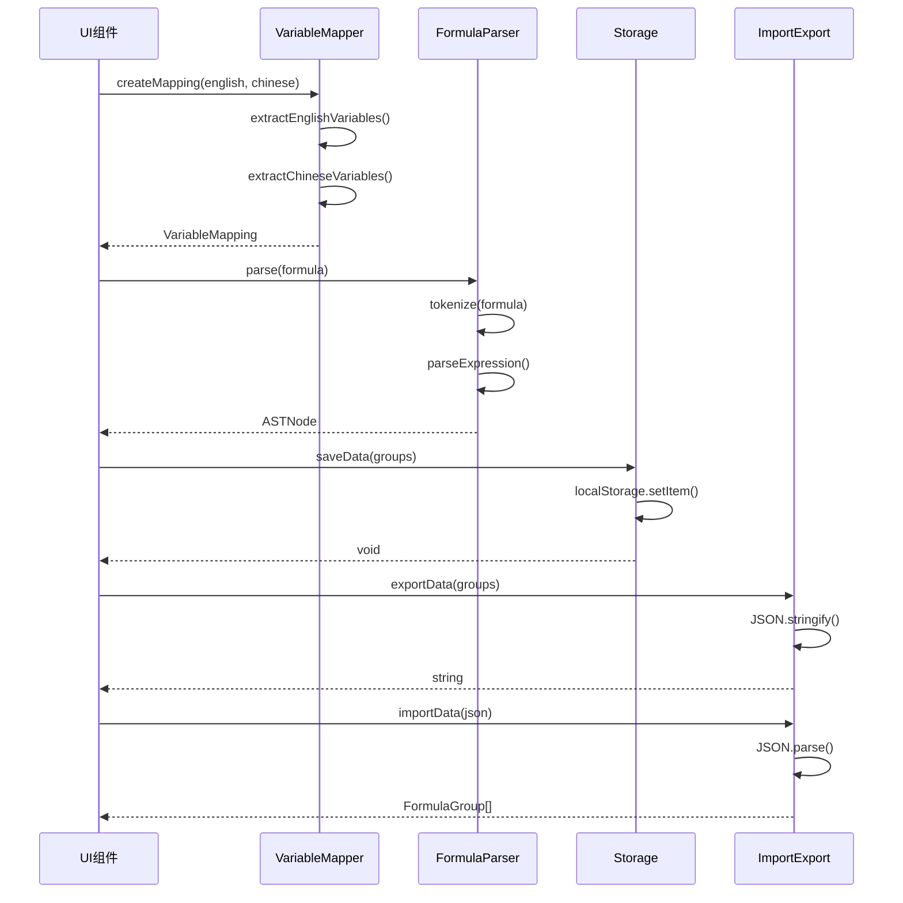
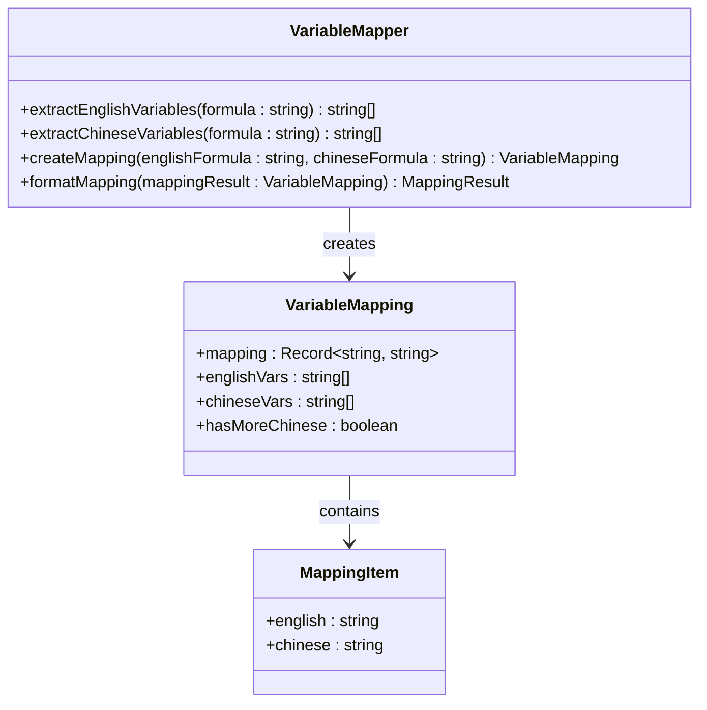
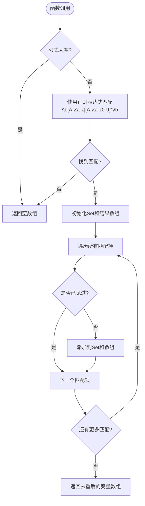
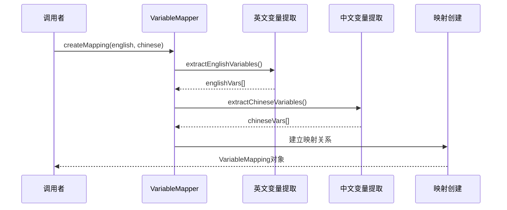
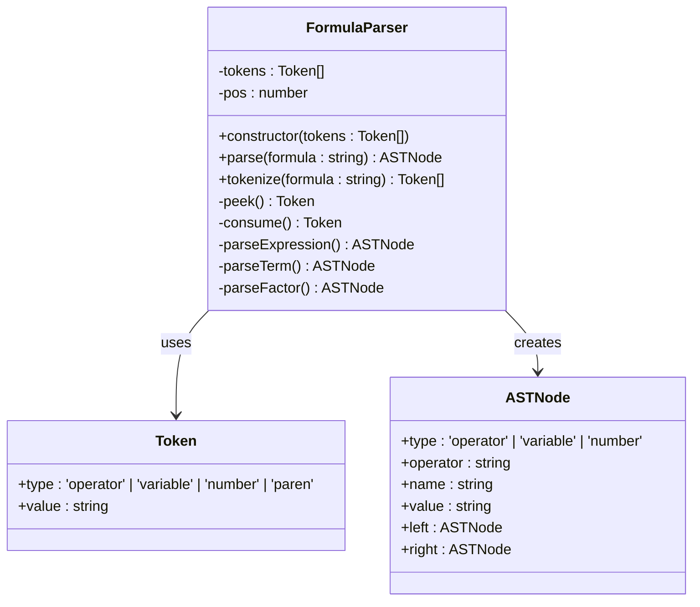
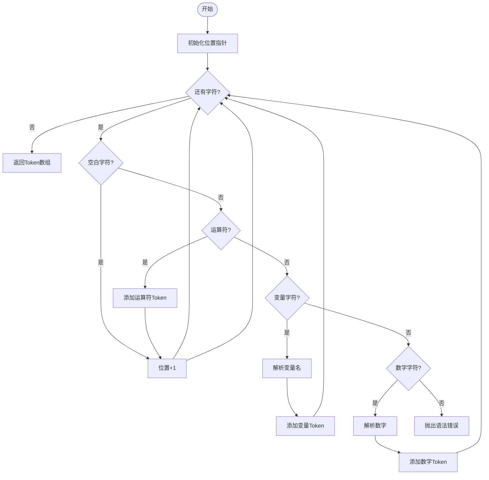
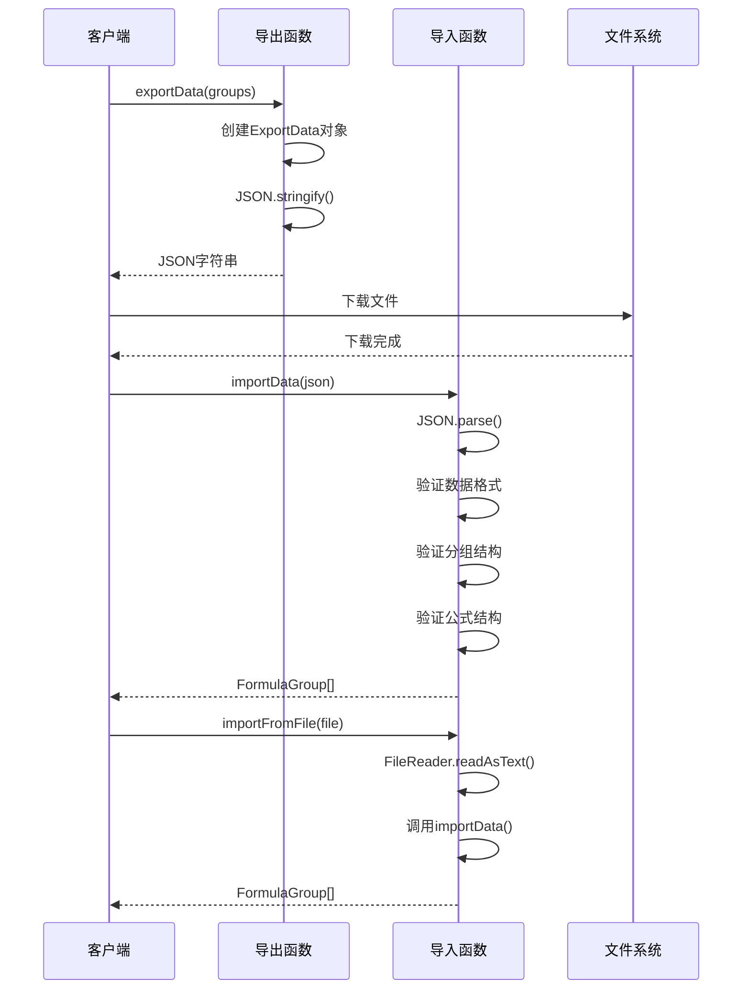
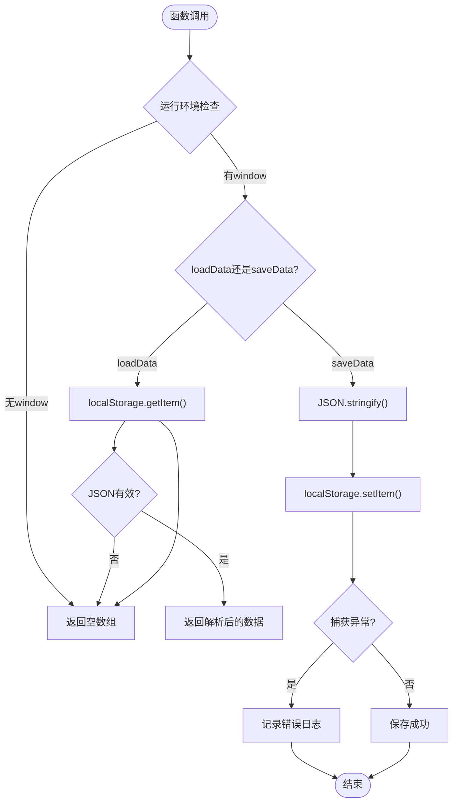
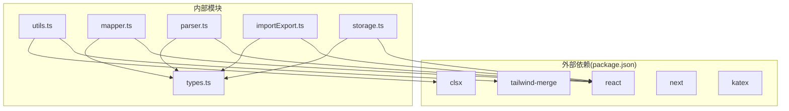

# 工具函数API

<cite>
**本文档引用的文件**
- [src/lib/utils.ts](file://src/lib/utils.ts)
- [src/lib/mapper.ts](file://src/lib/mapper.ts)
- [src/lib/parser.ts](file://src/lib/parser.ts)
- [src/lib/importExport.ts](file://src/lib/importExport.ts)
- [src/lib/storage.ts](file://src/lib/storage.ts)
- [src/lib/types.ts](file://src/lib/types.ts)
- [src/components/FormulaReferenceSelector.tsx](file://src/components/FormulaReferenceSelector.tsx)
- [src/components/FormulaReferenceModal.tsx](file://src/components/FormulaReferenceModal.tsx)
- [src/components/ASTTree.tsx](file://src/components/ASTTree.tsx)
- [src/components/FormulaRenderer.tsx](file://src/components/FormulaRenderer.tsx)
- [package.json](file://package.json)
</cite>

## 目录
1. [简介](#简介)
2. [项目结构](#项目结构)
3. [核心组件](#核心组件)
4. [架构概览](#架构概览)
5. [详细组件分析](#详细组件分析)
6. [依赖分析](#依赖分析)
7. [性能考虑](#性能考虑)
8. [故障排除指南](#故障排除指南)
9. [结论](#结论)
10. [附录](#附录)

## 简介

本文件为公式变量映射与可视化工具的工具函数API参考文档。该工具集提供了公式解析、变量提取、数据导入导出、本地存储等核心功能，支持中英文公式混合处理和变量映射可视化。

工具函数主要分布在以下模块中：
- **变量映射器**：处理中英文公式的变量提取和映射
- **公式解析器**：将字符串公式解析为抽象语法树(AST)
- **导入导出工具**：处理数据的序列化和反序列化
- **存储工具**：提供本地数据持久化功能
- **UI工具**：提供组件级的样式和工具函数

## 项目结构

该项目采用基于功能的模块组织方式，核心工具函数位于`src/lib/`目录下，UI组件位于`src/components/`目录下。



**图表来源**
- [src/lib/utils.ts:1-7](file://src/lib/utils.ts#L1-L7)
- [src/lib/mapper.ts:1-89](file://src/lib/mapper.ts#L1-L89)
- [src/lib/parser.ts:1-159](file://src/lib/parser.ts#L1-L159)
- [src/lib/importExport.ts:1-120](file://src/lib/importExport.ts#L1-L120)
- [src/lib/storage.ts:1-50](file://src/lib/storage.ts#L1-L50)

**章节来源**
- [src/lib/utils.ts:1-7](file://src/lib/utils.ts#L1-L7)
- [src/lib/mapper.ts:1-89](file://src/lib/mapper.ts#L1-L89)
- [src/lib/parser.ts:1-159](file://src/lib/parser.ts#L1-L159)
- [src/lib/importExport.ts:1-120](file://src/lib/importExport.ts#L1-L120)
- [src/lib/storage.ts:1-50](file://src/lib/storage.ts#L1-L50)

## 核心组件

### 变量映射器 (VariableMapper)

VariableMapper类提供中英文公式变量提取和映射功能，支持去重和格式化输出。

**主要功能**：
- 提取英文变量：使用正则表达式匹配`\b[A-Za-z][A-Za-z0-9]*\b`
- 提取中文变量：通过运算符分割提取中文变量
- 创建变量映射：建立英文变量到中文变量的对应关系
- 格式化映射结果：转换为标准化的映射项数组

**复杂度分析**：
- 时间复杂度：O(n)，其中n为公式长度
- 空间复杂度：O(k)，其中k为变量数量

**章节来源**
- [src/lib/mapper.ts:3-88](file://src/lib/mapper.ts#L3-L88)

### 公式解析器 (FormulaParser)

FormulaParser类负责将字符串公式解析为抽象语法树，支持多种运算符和括号类型。

**主要功能**：
- 词法分析：将字符串分解为Token序列
- 语法分析：构建AST节点树
- 支持运算符：+, -, *, /以及中英文括号
- 递归下降解析：处理运算符优先级

**复杂度分析**：
- 时间复杂度：O(n)，其中n为公式长度
- 空间复杂度：O(h)，其中h为表达式深度

**章节来源**
- [src/lib/parser.ts:3-159](file://src/lib/parser.ts#L3-L159)

### 导入导出工具 (ImportExport)

提供完整的数据导入导出功能，支持JSON格式的数据交换。

**主要功能**：
- 数据导出：将分组数据序列化为JSON格式
- 文件下载：生成并下载JSON文件
- 数据导入：从JSON字符串解析数据
- 文件导入：从本地文件读取数据
- URL导入：从远程URL获取数据

**复杂度分析**：
- 时间复杂度：O(n)，其中n为数据大小
- 空间复杂度：O(n)，用于存储JSON数据

**章节来源**
- [src/lib/importExport.ts:1-120](file://src/lib/importExport.ts#L1-L120)

### 存储工具 (Storage)

提供本地数据持久化功能，基于localStorage实现。

**主要功能**：
- 数据加载：从localStorage读取数据
- 数据保存：将数据写入localStorage
- 组创建：创建新的公式分组
- 公式创建：创建新的公式条目
- ID生成：生成唯一标识符

**复杂度分析**：
- 时间复杂度：O(1)
- 空间复杂度：O(n)，其中n为存储数据量

**章节来源**
- [src/lib/storage.ts:1-50](file://src/lib/storage.ts#L1-L50)

### UI工具 (Utils)

提供组件级的样式和工具函数支持。

**主要功能**：
- cn函数：合并和合并Tailwind CSS类名
- 基于clsx和tailwind-merge的样式处理

**复杂度分析**：
- 时间复杂度：O(m)，其中m为输入参数数量
- 空间复杂度：O(p)，其中p为最终类名字符串长度

**章节来源**
- [src/lib/utils.ts:1-7](file://src/lib/utils.ts#L1-L7)

## 架构概览

工具函数在整个系统中的交互关系如下：



**图表来源**
- [src/lib/mapper.ts:52-70](file://src/lib/mapper.ts#L52-L70)
- [src/lib/parser.ts:12-22](file://src/lib/parser.ts#L12-L22)
- [src/lib/storage.ts:17-25](file://src/lib/storage.ts#L17-L25)
- [src/lib/importExport.ts:12-20](file://src/lib/importExport.ts#L12-L20)

## 详细组件分析

### VariableMapper 类分析

VariableMapper是一个静态类，提供完整的变量映射功能。



**图表来源**
- [src/lib/mapper.ts:3-88](file://src/lib/mapper.ts#L3-L88)
- [src/lib/types.ts:15-25](file://src/lib/types.ts#L15-L25)

#### extractEnglishVariables 方法

提取英文变量的核心算法：



**图表来源**
- [src/lib/mapper.ts:4-27](file://src/lib/mapper.ts#L4-L27)

**复杂度分析**：
- 时间复杂度：O(n + k)，其中n为公式长度，k为匹配数量
- 空间复杂度：O(k)，用于存储唯一变量

**章节来源**
- [src/lib/mapper.ts:4-27](file://src/lib/mapper.ts#L4-L27)

#### createMapping 方法

创建变量映射的核心流程：



**图表来源**
- [src/lib/mapper.ts:52-70](file://src/lib/mapper.ts#L52-L70)

**复杂度分析**：
- 时间复杂度：O(n + m)，其中n为英文公式长度，m为中文公式长度
- 空间复杂度：O(k + l)，其中k为英文变量数，l为中文变量数

**章节来源**
- [src/lib/mapper.ts:52-70](file://src/lib/mapper.ts#L52-L70)

### FormulaParser 类分析

FormulaParser实现了完整的数学公式解析功能。



**图表来源**
- [src/lib/parser.ts:3-159](file://src/lib/parser.ts#L3-L159)
- [src/lib/types.ts:1-13](file://src/lib/types.ts#L1-L13)

#### 词法分析算法

tokenize方法的详细流程：



**图表来源**
- [src/lib/parser.ts:24-68](file://src/lib/parser.ts#L24-L68)

**复杂度分析**：
- 时间复杂度：O(n)，其中n为公式长度
- 空间复杂度：O(n)，用于存储Token数组

**章节来源**
- [src/lib/parser.ts:24-68](file://src/lib/parser.ts#L24-L68)

### ImportExport 工具函数分析

导入导出工具提供了完整的数据交换功能。



**图表来源**
- [src/lib/importExport.ts:12-75](file://src/lib/importExport.ts#L12-L75)

**复杂度分析**：
- 时间复杂度：O(n)，其中n为数据大小
- 空间复杂度：O(n)，用于存储JSON数据

**章节来源**
- [src/lib/importExport.ts:12-120](file://src/lib/importExport.ts#L12-L120)

### Storage 工具函数分析

存储工具提供了本地数据持久化功能。



**图表来源**
- [src/lib/storage.ts:5-25](file://src/lib/storage.ts#L5-L25)

**复杂度分析**：
- 时间复杂度：O(1)
- 空间复杂度：O(n)，其中n为存储数据量

**章节来源**
- [src/lib/storage.ts:5-25](file://src/lib/storage.ts#L5-L25)

## 依赖分析

项目的主要依赖关系如下：



**图表来源**
- [package.json:15-34](file://package.json#L15-L34)
- [src/lib/utils.ts:1-2](file://src/lib/utils.ts#L1-L2)
- [src/lib/mapper.ts](file://src/lib/mapper.ts#L1)
- [src/lib/parser.ts](file://src/lib/parser.ts#L1)

**章节来源**
- [package.json:15-34](file://package.json#L15-L34)

## 性能考虑

### 时间复杂度优化

1. **变量提取优化**：使用Set进行去重，避免重复扫描
2. **正则表达式缓存**：在多次调用中复用正则表达式对象
3. **懒加载策略**：仅在需要时进行数据解析和映射

### 空间复杂度优化

1. **流式处理**：避免同时存储大量中间结果
2. **按需分配**：根据实际需求动态分配内存
3. **垃圾回收**：及时释放不再使用的临时对象

### 最佳实践建议

1. **批量操作**：对于大量数据，使用批量处理而非逐个处理
2. **缓存策略**：对频繁访问的数据建立缓存机制
3. **错误处理**：始终包含适当的错误处理和边界检查
4. **内存管理**：定期清理不需要的数据引用

## 故障排除指南

### 常见问题及解决方案

1. **变量提取不准确**
   - 检查公式中是否包含特殊字符
   - 确认正则表达式是否正确匹配变量格式

2. **公式解析失败**
   - 验证运算符是否正确使用
   - 检查括号是否正确配对
   - 确认变量命名规则

3. **数据导入导出错误**
   - 验证JSON格式是否正确
   - 检查数据结构是否符合预期
   - 确认文件编码格式

4. **本地存储问题**
   - 检查浏览器是否支持localStorage
   - 验证存储空间是否充足
   - 确认数据格式是否正确

**章节来源**
- [src/lib/mapper.ts:4-27](file://src/lib/mapper.ts#L4-L27)
- [src/lib/parser.ts:119-157](file://src/lib/parser.ts#L119-L157)
- [src/lib/importExport.ts:43-75](file://src/lib/importExport.ts#L43-L75)
- [src/lib/storage.ts:8-14](file://src/lib/storage.ts#L8-L14)

## 结论

本工具函数API提供了完整的公式变量映射与可视化功能，具有以下特点：

1. **模块化设计**：功能清晰分离，便于维护和扩展
2. **高性能实现**：采用优化的算法和数据结构
3. **类型安全**：完整的TypeScript类型定义
4. **易于使用**：提供直观的API接口和丰富的使用示例

推荐在实际项目中：
- 根据具体需求选择合适的工具函数组合
- 注意性能优化和错误处理
- 建立完善的测试覆盖
- 文档化自定义扩展点

## 附录

### 使用示例

#### 基本变量映射
```typescript
// 创建变量映射
const mapping = VariableMapper.createMapping(
  "A + B * C",
  "甲 + 乙 × 丙"
);

// 格式化映射结果
const formatted = VariableMapper.formatMapping(mapping);
```

#### 公式解析
```typescript
// 解析公式为AST
const ast = FormulaParser.parse("A + B * C");
```

#### 数据导入导出
```typescript
// 导出数据
const jsonData = exportData(formulaGroups);

// 从文件导入
importFromFile(file).then(groups => {
  // 处理导入的数据
});
```

#### 本地存储
```typescript
// 保存数据
saveData(formulaGroups);

// 加载数据
const loadedGroups = loadData();
```

### 扩展机制

1. **自定义变量提取规则**：可以通过修改正则表达式或添加新的提取函数
2. **新运算符支持**：在解析器中添加新的运算符类型和处理逻辑
3. **自定义存储后端**：实现新的存储接口以支持不同的数据存储方案
4. **UI组件扩展**：基于现有工具函数创建新的可视化组件

### 最佳实践

1. **错误处理**：始终包含适当的错误处理和用户友好的错误消息
2. **性能监控**：对关键函数进行性能监控和优化
3. **版本兼容性**：保持API的向后兼容性
4. **文档维护**：及时更新API文档和使用示例
5. **测试覆盖**：建立全面的单元测试和集成测试