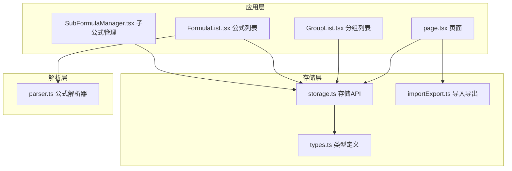
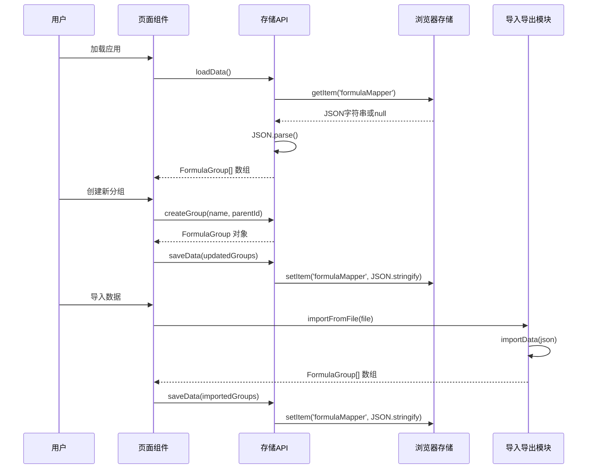
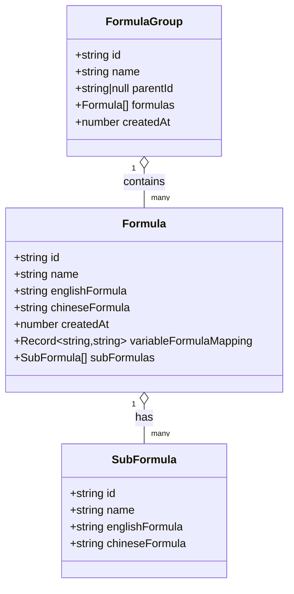
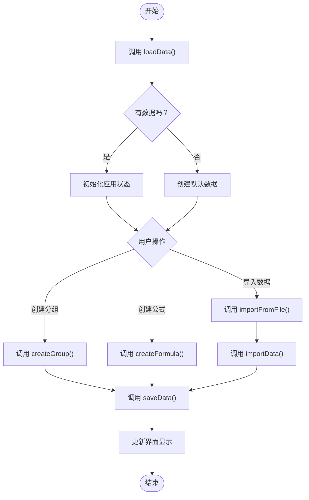
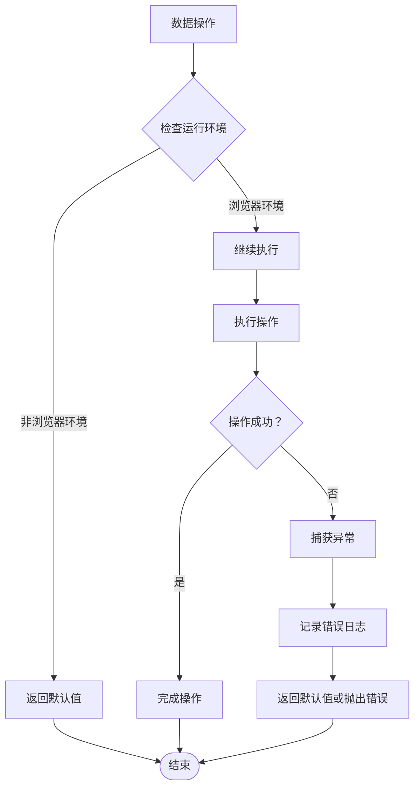
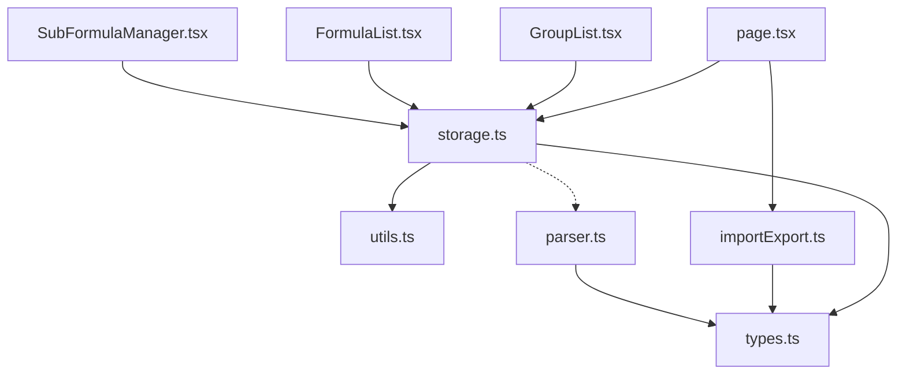

# 数据存储API

<cite>
**本文档引用的文件**
- [storage.ts](file://src/lib/storage.ts)
- [types.ts](file://src/lib/types.ts)
- [importExport.ts](file://src/lib/importExport.ts)
- [page.tsx](file://src/app/page.tsx)
- [GroupList.tsx](file://src/components/GroupList.tsx)
- [FormulaList.tsx](file://src/components/FormulaList.tsx)
- [SubFormulaManager.tsx](file://src/components/SubFormulaManager.tsx)
- [parser.ts](file://src/lib/parser.ts)
</cite>

## 目录
1. [简介](#简介)
2. [项目结构](#项目结构)
3. [核心组件](#核心组件)
4. [架构概览](#架构概览)
5. [详细组件分析](#详细组件分析)
6. [依赖分析](#依赖分析)
7. [性能考虑](#性能考虑)
8. [故障排除指南](#故障排除指南)
9. [结论](#结论)

## 简介
本文件为公式变量映射与可视化工具的数据存储API提供详细的参考文档。该工具允许用户创建分组来组织公式，通过变量映射和AST树可视化公式结构，并支持数据的导入导出功能。本文档重点记录以下API的完整规范：
- loadData()：从本地存储加载分组数据
- saveData()：将分组数据保存到本地存储
- createGroup()：创建新的公式分组
- createFormula()：创建新的公式
- generateId()：生成唯一标识符的辅助函数

同时，文档还涵盖错误处理机制、使用场景、参数说明、返回值定义以及实际使用示例。

## 项目结构
该项目采用React + Next.js前端架构，数据存储API位于src/lib目录下的storage.ts文件中，配合types.ts定义的数据结构和importExport.ts实现数据的导入导出功能。页面逻辑主要集中在src/app/page.tsx中，通过组件化的方式调用存储API。



**图表来源**
- [page.tsx:1-707](file://src/app/page.tsx#L1-L707)
- [storage.ts:1-50](file://src/lib/storage.ts#L1-L50)
- [types.ts:1-51](file://src/lib/types.ts#L1-L51)
- [importExport.ts:1-101](file://src/lib/importExport.ts#L1-L101)

**章节来源**
- [page.tsx:1-707](file://src/app/page.tsx#L1-L707)
- [storage.ts:1-50](file://src/lib/storage.ts#L1-L50)
- [types.ts:1-51](file://src/lib/types.ts#L1-L51)
- [importExport.ts:1-101](file://src/lib/importExport.ts#L1-L101)

## 核心组件
本节详细介绍数据存储API的核心函数及其功能特性。

### loadData() 函数
loadData()函数负责从浏览器本地存储中加载已保存的公式分组数据。

**函数签名**
```typescript
export function loadData(): FormulaGroup[]
```

**参数**
- 无参数

**返回值**
- 返回FormulaGroup[]类型的数组，如果本地存储为空或发生错误则返回空数组

**功能说明**
- 检测运行环境（避免在非浏览器环境中执行）
- 从localStorage获取存储的JSON数据
- 解析JSON字符串为JavaScript对象
- 异常处理：捕获解析错误并返回空数组

**使用场景**
- 应用启动时恢复用户数据
- 组件挂载时初始化状态
- 页面刷新后重新加载配置

**错误处理策略**
- 捕获JSON解析异常
- 捕获localStorage访问异常
- 发生错误时记录控制台错误信息并返回空数组

**章节来源**
- [storage.ts:5-15](file://src/lib/storage.ts#L5-L15)

### saveData() 函数
saveData()函数负责将当前的分组数据保存到浏览器本地存储中。

**函数签名**
```typescript
export function saveData(groups: FormulaGroup[]): void
```

**参数**
- groups: FormulaGroup[] - 要保存的分组数据数组

**返回值**
- 无返回值（void）

**功能说明**
- 检测运行环境（避免在非浏览器环境中执行）
- 将分组数据序列化为JSON字符串
- 写入localStorage
- 异常处理：捕获存储异常并记录错误信息

**使用场景**
- 用户创建、修改或删除分组后立即保存
- 应用退出前的持久化存储
- 数据变更后的实时备份

**错误处理策略**
- 捕获JSON序列化异常
- 捕获localStorage写入异常
- 发生错误时记录控制台错误信息但不中断程序执行

**章节来源**
- [storage.ts:17-25](file://src/lib/storage.ts#L17-L25)

### createGroup() 函数
createGroup()函数用于创建新的公式分组对象。

**函数签名**
```typescript
export function createGroup(name: string, parentId: string | null = null): FormulaGroup
```

**参数**
- name: string - 分组名称
- parentId: string | null - 父分组ID，默认为null（顶级分组）

**返回值**
- 返回FormulaGroup类型的对象

**功能说明**
- 生成唯一的分组ID
- 设置分组名称
- 设置父分组ID
- 初始化空的公式数组
- 设置创建时间戳

**ID生成机制**
- 使用generateId()辅助函数生成唯一标识符
- 格式：时间戳 + 连字符 + 随机字符串

**默认属性设置**
- id: 自动生成的唯一标识符
- name: 指定的分组名称
- parentId: 指定的父分组ID或null
- formulas: 空数组
- createdAt: 当前时间的时间戳

**使用场景**
- 用户创建新分组时
- 系统初始化默认分组时
- 导入数据时创建分组结构

**错误处理策略**
- 参数验证：确保name参数有效
- ID冲突：通过generateId()确保唯一性
- 数据完整性：保证所有必需字段都有默认值

**章节来源**
- [storage.ts:27-35](file://src/lib/storage.ts#L27-L35)

### createFormula() 函数
createFormula()函数用于创建新的公式对象。

**函数签名**
```typescript
export function createFormula(name: string, englishFormula: string, chineseFormula: string): Formula
```

**参数**
- name: string - 公式名称
- englishFormula: string - 英文公式表达式
- chineseFormula: string - 中文公式表达式

**返回值**
- 返回Formula类型的对象

**功能说明**
- 生成唯一的公式ID
- 设置公式的基本属性
- 初始化创建时间戳
- 预留扩展字段（变量映射和子公式）

**ID生成机制**
- 使用generateId()辅助函数生成唯一标识符
- 格式：时间戳 + 连字符 + 随机字符串

**默认属性设置**
- id: 自动生成的唯一标识符
- name: 指定的公式名称
- englishFormula: 指定的英文公式
- chineseFormula: 指定的中文公式
- createdAt: 当前时间的时间戳
- variableFormulaMapping: undefined（可选属性）
- subFormulas: undefined（可选属性）

**使用场景**
- 用户创建新公式时
- 系统导入数据时创建公式
- 公式复制或克隆时

**错误处理策略**
- 参数验证：确保所有必需参数有效
- ID冲突：通过generateId()确保唯一性
- 数据完整性：保证所有必需字段都有默认值

**章节来源**
- [storage.ts:37-45](file://src/lib/storage.ts#L37-L45)

### generateId() 函数
generateId()是一个内部辅助函数，用于生成全局唯一的标识符。

**函数签名**
```typescript
function generateId(): string
```

**参数**
- 无参数

**返回值**
- 返回string类型的唯一标识符

**实现细节**
- 结合当前时间戳和随机字符串生成
- 时间戳部分确保基本的顺序性
- 随机字符串部分提供额外的唯一性保障
- 格式：`{timestamp}-{randomString}`

**使用注意事项**
- 生成的ID在当前会话中是唯一的
- 不保证跨会话的绝对唯一性（极低概率重复）
- ID格式包含连字符，适合作为HTML元素ID使用
- 长度约为15-20个字符，便于存储和传输

**错误处理策略**
- 无参数，无需错误处理
- 生成失败时抛出异常（由底层API负责）

**章节来源**
- [storage.ts:47-49](file://src/lib/storage.ts#L47-L49)

## 架构概览
本节展示数据存储API在整个系统中的架构关系和交互流程。



**图表来源**
- [page.tsx:82-109](file://src/app/page.tsx#L82-L109)
- [storage.ts:5-25](file://src/lib/storage.ts#L5-L25)
- [importExport.ts:80-100](file://src/lib/importExport.ts#L80-L100)

**章节来源**
- [page.tsx:82-109](file://src/app/page.tsx#L82-L109)
- [storage.ts:5-25](file://src/lib/storage.ts#L5-L25)
- [importExport.ts:80-100](file://src/lib/importExport.ts#L80-L100)

## 详细组件分析

### 数据模型设计
系统使用强类型的数据结构来确保数据的一致性和完整性。



**图表来源**
- [types.ts:27-50](file://src/lib/types.ts#L27-L50)

**章节来源**
- [types.ts:27-50](file://src/lib/types.ts#L27-L50)

### API使用流程图
展示典型的数据操作流程。



**图表来源**
- [page.tsx:165-173](file://src/app/page.tsx#L165-L173)
- [page.tsx:222-239](file://src/app/page.tsx#L222-L239)
- [importExport.ts:80-100](file://src/lib/importExport.ts#L80-L100)

**章节来源**
- [page.tsx:165-173](file://src/app/page.tsx#L165-L173)
- [page.tsx:222-239](file://src/app/page.tsx#L222-L239)
- [importExport.ts:80-100](file://src/lib/importExport.ts#L80-L100)

### 错误处理机制
系统实现了多层次的错误处理机制来确保数据操作的可靠性。



**图表来源**
- [storage.ts:6-14](file://src/lib/storage.ts#L6-L14)
- [storage.ts:18-24](file://src/lib/storage.ts#L18-L24)

**章节来源**
- [storage.ts:6-14](file://src/lib/storage.ts#L6-L14)
- [storage.ts:18-24](file://src/lib/storage.ts#L18-L24)

## 依赖分析
本节分析数据存储API之间的依赖关系和耦合度。



**图表来源**
- [storage.ts:1-50](file://src/lib/storage.ts#L1-L50)
- [page.tsx:1-13](file://src/app/page.tsx#L1-L13)
- [importExport.ts:1-7](file://src/lib/importExport.ts#L1-L7)

**章节来源**
- [storage.ts:1-50](file://src/lib/storage.ts#L1-L50)
- [page.tsx:1-13](file://src/app/page.tsx#L1-L13)
- [importExport.ts:1-7](file://src/lib/importExport.ts#L1-L7)

## 性能考虑
- **内存使用**：localStorage存储限制为5-10MB，建议定期清理不需要的数据
- **序列化开销**：大量数据时JSON序列化可能影响性能，可考虑分批处理
- **渲染优化**：React组件使用useCallback和useState优化，避免不必要的重渲染
- **异步处理**：导入导出使用Promise和FileReader异步处理，不影响主线程

## 故障排除指南

### 常见问题及解决方案

**问题1：数据无法加载**
- 检查浏览器是否禁用了localStorage
- 验证存储的数据格式是否正确
- 确认JSON字符串是否有效

**问题2：数据保存失败**
- 检查浏览器存储空间是否充足
- 验证数据结构是否符合FormulaGroup接口
- 确认没有循环引用导致JSON序列化失败

**问题3：ID冲突问题**
- generateId()函数理论上不会产生冲突
- 如果出现冲突，检查是否有自定义ID生成逻辑

**问题4：导入数据格式错误**
- 确保导入文件包含version和groups字段
- 验证每个分组都有id、name和formulas属性
- 检查公式数据结构的完整性

**章节来源**
- [storage.ts:8-14](file://src/lib/storage.ts#L8-L14)
- [storage.ts:20-24](file://src/lib/storage.ts#L20-L24)
- [importExport.ts:43-75](file://src/lib/importExport.ts#L43-L75)

## 结论
本数据存储API提供了完整的公式分组和公式管理功能，具有以下特点：
- **简单易用**：API设计简洁，易于理解和使用
- **类型安全**：基于TypeScript的强类型定义，提供编译时类型检查
- **错误容错**：完善的异常处理机制，确保系统稳定性
- **扩展性强**：预留了变量映射和子公式等扩展字段
- **持久化可靠**：基于浏览器localStorage的可靠存储方案

通过loadData()、saveData()、createGroup()、createFormula()和generateId()这五个核心函数，用户可以轻松地管理公式分组和公式数据，享受流畅的使用体验。