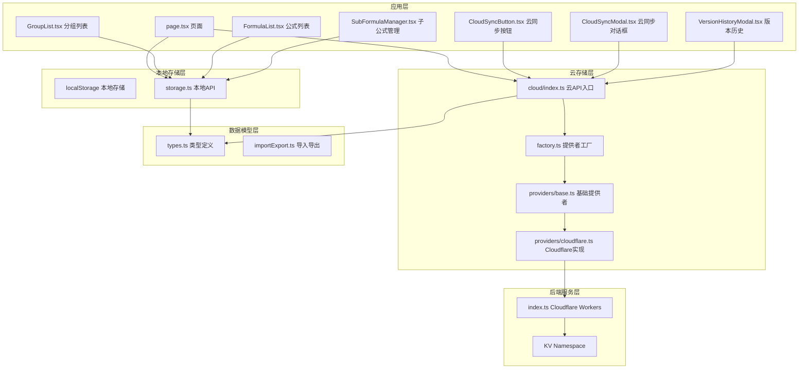
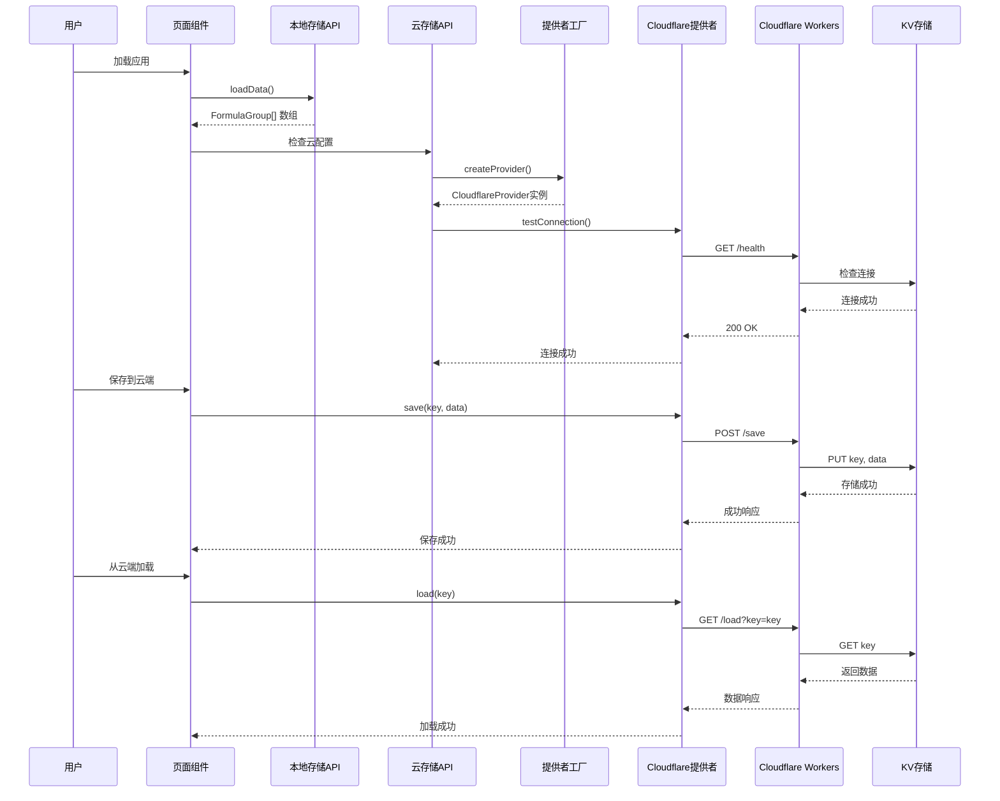
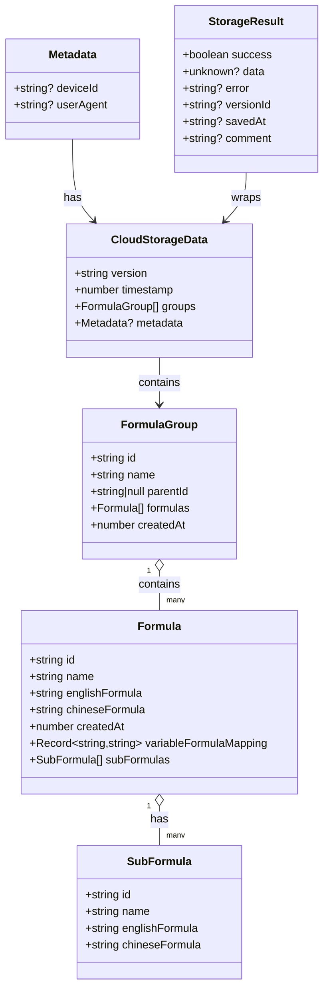
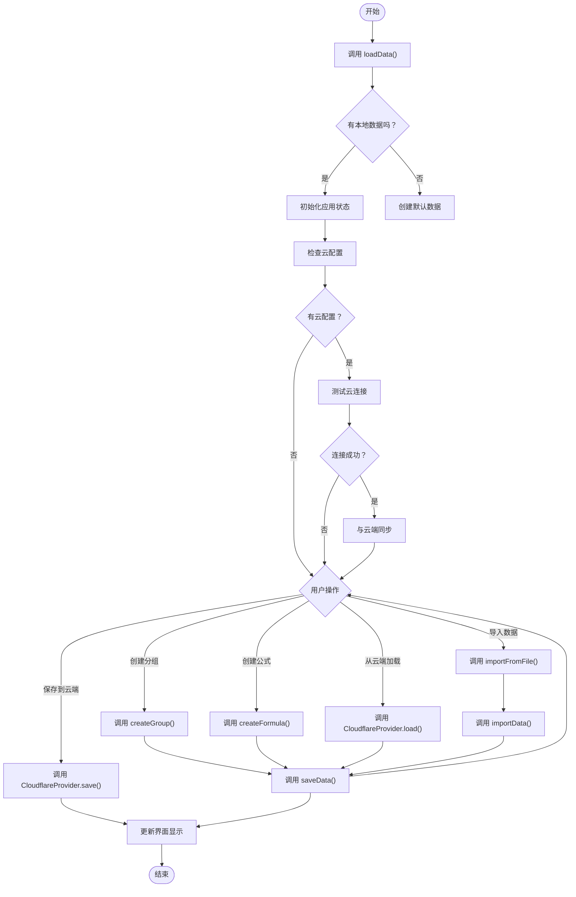
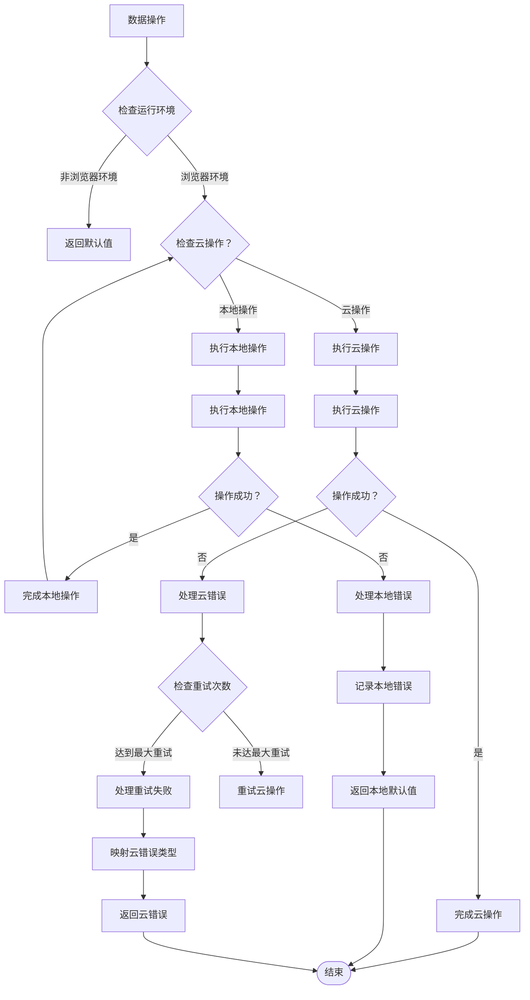
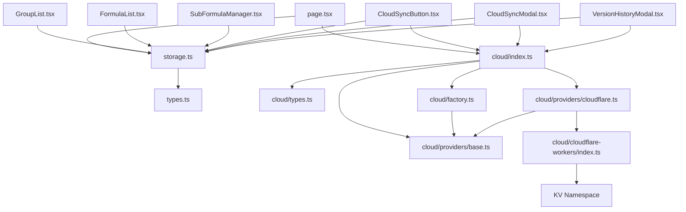

# 数据存储API

<cite>
**本文档引用的文件**
- [storage.ts](file://src/lib/storage.ts)
- [types.ts](file://src/lib/types.ts)
- [importExport.ts](file://src/lib/importExport.ts)
- [page.tsx](file://src/app/page.tsx)
- [GroupList.tsx](file://src/components/GroupList.tsx)
- [FormulaList.tsx](file://src/components/FormulaList.tsx)
- [SubFormulaManager.tsx](file://src/components/SubFormulaManager.tsx)
- [parser.ts](file://src/lib/parser.ts)
- [cloud/index.ts](file://src/lib/cloud/index.ts)
- [cloud/types.ts](file://src/lib/cloud/types.ts)
- [cloud/factory.ts](file://src/lib/cloud/factory.ts)
- [cloud/providers/base.ts](file://src/lib/cloud/providers/base.ts)
- [cloud/providers/cloudflare.ts](file://src/lib/cloud/providers/cloudflare.ts)
- [cloud/cloudflare-workers/index.ts](file://cloud/cloudflare-workers/index.ts)
- [cloud/cloudflare-workers/wrangler.toml](file://cloud/cloudflare-workers/wrangler.toml)
- [CloudSyncButton.tsx](file://src/components/CloudSyncButton.tsx)
- [CloudSyncModal.tsx](file://src/components/CloudSyncModal.tsx)
- [VersionHistoryModal.tsx](file://src/components/VersionHistoryModal.tsx)
</cite>

## 更新摘要
**所做更改**
- 新增云存储API接口章节，介绍统一的云存储抽象层
- 添加Cloudflare KV存储提供者实现详解
- 新增Cloudflare Workers后端服务部署指南
- 补充版本历史管理和数据同步功能说明
- 更新架构图展示云存储集成方案

## 目录
1. [简介](#简介)
2. [项目结构](#项目结构)
3. [核心组件](#核心组件)
4. [架构概览](#架构概览)
5. [详细组件分析](#详细组件分析)
6. [云存储API](#云存储api)
7. [Cloudflare KV存储提供者](#cloudflare-kv存储提供者)
8. [Cloudflare Workers后端服务](#cloudflare-workers后端服务)
9. [版本历史管理](#版本历史管理)
10. [依赖分析](#依赖分析)
11. [性能考虑](#性能考虑)
12. [故障排除指南](#故障排除指南)
13. [结论](#结论)

## 简介
本文件为公式变量映射与可视化工具的数据存储API提供详细的参考文档。该工具允许用户创建分组来组织公式，通过变量映射和AST树可视化公式结构，并支持本地存储和云存储的双重数据持久化方案。本文档重点记录以下API的完整规范：

**本地存储API**（保持不变）：
- loadData()：从本地存储加载分组数据
- saveData()：将分组数据保存到本地存储
- createGroup()：创建新的公式分组
- createFormula()：创建新的公式
- generateId()：生成唯一标识符的辅助函数

**新增云存储API**（全新功能）：
- CloudStorageProvider接口：统一的云存储抽象层
- CloudflareStorageProvider：Cloudflare KV存储实现
- StorageProviderFactory：存储提供者工厂模式
- CloudConfigManager：云存储配置管理
- 版本历史管理：自动版本控制和回滚功能

同时，文档还涵盖错误处理机制、使用场景、参数说明、返回值定义以及实际使用示例。

## 项目结构
该项目采用React + Next.js前端架构，数据存储API位于src/lib目录下，包含本地存储和云存储两个层次。云存储模块位于src/lib/cloud目录，配合Cloudflare Workers后端服务实现云端数据持久化。



**图表来源**
- [page.tsx:1-707](file://src/app/page.tsx#L1-L707)
- [storage.ts:1-50](file://src/lib/storage.ts#L1-L50)
- [cloud/index.ts:1-19](file://src/lib/cloud/index.ts#L1-L19)
- [cloud/providers/cloudflare.ts:1-238](file://src/lib/cloud/providers/cloudflare.ts#L1-L238)
- [cloud/cloudflare-workers/index.ts:1-314](file://cloud/cloudflare-workers/index.ts#L1-L314)

**章节来源**
- [page.tsx:1-707](file://src/app/page.tsx#L1-L707)
- [storage.ts:1-50](file://src/lib/storage.ts#L1-L50)
- [cloud/index.ts:1-19](file://src/lib/cloud/index.ts#L1-L19)
- [cloud/providers/cloudflare.ts:1-238](file://src/lib/cloud/providers/cloudflare.ts#L1-L238)
- [cloud/cloudflare-workers/index.ts:1-314](file://cloud/cloudflare-workers/index.ts#L1-L314)

## 核心组件
本节详细介绍数据存储API的核心函数及其功能特性。

### 本地存储API（保持不变）

#### loadData() 函数
loadData()函数负责从浏览器本地存储中加载已保存的公式分组数据。

**函数签名**
```typescript
export function loadData(): FormulaGroup[]
```

**参数**
- 无参数

**返回值**
- 返回FormulaGroup[]类型的数组，如果本地存储为空或发生错误则返回空数组

**功能说明**
- 检测运行环境（避免在非浏览器环境中执行）
- 从localStorage获取存储的JSON数据
- 解析JSON字符串为JavaScript对象
- 异常处理：捕获解析错误并返回空数组

**使用场景**
- 应用启动时恢复用户数据
- 组件挂载时初始化状态
- 页面刷新后重新加载配置

**错误处理策略**
- 捕获JSON解析异常
- 捕获localStorage访问异常
- 发生错误时记录控制台错误信息并返回空数组

**章节来源**
- [storage.ts:5-15](file://src/lib/storage.ts#L5-L15)

#### saveData() 函数
saveData()函数负责将当前的分组数据保存到浏览器本地存储中。

**函数签名**
```typescript
export function saveData(groups: FormulaGroup[]): void
```

**参数**
- groups: FormulaGroup[] - 要保存的分组数据数组

**返回值**
- 无返回值（void）

**功能说明**
- 检测运行环境（避免在非浏览器环境中执行）
- 将分组数据序列化为JSON字符串
- 写入localStorage
- 异常处理：捕获存储异常并记录错误信息

**使用场景**
- 用户创建、修改或删除分组后立即保存
- 应用退出前的持久化存储
- 数据变更后的实时备份

**错误处理策略**
- 捕获JSON序列化异常
- 捕获localStorage写入异常
- 发生错误时记录控制台错误信息但不中断程序执行

**章节来源**
- [storage.ts:17-25](file://src/lib/storage.ts#L17-L25)

#### createGroup() 函数
createGroup()函数用于创建新的公式分组对象。

**函数签名**
```typescript
export function createGroup(name: string, parentId: string | null = null): FormulaGroup
```

**参数**
- name: string - 分组名称
- parentId: string | null - 父分组ID，默认为null（顶级分组）

**返回值**
- 返回FormulaGroup类型的对象

**功能说明**
- 生成唯一的分组ID
- 设置分组名称
- 设置父分组ID
- 初始化空的公式数组
- 设置创建时间戳

**ID生成机制**
- 使用generateId()辅助函数生成唯一标识符
- 格式：时间戳 + 连字符 + 随机字符串

**默认属性设置**
- id: 自动生成的唯一标识符
- name: 指定的分组名称
- parentId: 指定的父分组ID或null
- formulas: 空数组
- createdAt: 当前时间的时间戳

**使用场景**
- 用户创建新分组时
- 系统初始化默认分组时
- 导入数据时创建分组结构

**错误处理策略**
- 参数验证：确保name参数有效
- ID冲突：通过generateId()确保唯一性
- 数据完整性：保证所有必需字段都有默认值

**章节来源**
- [storage.ts:27-35](file://src/lib/storage.ts#L27-L35)

#### createFormula() 函数
createFormula()函数用于创建新的公式对象。

**函数签名**
```typescript
export function createFormula(name: string, englishFormula: string, chineseFormula: string): Formula
```

**参数**
- name: string - 公式名称
- englishFormula: string - 英文公式表达式
- chineseFormula: string - 中文公式表达式

**返回值**
- 返回Formula类型的对象

**功能说明**
- 生成唯一的公式ID
- 设置公式的基本属性
- 初始化创建时间戳
- 预留扩展字段（变量映射和子公式）

**ID生成机制**
- 使用generateId()辅助函数生成唯一标识符
- 格式：时间戳 + 连字符 + 随机字符串

**默认属性设置**
- id: 自动生成的唯一标识符
- name: 指定的公式名称
- englishFormula: 指定的英文公式
- chineseFormula: 指定的中文公式
- createdAt: 当前时间的时间戳
- variableFormulaMapping: undefined（可选属性）
- subFormulas: undefined（可选属性）

**使用场景**
- 用户创建新公式时
- 系统导入数据时创建公式
- 公式复制或克隆时

**错误处理策略**
- 参数验证：确保所有必需参数有效
- ID冲突：通过generateId()确保唯一性
- 数据完整性：保证所有必需字段都有默认值

**章节来源**
- [storage.ts:37-45](file://src/lib/storage.ts#L37-L45)

#### generateId() 函数
generateId()是一个内部辅助函数，用于生成全局唯一的标识符。

**函数签名**
```typescript
function generateId(): string
```

**参数**
- 无参数

**返回值**
- 返回string类型的唯一标识符

**实现细节**
- 结合当前时间戳和随机字符串生成
- 时间戳部分确保基本的顺序性
- 随机字符串部分提供额外的唯一性保障
- 格式：`{timestamp}-{randomString}`

**使用注意事项**
- 生成的ID在当前会话中是唯一的
- 不保证跨会话的绝对唯一性（极低概率重复）
- ID格式包含连字符，适合作为HTML元素ID使用
- 长度约为15-20个字符，便于存储和传输

**错误处理策略**
- 无参数，无需错误处理
- 生成失败时抛出异常（由底层API负责）

**章节来源**
- [storage.ts:47-49](file://src/lib/storage.ts#L47-L49)

## 架构概览
本节展示数据存储API在整个系统中的架构关系和交互流程，包括新增的云存储集成。



**图表来源**
- [CloudSyncButton.tsx:40-95](file://src/components/CloudSyncButton.tsx#L40-L95)
- [CloudSyncModal.tsx:140-200](file://src/components/CloudSyncModal.tsx#L140-L200)
- [cloud/providers/cloudflare.ts:28-91](file://src/lib/cloud/providers/cloudflare.ts#L28-L91)
- [cloud/cloudflare-workers/index.ts:42-86](file://cloud/cloudflare-workers/index.ts#L42-L86)

**章节来源**
- [CloudSyncButton.tsx:40-95](file://src/components/CloudSyncButton.tsx#L40-L95)
- [CloudSyncModal.tsx:140-200](file://src/components/CloudSyncModal.tsx#L140-L200)
- [cloud/providers/cloudflare.ts:28-91](file://src/lib/cloud/providers/cloudflare.ts#L28-L91)
- [cloud/cloudflare-workers/index.ts:42-86](file://cloud/cloudflare-workers/index.ts#L42-L86)

## 详细组件分析

### 数据模型设计
系统使用强类型的数据结构来确保数据的一致性和完整性，包括新增的云存储数据格式。



**图表来源**
- [types.ts:27-50](file://src/lib/types.ts#L27-L50)
- [cloud/types.ts:32-61](file://src/lib/cloud/types.ts#L32-L61)

**章节来源**
- [types.ts:27-50](file://src/lib/types.ts#L27-L50)
- [cloud/types.ts:32-61](file://src/lib/cloud/types.ts#L32-L61)

### API使用流程图
展示典型的数据操作流程，包括本地存储和云存储的结合使用。



**图表来源**
- [CloudSyncButton.tsx:40-102](file://src/components/CloudSyncButton.tsx#L40-L102)
- [CloudSyncModal.tsx:140-200](file://src/components/CloudSyncModal.tsx#L140-L200)
- [storage.ts:5-25](file://src/lib/storage.ts#L5-L25)

**章节来源**
- [CloudSyncButton.tsx:40-102](file://src/components/CloudSyncButton.tsx#L40-L102)
- [CloudSyncModal.tsx:140-200](file://src/components/CloudSyncModal.tsx#L140-L200)
- [storage.ts:5-25](file://src/lib/storage.ts#L5-L25)

### 错误处理机制
系统实现了多层次的错误处理机制来确保数据操作的可靠性，包括新增的云存储错误处理。



**图表来源**
- [storage.ts:6-14](file://src/lib/storage.ts#L6-L14)
- [storage.ts:18-24](file://src/lib/storage.ts#L18-L24)
- [cloud/providers/base.ts:42-103](file://src/lib/cloud/providers/base.ts#L42-L103)

**章节来源**
- [storage.ts:6-14](file://src/lib/storage.ts#L6-L14)
- [storage.ts:18-24](file://src/lib/storage.ts#L18-L24)
- [cloud/providers/base.ts:42-103](file://src/lib/cloud/providers/base.ts#L42-L103)

## 云存储API

### CloudStorageProvider 接口
CloudStorageProvider是云存储的统一抽象接口，定义了所有云存储提供者必须实现的标准方法。

**接口定义**
```typescript
export interface CloudStorageProvider {
  readonly type: StorageProviderType;
  readonly name: string;
  
  save(key: string, data: CloudStorageData, comment?: string): Promise<StorageResult<void>>;
  load(key: string): Promise<StorageResult<CloudStorageData>>;
  loadVersion(key: string, versionId: string): Promise<StorageResult<CloudStorageData>>;
  getVersions(key: string): Promise<StorageResult<VersionHistoryItem[]>>;
  delete(key: string): Promise<StorageResult<void>>;
  list(): Promise<StorageResult<string[]>>;
  testConnection(): Promise<StorageResult<void>>;
}
```

**方法说明**
- `save()`: 保存数据到云端，支持版本备注
- `load()`: 从云端加载指定键的数据
- `loadVersion()`: 加载指定版本的历史数据
- `getVersions()`: 获取版本历史列表
- `delete()`: 删除云端数据及所有版本
- `list()`: 列出所有云端数据键
- `testConnection()`: 测试云连接可用性

**使用场景**
- 统一不同云存储提供商的API接口
- 支持未来扩展其他存储提供商
- 提供一致的错误处理和重试机制

**章节来源**
- [cloud/types.ts:67-120](file://src/lib/cloud/types.ts#L67-L120)

### StorageProviderFactory 工厂类
StorageProviderFactory实现了工厂模式，用于创建和管理不同的存储提供者实例。

**核心功能**
- 注册和管理存储提供者
- 创建提供者实例
- 检查支持的存储类型
- 提供类型名称映射

**工厂方法**
```typescript
static create(config: StorageConfig): CloudStorageProvider
static register(type: StorageProviderType, providerClass: new (config: StorageConfig) => CloudStorageProvider): void
static isSupported(type: StorageProviderType): boolean
static getSupportedTypes(): StorageProviderType[]
static getTypeName(type: StorageProviderType): string
```

**使用示例**
```typescript
const factory = new StorageProviderFactory();
const provider = factory.create({
  type: StorageProviderType.CLOUDFLARE,
  endpoint: 'https://your-worker.your-subdomain.workers.dev',
  apiKey: 'your-api-key'
});
```

**章节来源**
- [cloud/factory.ts:13-86](file://src/lib/cloud/factory.ts#L13-L86)

### CloudConfigManager 配置管理
CloudConfigManager负责保存和加载用户的云存储配置，使用localStorage进行持久化。

**配置结构**
```typescript
export interface SavedCloudConfig {
  type: StorageProviderType;
  endpoint: string;
  apiKey?: string;
  namespaceId?: string;
}
```

**管理方法**
- `save()`: 保存配置到localStorage
- `load()`: 从localStorage加载配置
- `clear()`: 清除保存的配置
- `hasConfig()`: 检查是否存在配置

**使用场景**
- 用户首次配置云存储时保存设置
- 应用启动时自动加载配置
- 支持用户修改和删除配置

**章节来源**
- [cloud/factory.ts:102-160](file://src/lib/cloud/factory.ts#L102-L160)

## Cloudflare KV存储提供者

### CloudflareStorageProvider 实现
CloudflareStorageProvider是Cloudflare KV存储的具体实现，继承自BaseStorageProvider基类。

**核心特性**
- 基于Cloudflare Workers API的REST接口
- 支持API密钥认证（可选）
- 自动版本历史管理
- 指数退避重试机制
- 统一的错误映射

**关键方法实现**

#### save() 方法
```typescript
async save(key: string, data: CloudStorageData, comment?: string): Promise<StorageResult<void>>
```
- 发送POST请求到 `/save` 端点
- 包含数据、版本ID和备注信息
- 自动创建版本历史
- 清理超出限制的旧版本

#### load() 方法
```typescript
async load(key: string): Promise<StorageResult<CloudStorageData>>
```
- 发送GET请求到 `/load` 端点
- 支持可选的namespaceId参数
- 返回最新版本的数据

#### getVersions() 方法
```typescript
async getVersions(key: string): Promise<StorageResult<VersionHistoryItem[]>>
```
- 获取指定键的所有版本历史
- 最多返回10个最新版本
- 按保存时间降序排列

**章节来源**
- [cloud/providers/cloudflare.ts:14-238](file://src/lib/cloud/providers/cloudflare.ts#L14-L238)

### BaseStorageProvider 基础类
BaseStorageProvider提供了所有云存储提供者的通用功能和基础设施。

**核心功能**
- 统一的重试机制（withRetry）
- HTTP错误处理和映射
- 成功/失败结果封装
- 异步操作包装器

**重试机制**
- 默认重试3次
- 指数退避延迟（1s, 2s, 4s）
- 支持自定义重试次数和延迟

**错误映射**
- 401/403 → AUTH_ERROR
- 404 → NOT_FOUND
- 500/502/503/504 → SERVER_ERROR
- 其他 → NETWORK_ERROR

**章节来源**
- [cloud/providers/base.ts:15-142](file://src/lib/cloud/providers/base.ts#L15-L142)

## Cloudflare Workers后端服务

### 服务架构
Cloudflare Workers后端服务提供了RESTful API接口，与Cloudflare KV存储集成。

**核心端点**
- `POST /save`: 保存数据并创建版本
- `GET /load`: 加载指定键的数据
- `GET /load-version`: 加载指定版本的数据
- `GET /versions`: 获取版本历史列表
- `DELETE /delete`: 删除数据及所有版本
- `GET /list`: 列出所有数据键
- `GET /health`: 健康检查

**版本管理**
- 自动创建版本历史
- 最多保留10个版本
- 旧版本自动清理
- 版本ID基于时间戳

**部署配置**
```toml
name = "formula-mapper-sync"
main = "index.ts"

[[kv_namespaces]]
binding = "FORMULA_DATA"
id = "your-namespace-id"

[vars]
# API_KEY = "your-secret-api-key"
```

**章节来源**
- [cloud/cloudflare-workers/index.ts:42-314](file://cloud/cloudflare-workers/index.ts#L42-L314)
- [cloud/cloudflare-workers/wrangler.toml:1-13](file://cloud/cloudflare-workers/wrangler.toml#L1-L13)

### API接口规范

#### 保存数据接口
**请求**
```
POST /save
Content-Type: application/json
Authorization: Bearer {API_KEY}

{
  "key": "string",
  "data": CloudStorageData,
  "comment": "string",
  "namespaceId": "string"
}
```

**响应**
```json
{
  "success": true,
  "message": "Data saved successfully",
  "versionId": "timestamp",
  "timestamp": 1774853334506
}
```

#### 加载数据接口
**请求**
```
GET /load?key={key}&namespaceId={namespaceId}
Authorization: Bearer {API_KEY}
```

**响应**
```json
{
  "success": true,
  "data": CloudStorageData,
  "versionId": "timestamp",
  "savedAt": "2024-01-01T00:00:00Z",
  "comment": "string"
}
```

#### 版本历史接口
**请求**
```
GET /versions?key={key}&namespaceId={namespaceId}
Authorization: Bearer {API_KEY}
```

**响应**
```json
{
  "success": true,
  "versions": [
    {
      "versionId": "timestamp",
      "savedAt": "2024-01-01T00:00:00Z",
      "comment": "string"
    }
  ]
}
```

**章节来源**
- [cloud/cloudflare-workers/index.ts:92-293](file://cloud/cloudflare-workers/index.ts#L92-L293)

## 版本历史管理

### 版本控制机制
系统实现了自动化的版本历史管理，支持数据的版本控制和回滚功能。

**版本存储结构**
- 主数据键：`key` → 最新数据
- 版本键：`versions:{key}:{versionId}` → 版本数据
- 版本前缀：`versions:`

**版本清理策略**
- 最多保留10个版本
- 按时间戳自动清理最旧版本
- 删除主数据时同时删除所有版本

**版本信息结构**
```typescript
export interface VersionHistoryItem {
  versionId: string;
  savedAt: string;
  comment?: string;
}
```

**使用场景**
- 数据变更追踪
- 紧急回滚恢复
- 审计和合规需求
- 协作编辑版本管理

**章节来源**
- [cloud/cloudflare-workers/index.ts:139-156](file://cloud/cloudflare-workers/index.ts#L139-L156)
- [cloud/types.ts:45-49](file://src/lib/cloud/types.ts#L45-L49)

### 版本历史界面
VersionHistoryModal组件提供了可视化的版本历史管理界面。

**功能特性**
- 显示版本列表和保存时间
- 支持版本详情查看
- 直接恢复指定版本
- 最新版本高亮显示

**界面元素**
- 版本编号（按时间倒序）
- 保存时间格式化显示
- 版本备注显示
- 恢复按钮（加载指定版本）

**章节来源**
- [VersionHistoryModal.tsx:23-196](file://src/components/VersionHistoryModal.tsx#L23-L196)

## 依赖分析
本节分析数据存储API之间的依赖关系和耦合度，包括新增的云存储模块。



**图表来源**
- [storage.ts:1-50](file://src/lib/storage.ts#L1-L50)
- [cloud/index.ts:1-19](file://src/lib/cloud/index.ts#L1-L19)
- [cloud/providers/cloudflare.ts:1-238](file://src/lib/cloud/providers/cloudflare.ts#L1-L238)
- [cloud/cloudflare-workers/index.ts:1-314](file://cloud/cloudflare-workers/index.ts#L1-L314)

**章节来源**
- [storage.ts:1-50](file://src/lib/storage.ts#L1-L50)
- [cloud/index.ts:1-19](file://src/lib/cloud/index.ts#L1-L19)
- [cloud/providers/cloudflare.ts:1-238](file://src/lib/cloud/providers/cloudflare.ts#L1-L238)
- [cloud/cloudflare-workers/index.ts:1-314](file://cloud/cloudflare-workers/index.ts#L1-L314)

## 性能考虑
- **本地存储性能**：localStorage存储限制为5-10MB，建议定期清理不需要的数据
- **云存储性能**：Cloudflare Workers提供全球CDN加速，延迟通常小于100ms
- **版本历史性能**：最多保留10个版本，避免无限增长导致的性能问题
- **重试机制**：指数退避减少服务器压力，提高成功率
- **异步处理**：云操作使用Promise和async/await，不影响主线程
- **缓存策略**：本地存储作为缓存层，减少云端访问频率

## 故障排除指南

### 本地存储问题
**问题1：数据无法加载**
- 检查浏览器是否禁用了localStorage
- 验证存储的数据格式是否正确
- 确认JSON字符串是否有效

**问题2：数据保存失败**
- 检查浏览器存储空间是否充足
- 验证数据结构是否符合FormulaGroup接口
- 确认没有循环引用导致JSON序列化失败

### 云存储问题
**问题3：云连接失败**
- 验证Cloudflare Workers URL是否正确
- 检查API密钥配置是否正确
- 确认Workers服务是否正常运行
- 验证KV Namespace绑定是否正确

**问题4：版本历史异常**
- 检查版本数量是否超过10个
- 验证版本ID格式是否正确
- 确认版本数据是否完整

**问题5：重试失败**
- 检查网络连接是否稳定
- 验证Workers服务状态
- 查看控制台错误日志

**章节来源**
- [storage.ts:8-14](file://src/lib/storage.ts#L8-L14)
- [storage.ts:20-24](file://src/lib/storage.ts#L20-L24)
- [cloud/providers/base.ts:42-66](file://src/lib/cloud/providers/base.ts#L42-L66)
- [cloud/cloudflare-workers/index.ts:56-61](file://cloud/cloudflare-workers/index.ts#L56-L61)

## 结论
本数据存储API提供了完整的本地存储和云存储双层架构，具有以下特点：

**本地存储优势**：
- **简单易用**：API设计简洁，易于理解和使用
- **类型安全**：基于TypeScript的强类型定义，提供编译时类型检查
- **错误容错**：完善的异常处理机制，确保系统稳定性
- **扩展性强**：预留了变量映射和子公式等扩展字段
- **持久化可靠**：基于浏览器localStorage的可靠存储方案

**云存储优势**：
- **统一抽象**：CloudStorageProvider接口支持多种存储提供商
- **版本管理**：自动版本历史和回滚功能
- **错误处理**：统一的错误映射和重试机制
- **扩展性**：工厂模式支持未来添加新的存储提供商
- **安全性**：支持API密钥认证和可选的命名空间隔离

**混合架构价值**：
- **数据冗余**：本地和云端双重备份，提高数据安全性
- **离线支持**：本地存储保证离线使用能力
- **在线同步**：云存储实现多设备数据同步
- **版本控制**：完整的版本历史支持数据追踪和恢复
- **用户体验**：无缝切换本地和云端操作

通过loadData()、saveData()、createGroup()、createFormula()和generateId()这五个核心函数，以及新增的云存储API，用户可以轻松地管理公式分组和公式数据，享受流畅的使用体验和可靠的数据安全保障。