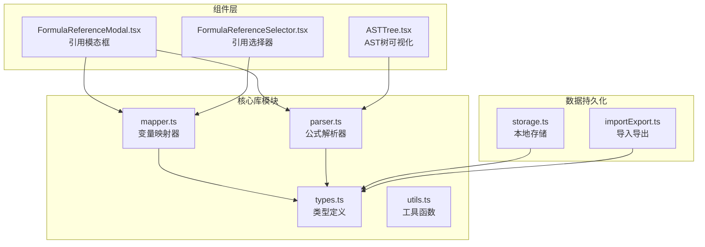
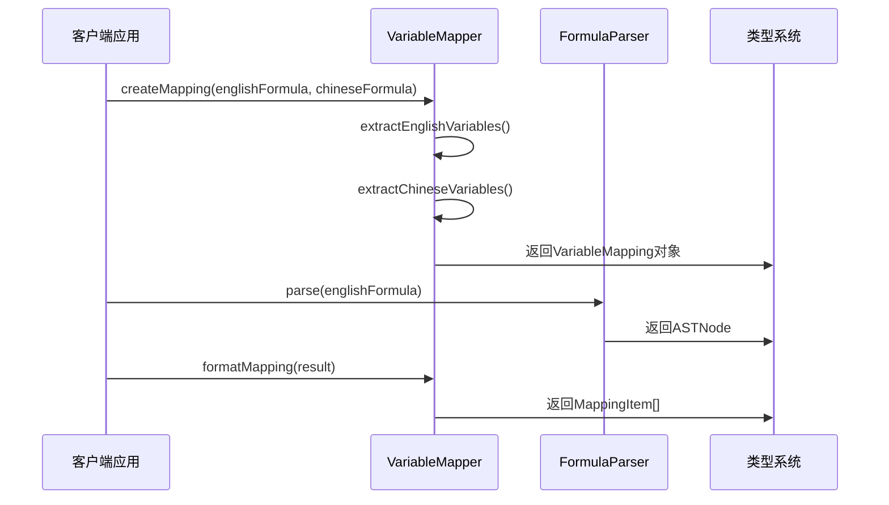
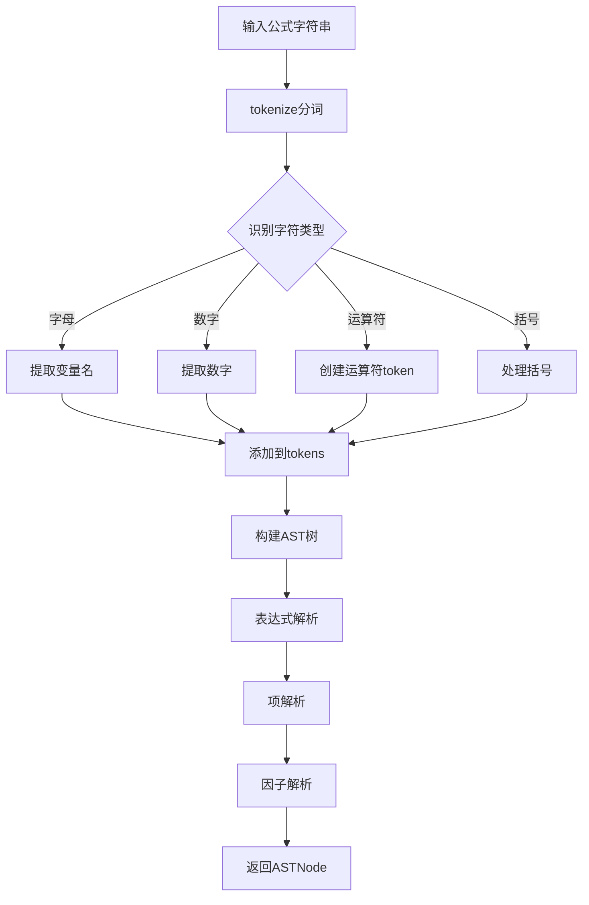
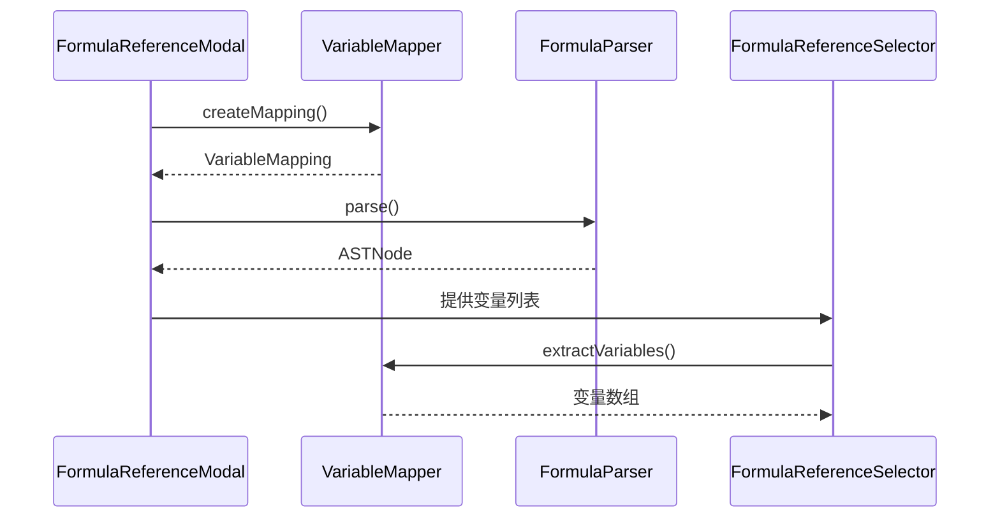
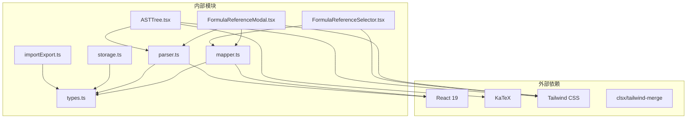

# 映射器API

<cite>
**本文档引用的文件**
- [mapper.ts](file://src/lib/mapper.ts)
- [types.ts](file://src/lib/types.ts)
- [parser.ts](file://src/lib/parser.ts)
- [FormulaReferenceModal.tsx](file://src/components/FormulaReferenceModal.tsx)
- [FormulaReferenceSelector.tsx](file://src/components/FormulaReferenceSelector.tsx)
- [ASTTree.tsx](file://src/components/ASTTree.tsx)
- [storage.ts](file://src/lib/storage.ts)
- [importExport.ts](file://src/lib/importExport.ts)
</cite>

## 目录
1. [简介](#简介)
2. [项目结构](#项目结构)
3. [核心组件](#核心组件)
4. [架构概览](#架构概览)
5. [详细组件分析](#详细组件分析)
6. [依赖关系分析](#依赖关系分析)
7. [性能考虑](#性能考虑)
8. [故障排除指南](#故障排除指南)
9. [结论](#结论)
10. [附录](#附录)

## 简介
公式变量映射与可视化工具的映射器API是一个专门用于处理英文公式与中文公式之间变量映射的核心模块。该API提供了完整的变量提取、映射生成和格式化功能，支持中英文变量的智能识别和处理机制。

该工具的主要目标是：
- 提供精确的变量提取算法，支持英文变量和中文变量的识别
- 实现高效的映射生成逻辑，建立变量之间的对应关系
- 支持复杂的中英文变量处理机制，包括特殊字符和运算符的处理
- 提供直观的可视化展示，帮助用户理解和验证变量映射关系

## 项目结构
该项目采用模块化的架构设计，主要分为以下几个核心部分：



**图表来源**
- [mapper.ts:1-89](file://src/lib/mapper.ts#L1-L89)
- [parser.ts:1-159](file://src/lib/parser.ts#L1-L159)
- [types.ts:1-51](file://src/lib/types.ts#L1-L51)

**章节来源**
- [mapper.ts:1-89](file://src/lib/mapper.ts#L1-L89)
- [parser.ts:1-159](file://src/lib/parser.ts#L1-L159)
- [types.ts:1-51](file://src/lib/types.ts#L1-L51)

## 核心组件
映射器API由三个核心组件构成，每个组件都有明确的职责和功能边界：

### VariableMapper类
VariableMapper是映射器API的核心实现类，提供了完整的变量映射功能。该类包含以下静态方法：

- `extractEnglishVariables`: 提取英文变量
- `extractChineseVariables`: 提取中文变量  
- `createMapping`: 创建变量映射
- `formatMapping`: 格式化映射结果

### FormulaParser类
FormulaParser负责公式语法解析，将字符串公式转换为抽象语法树(AST)，支持多种运算符和括号类型。

### 类型系统
项目定义了完整的类型系统，包括Token、ASTNode、VariableMapping等核心接口，确保类型安全和代码可维护性。

**章节来源**
- [mapper.ts:3-88](file://src/lib/mapper.ts#L3-L88)
- [parser.ts:3-158](file://src/lib/parser.ts#L3-L158)
- [types.ts:15-25](file://src/lib/types.ts#L15-L25)

## 架构概览
映射器API采用分层架构设计，各层职责清晰分离：



**图表来源**
- [mapper.ts:52-87](file://src/lib/mapper.ts#L52-L87)
- [parser.ts:12-22](file://src/lib/parser.ts#L12-L22)

该架构的优势在于：
- **高内聚低耦合**: 每个组件专注于特定功能
- **可扩展性强**: 新增功能不影响现有代码
- **类型安全**: 完整的TypeScript类型定义
- **易于测试**: 模块化设计便于单元测试

## 详细组件分析

### VariableMapper组件分析

#### 类结构图
```mermaid
classDiagram
class VariableMapper {
+extractEnglishVariables(formula : string) string[]
+extractChineseVariables(formula : string) string[]
+createMapping(englishFormula : string, chineseFormula : string) VariableMapping
+formatMapping(mappingResult : VariableMapping) { items : MappingItem[]; hasMoreChinese : boolean }
}
class VariableMapping {
+mapping : Record~string, string~
+englishVars : string[]
+chineseVars : string[]
+hasMoreChinese : boolean
}
class MappingItem {
+english : string
+chinese : string
}
VariableMapper --> VariableMapping : "创建"
VariableMapper --> MappingItem : "格式化"
```

**图表来源**
- [mapper.ts:3-88](file://src/lib/mapper.ts#L3-L88)
- [types.ts:15-25](file://src/lib/types.ts#L15-L25)

#### 变量提取算法
VariableMapper实现了两种不同的变量提取策略：

**英文变量提取**:
- 使用正则表达式 `\b[A-Za-z][A-Za-z0-9]*\b` 精确匹配英文变量
- 自动去重，确保每个变量只出现一次
- 支持变量名包含数字的场景

**中文变量提取**:
- 通过分割运算符和括号来识别中文变量
- 支持的运算符: `+`, `-`, `*`, `/`, `×`, `÷`, `()`, `[]`, `{}`, `（）`
- 自动过滤纯数字和空字符串
- 保持变量的原始顺序

#### 映射生成逻辑
映射生成采用一一对应的策略：
- 按变量在英文公式中的出现顺序进行配对
- 如果中文变量数量不足，使用"（未定义）"作为占位符
- 记录是否有更多中文变量的标志位

#### 数据结构设计
映射器返回的VariableMapping对象包含：
- `mapping`: 核心映射表，键为英文变量，值为中文变量
- `englishVars`: 英文变量数组，保持原始顺序
- `chineseVars`: 中文变量数组，保持原始顺序
- `hasMoreChinese`: 布尔标志，指示中文变量是否多于英文变量

**章节来源**
- [mapper.ts:4-87](file://src/lib/mapper.ts#L4-L87)
- [types.ts:15-25](file://src/lib/types.ts#L15-L25)

### FormulaParser组件分析

#### 语法解析流程


**图表来源**
- [parser.ts:24-68](file://src/lib/parser.ts#L24-L68)
- [parser.ts:78-157](file://src/lib/parser.ts#L78-L157)

#### 支持的运算符和括号
- **运算符**: `+`, `-`, `*`, `/`, `（`, `）`, `[`, `]`, `{`, `}`
- **括号配对**: `()`, `[]`, `{}`, `（）`
- **变量命名**: 以字母开头，后跟字母或数字
- **数字处理**: 支持整数和小数

#### 错误处理机制
解析器提供完善的错误处理：
- 未识别字符错误
- 表达式不完整错误
- 括号不匹配错误
- 语法错误检测

**章节来源**
- [parser.ts:12-158](file://src/lib/parser.ts#L12-L158)

### 组件集成分析

#### 组件间交互流程


**图表来源**
- [FormulaReferenceModal.tsx:30-45](file://src/components/FormulaReferenceModal.tsx#L30-L45)
- [FormulaReferenceSelector.tsx:21-22](file://src/components/FormulaReferenceSelector.tsx#L21-L22)

#### 可视化组件集成
- **ASTTree**: 展示公式结构树，支持中英文切换
- **FormulaReferenceModal**: 提供完整的公式查看和编辑界面
- **FormulaReferenceSelector**: 支持变量引用的公式映射

**章节来源**
- [FormulaReferenceModal.tsx:18-179](file://src/components/FormulaReferenceModal.tsx#L18-L179)
- [FormulaReferenceSelector.tsx:14-131](file://src/components/FormulaReferenceSelector.tsx#L14-L131)

## 依赖关系分析

### 模块依赖图


**图表来源**
- [package.json:15-33](file://package.json#L15-L33)
- [mapper.ts:1](file://src/lib/mapper.ts#L1)
- [parser.ts:1](file://src/lib/parser.ts#L1)

### 关键依赖关系
- **mapper.ts** 依赖 **types.ts** 的类型定义
- **parser.ts** 同样依赖 **types.ts** 的类型定义
- **FormulaReferenceModal.tsx** 依赖 **mapper.ts** 和 **parser.ts**
- **FormulaReferenceSelector.tsx** 依赖 **mapper.ts** 的变量提取功能
- **ASTTree.tsx** 依赖 **parser.ts** 的解析能力

**章节来源**
- [package.json:15-33](file://package.json#L15-L33)
- [mapper.ts:1](file://src/lib/mapper.ts#L1)
- [parser.ts:1](file://src/lib/parser.ts#L1)

## 性能考虑
映射器API在设计时充分考虑了性能优化：

### 时间复杂度分析
- **变量提取**: O(n)，其中n为公式长度
- **映射生成**: O(min(m,n))，其中m和n分别为英文和中文变量数量
- **格式化**: O(m)，其中m为英文变量数量

### 空间复杂度分析
- **映射表**: O(min(m,n))，存储变量映射关系
- **变量数组**: O(m+n)，存储提取的变量列表
- **AST树**: O(k)，其中k为表达式中token数量

### 性能优化策略
- **缓存机制**: 组件层使用useMemo避免重复计算
- **增量更新**: 只在公式变化时重新计算映射
- **内存管理**: 及时清理不再使用的变量引用

## 故障排除指南

### 常见问题诊断

#### 变量提取失败
**症状**: 变量数组为空
**可能原因**:
- 公式字符串为空或只包含空白字符
- 公式不符合预期格式
- 正则表达式匹配失败

**解决方案**:
- 检查输入公式的格式和内容
- 确保变量名符合命名规范
- 验证公式的语法正确性

#### 映射不完整
**症状**: 中文变量数量少于英文变量
**可能原因**:
- 中文公式中缺少对应的变量
- 中文变量被错误地识别为数字
- 中文变量包含特殊字符导致分割失败

**解决方案**:
- 检查中文公式的变量完整性
- 验证中文变量的命名规范
- 调整中文变量的格式

#### 解析错误
**症状**: 公式解析抛出异常
**可能原因**:
- 表达式包含未识别的字符
- 括号不匹配或缺失
- 语法结构不符合要求

**解决方案**:
- 检查公式的语法正确性
- 确保所有括号都正确配对
- 验证运算符的使用方式

### 调试技巧
1. **日志输出**: 在关键节点添加console.log输出
2. **单元测试**: 为每个函数编写独立的测试用例
3. **边界测试**: 测试空字符串、特殊字符等边界情况
4. **性能监控**: 使用浏览器开发者工具监控性能指标

**章节来源**
- [parser.ts:64](file://src/lib/parser.ts#L64)
- [FormulaReferenceModal.tsx:40-44](file://src/components/FormulaReferenceModal.tsx#L40-L44)

## 结论
映射器API提供了一个完整、高效且易于使用的变量映射解决方案。其设计特点包括：

### 核心优势
- **算法精确**: 基于正则表达式的变量提取算法
- **类型安全**: 完整的TypeScript类型定义
- **扩展性强**: 模块化设计支持功能扩展
- **用户体验**: 提供丰富的可视化和交互功能

### 技术亮点
- 智能的中英文变量处理机制
- 完善的错误处理和恢复机制
- 高性能的缓存和优化策略
- 清晰的API设计和文档

### 应用价值
该映射器API不仅适用于当前的公式变量映射场景，还可以扩展到其他需要变量映射和可视化的应用场景中，具有良好的通用性和扩展性。

## 附录

### API使用示例

#### 基本映射操作
```typescript
// 创建变量映射
const mappingResult = VariableMapper.createMapping(
  "A + B * C",
  "A + B × C"
);

// 获取映射项列表
const mappingItems = VariableMapper.formatMapping(mappingResult);
```

#### 复杂公式处理
```typescript
// 处理包含括号的复杂公式
const complexMapping = VariableMapper.createMapping(
  "(A + B) * C / D",
  "（A + B）× C ÷ D"
);
```

#### 错误处理模式
```typescript
try {
  const result = VariableMapper.createMapping(english, chinese);
} catch (error) {
  console.error("映射失败:", error.message);
}
```

### 配置选项说明
映射器API目前提供以下配置选项：

#### 变量命名规范
- **英文变量**: 必须以字母开头，后跟字母或数字
- **中文变量**: 支持任意Unicode字符，但会自动过滤数字
- **变量长度**: 无限制，但建议保持合理长度

#### 冲突解决策略
- **一对一映射**: 按变量出现顺序进行配对
- **中文变量不足**: 使用"（未定义）"作为默认值
- **重复变量**: 自动去重，保留第一次出现的变量

#### 扩展机制
- **自定义变量提取**: 可以扩展extractChineseVariables方法
- **映射规则定制**: 支持通过继承或组合实现自定义映射逻辑
- **插件系统**: 未来可以支持插件化的映射规则扩展

**章节来源**
- [mapper.ts:52-87](file://src/lib/mapper.ts#L52-L87)
- [FormulaReferenceSelector.tsx:115-131](file://src/components/FormulaReferenceSelector.tsx#L115-L131)