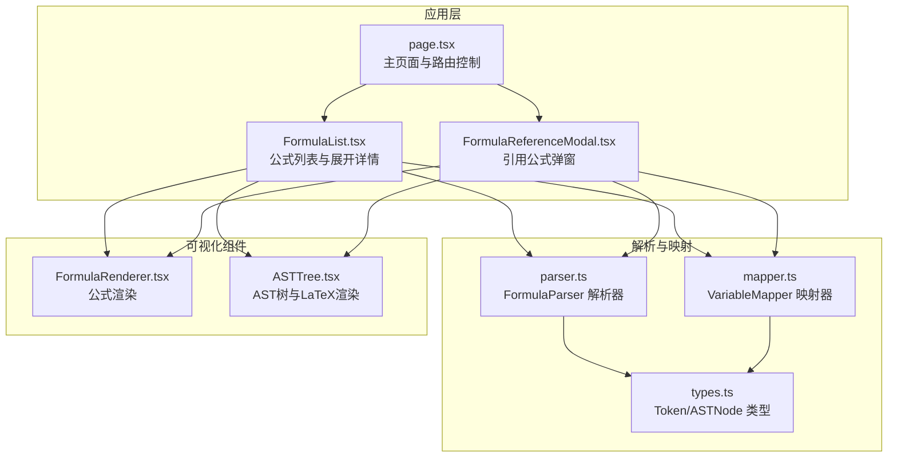
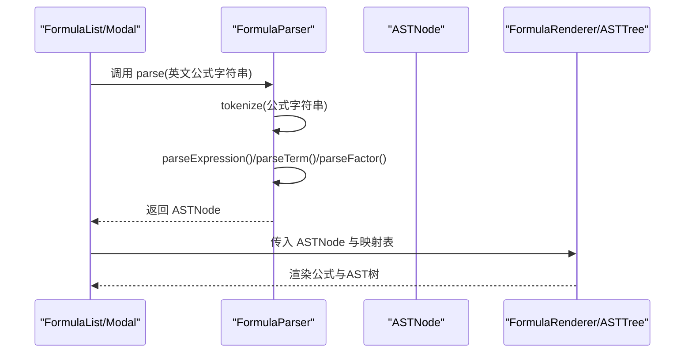
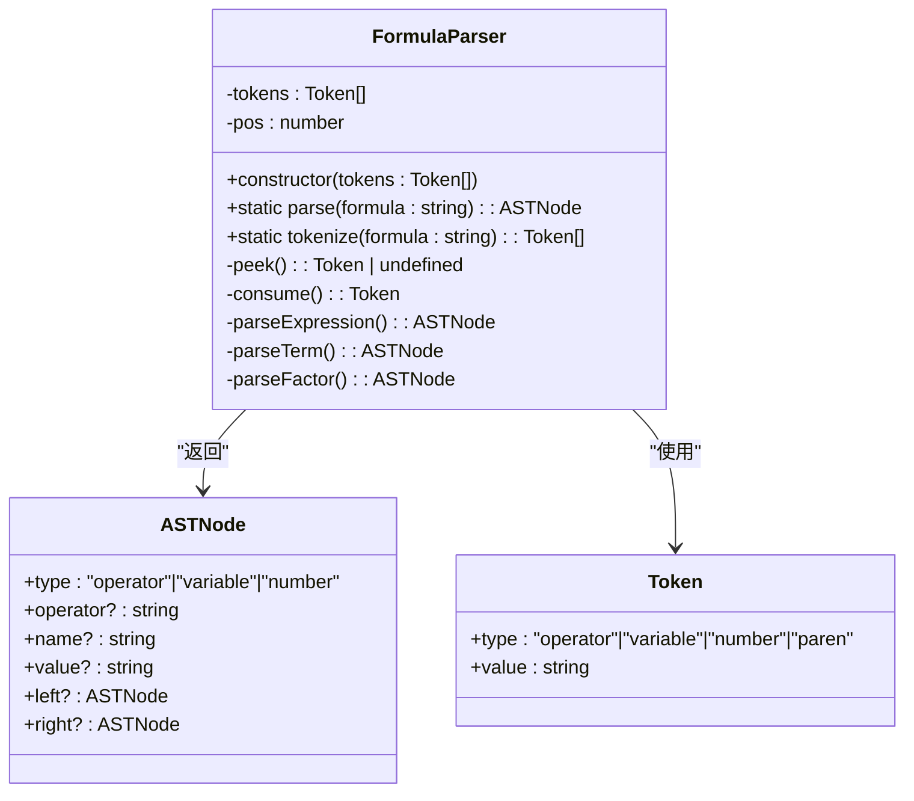
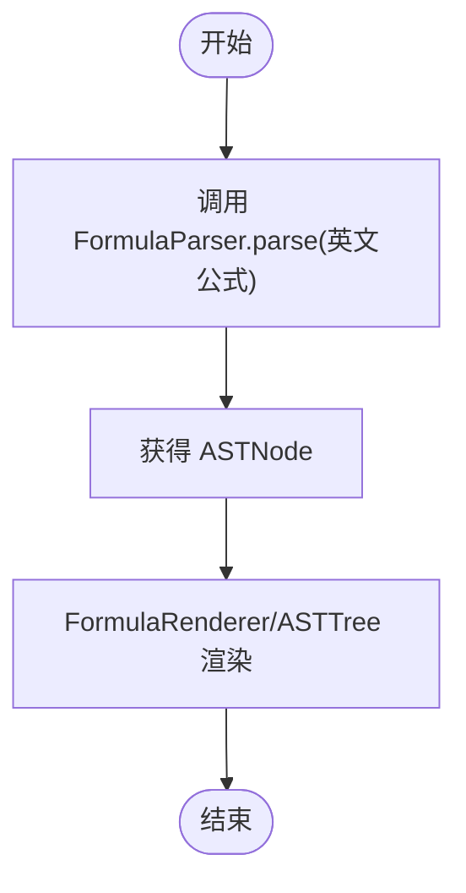
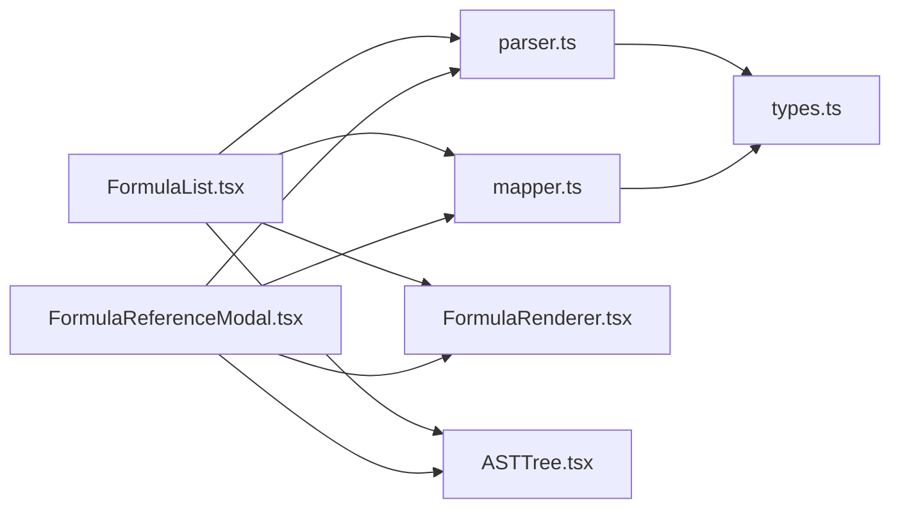

# 解析器API

<cite>
**本文档引用的文件**
- [parser.ts](file://src/lib/parser.ts)
- [types.ts](file://src/lib/types.ts)
- [mapper.ts](file://src/lib/mapper.ts)
- [FormulaList.tsx](file://src/components/FormulaList.tsx)
- [FormulaReferenceModal.tsx](file://src/components/FormulaReferenceModal.tsx)
- [FormulaRenderer.tsx](file://src/components/FormulaRenderer.tsx)
- [ASTTree.tsx](file://src/components/ASTTree.tsx)
- [storage.ts](file://src/lib/storage.ts)
- [page.tsx](file://src/app/page.tsx)
- [README.md](file://README.md)
</cite>

## 目录
1. [简介](#简介)
2. [项目结构](#项目结构)
3. [核心组件](#核心组件)
4. [架构总览](#架构总览)
5. [详细组件分析](#详细组件分析)
6. [依赖关系分析](#依赖关系分析)
7. [性能考量](#性能考量)
8. [故障排查指南](#故障排查指南)
9. [结论](#结论)
10. [附录](#附录)

## 简介
本文件为“公式变量映射与可视化工具”的解析器API参考文档，聚焦于公式解析器的实现原理、语法分析流程、错误处理机制、支持的语法规范、解析结果数据结构（AST）、配置选项、使用示例、常见问题诊断以及扩展与自定义语法支持方法。解析器采用自定义递归下降解析算法，支持变量、数字、四则运算与多种括号类型的语法元素，并输出标准AST节点结构，供渲染与可视化组件消费。

## 项目结构
本项目采用前后端一体化的Next.js应用结构，解析器位于lib目录，UI组件位于components目录，页面逻辑位于app目录。解析器API主要由src/lib/parser.ts提供，类型定义位于src/lib/types.ts，变量映射逻辑位于src/lib/mapper.ts，UI层通过FormulaList与FormulaReferenceModal等组件调用解析器并展示结果。

**图表来源**
- [page.tsx](file://src/app/page.tsx)
- [FormulaList.tsx](file://src/components/FormulaList.tsx)
- [FormulaReferenceModal.tsx](file://src/components/FormulaReferenceModal.tsx)
- [parser.ts](file://src/lib/parser.ts)
- [types.ts](file://src/lib/types.ts)
- [mapper.ts](file://src/lib/mapper.ts)
- [FormulaRenderer.tsx](file://src/components/FormulaRenderer.tsx)
- [ASTTree.tsx](file://src/components/ASTTree.tsx)

**章节来源**
- [README.md](file://README.md)
- [page.tsx](file://src/app/page.tsx)

## 核心组件
- 解析器：FormulaParser，提供静态parse与tokenize方法，内部使用递归下降算法构建AST。
- 类型系统：Token与ASTNode接口，统一词法与语法阶段的数据结构。
- 变量映射器：VariableMapper，提取中英文变量并建立映射关系。
- UI组件：FormulaRenderer与ASTTree，消费AST与映射结果进行可视化。

**章节来源**
- [parser.ts](file://src/lib/parser.ts)
- [types.ts](file://src/lib/types.ts)
- [mapper.ts](file://src/lib/mapper.ts)

## 架构总览
解析器API在UI层被调用的典型流程如下：

**图表来源**
- [FormulaList.tsx](file://src/components/FormulaList.tsx)
- [FormulaReferenceModal.tsx](file://src/components/FormulaReferenceModal.tsx)
- [parser.ts](file://src/lib/parser.ts)
- [FormulaRenderer.tsx](file://src/components/FormulaRenderer.tsx)
- [ASTTree.tsx](file://src/components/ASTTree.tsx)

## 详细组件分析

### 解析器 API：FormulaParser
- 静态入口
  - parse(formula: string): ASTNode
    - 对输入公式进行词法分析，随后构建AST；若存在未处理字符，抛出错误。
  - tokenize(formula: string): Token[]
    - 将字符串切分为Token序列，支持空白、运算符、变量、数字与括号。
- 语法分析（递归下降）
  - parseExpression(): 识别加减法，左结合。
  - parseTerm(): 识别乘除法，左结合。
  - parseFactor(): 识别变量、数字或括号表达式，支持()、[]、{}、（）。
- 错误处理
  - 未识别字符：抛出包含位置信息的错误。
  - 表达式不完整：缺少操作数或右括号缺失时抛错。
  - 语法错误：遇到意外token时抛错。

**图表来源**
- [parser.ts](file://src/lib/parser.ts)
- [types.ts](file://src/lib/types.ts)

**章节来源**
- [parser.ts](file://src/lib/parser.ts)
- [types.ts](file://src/lib/types.ts)

### 语法规范与优先级
- 支持的运算符：+, -, *, /（含中文×、÷的识别与渲染，但解析阶段仍以ASCII为准）。
- 运算符优先级：乘除高于加减，左结合。
- 括号类型：()、[]、{}、（），成对出现且正确嵌套。
- 变量命名：以字母开头，后跟字母或数字。
- 数字：连续数字序列。
- 空白：忽略空白字符。

**章节来源**
- [parser.ts](file://src/lib/parser.ts)
- [FormulaRenderer.tsx](file://src/components/FormulaRenderer.tsx)

### 解析结果数据结构：ASTNode
- 节点类型
  - operator：二元运算符节点，包含operator、left、right。
  - variable：变量节点，包含name。
  - number：数字节点，包含value。
- 属性映射
  - operator：运算符字符串（如+、-、*、/）。
  - name：变量名字符串。
  - value：数字字符串。
  - left/right：ASTNode或undefined。

**章节来源**
- [types.ts](file://src/lib/types.ts)

### 配置选项与行为参数
- 解析模式
  - 默认模式：严格语法，遇到未识别字符或括号不匹配立即报错。
- 容错设置
  - 当前实现未提供容错开关；建议在调用前进行预处理或在上层捕获异常并降级展示。
- 性能优化参数
  - 词法分析与递归下降均为线性复杂度；无额外配置项。
  - 建议：对长公式可考虑分段解析或延迟渲染。

**章节来源**
- [parser.ts](file://src/lib/parser.ts)

### 使用示例
- 基本用法
  - 在FormulaList或FormulaReferenceModal中，当公式展开或打开时，调用FormulaParser.parse(英文公式字符串)，得到ASTNode后传递给FormulaRenderer与ASTTree进行渲染。
- 变量映射
  - 使用VariableMapper.createMapping(英文公式, 中文公式)生成映射对象，再传入渲染组件以实现中英文切换与变量说明。

**图表来源**
- [FormulaList.tsx](file://src/components/FormulaList.tsx)
- [FormulaReferenceModal.tsx](file://src/components/FormulaReferenceModal.tsx)
- [parser.ts](file://src/lib/parser.ts)

**章节来源**
- [FormulaList.tsx](file://src/components/FormulaList.tsx)
- [FormulaReferenceModal.tsx](file://src/components/FormulaReferenceModal.tsx)
- [mapper.ts](file://src/lib/mapper.ts)

### 错误处理机制
- 词法阶段
  - 无法识别的字符：抛出包含位置信息的错误。
- 语法阶段
  - 表达式不完整：缺少操作数。
  - 括号不匹配：缺少对应右括号。
  - 意外token：遇到不在预期集合内的token。
- UI层处理
  - FormulaList与FormulaReferenceModal在解析失败时显示错误提示，清空AST与映射状态。

**章节来源**
- [parser.ts](file://src/lib/parser.ts)
- [FormulaList.tsx](file://src/components/FormulaList.tsx)
- [FormulaReferenceModal.tsx](file://src/components/FormulaReferenceModal.tsx)

### 扩展机制与自定义语法支持
- 词法规则扩展
  - 在tokenize中增加新的字符分类与Token类型，确保ASTNode类型覆盖新增节点类型。
- 语法规则扩展
  - 在parseExpression/parseTerm/parseFactor中增加新的产生式，补充相应的AST节点构造逻辑。
- 渲染扩展
  - 在FormulaRenderer与ASTTree中增加对新节点类型的渲染分支，保证UI层兼容。
- 注意事项
  - 保持ASTNode类型与渲染组件的契约一致，避免运行时类型错误。
  - 若引入新运算符，需同步更新优先级与结合性规则。

**章节来源**
- [parser.ts](file://src/lib/parser.ts)
- [types.ts](file://src/lib/types.ts)
- [FormulaRenderer.tsx](file://src/components/FormulaRenderer.tsx)
- [ASTTree.tsx](file://src/components/ASTTree.tsx)

## 依赖关系分析
- 组件耦合
  - FormulaList与FormulaReferenceModal依赖FormulaParser与VariableMapper。
  - FormulaRenderer与ASTTree依赖ASTNode与映射表。
- 外部依赖
  - ASTTree依赖KaTeX进行LaTeX渲染，FormulaRenderer依赖本地样式与Tooltip组件。
- 数据流
  - 页面状态驱动公式展开，解析器产出AST，映射器产出变量映射，渲染组件消费并展示。

**图表来源**
- [parser.ts](file://src/lib/parser.ts)
- [types.ts](file://src/lib/types.ts)
- [mapper.ts](file://src/lib/mapper.ts)
- [FormulaList.tsx](file://src/components/FormulaList.tsx)
- [FormulaReferenceModal.tsx](file://src/components/FormulaReferenceModal.tsx)
- [FormulaRenderer.tsx](file://src/components/FormulaRenderer.tsx)
- [ASTTree.tsx](file://src/components/ASTTree.tsx)

**章节来源**
- [page.tsx](file://src/app/page.tsx)

## 性能考量
- 时间复杂度
  - 词法分析：O(n)，n为公式长度。
  - 语法分析：O(n)，递归下降为线性扫描。
- 空间复杂度
  - Token序列与AST树深度与公式复杂度相关，最坏情况下为O(n)。
- 优化建议
  - 对超长公式可考虑分段解析或延迟渲染。
  - 渲染组件可缓存LaTeX结果，避免重复计算。

[本节为通用性能讨论，无需具体文件引用]

## 故障排查指南
- 常见错误与解决
  - “表达式解析不完整：存在未处理的字符”：检查公式末尾是否有多余字符或隐藏符号。
  - “表达式不完整：缺少操作数”：确认运算符两侧是否均有合法操作数。
  - “括号不匹配：缺少右括号 X”：检查括号配对与嵌套是否正确。
  - “语法错误：意外的token 'X'”：检查是否存在未支持的符号或拼写错误。
- 调试建议
  - 在调用parse前打印tokenize结果，核对Token序列。
  - 在UI层捕获异常并记录错误消息，便于定位问题。

**章节来源**
- [parser.ts](file://src/lib/parser.ts)
- [FormulaList.tsx](file://src/components/FormulaList.tsx)
- [FormulaReferenceModal.tsx](file://src/components/FormulaReferenceModal.tsx)

## 结论
解析器API提供了稳定、可扩展的公式解析能力，配合变量映射与可视化组件，能够高效地完成从公式字符串到AST再到LaTeX渲染的全链路处理。通过明确的类型系统与严格的错误处理，开发者可以安全地集成与扩展解析器，满足更复杂的公式管理需求。

[本节为总结性内容，无需具体文件引用]

## 附录

### API清单与签名
- FormulaParser
  - static parse(formula: string): ASTNode
  - static tokenize(formula: string): Token[]
- VariableMapper
  - static createMapping(englishFormula: string, chineseFormula: string): VariableMapping
  - static formatMapping(mappingResult: VariableMapping): { items: MappingItem[]; hasMoreChinese: boolean }

**章节来源**
- [parser.ts](file://src/lib/parser.ts)
- [mapper.ts](file://src/lib/mapper.ts)
- [types.ts](file://src/lib/types.ts)