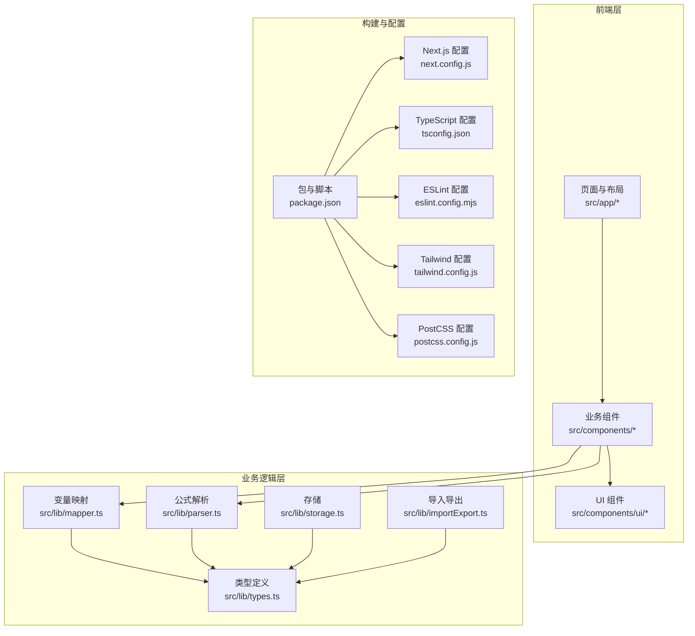
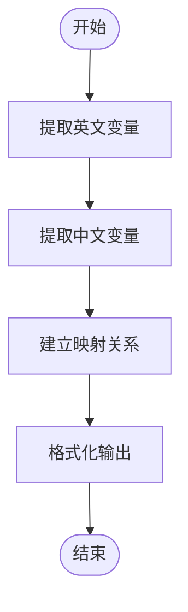
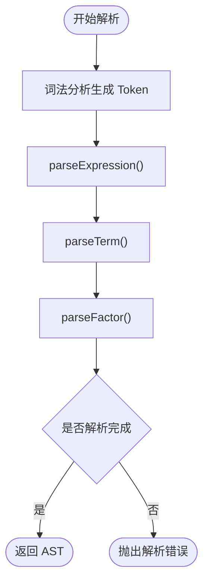
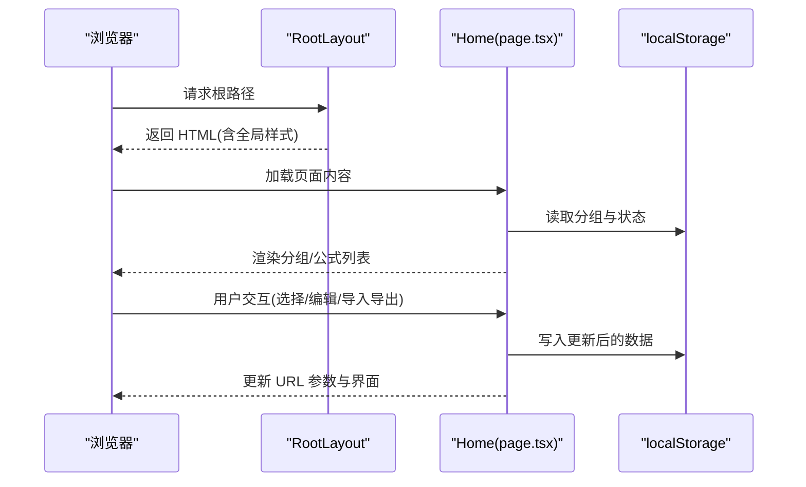
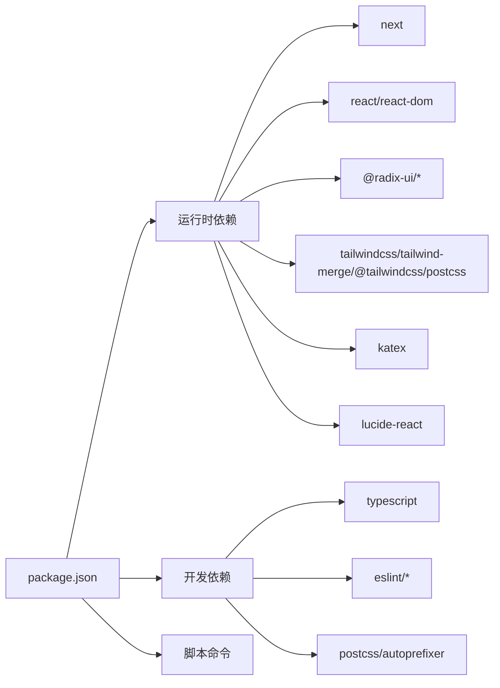

# 开发环境搭建

<cite>
**本文档引用的文件**
- [package.json](file://package.json)
- [tsconfig.json](file://tsconfig.json)
- [eslint.config.mjs](file://eslint.config.mjs)
- [tailwind.config.js](file://tailwind.config.js)
- [postcss.config.js](file://postcss.config.js)
- [next.config.js](file://next.config.js)
- [src/app/globals.css](file://src/app/globals.css)
- [src/app/layout.tsx](file://src/app/layout.tsx)
- [src/app/page.tsx](file://src/app/page.tsx)
- [src/lib/types.ts](file://src/lib/types.ts)
- [src/lib/mapper.ts](file://src/lib/mapper.ts)
- [src/lib/parser.ts](file://src/lib/parser.ts)
- [src/lib/storage.ts](file://src/lib/storage.ts)
- [src/lib/importExport.ts](file://src/lib/importExport.ts)
- [src/components/ui/button.tsx](file://src/components/ui/button.tsx)
- [src/components/FormulaRenderer.tsx](file://src/components/FormulaRenderer.tsx)
- [.gitignore](file://.gitignore)
</cite>

## 目录
1. [简介](#简介)
2. [项目结构](#项目结构)
3. [核心组件](#核心组件)
4. [架构总览](#架构总览)
5. [详细组件分析](#详细组件分析)
6. [依赖分析](#依赖分析)
7. [性能考虑](#性能考虑)
8. [故障排查指南](#故障排查指南)
9. [结论](#结论)
10. [附录](#附录)

## 简介
本指南面向新加入的开发者，帮助你在本地快速搭建“公式变量映射与可视化工具”的开发环境。文档涵盖系统要求、Node.js 版本与包管理器选择、依赖安装流程、开发服务器与热重载、TypeScript 编译与类型检查、ESLint 代码质量规范、Tailwind CSS 样式配置与自定义、IDE 推荐配置、环境变量与构建脚本、调试技巧与性能优化建议。

## 项目结构
该项目采用 Next.js 应用结构，核心目录与职责如下：
- src/app：页面与布局入口，包含全局样式与根布局
- src/components：可复用 UI 组件与业务组件
- src/lib：核心逻辑模块（类型定义、变量映射、公式解析、存储与导入导出等）

```mermaid
graph TB
A["src/app"] --> A1["layout.tsx"]
A --> A2["page.tsx"]
A --> A3["globals.css"]
B["src/components"] --> B1["ui/button.tsx"]
B --> B2["FormulaRenderer.tsx"]
B --> B3["ASTTree.tsx"]
B --> B4["FormulaList.tsx"]
B --> B5["GroupList.tsx"]
B --> B6["..."]
C["src/lib"] --> C1["types.ts"]
C --> C2["mapper.ts"]
C --> C3["parser.ts"]
C --> C4["storage.ts"]
C --> C5["importExport.ts"]
C --> C6["utils.ts"]
D["配置文件"] --> D1["package.json"]
D --> D2["tsconfig.json"]
D --> D3["eslint.config.mjs"]
D --> D4["tailwind.config.js"]
D --> D5["postcss.config.js"]
D --> D6["next.config.js"]
D --> D7[".gitignore"]
```

图表来源
- [src/app/layout.tsx:1-20](file://src/app/layout.tsx#L1-L20)
- [src/app/page.tsx:1-707](file://src/app/page.tsx#L1-L707)
- [src/lib/types.ts:1-51](file://src/lib/types.ts#L1-L51)
- [src/lib/mapper.ts:1-89](file://src/lib/mapper.ts#L1-L89)
- [src/lib/parser.ts:1-159](file://src/lib/parser.ts#L1-L159)
- [src/lib/storage.ts:1-50](file://src/lib/storage.ts#L1-L50)
- [src/lib/importExport.ts:1-101](file://src/lib/importExport.ts#L1-L101)
- [package.json:1-48](file://package.json#L1-L48)
- [tsconfig.json:1-42](file://tsconfig.json#L1-L42)
- [eslint.config.mjs:1-30](file://eslint.config.mjs#L1-L30)
- [tailwind.config.js:1-76](file://tailwind.config.js#L1-L76)
- [postcss.config.js:1-7](file://postcss.config.js#L1-L7)
- [next.config.js:1-7](file://next.config.js#L1-L7)
- [.gitignore:1-42](file://.gitignore#L1-L42)

章节来源
- [src/app/layout.tsx:1-20](file://src/app/layout.tsx#L1-L20)
- [src/app/page.tsx:1-707](file://src/app/page.tsx#L1-L707)
- [package.json:1-48](file://package.json#L1-L48)

## 核心组件
- 类型系统：定义 Token、ASTNode、VariableMapping、Formula、SubFormula、FormulaGroup 等核心类型，确保数据结构一致性与类型安全
- 变量映射器：从英文与中文公式中提取变量并建立映射关系，支持格式化输出
- 公式解析器：将公式字符串词法分析为 Token，并按语法规则构建 AST
- 存储与导入导出：基于 localStorage 的本地持久化，支持 JSON 导出与导入校验
- UI 组件：基于 Radix UI 与 Tailwind CSS 的可复用组件，如按钮、输入框、对话框、提示等

章节来源
- [src/lib/types.ts:1-51](file://src/lib/types.ts#L1-L51)
- [src/lib/mapper.ts:1-89](file://src/lib/mapper.ts#L1-L89)
- [src/lib/parser.ts:1-159](file://src/lib/parser.ts#L1-L159)
- [src/lib/storage.ts:1-50](file://src/lib/storage.ts#L1-L50)
- [src/lib/importExport.ts:1-101](file://src/lib/importExport.ts#L1-L101)
- [src/components/ui/button.tsx:1-58](file://src/components/ui/button.tsx#L1-L58)
- [src/components/FormulaRenderer.tsx:1-169](file://src/components/FormulaRenderer.tsx#L1-L169)

## 架构总览
应用采用客户端渲染模式，通过 Next.js 的 App Router 组织页面与路由；样式通过 Tailwind CSS 与 PostCSS 自动处理；类型检查由 TypeScript 完成；代码质量由 ESLint 保障；本地数据持久化使用 localStorage。

图表来源
- [src/app/page.tsx:1-707](file://src/app/page.tsx#L1-L707)
- [src/lib/mapper.ts:1-89](file://src/lib/mapper.ts#L1-L89)
- [src/lib/parser.ts:1-159](file://src/lib/parser.ts#L1-L159)
- [src/lib/storage.ts:1-50](file://src/lib/storage.ts#L1-L50)
- [src/lib/importExport.ts:1-101](file://src/lib/importExport.ts#L1-L101)
- [next.config.js:1-7](file://next.config.js#L1-L7)
- [tsconfig.json:1-42](file://tsconfig.json#L1-L42)
- [eslint.config.mjs:1-30](file://eslint.config.mjs#L1-L30)
- [tailwind.config.js:1-76](file://tailwind.config.js#L1-L76)
- [postcss.config.js:1-7](file://postcss.config.js#L1-L7)
- [package.json:1-48](file://package.json#L1-L48)

## 详细组件分析

### TypeScript 编译与类型检查
- 编译选项要点
  - lib 包含 dom、dom.iterable、esnext
  - strict 严格模式开启
  - noEmit 禁止输出 JS（交由 Next.js 处理）
  - module 与 moduleResolution 使用 bundler
  - isolatedModules 与 incremental 提升增量编译性能
  - jsx 使用 react-jsx
  - 路径别名 @/* 指向 ./src/*
- 类型定义
  - Token、ASTNode、VariableMapping、Formula、SubFormula、FormulaGroup 等
- 建议
  - 在 VS Code 中启用“始终打开 TS Server”以获得最佳体验
  - 如需自定义路径别名，保持 tsconfig.json 与 ESLint/TS 配置一致

章节来源
- [tsconfig.json:1-42](file://tsconfig.json#L1-L42)
- [src/lib/types.ts:1-51](file://src/lib/types.ts#L1-L51)

### ESLint 代码质量检查
- 配置概览
  - 使用 Flat Config（eslint.config.mjs）
  - 继承 Next.js 推荐规则集
  - 自定义规则：忽略下划线前缀命名的未使用变量警告
- 建议
  - 在 IDE 中安装 ESLint 插件并启用保存时自动修复
  - 若团队有额外风格约束，可在同一文件追加规则对象

章节来源
- [eslint.config.mjs:1-30](file://eslint.config.mjs#L1-L30)

### Tailwind CSS 样式框架
- 配置要点
  - darkMode 使用 class 方式
  - content 覆盖 src 下的 pages、components、app 目录
  - 主题扩展：容器尺寸、圆角、动画、颜色系统（使用 CSS 变量）
  - 无额外插件
- 全局样式
  - 引入 base、components、utilities
  - 定义深色/浅色主题的 CSS 变量
- 建议
  - 优先使用 Tailwind 实用类，避免新增全局样式
  - 如需自定义颜色或组件，通过 theme.extend 与 CSS 变量统一管理

章节来源
- [tailwind.config.js:1-76](file://tailwind.config.js#L1-L76)
- [postcss.config.js:1-7](file://postcss.config.js#L1-L7)
- [src/app/globals.css:1-60](file://src/app/globals.css#L1-L60)

### 变量映射与公式解析
- 变量映射
  - 从英文公式提取英文变量集合
  - 从中文公式提取中文变量集合
  - 按序建立映射，多余中文变量标记“未定义”
- 公式解析
  - 词法分析：支持 + - * / 与多种括号
  - 语法分析：实现表达式、项、因子的递归下降解析
  - 错误处理：抛出明确的语法与括号不匹配错误

图表来源
- [src/lib/mapper.ts:1-89](file://src/lib/mapper.ts#L1-L89)

图表来源
- [src/lib/parser.ts:1-159](file://src/lib/parser.ts#L1-L159)

章节来源
- [src/lib/mapper.ts:1-89](file://src/lib/mapper.ts#L1-L89)
- [src/lib/parser.ts:1-159](file://src/lib/parser.ts#L1-L159)

### 页面与路由（App Router）
- 根布局：设置语言、元信息与全局样式
- 主页：集中管理分组、公式、变量映射与子公式，支持导入导出、URL 同步与本地缓存
- 路由行为：使用 next/navigation 的 usePathname/useSearchParams/useRouter 实现 URL 参数同步与导航

图表来源
- [src/app/layout.tsx:1-20](file://src/app/layout.tsx#L1-L20)
- [src/app/page.tsx:1-707](file://src/app/page.tsx#L1-L707)
- [src/lib/storage.ts:1-50](file://src/lib/storage.ts#L1-L50)

章节来源
- [src/app/layout.tsx:1-20](file://src/app/layout.tsx#L1-L20)
- [src/app/page.tsx:1-707](file://src/app/page.tsx#L1-L707)

### UI 组件与样式
- 按钮组件：基于 class-variance-authority 的变体系统，支持不同尺寸与外观
- 公式渲染器：将公式拆分为 Token，按变量分配颜色，支持引用跳转与 Tooltip 提示
- 建议
  - 使用 Tailwind 实用类组合样式，避免在组件内写死样式
  - 通过 CSS 变量与 Tailwind 主题扩展统一配色与间距

章节来源
- [src/components/ui/button.tsx:1-58](file://src/components/ui/button.tsx#L1-L58)
- [src/components/FormulaRenderer.tsx:1-169](file://src/components/FormulaRenderer.tsx#L1-L169)
- [src/app/globals.css:1-60](file://src/app/globals.css#L1-L60)

## 依赖分析
- 运行时依赖
  - Next.js、React、React DOM：应用框架与渲染
  - Radix UI：无障碍 UI 组件库
  - Tailwind 相关：tailwindcss、tailwind-merge、@tailwindcss/postcss
  - KaTeX：公式渲染
  - lucide-react：图标
- 开发依赖
  - TypeScript、ESLint、PostCSS、Autoprefixer 等
- 构建与脚本
  - dev/build/start/lint 脚本分别对应开发、构建、启动与代码检查

图表来源
- [package.json:1-48](file://package.json#L1-L48)

章节来源
- [package.json:1-48](file://package.json#L1-L48)

## 性能考虑
- 构建与编译
  - 使用 Next.js 的内置 TypeScript 与增量编译，减少冷启动时间
  - 启用 isolatedModules 与 incremental，提升大型项目编译效率
- 样式与渲染
  - Tailwind 按需扫描 content，避免生成冗余 CSS
  - 组件内避免重复计算，使用 useMemo/useCallback 优化渲染
- 数据持久化
  - localStorage 适合小规模数据；如数据增长，建议迁移至 IndexedDB 或服务端存储
- 调试与分析
  - 使用 React DevTools Profiler 分析组件渲染热点
  - 使用 Lighthouse 检查性能与可访问性

## 故障排查指南
- 依赖安装失败
  - 清理缓存并重装：删除 node_modules 与锁文件后重新安装
  - 确认网络代理与 npm/yarn 配置
- TypeScript 报错
  - 确保 tsconfig.json 与 IDE 设置一致
  - 关注 strict 模式下的未定义类型问题
- ESLint 报错
  - 在 IDE 中启用自动修复；必要时在 eslint.config.mjs 中调整规则
- Tailwind 样式不生效
  - 确认 tailwind.config.js 的 content 路径包含相关文件
  - 检查 postcss.config.js 是否正确加载 tailwindcss 与 autoprefixer
- 开发服务器无法启动
  - 检查端口占用；确认 next.config.js 与环境变量
  - 清理 .next 缓存后重启
- 导入导出异常
  - 确认 JSON 文件格式与字段完整性
  - 检查浏览器控制台错误与弹窗提示

章节来源
- [package.json:1-48](file://package.json#L1-L48)
- [tsconfig.json:1-42](file://tsconfig.json#L1-L42)
- [eslint.config.mjs:1-30](file://eslint.config.mjs#L1-L30)
- [tailwind.config.js:1-76](file://tailwind.config.js#L1-L76)
- [postcss.config.js:1-7](file://postcss.config.js#L1-L7)
- [src/lib/importExport.ts:1-101](file://src/lib/importExport.ts#L1-L101)

## 结论
通过遵循本指南，你可以快速完成开发环境搭建并顺利运行项目。建议在开发过程中持续关注类型安全、代码质量与样式一致性，结合 Tailwind 的实用类与 Radix UI 的可访问性组件，构建高质量的前端体验。

## 附录

### 系统要求与前置条件
- Node.js：建议使用 LTS 版本（如 18.x 或 20.x），确保与 Next.js 与 TypeScript 生态兼容
- 包管理器：推荐使用 npm（默认随 Node.js 安装）；如需更快安装可选 yarn 或 pnpm
- 文本编辑器：VS Code（推荐），配合 TypeScript、ESLint、Tailwind CSS IntelliSense 插件

### 依赖安装步骤
- 安装依赖：在项目根目录执行安装命令
- 启动开发服务器：执行开发脚本
- 运行代码检查：执行 lint 脚本
- 构建生产包：执行 build 脚本并使用 start 启动

章节来源
- [package.json:1-48](file://package.json#L1-L48)

### 开发服务器与热重载
- 开发脚本：dev
- 热重载：Next.js 默认启用，修改文件后自动刷新
- 路由与状态：页面通过 URL 参数与本地缓存同步，便于调试与分享

章节来源
- [package.json:1-48](file://package.json#L1-L48)
- [src/app/page.tsx:1-707](file://src/app/page.tsx#L1-L707)

### TypeScript 编译与类型检查
- 编译配置：参考 tsconfig.json 的关键选项
- 类型定义：集中在 src/lib/types.ts
- 类型检查：在开发阶段由 Next.js 与 IDE 协作完成

章节来源
- [tsconfig.json:1-42](file://tsconfig.json#L1-L42)
- [src/lib/types.ts:1-51](file://src/lib/types.ts#L1-L51)

### ESLint 代码质量检查
- 配置文件：eslint.config.mjs
- 规则说明：继承 Next.js 推荐规则，自定义未使用变量规则
- IDE 集成：建议启用保存时自动修复与问题面板

章节来源
- [eslint.config.mjs:1-30](file://eslint.config.mjs#L1-L30)

### Tailwind CSS 配置与自定义
- 配置文件：tailwind.config.js
- PostCSS：postcss.config.js
- 全局样式：src/app/globals.css
- 自定义建议：通过 theme.extend 与 CSS 变量统一风格

章节来源
- [tailwind.config.js:1-76](file://tailwind.config.js#L1-L76)
- [postcss.config.js:1-7](file://postcss.config.js#L1-L7)
- [src/app/globals.css:1-60](file://src/app/globals.css#L1-L60)

### IDE 推荐配置与插件
- VS Code 插件
  - ESLint：代码质量检查
  - Tailwind CSS IntelliSense：智能补全与样式提示
  - TypeScript Importer：自动导入
  - Prettier：格式化（如需）
- 工作区设置
  - 启用 TypeScript 与 ESLint 扩展
  - 设置默认格式化器与保存时自动修复

### 环境变量与构建脚本
- 环境变量：当前仓库未使用环境变量文件，若后续需要可在根目录添加 .env.local 并在 next.config.js 中声明
- 构建脚本：dev/build/start/lint
- 忽略文件：.gitignore 已包含 node_modules、.next、out、dist 等

章节来源
- [.gitignore:1-42](file://.gitignore#L1-L42)
- [package.json:1-48](file://package.json#L1-L48)
- [next.config.js:1-7](file://next.config.js#L1-L7)

### 开发调试技巧与性能优化建议
- 调试技巧
  - 使用浏览器开发者工具检查渲染与事件绑定
  - 利用 React DevTools Profiler 分析渲染性能
  - 在 FormulaRenderer 中为变量分配颜色，便于定位问题
- 性能优化
  - 减少不必要的 re-render，合理使用 React.memo 与 useMemo
  - 控制 Tailwind 样式体积，避免过度使用动态类名
  - 对大列表使用虚拟滚动（如后续扩展）

章节来源
- [src/components/FormulaRenderer.tsx:1-169](file://src/components/FormulaRenderer.tsx#L1-L169)