# 开发者指南

<cite>
**本文档引用的文件**   
- [package.json](file://package.json)
- [tsconfig.json](file://tsconfig.json)
- [.gitignore](file://.gitignore)
- [next.config.js](file://next.config.js)
- [eslint.config.mjs](file://eslint.config.mjs)
- [cloud/cloudflare-workers/package.json](file://cloud/cloudflare-workers/package.json)
- [cloud/cloudflare-workers/tsconfig.json](file://cloud/cloudflare-workers/tsconfig.json)
- [cloud/cloudflare-workers/wrangler.toml](file://cloud/cloudflare-workers/wrangler.toml)
- [cloud/cloudflare-workers/index.ts](file://cloud/cloudflare-workers/index.ts)
- [cloud/README.md](file://cloud/README.md)
- [cloud/CORS_SOLUTION_SUMMARY.md](file://cloud/CORS_SOLUTION_SUMMARY.md)
- [cloud/CORS_TROUBLESHOOTING.md](file://cloud/CORS_TROUBLESHOOTING.md)
- [cloud/DEPLOYMENT_CHECKLIST.md](file://cloud/DEPLOYMENT_CHECKLIST.md)
- [cloud/QUICK_FIX.md](file://cloud/QUICK_FIX.md)
- [src/app/layout.tsx](file://src/app/layout.tsx)
- [src/app/page.tsx](file://src/app/page.tsx)
- [src/lib/types.ts](file://src/lib/types.ts)
- [src/lib/parser.ts](file://src/lib/parser.ts)
- [src/lib/mapper.ts](file://src/lib/mapper.ts)
- [src/lib/storage.ts](file://src/lib/storage.ts)
- [src/lib/importExport.ts](file://src/lib/importExport.ts)
- [src/lib/cloud/providers/cloudflare.ts](file://src/lib/cloud/providers/cloudflare.ts)
- [src/components/ASTTree.tsx](file://src/components/ASTTree.tsx)
- [src/components/FormulaRenderer.tsx](file://src/components/FormulaRenderer.tsx)
- [src/components/FormulaList.tsx](file://src/components/FormulaList.tsx)
- [src/components/GroupList.tsx](file://src/components/GroupList.tsx)
- [src/components/FormulaReferenceSelector.tsx](file://src/components/FormulaReferenceSelector.tsx)
- [src/components/SubFormulaManager.tsx](file://src/components/SubFormulaManager.tsx)
- [src/components/ConfirmDialog.tsx](file://src/components/ConfirmDialog.tsx)
- [src/components/CloudSyncModal.tsx](file://src/components/CloudSyncModal.tsx)
- [src/components/CloudSyncButton.tsx](file://src/components/CloudSyncButton.tsx)
- [src/components/Modal.tsx](file://src/components/Modal.tsx)
- [src/components/ui/button.tsx](file://src/components/ui/button.tsx)
- [src/components/ui/dialog.tsx](file://src/components/ui/dialog.tsx)
- [public/demo-data.json](file://public/demo-data.json)
</cite>

## 更新摘要
**变更内容**   
- 新增完整的Cloudflare Workers开发环境配置说明
- 添加package.json、tsconfig.json、.gitignore文件的详细配置分析
- 完善Cloudflare KV存储后端的架构设计和实现细节
- 增强CORS跨域问题的解决方案和故障排查指南
- 更新开发环境搭建和部署流程
- **更新** CloudSyncModal组件密码输入对话框实现方式重大变更：从createPortal改为直接在Dialog内部渲染，改进了事件处理机制

## 目录
1. [简介](#简介)
2. [项目结构](#项目结构)
3. [核心组件](#核心组件)
4. [架构总览](#架构总览)
5. [详细组件分析](#详细组件分析)
6. [开发环境配置](#开发环境配置)
7. [Cloudflare Workers云存储](#cloudflare-workers云存储)
8. [依赖关系分析](#依赖关系分析)
9. [性能考虑](#性能考虑)
10. [故障排查指南](#故障排查指南)
11. [结论](#结论)
12. [附录](#附录)

## 简介
本项目是一个"公式变量映射与可视化工具"，旨在帮助用户将英文公式与其对应的中文公式进行变量级映射，并通过多种视图（变量说明、公式渲染、AST 结构树）直观呈现。系统采用 Next.js 16 应用框架、TypeScript 类型系统、React 组件化架构，结合本地存储与导入导出能力，提供完整的公式管理与可视化体验。

**更新** 项目现已引入Cloudflare Workers云存储后端，支持通过Cloudflare KV实现数据的云端同步和版本管理，同时增强了开发环境配置的完整性和可维护性。**新增** CloudSyncModal组件密码输入对话框实现方式发生重大变化，从createPortal改为直接在Dialog内部渲染，改进了事件处理机制和用户体验。

## 项目结构
项目采用基于功能域的组织方式，主要分为三层：
- 应用层（App Router）：页面入口与布局
- 组件层（Components）：UI 组件与业务组件，包含新增的ConfirmDialog组件
- 库层（Lib）：类型定义、解析器、映射器、存储与导入导出工具
- **新增** 云存储层（Cloud）：Cloudflare Workers后端服务，提供云端数据同步

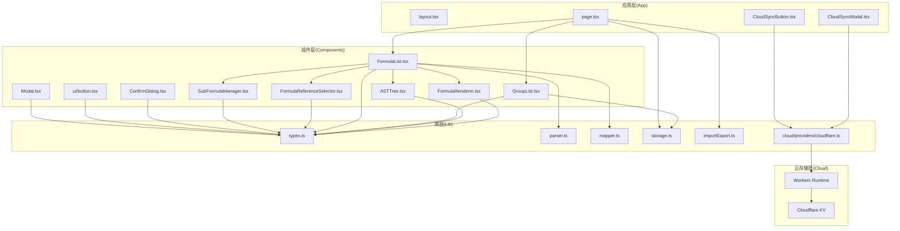

**图表来源**
- [src/app/layout.tsx:1-20](file://src/app/layout.tsx#L1-L20)
- [src/app/page.tsx:1-872](file://src/app/page.tsx#L1-L872)
- [src/components/CloudSyncModal.tsx:1-40](file://src/components/CloudSyncModal.tsx#L1-L40)
- [src/components/CloudSyncButton.tsx:1-40](file://src/components/CloudSyncButton.tsx#L1-L40)
- [src/lib/cloud/providers/cloudflare.ts:1-237](file://src/lib/cloud/providers/cloudflare.ts#L1-L237)
- [cloud/cloudflare-workers/index.ts:1-319](file://cloud/cloudflare-workers/index.ts#L1-L319)

**章节来源**
- [package.json:1-62](file://package.json#L1-L62)
- [tsconfig.json:1-44](file://tsconfig.json#L1-L44)
- [.gitignore:1-43](file://.gitignore#L1-L43)
- [cloud/cloudflare-workers/package.json:1-19](file://cloud/cloudflare-workers/package.json#L1-L19)
- [cloud/cloudflare-workers/tsconfig.json:1-22](file://cloud/cloudflare-workers/tsconfig.json#L1-L22)

## 核心组件
- 类型系统与数据模型：统一定义 Token、ASTNode、VariableMapping、Formula、SubFormula、FormulaGroup 等核心类型，保证跨模块一致的数据契约。
- 解析器：FormulaParser 实现词法分析与递归下降解析，支持 + - * / 与多类括号，输出 ASTNode。
- 映射器：VariableMapper 提供英文/中文变量提取与映射生成，支持格式化输出。
- 存储与导入导出：localStorage 持久化；导入导出协议包含版本与校验，保障数据一致性。
- 视图组件：FormulaRenderer 展示公式并高亮变量；ASTTree 将 AST 转换为 LaTeX 并动态渲染；FormulaList 聚合解析、映射与渲染；GroupList 支持树形分组与统计；FormulaReferenceSelector/SubFormulaManager 支持变量引用与子公式管理。
- **新增** 确认对话框组件：ConfirmDialog 提供统一的确认对话框，支持默认和危险两种变体，增强用户操作的安全性。
- **新增** 云存储组件：CloudSyncModal 提供云端同步界面，支持多种云存储提供商配置；**更新** CloudSyncButton 提供云端同步按钮，支持密码输入对话框。

**更新** 新增了Cloudflare Workers云存储后端，提供自动版本管理和跨设备数据同步功能。**更新** CloudSyncModal组件密码输入对话框实现方式发生重大变化，从createPortal改为直接在Dialog内部渲染，改进了事件处理机制。

**章节来源**
- [src/lib/types.ts:1-51](file://src/lib/types.ts#L1-L51)
- [src/lib/parser.ts:1-159](file://src/lib/parser.ts#L1-L159)
- [src/lib/mapper.ts:1-89](file://src/lib/mapper.ts#L1-L89)
- [src/lib/storage.ts:1-50](file://src/lib/storage.ts#L1-L50)
- [src/lib/importExport.ts:1-120](file://src/lib/importExport.ts#L1-L120)
- [src/components/ConfirmDialog.tsx:1-54](file://src/components/ConfirmDialog.tsx#L1-L54)
- [src/components/CloudSyncModal.tsx:1-40](file://src/components/CloudSyncModal.tsx#L1-L40)
- [src/components/CloudSyncButton.tsx:1-40](file://src/components/CloudSyncButton.tsx#L1-L40)

## 架构总览
系统采用"页面驱动 + 组件组合"的模式：
- 页面负责状态管理、URL 同步、数据持久化与导入导出
- 组件负责具体视图与交互，通过 props 传递数据与回调
- 库模块提供纯函数与工具，解耦业务逻辑与 UI
- **新增** 对话框组件提供统一的用户确认机制
- **新增** 云存储层提供云端数据同步和版本管理

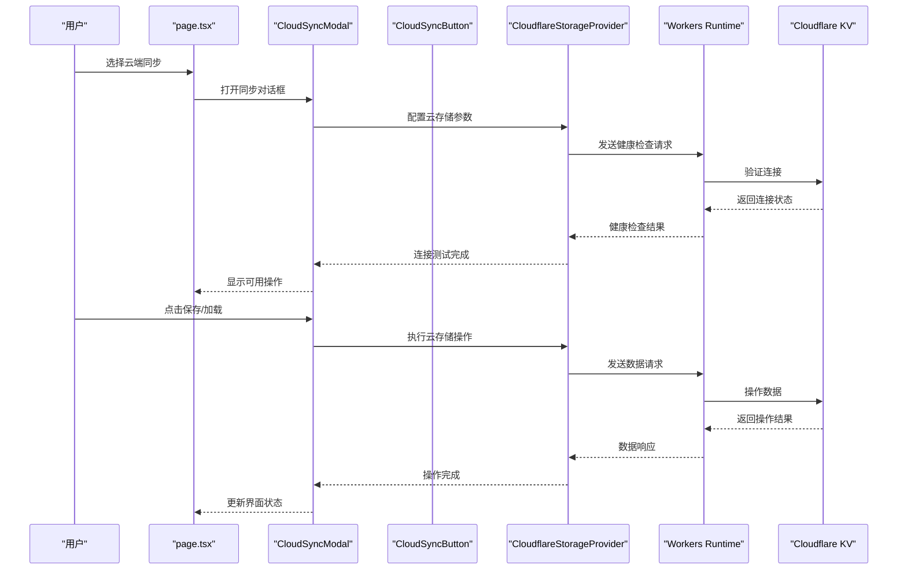

**图表来源**
- [src/app/page.tsx:1-872](file://src/app/page.tsx#L1-L872)
- [src/components/CloudSyncModal.tsx:1-40](file://src/components/CloudSyncModal.tsx#L1-L40)
- [src/components/CloudSyncButton.tsx:1-40](file://src/components/CloudSyncButton.tsx#L1-L40)
- [src/lib/cloud/providers/cloudflare.ts:210-237](file://src/lib/cloud/providers/cloudflare.ts#L210-L237)
- [cloud/cloudflare-workers/index.ts:56-92](file://cloud/cloudflare-workers/index.ts#L56-L92)

## 详细组件分析

### 类型系统与数据模型
- Token：标识符类型（运算符/变量/数字/括号）
- ASTNode：抽象语法树节点（运算符/变量/数字），支持左右子节点
- VariableMapping：变量映射结果，包含映射表、英文变量集、中文变量集与"中文变量是否更多"标记
- Formula/FormulaGroup/SubFormula：公式、分组与子公式数据结构，支持父子关系与变量引用映射
- **新增** Cloudflare存储配置：包含endpoint、apiKey等云存储连接参数
- 设计要点：通过 Record<string,string> 与数组结构实现灵活的映射与层级管理；变量引用通过前缀区分子公式与外部公式

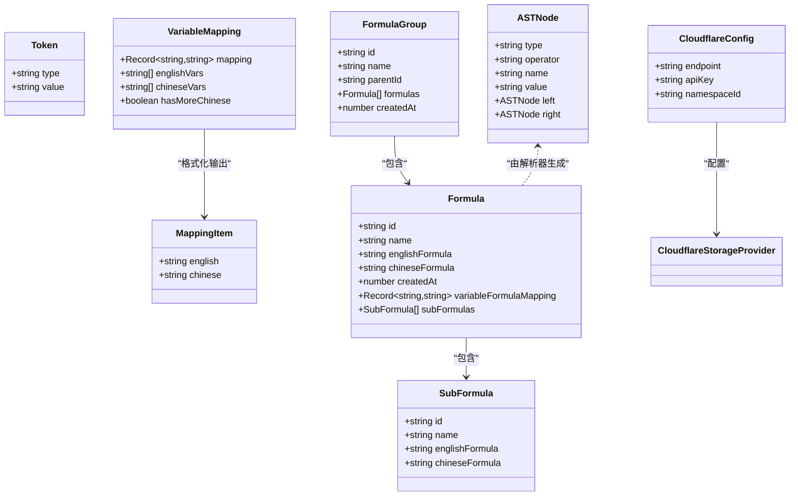

**图表来源**
- [src/lib/types.ts:1-51](file://src/lib/types.ts#L1-L51)
- [src/lib/cloud/providers/cloudflare.ts:1-237](file://src/lib/cloud/providers/cloudflare.ts#L1-L237)

**章节来源**
- [src/lib/types.ts:1-51](file://src/lib/types.ts#L1-L51)

### 公式解析器（FormulaParser）
- 词法分析：支持空白、运算符、变量（字母开头）、数字、多类括号（含中文括号）
- 语法解析：递归下降实现表达式/项/因子三级优先级，支持括号匹配与错误提示
- 输出：ASTNode，便于后续渲染与结构树展示

**图表来源**
- [src/lib/parser.ts:1-159](file://src/lib/parser.ts#L1-L159)

**章节来源**
- [src/lib/parser.ts:1-159](file://src/lib/parser.ts#L1-L159)

### 变量映射器（VariableMapper）
- 提取英文变量：正则匹配单词边界，去重
- 提取中文变量：按运算符/括号分割，过滤纯数字与空串，去重
- 创建映射：按序配对，中文不足时标注"未定义"
- 格式化输出：将映射转换为列表，便于 UI 展示

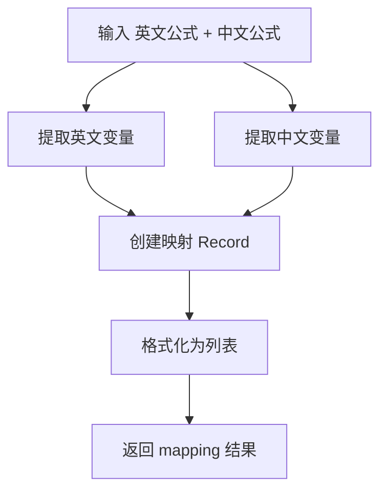

**图表来源**
- [src/lib/mapper.ts:1-89](file://src/lib/mapper.ts#L1-L89)

**章节来源**
- [src/lib/mapper.ts:1-89](file://src/lib/mapper.ts#L1-L89)

### 公式渲染器（FormulaRenderer）
- 词法切分：变量/运算符/括号/数字
- 变量高亮：按首次出现顺序分配颜色，提升可读性
- 引用高亮：若变量映射到某公式，显示引用标记并支持点击跳转
- 交互：点击引用变量触发回调，支持子公式与外部公式两种类型

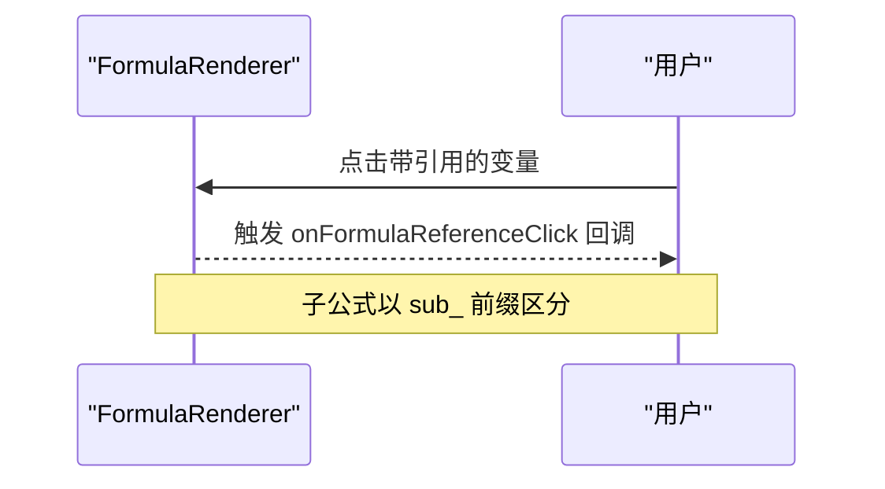

**图表来源**
- [src/components/FormulaRenderer.tsx:1-169](file://src/components/FormulaRenderer.tsx#L1-L169)

**章节来源**
- [src/components/FormulaRenderer.tsx:1-169](file://src/components/FormulaRenderer.tsx#L1-L169)

### AST 树与 LaTeX 渲染（ASTTree）
- AST 到 LaTeX：遍历 AST，生成 LaTeX 字符串；乘法/除法/幂次等运算符按优先级加括号
- 中文替换：将英文变量占位符替换为中文变量
- 动态加载：运行时按需加载 KaTeX 样式与模块，失败回退
- 切换视图：支持英文/中文切换与变量说明展示

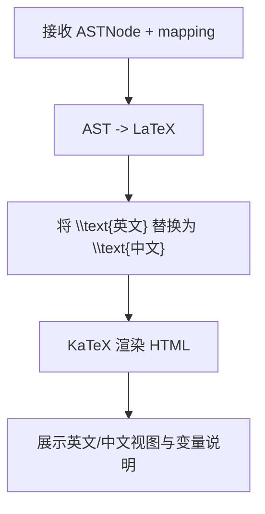

**图表来源**
- [src/components/ASTTree.tsx:1-179](file://src/components/ASTTree.tsx#L1-L179)

**章节来源**
- [src/components/ASTTree.tsx:1-179](file://src/components/ASTTree.tsx#L1-L179)

### 公式列表（FormulaList）
- 过滤与搜索：支持按分组范围与名称关键字过滤
- 展开详情：按需解析与映射，避免不必要的计算
- 引用构建：合并子公式与外部公式映射，支持点击跳转
- 错误处理：解析失败时展示错误信息

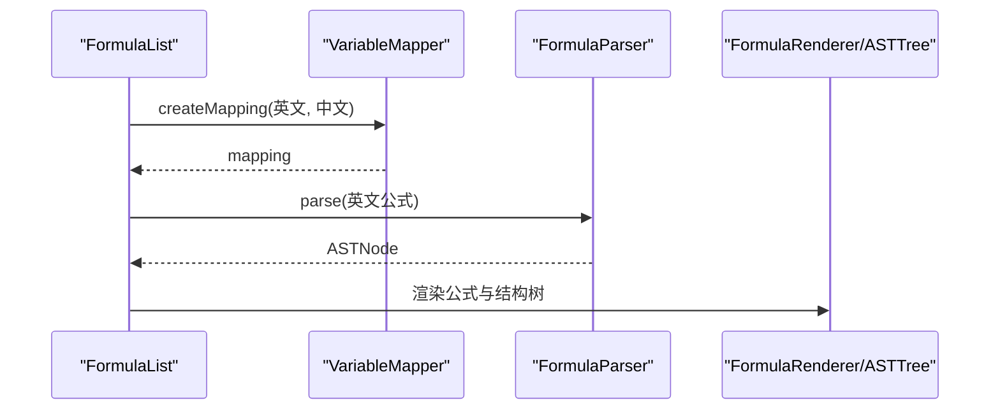

**图表来源**
- [src/components/FormulaList.tsx:1-387](file://src/components/FormulaList.tsx#L1-L387)

**章节来源**
- [src/components/FormulaList.tsx:1-387](file://src/components/FormulaList.tsx#L1-L387)

### 分组列表（GroupList）
- 树形渲染：根据 parentId 构建父子关系，支持展开/折叠
- 统计公式数量：递归统计分组及其子分组的公式总数
- 交互：新建/编辑/删除分组，删除时级联删除子分组

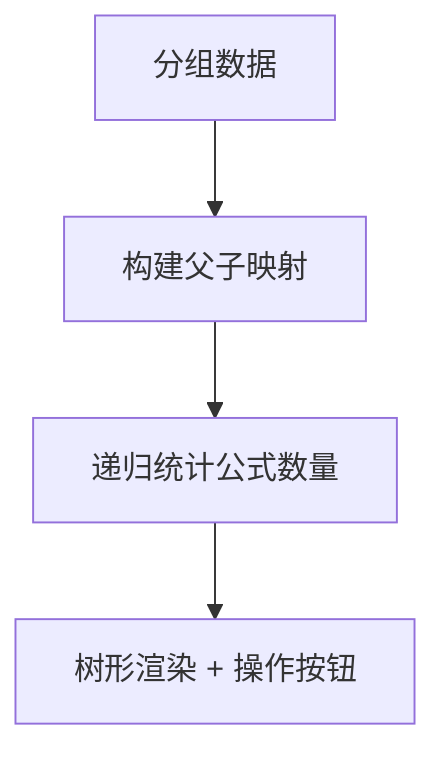

**图表来源**
- [src/components/GroupList.tsx:1-294](file://src/components/GroupList.tsx#L1-L294)

**章节来源**
- [src/components/GroupList.tsx:1-294](file://src/components/GroupList.tsx#L1-L294)

### 变量引用选择器（FormulaReferenceSelector）
- 提取变量：从英文公式中提取唯一变量
- 选项构建：支持子公式（sub_ 前缀）与外部公式分组展示
- 映射更新：onChange 返回新的变量到公式 ID 的映射

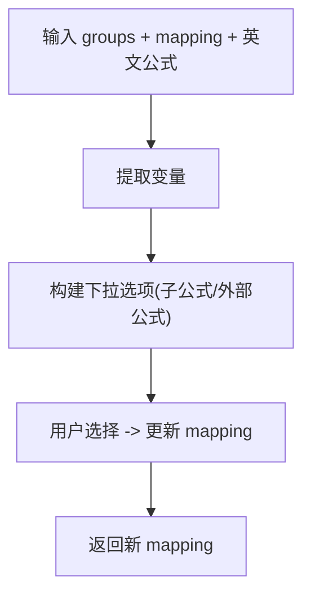

**图表来源**
- [src/components/FormulaReferenceSelector.tsx:1-132](file://src/components/FormulaReferenceSelector.tsx#L1-L132)

**章节来源**
- [src/components/FormulaReferenceSelector.tsx:1-132](file://src/components/FormulaReferenceSelector.tsx#L1-L132)

### 子公式管理（SubFormulaManager）
- CRUD：新增、编辑、删除子公式
- ID 规范：子公式 ID 以 sub_ 前缀标识，避免与外部公式冲突
- 与引用选择器配合：在变量引用选择器中作为子选项展示

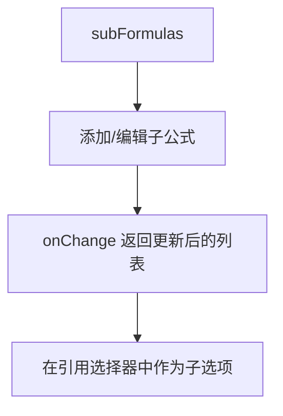

**图表来源**
- [src/components/SubFormulaManager.tsx:1-201](file://src/components/SubFormulaManager.tsx#L1-L201)

**章节来源**
- [src/components/SubFormulaManager.tsx:1-201](file://src/components/SubFormulaManager.tsx#L1-L201)

### 确认对话框组件（ConfirmDialog）
- **新增** 统一的确认对话框组件，提供一致的用户交互体验
- 支持两种变体：默认（default）和危险（danger）操作
- 事件处理：提供确认和取消回调函数
- 样式集成：使用Button组件的变体系统，支持destructive样式

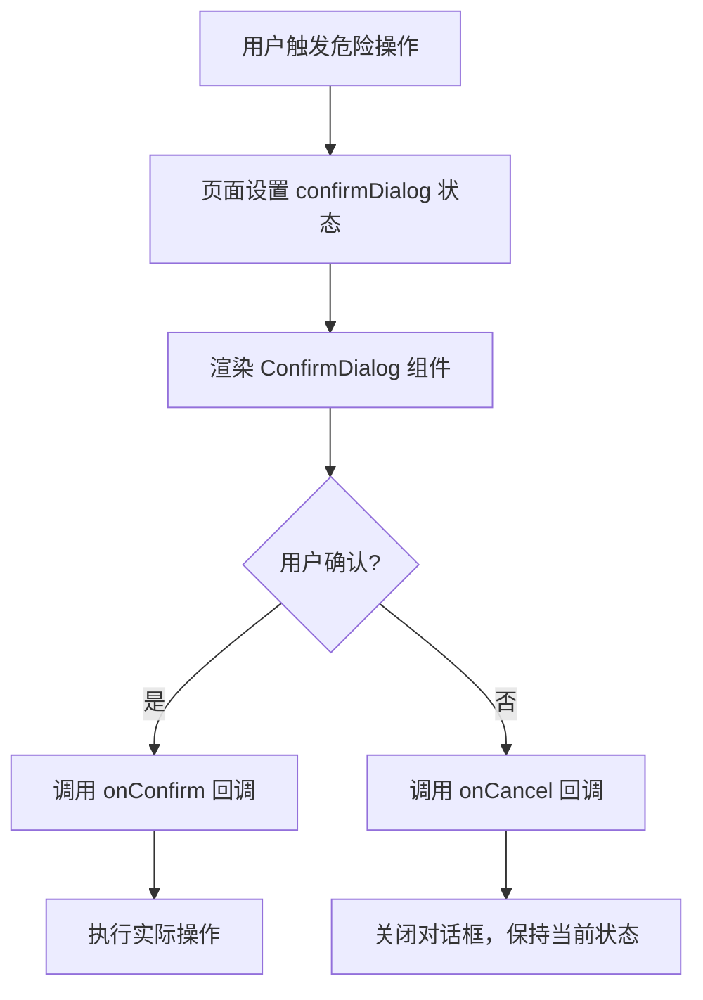

**图表来源**
- [src/components/ConfirmDialog.tsx:1-54](file://src/components/ConfirmDialog.tsx#L1-L54)
- [src/app/page.tsx:415-449](file://src/app/page.tsx#L415-L449)

**章节来源**
- [src/components/ConfirmDialog.tsx:1-54](file://src/components/ConfirmDialog.tsx#L1-L54)

### URL导入功能增强（page.tsx）
- **新增** 从URL导入数据的功能，支持远程JSON文件导入
- 示例数据：提供公共示例数据URL，便于用户快速体验
- 导入流程：URL验证 -> 网络请求 -> 数据解析 -> 确认覆盖 -> 保存数据
- 用户体验：支持键盘快捷键（Enter）和加载状态指示

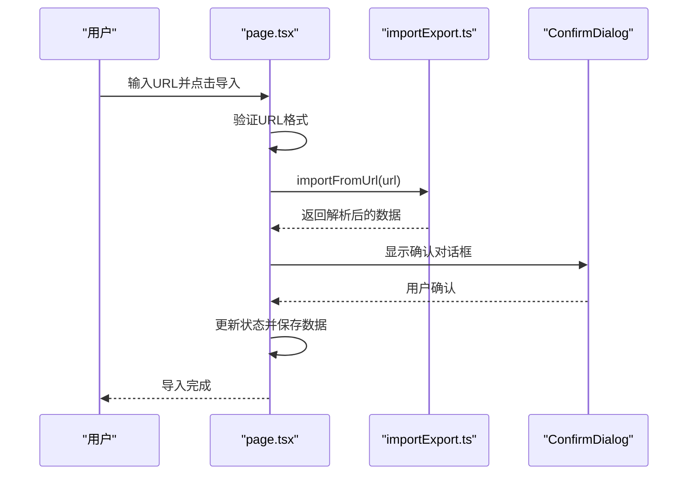

**图表来源**
- [src/app/page.tsx:415-449](file://src/app/page.tsx#L415-L449)
- [src/lib/importExport.ts:105-119](file://src/lib/importExport.ts#L105-L119)

**章节来源**
- [src/app/page.tsx:415-449](file://src/app/page.tsx#L415-L449)
- [src/lib/importExport.ts:105-119](file://src/lib/importExport.ts#L105-L119)

### 页面与状态管理（page.tsx）
- URL 同步：通过 searchParams 与 router 控制当前选中的公式
- 本地缓存：分组选择与侧边栏状态持久化到 localStorage
- 数据导入导出：支持覆盖式导入与一键导出，**新增** URL导入功能
- 对话框与模态：分组/公式 CRUD、数据菜单、**新增** ConfirmDialog确认对话框
- **增强** 危险操作保护：通过ConfirmDialog组件保护重要操作

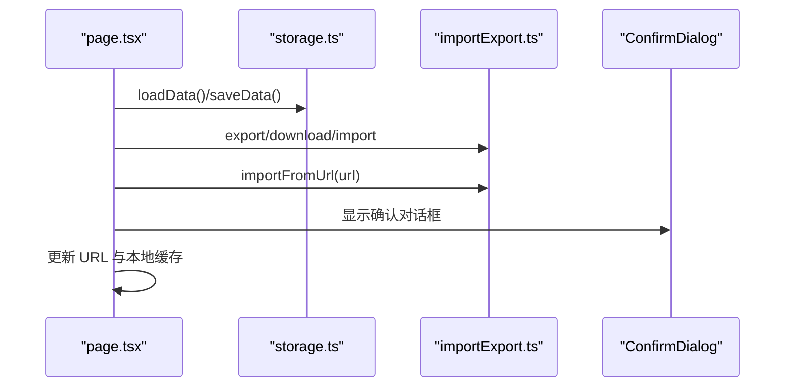

**图表来源**
- [src/app/page.tsx:1-872](file://src/app/page.tsx#L1-L872)
- [src/lib/storage.ts:1-50](file://src/lib/storage.ts#L1-L50)
- [src/lib/importExport.ts:1-120](file://src/lib/importExport.ts#L1-L120)

**章节来源**
- [src/app/page.tsx:1-872](file://src/app/page.tsx#L1-L872)
- [src/lib/storage.ts:1-50](file://src/lib/storage.ts#L1-L50)
- [src/lib/importExport.ts:1-120](file://src/lib/importExport.ts#L1-L120)

### 云端同步模态框（CloudSyncModal）
- **新增** 云端同步界面组件，支持多种云存储提供商配置
- 提供连接测试、数据保存、数据加载、版本历史查看等功能
- 集成Cloudflare Workers后端，支持API密钥认证
- 用户友好的配置界面，支持端点URL和API Key输入
- **更新** 密码输入对话框实现方式重大变更：从createPortal改为直接在Dialog内部渲染，使用固定定位和z-index控制层级，改进了事件处理机制，防止密码对话框关闭时意外关闭主对话框

**更新** 密码输入对话框实现方式重大变更：

**变更前（CloudSyncButton）**：
- 使用 `createPortal` 将密码对话框渲染到 `document.body`
- 通过 `z-[1000]` 高层级确保对话框显示在最顶层
- 需要额外的事件处理来阻止冒泡和默认行为
- 代码较为复杂，包含多个事件监听器

**变更后（CloudSyncModal）**：
- 直接在Dialog内部渲染密码对话框
- 使用 `z-[60]` 层级，与Dialog的z-index协调工作
- 通过 `onClick={(e) => e.stopPropagation()}` 阻止事件冒泡
- 通过 `modal={!showPasswordDialog}` 在密码对话框打开时禁用模态行为
- 通过 `onInteractOutside` 和 `onEscapeKeyDown` 事件处理器阻止意外关闭
- 代码更加简洁，事件处理更加直观

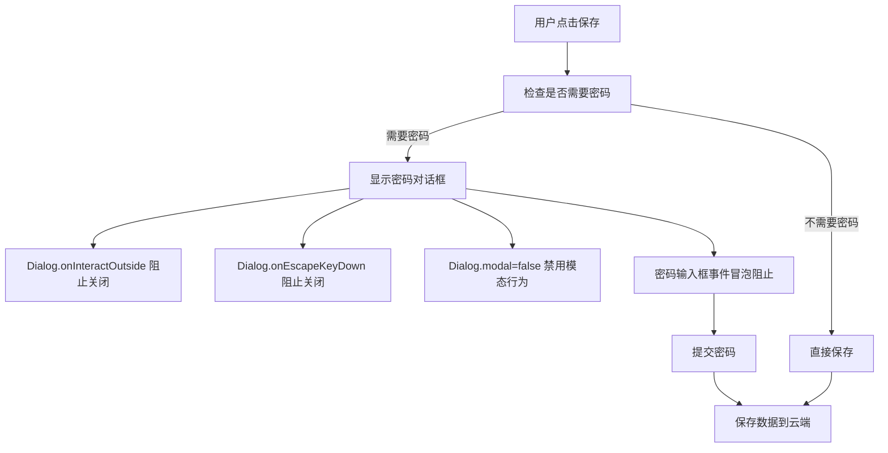

**图表来源**
- [src/components/CloudSyncModal.tsx:194-221](file://src/components/CloudSyncModal.tsx#L194-L221)
- [src/components/CloudSyncModal.tsx:469-521](file://src/components/CloudSyncModal.tsx#L469-L521)
- [src/components/CloudSyncModal.tsx:311-337](file://src/components/CloudSyncModal.tsx#L311-L337)

**章节来源**
- [src/components/CloudSyncModal.tsx:1-40](file://src/components/CloudSyncModal.tsx#L1-L40)
- [src/components/CloudSyncModal.tsx:194-221](file://src/components/CloudSyncModal.tsx#L194-L221)
- [src/components/CloudSyncModal.tsx:469-521](file://src/components/CloudSyncModal.tsx#L469-L521)
- [src/components/CloudSyncModal.tsx:311-337](file://src/components/CloudSyncModal.tsx#L311-L337)

### 云端同步按钮（CloudSyncButton）
- **新增** 云端同步按钮组件，提供下拉菜单形式的云存储操作
- 支持保存到云端、从云端加载、版本历史查看和配置管理
- 集成密码输入对话框，支持API密钥认证
- 使用createPortal将密码对话框渲染到body，确保对话框始终显示在最顶层

**更新** 密码输入对话框实现方式：
- 使用 `createPortal` 将密码对话框渲染到 `document.body`
- 通过 `z-[1000]` 高层级确保对话框显示在最顶层
- 包含完整的事件处理机制，防止事件冒泡和默认行为
- 支持键盘快捷键（Enter确认、Escape取消）

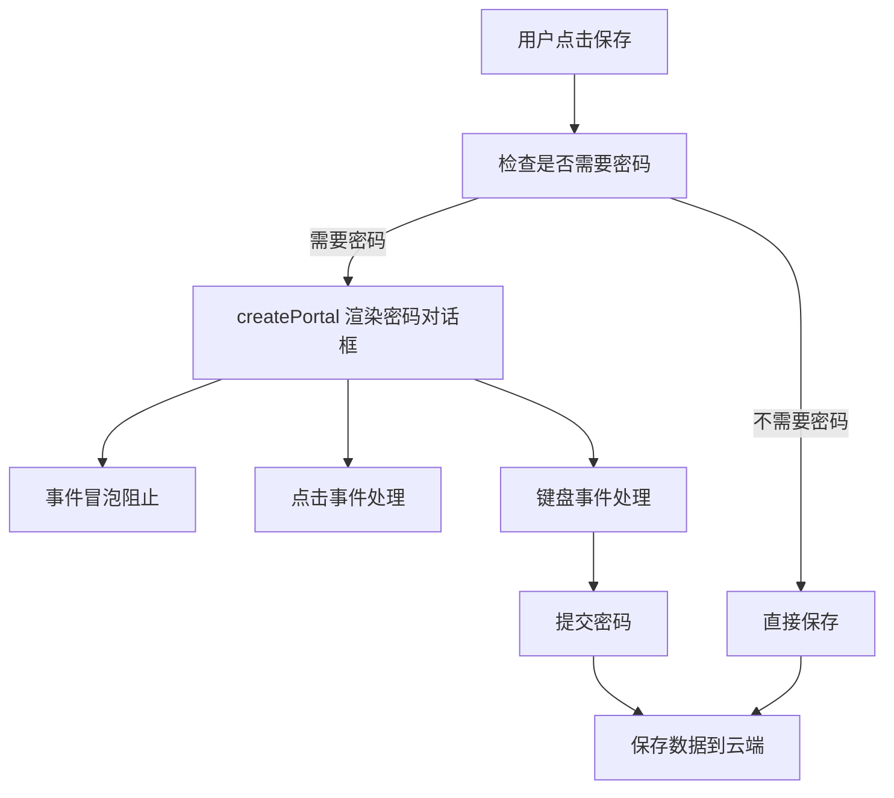

**图表来源**
- [src/components/CloudSyncButton.tsx:108-139](file://src/components/CloudSyncButton.tsx#L108-L139)
- [src/components/CloudSyncButton.tsx:271-358](file://src/components/CloudSyncButton.tsx#L271-L358)

**章节来源**
- [src/components/CloudSyncButton.tsx:1-40](file://src/components/CloudSyncButton.tsx#L1-L40)
- [src/components/CloudSyncButton.tsx:108-139](file://src/components/CloudSyncButton.tsx#L108-L139)
- [src/components/CloudSyncButton.tsx:271-358](file://src/components/CloudSyncButton.tsx#L271-L358)

## 开发环境配置

### 根项目配置
项目采用现代化的开发环境配置，确保TypeScript类型安全和开发效率：

**package.json配置要点**：
- 脚本命令：dev、build、start、lint、test等完整开发工作流
- 依赖管理：Next.js 16、React 19、TypeScript 6.0等最新稳定版本
- 开发依赖：ESLint 9、Jest 29、TailwindCSS 3.4等开发工具链

**tsconfig.json配置要点**：
- 严格模式：启用严格类型检查和ESLint集成
- 路径别名：@/* 指向src目录，简化模块导入
- 模块解析：bundler模式支持Next.js App Router
- 类型定义：包含jest和testing-library类型

**.gitignore配置要点**：
- 依赖忽略：node_modules、.pnp等
- 构建产物：.next、out、build、dist等
- 临时文件：.DS_Store、*.pem、npm-debug.log等
- IDE配置：.idea、.vscode等

**章节来源**
- [package.json:1-62](file://package.json#L1-L62)
- [tsconfig.json:1-44](file://tsconfig.json#L1-L44)
- [.gitignore:1-43](file://.gitignore#L1-L43)

### Cloudflare Workers开发环境
**新增** 完整的Cloudflare Workers开发环境配置：

**Worker项目结构**：
- index.ts：主入口文件，实现RESTful API端点
- wrangler.toml：部署配置文件，包含KV命名空间绑定
- package.json：Node.js依赖管理，支持wrangler开发工具
- tsconfig.json：TypeScript编译配置，支持Cloudflare Workers类型

**开发脚本**：
- dev：wrangler dev --local 启动本地开发服务器
- deploy：wrangler deploy 部署到Cloudflare Workers
- build：tsc --noEmit TypeScript编译检查

**TypeScript配置**：
- ES2020目标，ESNext模块系统
- @cloudflare/workers-types 提供Cloudflare Workers类型定义
- 声明文件生成，支持源码映射和调试

**章节来源**
- [cloud/cloudflare-workers/package.json:1-19](file://cloud/cloudflare-workers/package.json#L1-L19)
- [cloud/cloudflare-workers/tsconfig.json:1-22](file://cloud/cloudflare-workers/tsconfig.json#L1-L22)
- [cloud/cloudflare-workers/wrangler.toml:1-13](file://cloud/cloudflare-workers/wrangler.toml#L1-L13)

## Cloudflare Workers云存储

### 架构设计
Cloudflare Workers提供了一个完全无服务器的后端解决方案，具有以下特点：

**核心功能**：
- 健康检查：/health 端点用于连接测试
- 数据持久化：通过Cloudflare KV存储数据
- 版本管理：自动版本控制，最多保留100个版本
- 跨域支持：完整的CORS配置，支持预检请求

**API端点设计**：
- POST /save：保存数据到KV，同时创建版本记录
- GET /load：从KV加载数据
- DELETE /delete：删除指定键的数据及所有版本
- GET /list：列出所有数据键
- GET /versions：获取指定键的版本历史
- GET /load-version：加载指定版本的数据
- **新增** GET /need-password：检查是否需要密码认证

**版本控制机制**：
- 自动版本生成：使用时间戳作为版本ID
- 版本清理：超过100个版本自动删除最旧的版本
- 版本存储：每个版本单独存储，支持历史恢复

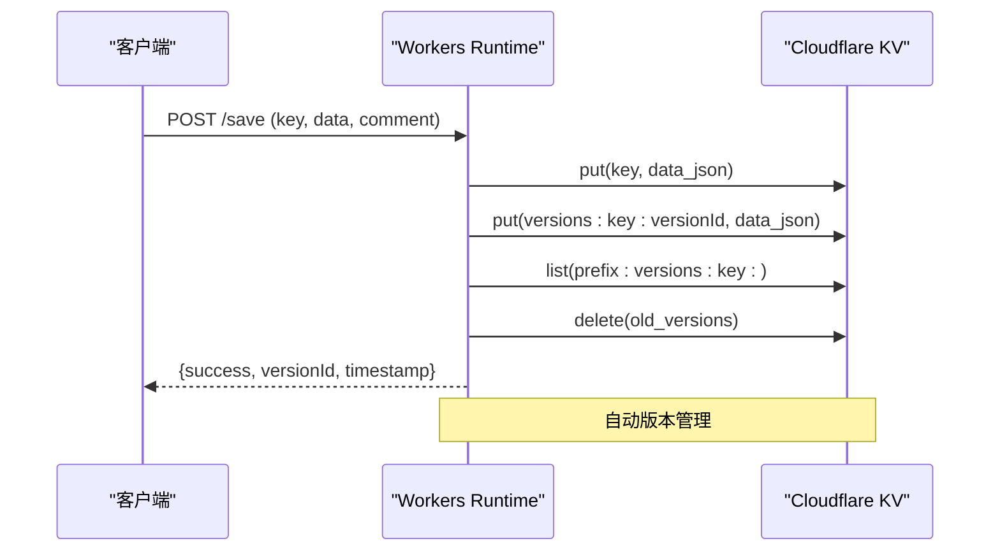

**图表来源**
- [cloud/cloudflare-workers/index.ts:97-139](file://cloud/cloudflare-workers/index.ts#L97-L139)
- [cloud/cloudflare-workers/index.ts:144-161](file://cloud/cloudflare-workers/index.ts#L144-L161)

**章节来源**
- [cloud/cloudflare-workers/index.ts:1-319](file://cloud/cloudflare-workers/index.ts#L1-L319)

### CORS跨域配置
**新增** 完善的CORS配置解决方案：

**CORS头配置**：
- Access-Control-Allow-Origin: * 支持任意来源
- Access-Control-Allow-Methods: GET, POST, DELETE, OPTIONS, PUT
- Access-Control-Allow-Headers: Content-Type, Authorization, X-Requested-With
- Access-Control-Max-Age: 86400 预检请求缓存24小时
- Access-Control-Allow-Credentials: false 明确不允许携带凭证

**预检请求处理**：
- 明确返回200状态码
- 包含完整的CORS头信息
- 支持所有HTTP方法

**部署和验证**：
- 提供完整的部署检查清单
- 包含CORS问题快速修复指南
- 提供详细的故障排查文档

**章节来源**
- [cloud/CORS_SOLUTION_SUMMARY.md:1-154](file://cloud/CORS_SOLUTION_SUMMARY.md#L1-L154)
- [cloud/CORS_TROUBLESHOOTING.md:1-247](file://cloud/CORS_TROUBLESHOOTING.md#L1-L247)
- [cloud/DEPLOYMENT_CHECKLIST.md:1-96](file://cloud/DEPLOYMENT_CHECKLIST.md#L1-L96)

### 云存储提供商集成
**新增** Cloudflare存储提供器实现：

**配置管理**：
- 支持endpoint和apiKey配置
- 自动连接测试，确保Worker可达性
- 支持可选的API密钥认证

**操作实现**：
- save：保存数据到Cloudflare KV，支持版本记录
- load：从KV加载数据，支持错误处理
- delete：删除数据及所有版本历史
- list：列出所有数据键
- getVersions：获取版本历史列表
- loadVersion：加载指定版本数据
- testConnection：测试Worker连接状态
- **新增** needPassword：检查是否需要密码认证

**错误处理**：
- HTTP状态码标准化
- 详细的错误消息
- 重试机制支持

**章节来源**
- [src/lib/cloud/providers/cloudflare.ts:1-237](file://src/lib/cloud/providers/cloudflare.ts#L1-L237)

## 依赖关系分析
- 运行时依赖：Next.js、React、KaTeX、TailwindCSS 生态与 Radix UI 组件库
- 开发依赖：TypeScript、ESLint、PostCSS、TailwindCSS
- 路由与配置：Next.js App Router、严格模式、路径别名 @/*
- **新增** UI组件：ConfirmDialog依赖Button组件，Modal提供基础对话框封装
- **新增** 云存储依赖：Cloudflare Workers运行时类型定义，支持无服务器部署
- **新增** 开发工具：wrangler CLI用于Cloudflare Workers开发和部署
- **更新** 对话框实现：CloudSyncModal使用原生事件处理，CloudSyncButton使用createPortal

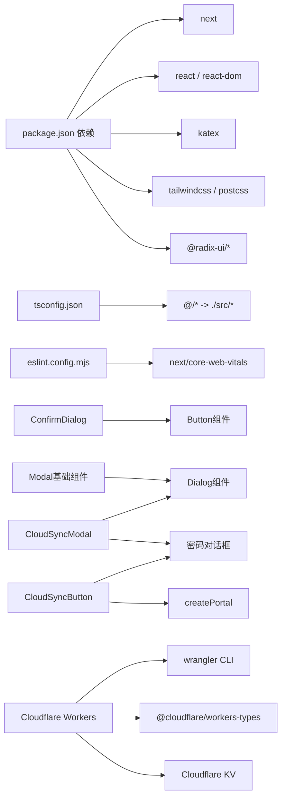

**图表来源**
- [package.json:1-62](file://package.json#L1-L62)
- [tsconfig.json:1-44](file://tsconfig.json#L1-L44)
- [eslint.config.mjs:1-30](file://eslint.config.mjs#L1-L30)
- [cloud/cloudflare-workers/package.json:1-19](file://cloud/cloudflare-workers/package.json#L1-L19)
- [cloud/cloudflare-workers/tsconfig.json:1-22](file://cloud/cloudflare-workers/tsconfig.json#L1-L22)

**章节来源**
- [package.json:1-62](file://package.json#L1-L62)
- [tsconfig.json:1-44](file://tsconfig.json#L1-L44)
- [eslint.config.mjs:1-30](file://eslint.config.mjs#L1-L30)
- [cloud/cloudflare-workers/package.json:1-19](file://cloud/cloudflare-workers/package.json#L1-L19)

## 性能考虑
- 惰性解析：FormulaList 仅在展开公式详情时解析与映射，避免全量计算
- 记忆化：FormulaReferenceSelector 使用 useMemo 缓存变量提取与公式列表
- 本地缓存：分组选择与侧边栏状态持久化，减少重复计算与滚动恢复
- UI 优化：FormulaRenderer 按首次出现顺序分配颜色，降低视觉复杂度
- 导入导出：批量序列化/反序列化，避免频繁 DOM 操作
- **新增** 对话框优化：CloudSyncModal使用条件渲染，仅在需要时创建DOM元素；**更新** 密码对话框实现方式更加高效
- **新增** 云存储优化：Cloudflare Workers使用无服务器架构，自动扩缩容
- **新增** CORS优化：预检请求缓存24小时，减少重复的跨域检查

## 故障排查指南
- 解析错误：检查公式是否包含未闭合括号、非法字符或不支持的运算符
- 变量未定义：确认变量映射是否正确建立，中文变量是否足够
- 引用失效：当外部公式被删除或子公式 ID 变更时，引用会变为未定义
- 导入失败：确认 JSON 文件格式正确、包含版本与 groups 数组且每条数据结构完整
- 渲染异常：若 KaTeX 加载失败，组件会降级显示原始文本并提示错误
- **新增** URL导入问题：检查网络连接、URL格式正确性，确认远程服务器允许跨域访问
- **新增** 确认对话框问题：检查confirmDialog状态管理，确保onConfirm/onCancel回调正确绑定
- **新增** Cloudflare Workers部署问题：检查KV命名空间配置、Worker URL格式、API密钥设置
- **新增** CORS跨域问题：验证CORS头配置、预检请求处理、浏览器缓存清理
- **更新** 密码对话框问题：检查事件冒泡处理、z-index层级设置、模态行为禁用机制

**章节来源**
- [src/components/FormulaList.tsx:160-192](file://src/components/FormulaList.tsx#L160-L192)
- [src/lib/importExport.ts:43-75](file://src/lib/importExport.ts#L43-L75)
- [src/components/ASTTree.tsx:124-142](file://src/components/ASTTree.tsx#L124-L142)
- [src/app/page.tsx:415-449](file://src/app/page.tsx#L415-L449)
- [cloud/CORS_SOLUTION_SUMMARY.md:112-147](file://cloud/CORS_SOLUTION_SUMMARY.md#L112-L147)
- [src/components/CloudSyncModal.tsx:311-337](file://src/components/CloudSyncModal.tsx#L311-L337)

## 结论
本项目通过清晰的类型系统、可扩展的解析与映射模块、以及组件化的 UI 设计，实现了从数据到视图的完整闭环。其模块化与惰性策略为后续扩展（如公式验证、批量导入、多语言支持）提供了良好基础。

**更新** 新增的ConfirmDialog组件显著提升了用户体验和操作安全性，URL导入功能增强了数据获取的便利性，Cloudflare Workers云存储后端提供了可靠的云端同步和版本管理能力。**更新** CloudSyncModal组件密码输入对话框实现方式的重大变更，从createPortal改为直接在Dialog内部渲染，改进了事件处理机制，使代码更加简洁高效，用户体验更加流畅。

## 附录

### 开发环境搭建
- 安装依赖：使用包管理器安装项目依赖
- 启动开发服务器：运行 dev 脚本
- 构建与启动：build 与 start 脚本用于生产部署
- 代码规范：遵循 ESLint 规则，保持命名与未使用变量的清理
- **新增** Cloudflare Workers开发：cd cloud/cloudflare-workers && npm install && wrangler dev --local

**章节来源**
- [package.json:5-12](file://package.json#L5-L12)
- [eslint.config.mjs:15-29](file://eslint.config.mjs#L15-L29)
- [cloud/cloudflare-workers/package.json:7-10](file://cloud/cloudflare-workers/package.json#L7-L10)

### TypeScript 类型系统使用
- 使用严格模式与路径别名，确保类型安全与模块引用简洁
- 在组件间传递数据时，尽量使用明确的接口类型，避免 any
- **新增** 云存储类型：CloudflareConfig接口定义云存储连接参数

**章节来源**
- [tsconfig.json:19-28](file://tsconfig.json#L19-L28)
- [src/lib/cloud/providers/cloudflare.ts:1-237](file://src/lib/cloud/providers/cloudflare.ts#L1-L237)

### Next.js 路由与页面组织
- App Router：页面位于 src/app，布局在 layout.tsx
- 路由参数：通过 Next.js Navigation API 与 URL SearchParams 同步状态
- 资源与样式：通过 Tailwind 与全局 CSS 组织样式

**章节来源**
- [src/app/layout.tsx:1-20](file://src/app/layout.tsx#L1-L20)
- [src/app/page.tsx:1-872](file://src/app/page.tsx#L1-L872)

### 代码贡献指南
- 提交前请运行 lint 与必要的测试（如存在）
- 修改涉及类型定义时，同步更新相关组件与工具
- 新增功能建议拆分为独立模块，保持单一职责
- **新增** 对话框组件：使用ConfirmDialog组件替代直接的alert/prompt调用
- **新增** 云存储功能：新增Cloudflare Workers后端，提供云端同步能力
- **新增** CORS配置：确保跨域请求的正确处理和部署验证
- **更新** 密码对话框实现：优先使用CloudSyncModal的直接渲染方式，避免createPortal的复杂性

**章节来源**
- [package.json:9](file://package.json#L9)
- [eslint.config.mjs:15-29](file://eslint.config.mjs#L15-L29)

### 核心业务逻辑实现原理
- 公式解析：词法分析 + 递归下降，输出 AST
- 变量映射：英文变量与中文变量一一对应，不足时标注未定义
- 数据持久化：localStorage 存储分组与公式；导入导出包含版本与结构校验
- 可视化：LaTeX 渲染与结构树展示，支持中英文切换与变量说明
- **新增** URL导入：通过fetch API获取远程JSON数据，支持错误处理和状态管理
- **新增** 云存储：通过Cloudflare Workers实现数据的云端同步和版本管理
- **新增** CORS处理：完整的跨域请求支持，包括预检请求和认证头处理
- **更新** 密码认证：支持两种实现方式，CloudSyncModal使用直接渲染，CloudSyncButton使用createPortal

**章节来源**
- [src/lib/parser.ts:12-22](file://src/lib/parser.ts#L12-L22)
- [src/lib/mapper.ts:52-70](file://src/lib/mapper.ts#L52-L70)
- [src/lib/storage.ts:5-25](file://src/lib/storage.ts#L5-L25)
- [src/lib/importExport.ts:12-20](file://src/lib/importExport.ts#L12-L20)
- [src/components/ASTTree.tsx:27-61](file://src/components/ASTTree.tsx#L27-L61)
- [src/lib/importExport.ts:105-119](file://src/lib/importExport.ts#L105-L119)
- [cloud/cloudflare-workers/index.ts:56-92](file://cloud/cloudflare-workers/index.ts#L56-L92)

### 扩展与二次开发建议
- 公式验证：在解析前增加语义检查（如变量定义域、函数支持）
- 多语言：引入 i18n，支持多语言 UI 与公式描述
- 批量导入：支持增量导入与冲突解决策略
- 图表增强：在 ASTTree 基础上增加交互式拖拽与编辑
- **新增** 对话框组件：为所有危险操作提供ConfirmDialog组件，提升用户体验
- **新增** 导入功能：扩展URL导入支持OAuth认证、批量导入等功能
- **新增** 数据备份：实现自动备份和版本控制功能
- **新增** 云存储扩展：支持AWS S3、阿里云OSS等其他云存储提供商
- **新增** 性能监控：集成Cloudflare Analytics，监控Worker性能指标
- **更新** 密码对话框实现：优先考虑CloudSyncModal的直接渲染方式，提供更好的事件处理和用户体验

**章节来源**
- [src/components/ConfirmDialog.tsx:1-54](file://src/components/ConfirmDialog.tsx#L1-L54)
- [src/lib/importExport.ts:105-119](file://src/lib/importExport.ts#L105-L119)
- [cloud/cloudflare-workers/index.ts:56-92](file://cloud/cloudflare-workers/index.ts#L56-L92)
- [src/components/CloudSyncModal.tsx:469-521](file://src/components/CloudSyncModal.tsx#L469-L521)