# 开发者指南

<cite>
**本文档引用的文件**   
- [package.json](file://package.json)
- [tsconfig.json](file://tsconfig.json)
- [next.config.js](file://next.config.js)
- [eslint.config.mjs](file://eslint.config.mjs)
- [src/app/layout.tsx](file://src/app/layout.tsx)
- [src/app/page.tsx](file://src/app/page.tsx)
- [src/lib/types.ts](file://src/lib/types.ts)
- [src/lib/parser.ts](file://src/lib/parser.ts)
- [src/lib/mapper.ts](file://src/lib/mapper.ts)
- [src/lib/storage.ts](file://src/lib/storage.ts)
- [src/lib/importExport.ts](file://src/lib/importExport.ts)
- [src/components/ASTTree.tsx](file://src/components/ASTTree.tsx)
- [src/components/FormulaRenderer.tsx](file://src/components/FormulaRenderer.tsx)
- [src/components/FormulaList.tsx](file://src/components/FormulaList.tsx)
- [src/components/GroupList.tsx](file://src/components/GroupList.tsx)
- [src/components/FormulaReferenceSelector.tsx](file://src/components/FormulaReferenceSelector.tsx)
- [src/components/SubFormulaManager.tsx](file://src/components/SubFormulaManager.tsx)
- [src/components/ConfirmDialog.tsx](file://src/components/ConfirmDialog.tsx)
- [src/components/Modal.tsx](file://src/components/Modal.tsx)
- [src/components/ui/button.tsx](file://src/components/ui/button.tsx)
- [src/components/ui/dialog.tsx](file://src/components/ui/dialog.tsx)
- [public/demo-data.json](file://public/demo-data.json)
</cite>

## 更新摘要
**变更内容**   
- 新增ConfirmDialog组件的详细说明和使用场景
- 增强URL导入功能的实现原理和用户体验
- 完善数据管理功能的安全机制和确认流程
- 更新页面状态管理和对话框组件的集成方式

## 目录
1. [简介](#简介)
2. [项目结构](#项目结构)
3. [核心组件](#核心组件)
4. [架构总览](#架构总览)
5. [详细组件分析](#详细组件分析)
6. [依赖关系分析](#依赖关系分析)
7. [性能考虑](#性能考虑)
8. [故障排查指南](#故障排查指南)
9. [结论](#结论)
10. [附录](#附录)

## 简介
本项目是一个"公式变量映射与可视化工具"，旨在帮助用户将英文公式与其对应的中文公式进行变量级映射，并通过多种视图（变量说明、公式渲染、AST 结构树）直观呈现。系统采用 Next.js 16 应用框架、TypeScript 类型系统、React 组件化架构，结合本地存储与导入导出能力，提供完整的公式管理与可视化体验。

**更新** 项目现已引入ConfirmDialog组件，增强了用户界面的一致性和安全性，同时完善了URL导入功能，提供更好的用户体验。

## 项目结构
项目采用基于功能域的组织方式，主要分为三层：
- 应用层（App Router）：页面入口与布局
- 组件层（Components）：UI 组件与业务组件，包含新增的ConfirmDialog组件
- 库层（Lib）：类型定义、解析器、映射器、存储与导入导出工具

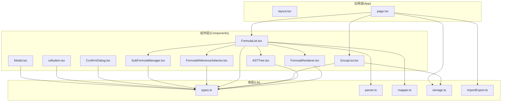

**图表来源**
- [src/app/layout.tsx:1-20](file://src/app/layout.tsx#L1-L20)
- [src/app/page.tsx:1-872](file://src/app/page.tsx#L1-L872)
- [src/components/GroupList.tsx:1-294](file://src/components/GroupList.tsx#L1-L294)
- [src/components/FormulaList.tsx:1-387](file://src/components/FormulaList.tsx#L1-L387)
- [src/components/FormulaRenderer.tsx:1-169](file://src/components/FormulaRenderer.tsx#L1-L169)
- [src/components/ASTTree.tsx:1-179](file://src/components/ASTTree.tsx#L1-L179)
- [src/components/FormulaReferenceSelector.tsx:1-132](file://src/components/FormulaReferenceSelector.tsx#L1-L132)
- [src/components/SubFormulaManager.tsx:1-201](file://src/components/SubFormulaManager.tsx#L1-L201)
- [src/components/ConfirmDialog.tsx:1-54](file://src/components/ConfirmDialog.tsx#L1-L54)
- [src/components/Modal.tsx:1-23](file://src/components/Modal.tsx#L1-L23)
- [src/components/ui/button.tsx:1-58](file://src/components/ui/button.tsx#L1-L58)
- [src/lib/types.ts:1-51](file://src/lib/types.ts#L1-L51)
- [src/lib/parser.ts:1-159](file://src/lib/parser.ts#L1-L159)
- [src/lib/mapper.ts:1-89](file://src/lib/mapper.ts#L1-L89)
- [src/lib/storage.ts:1-50](file://src/lib/storage.ts#L1-L50)
- [src/lib/importExport.ts:1-120](file://src/lib/importExport.ts#L1-L120)

**章节来源**
- [package.json:1-48](file://package.json#L1-L48)
- [tsconfig.json:1-42](file://tsconfig.json#L1-L42)
- [next.config.js:1-7](file://next.config.js#L1-L7)
- [eslint.config.mjs:1-30](file://eslint.config.mjs#L1-L30)

## 核心组件
- 类型系统与数据模型：统一定义 Token、ASTNode、VariableMapping、Formula、SubFormula、FormulaGroup 等核心类型，保证跨模块一致的数据契约。
- 解析器：FormulaParser 实现词法分析与递归下降解析，支持 + - * / 与多类括号，输出 ASTNode。
- 映射器：VariableMapper 提供英文/中文变量提取与映射生成，支持格式化输出。
- 存储与导入导出：localStorage 持久化；导入导出协议包含版本与校验，保障数据一致性。
- 视图组件：FormulaRenderer 展示公式并高亮变量；ASTTree 将 AST 转换为 LaTeX 并动态渲染；FormulaList 聚合解析、映射与渲染；GroupList 支持树形分组与统计；FormulaReferenceSelector/SubFormulaManager 支持变量引用与子公式管理。
- **新增** 确认对话框组件：ConfirmDialog 提供统一的确认对话框，支持默认和危险两种变体，增强用户操作的安全性。

**更新** 新增了ConfirmDialog组件，用于处理重要的用户操作确认，如数据导入覆盖、清空数据等危险操作。

**章节来源**
- [src/lib/types.ts:1-51](file://src/lib/types.ts#L1-L51)
- [src/lib/parser.ts:1-159](file://src/lib/parser.ts#L1-L159)
- [src/lib/mapper.ts:1-89](file://src/lib/mapper.ts#L1-L89)
- [src/lib/storage.ts:1-50](file://src/lib/storage.ts#L1-L50)
- [src/lib/importExport.ts:1-120](file://src/lib/importExport.ts#L1-L120)
- [src/components/ConfirmDialog.tsx:1-54](file://src/components/ConfirmDialog.tsx#L1-L54)

## 架构总览
系统采用"页面驱动 + 组件组合"的模式：
- 页面负责状态管理、URL 同步、数据持久化与导入导出
- 组件负责具体视图与交互，通过 props 传递数据与回调
- 库模块提供纯函数与工具，解耦业务逻辑与 UI
- **新增** 对话框组件提供统一的用户确认机制

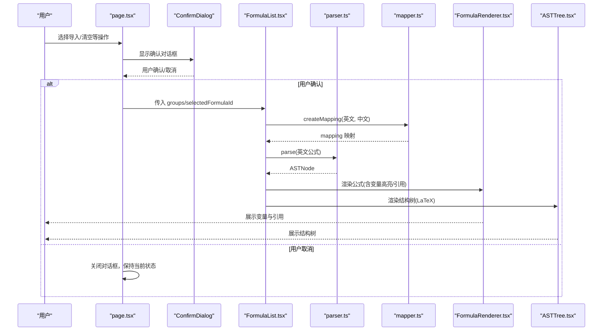

**图表来源**
- [src/app/page.tsx:1-872](file://src/app/page.tsx#L1-L872)
- [src/components/ConfirmDialog.tsx:1-54](file://src/components/ConfirmDialog.tsx#L1-L54)
- [src/components/FormulaList.tsx:1-387](file://src/components/FormulaList.tsx#L1-L387)
- [src/lib/mapper.ts:1-89](file://src/lib/mapper.ts#L1-L89)
- [src/lib/parser.ts:1-159](file://src/lib/parser.ts#L1-L159)
- [src/components/FormulaRenderer.tsx:1-169](file://src/components/FormulaRenderer.tsx#L1-L169)
- [src/components/ASTTree.tsx:1-179](file://src/components/ASTTree.tsx#L1-L179)

## 详细组件分析

### 类型系统与数据模型
- Token：标识符类型（运算符/变量/数字/括号）
- ASTNode：抽象语法树节点（运算符/变量/数字），支持左右子节点
- VariableMapping：变量映射结果，包含映射表、英文变量集、中文变量集与"中文变量是否更多"标记
- Formula/FormulaGroup/SubFormula：公式、分组与子公式数据结构，支持父子关系与变量引用映射
- 设计要点：通过 Record<string,string> 与数组结构实现灵活的映射与层级管理；变量引用通过前缀区分子公式与外部公式

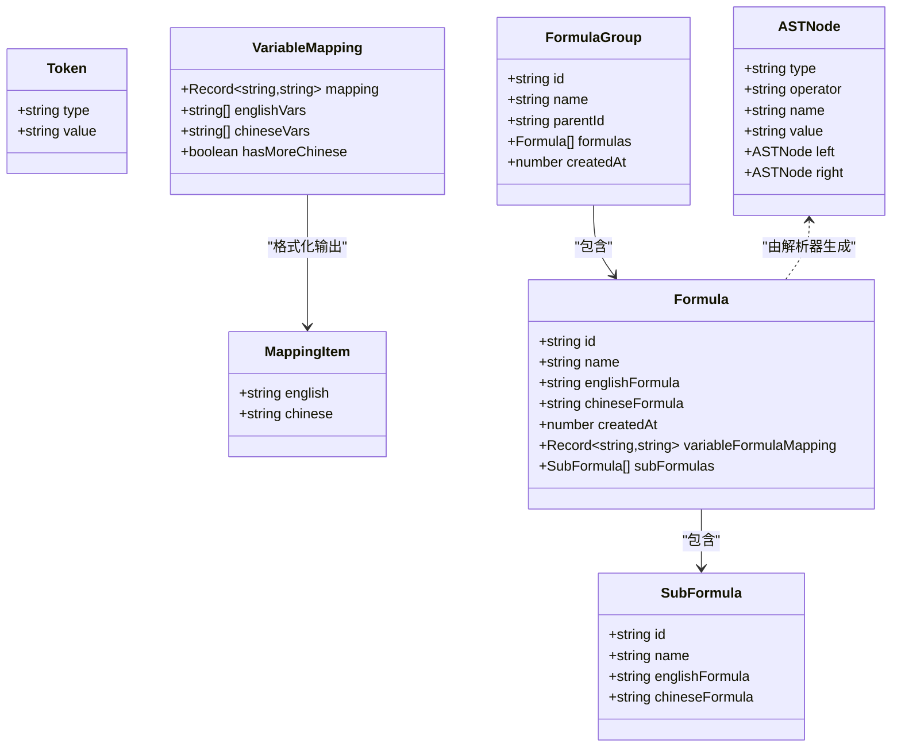

**图表来源**
- [src/lib/types.ts:1-51](file://src/lib/types.ts#L1-L51)

**章节来源**
- [src/lib/types.ts:1-51](file://src/lib/types.ts#L1-L51)

### 公式解析器（FormulaParser）
- 词法分析：支持空白、运算符、变量（字母开头）、数字、多类括号（含中文括号）
- 语法解析：递归下降实现表达式/项/因子三级优先级，支持括号匹配与错误提示
- 输出：ASTNode，便于后续渲染与结构树展示

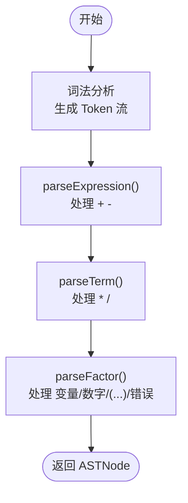

**图表来源**
- [src/lib/parser.ts:1-159](file://src/lib/parser.ts#L1-L159)

**章节来源**
- [src/lib/parser.ts:1-159](file://src/lib/parser.ts#L1-L159)

### 变量映射器（VariableMapper）
- 提取英文变量：正则匹配单词边界，去重
- 提取中文变量：按运算符/括号分割，过滤纯数字与空串，去重
- 创建映射：按序配对，中文不足时标注"未定义"
- 格式化输出：将映射转换为列表，便于 UI 展示

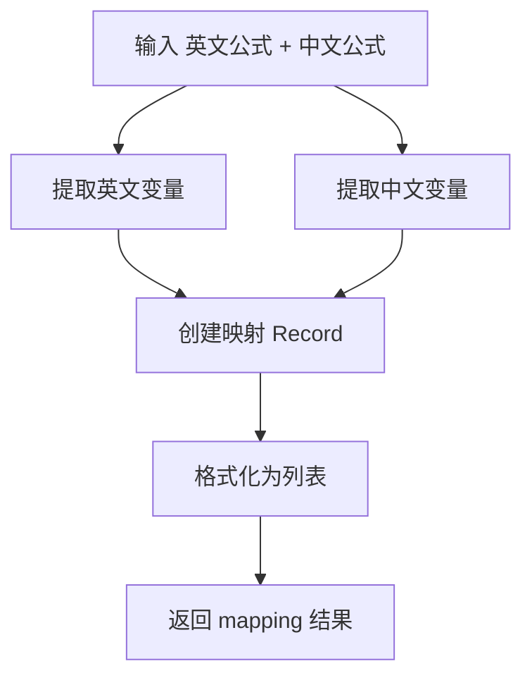

**图表来源**
- [src/lib/mapper.ts:1-89](file://src/lib/mapper.ts#L1-L89)

**章节来源**
- [src/lib/mapper.ts:1-89](file://src/lib/mapper.ts#L1-L89)

### 公式渲染器（FormulaRenderer）
- 词法切分：变量/运算符/括号/数字
- 变量高亮：按首次出现顺序分配颜色，提升可读性
- 引用高亮：若变量映射到某公式，显示引用标记并支持点击跳转
- 交互：点击引用变量触发回调，支持子公式与外部公式两种类型

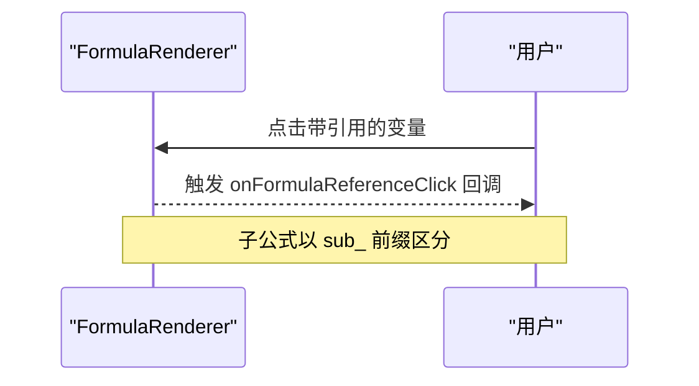

**图表来源**
- [src/components/FormulaRenderer.tsx:1-169](file://src/components/FormulaRenderer.tsx#L1-L169)

**章节来源**
- [src/components/FormulaRenderer.tsx:1-169](file://src/components/FormulaRenderer.tsx#L1-L169)

### AST 树与 LaTeX 渲染（ASTTree）
- AST 到 LaTeX：遍历 AST，生成 LaTeX 字符串；乘法/除法/幂次等运算符按优先级加括号
- 中文替换：将英文变量占位符替换为中文变量
- 动态加载：运行时按需加载 KaTeX 样式与模块，失败回退
- 切换视图：支持英文/中文切换与变量说明展示

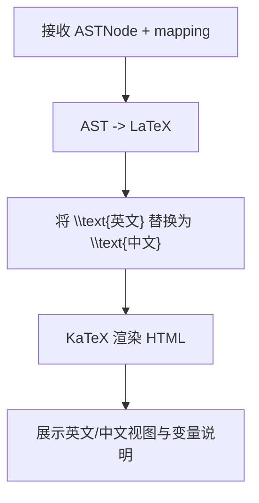

**图表来源**
- [src/components/ASTTree.tsx:1-179](file://src/components/ASTTree.tsx#L1-L179)

**章节来源**
- [src/components/ASTTree.tsx:1-179](file://src/components/ASTTree.tsx#L1-L179)

### 公式列表（FormulaList）
- 过滤与搜索：支持按分组范围与名称关键字过滤
- 展开详情：按需解析与映射，避免不必要的计算
- 引用构建：合并子公式与外部公式映射，支持点击跳转
- 错误处理：解析失败时展示错误信息

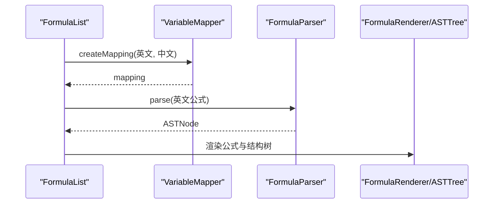

**图表来源**
- [src/components/FormulaList.tsx:1-387](file://src/components/FormulaList.tsx#L1-L387)

**章节来源**
- [src/components/FormulaList.tsx:1-387](file://src/components/FormulaList.tsx#L1-L387)

### 分组列表（GroupList）
- 树形渲染：根据 parentId 构建父子关系，支持展开/折叠
- 统计公式数量：递归统计分组及其子分组的公式总数
- 交互：新建/编辑/删除分组，删除时级联删除子分组

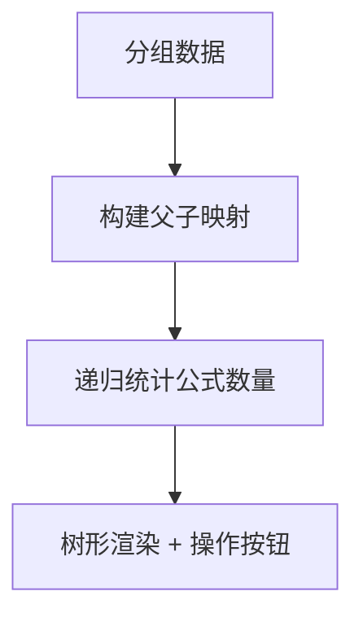

**图表来源**
- [src/components/GroupList.tsx:1-294](file://src/components/GroupList.tsx#L1-L294)

**章节来源**
- [src/components/GroupList.tsx:1-294](file://src/components/GroupList.tsx#L1-L294)

### 变量引用选择器（FormulaReferenceSelector）
- 提取变量：从英文公式中提取唯一变量
- 选项构建：支持子公式（sub_ 前缀）与外部公式分组展示
- 映射更新：onChange 返回新的变量到公式 ID 的映射

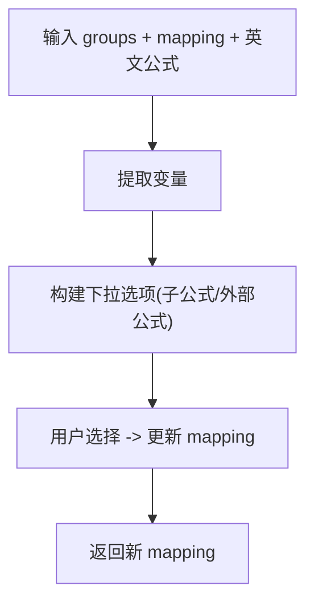

**图表来源**
- [src/components/FormulaReferenceSelector.tsx:1-132](file://src/components/FormulaReferenceSelector.tsx#L1-L132)

**章节来源**
- [src/components/FormulaReferenceSelector.tsx:1-132](file://src/components/FormulaReferenceSelector.tsx#L1-L132)

### 子公式管理（SubFormulaManager）
- CRUD：新增、编辑、删除子公式
- ID 规范：子公式 ID 以 sub_ 前缀标识，避免与外部公式冲突
- 与引用选择器配合：在变量引用选择器中作为子选项展示

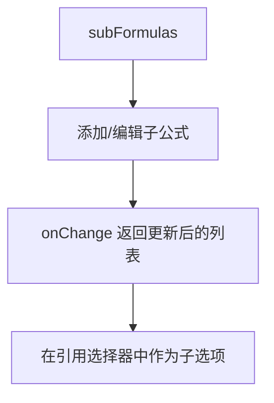

**图表来源**
- [src/components/SubFormulaManager.tsx:1-201](file://src/components/SubFormulaManager.tsx#L1-L201)

**章节来源**
- [src/components/SubFormulaManager.tsx:1-201](file://src/components/SubFormulaManager.tsx#L1-L201)

### 确认对话框组件（ConfirmDialog）
- **新增** 统一的确认对话框组件，提供一致的用户交互体验
- 支持两种变体：默认（default）和危险（danger）操作
- 事件处理：提供确认和取消回调函数
- 样式集成：使用Button组件的变体系统，支持destructive样式

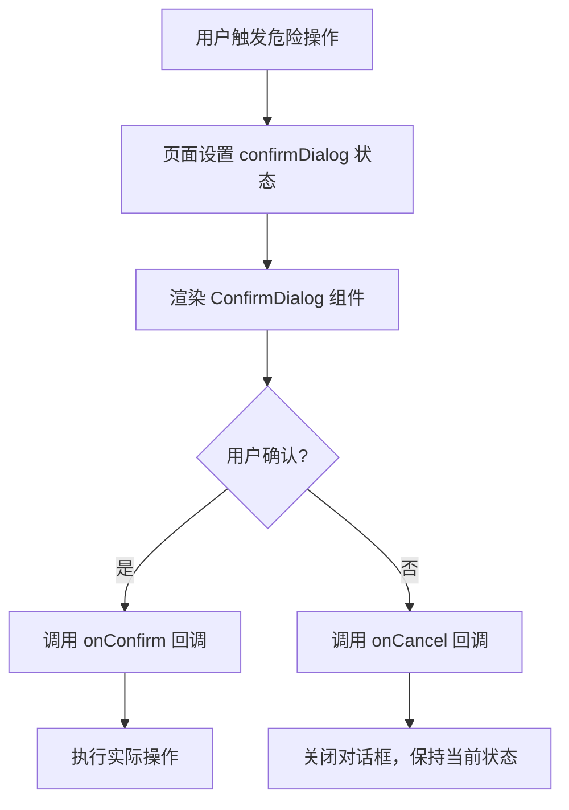

**图表来源**
- [src/components/ConfirmDialog.tsx:1-54](file://src/components/ConfirmDialog.tsx#L1-L54)
- [src/app/page.tsx:415-449](file://src/app/page.tsx#L415-L449)

**章节来源**
- [src/components/ConfirmDialog.tsx:1-54](file://src/components/ConfirmDialog.tsx#L1-L54)

### URL导入功能增强（page.tsx）
- **新增** 从URL导入数据的功能，支持远程JSON文件导入
- 示例数据：提供公共示例数据URL，便于用户快速体验
- 导入流程：URL验证 -> 网络请求 -> 数据解析 -> 确认覆盖 -> 保存数据
- 用户体验：支持键盘快捷键（Enter）和加载状态指示

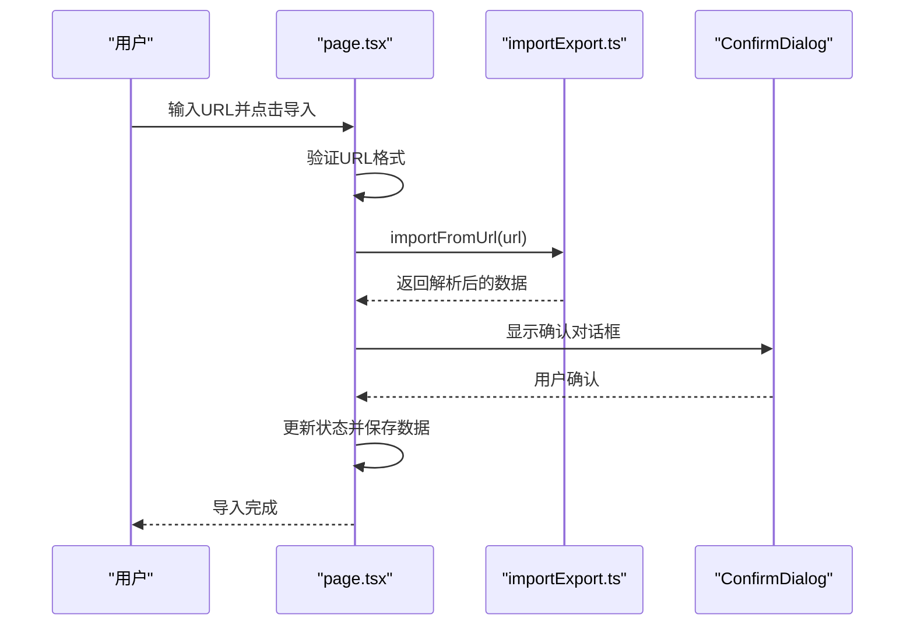

**图表来源**
- [src/app/page.tsx:415-449](file://src/app/page.tsx#L415-L449)
- [src/lib/importExport.ts:105-119](file://src/lib/importExport.ts#L105-L119)

**章节来源**
- [src/app/page.tsx:415-449](file://src/app/page.tsx#L415-L449)
- [src/lib/importExport.ts:105-119](file://src/lib/importExport.ts#L105-L119)

### 页面与状态管理（page.tsx）
- URL 同步：通过 searchParams 与 router 控制当前选中的公式
- 本地缓存：分组选择与侧边栏状态持久化到 localStorage
- 数据导入导出：支持覆盖式导入与一键导出，**新增** URL导入功能
- 对话框与模态：分组/公式 CRUD、数据菜单、**新增** ConfirmDialog确认对话框
- **增强** 危险操作保护：通过ConfirmDialog组件保护重要操作

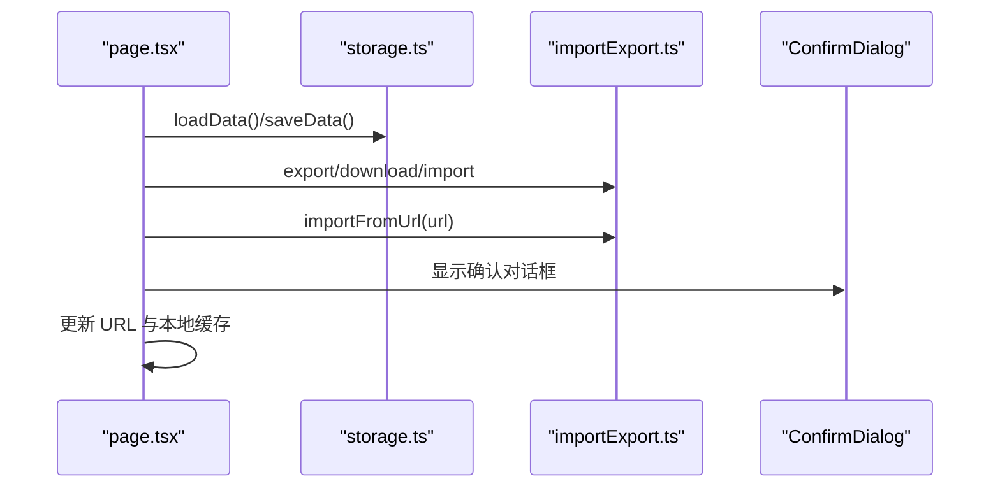

**图表来源**
- [src/app/page.tsx:1-872](file://src/app/page.tsx#L1-L872)
- [src/lib/storage.ts:1-50](file://src/lib/storage.ts#L1-L50)
- [src/lib/importExport.ts:1-120](file://src/lib/importExport.ts#L1-L120)

**章节来源**
- [src/app/page.tsx:1-872](file://src/app/page.tsx#L1-L872)
- [src/lib/storage.ts:1-50](file://src/lib/storage.ts#L1-L50)
- [src/lib/importExport.ts:1-120](file://src/lib/importExport.ts#L1-L120)

## 依赖关系分析
- 运行时依赖：Next.js、React、KaTeX、TailwindCSS 生态与 Radix UI 组件库
- 开发依赖：TypeScript、ESLint、PostCSS、TailwindCSS
- 路由与配置：Next.js App Router、严格模式、路径别名 @/*
- **新增** UI组件：ConfirmDialog依赖Button组件，Modal提供基础对话框封装

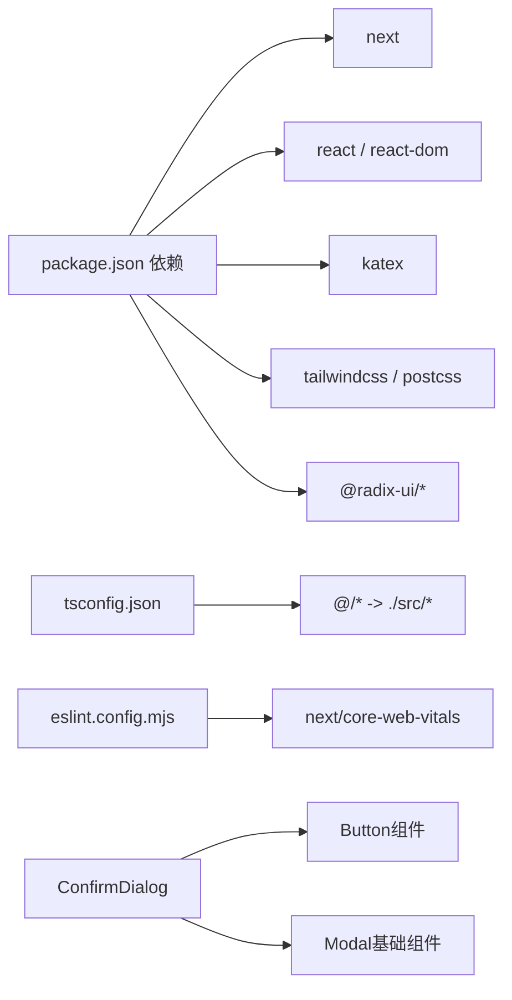

**图表来源**
- [package.json:1-48](file://package.json#L1-L48)
- [tsconfig.json:1-42](file://tsconfig.json#L1-L42)
- [eslint.config.mjs:1-30](file://eslint.config.mjs#L1-L30)
- [src/components/ConfirmDialog.tsx:1-54](file://src/components/ConfirmDialog.tsx#L1-L54)

**章节来源**
- [package.json:1-48](file://package.json#L1-L48)
- [tsconfig.json:1-42](file://tsconfig.json#L1-L42)
- [eslint.config.mjs:1-30](file://eslint.config.mjs#L1-L30)
- [next.config.js:1-7](file://next.config.js#L1-L7)

## 性能考虑
- 惰性解析：FormulaList 仅在展开公式详情时解析与映射，避免全量计算
- 记忆化：FormulaReferenceSelector 使用 useMemo 缓存变量提取与公式列表
- 本地缓存：分组选择与侧边栏状态持久化，减少重复计算与滚动恢复
- UI 优化：FormulaRenderer 按首次出现顺序分配颜色，降低视觉复杂度
- 导入导出：批量序列化/反序列化，避免频繁 DOM 操作
- **新增** 对话框优化：ConfirmDialog使用条件渲染，仅在需要时创建DOM元素

## 故障排查指南
- 解析错误：检查公式是否包含未闭合括号、非法字符或不支持的运算符
- 变量未定义：确认变量映射是否正确建立，中文变量是否足够
- 引用失效：当外部公式被删除或子公式 ID 变更时，引用会变为未定义
- 导入失败：确认 JSON 文件格式正确、包含版本与 groups 数组且每条数据结构完整
- 渲染异常：若 KaTeX 加载失败，组件会降级显示原始文本并提示错误
- **新增** URL导入问题：检查网络连接、URL格式正确性，确认远程服务器允许跨域访问
- **新增** 确认对话框问题：检查confirmDialog状态管理，确保onConfirm/onCancel回调正确绑定

**章节来源**
- [src/components/FormulaList.tsx:160-192](file://src/components/FormulaList.tsx#L160-L192)
- [src/lib/importExport.ts:43-75](file://src/lib/importExport.ts#L43-L75)
- [src/components/ASTTree.tsx:124-142](file://src/components/ASTTree.tsx#L124-L142)
- [src/app/page.tsx:415-449](file://src/app/page.tsx#L415-L449)

## 结论
本项目通过清晰的类型系统、可扩展的解析与映射模块、以及组件化的 UI 设计，实现了从数据到视图的完整闭环。其模块化与惰性策略为后续扩展（如公式验证、批量导入、多语言支持）提供了良好基础。

**更新** 新增的ConfirmDialog组件显著提升了用户体验和操作安全性，URL导入功能增强了数据获取的便利性，这些改进使得项目更加完善和用户友好。

## 附录

### 开发环境搭建
- 安装依赖：使用包管理器安装项目依赖
- 启动开发服务器：运行 dev 脚本
- 构建与启动：build 与 start 脚本用于生产部署
- 代码规范：遵循 ESLint 规则，保持命名与未使用变量的清理

**章节来源**
- [package.json:5-10](file://package.json#L5-L10)
- [eslint.config.mjs:15-29](file://eslint.config.mjs#L15-L29)

### TypeScript 类型系统使用
- 使用严格模式与路径别名，确保类型安全与模块引用简洁
- 在组件间传递数据时，尽量使用明确的接口类型，避免 any

**章节来源**
- [tsconfig.json:19-28](file://tsconfig.json#L19-L28)

### Next.js 路由与页面组织
- App Router：页面位于 src/app，布局在 layout.tsx
- 路由参数：通过 Next.js Navigation API 与 URL SearchParams 同步状态
- 资源与样式：通过 Tailwind 与全局 CSS 组织样式

**章节来源**
- [src/app/layout.tsx:1-20](file://src/app/layout.tsx#L1-L20)
- [src/app/page.tsx:1-872](file://src/app/page.tsx#L1-L872)

### 代码贡献指南
- 提交前请运行 lint 与必要的测试（如存在）
- 修改涉及类型定义时，同步更新相关组件与工具
- 新增功能建议拆分为独立模块，保持单一职责
- **新增** 对话框组件：使用ConfirmDialog组件替代直接的alert/prompt调用

**章节来源**
- [package.json:9](file://package.json#L9)
- [eslint.config.mjs:15-29](file://eslint.config.mjs#L15-L29)

### 核心业务逻辑实现原理
- 公式解析：词法分析 + 递归下降，输出 AST
- 变量映射：英文变量与中文变量一一对应，不足时标注未定义
- 数据持久化：localStorage 存储分组与公式；导入导出包含版本与结构校验
- 可视化：LaTeX 渲染与结构树展示，支持中英文切换与变量说明
- **新增** URL导入：通过fetch API获取远程JSON数据，支持错误处理和状态管理

**章节来源**
- [src/lib/parser.ts:12-22](file://src/lib/parser.ts#L12-L22)
- [src/lib/mapper.ts:52-70](file://src/lib/mapper.ts#L52-L70)
- [src/lib/storage.ts:5-25](file://src/lib/storage.ts#L5-L25)
- [src/lib/importExport.ts:12-20](file://src/lib/importExport.ts#L12-L20)
- [src/components/ASTTree.tsx:27-61](file://src/components/ASTTree.tsx#L27-L61)
- [src/lib/importExport.ts:105-119](file://src/lib/importExport.ts#L105-L119)

### 扩展与二次开发建议
- 公式验证：在解析前增加语义检查（如变量定义域、函数支持）
- 多语言：引入 i18n，支持多语言 UI 与公式描述
- 批量导入：支持增量导入与冲突解决策略
- 图表增强：在 ASTTree 基础上增加交互式拖拽与编辑
- **新增** 对话框组件：为所有危险操作提供ConfirmDialog组件，提升用户体验
- **新增** 导入功能：扩展URL导入支持OAuth认证、批量导入等功能
- **新增** 数据备份：实现自动备份和版本控制功能