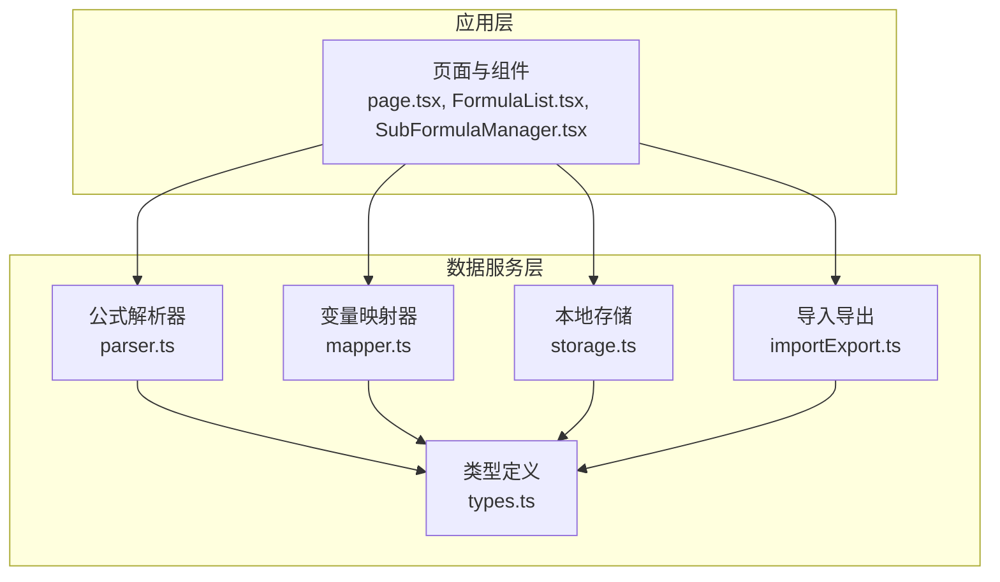
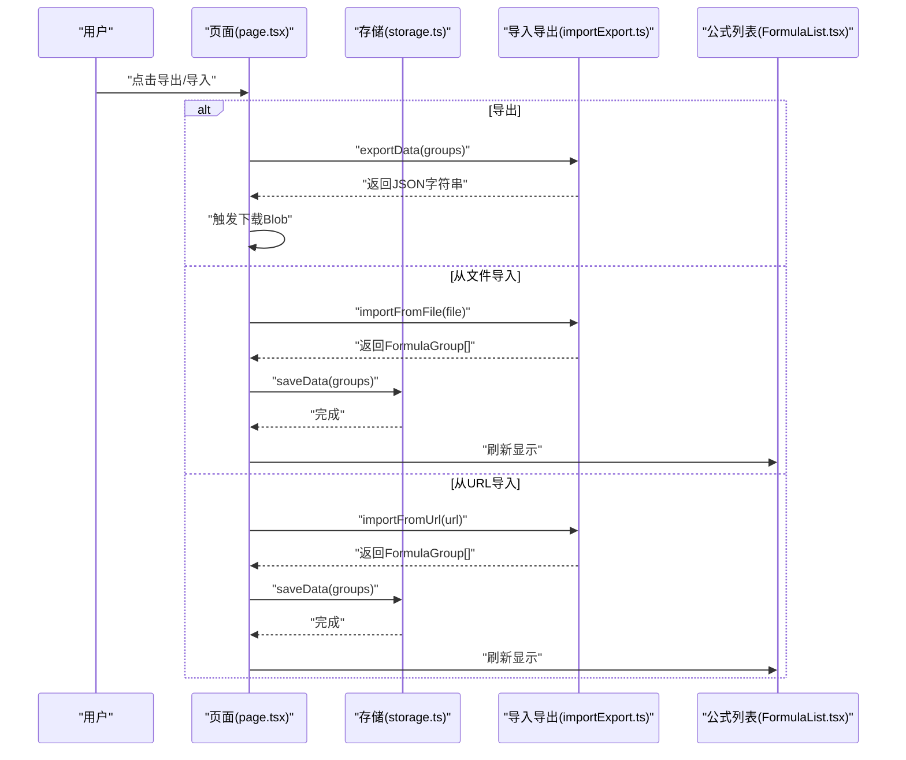
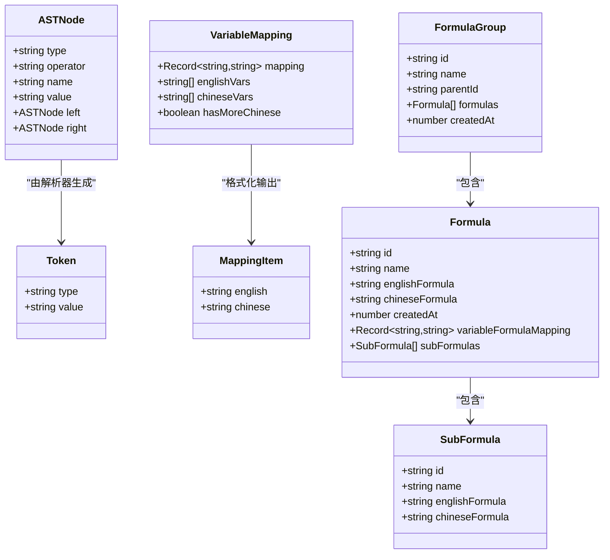
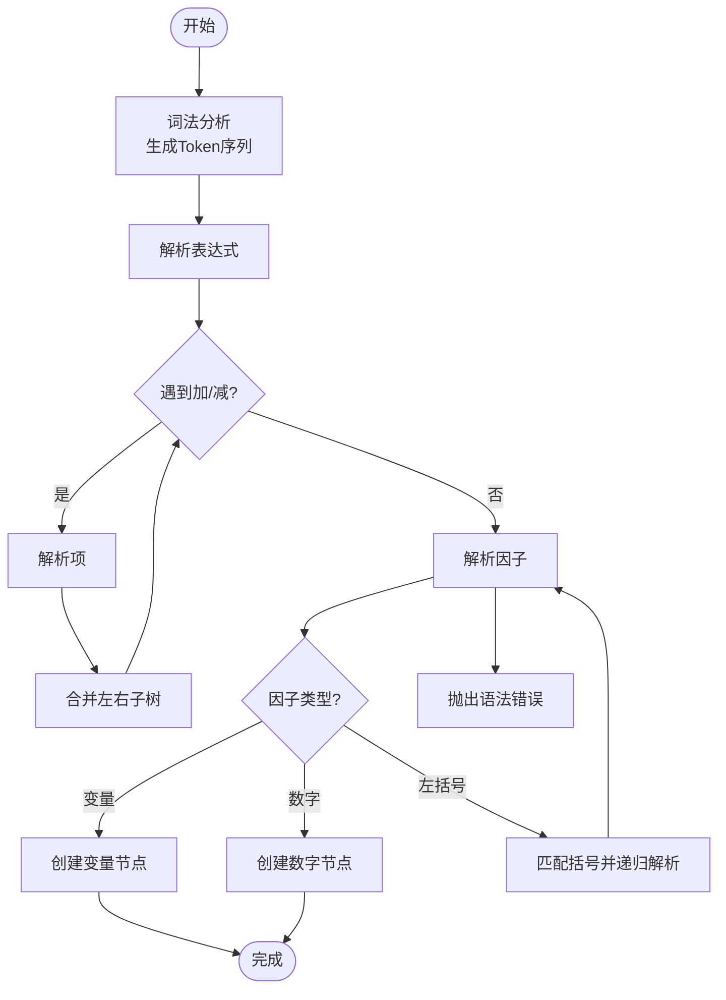
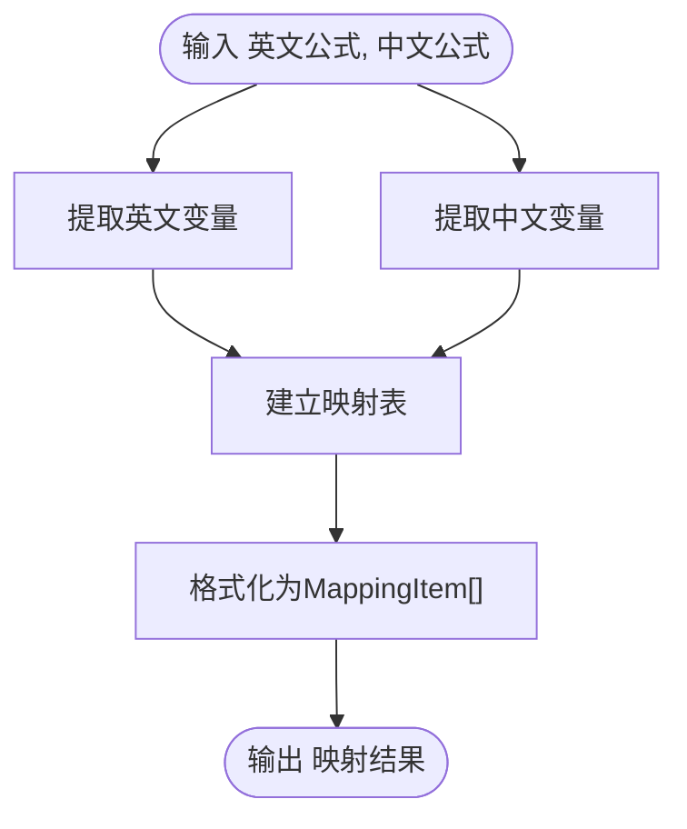
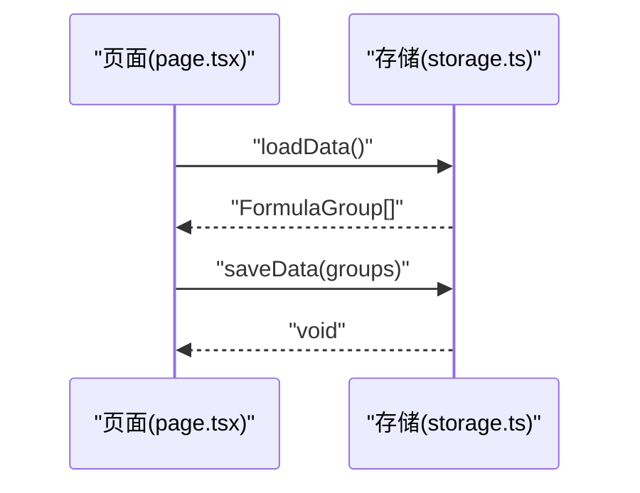
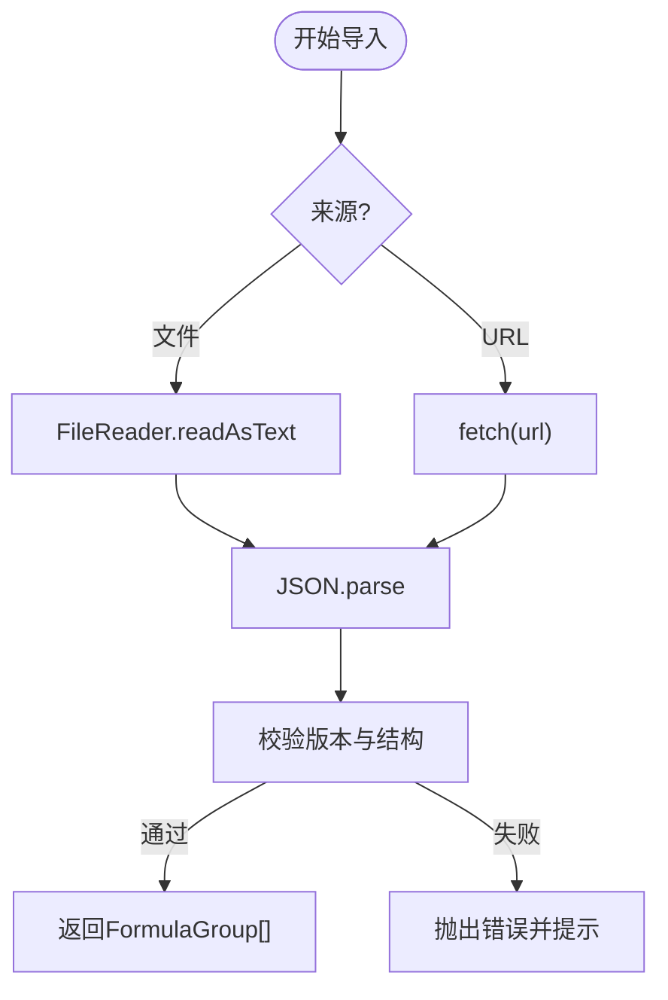
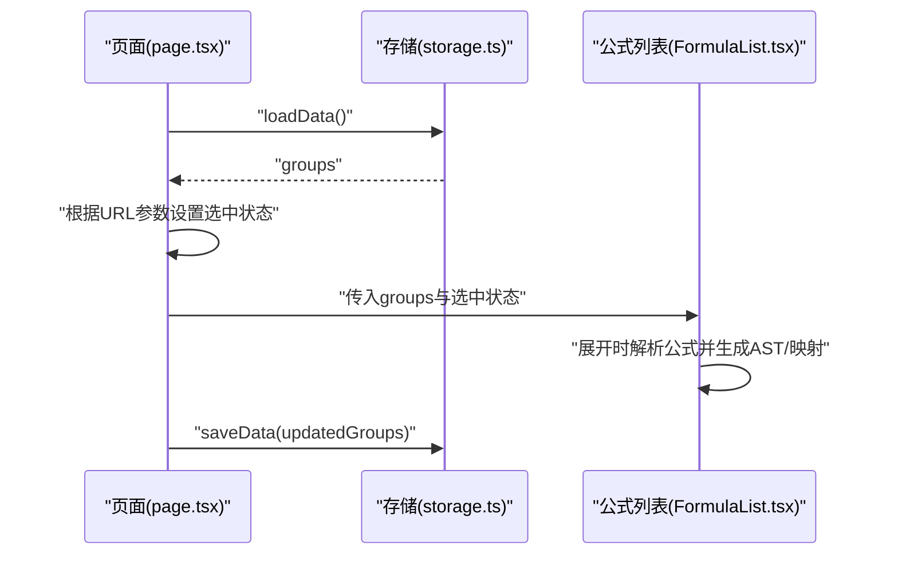
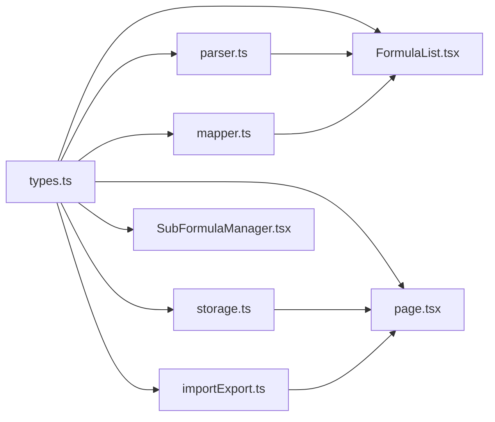

# 数据管理策略

<cite>
**本文引用的文件**
- [src/lib/types.ts](file://src/lib/types.ts)
- [src/lib/storage.ts](file://src/lib/storage.ts)
- [src/lib/mapper.ts](file://src/lib/mapper.ts)
- [src/lib/importExport.ts](file://src/lib/importExport.ts)
- [src/lib/parser.ts](file://src/lib/parser.ts)
- [src/app/page.tsx](file://src/app/page.tsx)
- [src/components/FormulaList.tsx](file://src/components/FormulaList.tsx)
- [src/components/SubFormulaManager.tsx](file://src/components/SubFormulaManager.tsx)
- [package.json](file://package.json)
</cite>

## 目录
1. [简介](#简介)
2. [项目结构](#项目结构)
3. [核心组件](#核心组件)
4. [架构总览](#架构总览)
5. [详细组件分析](#详细组件分析)
6. [依赖关系分析](#依赖关系分析)
7. [性能考虑](#性能考虑)
8. [故障排除指南](#故障排除指南)
9. [结论](#结论)
10. [附录](#附录)

## 简介
本文件面向“公式变量映射与可视化工具”的数据管理策略，围绕以下目标展开：
- 数据模型设计与类型系统
- 本地存储与持久化
- 数据导入/导出格式与流程
- 数据验证与完整性保障
- 版本管理与迁移策略
- 缓存与性能优化
- 安全与隐私保护
- 同步与冲突解决
- 备份与恢复
- 最佳实践与故障排除

## 项目结构
该项目采用前端单页应用架构，数据层由一组纯 TypeScript 模块组成，UI 层通过 Next.js 组件消费这些模块。数据模型、解析器、映射器、导入导出与本地存储均集中在 src/lib 下，UI 组件负责交互与状态管理。

图表来源
- [src/app/page.tsx:1-798](file://src/app/page.tsx#L1-L798)
- [src/components/FormulaList.tsx:1-387](file://src/components/FormulaList.tsx#L1-L387)
- [src/components/SubFormulaManager.tsx:1-201](file://src/components/SubFormulaManager.tsx#L1-L201)
- [src/lib/types.ts:1-51](file://src/lib/types.ts#L1-L51)
- [src/lib/parser.ts:1-159](file://src/lib/parser.ts#L1-L159)
- [src/lib/mapper.ts:1-89](file://src/lib/mapper.ts#L1-L89)
- [src/lib/storage.ts:1-50](file://src/lib/storage.ts#L1-L50)
- [src/lib/importExport.ts:1-120](file://src/lib/importExport.ts#L1-L120)

章节来源
- [src/app/page.tsx:1-798](file://src/app/page.tsx#L1-L798)
- [src/lib/types.ts:1-51](file://src/lib/types.ts#L1-L51)

## 核心组件
- 类型系统：定义 Token、ASTNode、VariableMapping、MappingItem、Formula、SubFormula、FormulaGroup 等核心数据结构，确保数据一致性与可扩展性。
- 解析器：将公式字符串转换为 Token 流，并构建抽象语法树（AST），支持多种括号与运算符。
- 映射器：提取英文/中文变量，建立变量映射表，并格式化输出。
- 存储：基于 localStorage 的轻量级持久化，提供加载/保存/创建实体等能力。
- 导入导出：统一的 JSON 导出格式，支持文件与 URL 两种导入方式，内置基础校验。

章节来源
- [src/lib/types.ts:1-51](file://src/lib/types.ts#L1-L51)
- [src/lib/parser.ts:1-159](file://src/lib/parser.ts#L1-L159)
- [src/lib/mapper.ts:1-89](file://src/lib/mapper.ts#L1-L89)
- [src/lib/storage.ts:1-50](file://src/lib/storage.ts#L1-L50)
- [src/lib/importExport.ts:1-120](file://src/lib/importExport.ts#L1-L120)

## 架构总览
应用的数据流自上而下：UI 触发操作 -> 调用存储/导入导出 -> 更新内存状态 -> 写回本地存储；同时解析器与映射器在渲染阶段被调用，生成变量映射与 AST 结果。

图表来源
- [src/app/page.tsx:365-420](file://src/app/page.tsx#L365-L420)
- [src/lib/importExport.ts:12-120](file://src/lib/importExport.ts#L12-L120)
- [src/lib/storage.ts:17-25](file://src/lib/storage.ts#L17-L25)

## 详细组件分析

### 数据模型与类型系统
- Token：描述词法单元（运算符、变量、数字、括号）。
- ASTNode：描述语法树节点（运算符、变量、数字），支持二叉表达式树。
- VariableMapping：变量映射结果，包含映射表、英文变量列表、中文变量列表以及“中文变量更多”的标记。
- MappingItem：映射项的键值对包装。
- Formula：公式实体，包含标识、名称、中英文公式、创建时间、变量到公式映射、子公式列表。
- SubFormula：子公式实体，用于在公式内部进行局部拆分与复用。
- FormulaGroup：分组实体，支持父子层级，包含公式集合与创建时间。

图表来源
- [src/lib/types.ts:1-51](file://src/lib/types.ts#L1-L51)

章节来源
- [src/lib/types.ts:1-51](file://src/lib/types.ts#L1-L51)

### 解析器（FormulaParser）
- 词法分析：识别空白、运算符、变量、数字与括号，抛出不可识别字符异常。
- 语法分析：递归下降解析，支持加减、乘除优先级，括号匹配校验，报错信息明确。
- 输出：ASTNode 树，供后续渲染与可视化使用。

图表来源
- [src/lib/parser.ts:24-157](file://src/lib/parser.ts#L24-L157)

章节来源
- [src/lib/parser.ts:1-159](file://src/lib/parser.ts#L1-L159)

### 变量映射器（VariableMapper）
- 提取英文变量：正则匹配单词边界，去重。
- 提取中文变量：按常见运算符与括号分割，过滤纯数字与空串，去重。
- 创建映射：按顺序配对英文与中文变量，中文不足时填充占位符。
- 格式化输出：将映射结果转为 MappingItem 列表与“中文更多”标记。

图表来源
- [src/lib/mapper.ts:4-87](file://src/lib/mapper.ts#L4-L87)

章节来源
- [src/lib/mapper.ts:1-89](file://src/lib/mapper.ts#L1-L89)

### 本地存储与持久化
- 存储键：固定键名，避免跨页面污染。
- 加载：从 localStorage 读取 JSON 字符串并反序列化，异常时返回空数组。
- 保存：将内存中的 FormulaGroup[] 序列化后写入 localStorage，异常时记录日志。
- 实体工厂：提供创建分组与公式的辅助方法，统一生成唯一 ID 与创建时间。

图表来源
- [src/lib/storage.ts:5-25](file://src/lib/storage.ts#L5-L25)
- [src/app/page.tsx:85-112](file://src/app/page.tsx#L85-L112)

章节来源
- [src/lib/storage.ts:1-50](file://src/lib/storage.ts#L1-L50)
- [src/app/page.tsx:85-112](file://src/app/page.tsx#L85-L112)

### 导入/导出与数据完整性
- 导出格式：包含版本号、导出时间与分组数组，便于未来版本演进。
- 文件导入：FileReader 读取文本，JSON 解析，逐条校验分组与公式结构。
- URL 导入：fetch 请求，响应校验与错误分类，失败时给出明确提示。
- 完整性保障：对必填字段、数组结构、嵌套对象进行严格校验，异常即中断并反馈。

图表来源
- [src/lib/importExport.ts:43-119](file://src/lib/importExport.ts#L43-L119)

章节来源
- [src/lib/importExport.ts:1-120](file://src/lib/importExport.ts#L1-L120)

### UI 中的数据使用与缓存
- 页面级状态：groups、selectedGroupId、selectedFormulaId、sidebarCollapsed 等。
- URL 同步：通过路由参数保持选中状态，支持浏览器前进/后退。
- 本地缓存：localStorage 缓存选中分组与侧边栏折叠状态，提升用户体验。
- 渲染期计算：FormulaList 在展开公式时调用解析器与映射器，生成 AST 与映射，渲染变量映射与公式树。

图表来源
- [src/app/page.tsx:85-133](file://src/app/page.tsx#L85-L133)
- [src/components/FormulaList.tsx:169-192](file://src/components/FormulaList.tsx#L169-L192)
- [src/lib/storage.ts:17-25](file://src/lib/storage.ts#L17-L25)

章节来源
- [src/app/page.tsx:1-798](file://src/app/page.tsx#L1-L798)
- [src/components/FormulaList.tsx:1-387](file://src/components/FormulaList.tsx#L1-L387)

## 依赖关系分析
- types.ts 被 parser.ts、mapper.ts、storage.ts、importExport.ts、page.tsx、FormulaList.tsx、SubFormulaManager.tsx 广泛依赖，是数据契约的核心。
- parser.ts 与 mapper.ts 作为纯函数，依赖 types.ts 的接口定义。
- storage.ts 与 importExport.ts 依赖 types.ts 的实体定义，同时 page.tsx 作为协调者调用它们。
- UI 组件（FormulaList.tsx、SubFormulaManager.tsx）在渲染期调用解析器与映射器，形成“渲染期计算”的轻量缓存。

图表来源
- [src/lib/types.ts:1-51](file://src/lib/types.ts#L1-L51)
- [src/lib/parser.ts:1-159](file://src/lib/parser.ts#L1-L159)
- [src/lib/mapper.ts:1-89](file://src/lib/mapper.ts#L1-L89)
- [src/lib/storage.ts:1-50](file://src/lib/storage.ts#L1-L50)
- [src/lib/importExport.ts:1-120](file://src/lib/importExport.ts#L1-L120)
- [src/app/page.tsx:1-798](file://src/app/page.tsx#L1-L798)
- [src/components/FormulaList.tsx:1-387](file://src/components/FormulaList.tsx#L1-L387)
- [src/components/SubFormulaManager.tsx:1-201](file://src/components/SubFormulaManager.tsx#L1-L201)

章节来源
- [src/lib/types.ts:1-51](file://src/lib/types.ts#L1-L51)
- [src/lib/parser.ts:1-159](file://src/lib/parser.ts#L1-L159)
- [src/lib/mapper.ts:1-89](file://src/lib/mapper.ts#L1-L89)
- [src/lib/storage.ts:1-50](file://src/lib/storage.ts#L1-L50)
- [src/lib/importExport.ts:1-120](file://src/lib/importExport.ts#L1-L120)
- [src/app/page.tsx:1-798](file://src/app/page.tsx#L1-L798)
- [src/components/FormulaList.tsx:1-387](file://src/components/FormulaList.tsx#L1-L387)
- [src/components/SubFormulaManager.tsx:1-201](file://src/components/SubFormulaManager.tsx#L1-L201)

## 性能考虑
- 渲染期计算：FormulaList 在展开时才解析公式与生成映射，避免不必要的开销。
- 本地缓存：localStorage 缓存选中分组与侧边栏状态，减少初始化成本。
- 事件节流：URL 参数变化监听在必要时机触发，避免频繁重渲染。
- 数据规模：当前实现适合中小规模数据；若公式数量增长，建议引入虚拟滚动、懒加载与增量保存。

章节来源
- [src/app/page.tsx:122-133](file://src/app/page.tsx#L122-L133)
- [src/components/FormulaList.tsx:169-192](file://src/components/FormulaList.tsx#L169-L192)

## 故障排除指南
- 导入失败
  - 文件导入：检查文件是否为合法 JSON，字段是否齐全。
  - URL 导入：确认网络可达、响应状态码正常、内容为 JSON。
- 解析错误
  - 公式语法不合法：检查括号是否匹配、运算符是否正确、变量命名是否符合规则。
- 保存失败
  - localStorage 不可用或空间不足：清理浏览器缓存或禁用无痕模式。
- URL 同步问题
  - 浏览器前进/后退导致状态不同步：确认路由参数更新逻辑生效。

章节来源
- [src/lib/importExport.ts:43-119](file://src/lib/importExport.ts#L43-L119)
- [src/lib/parser.ts:12-22](file://src/lib/parser.ts#L12-L22)
- [src/lib/storage.ts:8-24](file://src/lib/storage.ts#L8-L24)
- [src/app/page.tsx:114-120](file://src/app/page.tsx#L114-L120)

## 结论
本项目通过清晰的类型系统、解析器与映射器、轻量级本地存储与严格的导入导出校验，实现了公式变量映射与可视化的数据管理闭环。当前实现简洁可靠，适合个人与小团队使用。随着业务发展，可在现有基础上扩展版本管理、增量同步、离线优先与更完善的错误恢复机制。

## 附录

### 数据模型与类型系统
- Token：词法单元
- ASTNode：语法树节点
- VariableMapping：变量映射结果
- MappingItem：映射项
- Formula：公式实体
- SubFormula：子公式实体
- FormulaGroup：分组实体

章节来源
- [src/lib/types.ts:1-51](file://src/lib/types.ts#L1-L51)

### 本地存储策略
- 存储键：固定键名，避免冲突
- 加载：JSON 反序列化，异常返回空数组
- 保存：JSON 序列化，异常记录日志
- 实体工厂：统一生成唯一 ID 与创建时间

章节来源
- [src/lib/storage.ts:1-50](file://src/lib/storage.ts#L1-L50)

### 导入导出格式规范
- 导出：包含版本号、导出时间与分组数组
- 文件导入：校验版本与结构，逐条验证字段
- URL 导入：校验响应与 JSON 格式，错误分类提示

章节来源
- [src/lib/importExport.ts:1-120](file://src/lib/importExport.ts#L1-L120)

### 数据验证与完整性
- 必填字段：id、name、formulas 数组、英文/中文公式等
- 结构校验：分组与公式对象字段完整性
- 语法校验：解析器对公式语法进行严格检查

章节来源
- [src/lib/importExport.ts:43-75](file://src/lib/importExport.ts#L43-L75)
- [src/lib/parser.ts:12-22](file://src/lib/parser.ts#L12-L22)

### 版本管理与迁移策略
- 当前版本：1.0（导出数据包含 version 字段）
- 建议：未来版本演进时，新增版本号判断与迁移脚本，兼容旧格式并逐步升级

章节来源
- [src/lib/importExport.ts:13-19](file://src/lib/importExport.ts#L13-L19)

### 缓存策略与性能优化
- 渲染期缓存：展开时计算 AST 与映射，收起时清理
- 本地缓存：选中分组与侧边栏状态
- 建议：大体量数据时引入虚拟列表、懒加载与增量保存

章节来源
- [src/components/FormulaList.tsx:169-192](file://src/components/FormulaList.tsx#L169-L192)
- [src/app/page.tsx:122-133](file://src/app/page.tsx#L122-L133)

### 数据安全与隐私保护
- 本地存储：仅存储用户可见数据，不涉及敏感信息
- 导入导出：用户主动操作，建议在受信环境使用
- 建议：如需云端同步，增加加密与访问控制

章节来源
- [src/lib/storage.ts:1-50](file://src/lib/storage.ts#L1-L50)
- [src/lib/importExport.ts:1-120](file://src/lib/importExport.ts#L1-L120)

### 同步与冲突解决
- 当前实现：单机 localStorage，无并发冲突
- 建议：多端场景引入版本号、时间戳与合并策略

章节来源
- [src/lib/storage.ts:1-50](file://src/lib/storage.ts#L1-L50)

### 备份与恢复策略
- 备份：导出 JSON 文件，保存至安全位置
- 恢复：从文件或 URL 导入，覆盖当前数据（导入前确认）

章节来源
- [src/lib/importExport.ts:12-38](file://src/lib/importExport.ts#L12-L38)
- [src/app/page.tsx:374-420](file://src/app/page.tsx#L374-L420)

### 最佳实践
- 保持公式命名唯一，避免引用冲突
- 导入前做好备份，导入后核对数据完整性
- 使用子公式进行模块化组织复杂公式
- 定期导出备份，防止意外丢失

章节来源
- [src/app/page.tsx:207-242](file://src/app/page.tsx#L207-L242)
- [src/components/SubFormulaManager.tsx:1-201](file://src/components/SubFormulaManager.tsx#L1-L201)