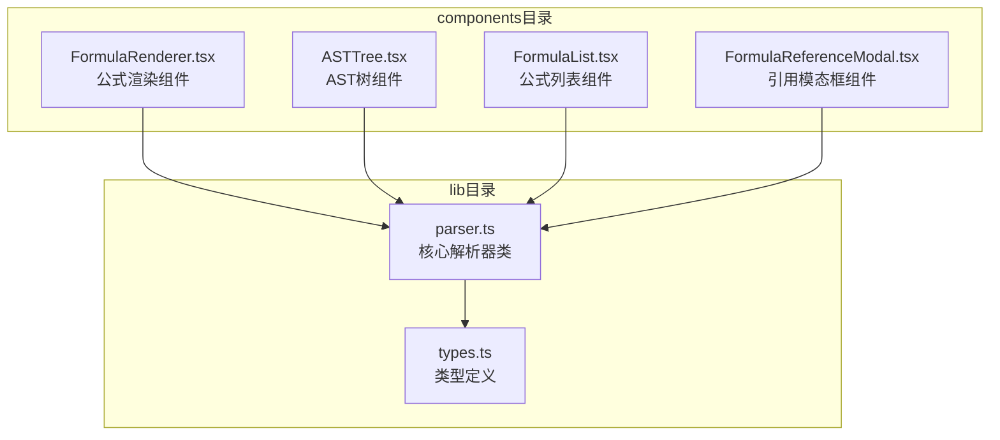
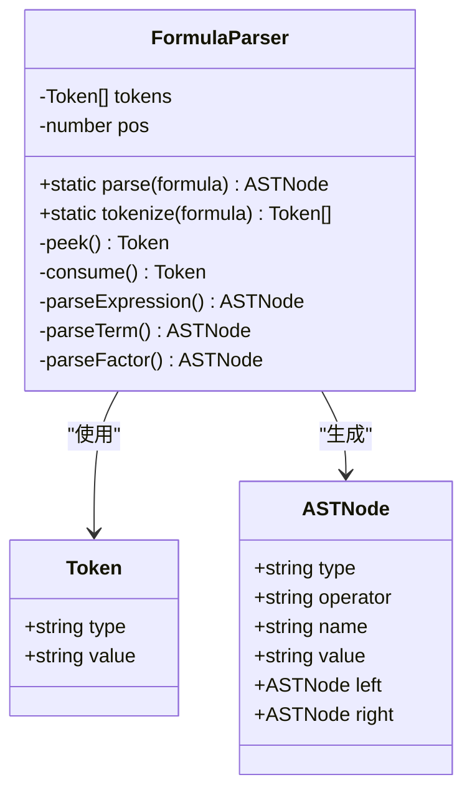
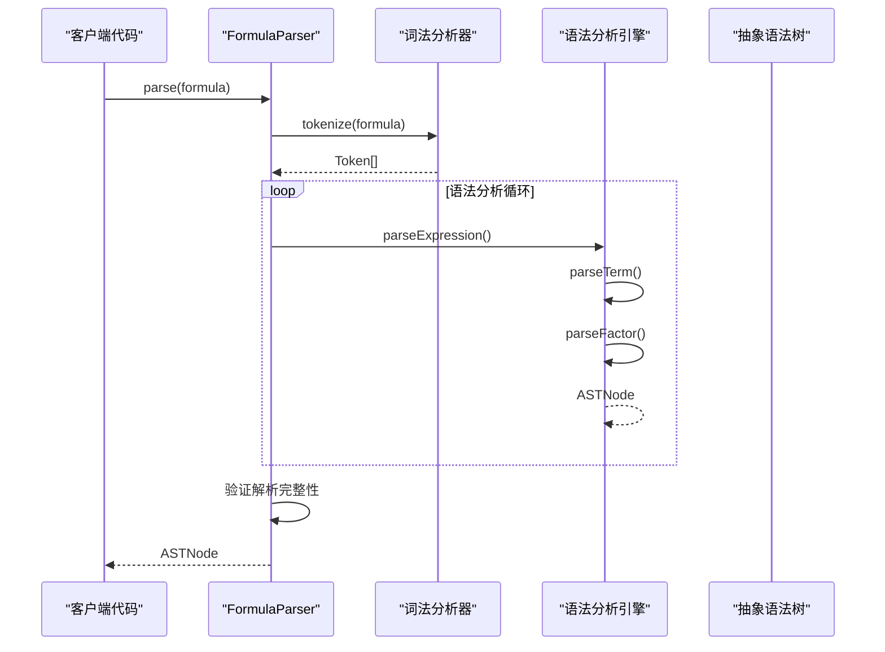
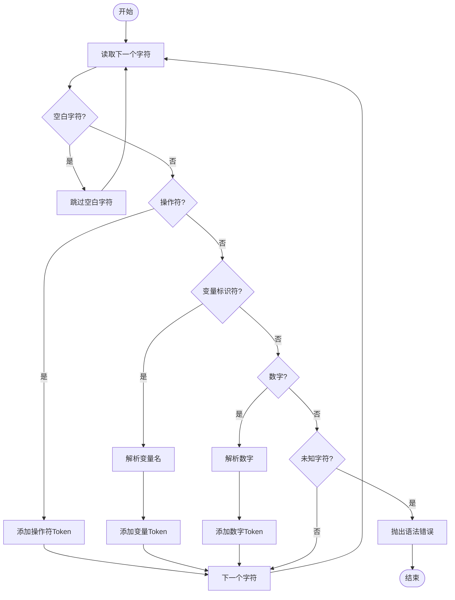
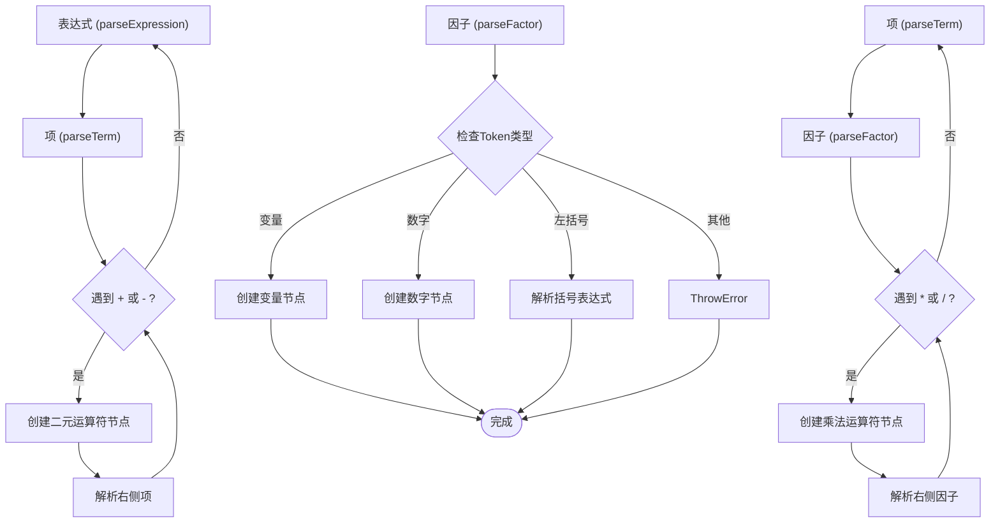
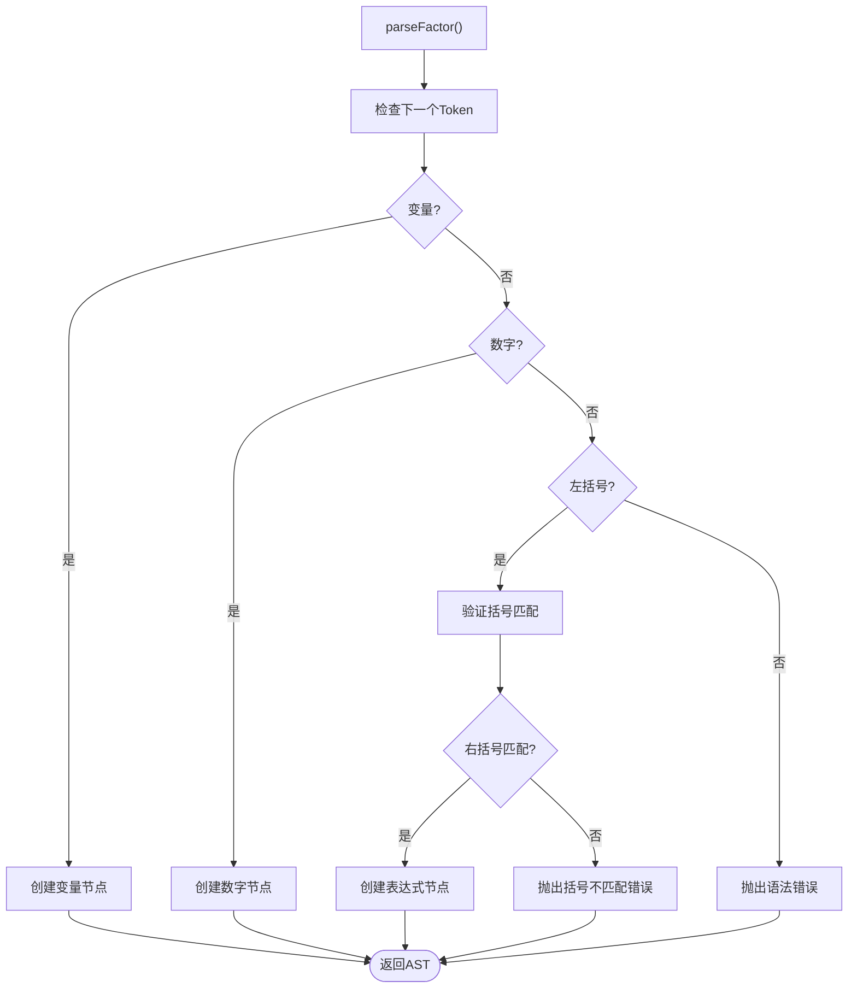
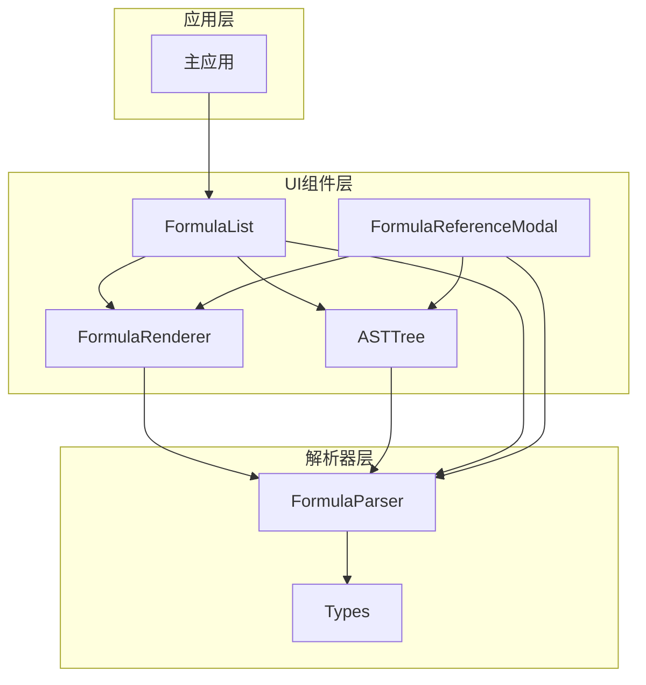

# 公式解析器

<cite>
**本文档引用的文件**
- [parser.ts](file://src/lib/parser.ts)
- [types.ts](file://src/lib/types.ts)
- [FormulaRenderer.tsx](file://src/components/FormulaRenderer.tsx)
- [ASTTree.tsx](file://src/components/ASTTree.tsx)
- [FormulaList.tsx](file://src/components/FormulaList.tsx)
- [FormulaReferenceModal.tsx](file://src/components/FormulaReferenceModal.tsx)
</cite>

## 目录
1. [简介](#简介)
2. [项目结构](#项目结构)
3. [核心组件](#核心组件)
4. [架构概览](#架构概览)
5. [详细组件分析](#详细组件分析)
6. [依赖关系分析](#依赖关系分析)
7. [性能考虑](#性能考虑)
8. [故障排除指南](#故障排除指南)
9. [结论](#结论)

## 简介

公式解析器是一个基于递归下降算法的轻量级数学表达式解析系统。它能够将字符串形式的数学公式转换为抽象语法树（AST），支持基本的四则运算、括号嵌套、变量标识符和数字常量。该解析器采用面向对象设计，提供了清晰的API接口和完善的错误处理机制。

## 项目结构

公式解析器位于项目的 `src/lib` 目录下，主要包含以下关键文件：

**图表来源**
- [parser.ts:1-159](file://src/lib/parser.ts#L1-L159)
- [types.ts:1-51](file://src/lib/types.ts#L1-L51)

**章节来源**
- [parser.ts:1-159](file://src/lib/parser.ts#L1-L159)
- [types.ts:1-51](file://src/lib/types.ts#L1-L51)

## 核心组件

### FormulaParser 类

FormulaParser 是整个解析系统的核心类，实现了完整的词法分析和语法分析功能。该类采用静态工厂模式，提供了简洁易用的API接口。

**主要特性：**
- 静态 `parse` 方法：一次性完成词法分析和语法分析
- 静态 `tokenize` 方法：独立的词法分析功能
- 递归下降语法分析器：支持运算符优先级和括号嵌套
- 完善的错误处理机制：提供详细的错误信息

**章节来源**
- [parser.ts:3-22](file://src/lib/parser.ts#L3-L22)

### Token 和 ASTNode 接口

解析器使用标准化的数据结构来表示词法单元和语法树节点：

**图表来源**
- [types.ts:1-13](file://src/lib/types.ts#L1-L13)
- [parser.ts:3-158](file://src/lib/parser.ts#L3-L158)

**章节来源**
- [types.ts:1-13](file://src/lib/types.ts#L1-L13)

## 架构概览

公式解析器采用分层架构设计，将词法分析、语法分析和错误处理功能分离：

**图表来源**
- [parser.ts:12-22](file://src/lib/parser.ts#L12-L22)
- [parser.ts:78-157](file://src/lib/parser.ts#L78-L157)

## 详细组件分析

### 词法分析器（Tokenize）

词法分析器负责将输入字符串转换为Token序列，支持以下类型的Token：

#### 字符识别规则

**图表来源**
- [parser.ts:24-68](file://src/lib/parser.ts#L24-L68)

#### 支持的操作符

解析器支持以下操作符：
- 基本运算符：`+`（加）、`-`（减）、`*`（乘）、`/`（除）
- 括号：`()`, `[]`, `{}`, `（）`（全角括号）
- 空白字符：自动忽略

**章节来源**
- [parser.ts:24-68](file://src/lib/parser.ts#L24-L68)

### 语法分析器（递归下降）

语法分析器实现了经典的递归下降算法，遵循运算符优先级规则：

#### 运算符优先级

**图表来源**
- [parser.ts:78-157](file://src/lib/parser.ts#L78-L157)

#### 语法分析流程

**章节来源**
- [parser.ts:78-157](file://src/lib/parser.ts#L78-L157)

### AST节点构建

AST节点采用统一的数据结构，支持三种基本类型：

#### AST节点类型

| 节点类型 | 属性 | 描述 |
|---------|------|------|
| `operator` | `operator` | 二元运算符节点，包含左右子节点 |
| `variable` | `name` | 变量标识符节点 |
| `number` | `value` | 数字常量节点 |

#### 括号处理机制

解析器支持多种括号类型，并自动验证括号匹配：

**图表来源**
- [parser.ts:116-157](file://src/lib/parser.ts#L116-L157)

**章节来源**
- [parser.ts:116-157](file://src/lib/parser.ts#L116-L157)

### API接口说明

#### 静态方法

**parse静态方法**
- **签名**: `static parse(formula: string): ASTNode`
- **功能**: 解析数学公式字符串，返回AST树根节点
- **参数**: 
  - `formula`: 数学公式字符串
- **返回值**: ASTNode对象
- **异常**: 解析失败时抛出Error异常

**tokenize静态方法**
- **签名**: `static tokenize(formula: string): Token[]`
- **功能**: 将公式字符串转换为Token序列
- **参数**: `formula` - 数学公式字符串
- **返回值**: Token数组
- **异常**: 遇到未知字符时抛出Error异常

**章节来源**
- [parser.ts:12-22](file://src/lib/parser.ts#L12-L22)
- [parser.ts:24-68](file://src/lib/parser.ts#L24-L68)

### 错误处理机制

解析器提供了多层次的错误处理机制：

#### 错误类型及处理策略

| 错误类型 | 触发条件 | 错误信息 | 处理策略 |
|---------|---------|---------|---------|
| 语法错误 | 遇到意外的Token | "语法错误：意外的token" | 抛出Error异常 |
| 括号不匹配 | 缺少右括号或括号类型不匹配 | "括号不匹配" | 抛出Error异常 |
| 表达式不完整 | 缺少操作数 | "表达式不完整：缺少操作数" | 抛出Error异常 |
| 未识别字符 | 字符不在支持范围内 | "无法识别的字符" | 抛出Error异常 |
| 解析不完整 | 存在未处理的字符 | "表达式解析不完整" | 抛出Error异常 |

**章节来源**
- [parser.ts:17-18](file://src/lib/parser.ts#L17-L18)
- [parser.ts:120](file://src/lib/parser.ts#L120)
- [parser.ts:149](file://src/lib/parser.ts#L149)
- [parser.ts:64](file://src/lib/parser.ts#L64)

## 依赖关系分析

公式解析器与其他组件的集成关系如下：

**图表来源**
- [FormulaList.tsx:177](file://src/components/FormulaList.tsx#L177)
- [FormulaReferenceModal.tsx:37](file://src/components/FormulaReferenceModal.tsx#L37)

**章节来源**
- [FormulaList.tsx:177](file://src/components/FormulaList.tsx#L177)
- [FormulaReferenceModal.tsx:37](file://src/components/FormulaReferenceModal.tsx#L37)

## 性能考虑

### 时间复杂度分析

- **词法分析**: O(n)，其中n为输入字符串长度
- **语法分析**: O(n)，递归深度最多为表达式长度
- **整体复杂度**: O(n)

### 空间复杂度分析

- **Token存储**: O(k)，k为Token数量
- **AST存储**: O(m)，m为表达式复杂度
- **递归栈**: O(d)，d为括号嵌套深度

### 优化建议

1. **预编译优化**: 对频繁使用的公式可以缓存解析结果
2. **流式解析**: 对超长表达式可考虑流式处理
3. **内存池**: 复用Token和AST节点对象减少GC压力
4. **并行处理**: 对多表达式解析可考虑并行化

## 故障排除指南

### 常见问题及解决方案

#### 语法错误
**症状**: 解析时抛出"语法错误"异常
**原因**: 表达式包含不支持的操作符或格式错误
**解决**: 检查表达式格式，确保只使用支持的操作符

#### 括号不匹配
**症状**: 抛出"括号不匹配"异常
**原因**: 左右括号数量不一致或类型不匹配
**解决**: 检查括号配对，确保每种括号都有对应的闭合括号

#### 未识别字符
**症状**: 抛出"无法识别的字符"异常
**原因**: 表达式包含特殊字符或Unicode字符
**解决**: 移除或替换不支持的字符

#### 表达式不完整
**症状**: 抛出"表达式不完整"异常
**原因**: 表达式缺少必要的操作数
**解决**: 检查表达式完整性，确保每个操作符都有对应的操作数

**章节来源**
- [parser.ts:120](file://src/lib/parser.ts#L120)
- [parser.ts:149](file://src/lib/parser.ts#L149)
- [parser.ts:64](file://src/lib/parser.ts#L64)

## 结论

公式解析器是一个设计精良的轻量级解析系统，具有以下特点：

1. **清晰的架构**: 采用分层设计，职责分离明确
2. **完善的错误处理**: 提供详细的错误信息和处理策略
3. **易于扩展**: 支持添加新的操作符和功能
4. **良好的性能**: 线性时间复杂度，适合大规模应用

该解析器为公式管理系统提供了坚实的基础，支持复杂的数学表达式解析和可视化展示。通过合理的扩展机制，可以轻松添加新的功能特性，满足不同应用场景的需求。