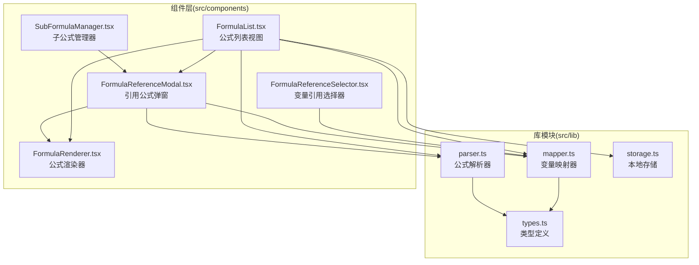
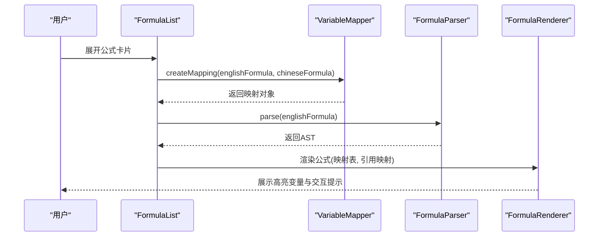
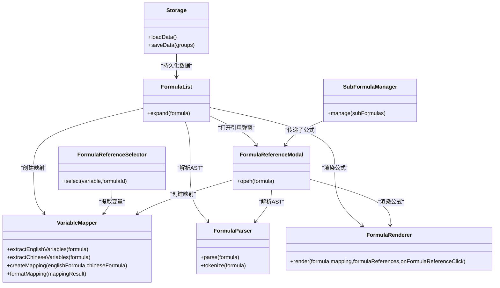

# 变量映射器

<cite>
**本文档引用的文件**
- [mapper.ts](file://src/lib/mapper.ts)
- [types.ts](file://src/lib/types.ts)
- [parser.ts](file://src/lib/parser.ts)
- [FormulaList.tsx](file://src/components/FormulaList.tsx)
- [FormulaReferenceSelector.tsx](file://src/components/FormulaReferenceSelector.tsx)
- [FormulaReferenceModal.tsx](file://src/components/FormulaReferenceModal.tsx)
- [FormulaRenderer.tsx](file://src/components/FormulaRenderer.tsx)
- [SubFormulaManager.tsx](file://src/components/SubFormulaManager.tsx)
- [storage.ts](file://src/lib/storage.ts)
</cite>

## 目录
1. [简介](#简介)
2. [项目结构](#项目结构)
3. [核心组件](#核心组件)
4. [架构总览](#架构总览)
5. [详细组件分析](#详细组件分析)
6. [依赖关系分析](#依赖关系分析)
7. [性能考虑](#性能考虑)
8. [故障排查指南](#故障排查指南)
9. [结论](#结论)
10. [附录](#附录)

## 简介
本文件面向“变量映射器”模块，系统性阐述其核心算法与数据处理流程，覆盖中英文变量名的提取、匹配与映射机制；解释映射表构建与缓存策略；说明变量冲突检测与处理逻辑；给出完整的API接口说明（参数、返回值、使用示例）；解释映射规则的配置选项与自定义扩展方法；并提供与其它模块的集成方式、数据流转过程、常见映射场景的最佳实践与性能优化建议。

## 项目结构
变量映射器位于前端Next.js应用中，采用“库模块 + 组件层”的分层设计：
- 库模块（src/lib）：提供纯逻辑能力，如变量映射、公式解析、类型定义、本地存储等
- 组件层（src/components）：负责UI交互、状态管理、与用户输入的绑定以及与库模块的协作

图表来源
- [mapper.ts:1-89](file://src/lib/mapper.ts#L1-L89)
- [parser.ts:1-159](file://src/lib/parser.ts#L1-L159)
- [types.ts:1-51](file://src/lib/types.ts#L1-L51)
- [FormulaList.tsx:1-387](file://src/components/FormulaList.tsx#L1-L387)
- [FormulaReferenceSelector.tsx:1-132](file://src/components/FormulaReferenceSelector.tsx#L1-L132)
- [FormulaReferenceModal.tsx:1-180](file://src/components/FormulaReferenceModal.tsx#L1-L180)
- [FormulaRenderer.tsx:1-169](file://src/components/FormulaRenderer.tsx#L1-L169)
- [SubFormulaManager.tsx:1-201](file://src/components/SubFormulaManager.tsx#L1-L201)
- [storage.ts:1-50](file://src/lib/storage.ts#L1-L50)

章节来源
- [mapper.ts:1-89](file://src/lib/mapper.ts#L1-L89)
- [parser.ts:1-159](file://src/lib/parser.ts#L1-L159)
- [types.ts:1-51](file://src/lib/types.ts#L1-L51)
- [FormulaList.tsx:1-387](file://src/components/FormulaList.tsx#L1-L387)
- [FormulaReferenceSelector.tsx:1-132](file://src/components/FormulaReferenceSelector.tsx#L1-L132)
- [FormulaReferenceModal.tsx:1-180](file://src/components/FormulaReferenceModal.tsx#L1-L180)
- [FormulaRenderer.tsx:1-169](file://src/components/FormulaRenderer.tsx#L1-L169)
- [SubFormulaManager.tsx:1-201](file://src/components/SubFormulaManager.tsx#L1-L201)
- [storage.ts:1-50](file://src/lib/storage.ts#L1-L50)

## 核心组件
- 变量映射器（VariableMapper）：提供英文变量提取、中文变量提取、映射构建、格式化输出等静态方法
- 公式解析器（FormulaParser）：将英文公式字符串解析为抽象语法树（AST），用于可视化与校验
- 类型定义（types.ts）：统一的数据模型，包括变量映射、映射项、公式、子公式、分组等
- 渲染器（FormulaRenderer）：基于映射表与公式引用映射，将公式以带颜色高亮与交互提示的方式展示
- 引用选择器（FormulaReferenceSelector）：允许用户为变量选择引用的公式（含子公式），并进行缓存优化
- 引用弹窗（FormulaReferenceModal）：在独立弹窗中展示被引用的公式，支持嵌套引用
- 列表组件（FormulaList）：在展开状态下触发变量映射与AST解析，并展示映射结果与公式结构树
- 子公式管理器（SubFormulaManager）：维护子公式集合，支持增删改查
- 本地存储（storage.ts）：封装localStorage读写，持久化公式分组与公式数据

章节来源
- [mapper.ts:3-88](file://src/lib/mapper.ts#L3-L88)
- [parser.ts:3-158](file://src/lib/parser.ts#L3-L158)
- [types.ts:15-25](file://src/lib/types.ts#L15-L25)
- [FormulaRenderer.tsx:27-116](file://src/components/FormulaRenderer.tsx#L27-L116)
- [FormulaReferenceSelector.tsx:14-47](file://src/components/FormulaReferenceSelector.tsx#L14-L47)
- [FormulaReferenceModal.tsx:18-45](file://src/components/FormulaReferenceModal.tsx#L18-L45)
- [FormulaList.tsx:170-192](file://src/components/FormulaList.tsx#L170-L192)
- [SubFormulaManager.tsx:12-74](file://src/components/SubFormulaManager.tsx#L12-L74)
- [storage.ts:5-25](file://src/lib/storage.ts#L5-L25)

## 架构总览
变量映射器贯穿“提取—匹配—渲染—引用”的闭环流程：
- 输入：英文公式字符串与中文公式字符串
- 处理：提取变量、构建映射、格式化输出、生成AST
- 输出：映射表、映射项数组、AST节点树、渲染后的公式片段
- 扩展：支持变量引用到外部公式或子公式，形成跨公式引用链路

图表来源
- [FormulaList.tsx:170-192](file://src/components/FormulaList.tsx#L170-L192)
- [mapper.ts:52-70](file://src/lib/mapper.ts#L52-L70)
- [parser.ts:12-22](file://src/lib/parser.ts#L12-L22)
- [FormulaRenderer.tsx:27-116](file://src/components/FormulaRenderer.tsx#L27-L116)

## 详细组件分析

### 变量映射器（VariableMapper）
- 功能职责
  - 英文变量提取：从英文公式中提取唯一变量名序列
  - 中文变量提取：从中文公式中按运算符与括号分割，过滤纯数字与空串，得到唯一变量名序列
  - 映射构建：按变量序号一一对应生成映射表，多余中文变量标记“更多中文”
  - 格式化输出：将映射对象转换为映射项数组，便于UI展示

- 关键算法与复杂度
  - 英文变量提取：正则匹配 + Set去重，时间复杂度 O(n)，空间复杂度 O(k)，k为变量数量
  - 中文变量提取：按运算符/括号分割 + Set去重 + 数字过滤，时间复杂度 O(n)，空间复杂度 O(k)
  - 映射构建：线性遍历两个变量序列，时间复杂度 O(min(m,n))，空间复杂度 O(min(m,n))
  - 格式化输出：线性遍历映射表，时间复杂度 O(m)，空间复杂度 O(m)

- 冲突检测与处理
  - 变量冲突：英文变量与中文变量按序号一一对应，不存在一对一冲突
  - 超出映射：当中文变量多于英文变量时，记录“更多中文”标志，避免丢失信息
  - 未定义占位：若中文变量不足，使用“（未定义）”占位，保持映射完整性

- API说明
  - extractEnglishVariables(formula: string): string[]
    - 参数：英文公式字符串
    - 返回：去重后的英文变量名数组
  - extractChineseVariables(formula: string): string[]
    - 参数：中文公式字符串
    - 返回：去重后的中文变量名数组
  - createMapping(englishFormula: string, chineseFormula: string): VariableMapping
    - 参数：英文公式、中文公式
    - 返回：包含映射表、变量序列、更多中文标志的对象
  - formatMapping(mappingResult: VariableMapping): { items: MappingItem[]; hasMoreChinese: boolean }
    - 参数：映射结果对象
    - 返回：映射项数组与更多中文标志

- 使用示例（路径）
  - 在列表组件中使用：[FormulaList.tsx:170-192](file://src/components/FormulaList.tsx#L170-L192)
  - 在引用弹窗中使用：[FormulaReferenceModal.tsx:30-45](file://src/components/FormulaReferenceModal.tsx#L30-L45)

- 自定义扩展
  - 可通过扩展中文变量提取规则（如支持更多标点、自定义过滤条件）来适配不同语言风格
  - 可在映射构建阶段引入权重或优先级策略，以处理多对一或多对多的复杂映射需求

章节来源
- [mapper.ts:4-88](file://src/lib/mapper.ts#L4-L88)
- [FormulaList.tsx:170-192](file://src/components/FormulaList.tsx#L170-L192)
- [FormulaReferenceModal.tsx:30-45](file://src/components/FormulaReferenceModal.tsx#L30-L45)

### 公式解析器（FormulaParser）
- 功能职责
  - 将英文公式字符串词法分析为Token流，再按语法规则构建AST
  - 支持运算符优先级与括号匹配，抛出明确的解析错误

- 关键算法与复杂度
  - 词法分析：单次扫描，时间复杂度 O(n)，空间复杂度 O(n)
  - 递归下降解析：按表达式/项/因子三层结构，时间复杂度 O(n)，空间复杂度 O(n)

- 错误处理
  - 不完整表达式、括号不匹配、未知字符等均抛出错误，便于上层捕获与提示

- 使用示例（路径）
  - 在列表组件中使用：[FormulaList.tsx:178-184](file://src/components/FormulaList.tsx#L178-L184)
  - 在引用弹窗中使用：[FormulaReferenceModal.tsx:37-44](file://src/components/FormulaReferenceModal.tsx#L37-L44)

章节来源
- [parser.ts:12-158](file://src/lib/parser.ts#L12-L158)
- [FormulaList.tsx:178-184](file://src/components/FormulaList.tsx#L178-L184)
- [FormulaReferenceModal.tsx:37-44](file://src/components/FormulaReferenceModal.tsx#L37-L44)

### 渲染器（FormulaRenderer）
- 功能职责
  - 将公式字符串按Token拆分，为变量分配颜色，支持变量到公式的引用跳转
  - 对引用变量显示提示与点击事件，支持子公式与外部公式的区分

- 关键算法与复杂度
  - Token化：单次扫描，时间复杂度 O(n)，空间复杂度 O(n)
  - 变量着色：基于唯一变量顺序与颜色数组索引，时间复杂度 O(k)，空间复杂度 O(k)

- 交互与提示
  - Tooltip展示变量映射与引用信息
  - 点击引用变量触发回调，支持嵌套引用弹窗

- 使用示例（路径）
  - 在列表组件中使用：[FormulaList.tsx:322-331](file://src/components/FormulaList.tsx#L322-L331)
  - 在引用弹窗中使用：[FormulaReferenceModal.tsx:135-141](file://src/components/FormulaReferenceModal.tsx#L135-L141)

章节来源
- [FormulaRenderer.tsx:27-116](file://src/components/FormulaRenderer.tsx#L27-L116)
- [FormulaList.tsx:322-331](file://src/components/FormulaList.tsx#L322-L331)
- [FormulaReferenceModal.tsx:135-141](file://src/components/FormulaReferenceModal.tsx#L135-L141)

### 引用选择器（FormulaReferenceSelector）
- 功能职责
  - 基于英文公式提取变量，提供下拉选择，将变量映射到子公式或外部公式
  - 使用memoization缓存变量提取与公式列表，减少重复计算

- 关键算法与复杂度
  - 变量提取：与英文变量提取一致，时间复杂度 O(n)，空间复杂度 O(k)
  - 公式列表缓存：基于React.memo与useMemo，避免不必要的重算

- 使用示例（路径）
  - 在引用选择器中使用：[FormulaReferenceSelector.tsx:14-47](file://src/components/FormulaReferenceSelector.tsx#L14-L47)

章节来源
- [FormulaReferenceSelector.tsx:14-47](file://src/components/FormulaReferenceSelector.tsx#L14-L47)

### 引用弹窗（FormulaReferenceModal）
- 功能职责
  - 在独立弹窗中展示被引用的公式，支持嵌套引用与跨公式导航
  - 同步执行变量映射与AST解析，保证展示一致性

- 使用示例（路径）
  - 在引用弹窗中使用：[FormulaReferenceModal.tsx:18-45](file://src/components/FormulaReferenceModal.tsx#L18-L45)

章节来源
- [FormulaReferenceModal.tsx:18-45](file://src/components/FormulaReferenceModal.tsx#L18-L45)

### 列表组件（FormulaList）
- 功能职责
  - 展开公式卡片时，触发变量映射与AST解析，展示映射结果与公式结构树
  - 构建变量到公式的引用映射，支持子公式与外部公式的区分

- 使用示例（路径）
  - 在列表组件中使用：[FormulaList.tsx:170-192](file://src/components/FormulaList.tsx#L170-L192)

章节来源
- [FormulaList.tsx:170-192](file://src/components/FormulaList.tsx#L170-L192)

### 子公式管理器（SubFormulaManager）
- 功能职责
  - 维护子公式集合，支持新增、编辑、删除与确认对话框
  - 生成子公式ID（前缀sub_），便于引用映射识别

- 使用示例（路径）
  - 在子公式管理器中使用：[SubFormulaManager.tsx:12-74](file://src/components/SubFormulaManager.tsx#L12-L74)

章节来源
- [SubFormulaManager.tsx:12-74](file://src/components/SubFormulaManager.tsx#L12-L74)

### 本地存储（storage.ts）
- 功能职责
  - 封装localStorage读写，提供加载与保存函数
  - 提供创建分组与公式的方法，生成唯一ID

- 使用示例（路径）
  - 在本地存储中使用：[storage.ts:5-25](file://src/lib/storage.ts#L5-L25)

章节来源
- [storage.ts:5-25](file://src/lib/storage.ts#L5-L25)

## 依赖关系分析

图表来源
- [mapper.ts:3-88](file://src/lib/mapper.ts#L3-L88)
- [parser.ts:3-158](file://src/lib/parser.ts#L3-L158)
- [FormulaRenderer.tsx:27-116](file://src/components/FormulaRenderer.tsx#L27-L116)
- [FormulaReferenceSelector.tsx:14-47](file://src/components/FormulaReferenceSelector.tsx#L14-L47)
- [FormulaReferenceModal.tsx:18-45](file://src/components/FormulaReferenceModal.tsx#L18-L45)
- [FormulaList.tsx:170-192](file://src/components/FormulaList.tsx#L170-L192)
- [SubFormulaManager.tsx:12-74](file://src/components/SubFormulaManager.tsx#L12-L74)
- [storage.ts:5-25](file://src/lib/storage.ts#L5-L25)

## 性能考虑
- 计算缓存
  - 引用选择器使用useMemo缓存变量提取与公式列表，避免重复计算
  - 列表组件在展开时才触发映射与解析，收起时清理状态，降低无效渲染
- 数据结构
  - Set去重与对象映射，保证查找与插入的高效性
- 渲染优化
  - 变量颜色索引按唯一变量顺序分配，避免重复计算颜色
  - Token化与一次性遍历，减少DOM重排与重绘
- 存储优化
  - localStorage读写封装，避免频繁I/O；仅在必要时保存

章节来源
- [FormulaReferenceSelector.tsx:21-34](file://src/components/FormulaReferenceSelector.tsx#L21-L34)
- [FormulaList.tsx:170-192](file://src/components/FormulaList.tsx#L170-L192)
- [FormulaRenderer.tsx:42-45](file://src/components/FormulaRenderer.tsx#L42-L45)

## 故障排查指南
- 解析错误
  - 现象：展开公式卡片时报错
  - 排查：检查英文公式是否包含未知字符、括号是否匹配、表达式是否完整
  - 参考：[FormulaList.tsx:181-184](file://src/components/FormulaList.tsx#L181-L184)
- 变量未定义
  - 现象：映射项显示“（未定义）”
  - 排查：确认中文公式中是否存在对应变量，或中文变量数量是否少于英文变量
  - 参考：[mapper.ts:60-61](file://src/lib/mapper.ts#L60-L61)
- 引用无效
  - 现象：点击变量无响应或提示引用不存在
  - 排查：确认变量引用映射是否正确保存，子公式ID前缀是否为“sub_”，外部公式ID是否存在
  - 参考：[FormulaList.tsx:199-228](file://src/components/FormulaList.tsx#L199-L228)
- 性能问题
  - 现象：页面卡顿或频繁重渲染
  - 排查：确认是否在每次渲染中重复计算变量提取或公式列表；使用useMemo或缓存策略
  - 参考：[FormulaReferenceSelector.tsx:21-34](file://src/components/FormulaReferenceSelector.tsx#L21-L34)

章节来源
- [FormulaList.tsx:181-184](file://src/components/FormulaList.tsx#L181-L184)
- [mapper.ts:60-61](file://src/lib/mapper.ts#L60-L61)
- [FormulaList.tsx:199-228](file://src/components/FormulaList.tsx#L199-L228)
- [FormulaReferenceSelector.tsx:21-34](file://src/components/FormulaReferenceSelector.tsx#L21-L34)

## 结论
变量映射器通过“提取—匹配—渲染—引用”的闭环流程，实现了中英文变量名的自动映射与可视化展示，并提供了灵活的引用机制与缓存策略。其模块化设计便于扩展与维护，适合在复杂公式体系中作为核心支撑模块使用。建议在实际项目中结合业务需求，进一步完善映射规则与错误处理，持续优化性能与用户体验。

## 附录

### API参考

- VariableMapper
  - extractEnglishVariables(formula: string): string[]
  - extractChineseVariables(formula: string): string[]
  - createMapping(englishFormula: string, chineseFormula: string): VariableMapping
  - formatMapping(mappingResult: VariableMapping): { items: MappingItem[]; hasMoreChinese: boolean }

- FormulaParser
  - parse(formula: string): ASTNode
  - tokenize(formula: string): Token[]

- FormulaRenderer
  - render(formula: string, mapping: Record<string,string>, formulaReferences?: ..., onFormulaReferenceClick?: ...): JSX.Element

- FormulaReferenceSelector
  - select(variable: string, formulaId: string): void

- FormulaReferenceModal
  - open(formula: Formula | SubFormula): void

- SubFormulaManager
  - manage(subFormulas: SubFormula[]): void

- storage
  - loadData(): FormulaGroup[]
  - saveData(groups: FormulaGroup[]): void
  - createGroup(name: string, parentId?: string | null): FormulaGroup
  - createFormula(name: string, englishFormula: string, chineseFormula: string): Formula

章节来源
- [mapper.ts:3-88](file://src/lib/mapper.ts#L3-L88)
- [parser.ts:12-158](file://src/lib/parser.ts#L12-L158)
- [FormulaRenderer.tsx:27-116](file://src/components/FormulaRenderer.tsx#L27-L116)
- [FormulaReferenceSelector.tsx:14-47](file://src/components/FormulaReferenceSelector.tsx#L14-L47)
- [FormulaReferenceModal.tsx:18-45](file://src/components/FormulaReferenceModal.tsx#L18-L45)
- [SubFormulaManager.tsx:12-74](file://src/components/SubFormulaManager.tsx#L12-L74)
- [storage.ts:5-25](file://src/lib/storage.ts#L5-L25)