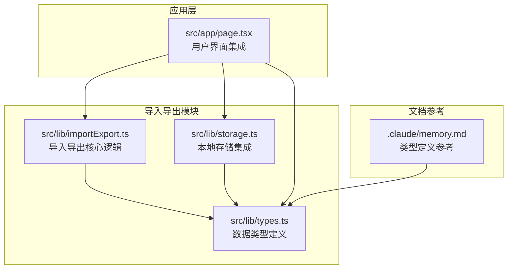
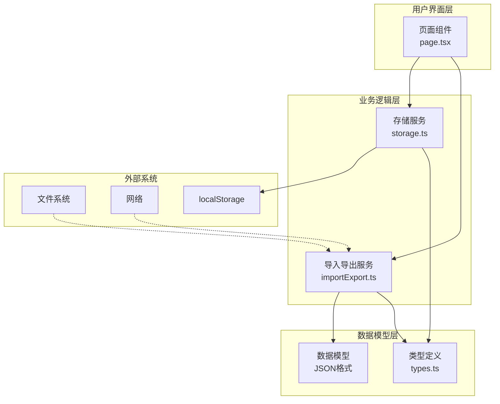
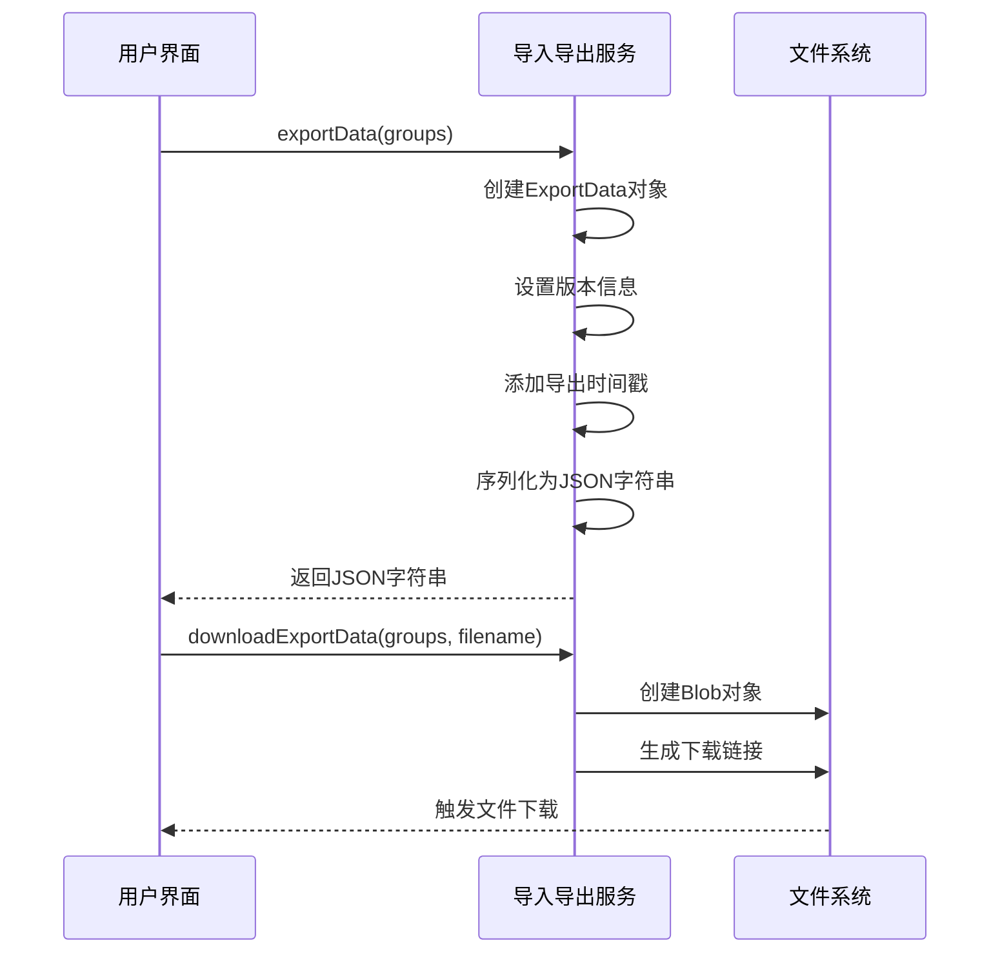
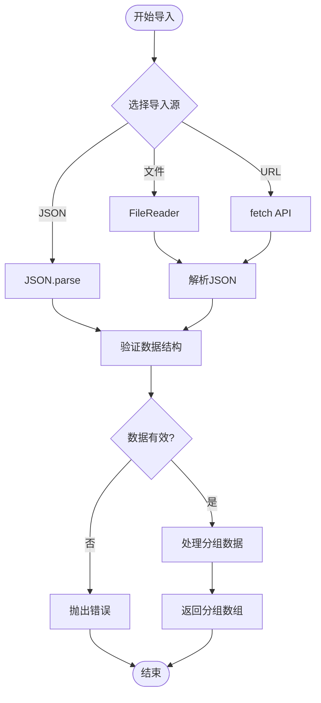
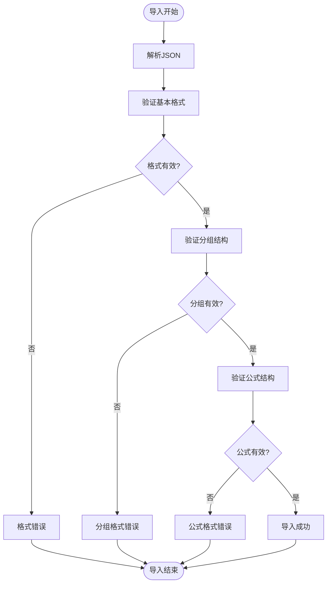
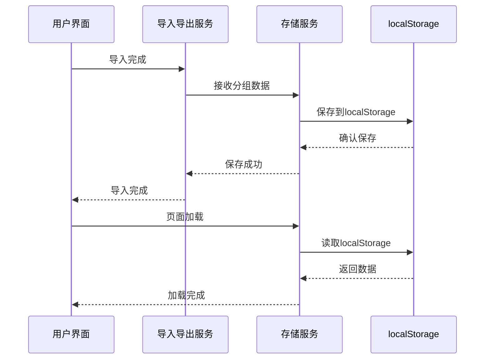
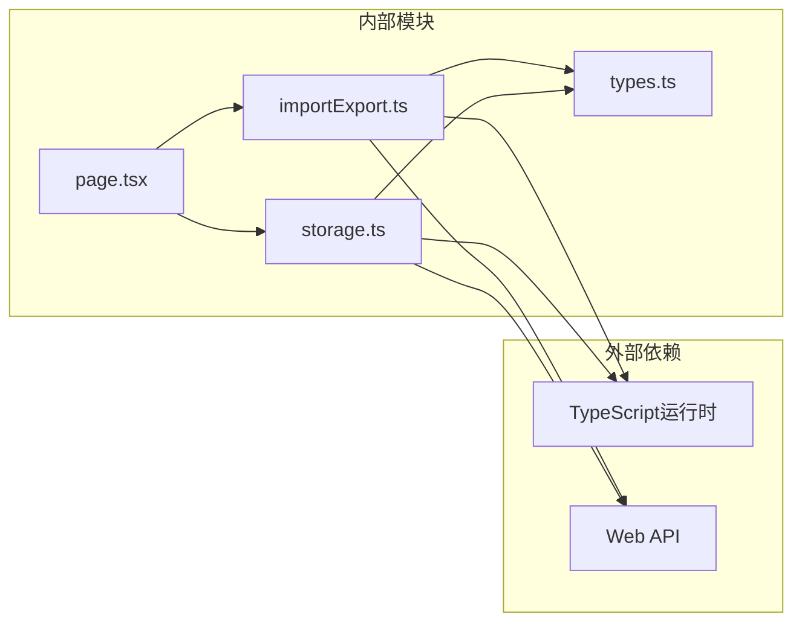

# 导入导出功能

<cite>
**本文档引用的文件**
- [importExport.ts](file://src/lib/importExport.ts)
- [types.ts](file://src/lib/types.ts)
- [storage.ts](file://src/lib/storage.ts)
- [page.tsx](file://src/app/page.tsx)
- [memory.md](file://.claude/memory.md)
</cite>

## 目录
1. [简介](#简介)
2. [项目结构](#项目结构)
3. [核心组件](#核心组件)
4. [架构概览](#架构概览)
5. [详细组件分析](#详细组件分析)
6. [依赖关系分析](#依赖关系分析)
7. [性能考虑](#性能考虑)
8. [故障排除指南](#故障排除指南)
9. [结论](#结论)

## 简介

导入导出功能模块是公式管理系统的核心数据管理组件，负责将用户创建的公式分组数据以标准JSON格式进行序列化和反序列化。该模块提供了完整的数据持久化解决方案，支持本地文件导入导出、URL远程导入以及浏览器本地存储集成。

本模块采用TypeScript实现，具有严格的类型安全性和完善的错误处理机制。通过标准化的数据格式，确保了数据的可移植性和跨平台兼容性。

## 项目结构

导入导出功能主要分布在以下文件中：



**图表来源**
- [importExport.ts:1-120](file://src/lib/importExport.ts#L1-L120)
- [storage.ts:1-50](file://src/lib/storage.ts#L1-L50)
- [types.ts:1-51](file://src/lib/types.ts#L1-L51)
- [page.tsx:1-200](file://src/app/page.tsx#L1-L200)

**章节来源**
- [importExport.ts:1-120](file://src/lib/importExport.ts#L1-L120)
- [storage.ts:1-50](file://src/lib/storage.ts#L1-L50)
- [types.ts:1-51](file://src/lib/types.ts#L1-L51)
- [page.tsx:1-200](file://src/app/page.tsx#L1-L200)

## 核心组件

### 数据模型定义

导入导出功能基于以下核心数据结构：

```mermaid
erDiagram
EXPORT_DATA {
string version
string exportDate
FormulaGroup[] groups
}
FORMULA_GROUP {
string id PK
string name
string parentId
Formula[] formulas
number createdAt
}
FORMULA {
string id PK
string name
string englishFormula
string chineseFormula
number createdAt
Record<string,string> variableFormulaMapping
SubFormula[] subFormulas
}
SUB_FORMULA {
string id PK
string name
string englishFormula
string chineseFormula
}
EXPORT_DATA ||--o{ FORMULA_GROUP : contains
FORMULA_GROUP ||--o{ FORMULA : contains
FORMULA ||--o{ SUB_FORMULA : contains
```

**图表来源**
- [types.ts:27-50](file://src/lib/types.ts#L27-L50)
- [importExport.ts:3-7](file://src/lib/importExport.ts#L3-L7)

### 导入导出接口

模块提供了以下核心API：

- `exportData(groups: FormulaGroup[]): string` - 将分组数据序列化为JSON字符串
- `downloadExportData(groups: FormulaGroup[], filename?: string): void` - 下载JSON文件
- `importData(json: string): FormulaGroup[]` - 从JSON字符串导入数据
- `importFromFile(file: File): Promise<FormulaGroup[]>` - 从文件导入数据
- `importFromUrl(url: string): Promise<FormulaGroup[]>` - 从URL导入数据

**章节来源**
- [importExport.ts:12-119](file://src/lib/importExport.ts#L12-L119)

## 架构概览

导入导出功能采用分层架构设计，确保了清晰的职责分离和良好的可维护性：



**图表来源**
- [page.tsx:10-12](file://src/app/page.tsx#L10-L12)
- [importExport.ts:1-120](file://src/lib/importExport.ts#L1-L120)
- [storage.ts:1-50](file://src/lib/storage.ts#L1-L50)

## 详细组件分析

### 导入导出核心服务

#### 导出功能实现

导出功能负责将内存中的公式分组数据转换为标准JSON格式：



**图表来源**
- [importExport.ts:12-38](file://src/lib/importExport.ts#L12-L38)

#### 导入功能实现

导入功能提供了多种数据源支持，包括文件、URL和直接JSON：



**图表来源**
- [importExport.ts:43-119](file://src/lib/importExport.ts#L43-L119)

### 数据验证机制

导入过程包含多层次的数据验证：



**图表来源**
- [importExport.ts:43-75](file://src/lib/importExport.ts#L43-L75)

### 错误处理策略

系统实现了完善的错误处理机制：

| 错误类型 | 触发条件 | 处理方式 |
|---------|---------|---------|
| JSON格式错误 | JSON.parse失败 | 抛出"JSON格式错误"异常 |
| 数据格式不正确 | 缺少必需字段或类型不符 | 抛出具体位置的格式错误 |
| 文件读取失败 | FileReader.onerror触发 | 抛出"文件读取失败"异常 |
| 网络请求失败 | fetch响应非ok状态 | 抛出网络错误信息 |
| HTTP错误 | 服务器返回错误状态码 | 保留原始HTTP错误信息 |

**章节来源**
- [importExport.ts:43-119](file://src/lib/importExport.ts#L43-L119)

### 与存储系统的集成

导入导出功能与本地存储系统紧密集成：



**图表来源**
- [storage.ts:5-25](file://src/lib/storage.ts#L5-L25)
- [page.tsx:85-87](file://src/app/page.tsx#L85-L87)

**章节来源**
- [storage.ts:1-50](file://src/lib/storage.ts#L1-L50)

## 依赖关系分析

导入导出功能的依赖关系如下：



**图表来源**
- [importExport.ts](file://src/lib/importExport.ts#L1)
- [storage.ts](file://src/lib/storage.ts#L1)
- [types.ts](file://src/lib/types.ts#L1)

### 组件耦合度分析

- **低耦合**: 导入导出服务与UI组件通过事件和回调解耦
- **单向依赖**: UI组件依赖导入导出服务，但反之不成立
- **类型安全**: 完全的TypeScript类型检查确保编译时安全
- **可测试性**: 模块化设计便于单元测试和集成测试

**章节来源**
- [page.tsx:10-12](file://src/app/page.tsx#L10-L12)
- [importExport.ts:1-120](file://src/lib/importExport.ts#L1-L120)

## 性能考虑

### 内存管理

- **Blob对象管理**: 导出完成后及时释放URL对象，避免内存泄漏
- **文件读取优化**: 使用异步FileReader避免阻塞主线程
- **数据结构优化**: 使用Set进行分组删除操作，提高查找效率

### 大文件处理

对于大型数据集的处理建议：

1. **分批处理**: 将大数据集分割为多个小批次处理
2. **进度反馈**: 提供导入进度指示器
3. **内存监控**: 实施内存使用监控机制
4. **超时控制**: 设置合理的导入超时时间

### 并发处理

- **异步操作**: 所有I/O操作均采用Promise模式
- **并发限制**: 控制同时进行的导入任务数量
- **资源清理**: 确保异常情况下资源得到正确清理

## 故障排除指南

### 常见问题及解决方案

#### JSON格式错误
**症状**: 导入时提示"JSON格式错误"
**原因**: 文件不是有效的JSON格式
**解决**: 
1. 检查文件编码是否为UTF-8
2. 验证JSON语法是否正确
3. 确认文件没有被其他程序修改

#### 数据格式不正确
**症状**: 导入时提示特定位置的格式错误
**原因**: 数据结构不符合预期格式
**解决**:
1. 检查version字段是否存在
2. 验证groups数组格式
3. 确认每个分组包含id、name、formulas字段

#### 文件读取失败
**症状**: 导入文件时出现"文件读取失败"
**原因**: 文件权限或路径问题
**解决**:
1. 检查文件访问权限
2. 确认文件路径正确
3. 验证文件未被其他程序占用

#### 网络请求失败
**症状**: 从URL导入时出现网络错误
**原因**: 网络连接或服务器问题
**解决**:
1. 检查网络连接状态
2. 验证URL地址正确性
3. 确认服务器可访问性

### 调试技巧

1. **浏览器开发者工具**: 使用Network面板检查请求响应
2. **控制台日志**: 添加详细的错误信息输出
3. **数据验证**: 在导入前先验证数据结构
4. **回滚机制**: 实现导入失败时的数据回滚

**章节来源**
- [importExport.ts:43-119](file://src/lib/importExport.ts#L43-L119)
- [page.tsx:374-420](file://src/app/page.tsx#L374-L420)

## 结论

导入导出功能模块通过标准化的数据格式和完善的错误处理机制，为公式管理系统提供了可靠的数据管理能力。模块设计具有以下优势：

- **类型安全**: 完整的TypeScript类型定义确保编译时安全
- **易于扩展**: 模块化设计便于功能扩展和维护
- **用户友好**: 提供多种导入方式满足不同使用场景
- **性能优化**: 异步处理和资源管理确保良好的用户体验

该模块为后续的功能扩展奠定了坚实的基础，包括批量操作、数据同步、云端备份等高级功能都可以在此基础上实现。