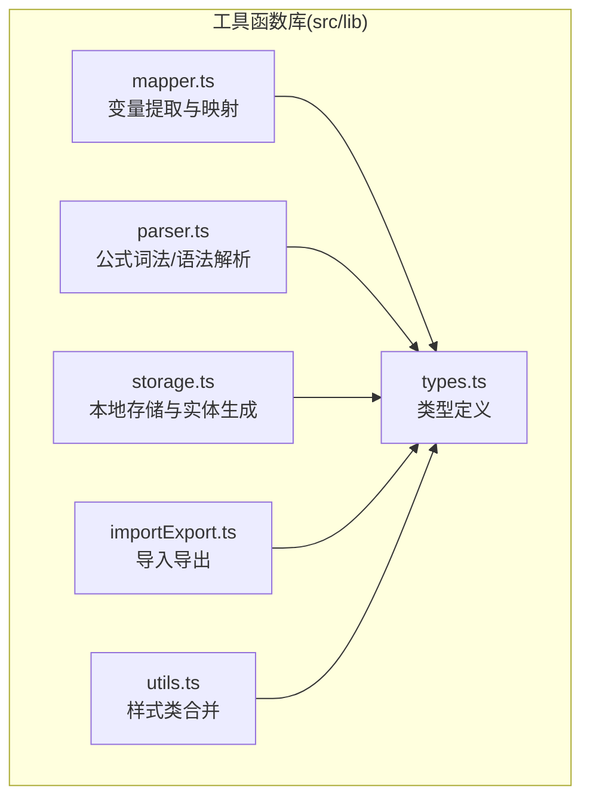
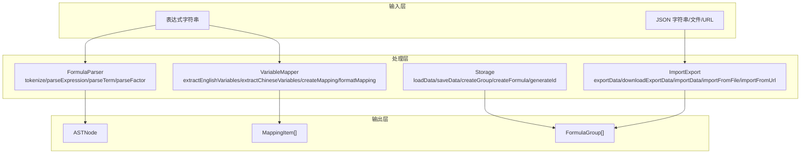
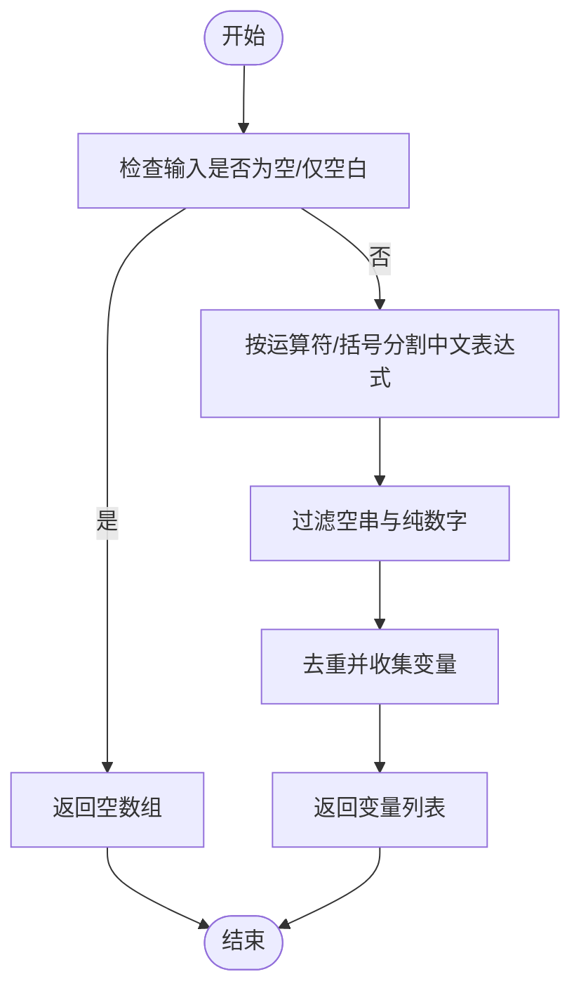
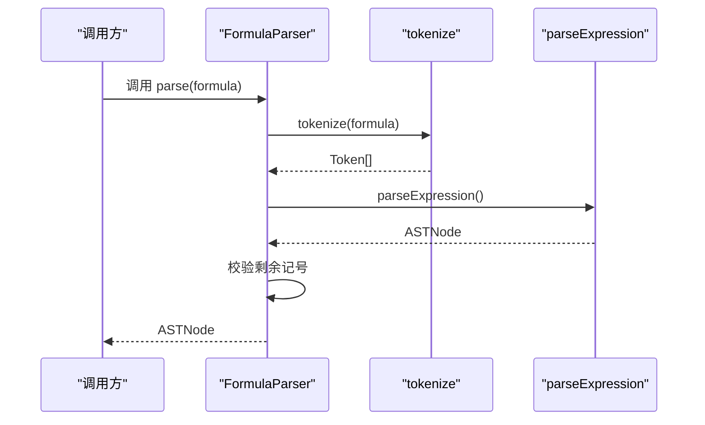
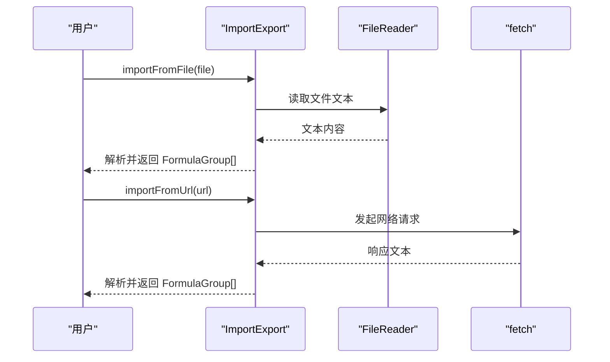
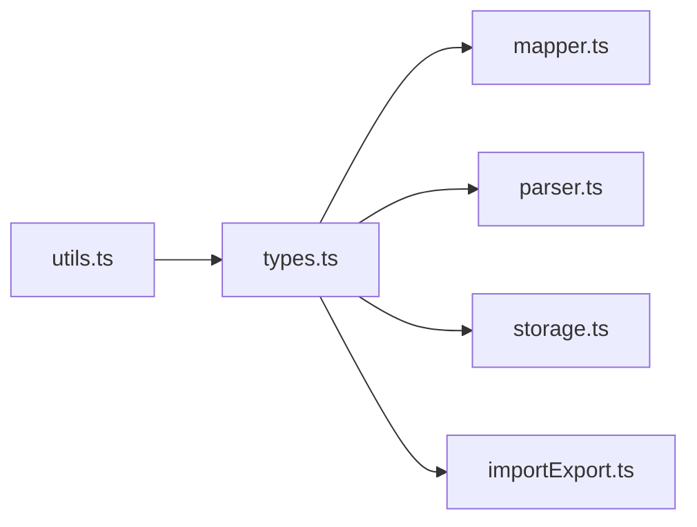

# 工具函数库

<cite>
**本文引用的文件**
- [src/lib/utils.ts](file://src/lib/utils.ts)
- [src/lib/mapper.ts](file://src/lib/mapper.ts)
- [src/lib/parser.ts](file://src/lib/parser.ts)
- [src/lib/storage.ts](file://src/lib/storage.ts)
- [src/lib/importExport.ts](file://src/lib/importExport.ts)
- [src/lib/types.ts](file://src/lib/types.ts)
</cite>

## 目录
1. [引言](#引言)
2. [项目结构](#项目结构)
3. [核心组件](#核心组件)
4. [架构总览](#架构总览)
5. [详细组件分析](#详细组件分析)
6. [依赖分析](#依赖分析)
7. [性能考虑](#性能考虑)
8. [故障排查指南](#故障排查指南)
9. [结论](#结论)
10. [附录](#附录)

## 引言
本文件面向“工具函数库”的使用者与维护者，系统化梳理字符串处理、变量提取与映射、公式解析、本地存储与导入导出等核心能力的设计原则与实现细节。文档覆盖参数校验、错误处理、边界条件、API 说明、性能特性、适用场景、函数间依赖关系与组合模式、单元测试策略与质量保障、以及扩展新工具函数的最佳实践与设计规范。

## 项目结构
工具函数库位于 src/lib 目录下，围绕“变量映射”“公式解析”“数据持久化与导入导出”三大主题组织，类型定义集中于 types.ts，便于跨模块复用。

图表来源
- [src/lib/utils.ts:1-7](file://src/lib/utils.ts#L1-L7)
- [src/lib/mapper.ts:1-89](file://src/lib/mapper.ts#L1-L89)
- [src/lib/parser.ts:1-159](file://src/lib/parser.ts#L1-L159)
- [src/lib/storage.ts:1-50](file://src/lib/storage.ts#L1-L50)
- [src/lib/importExport.ts:1-120](file://src/lib/importExport.ts#L1-L120)
- [src/lib/types.ts:1-51](file://src/lib/types.ts#L1-L51)

章节来源
- [src/lib/utils.ts:1-7](file://src/lib/utils.ts#L1-L7)
- [src/lib/mapper.ts:1-89](file://src/lib/mapper.ts#L1-L89)
- [src/lib/parser.ts:1-159](file://src/lib/parser.ts#L1-L159)
- [src/lib/storage.ts:1-50](file://src/lib/storage.ts#L1-L50)
- [src/lib/importExport.ts:1-120](file://src/lib/importExport.ts#L1-L120)
- [src/lib/types.ts:1-51](file://src/lib/types.ts#L1-L51)

## 核心组件
- 样式类合并工具：提供简洁的类名合并与冲突修复能力，适用于 UI 组件的动态样式拼装。
- 变量映射器：从英文字母变量与中英文混合表达式中提取变量，建立双向映射，支持格式化输出。
- 公式解析器：将表达式切分为词法记号，构建抽象语法树，支持多种括号与运算符，具备完善的错误定位。
- 本地存储与实体生成：封装 localStorage 的读写、数据结构生成与 ID 生成策略。
- 导入导出：提供 JSON 结构导出、文件下载、JSON 导入、文件读取与远程 URL 导入，含严格的数据结构校验。

章节来源
- [src/lib/utils.ts:4-6](file://src/lib/utils.ts#L4-L6)
- [src/lib/mapper.ts:3-88](file://src/lib/mapper.ts#L3-L88)
- [src/lib/parser.ts:3-159](file://src/lib/parser.ts#L3-L159)
- [src/lib/storage.ts:5-49](file://src/lib/storage.ts#L5-L49)
- [src/lib/importExport.ts:12-119](file://src/lib/importExport.ts#L12-L119)

## 架构总览
工具函数库采用“职责单一、接口清晰、类型驱动”的设计风格。各模块通过 types.ts 中的统一类型进行耦合，避免重复定义；解析器与映射器分别承担词法/语法与语义层面的任务；存储与导入导出模块负责数据生命周期管理。

图表来源
- [src/lib/parser.ts:12-159](file://src/lib/parser.ts#L12-L159)
- [src/lib/mapper.ts:52-88](file://src/lib/mapper.ts#L52-L88)
- [src/lib/storage.ts:5-49](file://src/lib/storage.ts#L5-L49)
- [src/lib/importExport.ts:12-119](file://src/lib/importExport.ts#L12-L119)
- [src/lib/types.ts:1-51](file://src/lib/types.ts#L1-L51)

## 详细组件分析

### 样式类合并工具 cn
- 设计原则
  - 基于 clsx 与 tailwind-merge 的组合，兼顾条件类名拼接与冲突修复。
  - 对任意数量的输入进行归一化处理，避免重复与冲突类名。
- 参数与返回
  - 参数：可变长度的输入（字符串、对象、数组、条件表达式等），最终被 clsx 归一化。
  - 返回：合并后的类名字符串。
- 边界与错误处理
  - 输入为空或无意义时，返回空字符串，不会抛出异常。
- 性能与适用场景
  - 时间复杂度近似 O(n)，n 为输入项数量；空间复杂度与输出长度线性相关。
  - 适合在 UI 组件中根据状态动态拼装类名，减少样式冲突。
- 使用建议
  - 优先传入明确的布尔条件与对象形式，提升可读性与可维护性。

章节来源
- [src/lib/utils.ts:4-6](file://src/lib/utils.ts#L4-L6)

### 变量映射器 VariableMapper
- 功能概述
  - 提取表达式中的变量集合，支持英文变量与中英文混合表达式。
  - 建立英文字母变量与中文变量之间的映射，并可格式化为标准条目列表。
- 关键方法与行为
  - 英文变量提取：对空白/非字母开头的片段进行过滤，去重后返回有序列表。
  - 中文变量提取：按中英文运算符与括号分割，过滤纯数字与空串，去重后返回列表。
  - 映射创建：按索引对齐生成映射表，若中文变量更多则标记“更多中文变量”。
  - 映射格式化：将映射结果转为包含英文与中文字段的标准条目列表。
- 参数与返回
  - 英文变量提取：输入表达式字符串；返回字符串数组。
  - 中文变量提取：输入表达式字符串；返回字符串数组。
  - 映射创建：输入英/中文表达式；返回包含映射表、变量列表与标记的对象。
  - 映射格式化：输入映射结果；返回条目列表与标记。
- 错误处理与边界
  - 输入为空或仅空白时返回空数组；无匹配时返回空数组。
  - 中文变量提取会过滤纯数字与空串，避免将数值误判为变量。
- 性能与适用场景
  - 时间复杂度近似 O(n+m)，n 为表达式长度，m 为匹配变量数量；空间复杂度与变量数量线性相关。
  - 适用于公式编辑、变量对齐与教学展示等场景。
- 组合使用模式
  - 先用英文变量提取与中文变量提取，再调用映射创建，最后格式化输出，形成“提取—映射—呈现”的流水线。

图表来源
- [src/lib/mapper.ts:29-50](file://src/lib/mapper.ts#L29-L50)

章节来源
- [src/lib/mapper.ts:3-88](file://src/lib/mapper.ts#L3-L88)

### 公式解析器 FormulaParser
- 功能概述
  - 将表达式字符串切分为词法记号，随后递归下降解析为抽象语法树，支持加减乘除与多类括号。
- 关键流程
  - 词法分析：跳过空白，识别运算符、变量、数字与括号，遇到未知字符抛错。
  - 语法分析：表达式由项组成，项由因子组成；乘除优先级高于加减；括号改变求值顺序。
  - 完整性校验：解析结束后若仍有剩余记号，抛出“表达式解析不完整”错误；括号不匹配时抛错。
- 参数与返回
  - parse：输入表达式字符串；返回 ASTNode。
  - tokenize：输入表达式字符串；返回 Token 数组。
- 错误处理与边界
  - 无法识别字符：抛出带位置信息的错误。
  - 表达式不完整：缺少操作数或存在未处理字符时抛错。
  - 括号不匹配：缺少对应闭合括号时抛错。
- 性能与适用场景
  - 时间复杂度 O(n)，n 为表达式长度；空间复杂度 O(d)，d 为递归深度。
  - 适用于公式校验、可视化渲染、计算引擎前置处理等场景。
- 组合使用模式
  - 先 tokenize，再构造解析器实例，最后 parseExpression，形成“词法—语法—树”的标准流程。

图表来源
- [src/lib/parser.ts:12-22](file://src/lib/parser.ts#L12-L22)
- [src/lib/parser.ts:24-68](file://src/lib/parser.ts#L24-L68)
- [src/lib/parser.ts:78-157](file://src/lib/parser.ts#L78-L157)

章节来源
- [src/lib/parser.ts:3-159](file://src/lib/parser.ts#L3-L159)

### 本地存储与实体生成 Storage
- 功能概述
  - 封装 localStorage 的读写；提供分组与公式的实体创建；提供全局唯一 ID 生成。
- 关键方法与行为
  - loadData：读取并解析本地存储，异常时返回空数组。
  - saveData：序列化并保存到本地存储，异常时记录错误但不中断。
  - createGroup/createFormula：生成带时间戳与随机后缀的 ID，填充基础字段。
  - generateId：结合时间戳与随机字符串，降低碰撞概率。
- 参数与返回
  - loadData：无参数；返回 FormulaGroup[]。
  - saveData：接收 FormulaGroup[]；无返回。
  - createGroup：接收名称与父 ID；返回 FormulaGroup。
  - createFormula：接收名称与双语表达式；返回 Formula。
  - generateId：无参数；返回字符串 ID。
- 错误处理与边界
  - 在非浏览器环境（如 SSR）直接返回默认值或忽略写入。
  - JSON 解析失败时返回空数组；序列化失败时记录错误。
- 性能与适用场景
  - 读写复杂度 O(n)（n 为数据大小）；ID 生成复杂度 O(1)。
  - 适用于前端本地持久化、离线缓存、临时草稿保存等场景。
- 组合使用模式
  - 新建分组/公式后立即 saveData；应用启动时 loadData 初始化状态。

章节来源
- [src/lib/storage.ts:5-49](file://src/lib/storage.ts#L5-L49)

### 导入导出 ImportExport
- 功能概述
  - 提供 JSON 导出、文件下载、JSON 导入、文件读取与远程 URL 导入，含严格的数据结构校验。
- 关键方法与行为
  - exportData：包装版本号、导出时间与分组数据，返回 JSON 字符串。
  - downloadExportData：生成 Blob 并触发浏览器下载。
  - importData：解析 JSON，校验版本与结构，逐项验证分组与公式字段。
  - importFromFile：基于 FileReader 异步读取文件文本并导入。
  - importFromUrl：基于 fetch 获取远程文本并导入。
- 参数与返回
  - exportData：接收 FormulaGroup[]；返回字符串。
  - downloadExportData：接收 FormulaGroup[] 与可选文件名；无返回。
  - importData：接收 JSON 字符串；返回 FormulaGroup[]。
  - importFromFile：接收 File；返回 Promise<FormulaGroup[]>。
  - importFromUrl：接收 URL 字符串；返回 Promise<FormulaGroup[]>。
- 错误处理与边界
  - 版本缺失或分组/公式字段不完整时抛错。
  - JSON 语法错误、HTTP 请求失败、文件读取失败均抛错。
- 性能与适用场景
  - 导出/导入复杂度与数据量线性相关；浏览器端适合中小规模数据交换。
  - 适用于配置迁移、备份恢复、团队共享等场景。
- 组合使用模式
  - 导出时先 exportData 再 downloadExportData；导入时根据来源选择 importData/importFromFile/importFromUrl。

图表来源
- [src/lib/importExport.ts:80-119](file://src/lib/importExport.ts#L80-L119)

章节来源
- [src/lib/importExport.ts:12-119](file://src/lib/importExport.ts#L12-L119)

## 依赖分析
- 类型依赖：所有模块均依赖 types.ts 中的 Token、ASTNode、VariableMapping、MappingItem、Formula、SubFormula、FormulaGroup 等类型，确保跨模块一致性。
- 模块内聚与耦合
  - VariableMapper 与 FormulaParser 分别聚焦“变量语义”与“语法结构”，职责清晰。
  - Storage 与 ImportExport 独立负责数据生命周期与数据交换，耦合度低。
  - utils.ts 作为 UI 层辅助工具，与业务逻辑解耦。
- 外部依赖
  - clsx 与 tailwind-merge 用于类名合并与冲突修复。
  - 浏览器原生 API：localStorage、Blob、URL.createObjectURL、FileReader、fetch。

图表来源
- [src/lib/types.ts:1-51](file://src/lib/types.ts#L1-L51)
- [src/lib/mapper.ts:1-2](file://src/lib/mapper.ts#L1-L2)
- [src/lib/parser.ts:1-2](file://src/lib/parser.ts#L1-L2)
- [src/lib/storage.ts:1-2](file://src/lib/storage.ts#L1-L2)
- [src/lib/importExport.ts:1-2](file://src/lib/importExport.ts#L1-L2)
- [src/lib/utils.ts:1-2](file://src/lib/utils.ts#L1-L2)

章节来源
- [src/lib/types.ts:1-51](file://src/lib/types.ts#L1-L51)
- [src/lib/mapper.ts:1-2](file://src/lib/mapper.ts#L1-L2)
- [src/lib/parser.ts:1-2](file://src/lib/parser.ts#L1-L2)
- [src/lib/storage.ts:1-2](file://src/lib/storage.ts#L1-L2)
- [src/lib/importExport.ts:1-2](file://src/lib/importExport.ts#L1-L2)
- [src/lib/utils.ts:1-2](file://src/lib/utils.ts#L1-L2)

## 性能考虑
- 字符串处理
  - VariableMapper 的中文变量提取使用分割与正则过滤，整体 O(n)；去重使用 Set，平均 O(1) 插入。
  - cn 合并类名时，clsx/tailwind-merge 的开销与输入项数量线性相关。
- 解析性能
  - FormulaParser 的 tokenize 与递归下降解析均为单次扫描，时间复杂度 O(n)；内存占用与嵌套深度成正比。
- 存储与导入导出
  - localStorage 读写为同步操作，大数据量时可能阻塞 UI；建议分批或异步处理。
  - 导入导出涉及 JSON 序列化/反序列化，复杂度与数据量线性相关；大文件建议服务端处理或分片传输。
- 优化建议
  - 对高频调用的字符串处理增加缓存（如变量提取结果缓存）。
  - 对大型数据集采用虚拟滚动与懒加载，避免一次性渲染。
  - 对导入导出增加进度反馈与取消机制。

## 故障排查指南
- 表达式解析错误
  - 症状：抛出“无法识别的字符”“表达式不完整”“括号不匹配”等错误。
  - 排查：检查输入字符串是否包含非法字符；确认括号成对出现；确保表达式完整。
- 变量映射异常
  - 症状：中文变量提取为空或与英文变量数量不一致。
  - 排查：确认表达式中是否存在纯数字或空串；检查运算符与括号是否正确分隔。
- 导入失败
  - 症状：JSON 格式错误、版本缺失、字段不完整、网络请求失败、文件读取失败。
  - 排查：核对导出版本与字段结构；检查文件编码与网络连通性；捕获并记录具体错误信息。
- 本地存储异常
  - 症状：读取为空、保存失败、SSR 环境报错。
  - 排查：确认运行环境是否为浏览器；检查 localStorage 可用性与配额限制；捕获异常并降级处理。

章节来源
- [src/lib/parser.ts:64-64](file://src/lib/parser.ts#L64-L64)
- [src/lib/parser.ts:120-121](file://src/lib/parser.ts#L120-L121)
- [src/lib/parser.ts:148-149](file://src/lib/parser.ts#L148-L149)
- [src/lib/importExport.ts:48-75](file://src/lib/importExport.ts#L48-L75)
- [src/lib/importExport.ts:106-118](file://src/lib/importExport.ts#L106-L118)
- [src/lib/storage.ts:8-25](file://src/lib/storage.ts#L8-L25)

## 结论
该工具函数库以类型驱动与职责分离为核心设计思想，覆盖了从字符串处理、变量映射、公式解析到数据持久化与导入导出的完整链路。通过清晰的 API、完善的错误处理与边界条件控制，能够在不同场景下稳定运行。建议在扩展新工具函数时遵循统一类型、最小依赖、显式错误、可测试性的原则，持续提升库的可维护性与可扩展性。

## 附录

### API 一览与最佳实践
- 样式类合并工具 cn
  - 参数：任意数量的输入（字符串、对象、数组、条件表达式）。
  - 返回：合并后的类名字符串。
  - 最佳实践：优先使用对象形式表达条件，保持可读性；避免传递大量重复类名。
  - 参考路径：[src/lib/utils.ts:4-6](file://src/lib/utils.ts#L4-L6)

- 变量映射器 VariableMapper
  - 英文变量提取：输入表达式；输出变量数组。
  - 中文变量提取：输入表达式；输出变量数组。
  - 映射创建：输入英/中文表达式；输出映射结果对象。
  - 映射格式化：输入映射结果；输出条目列表。
  - 最佳实践：先提取变量，再建立映射，最后格式化输出；注意过滤纯数字与空串。
  - 参考路径：[src/lib/mapper.ts:4-88](file://src/lib/mapper.ts#L4-L88)

- 公式解析器 FormulaParser
  - parse：输入表达式；输出 ASTNode。
  - tokenize：输入表达式；输出 Token[]。
  - 最佳实践：先 tokenize，再构造解析器实例，最后 parseExpression；对异常进行捕获与提示。
  - 参考路径：[src/lib/parser.ts:12-159](file://src/lib/parser.ts#L12-L159)

- 本地存储与实体生成 Storage
  - loadData/saveData：读取/保存 FormulaGroup[]。
  - createGroup/createFormula：创建分组/公式实体。
  - generateId：生成全局唯一 ID。
  - 最佳实践：在浏览器环境调用；对异常进行日志记录；避免在 SSR 环境执行写操作。
  - 参考路径：[src/lib/storage.ts:5-49](file://src/lib/storage.ts#L5-L49)

- 导入导出 ImportExport
  - exportData：导出 JSON 字符串。
  - downloadExportData：下载导出文件。
  - importData：导入 JSON 字符串。
  - importFromFile：从文件导入。
  - importFromUrl：从 URL 导入。
  - 最佳实践：严格校验版本与字段结构；对网络与文件读取异常进行分类处理；提供进度与取消能力。
  - 参考路径：[src/lib/importExport.ts:12-119](file://src/lib/importExport.ts#L12-L119)

### 单元测试策略与质量保证
- 测试维度
  - 正常路径：覆盖典型输入与预期输出。
  - 边界条件：空字符串、仅空白、纯数字、极长字符串、多类括号嵌套。
  - 错误路径：非法字符、括号不匹配、JSON 格式错误、网络请求失败、文件读取失败。
- 断言建议
  - 对 cn 的输出进行类名合并与冲突修复断言。
  - 对 VariableMapper 的变量提取与映射结果进行集合与顺序断言。
  - 对 FormulaParser 的 AST 结构与错误抛出进行断言。
  - 对 Storage 的读写与 ID 生成进行断言。
  - 对 ImportExport 的结构校验与异常抛出进行断言。
- 质量保障
  - 使用 TypeScript 严格模式，确保类型安全。
  - 对外部依赖（localStorage、FileReader、fetch）进行环境判断与降级处理。
  - 对大对象序列化/反序列化增加超时与内存上限检测。