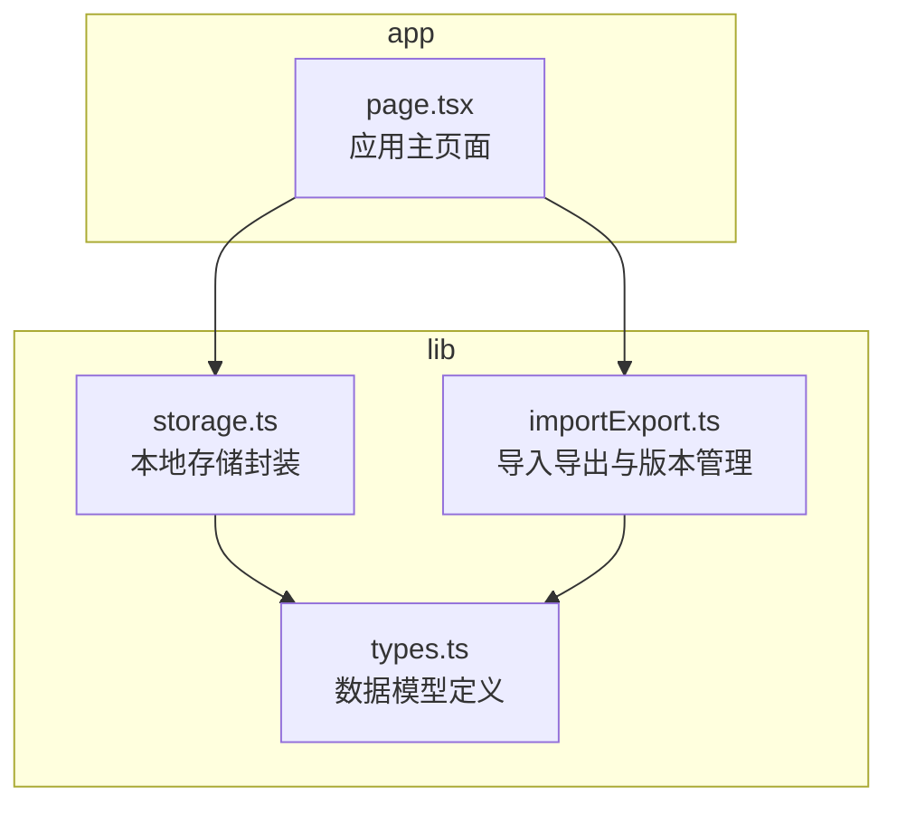
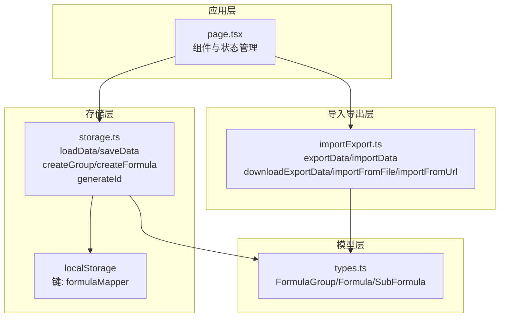
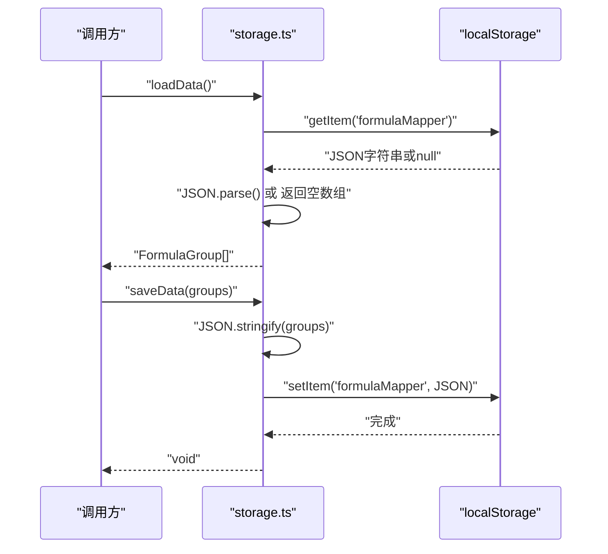
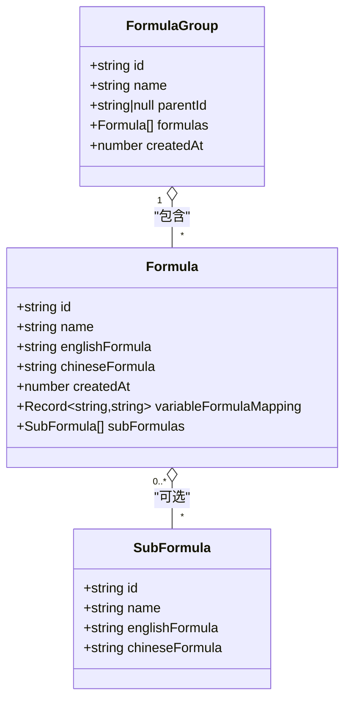
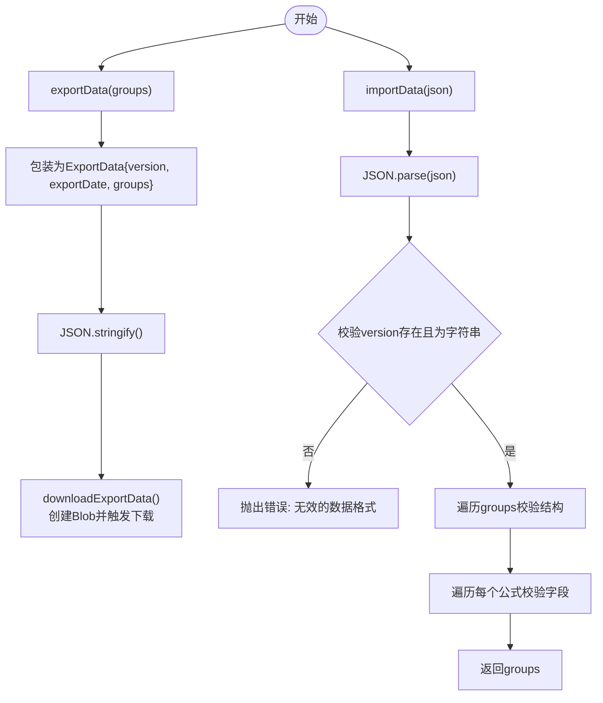
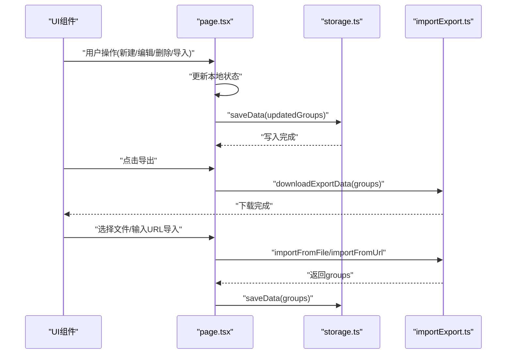
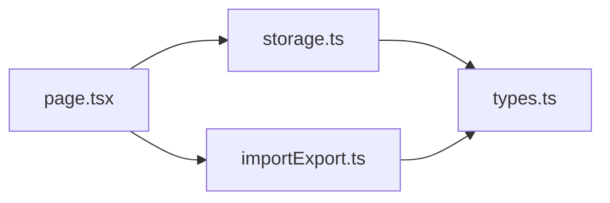

# 数据存储模块

<cite>
**本文档引用的文件**
- [storage.ts](file://src/lib/storage.ts)
- [types.ts](file://src/lib/types.ts)
- [importExport.ts](file://src/lib/importExport.ts)
- [page.tsx](file://src/app/page.tsx)
- [package.json](file://package.json)
</cite>

## 目录
1. [简介](#简介)
2. [项目结构](#项目结构)
3. [核心组件](#核心组件)
4. [架构概览](#架构概览)
5. [详细组件分析](#详细组件分析)
6. [依赖关系分析](#依赖关系分析)
7. [性能考虑](#性能考虑)
8. [故障排查指南](#故障排查指南)
9. [结论](#结论)
10. [附录](#附录)

## 简介
本文件为数据存储模块的详细实现文档，重点解释本地存储策略、数据持久化方案、localStorage封装、数据序列化/反序列化过程、数据结构版本管理与兼容性处理、数据读取/写入/更新/删除操作流程、完整的API接口说明、数据安全性与隐私保护措施、数据迁移与备份恢复功能、性能优化策略以及数据一致性与并发访问控制方案。通过本文件，开发者可以正确使用存储功能并进行扩展开发。

## 项目结构
数据存储模块位于 `src/lib/` 目录下，主要包含以下文件：
- storage.ts：本地存储封装与数据持久化核心逻辑
- types.ts：数据模型定义（FormulaGroup、Formula、SubFormula等）
- importExport.ts：数据导入导出与版本管理
- page.tsx：应用主页面，展示存储模块的使用方式

图表来源
- [storage.ts:1-50](file://src/lib/storage.ts#L1-L50)
- [types.ts:1-51](file://src/lib/types.ts#L1-L51)
- [importExport.ts:1-120](file://src/lib/importExport.ts#L1-L120)
- [page.tsx:1-200](file://src/app/page.tsx#L1-L200)

章节来源
- [storage.ts:1-50](file://src/lib/storage.ts#L1-L50)
- [types.ts:1-51](file://src/lib/types.ts#L1-L51)
- [importExport.ts:1-120](file://src/lib/importExport.ts#L1-L120)
- [page.tsx:1-200](file://src/app/page.tsx#L1-L200)

## 核心组件
本模块的核心组件包括：
- 本地存储封装：loadData/saveData、createGroup/createFormula、generateId
- 数据模型：FormulaGroup、Formula、SubFormula
- 导入导出与版本管理：exportData/downloadExportData/importData/importFromFile/importFromUrl
- 应用集成：在page.tsx中通过loadData初始化、saveData持久化、导入导出触发数据更新

章节来源
- [storage.ts:5-49](file://src/lib/storage.ts#L5-L49)
- [types.ts:27-51](file://src/lib/types.ts#L27-L51)
- [importExport.ts:12-119](file://src/lib/importExport.ts#L12-L119)
- [page.tsx:85-420](file://src/app/page.tsx#L85-L420)

## 架构概览
数据存储模块采用“模型-存储-导入导出”的分层架构：
- 模型层：types.ts定义FormulaGroup、Formula、SubFormula等数据结构
- 存储层：storage.ts封装localStorage的读写、序列化/反序列化、ID生成
- 导入导出层：importExport.ts负责数据的版本标记、格式校验、文件下载与网络导入
- 应用层：page.tsx在组件生命周期中调用loadData初始化，对用户操作调用saveData持久化，并通过导入导出功能完成数据迁移

图表来源
- [storage.ts:1-50](file://src/lib/storage.ts#L1-L50)
- [types.ts:1-51](file://src/lib/types.ts#L1-L51)
- [importExport.ts:1-120](file://src/lib/importExport.ts#L1-L120)
- [page.tsx:1-200](file://src/app/page.tsx#L1-L200)

## 详细组件分析

### 本地存储封装（storage.ts）
- 存储键：固定键名为 `formulaMapper`
- 读取流程：loadData从localStorage读取，解析JSON，异常时返回空数组
- 写入流程：saveData将数据序列化为JSON后写入localStorage，异常时记录错误
- 数据结构：FormulaGroup[]，包含分组信息与公式列表
- ID生成：generateId基于时间戳与随机字符串组合，确保唯一性
- 工具函数：createGroup/createFormula用于创建新的分组与公式对象

图表来源
- [storage.ts:5-25](file://src/lib/storage.ts#L5-L25)

章节来源
- [storage.ts:3-49](file://src/lib/storage.ts#L3-L49)

### 数据模型（types.ts）
- FormulaGroup：包含id、name、parentId、formulas、createdAt
- Formula：包含id、name、englishFormula、chineseFormula、createdAt、可选variableFormulaMapping、可选subFormulas
- SubFormula：包含id、name、englishFormula、chineseFormula
- 该模型定义了数据结构，供存储与导入导出使用

图表来源
- [types.ts:27-51](file://src/lib/types.ts#L27-L51)

章节来源
- [types.ts:1-51](file://src/lib/types.ts#L1-L51)

### 导入导出与版本管理（importExport.ts）
- 版本管理：导出数据包含version字段，默认为"1.0"，便于未来版本演进
- 导出：exportData将groups包装为ExportData并序列化；downloadExportData创建Blob并触发下载
- 导入：importData解析JSON并校验结构完整性；importFromFile通过FileReader异步读取；importFromUrl通过fetch获取远程数据
- 校验规则：验证version、groups数组、每个分组的id/name/formulas、每个公式的基本字段

图表来源
- [importExport.ts:12-75](file://src/lib/importExport.ts#L12-L75)

章节来源
- [importExport.ts:1-120](file://src/lib/importExport.ts#L1-L120)

### 应用集成（page.tsx）
- 初始化：组件挂载时调用loadData获取本地数据并设置状态
- 持久化：任何数据变更后调用saveData写回localStorage
- 导入导出：通过UI触发downloadExportData与importFromFile/importFromUrl，确认覆盖后更新状态并持久化
- URL同步：通过路由参数同步选中公式，配合localStorage缓存分组选择与侧边栏状态

图表来源
- [page.tsx:85-420](file://src/app/page.tsx#L85-L420)
- [storage.ts:5-25](file://src/lib/storage.ts#L5-L25)
- [importExport.ts:25-119](file://src/lib/importExport.ts#L25-L119)

章节来源
- [page.tsx:85-420](file://src/app/page.tsx#L85-L420)

## 依赖关系分析
- storage.ts依赖types.ts中的数据模型
- importExport.ts依赖types.ts中的数据模型
- page.tsx依赖storage.ts与importExport.ts
- package.json中未直接声明localStorage相关依赖，localStorage为浏览器内置API

图表来源
- [storage.ts:1-2](file://src/lib/storage.ts#L1-L2)
- [importExport.ts:1](file://src/lib/importExport.ts#L1)
- [page.tsx:10-12](file://src/app/page.tsx#L10-L12)

章节来源
- [package.json:15-34](file://package.json#L15-L34)

## 性能考虑
- 即时持久化：每次数据变更都调用saveData，确保数据及时落盘，但可能产生频繁写入
- 批量操作建议：对于连续多次修改，可在应用层合并状态更新后再一次性调用saveData
- 延迟保存机制：可在page.tsx中引入节流/防抖策略，减少localStorage写入频率
- 序列化开销：大量数据时JSON.stringify/parse可能成为瓶颈，建议分页或分块处理
- 并发访问控制：localStorage为同步API，同一浏览器上下文内串行访问；跨标签页并发可通过事件监听检测变化并同步
- 内存占用：FormulaGroup[]在内存中驻留，注意避免不必要的深拷贝与重复对象

[本节为通用性能指导，无需特定文件来源]

## 故障排查指南
- 读取失败：loadData捕获异常并返回空数组，检查localStorage可用性与数据格式
- 写入失败：saveData捕获异常并记录错误，检查磁盘配额与权限
- 导入失败：importData对JSON语法与结构进行校验，错误信息明确指出格式问题
- 文件读取失败：importFromFile在reader.onerror中抛出错误
- 网络导入失败：importFromUrl对HTTP状态进行检查并给出提示
- 数据不一致：若出现数据不同步，检查是否存在多实例同时修改localStorage

章节来源
- [storage.ts:8-24](file://src/lib/storage.ts#L8-L24)
- [importExport.ts:43-119](file://src/lib/importExport.ts#L43-L119)

## 结论
数据存储模块通过localStorage实现了轻量级的本地持久化，结合导入导出功能提供了完整的数据迁移能力。模块设计清晰，职责分离明确，易于扩展。建议在生产环境中引入批量操作与延迟保存策略，增强性能与用户体验；同时完善版本管理与兼容性处理，确保未来演进的平滑过渡。

[本节为总结性内容，无需特定文件来源]

## 附录

### API接口说明

- loadData
  - 功能：从localStorage读取FormulaGroup[]
  - 参数：无
  - 返回值：FormulaGroup[]
  - 异常：捕获并记录错误，返回空数组
  - 适用场景：组件初始化、应用启动时恢复数据

- saveData
  - 功能：将FormulaGroup[]写入localStorage
  - 参数：groups: FormulaGroup[]
  - 返回值：void
  - 异常：捕获并记录错误
  - 适用场景：任何数据变更后的持久化

- createGroup
  - 功能：创建新的FormulaGroup对象
  - 参数：name: string, parentId: string | null = null
  - 返回值：FormulaGroup
  - 适用场景：新增分组

- createFormula
  - 功能：创建新的Formula对象
  - 参数：name: string, englishFormula: string, chineseFormula: string
  - 返回值：Formula
  - 适用场景：新增公式

- exportData
  - 功能：将数据导出为JSON字符串
  - 参数：groups: FormulaGroup[]
  - 返回值：string
  - 异常：无显式try/catch，由调用方处理
  - 适用场景：准备导出数据

- downloadExportData
  - 功能：导出并触发浏览器下载
  - 参数：groups: FormulaGroup[], filename?: string
  - 返回值：void
  - 异常：无显式try/catch，由调用方处理
  - 适用场景：用户手动导出

- importData
  - 功能：从JSON字符串导入数据并校验
  - 参数：json: string
  - 返回值：FormulaGroup[]
  - 异常：JSON语法错误或结构不合法时抛出错误
  - 适用场景：解析导入文件内容

- importFromFile
  - 功能：从文件导入数据
  - 参数：file: File
  - 返回值：Promise<FormulaGroup[]>
  - 异常：文件读取失败或数据格式错误
  - 适用场景：用户选择文件导入

- importFromUrl
  - 功能：从URL导入数据
  - 参数：url: string
  - 返回值：Promise<FormulaGroup[]>
  - 异常：HTTP错误或网络请求失败
  - 适用场景：从远程地址导入

章节来源
- [storage.ts:5-49](file://src/lib/storage.ts#L5-L49)
- [importExport.ts:12-119](file://src/lib/importExport.ts#L12-L119)

### 数据结构版本管理与兼容性
- 版本字段：导出数据包含version字段，默认"1.0"
- 兼容性策略：导入时校验version存在性与结构完整性；未来升级时可在此处增加版本转换逻辑
- 建议：为每个major/minor版本提供迁移脚本，确保向前/向后兼容

章节来源
- [importExport.ts:13-19](file://src/lib/importExport.ts#L13-L19)
- [importExport.ts:48-50](file://src/lib/importExport.ts#L48-L50)

### 数据安全与隐私保护
- 本地存储：数据存储于浏览器localStorage，未加密传输
- 用户知情同意：导入导出前均提示覆盖风险
- 最小化原则：仅存储必要数据，避免敏感信息
- 建议：如需更高安全性，可引入客户端加密或服务端存储

章节来源
- [page.tsx:378-392](file://src/app/page.tsx#L378-L392)
- [page.tsx:403-420](file://src/app/page.tsx#L403-L420)

### 数据一致性与并发访问控制
- 单实例一致性：同一浏览器上下文中localStorage串行访问，避免竞态
- 跨标签页同步：可通过storage事件监听其他标签页的变更并同步状态
- 建议：在应用层引入乐观锁或版本号，防止并发覆盖

章节来源
- [page.tsx:136-144](file://src/app/page.tsx#L136-L144)