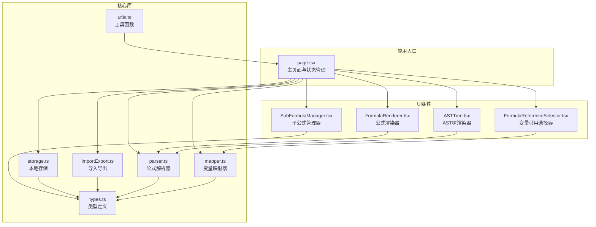
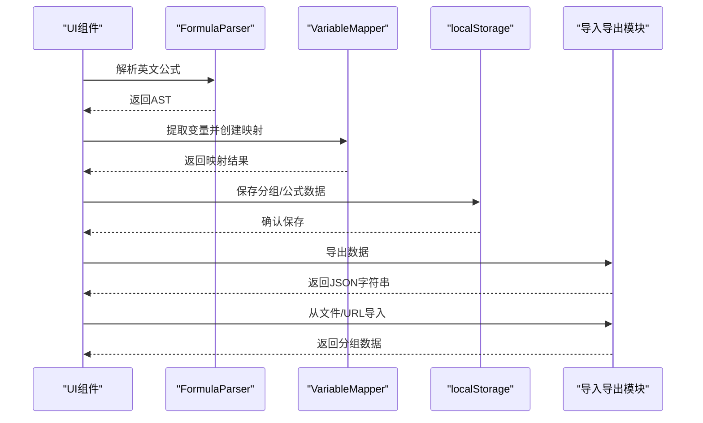
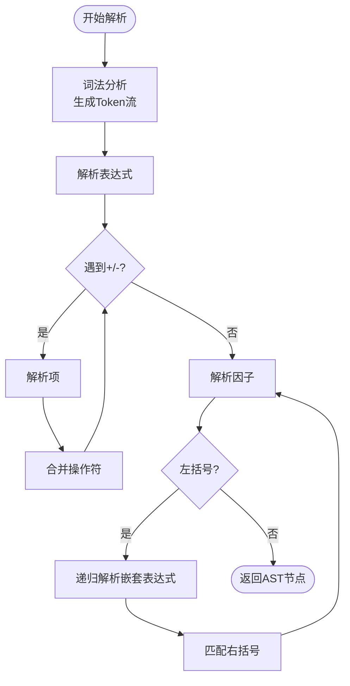
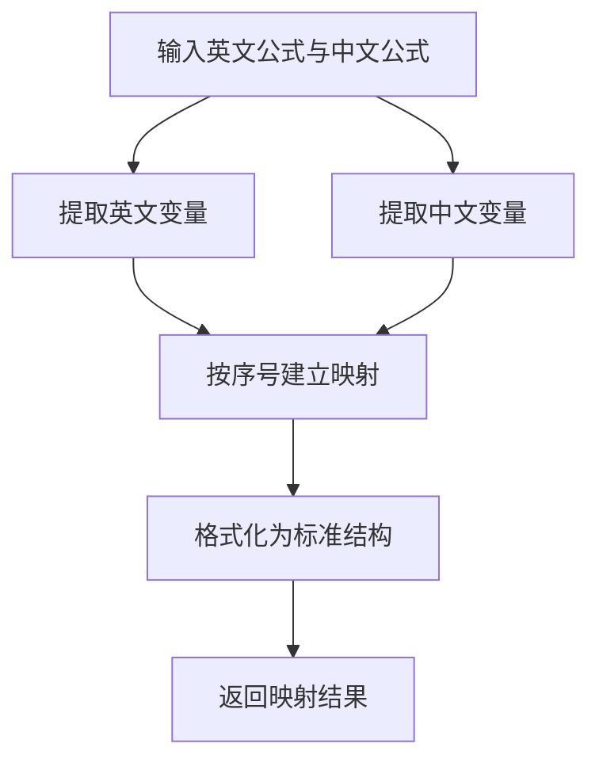
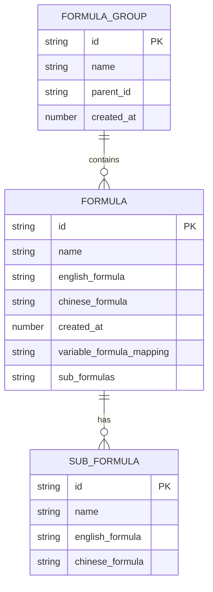
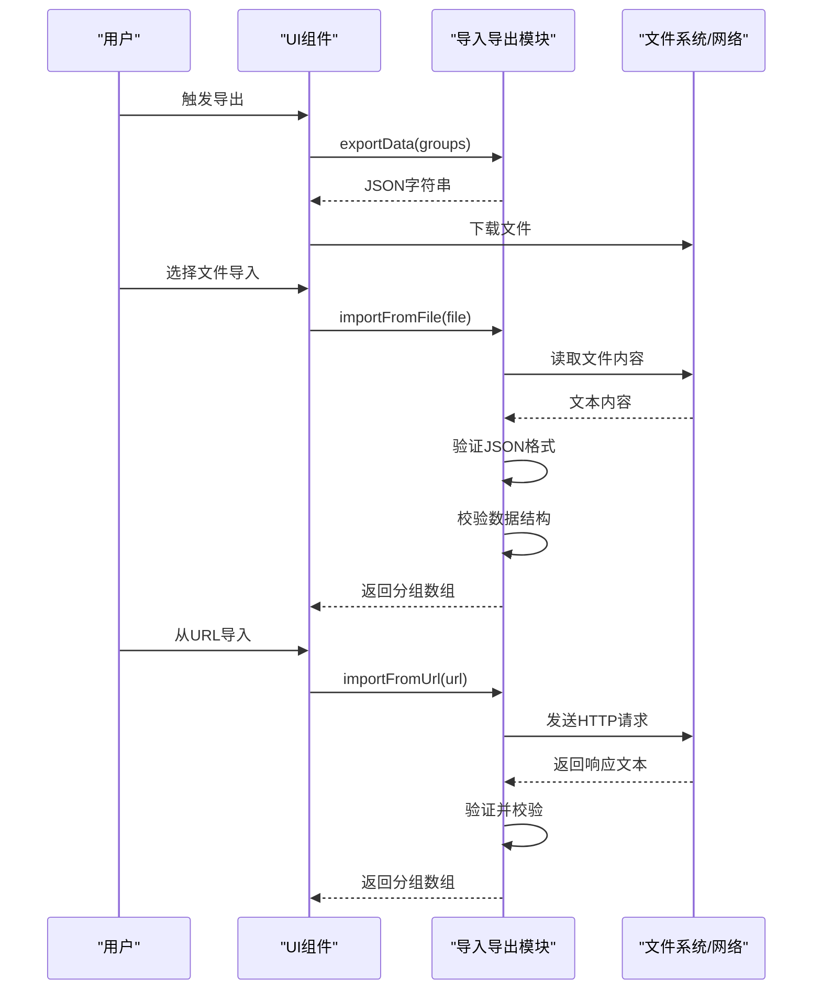
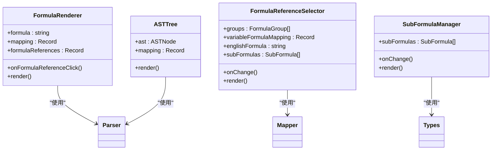
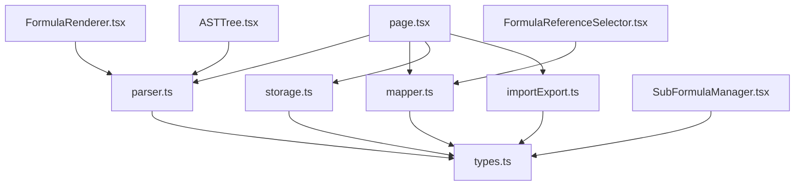

# 核心模块实现

<cite>
**本文档引用的文件**
- [parser.ts](file://src/lib/parser.ts)
- [mapper.ts](file://src/lib/mapper.ts)
- [storage.ts](file://src/lib/storage.ts)
- [importExport.ts](file://src/lib/importExport.ts)
- [utils.ts](file://src/lib/utils.ts)
- [types.ts](file://src/lib/types.ts)
- [FormulaRenderer.tsx](file://src/components/FormulaRenderer.tsx)
- [ASTTree.tsx](file://src/components/ASTTree.tsx)
- [FormulaReferenceSelector.tsx](file://src/components/FormulaReferenceSelector.tsx)
- [SubFormulaManager.tsx](file://src/components/SubFormulaManager.tsx)
- [page.tsx](file://src/app/page.tsx)
</cite>

## 目录
1. [简介](#简介)
2. [项目结构](#项目结构)
3. [核心组件](#核心组件)
4. [架构总览](#架构总览)
5. [详细组件分析](#详细组件分析)
6. [依赖关系分析](#依赖关系分析)
7. [性能考虑](#性能考虑)
8. [故障排除指南](#故障排除指南)
9. [结论](#结论)
10. [附录](#附录)

## 简介
本项目是一个公式变量映射与可视化工具，提供以下核心能力：
- 公式解析与语法分析：将英文公式字符串解析为抽象语法树（AST），支持四则运算、括号以及中英文括号混用。
- 变量映射：从英文公式和中文公式中提取变量，建立变量之间的映射关系，并支持中英文变量处理机制。
- 数据存储：基于浏览器本地存储的持久化方案，支持分组、公式、子公式等数据模型。
- 可视化渲染：提供公式渲染器和AST树渲染器，支持LaTeX渲染和变量高亮。
- 数据导入导出：支持JSON格式的导入导出，包括文件导入、URL导入和直接下载。
- 工具函数库：提供通用的UI辅助函数。

## 项目结构
项目采用按功能模块划分的组织方式，核心逻辑集中在 `src/lib` 目录，UI组件位于 `src/components`，页面入口在 `src/app/page.tsx`。

**图表来源**
- [page.tsx:1-749](file://src/app/page.tsx#L1-L749)
- [parser.ts:1-159](file://src/lib/parser.ts#L1-L159)
- [mapper.ts:1-89](file://src/lib/mapper.ts#L1-L89)
- [storage.ts:1-50](file://src/lib/storage.ts#L1-L50)
- [importExport.ts:1-120](file://src/lib/importExport.ts#L1-L120)
- [FormulaRenderer.tsx:1-169](file://src/components/FormulaRenderer.tsx#L1-L169)
- [ASTTree.tsx:1-179](file://src/components/ASTTree.tsx#L1-L179)
- [FormulaReferenceSelector.tsx:1-132](file://src/components/FormulaReferenceSelector.tsx#L1-L132)
- [SubFormulaManager.tsx:1-201](file://src/components/SubFormulaManager.tsx#L1-L201)

**章节来源**
- [page.tsx:1-749](file://src/app/page.tsx#L1-L749)
- [parser.ts:1-159](file://src/lib/parser.ts#L1-L159)
- [mapper.ts:1-89](file://src/lib/mapper.ts#L1-L89)
- [storage.ts:1-50](file://src/lib/storage.ts#L1-L50)
- [importExport.ts:1-120](file://src/lib/importExport.ts#L1-L120)
- [FormulaRenderer.tsx:1-169](file://src/components/FormulaRenderer.tsx#L1-L169)
- [ASTTree.tsx:1-179](file://src/components/ASTTree.tsx#L1-L179)
- [FormulaReferenceSelector.tsx:1-132](file://src/components/FormulaReferenceSelector.tsx#L1-L132)
- [SubFormulaManager.tsx:1-201](file://src/components/SubFormulaManager.tsx#L1-L201)

## 核心组件
本节详细介绍四个核心模块：公式解析器、变量映射器、数据存储模块和导入导出模块。

### 公式解析器（FormulaParser）
- 职责：将英文公式字符串解析为AST，支持加减乘除、括号以及中英文括号混用。
- 关键特性：
  - 词法分析：识别操作符、变量、数字、括号等标记。
  - 语法分析：基于递归下降解析，支持运算符优先级和括号。
  - 错误处理：对不完整表达式、括号不匹配、未知字符进行抛错。
- 复杂度：时间复杂度 O(n)，空间复杂度 O(h)，其中 n 为输入长度，h 为表达式深度。

**章节来源**
- [parser.ts:12-159](file://src/lib/parser.ts#L12-L159)

### 变量映射器（VariableMapper）
- 职责：从英文公式和中文公式中提取变量，建立变量映射关系。
- 关键特性：
  - 英文变量提取：使用正则表达式提取单词形式的变量。
  - 中文变量提取：通过分割运算符和括号提取中文变量片段。
  - 映射创建：按序号建立英文变量到中文变量的映射，多余中文变量标记为“（未定义）”。
  - 结果格式化：将映射结果转换为标准格式，便于UI展示。
- 复杂度：时间复杂度 O(n)，空间复杂度 O(k)，k 为变量数量。

**章节来源**
- [mapper.ts:1-89](file://src/lib/mapper.ts#L1-L89)

### 数据存储模块（localStorage）
- 职责：提供本地数据持久化，支持分组、公式、子公式的存储与恢复。
- 关键特性：
  - 数据加载：从localStorage读取并解析JSON数据。
  - 数据保存：将内存中的数据序列化后写入localStorage。
  - 实体创建：提供创建分组、公式的方法，生成唯一ID。
  - 错误处理：捕获并记录存储异常，保证应用稳定性。
- 复杂度：读写操作均为 O(n)，n 为数据大小。

**章节来源**
- [storage.ts:1-50](file://src/lib/storage.ts#L1-L50)

### 导入导出模块
- 职责：提供数据的导入导出功能，支持JSON格式和多种来源。
- 关键特性：
  - 导出：生成包含版本信息和导出时间戳的JSON对象，支持下载为文件。
  - 文件导入：通过FileReader读取本地JSON文件并验证格式。
  - URL导入：通过fetch从远程URL获取JSON并验证格式。
  - 格式校验：严格校验数据结构，包括版本、分组、公式字段完整性。
- 复杂度：导入导出操作主要受文件大小影响，时间复杂度 O(n)。

**章节来源**
- [importExport.ts:1-120](file://src/lib/importExport.ts#L1-L120)

## 架构总览
系统采用分层架构，UI层负责交互和状态管理，核心库提供业务逻辑，数据层负责持久化。

**图表来源**
- [page.tsx:1-749](file://src/app/page.tsx#L1-L749)
- [parser.ts:1-159](file://src/lib/parser.ts#L1-L159)
- [mapper.ts:1-89](file://src/lib/mapper.ts#L1-L89)
- [storage.ts:1-50](file://src/lib/storage.ts#L1-L50)
- [importExport.ts:1-120](file://src/lib/importExport.ts#L1-L120)

## 详细组件分析

### 公式解析器实现细节
公式解析器采用递归下降解析算法，支持以下语法元素：
- 操作符：+, -, *, /
- 变量：以字母开头的标识符序列
- 数字：连续数字序列
- 括号：()、[]、{}、（）

**图表来源**
- [parser.ts:78-157](file://src/lib/parser.ts#L78-L157)

**章节来源**
- [parser.ts:1-159](file://src/lib/parser.ts#L1-L159)

### 变量映射器工作原理
变量映射器通过两种策略提取变量并建立映射关系：

**图表来源**
- [mapper.ts:52-87](file://src/lib/mapper.ts#L52-L87)

**章节来源**
- [mapper.ts:1-89](file://src/lib/mapper.ts#L1-L89)

### 数据存储策略
数据存储采用localStorage作为持久化介质，数据结构设计如下：

**图表来源**
- [types.ts:27-50](file://src/lib/types.ts#L27-L50)

**章节来源**
- [storage.ts:1-50](file://src/lib/storage.ts#L1-L50)
- [types.ts:1-51](file://src/lib/types.ts#L1-L51)

### 导入导出流程
导入导出模块提供完整的数据生命周期管理：

**图表来源**
- [importExport.ts:12-120](file://src/lib/importExport.ts#L12-L120)

**章节来源**
- [importExport.ts:1-120](file://src/lib/importExport.ts#L1-L120)

### UI组件集成
UI组件通过props和回调函数与核心模块交互：

**图表来源**
- [FormulaRenderer.tsx:1-169](file://src/components/FormulaRenderer.tsx#L1-L169)
- [ASTTree.tsx:1-179](file://src/components/ASTTree.tsx#L1-L179)
- [FormulaReferenceSelector.tsx:1-132](file://src/components/FormulaReferenceSelector.tsx#L1-L132)
- [SubFormulaManager.tsx:1-201](file://src/components/SubFormulaManager.tsx#L1-L201)

**章节来源**
- [FormulaRenderer.tsx:1-169](file://src/components/FormulaRenderer.tsx#L1-L169)
- [ASTTree.tsx:1-179](file://src/components/ASTTree.tsx#L1-L179)
- [FormulaReferenceSelector.tsx:1-132](file://src/components/FormulaReferenceSelector.tsx#L1-L132)
- [SubFormulaManager.tsx:1-201](file://src/components/SubFormulaManager.tsx#L1-L201)

## 依赖关系分析
核心模块间依赖关系清晰，遵循单一职责原则：

**图表来源**
- [parser.ts:1-159](file://src/lib/parser.ts#L1-L159)
- [mapper.ts:1-89](file://src/lib/mapper.ts#L1-L89)
- [storage.ts:1-50](file://src/lib/storage.ts#L1-L50)
- [importExport.ts:1-120](file://src/lib/importExport.ts#L1-L120)
- [types.ts:1-51](file://src/lib/types.ts#L1-L51)
- [page.tsx:1-749](file://src/app/page.tsx#L1-L749)

**章节来源**
- [parser.ts:1-159](file://src/lib/parser.ts#L1-L159)
- [mapper.ts:1-89](file://src/lib/mapper.ts#L1-L89)
- [storage.ts:1-50](file://src/lib/storage.ts#L1-L50)
- [importExport.ts:1-120](file://src/lib/importExport.ts#L1-L120)
- [types.ts:1-51](file://src/lib/types.ts#L1-L51)
- [page.tsx:1-749](file://src/app/page.tsx#L1-L749)

## 性能考虑
- 解析器性能：递归下降解析的时间复杂度为O(n)，适合大多数公式场景。
- 变量提取：使用正则表达式和集合去重，时间复杂度O(n)。
- UI渲染：FormulaRenderer使用颜色索引和Memoization减少重渲染。
- 存储优化：localStorage读写为同步操作，建议批量更新以减少多次写入。
- 导入导出：大文件导入时应考虑异步处理和进度反馈。

## 故障排除指南
常见问题及解决方案：
- 表达式解析错误：检查括号配对、操作符使用和变量命名。
- 变量映射不完整：确认英文公式和中文公式中变量数量匹配。
- 数据导入失败：检查JSON格式、版本字段和必需字段完整性。
- 本地存储异常：清理localStorage或检查浏览器隐私设置。
- LaTeX渲染失败：检查网络连接和CDN可用性。

**章节来源**
- [parser.ts:17-157](file://src/lib/parser.ts#L17-L157)
- [importExport.ts:43-75](file://src/lib/importExport.ts#L43-L75)
- [ASTTree.tsx:124-142](file://src/components/ASTTree.tsx#L124-L142)

## 结论
本项目通过清晰的模块划分和合理的架构设计，实现了公式变量映射与可视化的完整功能。核心模块具备良好的可扩展性和维护性，为后续功能增强奠定了坚实基础。

## 附录

### API接口说明

#### 公式解析器
- `FormulaParser.parse(formula: string): ASTNode`
  - 输入：英文公式字符串
  - 输出：AST节点
  - 异常：表达式不完整、括号不匹配、未知字符

- `FormulaParser.tokenize(formula: string): Token[]`
  - 输入：公式字符串
  - 输出：Token数组

#### 变量映射器
- `VariableMapper.extractEnglishVariables(formula: string): string[]`
  - 输入：英文公式
  - 输出：英文变量数组

- `VariableMapper.extractChineseVariables(formula: string): string[]`
  - 输入：中文公式
  - 输出：中文变量数组

- `VariableMapper.createMapping(englishFormula: string, chineseFormula: string): VariableMapping`
  - 输入：英文公式、中文公式
  - 输出：变量映射结果

- `VariableMapper.formatMapping(mappingResult: VariableMapping): { items: MappingItem[]; hasMoreChinese: boolean }`
  - 输入：映射结果
  - 输出：格式化后的映射项

#### 数据存储
- `loadData(): FormulaGroup[]`
  - 输出：本地存储的分组数据

- `saveData(groups: FormulaGroup[]): void`
  - 输入：分组数据

- `createGroup(name: string, parentId: string | null): FormulaGroup`
  - 输入：分组名称、父分组ID
  - 输出：新建分组

- `createFormula(name: string, englishFormula: string, chineseFormula: string): Formula`
  - 输入：公式名称、英文公式、中文公式
  - 输出：新建公式

#### 导入导出
- `exportData(groups: FormulaGroup[]): string`
  - 输入：分组数据
  - 输出：JSON字符串

- `downloadExportData(groups: FormulaGroup[], filename?: string): void`
  - 输入：分组数据、文件名
  - 输出：下载文件

- `importData(json: string): FormulaGroup[]`
  - 输入：JSON字符串
  - 输出：分组数据
  - 异常：无效数据格式

- `importFromFile(file: File): Promise<FormulaGroup[]>`
  - 输入：文件对象
  - 输出：Promise<分组数据>
  - 异常：文件读取失败、JSON格式错误

- `importFromUrl(url: string): Promise<FormulaGroup[]>`
  - 输入：URL地址
  - 输出：Promise<分组数据>
  - 异常：HTTP错误、网络请求失败

#### 工具函数
- `cn(...inputs: any[]): string`
  - 输入：类名参数
  - 输出：合并后的类名字符串

**章节来源**
- [parser.ts:12-159](file://src/lib/parser.ts#L12-L159)
- [mapper.ts:4-89](file://src/lib/mapper.ts#L4-L89)
- [storage.ts:5-50](file://src/lib/storage.ts#L5-L50)
- [importExport.ts:12-120](file://src/lib/importExport.ts#L12-L120)
- [utils.ts:4-6](file://src/lib/utils.ts#L4-L6)

### 使用示例
- 公式解析：`const ast = FormulaParser.parse("a+b*(c-d)");`
- 变量映射：`const mapping = VariableMapper.createMapping("a+b*c", "变量1+变量2*变量3");`
- 数据持久化：`saveData(groups); const loaded = loadData();`
- 导入导出：`const json = exportData(groups); const imported = importData(json);`