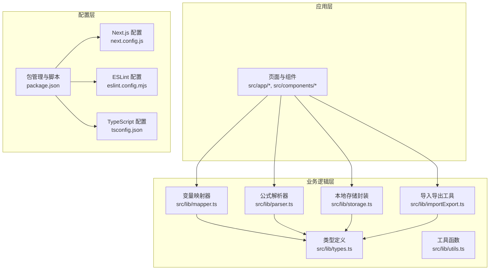
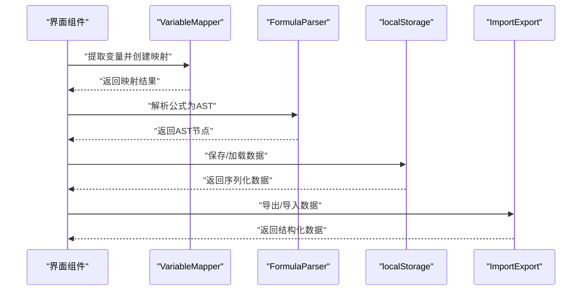
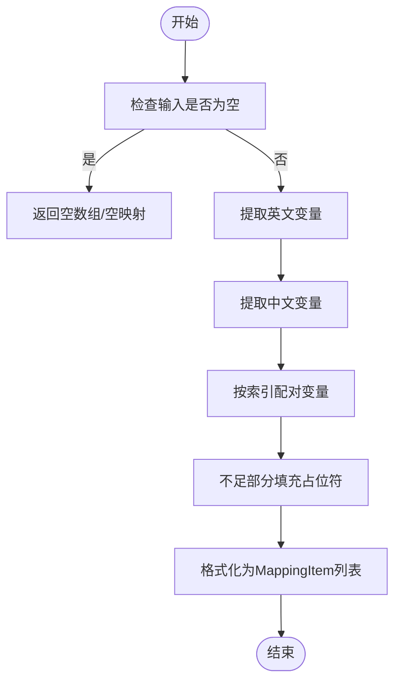
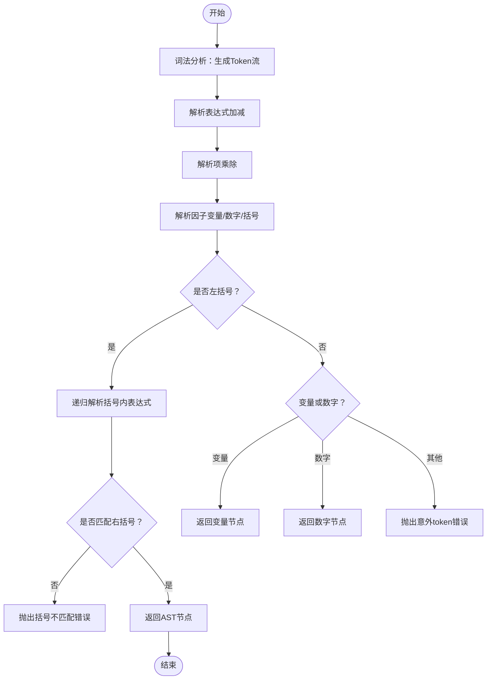
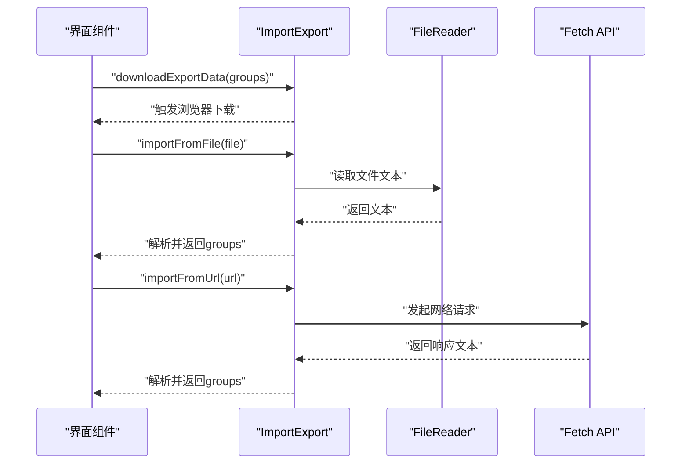
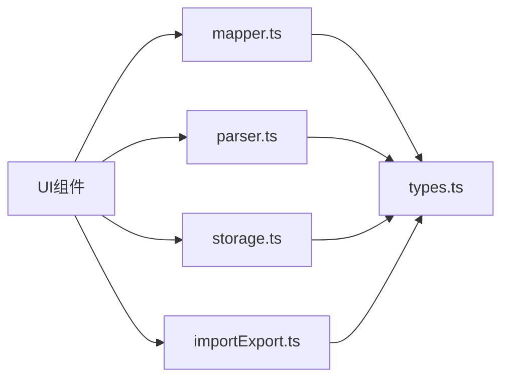

# 测试与调试

<cite>
**本文引用的文件**
- [package.json](file://package.json)
- [eslint.config.mjs](file://eslint.config.mjs)
- [tsconfig.json](file://tsconfig.json)
- [next.config.js](file://next.config.js)
- [src/lib/mapper.ts](file://src/lib/mapper.ts)
- [src/lib/parser.ts](file://src/lib/parser.ts)
- [src/lib/types.ts](file://src/lib/types.ts)
- [src/lib/storage.ts](file://src/lib/storage.ts)
- [src/lib/importExport.ts](file://src/lib/importExport.ts)
- [src/lib/utils.ts](file://src/lib/utils.ts)
</cite>

## 目录
1. [简介](#简介)
2. [项目结构](#项目结构)
3. [核心组件](#核心组件)
4. [架构总览](#架构总览)
5. [详细组件分析](#详细组件分析)
6. [依赖分析](#依赖分析)
7. [性能考虑](#性能考虑)
8. [故障排查指南](#故障排查指南)
9. [结论](#结论)
10. [附录](#附录)

## 简介
本指南面向“公式变量映射与可视化工具”的开发者，提供系统化的测试与调试方法论与实操建议。内容涵盖：
- 单元测试与组件测试策略
- 业务逻辑覆盖与用例设计
- 调试技巧与开发工具使用
- 性能分析与优化建议
- 代码质量检查与 ESLint 规则应用
- 常见问题诊断与解决方案
- 测试自动化与持续集成配置思路
- 调试工具推荐与使用技巧

## 项目结构
该项目采用 Next.js 应用结构，核心业务逻辑集中在 src/lib 下的模块化工具函数与类中，类型定义集中于 src/lib/types.ts，前端 UI 组件位于 src/components。构建与质量控制通过 package.json、tsconfig.json、next.config.js 和 eslint.config.mjs 配置。

图表来源
- [package.json:1-48](file://package.json#L1-L48)
- [tsconfig.json:1-42](file://tsconfig.json#L1-L42)
- [eslint.config.mjs:1-30](file://eslint.config.mjs#L1-L30)
- [next.config.js:1-7](file://next.config.js#L1-L7)
- [src/lib/mapper.ts:1-89](file://src/lib/mapper.ts#L1-L89)
- [src/lib/parser.ts:1-159](file://src/lib/parser.ts#L1-L159)
- [src/lib/types.ts:1-51](file://src/lib/types.ts#L1-L51)
- [src/lib/storage.ts:1-50](file://src/lib/storage.ts#L1-L50)
- [src/lib/importExport.ts:1-120](file://src/lib/importExport.ts#L1-L120)
- [src/lib/utils.ts:1-7](file://src/lib/utils.ts#L1-L7)

章节来源
- [package.json:1-48](file://package.json#L1-L48)
- [tsconfig.json:1-42](file://tsconfig.json#L1-L42)
- [eslint.config.mjs:1-30](file://eslint.config.mjs#L1-L30)
- [next.config.js:1-7](file://next.config.js#L1-L7)

## 核心组件
本项目的核心能力由以下模块构成：
- 变量映射器：提取英文字母变量与中文变量，生成双向映射并格式化输出。
- 公式解析器：将字符串公式词法分析为 Token 流，再按语法规则构建 AST。
- 类型系统：统一 Token、ASTNode、VariableMapping、Formula 等核心数据结构。
- 本地存储与导入导出：封装 localStorage 读写与 JSON 导出/导入流程。
- 工具函数：通用样式合并工具。

章节来源
- [src/lib/mapper.ts:1-89](file://src/lib/mapper.ts#L1-L89)
- [src/lib/parser.ts:1-159](file://src/lib/parser.ts#L1-L159)
- [src/lib/types.ts:1-51](file://src/lib/types.ts#L1-L51)
- [src/lib/storage.ts:1-50](file://src/lib/storage.ts#L1-L50)
- [src/lib/importExport.ts:1-120](file://src/lib/importExport.ts#L1-L120)
- [src/lib/utils.ts:1-7](file://src/lib/utils.ts#L1-L7)

## 架构总览
下图展示了从输入公式到变量映射与 AST 的关键流程，以及与存储/导入导出的交互。

图表来源
- [src/lib/mapper.ts:52-87](file://src/lib/mapper.ts#L52-L87)
- [src/lib/parser.ts:12-22](file://src/lib/parser.ts#L12-L22)
- [src/lib/storage.ts:5-25](file://src/lib/storage.ts#L5-L25)
- [src/lib/importExport.ts:12-119](file://src/lib/importExport.ts#L12-L119)

## 详细组件分析

### 变量映射器（VariableMapper）
职责与边界
- 提取英文变量：基于正则匹配，去重后返回有序列表。
- 提取中文变量：按运算符与括号分割，过滤纯数字与空串，去重后返回列表。
- 创建映射：按索引对齐英文变量与中文变量，不足时以占位符补齐。
- 格式化映射：将映射结果转换为标准化的 MappingItem 列表。

测试要点
- 输入为空/空白字符串的边界处理
- 英文变量与中文变量数量不一致的场景
- 变量重复出现的去重行为
- 映射项顺序与 hasMoreChinese 标记的正确性

图表来源
- [src/lib/mapper.ts:4-87](file://src/lib/mapper.ts#L4-L87)

章节来源
- [src/lib/mapper.ts:1-89](file://src/lib/mapper.ts#L1-L89)

### 公式解析器（FormulaParser）
职责与边界
- 词法分析：将字符串扫描为 Token 流，支持空格、运算符、变量、数字与多类括号。
- 语法分析：递归下降解析，支持加减、乘除优先级与括号嵌套。
- 错误处理：对不完整表达式、未知字符、括号不匹配、意外 token 等抛出明确错误。

测试要点
- 词法分析对空格、运算符、变量、数字的正确识别
- 括号匹配与嵌套的处理
- 表达式不完整与多余字符的错误提示
- 优先级与结合性的正确性

图表来源
- [src/lib/parser.ts:24-157](file://src/lib/parser.ts#L24-L157)

章节来源
- [src/lib/parser.ts:1-159](file://src/lib/parser.ts#L1-L159)

### 类型系统（Types）
职责与边界
- 定义 Token、ASTNode、VariableMapping、MappingItem、Formula、SubFormula、FormulaGroup 等核心类型。
- 为映射器与解析器提供统一的数据契约，保证跨模块一致性。

测试要点
- 类型字段完整性与可选字段的使用
- 映射结果与 AST 结构的字段对应关系

章节来源
- [src/lib/types.ts:1-51](file://src/lib/types.ts#L1-L51)

### 本地存储与导入导出
职责与边界
- 本地存储：封装 localStorage 的读写，包含异常捕获与降级处理。
- 导入导出：提供 JSON 导出文本、文件下载、JSON 导入校验、文件读取与 URL 获取等能力。

测试要点
- 空间检测与异常捕获
- JSON 格式校验与结构验证
- 文件读取与网络请求的错误处理
- 导入导出数据版本兼容性

图表来源
- [src/lib/importExport.ts:25-119](file://src/lib/importExport.ts#L25-L119)
- [src/lib/storage.ts:5-25](file://src/lib/storage.ts#L5-L25)

章节来源
- [src/lib/storage.ts:1-50](file://src/lib/storage.ts#L1-L50)
- [src/lib/importExport.ts:1-120](file://src/lib/importExport.ts#L1-L120)

### 工具函数（Utils）
职责与边界
- cn：基于 clsx 与 tailwind-merge 合并样式类名，避免冲突与重复。

测试要点
- 参数组合与空值处理
- 样式冲突消除效果

章节来源
- [src/lib/utils.ts:1-7](file://src/lib/utils.ts#L1-L7)

## 依赖分析
- 内聚性：各模块职责清晰，mapper/parser/types 紧密协作；storage/ie 独立负责数据持久化与交换；utils 提供轻量辅助。
- 耦合度：mapper/parser 依赖 types；storage/ie 依赖 types；UI 层通过这些模块间接耦合。
- 外部依赖：Next.js、React、KaTeX、Radix UI、Tailwind 等；开发期依赖 ESLint、TypeScript。

图表来源
- [src/lib/mapper.ts:1-89](file://src/lib/mapper.ts#L1-L89)
- [src/lib/parser.ts:1-159](file://src/lib/parser.ts#L1-L159)
- [src/lib/types.ts:1-51](file://src/lib/types.ts#L1-L51)
- [src/lib/storage.ts:1-50](file://src/lib/storage.ts#L1-L50)
- [src/lib/importExport.ts:1-120](file://src/lib/importExport.ts#L1-L120)

章节来源
- [package.json:15-46](file://package.json#L15-L46)

## 性能考虑
- 字符串扫描与正则匹配
  - 建议在大量公式场景下缓存变量提取结果，避免重复计算。
  - 对超长公式进行分段处理或异步拆分，防止主线程阻塞。
- 词法/语法分析
  - 词法分析为 O(n)，建议保持单次扫描；语法分析递归深度受表达式复杂度影响，需限制最大嵌套层级。
  - 对频繁解析的表达式，可引入 AST 缓存与增量更新策略。
- DOM 与存储
  - localStorage 写入为同步阻塞，建议批量写入与节流。
  - 导入导出大文件时，使用 Web Worker 或后台线程处理，避免 UI 卡顿。
- 渲染与样式
  - 使用 cn 合并样式时，尽量减少不必要的类名拼接；对高频组件启用 React.memo 与 useMemo。

## 故障排查指南
- 解析错误
  - 现象：抛出“表达式不完整”“括号不匹配”“意外 token”等错误。
  - 排查：确认输入字符串是否包含未识别字符；检查括号成对与嵌套；验证表达式末尾无多余字符。
  - 参考路径：[src/lib/parser.ts:17-157](file://src/lib/parser.ts#L17-L157)
- 变量映射异常
  - 现象：映射项顺序错乱、重复变量未去重、中文变量缺失。
  - 排查：核对英文/中文变量提取逻辑；检查索引配对与占位符填充。
  - 参考路径：[src/lib/mapper.ts:4-87](file://src/lib/mapper.ts#L4-L87)
- 导入导出失败
  - 现象：JSON 格式错误、文件读取失败、网络请求异常。
  - 排查：验证导出数据结构与版本；检查文件编码与网络可达性；捕获并记录具体错误信息。
  - 参考路径：[src/lib/importExport.ts:43-119](file://src/lib/importExport.ts#L43-L119)
- 存储异常
  - 现象：localStorage 读写失败、浏览器禁用本地存储。
  - 排查：检测运行环境与异常捕获；提供降级方案（内存缓存）。
  - 参考路径：[src/lib/storage.ts:5-25](file://src/lib/storage.ts#L5-L25)

章节来源
- [src/lib/parser.ts:12-22](file://src/lib/parser.ts#L12-L22)
- [src/lib/mapper.ts:52-87](file://src/lib/mapper.ts#L52-L87)
- [src/lib/importExport.ts:43-119](file://src/lib/importExport.ts#L43-L119)
- [src/lib/storage.ts:5-25](file://src/lib/storage.ts#L5-L25)

## 结论
本项目以清晰的模块划分与严格的类型约束为基础，具备良好的可测试性与可维护性。建议在现有基础上补充单元测试与组件测试，完善业务逻辑覆盖与边界条件处理；同时结合 ESLint 与 TypeScript 的静态检查，提升代码质量；在性能敏感场景引入缓存与异步处理策略，保障用户体验。

## 附录

### 单元测试与组件测试策略
- 单元测试
  - 针对 mapper.ts 的变量提取与映射函数，覆盖空输入、重复变量、数量不一致等场景。
  - 针对 parser.ts 的 parse/tokenize 函数，覆盖合法表达式、括号不匹配、未知字符、表达式不完整等。
  - 针对 storage.ts 与 importExport.ts，覆盖异常捕获、数据结构校验、文件读取与网络请求错误。
- 组件测试
  - 在 UI 层对 FormulaRenderer、FormulaList、GroupSelector 等组件进行快照与交互测试，验证渲染与用户操作。
  - 使用测试工具如 Testing Library 或 React Testing Library，模拟事件与状态变更。
- 测试工具与脚本
  - 使用 npm scripts 中的 lint 脚本进行代码规范检查；结合 Jest/Playwright 进行端到端测试。

章节来源
- [package.json:5-10](file://package.json#L5-L10)
- [eslint.config.mjs:15-29](file://eslint.config.mjs#L15-L29)

### 业务逻辑覆盖与测试用例设计
- 变量映射
  - 用例：空字符串、仅英文变量、仅中文变量、混合变量、重复变量、数字与变量混排。
- 公式解析
  - 用例：简单表达式、带括号表达式、嵌套括号、运算符优先级、非法字符、表达式不完整。
- 数据持久化与交换
  - 用例：正常读写、异常捕获、JSON 格式错误、文件读取失败、网络请求失败。

章节来源
- [src/lib/mapper.ts:4-87](file://src/lib/mapper.ts#L4-L87)
- [src/lib/parser.ts:24-157](file://src/lib/parser.ts#L24-L157)
- [src/lib/storage.ts:5-25](file://src/lib/storage.ts#L5-L25)
- [src/lib/importExport.ts:43-119](file://src/lib/importExport.ts#L43-L119)

### 调试技巧与开发工具
- 浏览器调试
  - 使用 DevTools 断点与日志定位问题；对解析器与映射器的关键分支设置断点。
- 日志与错误
  - 在 storage 与 importExport 中保留结构化错误信息，便于定位问题来源。
- 性能分析
  - 使用 Performance 面板观察主线程阻塞；对长耗时操作使用 Web Workers。
- VS Code 配置
  - 启用 TypeScript 检查与 ESLint 插件；配置断点与测试任务。

章节来源
- [src/lib/storage.ts:11-24](file://src/lib/storage.ts#L11-L24)
- [src/lib/importExport.ts:69-119](file://src/lib/importExport.ts#L69-L119)

### 代码质量检查与 ESLint 规则
- 规则要点
  - 未使用变量警告：忽略以特定前缀命名的参数与变量，减少噪音。
  - Next.js 最佳实践：遵循 next/core-web-vitals 推荐配置。
- 执行方式
  - 通过 npm script 执行 lint；在 CI 中加入 lint 步骤，确保提交质量。

章节来源
- [eslint.config.mjs:15-29](file://eslint.config.mjs#L15-L29)
- [package.json](file://package.json#L9)

### 测试自动化与持续集成
- 建议步骤
  - 在 CI 中执行：安装依赖、类型检查、ESLint、单元测试、端到端测试。
  - 将测试覆盖率纳入质量门禁；对关键模块设置最小覆盖率阈值。
  - 对导入导出与存储模块增加集成测试，验证端到端流程。

章节来源
- [package.json:5-10](file://package.json#L5-L10)
- [tsconfig.json:1-42](file://tsconfig.json#L1-L42)

### 调试工具推荐与使用技巧
- 浏览器 DevTools
  - 断点调试、网络面板检查导入导出请求、性能面板分析卡顿。
- VS Code
  - 配置测试任务与调试配置；启用 ESLint 与 TypeScript 检查。
- 第三方工具
  - 使用 React DevTools 分析组件渲染；使用 Lighthouse 检测性能与可访问性。

章节来源
- [package.json:15-46](file://package.json#L15-L46)
- [next.config.js:1-7](file://next.config.js#L1-L7)