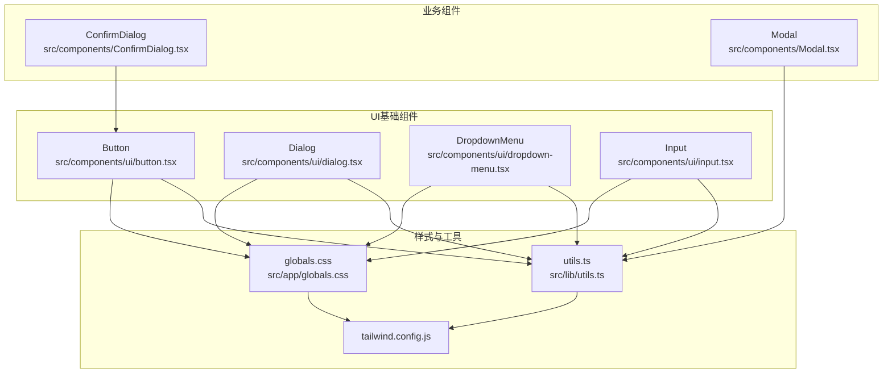
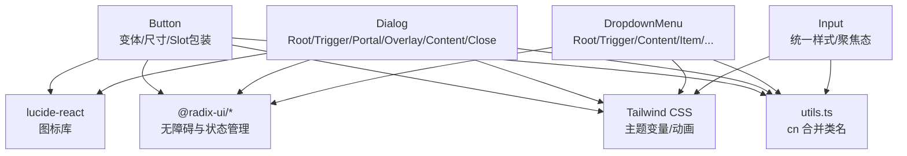
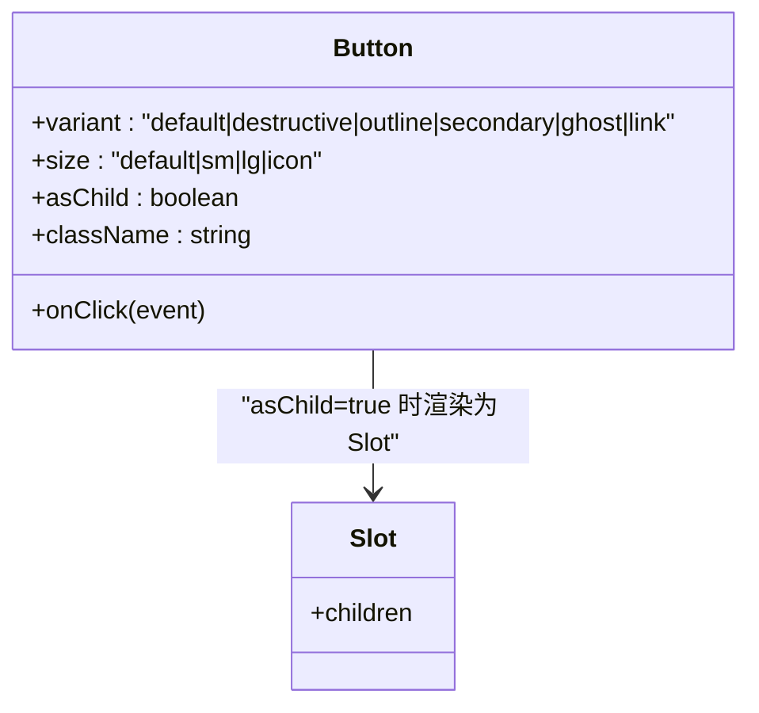
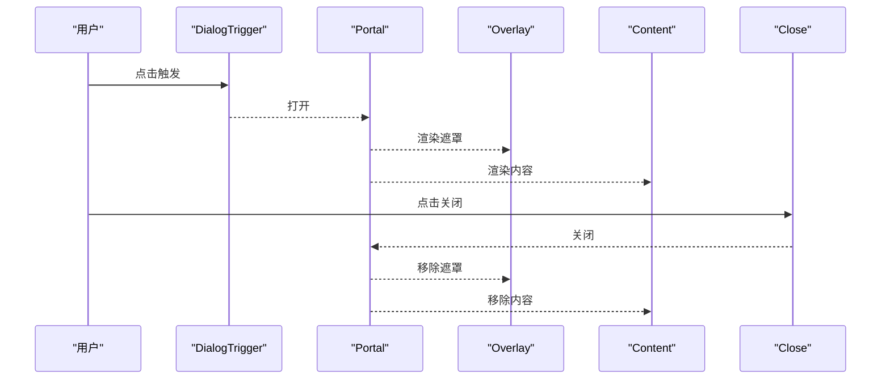
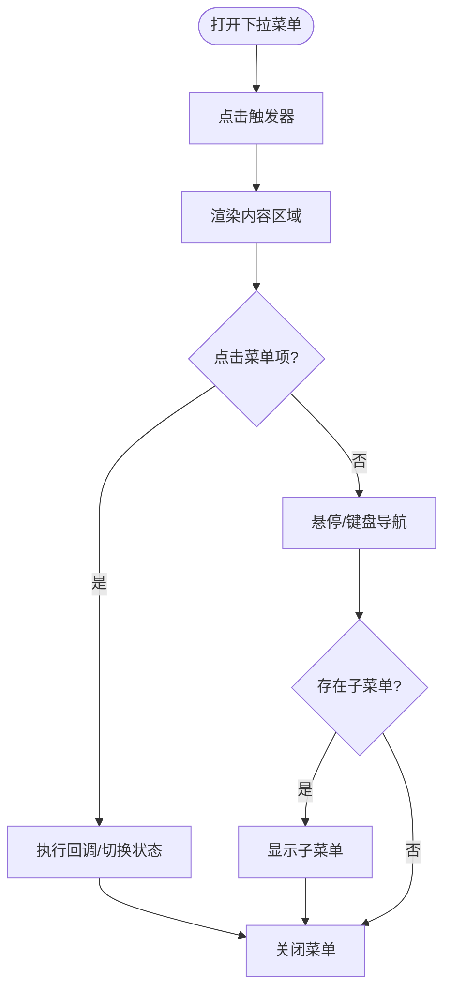
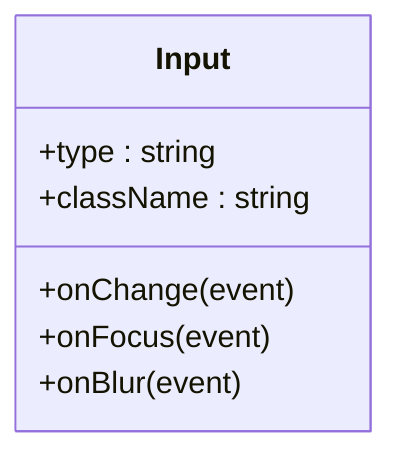
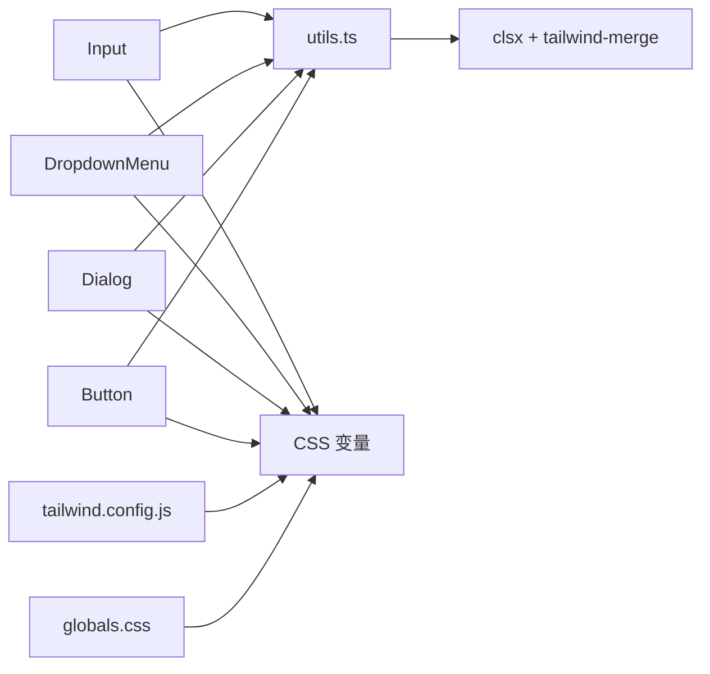

# UI基础组件

<cite>
**本文档引用的文件**
- [button.tsx](file://src/components/ui/button.tsx)
- [dialog.tsx](file://src/components/ui/dialog.tsx)
- [dropdown-menu.tsx](file://src/components/ui/dropdown-menu.tsx)
- [input.tsx](file://src/components/ui/input.tsx)
- [ConfirmDialog.tsx](file://src/components/ConfirmDialog.tsx)
- [Modal.tsx](file://src/components/Modal.tsx)
- [page.tsx](file://src/app/page.tsx)
- [utils.ts](file://src/lib/utils.ts)
- [globals.css](file://src/app/globals.css)
- [tailwind.config.js](file://tailwind.config.js)
- [package.json](file://package.json)
</cite>

## 目录
1. [简介](#简介)
2. [项目结构](#项目结构)
3. [核心组件](#核心组件)
4. [架构总览](#架构总览)
5. [详细组件分析](#详细组件分析)
6. [依赖关系分析](#依赖关系分析)
7. [性能考虑](#性能考虑)
8. [故障排查指南](#故障排查指南)
9. [结论](#结论)
10. [附录](#附录)

## 简介
本文件面向“公式变量映射与可视化工具”的前端UI基础组件，系统化梳理并解释Button、Dialog、DropdownMenu、Input等基础组件的设计原则、实现方式与使用规范。文档重点涵盖：
- 组件属性接口与事件处理机制
- 样式定制与主题适配
- 可访问性与无障碍支持
- 组件组合模式与最佳实践
- 响应式设计与移动端适配
- 性能优化与渲染技巧
- 实际项目中的使用示例与代码片段路径

## 项目结构
UI基础组件位于 src/components/ui 目录，采用按功能模块化的组织方式，结合 Tailwind CSS 与 Radix UI 提供一致的视觉与交互体验。

**图表来源**
- [button.tsx:1-58](file://src/components/ui/button.tsx#L1-L58)
- [dialog.tsx:1-123](file://src/components/ui/dialog.tsx#L1-L123)
- [dropdown-menu.tsx:1-202](file://src/components/ui/dropdown-menu.tsx#L1-L202)
- [input.tsx:1-26](file://src/components/ui/input.tsx#L1-L26)
- [ConfirmDialog.tsx:1-54](file://src/components/ConfirmDialog.tsx#L1-L54)
- [Modal.tsx:1-23](file://src/components/Modal.tsx#L1-L23)
- [utils.ts:1-7](file://src/lib/utils.ts#L1-L7)
- [globals.css:1-60](file://src/app/globals.css#L1-L60)
- [tailwind.config.js:1-76](file://tailwind.config.js#L1-L76)

**章节来源**
- [button.tsx:1-58](file://src/components/ui/button.tsx#L1-L58)
- [dialog.tsx:1-123](file://src/components/ui/dialog.tsx#L1-L123)
- [dropdown-menu.tsx:1-202](file://src/components/ui/dropdown-menu.tsx#L1-L202)
- [input.tsx:1-26](file://src/components/ui/input.tsx#L1-L26)
- [utils.ts:1-7](file://src/lib/utils.ts#L1-L7)
- [globals.css:1-60](file://src/app/globals.css#L1-L60)
- [tailwind.config.js:1-76](file://tailwind.config.js#L1-L76)

## 核心组件
本节对四个基础组件进行深入解析，包括接口定义、变体与尺寸、事件处理、可访问性与样式定制。

- Button
  - 设计要点：基于 class-variance-authority 的变体系统，支持 variant（default、destructive、outline、secondary、ghost、link）与 size（default、sm、lg、icon），通过 asChild 支持语义化标签包裹。
  - 属性接口：继承 HTMLButtonElement 属性，新增 variant、size、asChild；支持 ref 传递。
  - 事件处理：透传 onClick 等原生事件；聚焦态通过 focus-visible ring 实现。
  - 样式定制：通过 className 合并与 Tailwind 类覆盖；主题色来自 CSS 变量。
  - 可访问性：默认支持键盘焦点与屏幕阅读器识别；图标元素禁用指针事件以避免重复触发。
  - 使用示例：参见 [ConfirmDialog.tsx:40-48](file://src/components/ConfirmDialog.tsx#L40-L48) 中的 Button 组合。

- Dialog
  - 设计要点：基于 @radix-ui/react-dialog，提供 Root、Trigger、Portal、Overlay、Content、Close、Header/Footer/Title/Description 等子组件，内置动画与居中布局。
  - 属性接口：Overlay/Content/Title/Description 等均支持 className 与原生属性透传。
  - 事件处理：通过 Close 触发关闭；Portal 确保在 DOM 树外层渲染，避免层级问题。
  - 可访问性：Overlay 与 Close 包含 sr-only 文本；支持 ESC 关闭；焦点管理由 Radix 管理。
  - 使用示例：参见 [page.tsx:591-629](file://src/app/page.tsx#L591-L629) 中的分组创建对话框与 [page.tsx:631-737](file://src/app/page.tsx#L631-L737) 中的公式创建/编辑对话框。

- DropdownMenu
  - 设计要点：支持触发器、子菜单、复选/单选项、分隔符与快捷键文本；通过 Portal 渲染，避免溢出裁剪。
  - 属性接口：SubTrigger/SubContent 支持 inset；Item 支持 inset 与禁用状态；RadioGroup/RadioItem 支持单选。
  - 事件处理：内部通过原生事件冒泡与 Radix 状态控制开合。
  - 可访问性：支持键盘导航、焦点环与状态指示器。
  - 使用示例：参见 [page.tsx:477-525](file://src/app/page.tsx#L477-L525) 中的数据管理下拉菜单。

- Input
  - 设计要点：轻量输入框封装，统一边框、圆角、占位符颜色与聚焦态 ring。
  - 属性接口：继承 HTMLInputElement 属性，支持 type、className、ref。
  - 样式定制：通过 className 覆盖默认样式；移动端适配使用 md:text-sm。
  - 使用示例：参见 [page.tsx:600-608](file://src/app/page.tsx#L600-L608)、[page.tsx:660-666](file://src/app/page.tsx#L660-L666)、[page.tsx:680-686](file://src/app/page.tsx#L680-L686)、[page.tsx:750-756](file://src/app/page.tsx#L750-L756) 中的输入框使用。

**章节来源**
- [button.tsx:37-57](file://src/components/ui/button.tsx#L37-L57)
- [dialog.tsx:9-122](file://src/components/ui/dialog.tsx#L9-L122)
- [dropdown-menu.tsx:9-201](file://src/components/ui/dropdown-menu.tsx#L9-L201)
- [input.tsx:5-25](file://src/components/ui/input.tsx#L5-L25)
- [ConfirmDialog.tsx:40-48](file://src/components/ConfirmDialog.tsx#L40-L48)
- [page.tsx:477-525](file://src/app/page.tsx#L477-L525)
- [page.tsx:591-629](file://src/app/page.tsx#L591-L629)
- [page.tsx:631-737](file://src/app/page.tsx#L631-L737)
- [page.tsx:600-608](file://src/app/page.tsx#L600-L608)
- [page.tsx:660-666](file://src/app/page.tsx#L660-L666)
- [page.tsx:680-686](file://src/app/page.tsx#L680-L686)
- [page.tsx:750-756](file://src/app/page.tsx#L750-L756)

## 架构总览
下图展示 UI 基础组件与其依赖关系、样式系统与可访问性策略：

**图表来源**
- [button.tsx:1-58](file://src/components/ui/button.tsx#L1-L58)
- [dialog.tsx:1-123](file://src/components/ui/dialog.tsx#L1-L123)
- [dropdown-menu.tsx:1-202](file://src/components/ui/dropdown-menu.tsx#L1-L202)
- [input.tsx:1-26](file://src/components/ui/input.tsx#L1-L26)
- [utils.ts:1-7](file://src/lib/utils.ts#L1-L7)
- [globals.css:1-60](file://src/app/globals.css#L1-L60)
- [tailwind.config.js:1-76](file://tailwind.config.js#L1-L76)
- [package.json:15-34](file://package.json#L15-L34)

## 详细组件分析

### Button 组件
- 设计原则
  - 变体与尺寸：通过 cva 定义多套风格与尺寸，满足不同场景的视觉与交互需求。
  - 语义化与可组合：支持 asChild 将 Button 渲染为任意元素（如 Link），提升语义表达。
  - 焦点与反馈：统一的 focus-visible ring 与 hover 状态，保证可访问性与一致性。
- 接口与事件
  - 属性：继承原生 Button 属性，新增 variant、size、asChild；className 支持覆盖。
  - 事件：透传 onClick 等事件；内部不强制绑定行为，保持最小封装。
- 样式定制
  - 主题：依赖 CSS 变量（--primary、--background 等）与 Tailwind 配置。
  - 覆盖：通过 className 合并实现局部覆盖；不建议直接修改源码。
- 可访问性
  - 键盘可达：默认支持 Tab 聚焦与 Enter/Space 触发。
  - 屏幕阅读器：语义化标签优先；图标元素禁用指针事件避免重复读取。
- 使用示例
  - 危险操作按钮：参见 [ConfirmDialog.tsx:43-48](file://src/components/ConfirmDialog.tsx#L43-L48)。
  - 普通按钮：参见 [page.tsx:566-576](file://src/app/page.tsx#L566-L576)。

**图表来源**
- [button.tsx:37-57](file://src/components/ui/button.tsx#L37-L57)

**章节来源**
- [button.tsx:7-57](file://src/components/ui/button.tsx#L7-L57)
- [ConfirmDialog.tsx:40-48](file://src/components/ConfirmDialog.tsx#L40-L48)
- [page.tsx:566-576](file://src/app/page.tsx#L566-L576)

### Dialog 组件
- 设计原则
  - 结构化：提供 Overlay、Content、Close、Header/Footer、Title/Description 等子组件，便于布局与语义化。
  - 动画与定位：内置淡入淡出、缩放与滑入滑出动画；居中定位，支持响应式容器。
  - 可访问性：Close 按钮包含 sr-only 文本；支持 ESC 关闭；焦点管理由 Radix 控制。
- 接口与事件
  - 属性：Overlay/Content/Title/Description 支持 className 与原生属性透传。
  - 事件：通过 Close 触发；Overlay 点击可作为外部点击关闭策略。
- 样式定制
  - 主题：依赖 CSS 变量与 Tailwind 类；Content 默认最大宽度与圆角。
  - 覆盖：通过 className 覆盖默认样式；注意保持动画类以维持动效。
- 使用示例
  - 分组创建对话框：参见 [page.tsx:591-629](file://src/app/page.tsx#L591-L629)。
  - 公式创建/编辑对话框：参见 [page.tsx:631-737](file://src/app/page.tsx#L631-L737)。

**图表来源**
- [dialog.tsx:9-54](file://src/components/ui/dialog.tsx#L9-L54)
- [page.tsx:591-629](file://src/app/page.tsx#L591-L629)
- [page.tsx:631-737](file://src/app/page.tsx#L631-L737)

**章节来源**
- [dialog.tsx:9-122](file://src/components/ui/dialog.tsx#L9-L122)
- [page.tsx:591-629](file://src/app/page.tsx#L591-L629)
- [page.tsx:631-737](file://src/app/page.tsx#L631-L737)

### DropdownMenu 组件
- 设计原则
  - 层级化：支持主菜单、子菜单、分组与单选/复选项，适合复杂设置面板。
  - 可访问性：键盘导航、焦点环、状态指示器与快捷键文本。
  - 性能：通过 Portal 渲染，避免父容器溢出与层级问题。
- 接口与事件
  - 属性：SubTrigger/SubContent 支持 inset；Item 支持禁用与 inset；RadioGroup/RadioItem 支持单选。
  - 事件：内部通过原生事件与 Radix 状态控制开合。
- 样式定制
  - 主题：依赖 CSS 变量与 Tailwind 类；支持侧向动画。
  - 覆盖：通过 className 覆盖默认样式；注意保持动画类。
- 使用示例
  - 数据管理下拉菜单：参见 [page.tsx:477-525](file://src/app/page.tsx#L477-L525)。

**图表来源**
- [dropdown-menu.tsx:9-201](file://src/components/ui/dropdown-menu.tsx#L9-L201)
- [page.tsx:477-525](file://src/app/page.tsx#L477-L525)

**章节来源**
- [dropdown-menu.tsx:9-201](file://src/components/ui/dropdown-menu.tsx#L9-L201)
- [page.tsx:477-525](file://src/app/page.tsx#L477-L525)

### Input 组件
- 设计原则
  - 统一性：统一边框、圆角、占位符颜色与聚焦态 ring。
  - 移动端：使用 md:text-sm 适配移动端字体大小。
  - 可访问性：支持原生键盘输入与屏幕阅读器识别。
- 接口与事件
  - 属性：继承原生 Input 属性，支持 type、className、ref。
  - 事件：透传 onChange/onFocus/onBlur 等事件。
- 样式定制
  - 主题：依赖 CSS 变量与 Tailwind 类。
  - 覆盖：通过 className 覆盖默认样式；注意保持 focus-visible ring。
- 使用示例
  - 分组名称输入：参见 [page.tsx:600-608](file://src/app/page.tsx#L600-L608)。
  - 英文/中文公式输入：参见 [page.tsx:660-666](file://src/app/page.tsx#L660-L666)、[page.tsx:680-686](file://src/app/page.tsx#L680-L686)。
  - URL 导入输入：参见 [page.tsx:750-756](file://src/app/page.tsx#L750-L756)。

**图表来源**
- [input.tsx:5-25](file://src/components/ui/input.tsx#L5-L25)

**章节来源**
- [input.tsx:5-25](file://src/components/ui/input.tsx#L5-L25)
- [page.tsx:600-608](file://src/app/page.tsx#L600-L608)
- [page.tsx:660-666](file://src/app/page.tsx#L660-L666)
- [page.tsx:680-686](file://src/app/page.tsx#L680-L686)
- [page.tsx:750-756](file://src/app/page.tsx#L750-L756)

### 组件组合与最佳实践
- Button + Dialog
  - 在 Dialog.Header 中放置标题，在 Dialog.Footer 中放置 Button 按钮组，实现标准确认/取消流程。
  - 示例参考：[page.tsx:631-737](file://src/app/page.tsx#L631-L737)。
- Button + DropdownMenu
  - 使用 DropdownMenuTrigger 作为按钮触发器，实现下拉菜单，适合设置面板与操作入口。
  - 示例参考：[page.tsx:477-525](file://src/app/page.tsx#L477-L525)。
- Input + Button
  - 在表单中配合使用，实现输入与提交的一致性样式与交互。
  - 示例参考：[page.tsx:600-608](file://src/app/page.tsx#L600-L608)、[page.tsx:750-756](file://src/app/page.tsx#L750-L756)。
- ConfirmDialog 与 Modal
  - ConfirmDialog 基于 Button 变体实现危险操作确认；Modal 提供通用模态容器。
  - 示例参考：[ConfirmDialog.tsx:1-54](file://src/components/ConfirmDialog.tsx#L1-L54)、[Modal.tsx:1-23](file://src/components/Modal.tsx#L1-L23)。

**章节来源**
- [ConfirmDialog.tsx:1-54](file://src/components/ConfirmDialog.tsx#L1-L54)
- [Modal.tsx:1-23](file://src/components/Modal.tsx#L1-L23)
- [page.tsx:477-525](file://src/app/page.tsx#L477-L525)
- [page.tsx:631-737](file://src/app/page.tsx#L631-L737)
- [page.tsx:600-608](file://src/app/page.tsx#L600-L608)
- [page.tsx:750-756](file://src/app/page.tsx#L750-L756)

## 依赖关系分析
- 样式与工具
  - utils.ts 提供 cn 函数，基于 clsx 与 tailwind-merge 合并类名，避免冲突。
  - globals.css 定义 CSS 变量与基础层，提供主题色与全局样式。
  - tailwind.config.js 扩展颜色、圆角与动画，支持暗色模式。
- 外部依赖
  - @radix-ui/* 提供无障碍与状态管理（Dialog、DropdownMenu）。
  - lucide-react 提供图标。
  - class-variance-authority/cva 提供变体系统。

**图表来源**
- [utils.ts:1-7](file://src/lib/utils.ts#L1-L7)
- [globals.css:1-60](file://src/app/globals.css#L1-L60)
- [tailwind.config.js:1-76](file://tailwind.config.js#L1-L76)
- [button.tsx:1-58](file://src/components/ui/button.tsx#L1-L58)
- [dialog.tsx:1-123](file://src/components/ui/dialog.tsx#L1-L123)
- [dropdown-menu.tsx:1-202](file://src/components/ui/dropdown-menu.tsx#L1-L202)
- [input.tsx:1-26](file://src/components/ui/input.tsx#L1-L26)

**章节来源**
- [utils.ts:1-7](file://src/lib/utils.ts#L1-L7)
- [globals.css:1-60](file://src/app/globals.css#L1-L60)
- [tailwind.config.js:1-76](file://tailwind.config.js#L1-L76)
- [package.json:15-34](file://package.json#L15-L34)

## 性能考虑
- 类名合并
  - 使用 utils.ts 的 cn 函数合并类名，避免重复与冲突，减少不必要的样式计算。
- 动画与渲染
  - Dialog/DropdownMenu 内置动画类，建议保留以维持流畅体验；避免在高频场景中频繁切换大型动画。
- 事件处理
  - Button/DropdownMenu 仅透传事件，避免在组件内部绑定复杂逻辑；将业务逻辑放在上层容器。
- 按需渲染
  - Dialog/DropdownMenu 通过 Portal 渲染，减少 DOM 层级；确认/取消对话框建议在需要时再渲染，避免常驻内存。
- 主题与样式
  - 通过 CSS 变量与 Tailwind 扩展，减少运行时样式计算；避免在组件内部动态生成大量样式字符串。

[本节为通用性能指导，无需特定文件引用]

## 故障排查指南
- 无法聚焦或键盘不可用
  - 检查是否正确使用 Button/DropdownMenu 的触发器；确认未禁用 pointer-events。
  - 参考：[button.tsx:44-53](file://src/components/ui/button.tsx#L44-L53)、[dropdown-menu.tsx:11-19](file://src/components/ui/dropdown-menu.tsx#L11-L19)。
- 对话框无法关闭或遮罩无效
  - 确认 DialogTrigger/Portal/Overlay/Close 的正确嵌套；检查外部点击关闭逻辑。
  - 参考：[dialog.tsx:9-54](file://src/components/ui/dialog.tsx#L9-L54)、[page.tsx:591-629](file://src/app/page.tsx#L591-L629)。
- 下拉菜单位置异常或被裁剪
  - 确认使用 Portal 渲染；检查父容器 overflow 与 z-index。
  - 参考：[dropdown-menu.tsx:63-75](file://src/components/ui/dropdown-menu.tsx#L63-L75)。
- 输入框样式错乱
  - 检查 className 是否覆盖了 focus-visible ring 或禁用状态样式。
  - 参考：[input.tsx:13-16](file://src/components/ui/input.tsx#L13-L16)、[page.tsx:600-608](file://src/app/page.tsx#L600-L608)。

**章节来源**
- [button.tsx:44-53](file://src/components/ui/button.tsx#L44-L53)
- [dialog.tsx:9-54](file://src/components/ui/dialog.tsx#L9-L54)
- [dropdown-menu.tsx:63-75](file://src/components/ui/dropdown-menu.tsx#L63-L75)
- [input.tsx:13-16](file://src/components/ui/input.tsx#L13-L16)
- [page.tsx:591-629](file://src/app/page.tsx#L591-L629)
- [page.tsx:600-608](file://src/app/page.tsx#L600-L608)

## 结论
本项目的 UI 基础组件以 Radix UI 为核心，结合 Tailwind CSS 与自定义工具函数，提供了高可访问性、可定制与可组合的组件体系。Button、Dialog、DropdownMenu、Input 在项目中承担了主要的交互与信息承载职责，配合 ConfirmDialog、Modal 等业务组件，形成了清晰的组件层次与使用范式。遵循本文档的接口约定、样式覆盖与可访问性建议，可帮助开发者高效、安全地扩展与维护 UI 组件。

[本节为总结性内容，无需特定文件引用]

## 附录
- 主题定制与样式覆盖
  - CSS 变量：通过 :root 与 .dark 定义主题色；参见 [globals.css:6-49](file://src/app/globals.css#L6-L49)。
  - Tailwind 扩展：在 tailwind.config.js 中扩展颜色、圆角与动画；参见 [tailwind.config.js:17-72](file://tailwind.config.js#L17-L72)。
  - 类名合并：使用 utils.ts 的 cn 函数；参见 [utils.ts:4-6](file://src/lib/utils.ts#L4-L6)。
- 响应式设计与移动端适配
  - 移动端字体：Input 使用 md:text-sm；参见 [input.tsx](file://src/components/ui/input.tsx#L14)。
  - 容器与断点：Tailwind 容器与 2xl 断点；参见 [tailwind.config.js:10-16](file://tailwind.config.js#L10-L16)。
- 组件使用示例路径
  - Button：参见 [ConfirmDialog.tsx:40-48](file://src/components/ConfirmDialog.tsx#L40-L48)、[page.tsx:566-576](file://src/app/page.tsx#L566-L576)。
  - Dialog：参见 [page.tsx:591-629](file://src/app/page.tsx#L591-L629)、[page.tsx:631-737](file://src/app/page.tsx#L631-L737)。
  - DropdownMenu：参见 [page.tsx:477-525](file://src/app/page.tsx#L477-L525)。
  - Input：参见 [page.tsx:600-608](file://src/app/page.tsx#L600-L608)、[page.tsx:660-666](file://src/app/page.tsx#L660-L666)、[page.tsx:680-686](file://src/app/page.tsx#L680-L686)、[page.tsx:750-756](file://src/app/page.tsx#L750-L756)。

**章节来源**
- [globals.css:6-49](file://src/app/globals.css#L6-L49)
- [tailwind.config.js:10-16](file://tailwind.config.js#L10-L16)
- [utils.ts:4-6](file://src/lib/utils.ts#L4-L6)
- [ConfirmDialog.tsx:40-48](file://src/components/ConfirmDialog.tsx#L40-L48)
- [page.tsx:566-576](file://src/app/page.tsx#L566-L576)
- [page.tsx:591-629](file://src/app/page.tsx#L591-L629)
- [page.tsx:631-737](file://src/app/page.tsx#L631-L737)
- [page.tsx:477-525](file://src/app/page.tsx#L477-L525)
- [page.tsx:600-608](file://src/app/page.tsx#L600-L608)
- [page.tsx:660-666](file://src/app/page.tsx#L660-L666)
- [page.tsx:680-686](file://src/app/page.tsx#L680-L686)
- [page.tsx:750-756](file://src/app/page.tsx#L750-L756)