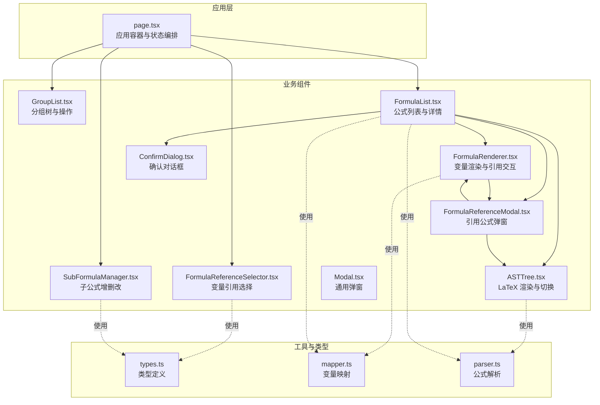
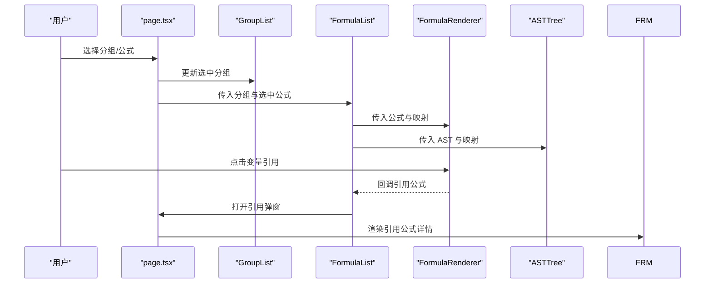
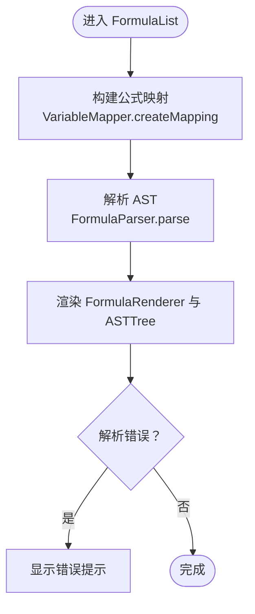
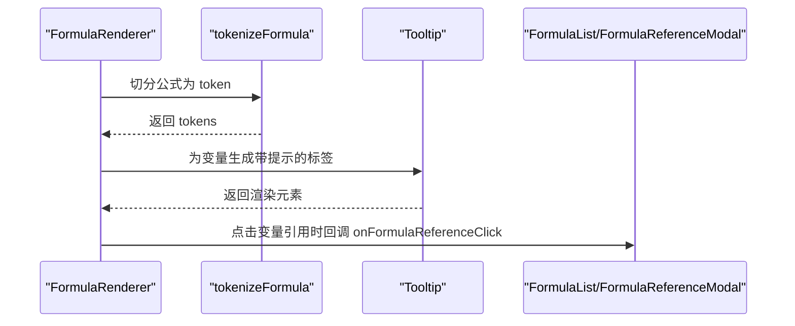
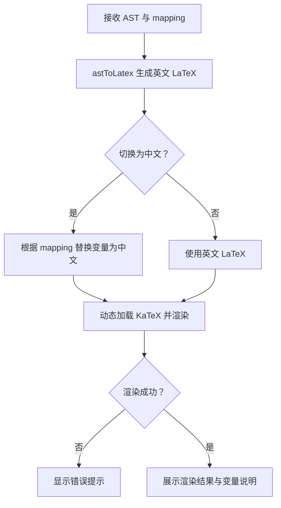
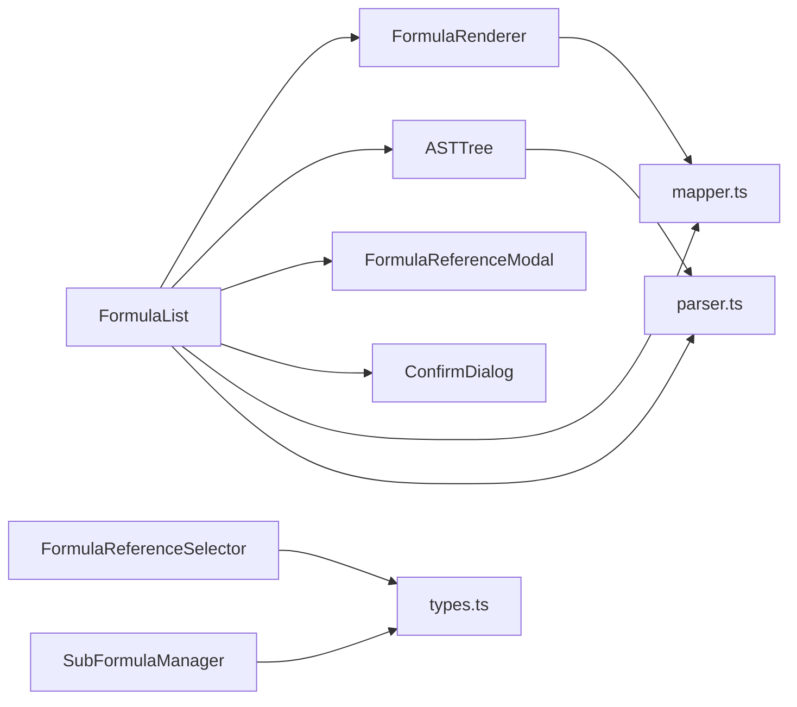

# 业务组件

<cite>
**本文档引用的文件**
- [src/app/page.tsx](file://src/app/page.tsx)
- [src/components/FormulaList.tsx](file://src/components/FormulaList.tsx)
- [src/components/FormulaRenderer.tsx](file://src/components/FormulaRenderer.tsx)
- [src/components/ASTTree.tsx](file://src/components/ASTTree.tsx)
- [src/components/GroupList.tsx](file://src/components/GroupList.tsx)
- [src/components/SubFormulaManager.tsx](file://src/components/SubFormulaManager.tsx)
- [src/components/FormulaReferenceModal.tsx](file://src/components/FormulaReferenceModal.tsx)
- [src/components/FormulaReferenceSelector.tsx](file://src/components/FormulaReferenceSelector.tsx)
- [src/components/ConfirmDialog.tsx](file://src/components/ConfirmDialog.tsx)
- [src/components/Modal.tsx](file://src/components/Modal.tsx)
- [src/lib/types.ts](file://src/lib/types.ts)
- [src/lib/mapper.ts](file://src/lib/mapper.ts)
- [src/lib/parser.ts](file://src/lib/parser.ts)
- [package.json](file://package.json)
</cite>

## 目录
1. [简介](#简介)
2. [项目结构](#项目结构)
3. [核心组件](#核心组件)
4. [架构总览](#架构总览)
5. [详细组件分析](#详细组件分析)
6. [依赖关系分析](#依赖关系分析)
7. [性能考虑](#性能考虑)
8. [故障排查指南](#故障排查指南)
9. [结论](#结论)
10. [附录](#附录)

## 简介
本项目是一个“公式变量映射与可视化工具”，围绕公式分组、公式列表、变量映射、公式渲染、抽象语法树（AST）可视化以及子公式管理等能力构建。系统通过一组高内聚、低耦合的业务组件协作，完成从数据输入、解析、映射、渲染到可视化的完整流程。

## 项目结构
- 应用入口位于页面组件，负责状态管理、URL 同步、数据持久化与对话框编排。
- 业务组件位于 components 目录，分别承担分组管理、公式列表、公式渲染、AST 可视化、子公式管理、引用选择与弹窗等职责。
- 核心算法与数据模型位于 lib 目录，包括变量映射器、公式解析器与类型定义。

图表来源
- [src/app/page.tsx:14-798](file://src/app/page.tsx#L14-L798)
- [src/components/GroupList.tsx:16-294](file://src/components/GroupList.tsx#L16-L294)
- [src/components/FormulaList.tsx:21-387](file://src/components/FormulaList.tsx#L21-L387)
- [src/components/FormulaRenderer.tsx:27-169](file://src/components/FormulaRenderer.tsx#L27-L169)
- [src/components/ASTTree.tsx:11-179](file://src/components/ASTTree.tsx#L11-L179)
- [src/components/SubFormulaManager.tsx:12-201](file://src/components/SubFormulaManager.tsx#L12-L201)
- [src/components/FormulaReferenceSelector.tsx:14-132](file://src/components/FormulaReferenceSelector.tsx#L14-L132)
- [src/components/FormulaReferenceModal.tsx:18-180](file://src/components/FormulaReferenceModal.tsx#L18-L180)
- [src/components/ConfirmDialog.tsx:16-54](file://src/components/ConfirmDialog.tsx#L16-L54)
- [src/components/Modal.tsx:10-23](file://src/components/Modal.tsx#L10-L23)
- [src/lib/types.ts:27-51](file://src/lib/types.ts#L27-L51)
- [src/lib/mapper.ts:3-89](file://src/lib/mapper.ts#L3-L89)
- [src/lib/parser.ts:3-159](file://src/lib/parser.ts#L3-L159)

章节来源
- [src/app/page.tsx:14-798](file://src/app/page.tsx#L14-L798)
- [src/lib/types.ts:1-51](file://src/lib/types.ts#L1-L51)

## 核心组件
- FormulaList：负责分组筛选、公式搜索、公式项展开/折叠、变量映射与 AST 渲染、引用弹窗与删除确认。
- FormulaRenderer：对公式进行词法切分，为变量分配颜色，支持引用跳转与提示。
- ASTTree：将 AST 节点转换为 LaTeX 字符串并动态渲染，支持中英文切换与变量说明。
- GroupList：维护分组树，支持新增、编辑、删除、展开/折叠与自动展开选中分组。
- SubFormulaManager：管理子公式集合，支持增删改与表单校验。
- FormulaReferenceSelector：基于变量提取，提供子公式与外部公式的引用选择。
- FormulaReferenceModal：展示引用公式的映射、渲染与 AST，支持嵌套引用弹窗。
- ConfirmDialog/Modal：通用确认与弹窗组件，供各业务组件复用。

章节来源
- [src/components/FormulaList.tsx:21-387](file://src/components/FormulaList.tsx#L21-L387)
- [src/components/FormulaRenderer.tsx:27-169](file://src/components/FormulaRenderer.tsx#L27-L169)
- [src/components/ASTTree.tsx:11-179](file://src/components/ASTTree.tsx#L11-L179)
- [src/components/GroupList.tsx:16-294](file://src/components/GroupList.tsx#L16-L294)
- [src/components/SubFormulaManager.tsx:12-201](file://src/components/SubFormulaManager.tsx#L12-L201)
- [src/components/FormulaReferenceSelector.tsx:14-132](file://src/components/FormulaReferenceSelector.tsx#L14-L132)
- [src/components/FormulaReferenceModal.tsx:18-180](file://src/components/FormulaReferenceModal.tsx#L18-L180)
- [src/components/ConfirmDialog.tsx:16-54](file://src/components/ConfirmDialog.tsx#L16-L54)
- [src/components/Modal.tsx:10-23](file://src/components/Modal.tsx#L10-L23)

## 架构总览
系统采用“页面容器 + 业务组件 + 工具库”的分层架构：
- 页面容器负责全局状态（分组、选中项、URL 同步、本地缓存）、数据持久化与对话框编排。
- 业务组件通过 props 接收数据与回调，内部管理局部状态，完成渲染与交互。
- 工具库提供纯函数式的解析与映射能力，保证可测试性与可复用性。

图表来源
- [src/app/page.tsx:54-798](file://src/app/page.tsx#L54-L798)
- [src/components/FormulaList.tsx:120-139](file://src/components/FormulaList.tsx#L120-L139)
- [src/components/FormulaRenderer.tsx:58-92](file://src/components/FormulaRenderer.tsx#L58-L92)
- [src/components/FormulaReferenceModal.tsx:89-179](file://src/components/FormulaReferenceModal.tsx#L89-L179)

## 详细组件分析

### FormulaList 组件
职责
- 展示分组下的公式列表，支持按分组与搜索条件过滤。
- 控制公式项的展开/折叠，按需解析与缓存映射与 AST。
- 构建变量到引用公式的映射，支持外部公式与子公式两种引用类型。
- 提供编辑、删除、引用弹窗与确认对话框。

状态管理
- 局部状态：搜索关键字、展开状态、映射、AST、错误信息、引用弹窗与删除确认。
- 依赖 props：分组列表、选中分组 ID、选中公式 ID、回调（选择、删除、编辑）。

生命周期与数据流
- 初始化与依赖变化触发解析：当公式内容或展开状态变化时，重新计算映射与 AST。
- 过滤链路：分组过滤 → 搜索过滤 → 渲染列表。
- 事件链路：点击展开 → 解析映射/AST → 渲染公式展示与 AST 树 → 错误提示。

图表来源
- [src/components/FormulaList.tsx:169-192](file://src/components/FormulaList.tsx#L169-L192)
- [src/lib/mapper.ts:52-70](file://src/lib/mapper.ts#L52-L70)
- [src/lib/parser.ts:12-22](file://src/lib/parser.ts#L12-L22)

章节来源
- [src/components/FormulaList.tsx:21-139](file://src/components/FormulaList.tsx#L21-L139)
- [src/components/FormulaList.tsx:151-387](file://src/components/FormulaList.tsx#L151-L387)

### FormulaRenderer 组件
职责
- 对公式字符串进行词法切分，识别变量、运算符、括号与数字。
- 为变量分配颜色并生成带提示的标签，支持点击引用跳转。
- 根据是否存在引用，决定是否启用点击回调与边框样式。

状态与依赖
- 局部状态：无（纯函数式渲染）。
- 依赖 props：公式字符串、映射、引用映射、引用点击回调。

渲染策略
- 变量颜色：按首次出现顺序分配颜色，保持一致性。
- 引用提示：鼠标悬停显示引用公式名称与中文映射。
- 点击行为：若存在引用，回调上层打开引用弹窗。

图表来源
- [src/components/FormulaRenderer.tsx:27-116](file://src/components/FormulaRenderer.tsx#L27-L116)
- [src/components/FormulaRenderer.tsx:123-168](file://src/components/FormulaRenderer.tsx#L123-L168)

章节来源
- [src/components/FormulaRenderer.tsx:27-169](file://src/components/FormulaRenderer.tsx#L27-L169)

### ASTTree 组件
职责
- 将 AST 节点转换为 LaTeX 字符串，支持中英文切换。
- 动态加载 KaTeX 样式与运行时模块，异步渲染公式。
- 在英文模式下展示变量说明。

状态与依赖
- 局部状态：KaTeX 加载标志、显示模式（中/英）、LaTeX 字符串、渲染 HTML、错误信息。
- 依赖 props：AST 节点、映射。

渲染流程
- 递归转换 AST → 生成英文 LaTeX → 中文替换 → 动态加载 KaTeX → 渲染 HTML。
- 错误兜底：渲染异常时回退显示原始 LaTeX 或提示。

图表来源
- [src/components/ASTTree.tsx:11-112](file://src/components/ASTTree.tsx#L11-L112)
- [src/components/ASTTree.tsx:120-178](file://src/components/ASTTree.tsx#L120-L178)

章节来源
- [src/components/ASTTree.tsx:11-179](file://src/components/ASTTree.tsx#L11-L179)

### GroupList 组件
职责
- 渲染分组树，支持新增、编辑、删除、展开/折叠。
- 自动展开选中分组的祖先节点，便于导航。
- 统计每个分组及其子分组的公式总数。

状态与依赖
- 局部状态：编辑状态、编辑名称、删除确认、展开集合。
- 依赖 props：分组列表、选中分组 ID、回调（选择、创建、删除、编辑）。

交互逻辑
- 选中分组变化时，向上追溯父节点并展开。
- 删除前弹出确认对话框，确认后递归删除子分组。

章节来源
- [src/components/GroupList.tsx:16-294](file://src/components/GroupList.tsx#L16-L294)

### SubFormulaManager 组件
职责
- 管理子公式集合，支持新增、编辑、删除与表单校验。
- 自动生成子公式 ID（前缀 sub_），保证引用唯一性。

状态与依赖
- 局部状态：添加/编辑弹窗开关、删除确认、表单数据。
- 依赖 props：子公式数组、变更回调。

章节来源
- [src/components/SubFormulaManager.tsx:12-201](file://src/components/SubFormulaManager.tsx#L12-L201)

### FormulaReferenceSelector 组件
职责
- 基于英文公式提取变量，提供变量到公式（含子公式）的映射选择。
- 支持分组内外部公式与子公式两类选项，实时预览选中公式。

状态与依赖
- 局部状态：无（纯函数式选择）。
- 依赖 props：分组列表、变量映射、英文公式、子公式数组、变更回调。

章节来源
- [src/components/FormulaReferenceSelector.tsx:14-132](file://src/components/FormulaReferenceSelector.tsx#L14-L132)

### FormulaReferenceModal 组件
职责
- 展示引用公式的映射、渲染与 AST，支持嵌套引用弹窗。
- 与 FormulaList 的引用弹窗共享逻辑，但独立渲染。

状态与依赖
- 局部状态：AST、映射、错误、嵌套引用弹窗。
- 依赖 props：公式对象（Formula/SubFormula）、回调（关闭、嵌套引用）。

章节来源
- [src/components/FormulaReferenceModal.tsx:18-180](file://src/components/FormulaReferenceModal.tsx#L18-L180)

### ConfirmDialog/Modal 组件
职责
- 提供通用确认对话框与弹窗容器，供各业务组件复用。
- ConfirmDialog 支持危险样式变体。

章节来源
- [src/components/ConfirmDialog.tsx:16-54](file://src/components/ConfirmDialog.tsx#L16-L54)
- [src/components/Modal.tsx:10-23](file://src/components/Modal.tsx#L10-L23)

## 依赖关系分析
- 组件间依赖
  - FormulaList 依赖 FormulaRenderer、ASTTree、FormulaReferenceModal、ConfirmDialog。
  - FormulaRenderer 依赖 Tooltip（UI 组件）。
  - ASTTree 依赖 KaTeX（动态加载）。
  - FormulaReferenceSelector 依赖 types.ts 中的 FormulaGroup、SubFormula 类型。
- 工具库依赖
  - FormulaList、FormulaRenderer、FormulaReferenceModal 依赖 mapper.ts 与 parser.ts。
  - ASTTree 依赖 parser.ts 生成的 ASTNode 类型。

图表来源
- [src/components/FormulaList.tsx:5-10](file://src/components/FormulaList.tsx#L5-L10)
- [src/components/FormulaRenderer.tsx:3-4](file://src/components/FormulaRenderer.tsx#L3-L4)
- [src/components/ASTTree.tsx:3-4](file://src/components/ASTTree.tsx#L3-L4)
- [src/components/FormulaReferenceSelector.tsx:4](file://src/components/FormulaReferenceSelector.tsx#L4)
- [src/components/SubFormulaManager.tsx:4](file://src/components/SubFormulaManager.tsx#L4)
- [src/lib/mapper.ts:1](file://src/lib/mapper.ts#L1)
- [src/lib/parser.ts:1](file://src/lib/parser.ts#L1)
- [src/lib/types.ts:44-51](file://src/lib/types.ts#L44-L51)

章节来源
- [src/lib/types.ts:1-51](file://src/lib/types.ts#L1-L51)
- [src/lib/mapper.ts:1-89](file://src/lib/mapper.ts#L1-L89)
- [src/lib/parser.ts:1-159](file://src/lib/parser.ts#L1-L159)

## 性能考虑
- 渲染优化
  - FormulaList 使用局部状态缓存映射与 AST，仅在展开时解析，收起时清理，避免不必要的计算与渲染。
  - FormulaReferenceSelector 使用 useMemo 缓存变量提取与公式列表，减少重复计算。
- 资源加载
  - ASTTree 动态加载 KaTeX 样式与模块，避免首屏阻塞；渲染失败时提供降级提示。
- 交互体验
  - GroupList 自动展开选中分组的祖先节点，提升导航效率。
  - FormulaRenderer 为变量分配颜色索引，避免频繁重排。

[本节为通用性能建议，无需特定文件来源]

## 故障排查指南
- 解析错误
  - 现象：公式展示区域出现“解析错误”提示。
  - 原因：FormulaParser 语法错误或 FormulaRenderer 词法切分异常。
  - 处理：检查公式字符串格式，确保括号匹配、运算符合法。
- LaTeX 渲染失败
  - 现象：AST 区域显示“渲染失败”。
  - 原因：KaTeX 加载失败或渲染异常。
  - 处理：检查网络连接与 CDN 可用性，查看控制台错误日志。
- 引用未生效
  - 现象：点击变量引用无反应或弹窗为空。
  - 原因：变量映射缺失或引用 ID 不正确。
  - 处理：确认 FormulaReferenceSelector 的映射配置，检查子公式 ID 前缀（sub_）。
- 删除确认
  - 现象：删除分组/公式后数据未更新。
  - 原因：未确认或回调未触发。
  - 处理：确保点击“确认”按钮，检查页面容器的删除逻辑。

章节来源
- [src/components/FormulaList.tsx:169-192](file://src/components/FormulaList.tsx#L169-L192)
- [src/components/ASTTree.tsx:124-142](file://src/components/ASTTree.tsx#L124-L142)
- [src/components/FormulaReferenceSelector.tsx:39-47](file://src/components/FormulaReferenceSelector.tsx#L39-L47)
- [src/components/ConfirmDialog.tsx:26-53](file://src/components/ConfirmDialog.tsx#L26-L53)

## 结论
本项目通过清晰的职责划分与稳定的组件间通信机制，实现了从公式输入、变量映射、公式渲染到 AST 可视化的完整闭环。组件具备良好的可复用性与扩展性，适合在复杂业务场景中进一步拓展（如多语言支持、更多运算符、公式版本管理等）。

[本节为总结性内容，无需特定文件来源]

## 附录

### 组件 Props 接口概览
- FormulaListProps
  - groups: FormulaGroup[]
  - selectedGroupId: string | null
  - selectedFormulaId: string | null
  - onSelectFormula: (id: string | null) => void
  - onDeleteFormula: (id: string) => void
  - onEditFormula: (formula: Formula) => void
- FormulaRendererProps
  - formula: string
  - mapping: Record<string, string>
  - formulaReferences?: Record<string, { name; englishFormula; chineseFormula; id; isSubFormula }>
  - onFormulaReferenceClick?: (formula: Formula | SubFormula) => void
- ASTTreeProps
  - ast: ASTNode
  - mapping: Record<string, string>
- GroupListProps
  - groups: FormulaGroup[]
  - selectedGroupId: string | null
  - onSelectGroup: (id: string | null) => void
  - onCreateGroup: (parentId: string | null) => void
  - onDeleteGroup: (id: string) => void
  - onEditGroup: (id: string, newName: string) => void
- SubFormulaManagerProps
  - subFormulas: SubFormula[]
  - onChange: (subFormulas: SubFormula[]) => void
- FormulaReferenceSelectorProps
  - groups: FormulaGroup[]
  - variableFormulaMapping: Record<string, string>
  - onChange: (mapping: Record<string, string>) => void
  - englishFormula: string
  - subFormulas?: SubFormula[]
- FormulaReferenceModalProps
  - formula: Formula | SubFormula
  - onClose: () => void
  - allFormulas?: Record<string, Formula>
  - subFormulas?: SubFormula[]
  - onNestedReference?: (formula: Formula | SubFormula) => void
- ConfirmDialogProps
  - isOpen: boolean
  - title: string
  - message: string
  - confirmText?: string
  - cancelText?: string
  - onConfirm: () => void
  - onCancel: () => void
  - variant?: 'danger' | 'default'

章节来源
- [src/components/FormulaList.tsx:12-28](file://src/components/FormulaList.tsx#L12-L28)
- [src/components/FormulaRenderer.tsx:6-11](file://src/components/FormulaRenderer.tsx#L6-L11)
- [src/components/ASTTree.tsx:6-9](file://src/components/ASTTree.tsx#L6-L9)
- [src/components/GroupList.tsx:7-14](file://src/components/GroupList.tsx#L7-L14)
- [src/components/SubFormulaManager.tsx:7-10](file://src/components/SubFormulaManager.tsx#L7-L10)
- [src/components/FormulaReferenceSelector.tsx:6-12](file://src/components/FormulaReferenceSelector.tsx#L6-L12)
- [src/components/FormulaReferenceModal.tsx:10-16](file://src/components/FormulaReferenceModal.tsx#L10-L16)
- [src/components/ConfirmDialog.tsx:5-14](file://src/components/ConfirmDialog.tsx#L5-L14)

### 事件处理与状态传递模式
- 单向数据流：页面容器持有全局状态，通过 props 下发给子组件；子组件通过回调向上游传递事件。
- 局部状态：FormulaList、ASTTree、FormulaReferenceModal 等在展开/渲染时使用局部状态，避免影响其他组件。
- URL 同步：页面容器监听 URL 参数变化，同步选中公式与分组状态，保证浏览器前进/后退行为一致。

章节来源
- [src/app/page.tsx:25-52](file://src/app/page.tsx#L25-L52)
- [src/app/page.tsx:99-121](file://src/app/page.tsx#L99-L121)

### 组件组合使用示例
- 新建公式流程
  - 选择分组 → 打开公式创建弹窗 → 填写名称/公式 → 选择变量引用 → 管理子公式 → 保存。
- 查看公式详情
  - 在公式列表中点击展开 → 查看变量映射 → 点击变量引用 → 打开引用弹窗 → 查看引用公式 AST。
- 管理分组
  - 在分组树中新增/编辑/删除分组 → 自动展开选中分组祖先节点 → 统计公式数量。

章节来源
- [src/app/page.tsx:54-798](file://src/app/page.tsx#L54-L798)
- [src/components/FormulaList.tsx:120-139](file://src/components/FormulaList.tsx#L120-L139)
- [src/components/FormulaReferenceModal.tsx:89-179](file://src/components/FormulaReferenceModal.tsx#L89-L179)

### 可复用性与扩展性设计
- 可复用性
  - ConfirmDialog/Modal 作为通用 UI 组件，可在任意业务场景复用。
  - FormulaRenderer/ASTTree 作为纯渲染组件，可独立测试与替换。
- 扩展性
  - 新增运算符：修改 FormulaParser 的词法与语法规则。
  - 多语言支持：扩展 VariableMapper 的映射策略与 ASTTree 的渲染模式。
  - 引用链：FormulaReferenceSelector 支持子公式与外部公式混合引用，便于构建复杂公式体系。

章节来源
- [src/lib/parser.ts:24-68](file://src/lib/parser.ts#L24-L68)
- [src/lib/mapper.ts:52-70](file://src/lib/mapper.ts#L52-L70)
- [src/components/FormulaReferenceSelector.tsx:75-96](file://src/components/FormulaReferenceSelector.tsx#L75-L96)