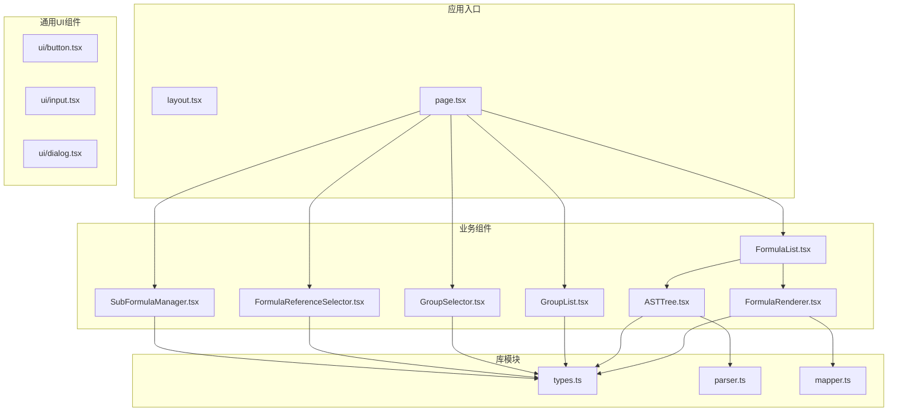
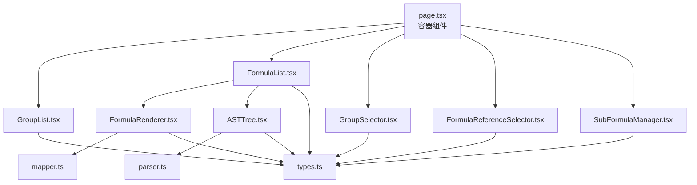
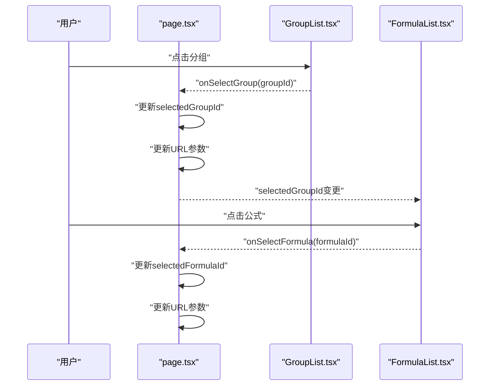
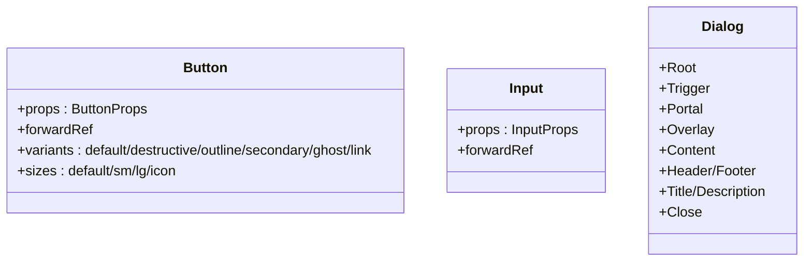
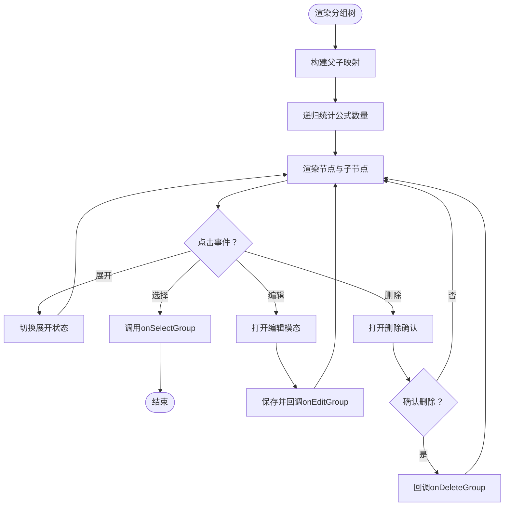
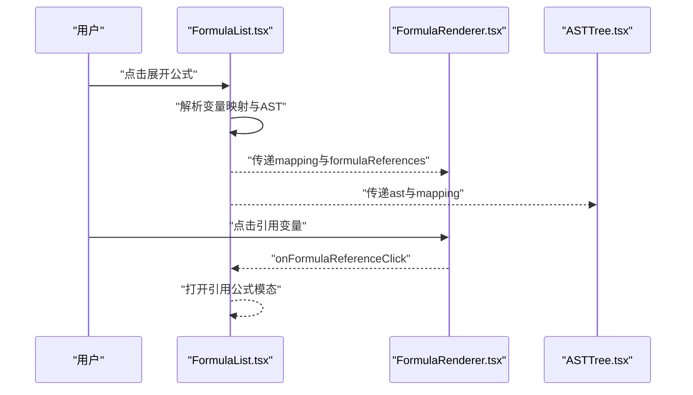
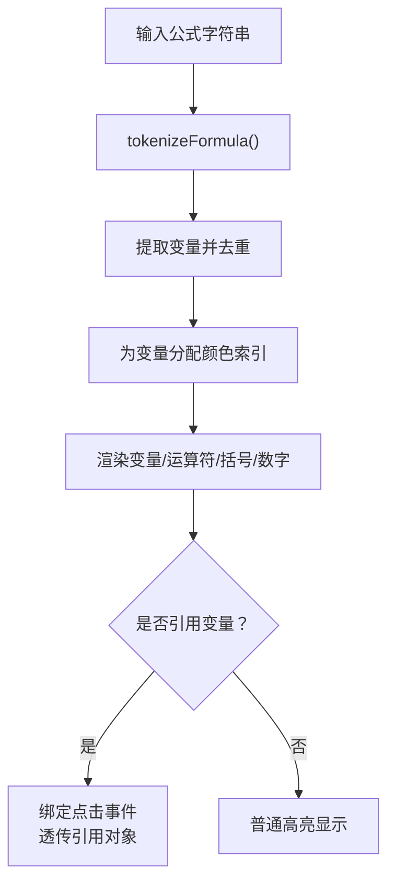
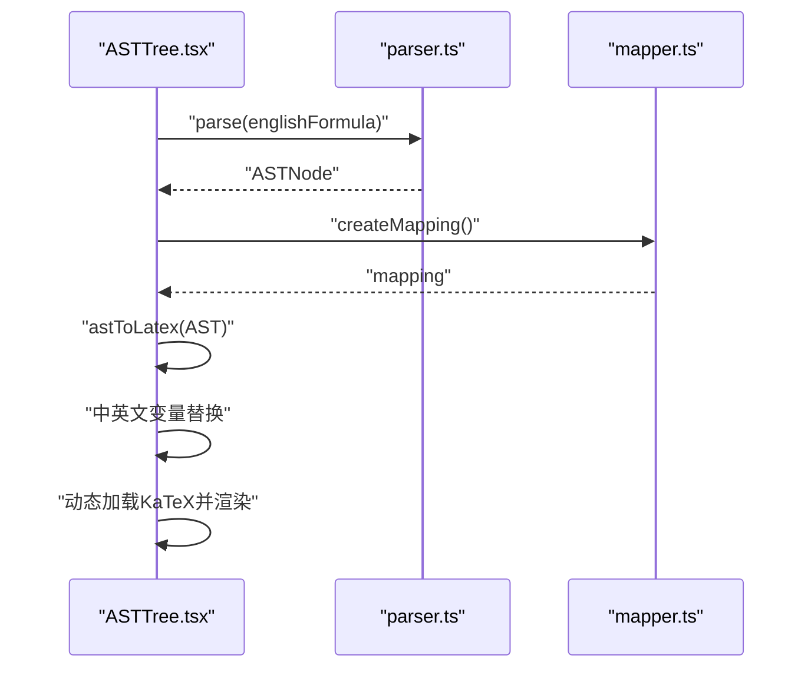
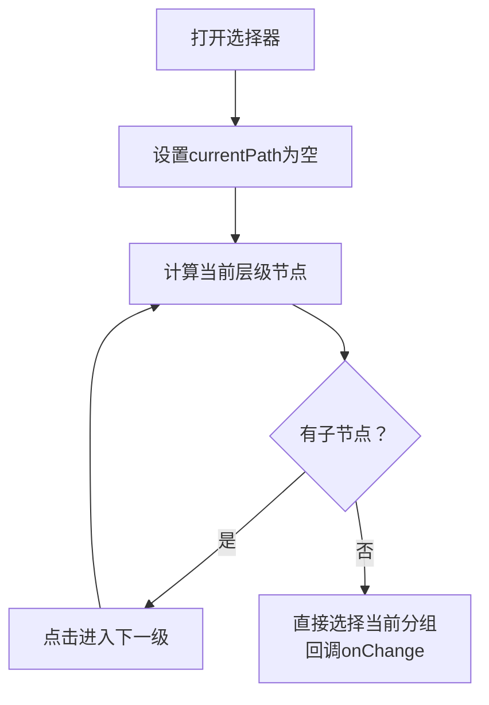
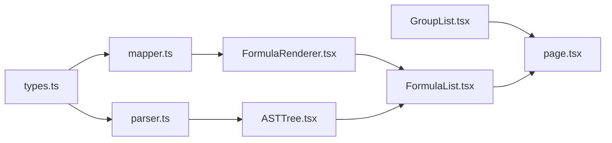

# 组件系统设计

<cite>
**本文档引用的文件**
- [src/app/layout.tsx](file://src/app/layout.tsx)
- [src/app/page.tsx](file://src/app/page.tsx)
- [src/components/ui/button.tsx](file://src/components/ui/button.tsx)
- [src/components/ui/input.tsx](file://src/components/ui/input.tsx)
- [src/components/ui/dialog.tsx](file://src/components/ui/dialog.tsx)
- [src/components/GroupList.tsx](file://src/components/GroupList.tsx)
- [src/components/FormulaList.tsx](file://src/components/FormulaList.tsx)
- [src/components/FormulaReferenceSelector.tsx](file://src/components/FormulaReferenceSelector.tsx)
- [src/components/SubFormulaManager.tsx](file://src/components/SubFormulaManager.tsx)
- [src/components/FormulaRenderer.tsx](file://src/components/FormulaRenderer.tsx)
- [src/components/ASTTree.tsx](file://src/components/ASTTree.tsx)
- [src/components/GroupSelector.tsx](file://src/components/GroupSelector.tsx)
- [src/lib/types.ts](file://src/lib/types.ts)
- [src/lib/parser.ts](file://src/lib/parser.ts)
- [src/lib/mapper.ts](file://src/lib/mapper.ts)
</cite>

## 目录
1. [简介](#简介)
2. [项目结构](#项目结构)
3. [核心组件](#核心组件)
4. [架构总览](#架构总览)
5. [组件详解](#组件详解)
6. [依赖关系分析](#依赖关系分析)
7. [性能考量](#性能考量)
8. [故障排查指南](#故障排查指南)
9. [结论](#结论)
10. [附录](#附录)

## 简介
本项目是一个“公式变量映射与可视化工具”，围绕公式分组、公式管理、变量映射、公式渲染与AST结构树展示构建了完整的React组件系统。系统采用分层设计：页面级容器负责状态与路由集成；通用UI组件提供基础交互能力；业务组件负责具体功能模块；库模块提供解析与映射算法。

## 项目结构
项目采用按功能域组织的目录结构，主要分为应用入口、通用UI组件、业务组件与库模块四大部分：
- 应用入口：Next.js App Router布局与主页容器
- 通用UI组件：基于Radix UI与Tailwind的可复用基础控件
- 业务组件：分组列表、公式列表、公式渲染、AST树等
- 库模块：类型定义、公式解析器、变量映射器、存储与导入导出等

图表来源
- [src/app/page.tsx:1-798](file://src/app/page.tsx#L1-L798)
- [src/components/GroupList.tsx:1-294](file://src/components/GroupList.tsx#L1-L294)
- [src/components/FormulaList.tsx:1-387](file://src/components/FormulaList.tsx#L1-L387)
- [src/components/FormulaRenderer.tsx:1-169](file://src/components/FormulaRenderer.tsx#L1-L169)
- [src/components/ASTTree.tsx:1-179](file://src/components/ASTTree.tsx#L1-L179)
- [src/components/GroupSelector.tsx:1-197](file://src/components/GroupSelector.tsx#L1-L197)
- [src/components/FormulaReferenceSelector.tsx:1-132](file://src/components/FormulaReferenceSelector.tsx#L1-L132)
- [src/components/SubFormulaManager.tsx:1-201](file://src/components/SubFormulaManager.tsx#L1-L201)
- [src/lib/types.ts:1-51](file://src/lib/types.ts#L1-L51)
- [src/lib/parser.ts:1-159](file://src/lib/parser.ts#L1-L159)
- [src/lib/mapper.ts:1-89](file://src/lib/mapper.ts#L1-L89)

章节来源
- [src/app/layout.tsx:1-20](file://src/app/layout.tsx#L1-L20)
- [src/app/page.tsx:1-798](file://src/app/page.tsx#L1-L798)

## 核心组件
- 页面容器与状态管理
  - 主页容器负责URL参数同步、本地缓存恢复、分组与公式的选择与编辑、导入导出等全局逻辑
  - 使用Next.js Navigation Hook与Suspense进行路由与懒加载控制
- 通用UI组件
  - Button/Input/Dialog：基于Radix UI与class-variance-authority，提供变体与尺寸配置
- 业务组件
  - GroupList：树形分组展示、增删改、自动展开与路径计算
  - FormulaList：公式列表、搜索过滤、展开详情、引用与删除确认
  - FormulaRenderer：公式变量高亮、颜色区分、引用跳转
  - ASTTree：LaTeX渲染、中英文切换、变量映射说明
  - GroupSelector：多级分组选择器
  - FormulaReferenceSelector：变量到公式/子公式的映射选择
  - SubFormulaManager：子公式增删改与表单管理

章节来源
- [src/app/page.tsx:14-798](file://src/app/page.tsx#L14-L798)
- [src/components/ui/button.tsx:1-58](file://src/components/ui/button.tsx#L1-L58)
- [src/components/ui/input.tsx:1-26](file://src/components/ui/input.tsx#L1-L26)
- [src/components/ui/dialog.tsx:1-123](file://src/components/ui/dialog.tsx#L1-L123)
- [src/components/GroupList.tsx:1-294](file://src/components/GroupList.tsx#L1-L294)
- [src/components/FormulaList.tsx:1-387](file://src/components/FormulaList.tsx#L1-L387)
- [src/components/FormulaRenderer.tsx:1-169](file://src/components/FormulaRenderer.tsx#L1-L169)
- [src/components/ASTTree.tsx:1-179](file://src/components/ASTTree.tsx#L1-L179)
- [src/components/GroupSelector.tsx:1-197](file://src/components/GroupSelector.tsx#L1-L197)
- [src/components/FormulaReferenceSelector.tsx:1-132](file://src/components/FormulaReferenceSelector.tsx#L1-L132)
- [src/components/SubFormulaManager.tsx:1-201](file://src/components/SubFormulaManager.tsx#L1-L201)

## 架构总览
系统采用“容器组件 + 展示组件”的分层模式：
- 容器组件（page.tsx）集中管理全局状态、URL同步、持久化与业务流程
- 展示组件（各业务组件）专注单一职责，通过props接收数据与回调
- 库模块（parser、mapper、types）提供纯函数与数据模型，保证可测试性与可复用性

图表来源
- [src/app/page.tsx:1-798](file://src/app/page.tsx#L1-L798)
- [src/components/FormulaList.tsx:1-387](file://src/components/FormulaList.tsx#L1-L387)
- [src/components/FormulaRenderer.tsx:1-169](file://src/components/FormulaRenderer.tsx#L1-L169)
- [src/components/ASTTree.tsx:1-179](file://src/components/ASTTree.tsx#L1-L179)
- [src/lib/parser.ts:1-159](file://src/lib/parser.ts#L1-L159)
- [src/lib/mapper.ts:1-89](file://src/lib/mapper.ts#L1-L89)
- [src/lib/types.ts:1-51](file://src/lib/types.ts#L1-L51)

## 组件详解

### 页面容器与路由集成
- 职责
  - 管理分组与公式选择状态、URL同步、本地缓存、导入导出、模态框状态
  - 封装选择器回调，自动更新URL查询参数
- 生命周期
  - 初始化加载：读取本地数据与URL参数，恢复分组与侧边栏状态
  - 监听URL变化：处理浏览器前进/后退导致的公式高亮变化
  - 外部点击：点击外部区域关闭数据菜单
- 通信机制
  - 通过props向下传递状态与回调，如GroupList/FormulaList的onSelect/onEdit等
- 性能优化
  - 使用useCallback封装回调，减少子组件重渲染
  - 使用useMemo缓存复杂计算（如公式映射）

图表来源
- [src/app/page.tsx:14-120](file://src/app/page.tsx#L14-L120)
- [src/components/GroupList.tsx:1-294](file://src/components/GroupList.tsx#L1-L294)
- [src/components/FormulaList.tsx:1-387](file://src/components/FormulaList.tsx#L1-L387)

章节来源
- [src/app/page.tsx:14-134](file://src/app/page.tsx#L14-L134)

### 通用UI组件体系
- 设计原则
  - 变体与尺寸：通过class-variance-authority统一管理
  - 可组合性：支持asChild将语义标签替换为自定义元素
  - 可访问性：遵循Radix UI约定，提供键盘导航与屏幕阅读器支持
- 实现要点
  - Button：支持variant/size/asChild，结合cn合并类名
  - Input：统一边框、聚焦态、禁用态
  - Dialog：Portal承载、Overlay遮罩、Content动画、Close按钮

图表来源
- [src/components/ui/button.tsx:1-58](file://src/components/ui/button.tsx#L1-L58)
- [src/components/ui/input.tsx:1-26](file://src/components/ui/input.tsx#L1-L26)
- [src/components/ui/dialog.tsx:1-123](file://src/components/ui/dialog.tsx#L1-L123)

章节来源
- [src/components/ui/button.tsx:1-58](file://src/components/ui/button.tsx#L1-L58)
- [src/components/ui/input.tsx:1-26](file://src/components/ui/input.tsx#L1-L26)
- [src/components/ui/dialog.tsx:1-123](file://src/components/ui/dialog.tsx#L1-L123)

### 分组列表组件（GroupList）
- 职责
  - 展示树形分组、统计公式数量、支持增删改、自动展开父级
- 状态管理
  - 本地状态：编辑模态、删除确认、展开集合
  - 外部状态：selectedGroupId、onSelectGroup/onCreateGroup/onDeleteGroup/onEditGroup
- 通信机制
  - 点击事件冒泡阻止，分别触发编辑/删除/展开/选择
  - 通过useEffect根据selectedGroupId自动展开路径

图表来源
- [src/components/GroupList.tsx:1-294](file://src/components/GroupList.tsx#L1-L294)

章节来源
- [src/components/GroupList.tsx:1-294](file://src/components/GroupList.tsx#L1-L294)

### 公式列表组件（FormulaList）
- 职责
  - 过滤与搜索、按分组层级展示、展开详情面板
- 状态管理
  - 本地状态：搜索词、删除确认、展开项
  - 详情解析：展开时解析变量映射与AST，收起时清理
- 通信机制
  - onToggle/onEdit/onDelete回调向上冒泡
  - 通过FormulaRenderer与ASTTree展示变量映射与结构树

图表来源
- [src/components/FormulaList.tsx:1-387](file://src/components/FormulaList.tsx#L1-L387)
- [src/components/FormulaRenderer.tsx:1-169](file://src/components/FormulaRenderer.tsx#L1-L169)
- [src/components/ASTTree.tsx:1-179](file://src/components/ASTTree.tsx#L1-L179)

章节来源
- [src/components/FormulaList.tsx:1-387](file://src/components/FormulaList.tsx#L1-L387)

### 公式渲染组件（FormulaRenderer）
- 职责
  - 将公式按token切分，变量高亮并着色，支持引用跳转
- 设计要点
  - 变量颜色索引：基于唯一变量顺序分配颜色，保持一致性
  - Tooltip：显示变量映射或引用信息
  - 引用点击：透传Formula或SubFormula对象供上层处理

图表来源
- [src/components/FormulaRenderer.tsx:1-169](file://src/components/FormulaRenderer.tsx#L1-L169)

章节来源
- [src/components/FormulaRenderer.tsx:1-169](file://src/components/FormulaRenderer.tsx#L1-L169)

### AST树组件（ASTTree）
- 职责
  - 将AST转换为LaTeX表达式，动态加载KaTeX并渲染
- 设计要点
  - 中英文切换：通过映射将英文变量替换为中文变量
  - 错误兜底：渲染失败时回退为文本
  - 变量说明：在英文模式下展示变量映射清单

图表来源
- [src/components/ASTTree.tsx:1-179](file://src/components/ASTTree.tsx#L1-L179)
- [src/lib/parser.ts:1-159](file://src/lib/parser.ts#L1-L159)
- [src/lib/mapper.ts:1-89](file://src/lib/mapper.ts#L1-L89)

章节来源
- [src/components/ASTTree.tsx:1-179](file://src/components/ASTTree.tsx#L1-L179)

### 分组选择器（GroupSelector）
- 职责
  - 多级分组选择，面包屑导航，直接选择某一分组
- 设计要点
  - 树构建：基于parentId构建TreeNode
  - 路径管理：currentPath控制当前层级
  - 选择回调：onChange(parentId, childId)

图表来源
- [src/components/GroupSelector.tsx:1-197](file://src/components/GroupSelector.tsx#L1-L197)

章节来源
- [src/components/GroupSelector.tsx:1-197](file://src/components/GroupSelector.tsx#L1-L197)

### 变量引用选择器（FormulaReferenceSelector）
- 职责
  - 从变量到公式/子公式的映射选择，支持子公式与外部公式分组显示
- 设计要点
  - useMemo缓存变量提取与公式列表
  - optgroup分组显示子公式与外部公式
  - onChange透传新的映射对象

章节来源
- [src/components/FormulaReferenceSelector.tsx:1-132](file://src/components/FormulaReferenceSelector.tsx#L1-L132)

### 子公式管理器（SubFormulaManager）
- 职责
  - 子公式的增删改与表单管理，支持临时ID与引用前缀
- 设计要点
  - 临时ID：新增时使用sub_前缀+时间戳
  - 删除确认：通过ConfirmDialog组件复用

章节来源
- [src/components/SubFormulaManager.tsx:1-201](file://src/components/SubFormulaManager.tsx#L1-L201)

## 依赖关系分析
- 组件耦合
  - FormulaList依赖FormulaRenderer与ASTTree进行可视化展示
  - GroupList依赖ConfirmDialog进行删除确认
  - FormulaReferenceSelector与SubFormulaManager共同服务于公式编辑表单
- 外部依赖
  - Radix UI：Dialog等无障碍组件
  - KaTeX：LaTeX渲染
  - class-variance-authority：UI变体与尺寸
- 类型与算法
  - types.ts提供ASTNode、Formula、FormulaGroup等核心类型
  - parser.ts提供公式token化与AST构建
  - mapper.ts提供变量提取与映射生成

图表来源
- [src/lib/types.ts:1-51](file://src/lib/types.ts#L1-L51)
- [src/lib/parser.ts:1-159](file://src/lib/parser.ts#L1-L159)
- [src/lib/mapper.ts:1-89](file://src/lib/mapper.ts#L1-L89)
- [src/components/ASTTree.tsx:1-179](file://src/components/ASTTree.tsx#L1-L179)
- [src/components/FormulaRenderer.tsx:1-169](file://src/components/FormulaRenderer.tsx#L1-L169)
- [src/components/FormulaList.tsx:1-387](file://src/components/FormulaList.tsx#L1-L387)
- [src/components/GroupList.tsx:1-294](file://src/components/GroupList.tsx#L1-L294)
- [src/app/page.tsx:1-798](file://src/app/page.tsx#L1-L798)

章节来源
- [src/lib/types.ts:1-51](file://src/lib/types.ts#L1-L51)
- [src/lib/parser.ts:1-159](file://src/lib/parser.ts#L1-L159)
- [src/lib/mapper.ts:1-89](file://src/lib/mapper.ts#L1-L89)

## 性能考量
- 渲染优化
  - 使用useMemo缓存变量提取与公式列表，避免重复计算
  - 使用useCallback封装回调，减少子组件重渲染
  - 条件渲染：仅在展开时解析AST与映射
- 资源加载
  - 动态加载KaTeX样式与模块，按需渲染
  - Dialog使用Portal减少DOM层级，提升渲染性能
- 状态管理
  - 将URL同步与本地缓存分离，避免不必要的全局刷新
  - 使用受控组件与表单状态聚合，降低状态碎片化

## 故障排查指南
- 公式解析失败
  - 现象：FormulaList详情区显示解析错误
  - 排查：检查FormulaParser的tokenize与parse逻辑，确认括号匹配与合法字符
- LaTeX渲染异常
  - 现象：ASTTree显示渲染失败
  - 排查：确认KaTeX CDN可用性与astToLatex转换正确性
- 引用点击无效
  - 现象：FormulaRenderer点击变量无响应
  - 排查：确认formulaReferences映射与onFormulaReferenceClick回调传递
- 删除确认未生效
  - 现象：点击删除无反应
  - 排查：确认ConfirmDialog的isOpen与onConfirm回调

章节来源
- [src/components/FormulaList.tsx:160-192](file://src/components/FormulaList.tsx#L160-L192)
- [src/components/ASTTree.tsx:120-142](file://src/components/ASTTree.tsx#L120-L142)
- [src/components/FormulaRenderer.tsx:58-92](file://src/components/FormulaRenderer.tsx#L58-L92)

## 结论
本组件系统通过清晰的分层与职责划分，实现了从页面容器到业务组件再到库模块的完整闭环。通用UI组件提供一致的交互体验，业务组件专注于领域逻辑，库模块保障算法的可测试性与可维护性。配合合理的状态管理与性能优化策略，系统具备良好的可扩展性与可维护性。

## 附录
- 组件开发最佳实践
  - 单一职责：每个组件只负责一个功能点
  - 受控与非受控：优先使用受控组件，明确数据流向
  - 变体与尺寸：通过class-variance-authority统一管理UI风格
  - 可访问性：遵循ARIA规范，提供键盘与屏幕阅读器支持
- 样式系统与主题定制
  - Tailwind：通过工具类快速实现样式
  - Radix UI：提供无障碍与可组合的底层组件
  - 主题：通过CSS变量与Tailwind配置实现主题切换
- 测试策略与调试技巧
  - 单元测试：针对parser与mapper的纯函数进行断言
  - 集成测试：模拟FormulaList渲染与点击交互
  - 调试：利用React DevTools检查组件树与状态，使用浏览器网络面板观察资源加载