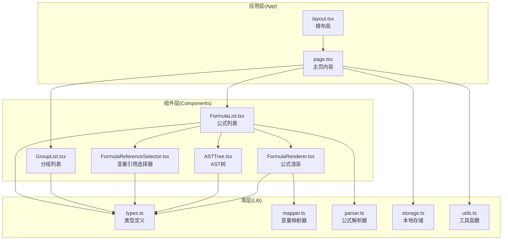
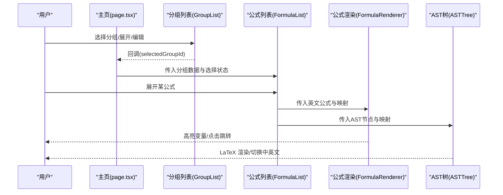
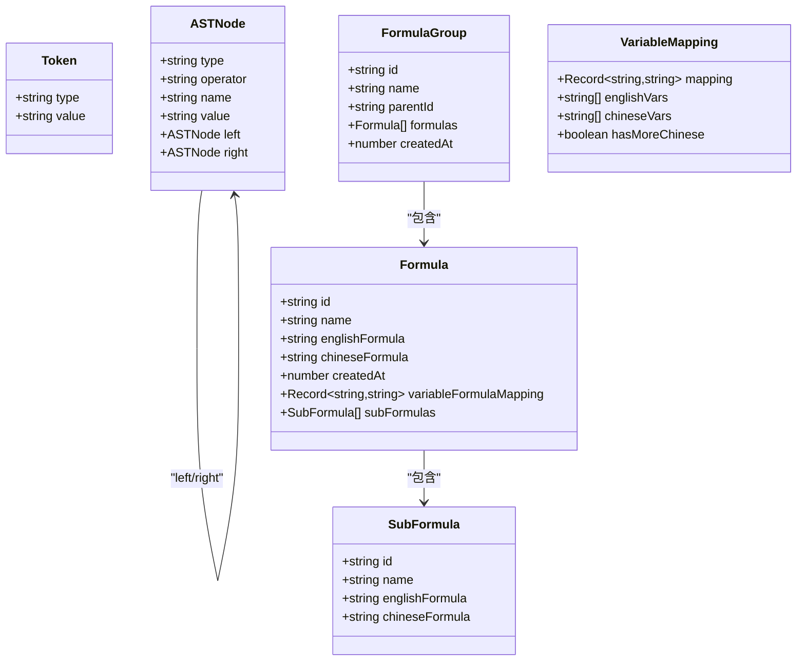
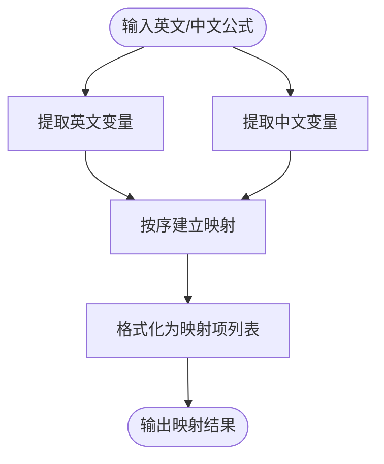
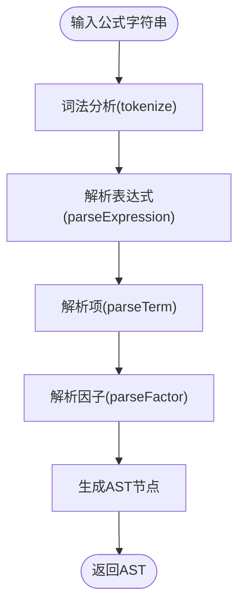
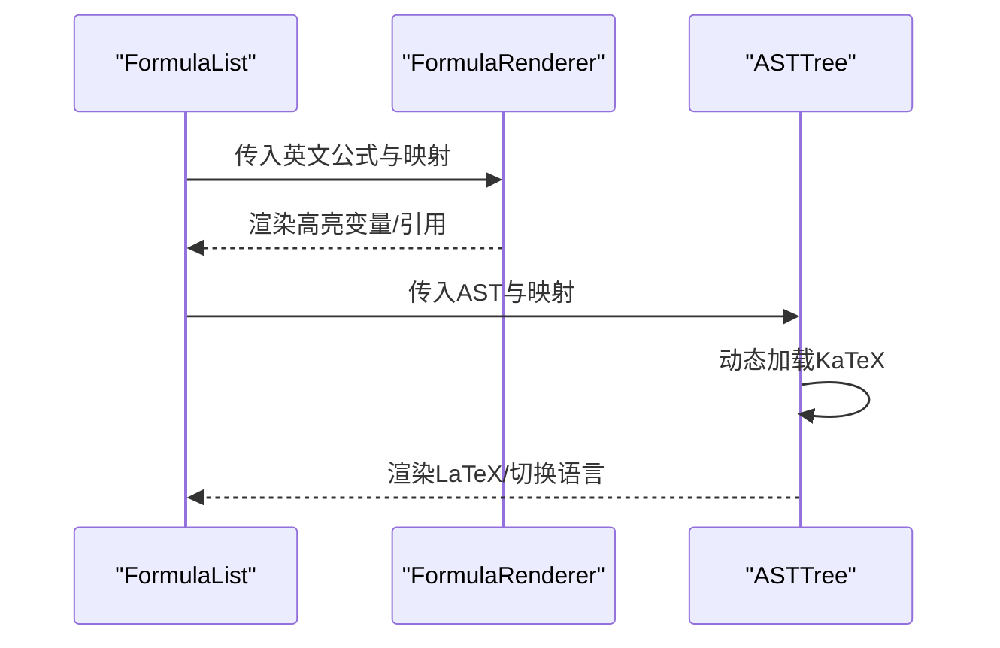
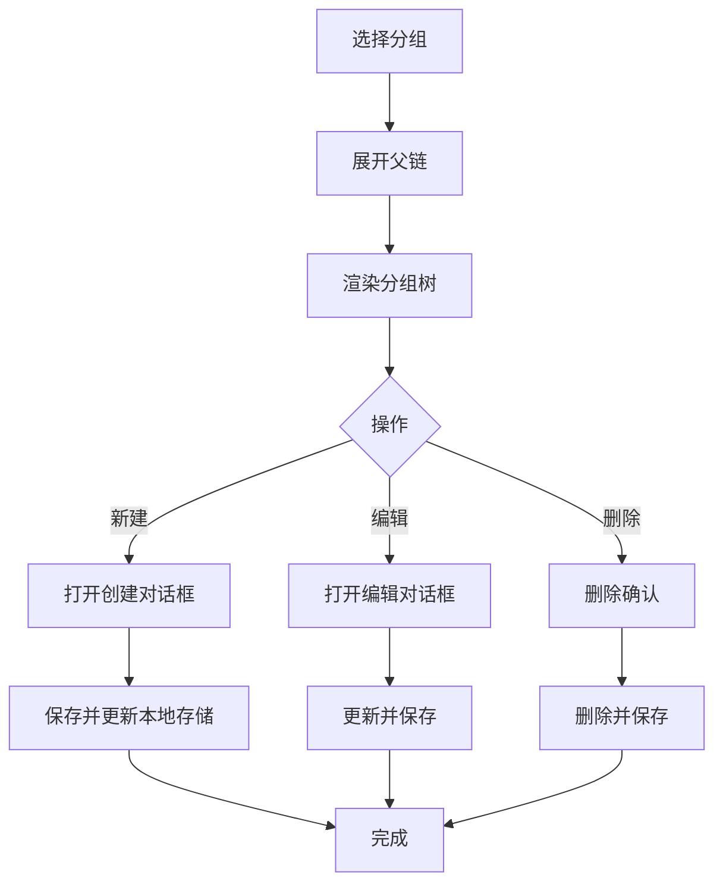
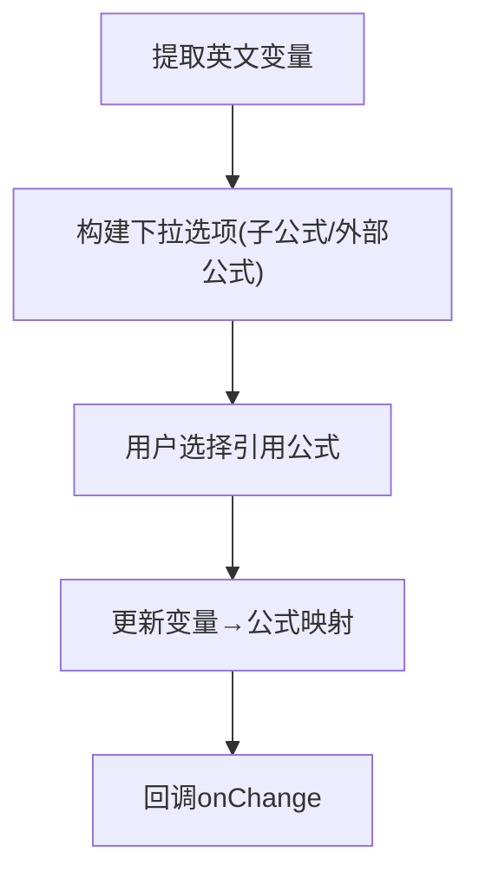
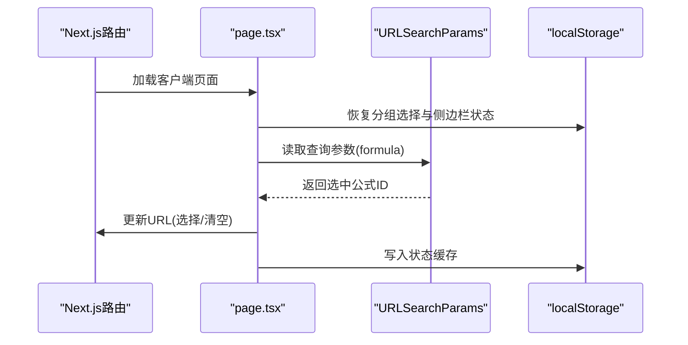
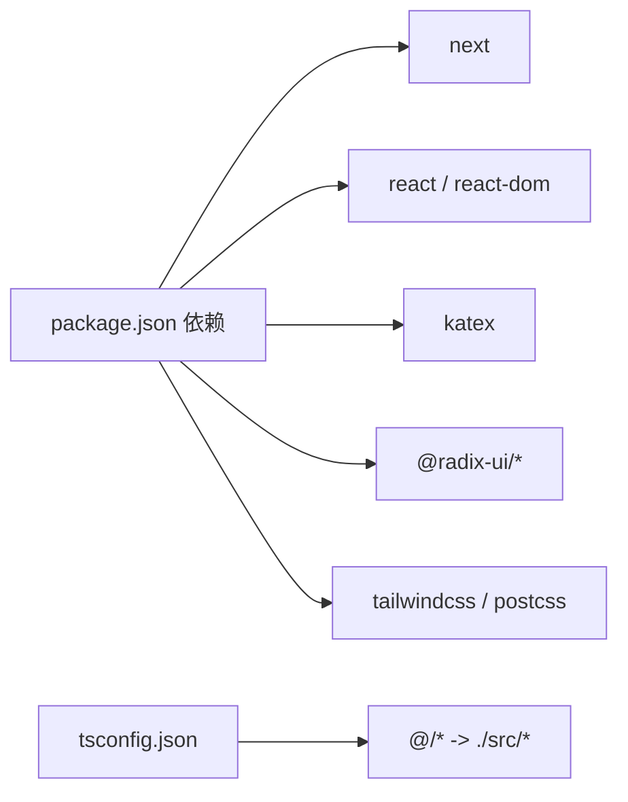

# 项目架构设计

<cite>
**本文档引用的文件**
- [package.json](file://package.json)
- [next.config.js](file://next.config.js)
- [tsconfig.json](file://tsconfig.json)
- [src/app/layout.tsx](file://src/app/layout.tsx)
- [src/app/page.tsx](file://src/app/page.tsx)
- [src/lib/types.ts](file://src/lib/types.ts)
- [src/lib/mapper.ts](file://src/lib/mapper.ts)
- [src/lib/parser.ts](file://src/lib/parser.ts)
- [src/lib/storage.ts](file://src/lib/storage.ts)
- [src/lib/utils.ts](file://src/lib/utils.ts)
- [src/components/ASTTree.tsx](file://src/components/ASTTree.tsx)
- [src/components/FormulaRenderer.tsx](file://src/components/FormulaRenderer.tsx)
- [src/components/FormulaList.tsx](file://src/components/FormulaList.tsx)
- [src/components/GroupList.tsx](file://src/components/GroupList.tsx)
- [src/components/FormulaReferenceSelector.tsx](file://src/components/FormulaReferenceSelector.tsx)
</cite>

## 目录
1. [简介](#简介)
2. [项目结构](#项目结构)
3. [核心组件](#核心组件)
4. [架构总览](#架构总览)
5. [详细组件分析](#详细组件分析)
6. [依赖分析](#依赖分析)
7. [性能考量](#性能考量)
8. [故障排查指南](#故障排查指南)
9. [结论](#结论)

## 简介
本项目是一个“公式变量映射与可视化工具”，旨在帮助用户对英文公式与中文公式进行变量映射，并通过公式渲染、AST 结构树以及交互式引用机制实现直观的可视化展示。系统采用 Next.js 应用路由与客户端组件模式，结合 TypeScript 类型系统与本地存储方案，构建了清晰的数据流与组件化架构。

## 项目结构
项目采用基于功能域的目录组织方式，核心分为三层：
- 应用层：Next.js App Router 页面与布局
- 组件层：可复用 UI 组件与业务组件
- 库层：类型定义、解析器、映射器、存储与工具函数

**图表来源**
- [src/app/layout.tsx:1-20](file://src/app/layout.tsx#L1-L20)
- [src/app/page.tsx:1-707](file://src/app/page.tsx#L1-L707)
- [src/components/GroupList.tsx:1-294](file://src/components/GroupList.tsx#L1-L294)
- [src/components/FormulaList.tsx:1-387](file://src/components/FormulaList.tsx#L1-L387)
- [src/components/FormulaRenderer.tsx:1-169](file://src/components/FormulaRenderer.tsx#L1-L169)
- [src/components/ASTTree.tsx:1-179](file://src/components/ASTTree.tsx#L1-L179)
- [src/components/FormulaReferenceSelector.tsx:1-132](file://src/components/FormulaReferenceSelector.tsx#L1-L132)
- [src/lib/types.ts:1-51](file://src/lib/types.ts#L1-L51)
- [src/lib/mapper.ts:1-89](file://src/lib/mapper.ts#L1-L89)
- [src/lib/parser.ts:1-159](file://src/lib/parser.ts#L1-L159)
- [src/lib/storage.ts:1-50](file://src/lib/storage.ts#L1-L50)
- [src/lib/utils.ts:1-7](file://src/lib/utils.ts#L1-L7)

**章节来源**
- [package.json:1-48](file://package.json#L1-L48)
- [next.config.js:1-7](file://next.config.js#L1-L7)
- [tsconfig.json:1-42](file://tsconfig.json#L1-L42)

## 核心组件
- 应用入口与布局：根布局负责全局样式与元数据设置，主页作为客户端组件承载状态与业务逻辑。
- 分组与公式管理：分组树组件支持层级展开、增删改与公式统计；公式列表支持搜索、展开详情与批量操作。
- 可视化渲染：公式渲染器将公式分解为令牌并着色高亮，AST 树组件将表达式转为 LaTeX 并动态渲染。
- 变量映射与引用：映射器从英文与中文公式中提取变量并建立映射；引用选择器允许将变量绑定到子公式或外部公式。
- 数据持久化：本地存储封装了数据读写与 ID 生成，保证离线可用与跨会话一致性。

**章节来源**
- [src/app/layout.tsx:1-20](file://src/app/layout.tsx#L1-L20)
- [src/app/page.tsx:1-707](file://src/app/page.tsx#L1-L707)
- [src/components/GroupList.tsx:1-294](file://src/components/GroupList.tsx#L1-L294)
- [src/components/FormulaList.tsx:1-387](file://src/components/FormulaList.tsx#L1-L387)
- [src/components/FormulaRenderer.tsx:1-169](file://src/components/FormulaRenderer.tsx#L1-L169)
- [src/components/ASTTree.tsx:1-179](file://src/components/ASTTree.tsx#L1-L179)
- [src/components/FormulaReferenceSelector.tsx:1-132](file://src/components/FormulaReferenceSelector.tsx#L1-L132)
- [src/lib/mapper.ts:1-89](file://src/lib/mapper.ts#L1-L89)
- [src/lib/parser.ts:1-159](file://src/lib/parser.ts#L1-L159)
- [src/lib/storage.ts:1-50](file://src/lib/storage.ts#L1-L50)

## 架构总览
系统采用“页面级客户端状态 + 组件化渲染 + 本地持久化”的架构模式：
- 页面层：Next.js App Router 的客户端页面负责状态管理、URL 同步与数据导入导出。
- 组件层：功能组件各自职责明确，通过 props 传递数据与回调，减少耦合。
- 库层：纯函数与类封装算法与数据结构，便于测试与复用。
- 外部集成：KaTeX 动态加载用于公式渲染，浏览器本地存储用于数据持久化。

**图表来源**
- [src/app/page.tsx:1-707](file://src/app/page.tsx#L1-L707)
- [src/components/GroupList.tsx:1-294](file://src/components/GroupList.tsx#L1-L294)
- [src/components/FormulaList.tsx:1-387](file://src/components/FormulaList.tsx#L1-L387)
- [src/components/FormulaRenderer.tsx:1-169](file://src/components/FormulaRenderer.tsx#L1-L169)
- [src/components/ASTTree.tsx:1-179](file://src/components/ASTTree.tsx#L1-L179)

## 详细组件分析

### 类型系统与数据模型
系统通过 TypeScript 定义了清晰的数据模型，确保组件间契约一致：
- Token/ASTNode：表达式词法与语法结构的基础单元
- Formula/SubFormula：公式与子公式的结构
- FormulaGroup：支持父子关系的分组模型
- VariableMapping/MappingItem：变量映射的结构化表示

**图表来源**
- [src/lib/types.ts:1-51](file://src/lib/types.ts#L1-L51)

**章节来源**
- [src/lib/types.ts:1-51](file://src/lib/types.ts#L1-L51)

### 变量映射与公式解析
- 变量映射器：从英文与中文公式中提取变量，按序建立映射，并提供格式化输出。
- 公式解析器：将字符串公式转换为 AST，支持括号、运算符优先级与因子解析。

**图表来源**
- [src/lib/mapper.ts:1-89](file://src/lib/mapper.ts#L1-L89)

**图表来源**
- [src/lib/parser.ts:1-159](file://src/lib/parser.ts#L1-L159)

**章节来源**
- [src/lib/mapper.ts:1-89](file://src/lib/mapper.ts#L1-L89)
- [src/lib/parser.ts:1-159](file://src/lib/parser.ts#L1-L159)

### 公式渲染与交互
- 公式渲染器：将公式分解为变量、运算符、括号与数字等令牌，为变量分配颜色并支持引用跳转。
- AST 树：将 AST 转换为 LaTeX 表达式，动态加载 KaTeX 并支持中英文切换与变量说明。

**图表来源**
- [src/components/FormulaList.tsx:1-387](file://src/components/FormulaList.tsx#L1-L387)
- [src/components/FormulaRenderer.tsx:1-169](file://src/components/FormulaRenderer.tsx#L1-L169)
- [src/components/ASTTree.tsx:1-179](file://src/components/ASTTree.tsx#L1-L179)

**章节来源**
- [src/components/FormulaRenderer.tsx:1-169](file://src/components/FormulaRenderer.tsx#L1-L169)
- [src/components/ASTTree.tsx:1-179](file://src/components/ASTTree.tsx#L1-L179)

### 分组与公式管理
- 分组列表：构建树形结构，支持展开/折叠、增删改与公式数量统计；自动展开选中分组的父链。
- 公式列表：支持搜索、展开详情、删除确认与编辑弹窗；在展开时解析映射与 AST。

**图表来源**
- [src/components/GroupList.tsx:1-294](file://src/components/GroupList.tsx#L1-L294)

**章节来源**
- [src/components/GroupList.tsx:1-294](file://src/components/GroupList.tsx#L1-L294)
- [src/components/FormulaList.tsx:1-387](file://src/components/FormulaList.tsx#L1-L387)

### 变量引用选择器
- 从英文公式中提取唯一变量，提供下拉选择框，支持绑定到子公式或外部公式。
- 通过前缀区分子公式与外部公式，实现引用映射的统一管理。

**图表来源**
- [src/components/FormulaReferenceSelector.tsx:1-132](file://src/components/FormulaReferenceSelector.tsx#L1-L132)

**章节来源**
- [src/components/FormulaReferenceSelector.tsx:1-132](file://src/components/FormulaReferenceSelector.tsx#L1-L132)

### 页面与路由架构
- Next.js App Router：采用客户端页面与 Suspense 包裹，实现首屏快速渲染与异步加载。
- URL 同步：通过 Next.js 导航钩子与 URLSearchParams 实现公式选择与面包屑路径同步。
- 元数据与样式：根布局集中管理站点标题、描述与全局样式引入。

**图表来源**
- [src/app/page.tsx:1-707](file://src/app/page.tsx#L1-L707)
- [src/app/layout.tsx:1-20](file://src/app/layout.tsx#L1-L20)

**章节来源**
- [src/app/page.tsx:1-707](file://src/app/page.tsx#L1-L707)
- [src/app/layout.tsx:1-20](file://src/app/layout.tsx#L1-L20)

## 依赖分析
- 运行时依赖：Next.js、React、KaTeX、Radix UI 组件库、TailwindCSS 生态。
- 开发依赖：TypeScript、ESLint、PostCSS、TailwindCSS。
- 路径别名：通过 tsconfig 的 paths 将 @/ 映射到 src/*，提升导入可读性。

**图表来源**
- [package.json:15-34](file://package.json#L15-L34)
- [tsconfig.json:24-28](file://tsconfig.json#L24-L28)

**章节来源**
- [package.json:1-48](file://package.json#L1-L48)
- [tsconfig.json:1-42](file://tsconfig.json#L1-L42)

## 性能考量
- 计算优化：使用 useMemo 缓存变量提取与公式列表，减少不必要的重渲染。
- 渲染优化：FormulaList 在未展开时清空 AST 与映射状态，避免无效渲染。
- 资源加载：ASTTree 动态加载 KaTeX 样式与模块，按需渲染，降低首屏负担。
- 存储优化：本地存储采用 JSON 序列化，避免频繁写入抖动，必要时合并更新。

## 故障排查指南
- 解析错误：当公式语法不合法时，FormulaList 会在详情区域显示错误信息，建议检查括号匹配与运算符。
- 渲染失败：ASTTree 在 KaTeX 渲染异常时回退为文本显示并记录错误日志，可检查网络与 CDN 可达性。
- 数据导入失败：导入对话框捕获错误并提示具体原因，建议检查文件格式与内容完整性。
- URL 同步问题：若浏览器前进/后退导致选中状态不同步，检查路由钩子与 URL 参数更新逻辑。

**章节来源**
- [src/components/FormulaList.tsx:169-192](file://src/components/FormulaList.tsx#L169-L192)
- [src/components/ASTTree.tsx:124-142](file://src/components/ASTTree.tsx#L124-L142)
- [src/app/page.tsx:371-390](file://src/app/page.tsx#L371-L390)

## 结论
本项目通过清晰的分层架构、严格的类型约束与组件化设计，实现了公式变量映射与可视化的完整闭环。Next.js 客户端页面与 App Router 的结合提供了良好的开发体验与运行时性能；本地存储与 URL 同步保障了用户体验的一致性。未来可在以下方面持续演进：引入更完善的错误边界与日志上报、增强导入导出的数据校验与版本兼容、扩展引用图谱与批量操作能力。