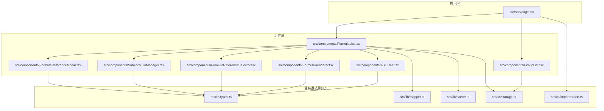
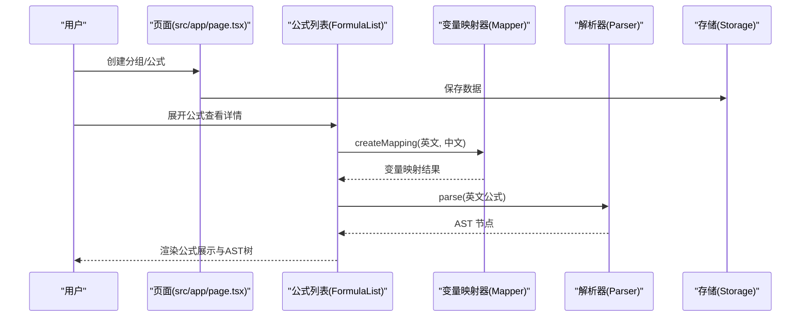
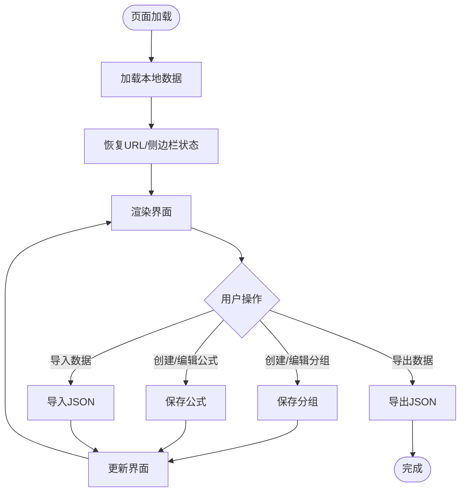
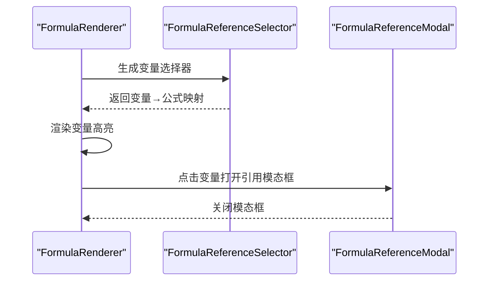
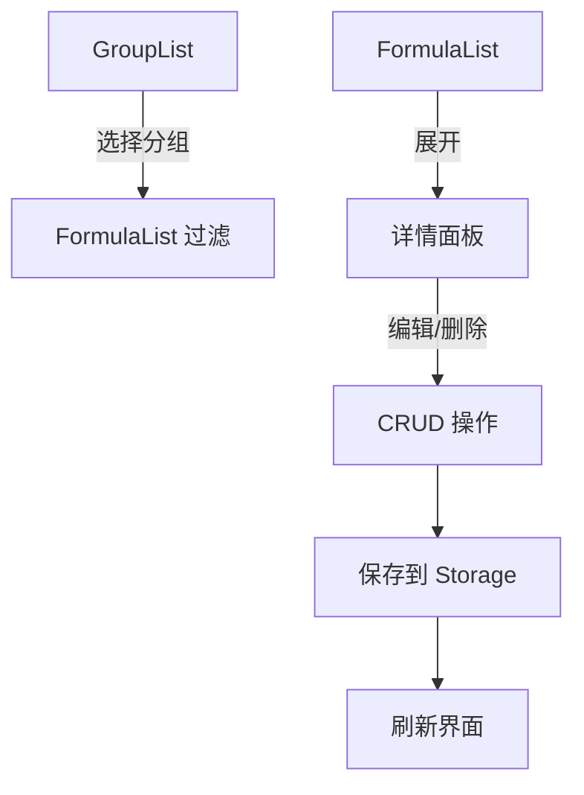
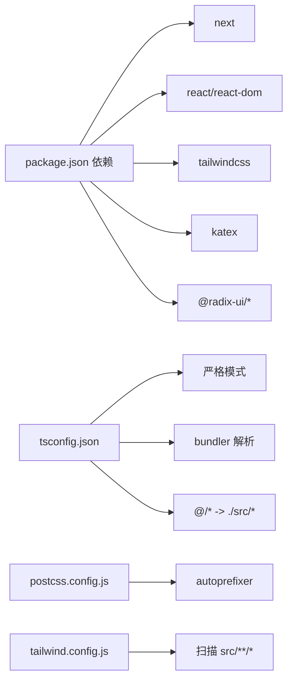

# 快速开始

<cite>
**本文档引用的文件**
- [package.json](file://package.json)
- [next.config.js](file://next.config.js)
- [tsconfig.json](file://tsconfig.json)
- [tailwind.config.js](file://tailwind.config.js)
- [src/app/page.tsx](file://src/app/page.tsx)
- [src/lib/types.ts](file://src/lib/types.ts)
- [src/lib/mapper.ts](file://src/lib/mapper.ts)
- [src/lib/parser.ts](file://src/lib/parser.ts)
- [src/lib/storage.ts](file://src/lib/storage.ts)
- [src/lib/importExport.ts](file://src/lib/importExport.ts)
- [src/components/ASTTree.tsx](file://src/components/ASTTree.tsx)
- [src/components/FormulaRenderer.tsx](file://src/components/FormulaRenderer.tsx)
- [src/components/FormulaList.tsx](file://src/components/FormulaList.tsx)
- [src/components/GroupList.tsx](file://src/components/GroupList.tsx)
- [src/components/FormulaReferenceSelector.tsx](file://src/components/FormulaReferenceSelector.tsx)
- [src/components/SubFormulaManager.tsx](file://src/components/SubFormulaManager.tsx)
- [src/components/FormulaReferenceModal.tsx](file://src/components/FormulaReferenceModal.tsx)
</cite>

## 目录
1. [简介](#简介)
2. [项目结构](#项目结构)
3. [核心组件](#核心组件)
4. [架构总览](#架构总览)
5. [详细组件分析](#详细组件分析)
6. [依赖关系分析](#依赖关系分析)
7. [性能考虑](#性能考虑)
8. [故障排除指南](#故障排除指南)
9. [结论](#结论)
10. [附录](#附录)

## 简介
本项目是一个公式变量映射与可视化工具，基于 Next.js 16 和 React 19 构建，提供公式分组管理、变量映射、LaTeX 公式渲染、AST 结构树展示以及子公式与外部公式引用能力。通过本地存储实现数据持久化，支持 JSON 导入导出。

## 项目结构
项目采用 Next.js App Router 结构，核心源码位于 src 目录：
- src/app/page.tsx：应用入口页面，负责全局状态管理和路由交互
- src/lib：核心业务逻辑库，包含类型定义、变量映射、公式解析、存储与导入导出
- src/components：UI 组件库，包含公式列表、分组树、AST 渲染、引用选择器等



**图表来源**
- [src/app/page.tsx:1-707](file://src/app/page.tsx#L1-L707)
- [src/components/GroupList.tsx:1-294](file://src/components/GroupList.tsx#L1-L294)
- [src/components/FormulaList.tsx:1-387](file://src/components/FormulaList.tsx#L1-L387)
- [src/lib/mapper.ts:1-89](file://src/lib/mapper.ts#L1-L89)
- [src/lib/parser.ts:1-159](file://src/lib/parser.ts#L1-L159)
- [src/lib/storage.ts:1-50](file://src/lib/storage.ts#L1-L50)
- [src/lib/importExport.ts:1-101](file://src/lib/importExport.ts#L1-L101)

**章节来源**
- [package.json:1-48](file://package.json#L1-L48)
- [next.config.js:1-7](file://next.config.js#L1-L7)
- [tsconfig.json:1-42](file://tsconfig.json#L1-L42)
- [tailwind.config.js:1-76](file://tailwind.config.js#L1-L76)

## 核心组件
- 类型系统：定义 Token、ASTNode、VariableMapping、Formula、SubFormula、FormulaGroup 等核心数据结构
- 变量映射器：从英文/中文公式中提取变量并建立映射关系
- 公式解析器：将公式字符串解析为 AST（抽象语法树）
- 存储与导入导出：基于 localStorage 的数据持久化，支持 JSON 导入导出
- UI 组件：分组树、公式列表、AST 树渲染、公式渲染器、引用选择器、子公式管理器、引用模态框

**章节来源**
- [src/lib/types.ts:1-51](file://src/lib/types.ts#L1-L51)
- [src/lib/mapper.ts:1-89](file://src/lib/mapper.ts#L1-L89)
- [src/lib/parser.ts:1-159](file://src/lib/parser.ts#L1-L159)
- [src/lib/storage.ts:1-50](file://src/lib/storage.ts#L1-L50)
- [src/lib/importExport.ts:1-101](file://src/lib/importExport.ts#L1-L101)

## 架构总览
系统采用前端单页应用架构，核心流程如下：
- 用户在页面中创建分组和公式
- 输入英文公式后，系统自动生成变量映射并解析为 AST
- 通过 FormulaRenderer 和 ASTTree 展示公式和结构树
- 支持子公式与外部公式引用，形成可嵌套的公式体系
- 数据通过 localStorage 持久化，支持 JSON 文件导入导出



**图表来源**
- [src/app/page.tsx:1-707](file://src/app/page.tsx#L1-L707)
- [src/components/FormulaList.tsx:1-387](file://src/components/FormulaList.tsx#L1-L387)
- [src/lib/mapper.ts:52-70](file://src/lib/mapper.ts#L52-L70)
- [src/lib/parser.ts:12-22](file://src/lib/parser.ts#L12-L22)
- [src/lib/storage.ts:17-25](file://src/lib/storage.ts#L17-L25)

## 详细组件分析

### 页面与状态管理
- 负责全局状态：分组列表、选中分组/公式、侧边栏折叠状态、URL 同步
- 实现分组 CRUD、公式 CRUD、数据导入导出、URL 参数同步
- 使用 localStorage 缓存用户偏好（选中分组、侧边栏状态）



**图表来源**
- [src/app/page.tsx:82-131](file://src/app/page.tsx#L82-L131)
- [src/app/page.tsx:158-239](file://src/app/page.tsx#L158-L239)
- [src/app/page.tsx:362-390](file://src/app/page.tsx#L362-L390)

**章节来源**
- [src/app/page.tsx:1-707](file://src/app/page.tsx#L1-L707)

### 变量映射与公式解析
- VariableMapper：从英文公式提取英文变量，从中文公式提取中文变量，建立一一对应映射
- FormulaParser：词法分析 + 自顶向下递归下降解析，支持 + - * / 与多种括号
- ASTTree：将 AST 转换为 LaTeX 并渲染，支持中英文切换与变量说明

```mermaid
classDiagram
class VariableMapper {
+extractEnglishVariables(formula) string[]
+extractChineseVariables(formula) string[]
+createMapping(eng, ch) VariableMapping
+formatMapping(result) {items, hasMoreChinese}
}
class FormulaParser {
-tokens : Token[]
-pos : number
+parse(formula) ASTNode
+tokenize(formula) Token[]
-parseExpression() ASTNode
-parseTerm() ASTNode
-parseFactor() ASTNode
}
class ASTTree {
+ast : ASTNode
+mapping : Record
+render()
}
VariableMapper --> ASTTree : "提供映射"
FormulaParser --> ASTTree : "提供AST"
```

**图表来源**
- [src/lib/mapper.ts:1-89](file://src/lib/mapper.ts#L1-L89)
- [src/lib/parser.ts:1-159](file://src/lib/parser.ts#L1-L159)
- [src/components/ASTTree.tsx:1-179](file://src/components/ASTTree.tsx#L1-L179)

**章节来源**
- [src/lib/mapper.ts:1-89](file://src/lib/mapper.ts#L1-L89)
- [src/lib/parser.ts:1-159](file://src/lib/parser.ts#L1-L159)
- [src/components/ASTTree.tsx:1-179](file://src/components/ASTTree.tsx#L1-L179)

### 公式渲染与引用
- FormulaRenderer：将公式按变量着色高亮，支持点击跳转到引用的公式或子公式
- FormulaReferenceSelector：为变量选择引用的公式（支持子公式与外部公式）
- FormulaReferenceModal：展示被引用公式的变量映射、公式渲染与 AST 树



**图表来源**
- [src/components/FormulaRenderer.tsx:1-169](file://src/components/FormulaRenderer.tsx#L1-L169)
- [src/components/FormulaReferenceSelector.tsx:1-132](file://src/components/FormulaReferenceSelector.tsx#L1-L132)
- [src/components/FormulaReferenceModal.tsx:1-180](file://src/components/FormulaReferenceModal.tsx#L1-L180)

**章节来源**
- [src/components/FormulaRenderer.tsx:1-169](file://src/components/FormulaRenderer.tsx#L1-L169)
- [src/components/FormulaReferenceSelector.tsx:1-132](file://src/components/FormulaReferenceSelector.tsx#L1-L132)
- [src/components/FormulaReferenceModal.tsx:1-180](file://src/components/FormulaReferenceModal.tsx#L1-L180)

### 分组与公式管理
- GroupList：树形展示分组，支持增删改、展开/折叠、自动展开父级
- FormulaList：按分组筛选公式，支持搜索、展开详情、删除确认
- SubFormulaManager：管理子公式（独立于主公式，但可在变量映射中引用）



**图表来源**
- [src/components/GroupList.tsx:1-294](file://src/components/GroupList.tsx#L1-L294)
- [src/components/FormulaList.tsx:1-387](file://src/components/FormulaList.tsx#L1-L387)
- [src/components/SubFormulaManager.tsx:1-201](file://src/components/SubFormulaManager.tsx#L1-L201)

**章节来源**
- [src/components/GroupList.tsx:1-294](file://src/components/GroupList.tsx#L1-L294)
- [src/components/FormulaList.tsx:1-387](file://src/components/FormulaList.tsx#L1-L387)
- [src/components/SubFormulaManager.tsx:1-201](file://src/components/SubFormulaManager.tsx#L1-L201)

## 依赖关系分析
- 运行时依赖：Next.js 16、React 19、TailwindCSS、KaTeX、Radix UI 组件库
- 开发依赖：TypeScript、ESLint、PostCSS、autoprefixer
- 构建配置：Next.js 配置启用严格模式；TypeScript 配置启用严格模式与 bundler 解析；Tailwind 配置扫描 src 下组件



**图表来源**
- [package.json:15-46](file://package.json#L15-L46)
- [tsconfig.json:2-29](file://tsconfig.json#L2-L29)
- [tailwind.config.js:4-8](file://tailwind.config.js#L4-L8)

**章节来源**
- [package.json:1-48](file://package.json#L1-L48)
- [tsconfig.json:1-42](file://tsconfig.json#L1-L42)
- [tailwind.config.js:1-76](file://tailwind.config.js#L1-L76)

## 性能考虑
- 使用 useMemo 缓存变量提取与公式列表，减少重复计算
- 仅在展开公式详情时进行解析与渲染，避免不必要的计算
- 通过 localStorage 缓存用户偏好，减少每次加载的计算
- 组件按需渲染，避免全量重绘

[本节为通用性能建议，无需特定文件引用]

## 故障排除指南
- 导入失败：检查 JSON 文件格式是否符合导出规范，确认 groups 数组与各公式字段完整性
- 解析错误：检查英文公式语法，确保括号匹配、运算符合法
- 渲染失败：确认网络可访问 KaTeX CDN，或检查本地 KaTeX 版本兼容性
- 数据丢失：确认浏览器允许 localStorage，检查存储键名一致性

**章节来源**
- [src/lib/importExport.ts:43-75](file://src/lib/importExport.ts#L43-L75)
- [src/lib/parser.ts:118-157](file://src/lib/parser.ts#L118-L157)
- [src/components/ASTTree.tsx:124-142](file://src/components/ASTTree.tsx#L124-L142)

## 结论
本项目提供了完整的公式变量映射与可视化能力，具备良好的扩展性与易用性。通过清晰的组件划分与严格的类型约束，既适合初学者快速上手，也为高级用户提供充分的定制空间。

[本节为总结性内容，无需特定文件引用]

## 附录

### 环境要求
- Node.js：建议使用 LTS 版本（18.x 或 20.x）
- 包管理器：npm 9+ 或 yarn 1.22+
- 浏览器：现代浏览器（支持 ES2017+ 语法与模块）

**章节来源**
- [package.json:1-48](file://package.json#L1-L48)

### 安装与启动步骤
1. 安装依赖
   - 使用 npm：npm install
   - 使用 yarn：yarn install
2. 启动开发服务器
   - npm run dev 或 yarn dev
3. 访问 http://localhost:3000 查看应用

**章节来源**
- [package.json:5-9](file://package.json#L5-L9)

### 初始化配置选项
- TypeScript 路径映射：@/* → ./src/*
- Next.js 严格模式：reactStrictMode: true
- Tailwind 内容扫描：包含 src/components、src/app、src/pages
- ESLint：遵循 next.config.js 中的配置

**章节来源**
- [tsconfig.json:24-28](file://tsconfig.json#L24-L28)
- [next.config.js:2-4](file://next.config.js#L2-L4)
- [tailwind.config.js:4-8](file://tailwind.config.js#L4-L8)

### 常见使用示例
- 创建分组：在左侧分组列表点击“新建”，输入分组名称
- 新建公式：在右侧点击“新建公式”，填写英文/中文公式与名称
- 查看映射：展开公式详情，查看变量映射与公式渲染
- 引用公式：在变量引用选择器中为变量绑定外部公式或子公式
- 导入导出：通过顶部“数据管理”菜单进行 JSON 导入导出

**章节来源**
- [src/app/page.tsx:158-239](file://src/app/page.tsx#L158-L239)
- [src/components/FormulaReferenceSelector.tsx:39-47](file://src/components/FormulaReferenceSelector.tsx#L39-L47)
- [src/lib/importExport.ts:25-38](file://src/lib/importExport.ts#L25-L38)