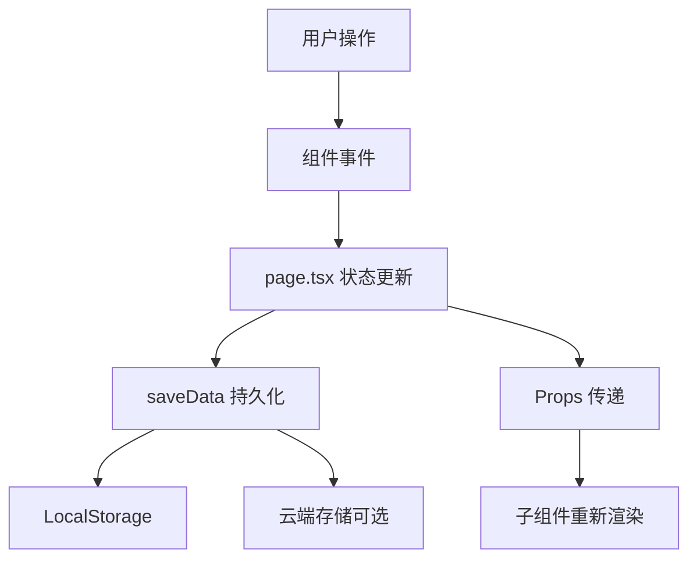

# 技术实现总览

<cite>
**本文档引用的文件**
- [src/app/page.tsx](file://src/app/page.tsx) - 主页面组件
- [src/components/FormulaSpreadsheet.tsx](file://src/components/FormulaSpreadsheet.tsx) - 电子表格组件
- [src/components/SheetTabs.tsx](file://src/components/SheetTabs.tsx) - Sheet 标签页
- [src/components/FormulaDetailModal.tsx](file://src/components/FormulaDetailModal.tsx) - 公式编辑弹窗
- [src/components/SortModal.tsx](file://src/components/SortModal.tsx) - 排序弹窗
- [src/components/AutocompleteInput.tsx](file://src/components/AutocompleteInput.tsx) - 自动补全输入
- [src/lib/types.ts](file://src/lib/types.ts) - 类型定义
- [package.json](file://package.json) - 项目依赖
</cite>

## 更新摘要
**变更内容**
- 新增电子表格视图架构说明
- 更新技术栈（TanStack Table 替代 AG Grid）
- 新增 7 层分组管理实现
- 新增云端同步和导入导出流程
- 完善核心业务逻辑说明

## 目录
1. [项目架构演进](#项目架构演进)
2. [当前技术栈](#当前技术栈)
3. [核心架构设计](#核心架构设计)
4. [电子表格实现](#电子表格实现)
5. [分组管理系统](#分组管理系统)
6. [公式编辑与管理](#公式编辑与管理)
7. [云端同步机制](#云端同步机制)
8. [用户体验优化](#用户体验优化)
9. [性能优化策略](#性能优化策略)
10. [开发最佳实践](#开发最佳实践)

## 项目架构演进

### 第一阶段：基础公式管理
- 左侧边栏 + 右侧详情的传统布局
- 基础分组（主分组 + 子分组）
- 公式列表展示
- AST 树可视化

### 第二阶段：电子表格改造
- 引入 AG Grid 实现类 Excel 界面
- Sheet 标签页替代左侧边栏
- 单元格合并（rowSpan）
- 列宽拖拽调整

### 第三阶段：功能完善
- 升级到 TanStack Table（更好的控制和性能）
- 7 层分组支持
- 自动补全输入
- 树形拖拽排序
- 云端同步集成
- 触摸板缩放支持

## 当前技术栈

### 核心框架
```json
{
  "next": "16.2.1",
  "react": "19",
  "typescript": "5.x"
}
```

### UI 和样式
```json
{
  "@tanstack/react-table": "v8",
  "tailwindcss": "3.x",
  "@radix-ui/react-*": "UI 组件基础",
  "class-variance-authority": "样式变体",
  "clsx": "条件类名",
  "tailwind-merge": "类名合并"
}
```

### 交互功能
```json
{
  "@dnd-kit/core": "拖拽核心",
  "@dnd-kit/sortable": "可排序列表",
  "@dnd-kit/utilities": "拖拽工具",
  "katex": "数学公式渲染",
  "lucide-react": "图标库",
  "sonner": "Toast 通知"
}
```

### 数据存储
```json
{
  "本地存储": "LocalStorage API",
  "云端存储": "Cloudflare Workers + KV"
}
```

## 核心架构设计

### 状态管理架构

采用 **集中式状态管理**，所有核心状态在 `page.tsx` 中管理：

```typescript
// 核心状态
const [groups, setGroups] = useState<FormulaGroup[]>([]);
const [selectedGroupId, setSelectedGroupId] = useState<string | null>(null);
const [selectedFormulaId, setSelectedFormulaId] = useState<string | null>(null);
const [columnHeaders, setColumnHeaders] = useState<ColumnHeaders>({});

// UI 状态
const [isDetailModalOpen, setIsDetailModalOpen] = useState(false);
const [detailFormula, setDetailFormula] = useState<Formula | null>(null);
const [isSortModalOpen, setIsSortModalOpen] = useState(false);
const [showCloudSyncModal, setShowCloudSyncModal] = useState(false);
```

**数据流向**:


### 组件层次结构

```
App (page.tsx)
├── Header (顶部工具栏)
│   ├── 导入/导出按钮
│   ├── 云同步按钮
│   └── 新增公式按钮
│
├── SheetTabs (Sheet 标签页)
│   ├── 拖拽排序
│   ├── 添加按钮
│   └── 排序按钮
│
├── FormulaSpreadsheet (电子表格)
│   ├── TanStack Table
│   │   ├── 分组列 L1-L6 (支持 rowSpan)
│   │   ├── 英文公式列
│   │   ├── 中文公式列
│   │   └── 操作列 (固定右侧)
│   └── 空状态提示
│
├── FormulaDetailModal (公式编辑弹窗)
│   ├── 编辑 Tab
│   │   ├── 分组字段 (AutocompleteInput)
│   │   ├── 公式输入
│   │   └── 变量映射
│   └── 预览 Tab
│       ├── 公式渲染
│       └── AST 树
│
├── SortModal (排序弹窗)
│   ├── 树形节点
│   ├── 拖拽排序
│   └── 展开/收起
│
└── CloudSyncModal (云同步弹窗)
    ├── 配置表单
    ├── 保存/加载按钮
    └── 版本历史
```

## 电子表格实现

### TanStack Table 配置

**为什么选择 TanStack Table 而非 AG Grid**:
1. 更轻量，更好的 tree-shaking
2. 完全控制渲染逻辑
3. 更好的 TypeScript 支持
4. 无样式冲突问题

**列定义策略**:
```typescript
const columns = useMemo(() => {
  const cols: ColumnDef<SpreadsheetRow>[] = [];
  
  // 1. 动态添加分组列 (L1-L6)
  const groupLevels = 6;
  for (let i = 0; i < groupLevels; i++) {
    const levelKey = `level${i + 1}Group` as keyof SpreadsheetRow;
    cols.push({
      id: levelKey,
      header: columnHeaders[levelKey] || `L${i + 1}`,
      size: columnSizes[levelKey] || 120,
      meta: { 
        groupLevel: i,
        backgroundColor: i < 2 ? 'bg-sky-100' : 'bg-sky-50'
      },
      cell: ({ row }) => {
        const value = row.original[levelKey] as string;
        const rowSpan = calculateRowSpan(row, i);
        
        return rowSpan > 0 ? (
          <div 
            className="px-3 py-2.5 font-medium"
            rowSpan={rowSpan}
          >
            {value || '-'}
          </div>
        ) : null;
      },
    });
  }
  
  // 2. 公式列
  cols.push({
    id: 'englishFormula',
    header: columnHeaders.formula || '公式 (EN)',
    size: columnSizes.formula || 300,
    cell: ({ row }) => (
      <FormulaRenderer 
        formula={row.original.englishFormula}
        variableMapping={row.original.variableFormulaMapping}
        mode="english"
      />
    ),
  });
  
  // 3. 操作列 (固定)
  cols.push({
    id: 'actions',
    header: '操作',
    size: 120,
    meta: { sticky: 'right' },
    cell: ({ row }) => (
      <div className="flex gap-1 whitespace-nowrap">
        <button onClick={() => onEdit(row.original.formula)}>编辑</button>
        <button onClick={() => onDelete(row.original.formulaId)}>删除</button>
      </div>
    ),
  });
  
  return cols;
}, [columnHeaders, columnSizes]);
```

### RowSpan 计算逻辑

**核心算法**:
```typescript
const calculateRowSpan = (
  currentRow: Row<SpreadsheetRow>, 
  levelIndex: number
): number => {
  const rows = table.getRowModel().rows;
  const currentIndex = rows.findIndex(r => r.id === currentRow.id);
  const levelKey = `level${levelIndex + 1}Group`;
  
  const currentValue = currentRow.original[levelKey] as string;
  
  // 向前检查：如果上一行值相同，返回 0（不渲染）
  if (currentIndex > 0) {
    const prevValue = rows[currentIndex - 1].original[levelKey] as string;
    if (prevValue === currentValue) {
      return 0;
    }
  }
  
  // 向后计算：统计连续相同值的行数
  let span = 1;
  for (let i = currentIndex + 1; i < rows.length; i++) {
    const nextValue = rows[i].original[levelKey] as string;
    if (nextValue === currentValue) {
      span++;
    } else {
      break;
    }
  }
  
  return span;
};
```

**关键点**:
- 只在每组第一行返回实际 span 值
- 后续行返回 0，不渲染单元格
- 浏览器自动合并单元格

### 列宽调整

**实现策略**:
```typescript
const [resizingColumn, setResizingColumn] = useState<string | null>(null);
const [resizeStartX, setResizeStartX] = useState(0);
const [resizeStartWidth, setResizeStartWidth] = useState(0);

const handleResizeStart = (columnId: string, e: React.MouseEvent) => {
  setResizingColumn(columnId);
  setResizeStartX(e.clientX);
  setResizeStartWidth(columnSizes[columnId] || 120);
};

useEffect(() => {
  if (!resizingColumn) return;
  
  const handleMouseMove = (e: MouseEvent) => {
    const diff = e.clientX - resizeStartX;
    const newWidth = Math.max(80, resizeStartWidth + diff); // 最小 80px
    
    setColumnSizes(prev => ({
      ...prev,
      [resizingColumn]: newWidth
    }));
  };
  
  const handleMouseUp = () => {
    setResizingColumn(null);
  };
  
  document.addEventListener('mousemove', handleMouseMove);
  document.addEventListener('mouseup', handleMouseUp);
  
  return () => {
    document.removeEventListener('mousemove', handleMouseMove);
    document.removeEventListener('mouseup', handleMouseUp);
  };
}, [resizingColumn, resizeStartX, resizeStartWidth]);
```

### 触摸板缩放

**实现**:
```typescript
const [zoom, setZoom] = useState(1);

const handleWheel = useCallback((e: WheelEvent) => {
  // 检测是否是触摸板手势（cmd/ctrl 键按下）
  if (e.metaKey || e.ctrlKey) {
    e.preventDefault();
    
    const delta = e.deltaY > 0 ? -0.05 : 0.05;
    const newZoom = Math.min(Math.max(0.5, zoom + delta), 2);
    
    setZoom(newZoom);
    localStorage.setItem('tableZoom', String(newZoom));
  }
}, [zoom]);

useEffect(() => {
  const tableElement = tableRef.current;
  if (!tableElement) return;
  
  tableElement.addEventListener('wheel', handleWheel, { passive: false });
  
  return () => {
    tableElement.removeEventListener('wheel', handleWheel);
  };
}, [handleWheel]);
```

## 分组管理系统

### 7 层分组结构

```typescript
interface Formula {
  // ... 其他字段
  level1Group?: string;  // 模块 (如：公共参数)
  level2Group?: string;  // 代码 (如：PARAM)
  level3Group?: string;  // 全称 (如：Interest Rate)
  level4Group?: string;  // 名称 (如：利率)
  level5Group?: string;  // 条件 (如：固定利率)
  level6Group?: string;  // 计算方 (如：甲方)
  level7Group?: string;  // 扩展 (预留)
}
```

### 分组列自定义表头

```typescript
interface ColumnHeaders {
  level1?: string;  // 默认：模块
  level2?: string;  // 默认：代码
  level3?: string;  // 默认：全称
  level4?: string;  // 默认：名称
  level5?: string;  // 默认：条件
  level6?: string;  // 默认：计算方
  formula?: string; // 默认：公式
}
```

### 智能插入逻辑

**问题**: 新增公式如果添加到末尾，可能导致 L1 值不同，无法合并单元格。

**解决方案**:
```typescript
const handleSaveFormulaDetail = (updatedFormula: Formula) => {
  if (!updatedFormula.id) {
    // 新增模式
    const newFormula = {
      ...updatedFormula,
      id: `${Date.now()}-${Math.random().toString(36).substr(2, 9)}`,
    };
    
    const updatedGroups = groups.map(group => {
      if (group.id === selectedGroupId) {
        // 找到相同 L1 的最后一条公式位置
        const newL1 = (newFormula as any).level1Group || '';
        let insertIndex = group.formulas.length;
        
        if (newL1) {
          for (let i = group.formulas.length - 1; i >= 0; i--) {
            if ((group.formulas[i] as any).level1Group === newL1) {
              insertIndex = i + 1;
              break;
            }
          }
        }
        
        // 在正确位置插入
        const newFormulas = [...group.formulas];
        newFormulas.splice(insertIndex, 0, newFormula);
        
        return { ...group, formulas: newFormulas };
      }
      return group;
    });
    
    setGroups(updatedGroups);
    saveData(updatedGroups);
  }
};
```

## 公式编辑与管理

### FormulaDetailModal 双 Tab 设计

```typescript
const [activeTab, setActiveTab] = useState<'edit' | 'preview'>('edit');

return (
  <div>
    {/* Tab 切换 */}
    <div className="flex border-b">
      <button 
        className={activeTab === 'edit' ? 'active' : ''}
        onClick={() => setActiveTab('edit')}
      >
        编辑
      </button>
      <button 
        className={activeTab === 'preview' ? 'active' : ''}
        onClick={() => setActiveTab('preview')}
      >
        预览
      </button>
    </div>
    
    {/* Tab 内容 */}
    {activeTab === 'edit' ? (
      <EditForm />
    ) : (
      <PreviewPanel />
    )}
  </div>
);
```

### AutocompleteInput 实现

**核心特性**:
1. 聚焦即展开全量选项
2. 输入时实时过滤
3. 键盘导航（上下箭头、Enter、ESC）

```typescript
const AutocompleteInput = ({ 
  value, 
  onChange, 
  options,
  placeholder 
}) => {
  const [isOpen, setIsOpen] = useState(false);
  const [inputValue, setInputValue] = useState(value);
  const [highlightedIndex, setHighlightedIndex] = useState(-1);
  
  const filteredOptions = useMemo(() => {
    return options.filter(opt => 
      opt.toLowerCase().includes(inputValue.toLowerCase())
    );
  }, [options, inputValue]);
  
  const handleFocus = () => {
    setIsOpen(true);
    setHighlightedIndex(-1);
  };
  
  const handleKeyDown = (e: React.KeyboardEvent) => {
    if (e.key === 'ArrowDown') {
      e.preventDefault();
      setHighlightedIndex(prev => 
        prev < filteredOptions.length - 1 ? prev + 1 : prev
      );
    } else if (e.key === 'ArrowUp') {
      e.preventDefault();
      setHighlightedIndex(prev => prev > 0 ? prev - 1 : -1);
    } else if (e.key === 'Enter' && highlightedIndex >= 0) {
      e.preventDefault();
      selectOption(filteredOptions[highlightedIndex]);
    } else if (e.key === 'Escape') {
      setIsOpen(false);
    }
  };
  
  return (
    <div className="relative">
      <input
        value={inputValue}
        onChange={e => setInputValue(e.target.value)}
        onFocus={handleFocus}
        onBlur={() => setTimeout(() => setIsOpen(false), 200)}
        onKeyDown={handleKeyDown}
      />
      
      {isOpen && filteredOptions.length > 0 && (
        <div className="absolute z-50 w-full bg-white border shadow-lg">
          {filteredOptions.map((option, index) => (
            <div
              key={option}
              className={index === highlightedIndex ? 'highlighted' : ''}
              onMouseDown={() => selectOption(option)}
            >
              {option}
            </div>
          ))}
        </div>
      )}
    </div>
  );
};
```

## 云端同步机制

### Cloudflare KV 集成

**架构**:
```
浏览器 <---> Cloudflare Workers <---> Cloudflare KV
     (HTTPS)           (Serverless)      (Key-Value Store)
```

**数据流**:
```typescript
// 保存到云端
const saveToCloud = async () => {
  const data = {
    groups,
    columnHeaders,
    timestamp: Date.now(),
    version: calculateVersion(groups)
  };
  
  const response = await fetch(endpoint, {
    method: 'POST',
    headers: { 'Content-Type': 'application/json' },
    body: JSON.stringify({
      key: 'formula-data',
      value: data,
      password: writePassword || undefined
    })
  });
  
  return await response.json();
};

// 从云端加载
const loadFromCloud = async () => {
  const response = await fetch(`${endpoint}?key=formula-data`);
  const result = await response.json();
  
  if (result.success && result.data) {
    onLoadData(result.data.groups);
    // 自动选中第一个
    if (result.data.groups.length > 0) {
      setSelectedGroupId(result.data.groups[0].id);
    }
  }
};
```

### 版本历史

```typescript
interface VersionInfo {
  version: number;
  timestamp: number;
  size: number;
  groups: FormulaGroup[];
}

// 保存时创建版本
const saveWithVersion = async () => {
  const versions = await getVersions();
  const newVersion = {
    version: versions.length + 1,
    timestamp: Date.now(),
    size: JSON.stringify(groups).length,
    groups
  };
  
  versions.push(newVersion);
  
  // 保留最近 10 个版本
  if (versions.length > 10) {
    versions.shift();
  }
  
  await saveVersions(versions);
};
```

## 用户体验优化

### 空状态引导

```typescript
if (!activeGroupId) {
  const hasGroups = groups.length > 0;
  
  return (
    <div className="empty-state">
      {hasGroups ? (
        <>
          <p>请选择一个 Sheet</p>
          <p>点击上方 Sheet 标签页选择要查看的内容</p>
        </>
      ) : (
        <>
          <p>暂无 Sheet</p>
          <p>点击上方 + 按钮创建第一个 Sheet</p>
        </>
      )}
    </div>
  );
}
```

### 删除确认

```typescript
const [pendingDeleteFormulaId, setPendingDeleteFormulaId] = useState<string | null>(null);

const handleDeleteFormula = (formulaId: string) => {
  setPendingDeleteFormulaId(formulaId);
};

const confirmDeleteFormula = () => {
  if (!pendingDeleteFormulaId) return;
  
  const updatedGroups = groups.map(g => ({
    ...g,
    formulas: g.formulas.filter(f => f.id !== pendingDeleteFormulaId)
  }));
  
  setGroups(updatedGroups);
  saveData(updatedGroups);
  setPendingDeleteFormulaId(null);
};

// 在 JSX 中
<ConfirmDialog
  isOpen={pendingDeleteFormulaId !== null}
  onCancel={() => setPendingDeleteFormulaId(null)}
  onConfirm={confirmDeleteFormula}
  title="确认删除"
  message="确定要删除这个公式吗？此操作无法撤销。"
  variant="danger"
/>
```

### 自动选中第一个 Sheet

```typescript
useEffect(() => {
  // 如果有 groups 但 selectedGroupId 为 null，自动选中第一个
  if (groups.length > 0 && selectedGroupId === null) {
    setSelectedGroupId(groups[0].id);
    return;
  }
  
  if (selectedGroupId) {
    localStorage.setItem('selectedGroupId', selectedGroupId);
  } else {
    localStorage.removeItem('selectedGroupId');
  }
}, [selectedGroupId, groups]);
```

## 性能优化策略

### 1. useMemo 缓存

```typescript
// 列定义缓存
const columns = useMemo(() => {
  // 复杂的列定义逻辑
}, [columnHeaders, columnSizes, groups]);

// 表格数据缓存
const data = useMemo(() => {
  return currentGroup.formulas.map(f => ({
    formulaId: f.id,
    formula: f,
    level1Group: (f as any).level1Group || '',
    // ...
  }));
}, [currentGroup]);
```

### 2. 防抖搜索

```typescript
const useDebounce = (value: string, delay: number) => {
  const [debouncedValue, setDebouncedValue] = useState(value);
  
  useEffect(() => {
    const timer = setTimeout(() => {
      setDebouncedValue(value);
    }, delay);
    
    return () => clearTimeout(timer);
  }, [value, delay]);
  
  return debouncedValue;
};

const debouncedSearch = useDebounce(searchQuery, 300);
```

### 3. 延迟渲染

```typescript
// 弹窗内容延迟渲染
{isModalOpen && (
  <Modal>
    {React.lazy(() => import('./HeavyComponent'))}
  </Modal>
)}
```

## 开发最佳实践

### 1. 类型安全

```typescript
// 使用类型断言处理动态属性
const level1Group = (formula as any).level1Group as string;

// 定义清晰的接口
interface SpreadsheetRow {
  formulaId: string;
  formula: Formula;
  [key: string]: any; // 动态分组字段
}
```

### 2. 状态提升

```typescript
// ❌ 错误：在子组件中管理共享状态
const ChildComponent = () => {
  const [groups, setGroups] = useState([]);
};

// ✅ 正确：状态提升到父组件
const ParentComponent = () => {
  const [groups, setGroups] = useState([]);
  return <ChildComponent groups={groups} onUpdate={setGroups} />;
};
```

### 3. 错误处理

```typescript
const safeJsonParse = (str: string, fallback: any) => {
  try {
    return JSON.parse(str);
  } catch (e) {
    console.error('JSON parse error:', e);
    return fallback;
  }
};
```

### 4. 本地存储同步

```typescript
// 数据变更后立即保存
const updateGroups = (newGroups: FormulaGroup[]) => {
  setGroups(newGroups);
  saveData(newGroups); // 同步到 LocalStorage
};
```

## 总结

Formula Mapper 项目通过以下核心技术实现了强大的公式管理功能：

1. **TanStack Table**: 提供灵活的表格渲染和完全的样式控制
2. **@dnd-kit**: 实现流畅的拖拽交互（Sheet 排序、树形排序）
3. **AutocompleteInput**: 提升数据录入效率
4. **Cloudflare KV**: 提供可靠的云端同步能力
5. **LocalStorage**: 确保数据持久化和离线可用

项目架构清晰，组件职责明确，为用户提供了一个直观、高效的公式管理工具。
