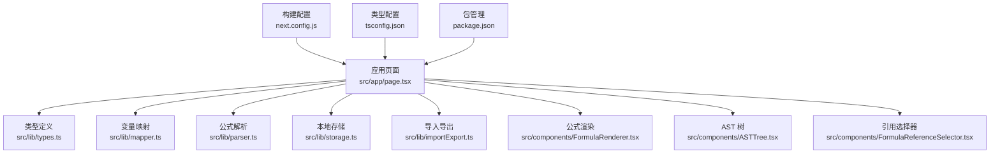
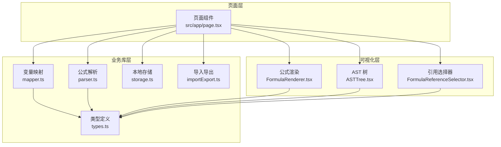
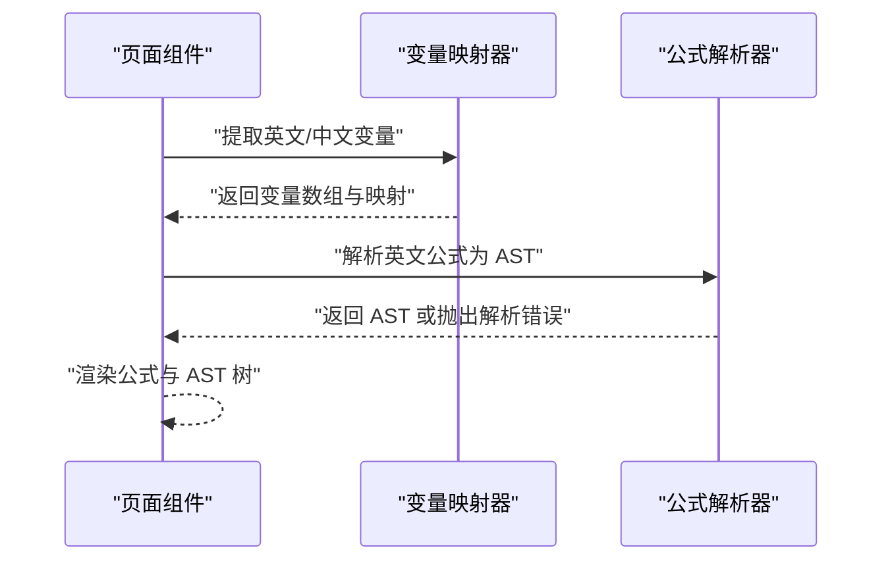
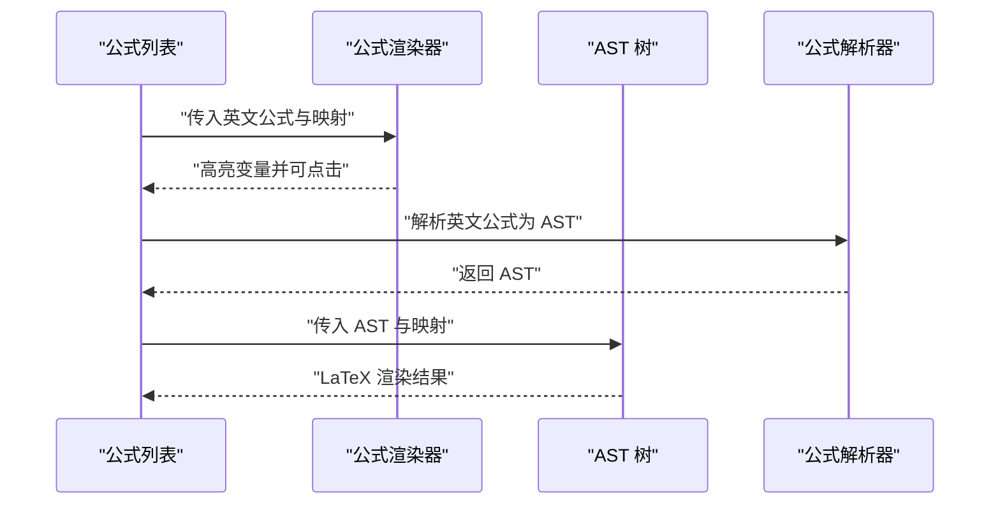
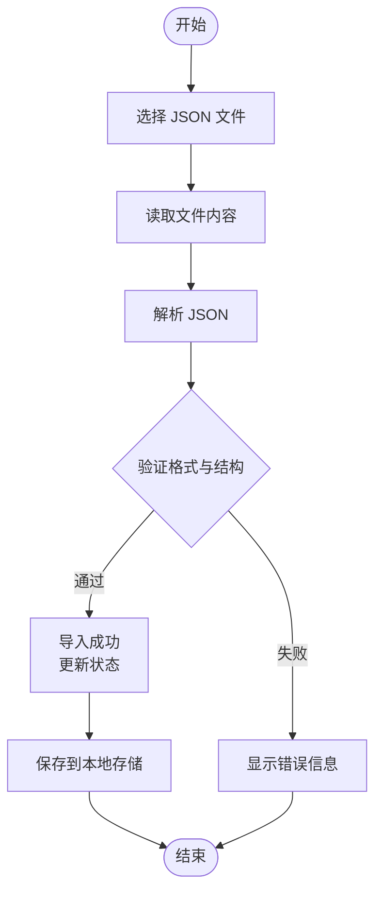
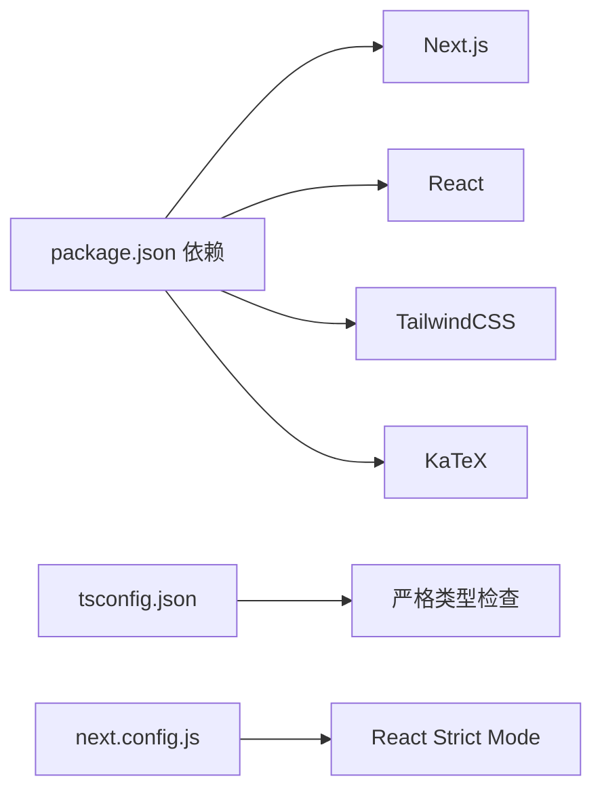

# 故障排除

<cite>
**本文引用的文件**
- [package.json](file://package.json)
- [next.config.js](file://next.config.js)
- [tsconfig.json](file://tsconfig.json)
- [src/app/page.tsx](file://src/app/page.tsx)
- [src/lib/types.ts](file://src/lib/types.ts)
- [src/lib/mapper.ts](file://src/lib/mapper.ts)
- [src/lib/parser.ts](file://src/lib/parser.ts)
- [src/lib/storage.ts](file://src/lib/storage.ts)
- [src/lib/importExport.ts](file://src/lib/importExport.ts)
- [src/lib/utils.ts](file://src/lib/utils.ts)
- [src/components/FormulaRenderer.tsx](file://src/components/FormulaRenderer.tsx)
- [src/components/ASTTree.tsx](file://src/components/ASTTree.tsx)
- [src/components/FormulaReferenceSelector.tsx](file://src/components/FormulaReferenceSelector.tsx)
- [src/components/FormulaList.tsx](file://src/components/FormulaList.tsx)
- [.claude/memory.md](file://.claude/memory.md)
</cite>

## 目录
1. [简介](#简介)
2. [项目结构](#项目结构)
3. [核心组件](#核心组件)
4. [架构总览](#架构总览)
5. [详细组件分析](#详细组件分析)
6. [依赖关系分析](#依赖关系分析)
7. [性能考虑](#性能考虑)
8. [故障排除指南](#故障排除指南)
9. [结论](#结论)
10. [附录](#附录)

## 简介
本指南面向“公式变量映射与可视化工具”的使用者与维护者，聚焦于安装、启动、运行时错误、数据导入导出、浏览器兼容性、性能问题、调试与日志分析、公式解析错误定位、存储问题以及网络/同步相关问题的排查与修复。文档以仓库现有实现为基础，结合组件职责与错误处理模式，提供可操作的排障步骤。

## 项目结构
该项目采用 Next.js 应用结构，前端逻辑集中在 src 目录：
- 应用入口与页面逻辑：src/app/page.tsx
- 核心业务库：src/lib（类型定义、变量映射、公式解析、本地存储、导入导出等）
- 可视化组件：src/components（公式渲染、AST 树、引用选择器等）

图表来源
- [src/app/page.tsx:1-707](file://src/app/page.tsx#L1-L707)
- [src/lib/types.ts:1-51](file://src/lib/types.ts#L1-L51)
- [src/lib/mapper.ts:1-89](file://src/lib/mapper.ts#L1-L89)
- [src/lib/parser.ts:1-159](file://src/lib/parser.ts#L1-L159)
- [src/lib/storage.ts:1-50](file://src/lib/storage.ts#L1-L50)
- [src/lib/importExport.ts:1-101](file://src/lib/importExport.ts#L1-L101)
- [src/components/FormulaRenderer.tsx:1-169](file://src/components/FormulaRenderer.tsx#L1-L169)
- [src/components/ASTTree.tsx:1-179](file://src/components/ASTTree.tsx#L1-L179)
- [src/components/FormulaReferenceSelector.tsx:1-132](file://src/components/FormulaReferenceSelector.tsx#L1-L132)
- [next.config.js:1-7](file://next.config.js#L1-L7)
- [tsconfig.json:1-42](file://tsconfig.json#L1-L42)
- [package.json:1-48](file://package.json#L1-L48)

章节来源
- [src/app/page.tsx:1-707](file://src/app/page.tsx#L1-L707)
- [next.config.js:1-7](file://next.config.js#L1-L7)
- [tsconfig.json:1-42](file://tsconfig.json#L1-L42)
- [package.json:1-48](file://package.json#L1-L48)

## 核心组件
- 类型系统：定义 Token、ASTNode、VariableMapping、MappingItem、Formula、SubFormula、FormulaGroup 等核心数据结构，确保跨模块一致的数据契约。
- 变量映射器：从英文/中文公式中提取变量，建立双向映射，输出标准化的映射项列表。
- 公式解析器：将字符串公式词法分析为 Token 流，再按语法规则构建 AST，提供解析错误信息。
- 本地存储：封装 localStorage 的读写与异常捕获，提供分组与公式的持久化能力。
- 导入导出：提供 JSON 结构的导出与校验，支持文件读取与下载，包含格式校验与错误抛出。
- 可视化组件：公式渲染器将公式按变量高亮与颜色区分；AST 树将 AST 转换为 LaTeX 并渲染，支持中英文切换与变量映射说明。

章节来源
- [src/lib/types.ts:1-51](file://src/lib/types.ts#L1-L51)
- [src/lib/mapper.ts:1-89](file://src/lib/mapper.ts#L1-L89)
- [src/lib/parser.ts:1-159](file://src/lib/parser.ts#L1-L159)
- [src/lib/storage.ts:1-50](file://src/lib/storage.ts#L1-L50)
- [src/lib/importExport.ts:1-101](file://src/lib/importExport.ts#L1-L101)
- [src/components/FormulaRenderer.tsx:1-169](file://src/components/FormulaRenderer.tsx#L1-L169)
- [src/components/ASTTree.tsx:1-179](file://src/components/ASTTree.tsx#L1-L179)

## 架构总览
应用采用“页面驱动 + 组件化渲染”的架构：
- 页面层负责状态管理、URL 同步、数据持久化与导入导出。
- 业务库层提供变量映射与公式解析的核心算法。
- 可视化层负责公式展示与 AST 可视化。

图表来源
- [src/app/page.tsx:1-707](file://src/app/page.tsx#L1-L707)
- [src/lib/mapper.ts:1-89](file://src/lib/mapper.ts#L1-L89)
- [src/lib/parser.ts:1-159](file://src/lib/parser.ts#L1-L159)
- [src/lib/storage.ts:1-50](file://src/lib/storage.ts#L1-L50)
- [src/lib/importExport.ts:1-101](file://src/lib/importExport.ts#L1-L101)
- [src/lib/types.ts:1-51](file://src/lib/types.ts#L1-L51)
- [src/components/FormulaRenderer.tsx:1-169](file://src/components/FormulaRenderer.tsx#L1-L169)
- [src/components/ASTTree.tsx:1-179](file://src/components/ASTTree.tsx#L1-L179)
- [src/components/FormulaReferenceSelector.tsx:1-132](file://src/components/FormulaReferenceSelector.tsx#L1-L132)

## 详细组件分析

### 变量映射与公式解析流程

图表来源
- [src/lib/mapper.ts:1-89](file://src/lib/mapper.ts#L1-L89)
- [src/lib/parser.ts:1-159](file://src/lib/parser.ts#L1-L159)
- [src/app/page.tsx:1-707](file://src/app/page.tsx#L1-L707)

章节来源
- [src/lib/mapper.ts:1-89](file://src/lib/mapper.ts#L1-L89)
- [src/lib/parser.ts:1-159](file://src/lib/parser.ts#L1-L159)
- [src/app/page.tsx:1-707](file://src/app/page.tsx#L1-L707)

### 公式渲染与引用交互

图表来源
- [src/components/FormulaList.tsx:315-358](file://src/components/FormulaList.tsx#L315-L358)
- [src/components/FormulaRenderer.tsx:1-169](file://src/components/FormulaRenderer.tsx#L1-L169)
- [src/components/ASTTree.tsx:1-179](file://src/components/ASTTree.tsx#L1-L179)
- [src/lib/parser.ts:1-159](file://src/lib/parser.ts#L1-L159)

章节来源
- [src/components/FormulaList.tsx:315-358](file://src/components/FormulaList.tsx#L315-L358)
- [src/components/FormulaRenderer.tsx:1-169](file://src/components/FormulaRenderer.tsx#L1-L169)
- [src/components/ASTTree.tsx:1-179](file://src/components/ASTTree.tsx#L1-L179)
- [src/lib/parser.ts:1-159](file://src/lib/parser.ts#L1-L159)

### 导入导出流程

图表来源
- [src/lib/importExport.ts:1-101](file://src/lib/importExport.ts#L1-L101)
- [src/app/page.tsx:371-390](file://src/app/page.tsx#L371-L390)

章节来源
- [src/lib/importExport.ts:1-101](file://src/lib/importExport.ts#L1-L101)
- [src/app/page.tsx:362-390](file://src/app/page.tsx#L362-L390)

## 依赖关系分析
- 构建与运行时依赖：Next.js、React、TailwindCSS、KaTeX 等。
- 类型与严格性：tsconfig 开启严格模式与隔离模块，提升类型安全。
- 页面路由与 URL 同步：使用 Next.js 的客户端路由与 URL 查询参数同步。

图表来源
- [package.json:1-48](file://package.json#L1-L48)
- [tsconfig.json:1-42](file://tsconfig.json#L1-L42)
- [next.config.js:1-7](file://next.config.js#L1-L7)

章节来源
- [package.json:1-48](file://package.json#L1-L48)
- [tsconfig.json:1-42](file://tsconfig.json#L1-L42)
- [next.config.js:1-7](file://next.config.js#L1-L7)

## 性能考虑
- 计算缓存
  - 引用选择器对变量提取与公式列表使用 useMemo 缓存，避免重复计算。
  - 公式渲染器对变量顺序与颜色映射进行一次性计算。
- 渲染优化
  - AST 树按需动态加载 KaTeX CSS，减少首屏负担。
  - LaTeX 渲染失败时回退为文本，保证可用性。
- 状态持久化
  - 本地存储读写封装了异常捕获，避免影响主流程。
- 建议
  - 对超大公式或大量变量场景，可考虑分页或延迟渲染。
  - 在导入导出前进行预校验，避免大规模数据导致的卡顿。

章节来源
- [src/components/FormulaReferenceSelector.tsx:1-132](file://src/components/FormulaReferenceSelector.tsx#L1-L132)
- [src/components/FormulaRenderer.tsx:1-169](file://src/components/FormulaRenderer.tsx#L1-L169)
- [src/components/ASTTree.tsx:1-179](file://src/components/ASTTree.tsx#L1-L179)
- [src/lib/storage.ts:1-50](file://src/lib/storage.ts#L1-L50)

## 故障排除指南

### 安装与启动问题
- 症状：安装依赖失败或启动时报错
  - 排查要点
    - 检查 Node.js 版本与 package.json 中的引擎要求
    - 清理缓存后重装依赖：删除 node_modules 与 lock 文件，重新安装
    - 确认网络代理设置，必要时使用镜像源
  - 相关文件
    - [package.json:1-48](file://package.json#L1-L48)
    - [next.config.js:1-7](file://next.config.js#L1-L7)
    - [tsconfig.json:1-42](file://tsconfig.json#L1-L42)

章节来源
- [package.json:1-48](file://package.json#L1-L48)
- [next.config.js:1-7](file://next.config.js#L1-L7)
- [tsconfig.json:1-42](file://tsconfig.json#L1-L42)

### 启动后页面空白或功能异常
- 症状：页面空白、无响应
  - 排查要点
    - 检查浏览器控制台是否有运行时错误
    - 确认 React Strict Mode 下的副作用与异步加载是否正确处理
    - 验证 TypeScript 配置是否启用严格模式，是否存在类型错误
  - 相关文件
    - [next.config.js:1-7](file://next.config.js#L1-L7)
    - [tsconfig.json:1-42](file://tsconfig.json#L1-L42)
    - [src/app/page.tsx:1-707](file://src/app/page.tsx#L1-L707)

章节来源
- [next.config.js:1-7](file://next.config.js#L1-L7)
- [tsconfig.json:1-42](file://tsconfig.json#L1-L42)
- [src/app/page.tsx:1-707](file://src/app/page.tsx#L1-L707)

### 公式解析错误
- 症状：公式解析报错、AST 树不显示
  - 常见原因
    - 字符串包含不可识别字符
    - 括号不匹配或表达式不完整
    - 变量名不符合规则（必须以字母开头，后续可含数字）
  - 诊断步骤
    - 在页面中查看“解析错误”提示区域
    - 检查公式字符串是否包含特殊字符或全角符号
    - 使用解析器提供的错误信息定位具体位置
  - 修复建议
    - 规范化输入，确保只使用半角字符与允许的操作符
    - 逐段测试，缩小问题范围
  - 相关文件
    - [src/lib/parser.ts:1-159](file://src/lib/parser.ts#L1-L159)
    - [src/components/FormulaList.tsx:315-358](file://src/components/FormulaList.tsx#L315-L358)

章节来源
- [src/lib/parser.ts:1-159](file://src/lib/parser.ts#L1-L159)
- [src/components/FormulaList.tsx:315-358](file://src/components/FormulaList.tsx#L315-L358)

### 公式渲染与高亮异常
- 症状：变量未高亮、颜色不正确、点击无反应
  - 排查要点
    - 检查变量映射是否正确生成
    - 确认渲染器的词法分析是否识别变量
    - 验证引用公式选择器是否正确传递映射
  - 修复建议
    - 重新生成映射，确保变量顺序与去重逻辑正常
    - 检查渲染器对变量的 token 匹配与颜色分配
  - 相关文件
    - [src/lib/mapper.ts:1-89](file://src/lib/mapper.ts#L1-L89)
    - [src/components/FormulaRenderer.tsx:1-169](file://src/components/FormulaRenderer.tsx#L1-L169)
    - [src/components/FormulaReferenceSelector.tsx:1-132](file://src/components/FormulaReferenceSelector.tsx#L1-L132)

章节来源
- [src/lib/mapper.ts:1-89](file://src/lib/mapper.ts#L1-L89)
- [src/components/FormulaRenderer.tsx:1-169](file://src/components/FormulaRenderer.tsx#L1-L169)
- [src/components/FormulaReferenceSelector.tsx:1-132](file://src/components/FormulaReferenceSelector.tsx#L1-L132)

### AST 树渲染失败
- 症状：LaTeX 渲染失败或显示“渲染失败”
  - 排查要点
    - 检查 KaTeX 是否成功加载与渲染
    - 确认 AST 转换为 LaTeX 的过程是否正确
    - 验证变量映射替换是否生效
  - 修复建议
    - 确保网络可达 CDN，或在离线环境准备本地资源
    - 捕获渲染异常并降级显示原文本
  - 相关文件
    - [src/components/ASTTree.tsx:1-179](file://src/components/ASTTree.tsx#L1-L179)

章节来源
- [src/components/ASTTree.tsx:1-179](file://src/components/ASTTree.tsx#L1-L179)

### 数据导入导出失败
- 症状：导入弹窗无响应、导出失败、提示 JSON 格式错误
  - 排查要点
    - 检查 JSON 文件格式与版本字段
    - 验证分组与公式结构字段是否完整
    - 确认 FileReader 读取是否成功
  - 修复建议
    - 使用导出的 JSON 作为模板，确保字段齐全
    - 导入前先备份当前数据，确认覆盖风险
  - 相关文件
    - [src/lib/importExport.ts:1-101](file://src/lib/importExport.ts#L1-L101)
    - [src/app/page.tsx:362-390](file://src/app/page.tsx#L362-L390)

章节来源
- [src/lib/importExport.ts:1-101](file://src/lib/importExport.ts#L1-L101)
- [src/app/page.tsx:362-390](file://src/app/page.tsx#L362-L390)

### 本地存储与数据丢失
- 症状：刷新后数据消失、分组/公式丢失
  - 排查要点
    - 检查浏览器是否禁用 localStorage
    - 确认存储键值是否被意外清理
    - 验证保存逻辑是否触发
  - 修复建议
    - 在隐私模式或无痕模式下测试，确认是权限问题
    - 使用浏览器开发者工具查看 Application/Storage 面板
  - 相关文件
    - [src/lib/storage.ts:1-50](file://src/lib/storage.ts#L1-L50)
    - [src/app/page.tsx:82-109](file://src/app/page.tsx#L82-L109)

章节来源
- [src/lib/storage.ts:1-50](file://src/lib/storage.ts#L1-L50)
- [src/app/page.tsx:82-109](file://src/app/page.tsx#L82-L109)

### URL 分享与状态不同步
- 症状：分享链接后无法定位到指定公式、切换分组后 URL 不清理
  - 排查要点
    - 检查 URL 查询参数处理逻辑
    - 确认页面挂载时是否根据 URL 参数恢复选中状态
    - 验证切换分组时是否正确清理 formula 参数
  - 修复建议
    - 在路由 push 时统一构造查询参数，避免遗漏
    - 在切换分组时显式删除 formula 参数
  - 相关文件
    - [src/app/page.tsx:13-139](file://src/app/page.tsx#L13-L139)
    - [.claude/memory.md:115-169](file://.claude/memory.md#L115-L169)

章节来源
- [src/app/page.tsx:13-139](file://src/app/page.tsx#L13-L139)
- [.claude/memory.md:115-169](file://.claude/memory.md#L115-L169)

### 浏览器兼容性问题
- 症状：部分浏览器不支持某些 API 或渲染异常
  - 排查要点
    - 检查浏览器对 localStorage、FileReader、URL.createObjectURL 的支持
    - 确认 KaTeX CDN 是否在目标网络可用
    - 验证 TypeScript/ESNext 目标与 polyfill 需求
  - 修复建议
    - 为旧版浏览器添加必要的 polyfill
    - 在网络受限环境下提供本地资源回退
  - 相关文件
    - [src/lib/storage.ts:1-50](file://src/lib/storage.ts#L1-L50)
    - [src/lib/importExport.ts:1-101](file://src/lib/importExport.ts#L1-L101)
    - [src/components/ASTTree.tsx:1-179](file://src/components/ASTTree.tsx#L1-L179)
    - [tsconfig.json:1-42](file://tsconfig.json#L1-L42)

章节来源
- [src/lib/storage.ts:1-50](file://src/lib/storage.ts#L1-L50)
- [src/lib/importExport.ts:1-101](file://src/lib/importExport.ts#L1-L101)
- [src/components/ASTTree.tsx:1-179](file://src/components/ASTTree.tsx#L1-L179)
- [tsconfig.json:1-42](file://tsconfig.json#L1-L42)

### 性能问题
- 症状：页面卡顿、渲染缓慢、内存占用高
  - 排查要点
    - 检查是否存在不必要的重复计算（如未使用 useMemo）
    - 确认大数据量下的渲染策略
  - 优化建议
    - 对变量提取与公式列表使用 useMemo 缓存
    - 对超大公式采用懒加载或分页展示
  - 相关文件
    - [src/components/FormulaReferenceSelector.tsx:1-132](file://src/components/FormulaReferenceSelector.tsx#L1-L132)
    - [src/components/FormulaRenderer.tsx:1-169](file://src/components/FormulaRenderer.tsx#L1-L169)

章节来源
- [src/components/FormulaReferenceSelector.tsx:1-132](file://src/components/FormulaReferenceSelector.tsx#L1-L132)
- [src/components/FormulaRenderer.tsx:1-169](file://src/components/FormulaRenderer.tsx#L1-L169)

### 调试技巧与日志分析
- 调试建议
  - 使用浏览器开发者工具的 Console 面板查看存储与导入导出的错误日志
  - 在关键函数处添加断点，观察状态变化与参数传递
  - 利用 React DevTools 检查组件渲染次数与 props 变更
- 日志定位
  - 本地存储读写异常会打印错误日志
  - 导入导出在格式错误时抛出明确异常信息
  - 解析器在识别不到字符或括号不匹配时抛出异常
- 相关文件
  - [src/lib/storage.ts:1-50](file://src/lib/storage.ts#L1-L50)
  - [src/lib/importExport.ts:1-101](file://src/lib/importExport.ts#L1-L101)
  - [src/lib/parser.ts:1-159](file://src/lib/parser.ts#L1-L159)

章节来源
- [src/lib/storage.ts:1-50](file://src/lib/storage.ts#L1-L50)
- [src/lib/importExport.ts:1-101](file://src/lib/importExport.ts#L1-L101)
- [src/lib/parser.ts:1-159](file://src/lib/parser.ts#L1-L159)

## 结论
本指南基于仓库现有实现，梳理了从安装启动到运行时错误、数据导入导出、浏览器兼容性、性能优化、调试与日志分析、公式解析错误定位、存储问题以及网络/同步问题的排障路径。建议在日常使用中遵循“先验证输入、再逐步缩小范围、最后对照错误信息修复”的原则，配合缓存与降级策略，提升稳定性与用户体验。

## 附录
- 快速检查清单
  - 依赖安装与版本匹配
  - 浏览器控制台无错误
  - localStorage 可用且键值正确
  - JSON 导入文件结构完整
  - 公式符合解析器规则
  - URL 参数与页面状态一致
  - KaTeX 资源可访问或本地回退