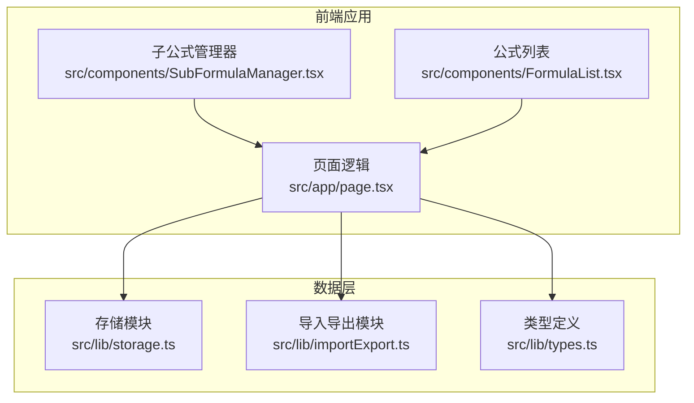
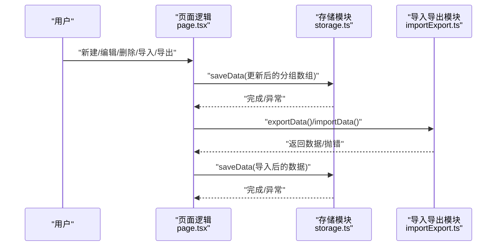
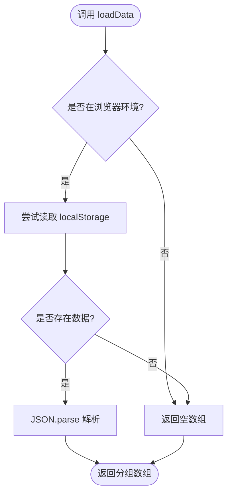
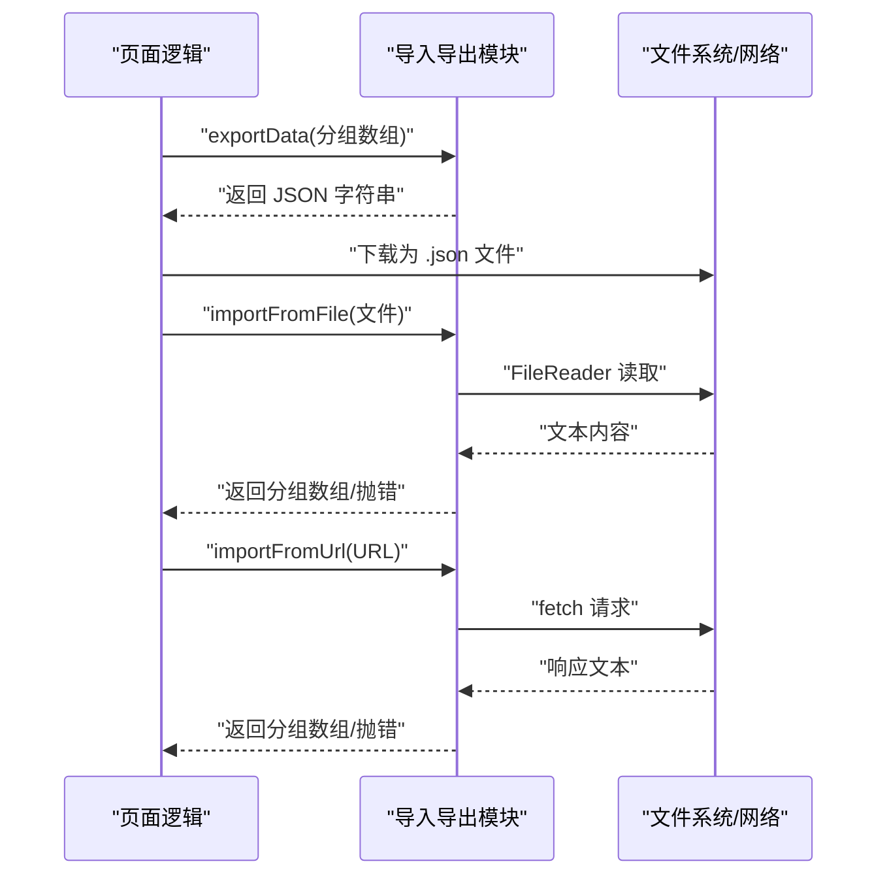
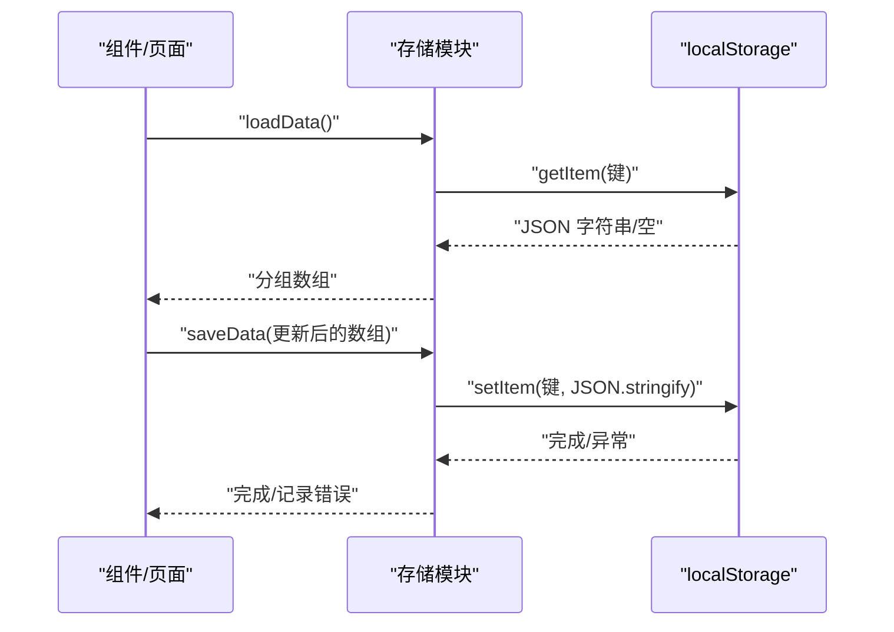
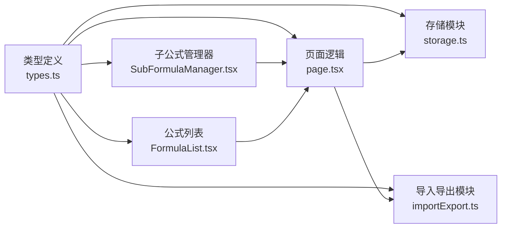

# 存储策略

<cite>
**本文档引用的文件**
- [src/lib/storage.ts](file://src/lib/storage.ts)
- [src/lib/importExport.ts](file://src/lib/importExport.ts)
- [src/lib/types.ts](file://src/lib/types.ts)
- [src/app/page.tsx](file://src/app/page.tsx)
- [src/components/SubFormulaManager.tsx](file://src/components/SubFormulaManager.tsx)
- [src/components/FormulaList.tsx](file://src/components/FormulaList.tsx)
- [package.json](file://package.json)
</cite>

## 目录
1. [简介](#简介)
2. [项目结构](#项目结构)
3. [核心组件](#核心组件)
4. [架构总览](#架构总览)
5. [详细组件分析](#详细组件分析)
6. [依赖关系分析](#依赖关系分析)
7. [性能考量](#性能考量)
8. [故障排查指南](#故障排查指南)
9. [结论](#结论)
10. [附录](#附录)

## 简介
本文件面向“公式变量映射与可视化工具”的数据存储策略，系统性阐述数据持久化实现、localStorage 使用模式、数据序列化方案、读取/写入/更新/删除流程、备份与恢复机制、数据迁移与版本升级、数据安全与隐私保护、存储容量与性能优化、数据同步与冲突处理以及存储故障的处理与恢复建议。旨在帮助开发者全面理解并遵循最佳实践。

## 项目结构
该项目采用 Next.js 前端应用，数据层主要由以下模块组成：
- 存储模块：负责本地持久化与初始化加载
- 导入导出模块：负责数据的备份、恢复与远程导入
- 类型定义：统一数据结构，保障序列化一致性
- 页面与组件：承载用户交互，驱动数据变更与持久化

图表来源
- [src/app/page.tsx:1-798](file://src/app/page.tsx#L1-L798)
- [src/lib/storage.ts:1-50](file://src/lib/storage.ts#L1-L50)
- [src/lib/importExport.ts:1-120](file://src/lib/importExport.ts#L1-L120)
- [src/lib/types.ts:1-51](file://src/lib/types.ts#L1-L51)
- [src/components/SubFormulaManager.tsx:1-201](file://src/components/SubFormulaManager.tsx#L1-L201)
- [src/components/FormulaList.tsx:1-387](file://src/components/FormulaList.tsx#L1-L387)

章节来源
- [src/app/page.tsx:1-798](file://src/app/page.tsx#L1-L798)
- [src/lib/storage.ts:1-50](file://src/lib/storage.ts#L1-L50)
- [src/lib/importExport.ts:1-120](file://src/lib/importExport.ts#L1-L120)
- [src/lib/types.ts:1-51](file://src/lib/types.ts#L1-L51)
- [src/components/SubFormulaManager.tsx:1-201](file://src/components/SubFormulaManager.tsx#L1-L201)
- [src/components/FormulaList.tsx:1-387](file://src/components/FormulaList.tsx#L1-L387)

## 核心组件
- 存储模块（localStorage）
  - 提供数据的读取、写入、分组与公式对象生成、ID 生成
  - 关键接口：loadData、saveData、createGroup、createFormula、generateId
- 导入导出模块
  - 提供数据导出为 JSON、文件下载、从文件导入、从 URL 导入、格式校验
  - 关键接口：exportData、downloadExportData、importData、importFromFile、importFromUrl
- 类型定义
  - 统一 Formula、FormulaGroup、SubFormula、VariableMapping 等数据模型
- 页面与组件
  - 页面逻辑负责初始化加载、URL 同步、用户操作触发的数据变更与持久化
  - 子公式管理器与公式列表组件负责编辑、删除、引用等操作

章节来源
- [src/lib/storage.ts:1-50](file://src/lib/storage.ts#L1-L50)
- [src/lib/importExport.ts:1-120](file://src/lib/importExport.ts#L1-L120)
- [src/lib/types.ts:1-51](file://src/lib/types.ts#L1-L51)
- [src/app/page.tsx:1-798](file://src/app/page.tsx#L1-L798)
- [src/components/SubFormulaManager.tsx:1-201](file://src/components/SubFormulaManager.tsx#L1-L201)
- [src/components/FormulaList.tsx:1-387](file://src/components/FormulaList.tsx#L1-L387)

## 架构总览
数据流自上而下分为三层：
- 用户交互层：页面与组件响应用户操作
- 应用逻辑层：页面逻辑协调存储与导入导出模块
- 数据持久化层：localStorage 作为唯一本地存储介质

图表来源
- [src/app/page.tsx:85-420](file://src/app/page.tsx#L85-L420)
- [src/lib/storage.ts:5-25](file://src/lib/storage.ts#L5-L25)
- [src/lib/importExport.ts:12-119](file://src/lib/importExport.ts#L12-L119)

## 详细组件分析

### 存储模块（localStorage）
- 数据键与序列化
  - 使用单一键进行整包序列化与反序列化，键值为固定字符串
  - 写入前 JSON.stringify，读取后 JSON.parse
- 初始化与容错
  - 读取失败时返回空数组；写入失败时记录错误日志
  - 在非浏览器环境（如 SSR）直接返回空数组
- 对象生成与 ID
  - createGroup/createFormula 生成带时间戳与随机串的稳定 ID
  - generateId 保证跨会话唯一性

图表来源
- [src/lib/storage.ts:5-15](file://src/lib/storage.ts#L5-L15)

章节来源
- [src/lib/storage.ts:1-50](file://src/lib/storage.ts#L1-L50)

### 导入导出模块
- 导出
  - 包裹版本号、导出时间与分组数组，输出标准 JSON 字符串
  - 提供下载为文件的能力，便于备份
- 导入
  - 从文件读取文本并解析，严格校验版本与结构
  - 从 URL 导入时进行网络请求与状态码校验
- 格式校验
  - 校验顶层字段与分组/公式结构完整性，抛出明确错误

图表来源
- [src/lib/importExport.ts:12-119](file://src/lib/importExport.ts#L12-L119)

章节来源
- [src/lib/importExport.ts:1-120](file://src/lib/importExport.ts#L1-L120)

### 页面与组件（数据变更与持久化）
- 初始化加载
  - 组件挂载时调用 loadData 恢复分组数据，并从 localStorage 恢复选中分组与侧边栏状态
- 数据变更
  - 新建/编辑/删除分组与公式均通过更新内存状态并立即调用 saveData 持久化
  - 子公式编辑通过子公式管理器回调更新父级表单，最终在保存时持久化
- URL 同步
  - 选中公式时更新 URL 查询参数，切换分组时清理参数，保持 UI 与 URL 的一致

图表来源
- [src/app/page.tsx:85-133](file://src/app/page.tsx#L85-L133)
- [src/lib/storage.ts:5-25](file://src/lib/storage.ts#L5-L25)

章节来源
- [src/app/page.tsx:1-798](file://src/app/page.tsx#L1-L798)
- [src/components/SubFormulaManager.tsx:1-201](file://src/components/SubFormulaManager.tsx#L1-L201)
- [src/components/FormulaList.tsx:1-387](file://src/components/FormulaList.tsx#L1-L387)

## 依赖关系分析
- 页面逻辑依赖存储模块与导入导出模块，同时依赖类型定义
- 子公式管理器与公式列表组件依赖类型定义与页面逻辑传递的状态与回调
- 存储模块与导入导出模块均依赖类型定义以确保数据结构一致

图表来源
- [src/lib/types.ts:1-51](file://src/lib/types.ts#L1-L51)
- [src/lib/storage.ts:1-50](file://src/lib/storage.ts#L1-L50)
- [src/lib/importExport.ts:1-120](file://src/lib/importExport.ts#L1-L120)
- [src/app/page.tsx:1-798](file://src/app/page.tsx#L1-L798)
- [src/components/SubFormulaManager.tsx:1-201](file://src/components/SubFormulaManager.tsx#L1-L201)
- [src/components/FormulaList.tsx:1-387](file://src/components/FormulaList.tsx#L1-L387)

章节来源
- [src/lib/types.ts:1-51](file://src/lib/types.ts#L1-L51)
- [src/lib/storage.ts:1-50](file://src/lib/storage.ts#L1-L50)
- [src/lib/importExport.ts:1-120](file://src/lib/importExport.ts#L1-L120)
- [src/app/page.tsx:1-798](file://src/app/page.tsx#L1-L798)
- [src/components/SubFormulaManager.tsx:1-201](file://src/components/SubFormulaManager.tsx#L1-L201)
- [src/components/FormulaList.tsx:1-387](file://src/components/FormulaList.tsx#L1-L387)

## 性能考量
- 写入频率与批量更新
  - 每次用户操作均触发 saveData，可能产生频繁写入。建议在高频变更场景下合并更新批次，减少 localStorage 写入次数
- 序列化成本
  - 大型数据集 JSON.stringify/parse 成本较高，建议控制单次写入数据体量，必要时拆分存储或延迟写入
- UI 响应
  - 读取与写入均在主线程执行，建议在大数据量场景下增加节流/防抖与异步处理，避免阻塞渲染
- 容量与配额
  - localStorage 容量通常为数 MB 级别，超出时写入会失败。建议定期清理冗余数据并提供容量预警

[本节为通用性能建议，不直接分析具体文件，故无章节来源]

## 故障排查指南
- 读取失败
  - 现象：初始化为空数据
  - 排查：检查浏览器环境判断、localStorage 可用性、数据格式是否被篡改
- 写入失败
  - 现象：控制台打印错误日志
  - 排查：容量不足、浏览器禁用 localStorage、并发写入冲突
- 导入失败
  - 现象：弹出错误提示
  - 排查：JSON 格式错误、版本字段缺失、结构校验失败、网络请求异常
- URL 导入失败
  - 现象：网络错误提示
  - 排查：URL 不可达、HTTP 状态码异常、响应体非文本

章节来源
- [src/lib/storage.ts:5-25](file://src/lib/storage.ts#L5-L25)
- [src/lib/importExport.ts:43-119](file://src/lib/importExport.ts#L43-L119)
- [src/app/page.tsx:374-420](file://src/app/page.tsx#L374-L420)

## 结论
本项目采用 localStorage 作为单一本地存储介质，结合严格的导入导出与格式校验，实现了数据的可靠持久化与可移植备份。通过页面逻辑与组件协同，实现了完整的 CRUD 流程与 URL 同步。建议在后续版本中引入版本化与增量更新、容量监控与清理策略、以及更完善的错误恢复与回滚机制，以进一步提升稳定性与用户体验。

[本节为总结性内容，不直接分析具体文件，故无章节来源]

## 附录

### 数据读取、写入、更新、删除操作流程
- 读取：页面挂载时 loadData，恢复分组与 UI 状态
- 写入：每次数据变更后立即 saveData
- 更新：编辑公式/分组时更新内存状态并持久化
- 删除：删除分组/公式后更新内存状态并持久化

章节来源
- [src/app/page.tsx:85-420](file://src/app/page.tsx#L85-L420)
- [src/lib/storage.ts:5-25](file://src/lib/storage.ts#L5-L25)

### 数据备份与恢复机制
- 备份：导出为 JSON 文件，包含版本与导出时间
- 恢复：从文件导入或从 URL 导入，导入前进行格式与结构校验
- 建议：定期导出备份，保留多份历史版本文件

章节来源
- [src/lib/importExport.ts:12-119](file://src/lib/importExport.ts#L12-L119)

### 数据迁移与版本升级
- 版本标识：导出数据包含版本字段
- 升级策略：在导入时检测版本，若版本过旧则提示升级或提供转换脚本
- 迁移步骤：解析旧版数据 -> 转换结构 -> 写入新版格式 -> 保存

章节来源
- [src/lib/importExport.ts:3-7](file://src/lib/importExport.ts#L3-L7)

### 数据安全与隐私保护
- 本地存储：数据仅存在于用户本地，无需传输
- 导入风险：仅信任可信来源的 JSON 文件或 URL
- 建议：对敏感数据进行脱敏处理，避免在 JSON 中存储机密信息

[本节为通用安全建议，不直接分析具体文件，故无章节来源]

### 存储容量限制与性能优化
- 容量限制：localStorage 容量有限，超出时写入失败
- 优化策略：减少单次写入数据量、合并更新批次、延迟写入、定期清理

[本节为通用性能建议，不直接分析具体文件，故无章节来源]

### 数据同步与冲突解决机制
- 同步点：URL 与本地状态同步
- 冲突处理：页面根据 URL 参数覆盖选中状态；本地状态变更时更新 URL；删除公式时清理 URL 参数

章节来源
- [src/app/page.tsx:25-52](file://src/app/page.tsx#L25-L52)
- [src/app/page.tsx:114-120](file://src/app/page.tsx#L114-L120)

### 存储故障处理与恢复
- 故障类型：读取失败、写入失败、导入失败
- 处理建议：捕获异常、记录日志、引导用户导出备份、提供重置选项

章节来源
- [src/lib/storage.ts:5-25](file://src/lib/storage.ts#L5-L25)
- [src/lib/importExport.ts:43-119](file://src/lib/importExport.ts#L43-L119)