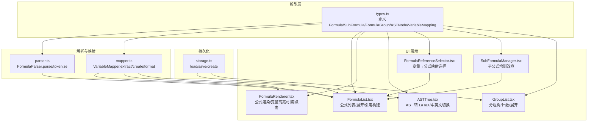
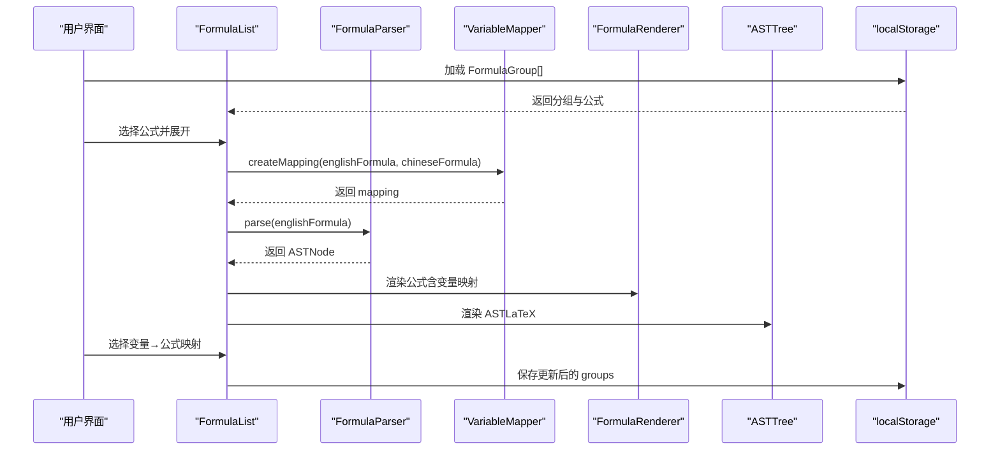
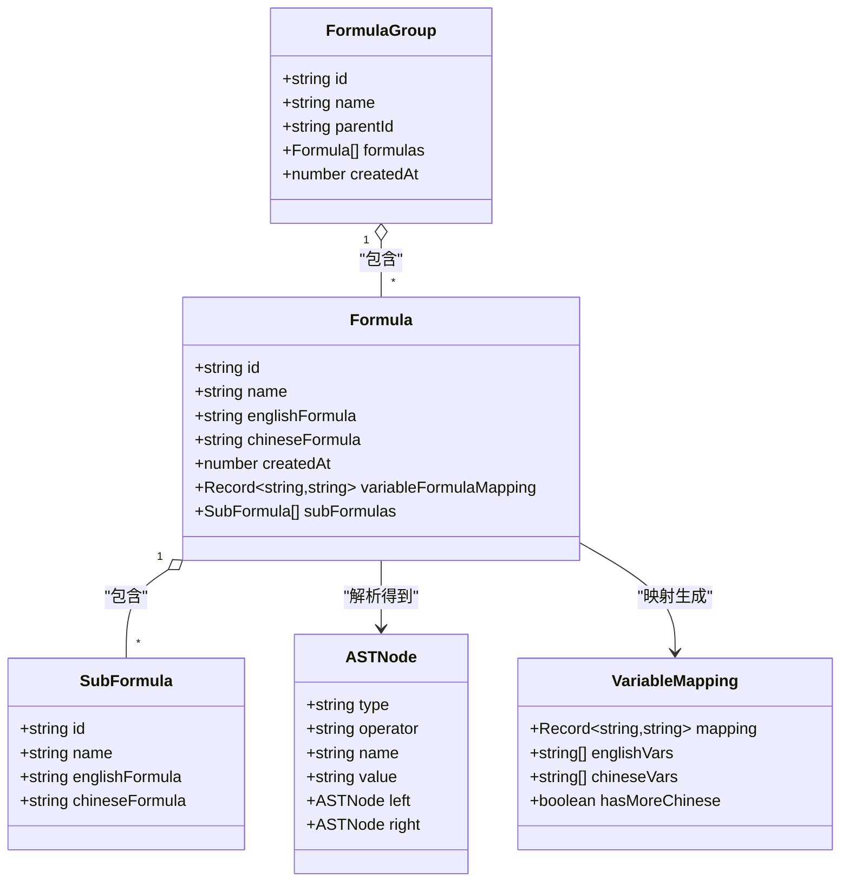
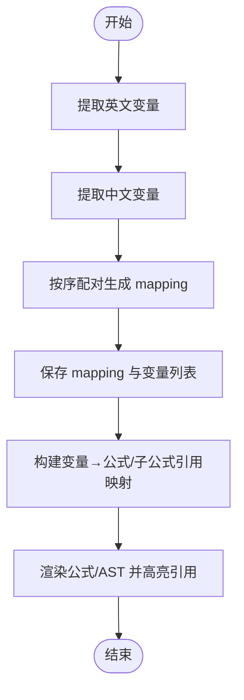
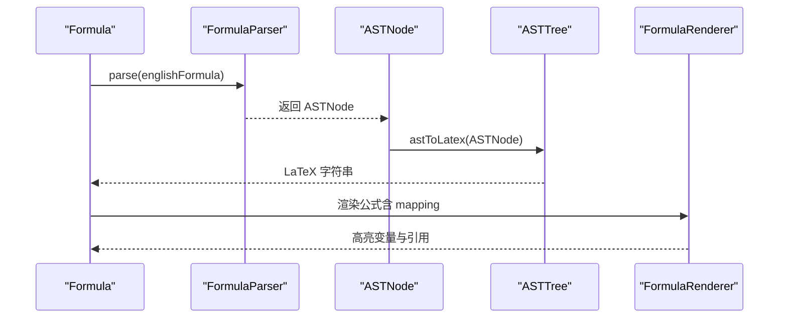
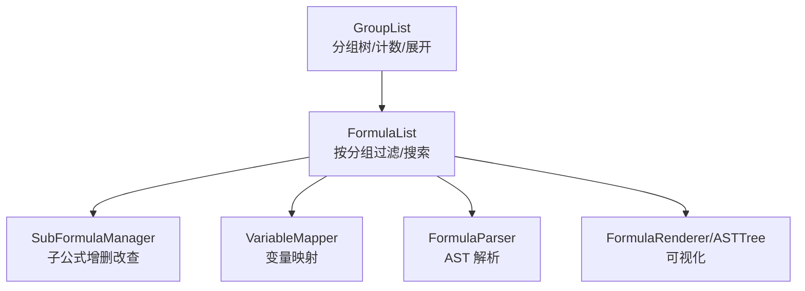
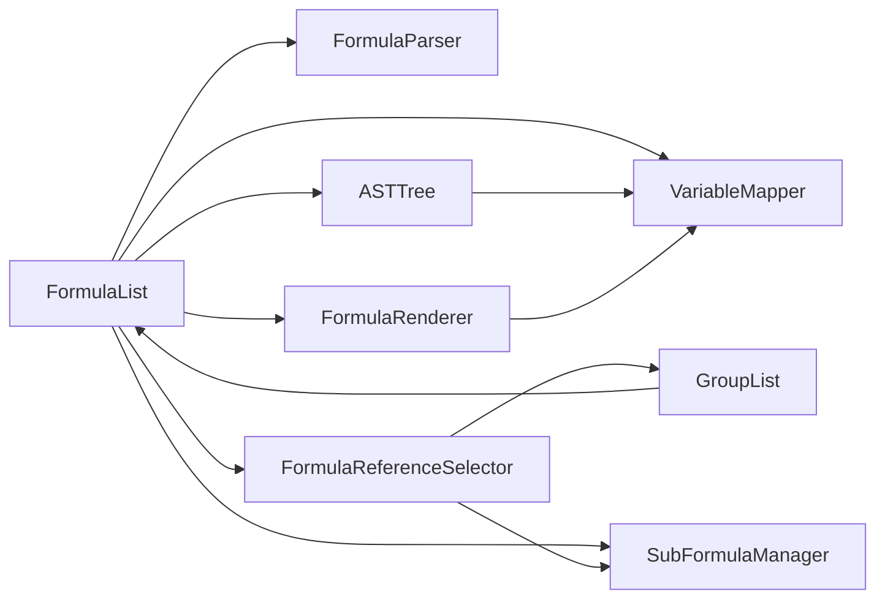

# 数据关系模型

<cite>
**本文引用的文件**
- [src/lib/types.ts](file://src/lib/types.ts)
- [src/lib/mapper.ts](file://src/lib/mapper.ts)
- [src/lib/parser.ts](file://src/lib/parser.ts)
- [src/lib/storage.ts](file://src/lib/storage.ts)
- [src/components/FormulaList.tsx](file://src/components/FormulaList.tsx)
- [src/components/FormulaRenderer.tsx](file://src/components/FormulaRenderer.tsx)
- [src/components/ASTTree.tsx](file://src/components/ASTTree.tsx)
- [src/components/FormulaReferenceSelector.tsx](file://src/components/FormulaReferenceSelector.tsx)
- [src/components/SubFormulaManager.tsx](file://src/components/SubFormulaManager.tsx)
- [src/components/GroupList.tsx](file://src/components/GroupList.tsx)
</cite>

## 目录
1. [简介](#简介)
2. [项目结构](#项目结构)
3. [核心数据模型](#核心数据模型)
4. [架构总览](#架构总览)
5. [详细组件分析](#详细组件分析)
6. [依赖关系分析](#依赖关系分析)
7. [性能考量](#性能考量)
8. [故障排查指南](#故障排查指南)
9. [结论](#结论)
10. [附录](#附录)

## 简介
本文件面向“公式变量映射与可视化工具”的数据关系模型，系统性阐述 Formula、SubFormula、FormulaGroup 三者之间的层次与依赖关系；解释 Formula 与 VariableMapping 的映射机制；梳理 ASTNode 与 Formula 的解析关系；给出数据模型的完整性约束与业务规则；并通过 ER 图/关系图直观展示模型结构；最后提供数据查询与遍历的最佳实践、多场景使用方式与性能优化建议，帮助开发者全面理解整体架构与设计思路。

## 项目结构
该项目采用前端驱动的数据模型与可视化方案，核心数据模型位于类型定义文件中，解析与映射逻辑由独立模块实现，UI 组件负责展示与交互。关键目录与文件如下：
- 类型与模型：src/lib/types.ts
- 解析器：src/lib/parser.ts
- 变量映射器：src/lib/mapper.ts
- 本地存储：src/lib/storage.ts
- 列表与渲染：src/components/FormulaList.tsx、FormulaRenderer.tsx、ASTTree.tsx
- 引用选择器：src/components/FormulaReferenceSelector.tsx
- 子公式管理：src/components/SubFormulaManager.tsx
- 分组树：src/components/GroupList.tsx

图表来源
- [src/lib/types.ts:1-51](file://src/lib/types.ts#L1-L51)
- [src/lib/parser.ts:1-159](file://src/lib/parser.ts#L1-L159)
- [src/lib/mapper.ts:1-89](file://src/lib/mapper.ts#L1-L89)
- [src/lib/storage.ts:1-50](file://src/lib/storage.ts#L1-L50)
- [src/components/FormulaList.tsx:1-387](file://src/components/FormulaList.tsx#L1-L387)
- [src/components/FormulaRenderer.tsx:1-169](file://src/components/FormulaRenderer.tsx#L1-L169)
- [src/components/ASTTree.tsx:1-179](file://src/components/ASTTree.tsx#L1-L179)
- [src/components/FormulaReferenceSelector.tsx:1-132](file://src/components/FormulaReferenceSelector.tsx#L1-L132)
- [src/components/SubFormulaManager.tsx:1-201](file://src/components/SubFormulaManager.tsx#L1-L201)
- [src/components/GroupList.tsx:1-294](file://src/components/GroupList.tsx#L1-L294)

章节来源
- [src/lib/types.ts:1-51](file://src/lib/types.ts#L1-L51)
- [src/lib/parser.ts:1-159](file://src/lib/parser.ts#L1-L159)
- [src/lib/mapper.ts:1-89](file://src/lib/mapper.ts#L1-L89)
- [src/lib/storage.ts:1-50](file://src/lib/storage.ts#L1-L50)
- [src/components/FormulaList.tsx:1-387](file://src/components/FormulaList.tsx#L1-L387)
- [src/components/FormulaRenderer.tsx:1-169](file://src/components/FormulaRenderer.tsx#L1-L169)
- [src/components/ASTTree.tsx:1-179](file://src/components/ASTTree.tsx#L1-L179)
- [src/components/FormulaReferenceSelector.tsx:1-132](file://src/components/FormulaReferenceSelector.tsx#L1-L132)
- [src/components/SubFormulaManager.tsx:1-201](file://src/components/SubFormulaManager.tsx#L1-L201)
- [src/components/GroupList.tsx:1-294](file://src/components/GroupList.tsx#L1-L294)

## 核心数据模型
本节从实体、属性、关系与约束四个维度描述数据模型。

- 实体与属性
  - Formula（公式）
    - id: 字符串，唯一标识
    - name: 字符串，公式名称
    - englishFormula: 字符串，英文公式文本
    - chineseFormula: 字符串，中文公式文本
    - createdAt: 数字，时间戳
    - variableFormulaMapping?: 对象，变量到公式/子公式的映射（键为变量名，值为公式ID或“sub_”前缀的子公式ID）
    - subFormulas?: 子公式数组
  - SubFormula（子公式）
    - id: 字符串，唯一标识
    - name: 字符串，子公式名称
    - englishFormula: 字符串，英文公式文本
    - chineseFormula: 字符串，中文公式文本
  - FormulaGroup（公式分组）
    - id: 字符串，唯一标识
    - name: 字符串，分组名称
    - parentId: 字符串|null，父分组ID，null 表示顶级分组
    - formulas: Formula[]，该分组下的公式集合
    - createdAt: 数字，时间戳
  - ASTNode（抽象语法树节点）
    - type: 'operator'|'variable'|'number'
    - operator?: 字符串，运算符
    - name?: 字符串，变量名
    - value?: 字符串，数值
    - left?: ASTNode，左子树
    - right?: ASTNode，右子树
  - VariableMapping（变量映射）
    - mapping: 记录对象，英文变量到中文变量的映射
    - englishVars: 英文变量数组
    - chineseVars: 中文变量数组
    - hasMoreChinese: 布尔，中文变量数量是否多于英文变量

- 关系与层次
  - FormulaGroup 与 Formula：一对多（一个分组包含多个公式）
  - Formula 与 SubFormula：聚合关系（一个公式可包含多个子公式）
  - Formula 与 ASTNode：解析关系（Formula 的 englishFormula 经解析器生成 ASTNode）
  - Formula 与 VariableMapping：映射关系（通过变量提取与映射生成）

- 完整性约束与业务规则
  - 唯一性
    - 所有实体的 id 必须全局唯一（由存储层生成策略保证）
  - 层次约束
    - FormulaGroup.parentId 指向存在的父分组；根分组 parentId 为 null
  - 引用一致性
    - Formula.variableFormulaMapping 的值必须对应某 Formula.id 或以“sub_”前缀的 SubFormula.id
  - 文本规范
    - Formula.englishFormula 与 chineseFormula 应满足解析器与映射器的输入要求（变量命名、运算符、括号等）
  - 结构一致性
    - ASTNode 的 left/right 必须为 ASTNode 或 null；operator 仅在 operator 类型节点有效

章节来源
- [src/lib/types.ts:27-50](file://src/lib/types.ts#L27-L50)
- [src/lib/types.ts:6-13](file://src/lib/types.ts#L6-L13)
- [src/lib/types.ts:15-20](file://src/lib/types.ts#L15-L20)

## 架构总览
下图展示了数据模型在运行时的交互流程：FormulaList 负责加载与筛选；FormulaRenderer 与 ASTTree 负责可视化；VariableMapper 与 FormulaParser 负责变量映射与 AST 解析；FormulaReferenceSelector 负责建立变量到公式/子公式的映射；SubFormulaManager 与 GroupList 负责维护子公式与分组树。

图表来源
- [src/components/FormulaList.tsx:169-192](file://src/components/FormulaList.tsx#L169-L192)
- [src/lib/parser.ts:12-22](file://src/lib/parser.ts#L12-L22)
- [src/lib/mapper.ts:52-70](file://src/lib/mapper.ts#L52-L70)
- [src/components/FormulaRenderer.tsx:27-115](file://src/components/FormulaRenderer.tsx#L27-L115)
- [src/components/ASTTree.tsx:26-61](file://src/components/ASTTree.tsx#L26-L61)
- [src/lib/storage.ts:5-25](file://src/lib/storage.ts#L5-L25)

## 详细组件分析

### 实体类图（数据模型）

图表来源
- [src/lib/types.ts:27-50](file://src/lib/types.ts#L27-L50)
- [src/lib/types.ts:6-13](file://src/lib/types.ts#L6-L13)
- [src/lib/types.ts:15-20](file://src/lib/types.ts#L15-L20)

章节来源
- [src/lib/types.ts:27-50](file://src/lib/types.ts#L27-L50)
- [src/lib/types.ts:6-13](file://src/lib/types.ts#L6-L13)
- [src/lib/types.ts:15-20](file://src/lib/types.ts#L15-L20)

### 变量映射机制与引用关系
- 变量提取
  - VariableMapper 从英文/中文公式中分别提取变量集合，并去重排序
- 映射生成
  - createMapping 将英文变量与中文变量一一对应，若中文变量不足则标注“未定义”
- 引用映射
  - Formula.variableFormulaMapping 将变量映射到具体 Formula.id 或“sub_”前缀的 SubFormula.id
  - FormulaList 在展开时根据 mapping 与 variableFormulaMapping 构建 formulaReferences，用于渲染引用高亮与点击跳转

图表来源
- [src/lib/mapper.ts:4-70](file://src/lib/mapper.ts#L4-L70)
- [src/components/FormulaList.tsx:194-228](file://src/components/FormulaList.tsx#L194-L228)
- [src/components/FormulaRenderer.tsx:58-92](file://src/components/FormulaRenderer.tsx#L58-L92)

章节来源
- [src/lib/mapper.ts:4-70](file://src/lib/mapper.ts#L4-L70)
- [src/components/FormulaList.tsx:194-228](file://src/components/FormulaList.tsx#L194-L228)
- [src/components/FormulaRenderer.tsx:58-92](file://src/components/FormulaRenderer.tsx#L58-L92)

### AST 解析与可视化
- 解析流程
  - FormulaParser 将英文公式切分为 Token 流，再递归下降解析为 ASTNode
  - ASTNode 支持变量、数字与运算符（含加减乘除），并支持多种括号
- 可视化流程
  - ASTTree 将 ASTNode 转换为 LaTeX 表达式，并支持中英文切换
  - FormulaRenderer 将公式文本按 Token 渲染为带颜色的变量块，支持引用提示与点击

图表来源
- [src/lib/parser.ts:12-158](file://src/lib/parser.ts#L12-L158)
- [src/components/ASTTree.tsx:26-61](file://src/components/ASTTree.tsx#L26-L61)
- [src/components/FormulaRenderer.tsx:27-115](file://src/components/FormulaRenderer.tsx#L27-L115)

章节来源
- [src/lib/parser.ts:12-158](file://src/lib/parser.ts#L12-L158)
- [src/components/ASTTree.tsx:26-61](file://src/components/ASTTree.tsx#L26-L61)
- [src/components/FormulaRenderer.tsx:27-115](file://src/components/FormulaRenderer.tsx#L27-L115)

### 子公式与分组管理
- 子公式管理
  - SubFormulaManager 提供子公式的增删改查与表单校验
- 分组树
  - GroupList 构建分组树，支持展开/折叠、统计公式数量、编辑/删除分组
- 公式列表
  - FormulaList 支持按分组过滤、搜索、展开查看变量映射与 AST

图表来源
- [src/components/GroupList.tsx:33-196](file://src/components/GroupList.tsx#L33-L196)
- [src/components/FormulaList.tsx:47-79](file://src/components/FormulaList.tsx#L47-L79)
- [src/components/SubFormulaManager.tsx:26-74](file://src/components/SubFormulaManager.tsx#L26-L74)
- [src/components/FormulaRenderer.tsx:27-115](file://src/components/FormulaRenderer.tsx#L27-L115)
- [src/components/ASTTree.tsx:26-61](file://src/components/ASTTree.tsx#L26-L61)

章节来源
- [src/components/GroupList.tsx:33-196](file://src/components/GroupList.tsx#L33-L196)
- [src/components/FormulaList.tsx:47-79](file://src/components/FormulaList.tsx#L47-L79)
- [src/components/SubFormulaManager.tsx:26-74](file://src/components/SubFormulaManager.tsx#L26-L74)
- [src/components/FormulaRenderer.tsx:27-115](file://src/components/FormulaRenderer.tsx#L27-L115)
- [src/components/ASTTree.tsx:26-61](file://src/components/ASTTree.tsx#L26-L61)

## 依赖关系分析
- 组件耦合
  - FormulaList 依赖 VariableMapper、FormulaParser、FormulaRenderer、ASTTree、FormulaReferenceSelector、SubFormulaManager、GroupList
  - FormulaRenderer 与 ASTTree 依赖 VariableMapping 的 mapping
  - FormulaReferenceSelector 依赖 FormulaGroup 与 SubFormula，用于构建变量→公式/子公式的下拉选项
- 外部依赖
  - ASTTree 依赖 KaTeX 动态加载样式与渲染
  - storage.ts 依赖浏览器 localStorage

图表来源
- [src/components/FormulaList.tsx:1-387](file://src/components/FormulaList.tsx#L1-L387)
- [src/components/FormulaRenderer.tsx:1-169](file://src/components/FormulaRenderer.tsx#L1-L169)
- [src/components/ASTTree.tsx:1-179](file://src/components/ASTTree.tsx#L1-L179)
- [src/components/FormulaReferenceSelector.tsx:1-132](file://src/components/FormulaReferenceSelector.tsx#L1-L132)
- [src/components/SubFormulaManager.tsx:1-201](file://src/components/SubFormulaManager.tsx#L1-L201)
- [src/components/GroupList.tsx:1-294](file://src/components/GroupList.tsx#L1-L294)

章节来源
- [src/components/FormulaList.tsx:1-387](file://src/components/FormulaList.tsx#L1-L387)
- [src/components/FormulaRenderer.tsx:1-169](file://src/components/FormulaRenderer.tsx#L1-L169)
- [src/components/ASTTree.tsx:1-179](file://src/components/ASTTree.tsx#L1-L179)
- [src/components/FormulaReferenceSelector.tsx:1-132](file://src/components/FormulaReferenceSelector.tsx#L1-L132)
- [src/components/SubFormulaManager.tsx:1-201](file://src/components/SubFormulaManager.tsx#L1-L201)
- [src/components/GroupList.tsx:1-294](file://src/components/GroupList.tsx#L1-L294)

## 性能考量
- 计算缓存
  - FormulaReferenceSelector 使用 useMemo 缓存变量提取与公式列表，避免重复计算
  - FormulaList 在展开时才解析 AST 与生成 mapping，收起时清理状态，减少不必要的渲染
- 渲染优化
  - ASTTree 动态加载 KaTeX 样式，避免首屏阻塞
  - FormulaRenderer 为变量分配颜色索引，按出现顺序去重，提升视觉一致性
- 数据遍历
  - GroupList 通过递归构建子分组映射与深度优先计数，复杂度 O(N)
  - FormulaList 通过扁平化 allFormulasWithGroup 与 Map 查询，提高查找效率
- 存储与序列化
  - storage.ts 使用 JSON 序列化/反序列化，注意大数据量时的内存占用与性能

章节来源
- [src/components/FormulaReferenceSelector.tsx:21-34](file://src/components/FormulaReferenceSelector.tsx#L21-L34)
- [src/components/FormulaList.tsx:169-192](file://src/components/FormulaList.tsx#L169-L192)
- [src/components/ASTTree.tsx:15-24](file://src/components/ASTTree.tsx#L15-L24)
- [src/components/FormulaRenderer.tsx:35-45](file://src/components/FormulaRenderer.tsx#L35-L45)
- [src/components/GroupList.tsx:43-53](file://src/components/GroupList.tsx#L43-L53)
- [src/lib/storage.ts:5-25](file://src/lib/storage.ts#L5-L25)

## 故障排查指南
- 解析错误
  - 现象：展开公式时报错
  - 排查：检查 englishFormula 是否符合解析器规则（变量命名、运算符、括号闭合）
  - 参考：FormulaParser.parse 与 tokenize 的错误抛出点
- 变量映射异常
  - 现象：变量未正确高亮或引用缺失
  - 排查：确认 VariableMapper.createMapping 的输入与 mapping 输出；检查 Formula.variableFormulaMapping 的键值一致性
- 引用公式无效
  - 现象：点击变量无响应或引用显示为空
  - 排查：确认 variableFormulaMapping 的值是否为有效 Formula.id 或“sub_”前缀的 SubFormula.id；检查 FormulaList 的引用构建逻辑
- AST 渲染失败
  - 现象：LaTeX 渲染报错或空白
  - 排查：确认 KaTeX 加载成功；检查 astToLatex 的输出是否包含非法字符；查看 ASTTree 的错误提示

章节来源
- [src/lib/parser.ts:12-22](file://src/lib/parser.ts#L12-L22)
- [src/lib/mapper.ts:52-70](file://src/lib/mapper.ts#L52-L70)
- [src/components/FormulaList.tsx:194-228](file://src/components/FormulaList.tsx#L194-L228)
- [src/components/ASTTree.tsx:124-142](file://src/components/ASTTree.tsx#L124-L142)

## 结论
本数据关系模型围绕 Formula、SubFormula、FormulaGroup 构建，辅以 VariableMapping 与 ASTNode 实现变量映射与可视化。通过清晰的层次关系、严格的引用一致性与合理的 UI 交互，实现了从数据到可视化的完整闭环。遵循本文的最佳实践与性能建议，可在不同场景下高效地使用与扩展该模型。

## 附录
- 数据查询与遍历最佳实践
  - 分组树：使用 Map 缓存父子关系，递归展开与计数，复杂度 O(N)
  - 公式列表：先按分组过滤，再按名称搜索，避免全量扫描
  - 引用映射：在 Formula 展开时构建，点击引用时即时定位目标
- 不同场景使用方式
  - 新建/编辑：通过 SubFormulaManager 与 FormulaReferenceSelector 组合使用
  - 查看/对比：使用 ASTTree 的中英文切换与 FormulaRenderer 的变量高亮
  - 导入/导出：基于 localStorage 的 JSON 结构进行导入导出
- 设计要点回顾
  - 唯一标识与层次约束
  - 变量映射与引用一致性的双向验证
  - 可视化组件的懒加载与缓存策略