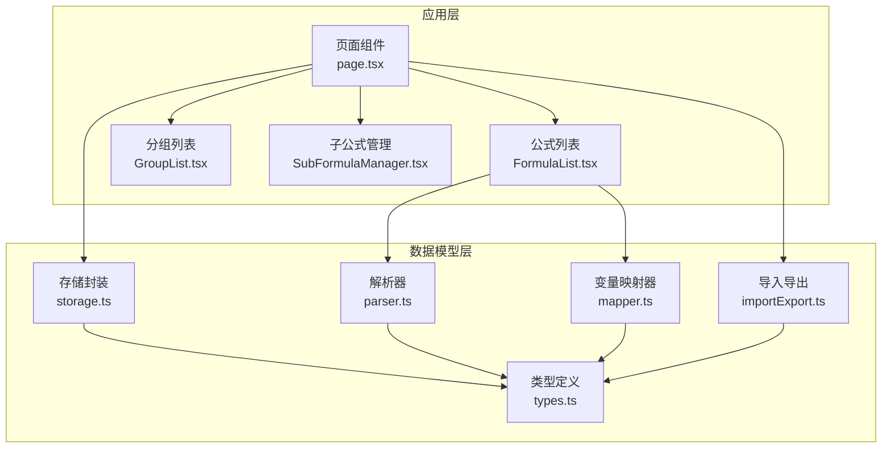
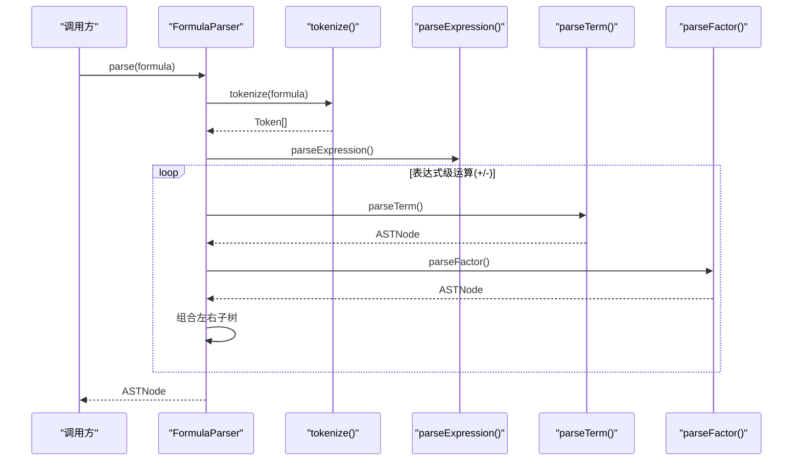
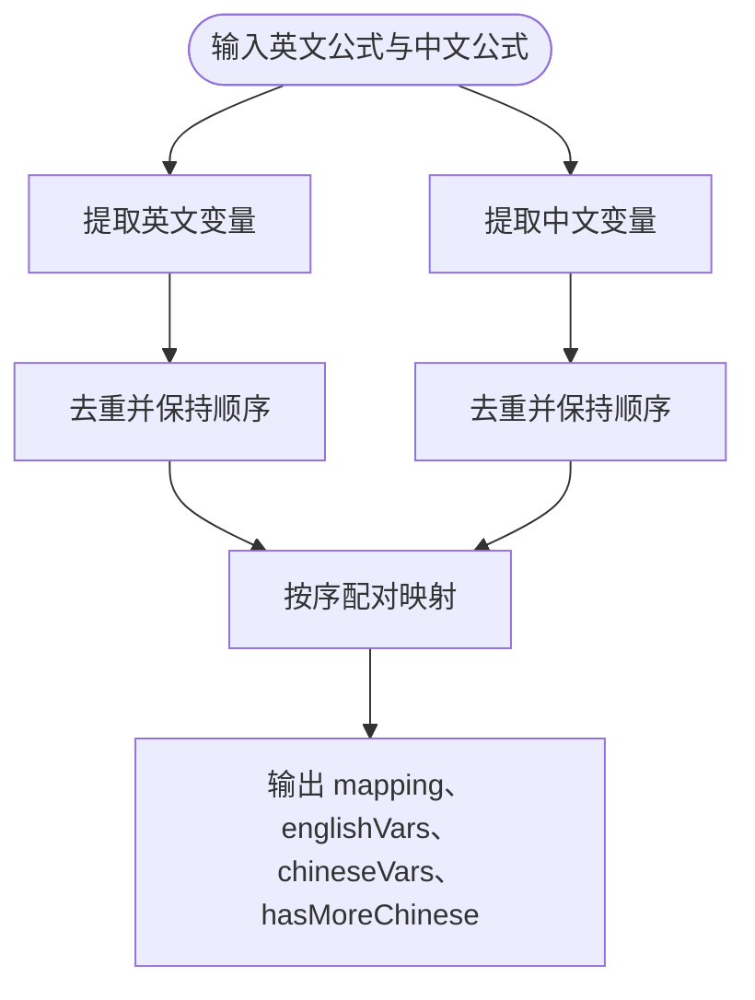
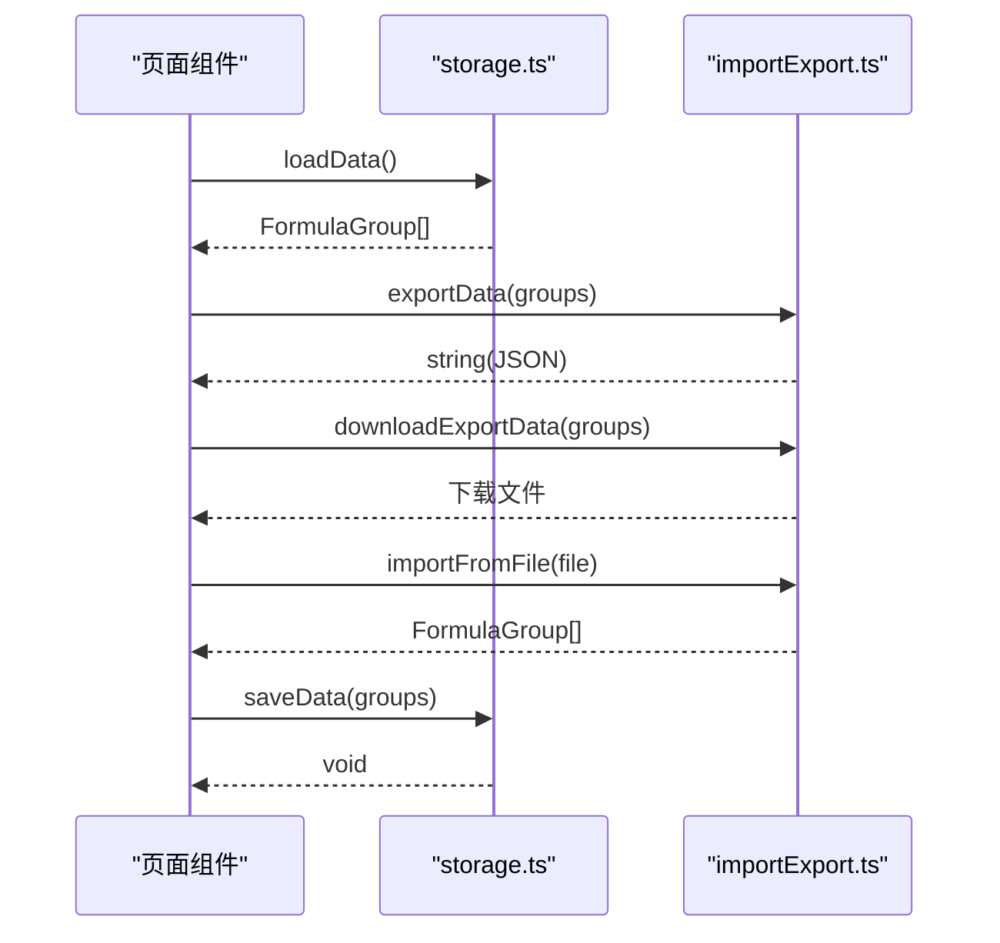
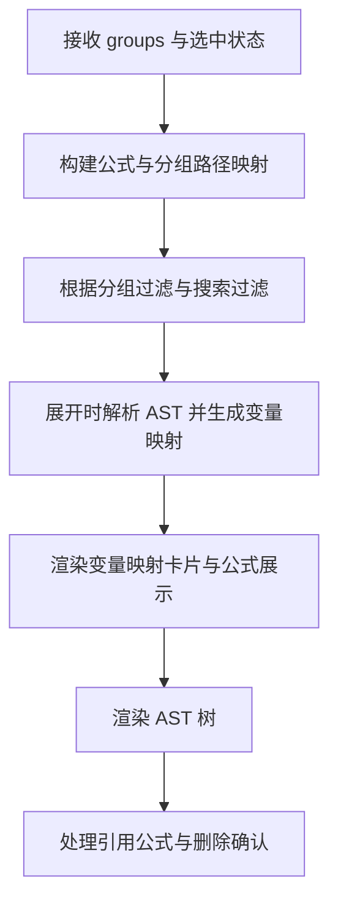
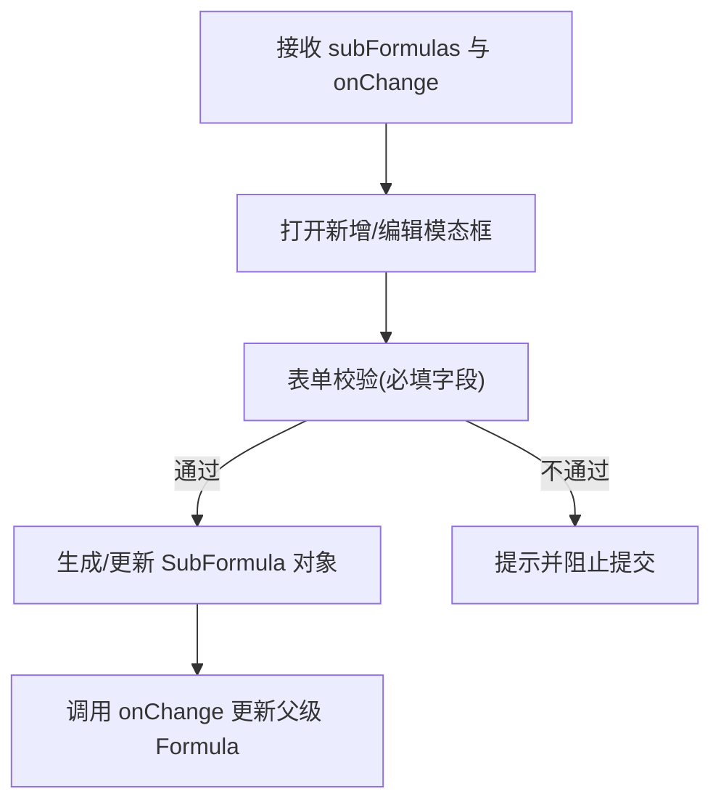
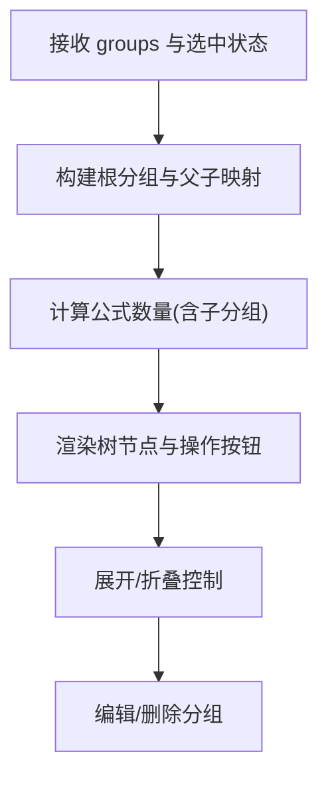
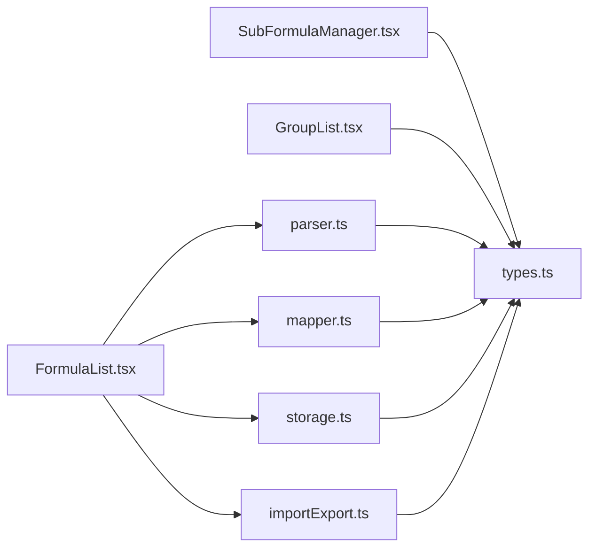

# 数据模型

<cite>
**本文引用的文件**
- [src/lib/types.ts](file://src/lib/types.ts)
- [src/lib/storage.ts](file://src/lib/storage.ts)
- [src/lib/mapper.ts](file://src/lib/mapper.ts)
- [src/lib/parser.ts](file://src/lib/parser.ts)
- [src/lib/importExport.ts](file://src/lib/importExport.ts)
- [src/components/FormulaList.tsx](file://src/components/FormulaList.tsx)
- [src/components/SubFormulaManager.tsx](file://src/components/SubFormulaManager.tsx)
- [src/components/GroupList.tsx](file://src/components/GroupList.tsx)
- [src/app/page.tsx](file://src/app/page.tsx)
</cite>

## 目录
1. [简介](#简介)
2. [项目结构](#项目结构)
3. [核心数据结构](#核心数据结构)
4. [架构总览](#架构总览)
5. [详细组件分析](#详细组件分析)
6. [依赖关系分析](#依赖关系分析)
7. [性能考量](#性能考量)
8. [故障排查指南](#故障排查指南)
9. [结论](#结论)
10. [附录](#附录)

## 简介
本文件面向“公式变量映射与可视化工具”的数据模型文档，系统性梳理并说明项目中的核心数据结构、类型定义、实体关系、数据验证与业务规则、数据流转与生命周期、持久化与迁移策略，以及扩展与自定义方法。目标是帮助开发者快速理解并正确使用数据模型，确保数据一致性与可维护性。

## 项目结构
该项目采用前端单页应用架构，数据模型集中在 lib 层的类型定义与工具模块中，UI 组件通过 props 与状态驱动数据展示与交互。数据持久化基于浏览器本地存储，支持导入/导出 JSON 文件进行备份与迁移。



图表来源
- [src/app/page.tsx:1-707](file://src/app/page.tsx#L1-L707)
- [src/components/FormulaList.tsx:1-387](file://src/components/FormulaList.tsx#L1-L387)
- [src/components/GroupList.tsx:1-294](file://src/components/GroupList.tsx#L1-L294)
- [src/components/SubFormulaManager.tsx:1-201](file://src/components/SubFormulaManager.tsx#L1-L201)
- [src/lib/types.ts:1-51](file://src/lib/types.ts#L1-L51)
- [src/lib/parser.ts:1-159](file://src/lib/parser.ts#L1-L159)
- [src/lib/mapper.ts:1-89](file://src/lib/mapper.ts#L1-L89)
- [src/lib/storage.ts:1-50](file://src/lib/storage.ts#L1-L50)
- [src/lib/importExport.ts:1-101](file://src/lib/importExport.ts#L1-L101)

章节来源
- [src/app/page.tsx:1-707](file://src/app/page.tsx#L1-L707)
- [src/lib/types.ts:1-51](file://src/lib/types.ts#L1-L51)

## 核心数据结构
本节对项目中的核心实体进行字段定义、数据类型与约束条件说明，并解释它们之间的关系。

- FormulaGroup（公式分组）
  - 字段
    - id: string（唯一标识）
    - name: string（分组名称）
    - parentId: string | null（父分组ID；null 表示顶级分组）
    - formulas: Formula[]（该分组下的公式集合）
    - createdAt: number（毫秒时间戳，创建时间）
  - 约束与规则
    - 唯一性：id 唯一
    - 层级：通过 parentId 构建树形层级；顶层分组 parentId 为 null
    - 完整性：formulas 必须为数组
    - 时间：createdAt 由创建时生成

- Formula（公式）
  - 字段
    - id: string（唯一标识）
    - name: string（公式名称）
    - englishFormula: string（英文公式表达式）
    - chineseFormula: string（中文公式表达式）
    - createdAt: number（毫秒时间戳）
    - variableFormulaMapping?: Record<string, string>（变量到公式ID的映射；键为变量名，值为公式ID或子公式ID前缀标识）
    - subFormulas?: SubFormula[]（该公式内部使用的子公式列表）
  - 约束与规则
    - 唯一性：id 唯一
    - 关联：variableFormulaMapping 的值可能指向同组子公式（以特定前缀标识）或跨组外部公式
    - 结构：subFormulas 为子公式数组，用于局部复用
    - 时间：createdAt 由创建时生成

- SubFormula（子公式）
  - 字段
    - id: string（唯一标识，通常以特定前缀区分）
    - name: string（子公式名称）
    - englishFormula: string（英文公式表达式）
    - chineseFormula: string（中文公式表达式）
  - 约束与规则
    - 唯一性：id 唯一
    - 作用域：主要用于 Formula 内部引用，避免重复编写复杂表达式

- ASTNode（抽象语法树节点）
  - 字段
    - type: 'operator' | 'variable' | 'number'
    - operator?: string（运算符）
    - name?: string（变量名）
    - value?: string（数值）
    - left?: ASTNode（左子树）
    - right?: ASTNode（右子树）
  - 约束与规则
    - 类型安全：type 限定节点类型
    - 结构：二叉表达式树，left/right 为可选子节点

- Token（词法单元）
  - 字段
    - type: 'operator' | 'variable' | 'number' | 'paren'
    - value: string（对应符号或标识符）
  - 约束与规则
    - 类型安全：type 限定词法单元类型
    - 值：value 为字符串

- VariableMapping（变量映射结果）
  - 字段
    - mapping: Record<string, string>（英文变量到中文变量的映射表）
    - englishVars: string[]（提取的英文变量列表）
    - chineseVars: string[]（提取的中文变量列表）
    - hasMoreChinese: boolean（中文变量数量是否多于英文变量）
  - 约束与规则
    - 映射：按顺序配对，若中文变量不足则填充占位标识

- MappingItem（映射项）
  - 字段
    - english: string（英文变量）
    - chinese: string（中文变量）
  - 约束与规则
    - 一一对应，用于 UI 展示

章节来源
- [src/lib/types.ts:1-51](file://src/lib/types.ts#L1-L51)

## 架构总览
数据模型围绕 FormulaGroup、Formula、SubFormula、ASTNode、Token、VariableMapping 等核心实体构建，解析器负责将公式字符串转为 AST，映射器负责提取变量并建立中英文映射，存储模块负责本地持久化与导入导出。

```mermaid
classDiagram
class FormulaGroup {
+string id
+string name
+string|null parentId
+Formula[] formulas
+number createdAt
}
class Formula {
+string id
+string name
+string englishFormula
+string chineseFormula
+number createdAt
+Record~string,string~ variableFormulaMapping
+SubFormula[] subFormulas
}
class SubFormula {
+string id
+string name
+string englishFormula
+string chineseFormula
}
class ASTNode {
+("operator"|"variable"|"number") type
+string? operator
+string? name
+string? value
+ASTNode? left
+ASTNode? right
}
class Token {
+("operator"|"variable"|"number"|"paren") type
+string value
}
class VariableMapping {
+Record~string,string~ mapping
+string[] englishVars
+string[] chineseVars
+boolean hasMoreChinese
}
FormulaGroup "1" o-- "*" Formula : "包含"
Formula "1" "0..*" -- "0..*" SubFormula : "内部引用"
Formula "1" "0..*" -- "0..*" Formula : "变量引用(外部)"
Formula --> ASTNode : "解析为"
ASTNode --> Token : "词法分析"
Formula --> VariableMapping : "变量映射"
```

图表来源
- [src/lib/types.ts:1-51](file://src/lib/types.ts#L1-L51)
- [src/lib/parser.ts:1-159](file://src/lib/parser.ts#L1-L159)
- [src/lib/mapper.ts:1-89](file://src/lib/mapper.ts#L1-L89)

## 详细组件分析

### 解析器（FormulaParser）
职责：将公式字符串切分为 Token，再递归下降解析为 ASTNode。支持多种括号类型与四则运算优先级。



图表来源
- [src/lib/parser.ts:12-159](file://src/lib/parser.ts#L12-L159)

章节来源
- [src/lib/parser.ts:1-159](file://src/lib/parser.ts#L1-L159)

### 变量映射器（VariableMapper）
职责：从英文与中文公式中分别提取变量，建立映射关系，并输出标准化的 MappingItem 列表。



图表来源
- [src/lib/mapper.ts:1-89](file://src/lib/mapper.ts#L1-L89)

章节来源
- [src/lib/mapper.ts:1-89](file://src/lib/mapper.ts#L1-L89)

### 存储与导入导出
职责：封装本地存储读写、创建实体、导入导出 JSON 数据并进行格式校验。



图表来源
- [src/lib/storage.ts:1-50](file://src/lib/storage.ts#L1-L50)
- [src/lib/importExport.ts:1-101](file://src/lib/importExport.ts#L1-L101)

章节来源
- [src/lib/storage.ts:1-50](file://src/lib/storage.ts#L1-L50)
- [src/lib/importExport.ts:1-101](file://src/lib/importExport.ts#L1-L101)

### UI 展示与交互（FormulaList）
职责：渲染公式列表，支持搜索、展开查看详情、变量映射、AST 树展示、引用公式弹窗、删除确认等。



图表来源
- [src/components/FormulaList.tsx:1-387](file://src/components/FormulaList.tsx#L1-L387)

章节来源
- [src/components/FormulaList.tsx:1-387](file://src/components/FormulaList.tsx#L1-L387)

### 子公式管理（SubFormulaManager）
职责：维护 Formula 内部的子公式集合，支持增删改查与校验。



图表来源
- [src/components/SubFormulaManager.tsx:1-201](file://src/components/SubFormulaManager.tsx#L1-L201)

章节来源
- [src/components/SubFormulaManager.tsx:1-201](file://src/components/SubFormulaManager.tsx#L1-L201)

### 分组树与导航（GroupList）
职责：渲染分组树，支持展开/折叠、编辑名称、删除分组（含子树）、统计公式数量。



图表来源
- [src/components/GroupList.tsx:1-294](file://src/components/GroupList.tsx#L1-L294)

章节来源
- [src/components/GroupList.tsx:1-294](file://src/components/GroupList.tsx#L1-L294)

## 依赖关系分析
- 组件依赖
  - FormulaList 依赖 Parser 与 Mapper 生成 AST 与变量映射；依赖 ImportExport 与 Storage 实现数据持久化。
  - SubFormulaManager 仅依赖类型定义与 UI 交互，不直接依赖解析器。
  - GroupList 仅依赖类型定义与 UI 交互。
- 类型依赖
  - 所有模块均依赖 types.ts 中的接口定义，保证数据结构一致。
- 解析与映射
  - Parser 与 Mapper 作为纯函数工具，独立于 UI，便于测试与复用。



图表来源
- [src/components/FormulaList.tsx:1-387](file://src/components/FormulaList.tsx#L1-L387)
- [src/components/SubFormulaManager.tsx:1-201](file://src/components/SubFormulaManager.tsx#L1-L201)
- [src/components/GroupList.tsx:1-294](file://src/components/GroupList.tsx#L1-L294)
- [src/lib/parser.ts:1-159](file://src/lib/parser.ts#L1-L159)
- [src/lib/mapper.ts:1-89](file://src/lib/mapper.ts#L1-L89)
- [src/lib/importExport.ts:1-101](file://src/lib/importExport.ts#L1-L101)
- [src/lib/storage.ts:1-50](file://src/lib/storage.ts#L1-L50)
- [src/lib/types.ts:1-51](file://src/lib/types.ts#L1-L51)

章节来源
- [src/components/FormulaList.tsx:1-387](file://src/components/FormulaList.tsx#L1-L387)
- [src/components/SubFormulaManager.tsx:1-201](file://src/components/SubFormulaManager.tsx#L1-L201)
- [src/components/GroupList.tsx:1-294](file://src/components/GroupList.tsx#L1-L294)
- [src/lib/parser.ts:1-159](file://src/lib/parser.ts#L1-L159)
- [src/lib/mapper.ts:1-89](file://src/lib/mapper.ts#L1-L89)
- [src/lib/importExport.ts:1-101](file://src/lib/importExport.ts#L1-L101)
- [src/lib/storage.ts:1-50](file://src/lib/storage.ts#L1-L50)
- [src/lib/types.ts:1-51](file://src/lib/types.ts#L1-L51)

## 性能考量
- 解析性能
  - tokenize 与 parseExpression/parseTerm/parseFactor 为线性扫描与递归下降，时间复杂度近似 O(n)，n 为公式长度。
  - 建议：避免在大量公式同时展开时触发解析，可在 UI 层做懒加载与防抖。
- 映射性能
  - 提取变量使用正则与集合去重，时间复杂度近似 O(m)，m 为变量出现次数。
  - 建议：对长公式可考虑缓存中间结果或延迟计算。
- 存储性能
  - 本地存储为同步 API，建议批量更新后统一 saveData，减少频繁写入。
- UI 渲染
  - FormulaList 在展开时才解析 AST 与映射，避免不必要的计算。

## 故障排查指南
- 解析错误
  - 现象：展开公式时报错“解析错误”。
  - 排查：检查英文公式是否包含非法字符、括号是否匹配、运算符是否合法。
  - 参考：解析器对未识别字符与括号不匹配抛出异常。
- 导入失败
  - 现象：导入 JSON 文件报错。
  - 排查：确认 JSON 包含 version 与 groups 字段，且 groups 为数组；每个分组包含 id、name、formulas；每个公式包含 id、name、englishFormula、chineseFormula。
  - 参考：导入校验逻辑会逐项验证结构。
- 本地存储异常
  - 现象：保存或读取失败。
  - 排查：确认浏览器允许本地存储；检查 JSON 序列化/反序列化是否成功。
- 子公式引用问题
  - 现象：变量引用的子公式未显示或找不到。
  - 排查：确认 variableFormulaMapping 中的键与子公式 id 前缀一致；检查子公式列表是否同步更新。

章节来源
- [src/lib/parser.ts:12-159](file://src/lib/parser.ts#L12-L159)
- [src/lib/importExport.ts:43-75](file://src/lib/importExport.ts#L43-L75)
- [src/lib/storage.ts:5-25](file://src/lib/storage.ts#L5-L25)
- [src/components/FormulaList.tsx:169-192](file://src/components/FormulaList.tsx#L169-L192)

## 结论
本数据模型以 FormulaGroup、Formula、SubFormula 为核心，配合 ASTNode、Token、VariableMapping 构成完整的公式解析与映射体系。通过 Parser 与 Mapper 提供稳定的解析与映射能力，Storage 与 ImportExport 提供本地持久化与数据迁移能力。UI 组件围绕这些数据结构进行展示与交互，形成清晰的职责边界与可维护性。

## 附录

### 数据验证与业务规则清单
- FormulaGroup
  - 唯一性：id 唯一
  - 层级：parentId 为空表示顶级；树形结构需自上而下维护
  - 完整性：formulas 为数组
- Formula
  - 唯一性：id 唯一
  - 关联：variableFormulaMapping 的值可指向子公式或外部公式
  - 唯一性：同一分组内 name 唯一（创建/更新时校验）
- SubFormula
  - 唯一性：id 唯一
  - 作用域：仅在所属 Formula 内部引用
- ASTNode/Token
  - 类型安全：type 严格限定
  - 结构：AST 为二叉表达式树
- VariableMapping
  - 映射：按顺序配对，中文不足时使用占位标识
- 导入导出
  - 版本：exportData.version 固定为 1.0
  - 校验：groups 数组与各对象字段完整性校验

章节来源
- [src/lib/types.ts:1-51](file://src/lib/types.ts#L1-L51)
- [src/app/page.tsx:204-239](file://src/app/page.tsx#L204-L239)
- [src/app/page.tsx:291-360](file://src/app/page.tsx#L291-L360)
- [src/lib/importExport.ts:3-75](file://src/lib/importExport.ts#L3-L75)

### 数据流转与生命周期
- 创建
  - 用户在页面创建分组/公式/子公式，调用 storage.ts 的工厂函数生成实体并保存。
- 展示
  - 页面加载时从本地存储读取，FormulaList 懒加载解析与映射。
- 更新
  - 修改分组/公式/子公式后统一保存，避免分散写入。
- 删除
  - 删除分组时递归删除其子树；删除公式时清理引用关系。
- 导出/导入
  - 导出为 JSON，包含版本与导出时间；导入时进行结构校验。

章节来源
- [src/lib/storage.ts:27-49](file://src/lib/storage.ts#L27-L49)
- [src/app/page.tsx:158-202](file://src/app/page.tsx#L158-L202)
- [src/app/page.tsx:241-251](file://src/app/page.tsx#L241-L251)
- [src/lib/importExport.ts:12-75](file://src/lib/importExport.ts#L12-L75)

### 数据持久化与存储策略
- 存储介质：浏览器 localStorage
- 存储键：固定键名
- 序列化：JSON.stringify/parse
- 策略：全量保存，避免部分更新导致状态不一致
- 备份：通过导出 JSON 文件实现离线备份

章节来源
- [src/lib/storage.ts:3-25](file://src/lib/storage.ts#L3-L25)
- [src/lib/importExport.ts:12-20](file://src/lib/importExport.ts#L12-L20)

### 数据迁移与版本管理
- 版本字段：exportData.version 固定为 1.0
- 迁移策略：
  - 升级时：读取旧版本 JSON，按字段映射转换为新结构，必要时进行默认值填充或字段重命名
  - 降级兼容：保留向后兼容字段，忽略未知字段
- 建议：在升级前导出备份，导入时进行结构校验与提示

章节来源
- [src/lib/importExport.ts:3-20](file://src/lib/importExport.ts#L3-L20)
- [src/lib/importExport.ts:43-75](file://src/lib/importExport.ts#L43-L75)

### 扩展与自定义方法
- 新增实体
  - 在 types.ts 中定义新接口，遵循现有字段风格与命名规范
  - 在 storage.ts 中增加工厂函数与默认值
  - 在 UI 组件中引入并处理新实体的创建/编辑/删除
- 自定义解析
  - 在 parser.ts 中扩展词法规则与语法规则，注意保持类型安全与错误信息友好
- 自定义映射
  - 在 mapper.ts 中扩展变量提取策略，如支持更多语言或特殊符号
- 导入导出扩展
  - 在 importExport.ts 中增加版本号与字段映射逻辑，确保向后兼容

章节来源
- [src/lib/types.ts:1-51](file://src/lib/types.ts#L1-L51)
- [src/lib/storage.ts:27-49](file://src/lib/storage.ts#L27-L49)
- [src/lib/parser.ts:24-68](file://src/lib/parser.ts#L24-L68)
- [src/lib/mapper.ts:4-89](file://src/lib/mapper.ts#L4-L89)
- [src/lib/importExport.ts:3-75](file://src/lib/importExport.ts#L3-L75)