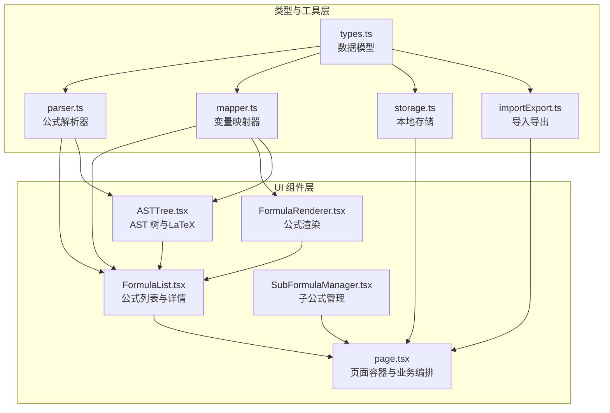
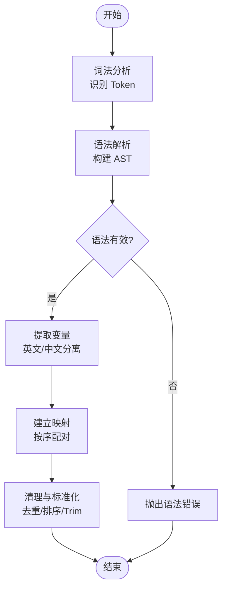
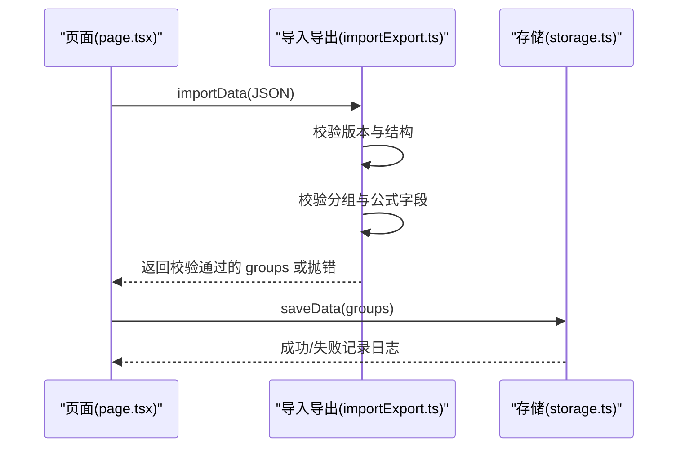
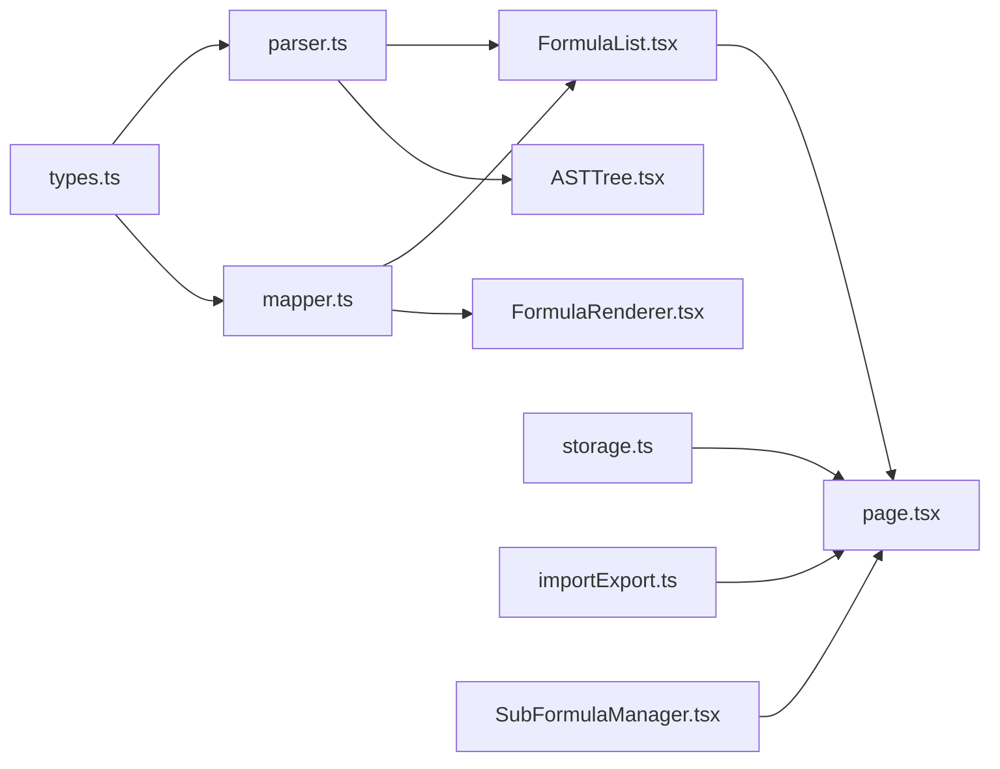

# 数据验证规则

<cite>
**本文档引用的文件**
- [src/lib/types.ts](file://src/lib/types.ts)
- [src/lib/parser.ts](file://src/lib/parser.ts)
- [src/lib/mapper.ts](file://src/lib/mapper.ts)
- [src/lib/storage.ts](file://src/lib/storage.ts)
- [src/lib/importExport.ts](file://src/lib/importExport.ts)
- [src/components/FormulaList.tsx](file://src/components/FormulaList.tsx)
- [src/components/SubFormulaManager.tsx](file://src/components/SubFormulaManager.tsx)
- [src/components/FormulaRenderer.tsx](file://src/components/FormulaRenderer.tsx)
- [src/components/ASTTree.tsx](file://src/components/ASTTree.tsx)
- [src/app/page.tsx](file://src/app/page.tsx)
</cite>

## 目录
1. [简介](#简介)
2. [项目结构](#项目结构)
3. [核心组件](#核心组件)
4. [架构总览](#架构总览)
5. [详细组件分析](#详细组件分析)
6. [依赖关系分析](#依赖关系分析)
7. [性能考虑](#性能考虑)
8. [故障排查指南](#故障排查指南)
9. [结论](#结论)
10. [附录](#附录)

## 简介
本文件面向“公式变量映射与可视化工具”的数据验证规则，系统性地梳理并规范以下内容：
- 各数据类型的验证规则与约束条件
- 实体（Formula、FormulaGroup、SubFormula 等）的业务规则
- 公式语法验证与变量映射验证的实现机制
- 数据完整性检查与一致性保证机制
- 验证错误的处理与反馈方式
- 数据清理与标准化流程
- 验证规则的扩展与自定义方法
- 验证性能优化与批量验证策略

目标是帮助开发者正确实现与使用数据验证功能，确保公式输入、存储、导入导出与渲染过程的稳定性与一致性。

## 项目结构
该项目采用前端单页应用架构，核心逻辑集中在 lib 层（类型定义、解析器、映射器、存储与导入导出），UI 组件负责交互与展示，并通过事件回调驱动数据变更与验证。



图表来源
- [src/lib/types.ts:1-51](file://src/lib/types.ts#L1-L51)
- [src/lib/parser.ts:1-159](file://src/lib/parser.ts#L1-L159)
- [src/lib/mapper.ts:1-89](file://src/lib/mapper.ts#L1-L89)
- [src/lib/storage.ts:1-50](file://src/lib/storage.ts#L1-L50)
- [src/lib/importExport.ts:1-120](file://src/lib/importExport.ts#L1-L120)
- [src/components/FormulaList.tsx:1-387](file://src/components/FormulaList.tsx#L1-L387)
- [src/components/SubFormulaManager.tsx:1-201](file://src/components/SubFormulaManager.tsx#L1-L201)
- [src/components/FormulaRenderer.tsx:1-169](file://src/components/FormulaRenderer.tsx#L1-L169)
- [src/components/ASTTree.tsx:1-179](file://src/components/ASTTree.tsx#L1-L179)
- [src/app/page.tsx:1-798](file://src/app/page.tsx#L1-L798)

章节来源
- [src/lib/types.ts:1-51](file://src/lib/types.ts#L1-L51)
- [src/lib/parser.ts:1-159](file://src/lib/parser.ts#L1-L159)
- [src/lib/mapper.ts:1-89](file://src/lib/mapper.ts#L1-L89)
- [src/lib/storage.ts:1-50](file://src/lib/storage.ts#L1-L50)
- [src/lib/importExport.ts:1-120](file://src/lib/importExport.ts#L1-L120)
- [src/components/FormulaList.tsx:1-387](file://src/components/FormulaList.tsx#L1-L387)
- [src/components/SubFormulaManager.tsx:1-201](file://src/components/SubFormulaManager.tsx#L1-L201)
- [src/components/FormulaRenderer.tsx:1-169](file://src/components/FormulaRenderer.tsx#L1-L169)
- [src/components/ASTTree.tsx:1-179](file://src/components/ASTTree.tsx#L1-L179)
- [src/app/page.tsx:1-798](file://src/app/page.tsx#L1-L798)

## 核心组件
本节聚焦于数据验证相关的核心模块与职责边界。

- 类型与数据模型（types.ts）
  - 定义 Token、ASTNode、VariableMapping、MappingItem、Formula、SubFormula、FormulaGroup 等核心数据结构，明确各字段的语义与可选性。
  - 关键约束点：
    - FormulaGroup 的 parentId 可为空，表示顶级分组；父子关系构成树形结构。
    - Formula 的 variableFormulaMapping 为可选映射，用于变量到公式ID的引用。
    - SubFormula 与 Formula 的字段均要求非空字符串（由后续组件与导入导出逻辑保障）。

- 公式解析器（parser.ts）
  - 将字符串公式词法切分为 Token 流，再递归下降解析为 ASTNode。
  - 语法验证要点：
    - 识别合法运算符与括号（含中英文括号）。
    - 变量必须以字母开头，后跟字母或数字。
    - 数字序列直接识别为 number。
    - 不识别字符抛出异常，表达式不完整或括号不匹配抛出异常。
  - 输出：ASTNode，供后续渲染与 LaTeX 转换使用。

- 变量映射器（mapper.ts）
  - 提取英文与中文变量集合，建立双向映射。
  - 规则要点：
    - 英文变量：按单词边界提取，去重并保持顺序。
    - 中文变量：按运算符与括号分割后过滤纯数字与空串，去重并保持顺序。
    - 若中文变量多于英文变量，记录 hasMoreChinese 标记。
    - 生成 MappingItem 列表，便于 UI 展示。

- 本地存储与导入导出（storage.ts、importExport.ts）
  - 存储：基于 localStorage 的序列化与反序列化，提供加载与保存接口。
  - 导入导出：
    - 导出：包装版本号与导出时间戳，统一 JSON 结构。
    - 导入：严格校验版本与数组结构，逐项校验 FormulaGroup 与 Formula 字段完整性，异常时抛出明确错误信息。

- UI 组件中的验证与清理
  - FormulaList：在展开公式详情时进行变量映射与语法解析，捕获异常并反馈错误。
  - SubFormulaManager：新增/编辑子公式时进行必填字段校验与字段清理（trim）。
  - FormulaRenderer：对公式文本进行词法切分，区分变量、运算符、括号与数字。
  - ASTTree：将 AST 转换为 LaTeX 并支持中英文切换，同时输出变量映射说明。

章节来源
- [src/lib/types.ts:1-51](file://src/lib/types.ts#L1-L51)
- [src/lib/parser.ts:1-159](file://src/lib/parser.ts#L1-L159)
- [src/lib/mapper.ts:1-89](file://src/lib/mapper.ts#L1-L89)
- [src/lib/storage.ts:1-50](file://src/lib/storage.ts#L1-L50)
- [src/lib/importExport.ts:1-120](file://src/lib/importExport.ts#L1-L120)
- [src/components/FormulaList.tsx:151-387](file://src/components/FormulaList.tsx#L151-L387)
- [src/components/SubFormulaManager.tsx:1-201](file://src/components/SubFormulaManager.tsx#L1-L201)
- [src/components/FormulaRenderer.tsx:1-169](file://src/components/FormulaRenderer.tsx#L1-L169)
- [src/components/ASTTree.tsx:1-179](file://src/components/ASTTree.tsx#L1-L179)

## 架构总览
下图展示了从用户输入到数据持久化与可视化的端到端流程，以及关键验证节点：

```mermaid
sequenceDiagram
participant U as "用户"
participant UI as "页面容器(page.tsx)"
participant FLM as "公式列表(FormulaList)"
participant SFM as "子公式管理(SubFormulaManager)"
participant MAP as "变量映射器(mapper.ts)"
participant PAR as "解析器(parser.ts)"
participant ST as "存储(storage.ts)"
participant IE as "导入导出(importExport.ts)"
U->>UI : 输入/编辑公式
UI->>FLM : 传递 Formula 数据
FLM->>MAP : createMapping(英文, 中文)
MAP-->>FLM : 返回映射与变量列表
FLM->>PAR : parse(英文公式)
PAR-->>FLM : 返回 AST 或抛出异常
FLM->>ST : 保存/更新 Formula
U->>IE : 导出/导入 JSON
IE-->>UI : 校验通过的 FormulaGroup[]
UI->>ST : 写入本地存储
```

图表来源
- [src/app/page.tsx:1-798](file://src/app/page.tsx#L1-L798)
- [src/components/FormulaList.tsx:151-387](file://src/components/FormulaList.tsx#L151-L387)
- [src/components/SubFormulaManager.tsx:1-201](file://src/components/SubFormulaManager.tsx#L1-L201)
- [src/lib/mapper.ts:1-89](file://src/lib/mapper.ts#L1-L89)
- [src/lib/parser.ts:1-159](file://src/lib/parser.ts#L1-L159)
- [src/lib/storage.ts:1-50](file://src/lib/storage.ts#L1-L50)
- [src/lib/importExport.ts:1-120](file://src/lib/importExport.ts#L1-L120)

## 详细组件分析

### 数据类型与业务规则
- Formula
  - 必填字段：id、name、englishFormula、chineseFormula。
  - 可选字段：variableFormulaMapping（变量到公式ID的映射）、subFormulas（子公式列表）。
  - 业务规则：
    - variableFormulaMapping 的值若以特定前缀标识，则指向 SubFormula；否则指向外部 Formula。
    - 重复命名在同一分组内不允许（由页面逻辑校验）。
- SubFormula
  - 必填字段：id、name、englishFormula、chineseFormula。
  - 用途：作为 Formula 的局部变量域，支持跨公式引用。
- FormulaGroup
  - 必填字段：id、name、parentId（可空）、formulas。
  - 业务规则：
    - 父子关系构成树形结构；删除分组会级联删除其子分组与公式。
    - 顶层分组的 parentId 为 null。
- Token 与 ASTNode
  - Token.type 限定为 operator、variable、number、paren。
  - ASTNode.type 限定为 operator、variable、number；operator 包含运算符符号与左右子树。

章节来源
- [src/lib/types.ts:27-51](file://src/lib/types.ts#L27-L51)

### 公式语法验证与变量映射验证
- 语法验证（parser.ts）
  - 词法阶段：识别空白、运算符与括号、变量、数字；遇到未知字符抛错。
  - 语法阶段：递归下降解析表达式、项与因子，确保括号成对且闭合，变量/数字/括号表达式合法。
  - 异常场景：表达式不完整、括号不匹配、意外 token。
- 变量映射验证（mapper.ts）
  - 英文变量：按单词边界提取，去重并保持顺序。
  - 中文变量：按运算符与括号分割，过滤纯数字与空串，去重并保持顺序。
  - 映射生成：按序配对，若中文变量不足则填充占位标记。
  - UI 展示：formatMapping 将映射转换为 MappingItem 列表。



图表来源
- [src/lib/parser.ts:24-68](file://src/lib/parser.ts#L24-L68)
- [src/lib/mapper.ts:4-87](file://src/lib/mapper.ts#L4-L87)

章节来源
- [src/lib/parser.ts:12-159](file://src/lib/parser.ts#L12-L159)
- [src/lib/mapper.ts:1-89](file://src/lib/mapper.ts#L1-L89)

### 数据完整性检查与一致性保证
- 导入导出校验（importExport.ts）
  - 版本与结构校验：确保 version 存在且 groups 为数组。
  - 分组校验：每个分组需包含 id、name、formulas。
  - 公式校验：每个公式需包含 id、name、englishFormula、chineseFormula。
  - 错误分类：JSON 语法错误、HTTP 请求错误、结构不合法等。
- 本地存储一致性（storage.ts）
  - 读取失败时返回空数组并记录错误日志，避免破坏现有数据。
  - 写入失败时记录错误日志，保证 UI 不崩溃。
- 页面级一致性（page.tsx）
  - 新增/编辑公式时进行必填校验与重名校验（同一分组内）。
  - URL 与本地状态同步，避免状态漂移导致的数据不一致。



图表来源
- [src/lib/importExport.ts:43-75](file://src/lib/importExport.ts#L43-L75)
- [src/lib/storage.ts:17-25](file://src/lib/storage.ts#L17-L25)
- [src/app/page.tsx:294-330](file://src/app/page.tsx#L294-L330)

章节来源
- [src/lib/importExport.ts:1-120](file://src/lib/importExport.ts#L1-L120)
- [src/lib/storage.ts:1-50](file://src/lib/storage.ts#L1-L50)
- [src/app/page.tsx:294-330](file://src/app/page.tsx#L294-L330)

### 验证错误处理与反馈
- 语法解析错误：FormulaList 在展开公式详情时捕获异常，设置错误状态并在 UI 中以红色提示块展示。
- UI 输入错误：SubFormulaManager 与页面编辑表单在保存前进行必填校验，弹出提示并阻止提交。
- 导入错误：importExport.ts 对 JSON 语法错误、HTTP 错误与结构错误进行分类抛错，调用方负责 UI 层面的错误展示。
- 渲染错误：ASTTree 在 LaTeX 渲染失败时回退显示原始文本并提示渲染失败。

章节来源
- [src/components/FormulaList.tsx:170-192](file://src/components/FormulaList.tsx#L170-L192)
- [src/components/SubFormulaManager.tsx:42-63](file://src/components/SubFormulaManager.tsx#L42-L63)
- [src/lib/importExport.ts:69-75](file://src/lib/importExport.ts#L69-L75)
- [src/components/ASTTree.tsx:124-142](file://src/components/ASTTree.tsx#L124-L142)

### 数据清理与标准化流程
- 字段清理：表单输入在保存前统一 trim，去除首尾空白。
- 变量提取：英文变量按单词边界提取并去重；中文变量按运算符/括号分割后过滤纯数字与空串并去重。
- 映射生成：按变量出现顺序建立映射，保持稳定可预测的 UI 表现。
- 存储序列化：统一 JSON 格式，包含版本与导出时间戳，便于未来演进。

章节来源
- [src/components/SubFormulaManager.tsx:42-63](file://src/components/SubFormulaManager.tsx#L42-L63)
- [src/lib/mapper.ts:4-87](file://src/lib/mapper.ts#L4-L87)
- [src/lib/importExport.ts:12-20](file://src/lib/importExport.ts#L12-L20)

### 验证规则的扩展与自定义
- 自定义变量提取规则：可在 mapper.ts 中调整正则或分割策略，以适配不同语言与上下文。
- 自定义语法集：可在 parser.ts 的词法与语法规则中扩展支持的运算符与括号类型。
- 自定义导入导出格式：可在 importExport.ts 中增加字段校验与兼容性处理。
- UI 层扩展：FormulaRenderer 与 ASTTree 可根据业务需求扩展变量高亮、引用跳转与错误提示样式。

章节来源
- [src/lib/mapper.ts:1-89](file://src/lib/mapper.ts#L1-L89)
- [src/lib/parser.ts:24-68](file://src/lib/parser.ts#L24-L68)
- [src/lib/importExport.ts:43-75](file://src/lib/importExport.ts#L43-L75)
- [src/components/FormulaRenderer.tsx:1-169](file://src/components/FormulaRenderer.tsx#L1-L169)
- [src/components/ASTTree.tsx:1-179](file://src/components/ASTTree.tsx#L1-L179)

## 依赖关系分析
- 类型依赖：parser.ts 与 mapper.ts 依赖 types.ts 中的 Token、ASTNode、VariableMapping 等类型。
- 组件依赖：FormulaList 依赖 parser.ts 与 mapper.ts 进行解析与映射；ASTTree 依赖 parser.ts 与 mapper.ts 进行 LaTeX 渲染；FormulaRenderer 依赖 mapper.ts 进行变量高亮。
- 存储与导入导出：page.tsx 通过 storage.ts 与 importExport.ts 管理数据生命周期。



图表来源
- [src/lib/types.ts:1-51](file://src/lib/types.ts#L1-L51)
- [src/lib/parser.ts:1-159](file://src/lib/parser.ts#L1-L159)
- [src/lib/mapper.ts:1-89](file://src/lib/mapper.ts#L1-L89)
- [src/lib/storage.ts:1-50](file://src/lib/storage.ts#L1-L50)
- [src/lib/importExport.ts:1-120](file://src/lib/importExport.ts#L1-L120)
- [src/components/FormulaList.tsx:1-387](file://src/components/FormulaList.tsx#L1-L387)
- [src/components/SubFormulaManager.tsx:1-201](file://src/components/SubFormulaManager.tsx#L1-L201)
- [src/components/FormulaRenderer.tsx:1-169](file://src/components/FormulaRenderer.tsx#L1-L169)
- [src/components/ASTTree.tsx:1-179](file://src/components/ASTTree.tsx#L1-L179)
- [src/app/page.tsx:1-798](file://src/app/page.tsx#L1-L798)

章节来源
- [src/lib/types.ts:1-51](file://src/lib/types.ts#L1-L51)
- [src/lib/parser.ts:1-159](file://src/lib/parser.ts#L1-L159)
- [src/lib/mapper.ts:1-89](file://src/lib/mapper.ts#L1-L89)
- [src/lib/storage.ts:1-50](file://src/lib/storage.ts#L1-L50)
- [src/lib/importExport.ts:1-120](file://src/lib/importExport.ts#L1-L120)
- [src/components/FormulaList.tsx:1-387](file://src/components/FormulaList.tsx#L1-L387)
- [src/components/SubFormulaManager.tsx:1-201](file://src/components/SubFormulaManager.tsx#L1-L201)
- [src/components/FormulaRenderer.tsx:1-169](file://src/components/FormulaRenderer.tsx#L1-L169)
- [src/components/ASTTree.tsx:1-179](file://src/components/ASTTree.tsx#L1-L179)
- [src/app/page.tsx:1-798](file://src/app/page.tsx#L1-L798)

## 性能考虑
- 词法与语法解析
  - 词法阶段线性扫描，时间复杂度 O(n)，空间复杂度 O(n)。
  - 语法解析为递归下降，最坏情况下与表达式深度相关，但通常为线性。
- 变量提取
  - 英文变量提取使用正则全局匹配，时间复杂度 O(n)；中文变量分割与过滤为 O(n)。
- UI 渲染
  - FormulaRenderer 与 ASTTree 的渲染受变量数量与表达式复杂度影响；建议在大数据量场景下延迟渲染或分页展示。
- 导入导出
  - 大文件导入建议异步处理与进度提示；导出时避免不必要的重复序列化。
- 批量验证策略
  - 对大量 Formula 进行批量校验时，建议：
    - 分批处理（如每批 50 个），避免阻塞主线程。
    - 使用 Web Worker 或服务端校验，减少 UI 卡顿。
    - 缓存中间结果（如映射与 AST），避免重复计算。

## 故障排查指南
- 语法错误
  - 现象：展开公式详情时报错，AST 为空。
  - 排查：检查公式字符串是否包含未知字符、括号是否成对、变量命名是否符合规则。
  - 参考：[src/lib/parser.ts:12-159](file://src/lib/parser.ts#L12-L159)
- 变量映射异常
  - 现象：变量说明缺失或映射不完整。
  - 排查：确认英文/中文公式中变量提取逻辑是否符合预期；检查是否有纯数字被错误识别为变量。
  - 参考：[src/lib/mapper.ts:1-89](file://src/lib/mapper.ts#L1-L89)
- 导入失败
  - 现象：导入 JSON 后报错或数据为空。
  - 排查：核对 JSON 结构是否包含 version 与 groups；逐项检查分组与公式字段是否完整。
  - 参考：[src/lib/importExport.ts:43-75](file://src/lib/importExport.ts#L43-L75)
- 存储异常
  - 现象：刷新后数据丢失或页面报错。
  - 排查：检查 localStorage 权限与容量；查看控制台错误日志。
  - 参考：[src/lib/storage.ts:17-25](file://src/lib/storage.ts#L17-L25)
- UI 输入校验
  - 现象：保存时报“请填写所有字段”。
  - 排查：确认必填字段均已填写且非空；检查 trim 后是否仍为空。
  - 参考：[src/components/SubFormulaManager.tsx:42-63](file://src/components/SubFormulaManager.tsx#L42-L63)

章节来源
- [src/lib/parser.ts:12-159](file://src/lib/parser.ts#L12-L159)
- [src/lib/mapper.ts:1-89](file://src/lib/mapper.ts#L1-L89)
- [src/lib/importExport.ts:43-75](file://src/lib/importExport.ts#L43-L75)
- [src/lib/storage.ts:17-25](file://src/lib/storage.ts#L17-L25)
- [src/components/SubFormulaManager.tsx:42-63](file://src/components/SubFormulaManager.tsx#L42-L63)

## 结论
本项目通过“类型约束 + 词法/语法解析 + 变量映射 + 导入导出校验 + UI 层输入校验”的多层验证体系，实现了对公式数据的全面保护。建议在扩展新功能时遵循现有模式，优先在类型与解析层增加约束，在 UI 层提供清晰反馈，并在导入导出与存储层保留完善的错误处理与日志记录，以确保系统的稳定性与可维护性。

## 附录
- 关键实现路径参考
  - 语法解析：[src/lib/parser.ts:12-159](file://src/lib/parser.ts#L12-L159)
  - 变量映射：[src/lib/mapper.ts:1-89](file://src/lib/mapper.ts#L1-L89)
  - 数据模型：[src/lib/types.ts:1-51](file://src/lib/types.ts#L1-L51)
  - 导入导出：[src/lib/importExport.ts:1-120](file://src/lib/importExport.ts#L1-L120)
  - 本地存储：[src/lib/storage.ts:1-50](file://src/lib/storage.ts#L1-50)
  - 公式列表与详情：[src/components/FormulaList.tsx:151-387](file://src/components/FormulaList.tsx#L151-L387)
  - 子公式管理：[src/components/SubFormulaManager.tsx:1-201](file://src/components/SubFormulaManager.tsx#L1-L201)
  - 公式渲染：[src/components/FormulaRenderer.tsx:1-169](file://src/components/FormulaRenderer.tsx#L1-L169)
  - AST 树与 LaTeX：[src/components/ASTTree.tsx:1-179](file://src/components/ASTTree.tsx#L1-L179)
  - 页面容器与业务编排：[src/app/page.tsx:1-798](file://src/app/page.tsx#L1-L798)