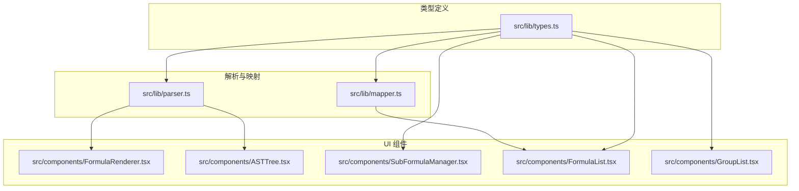
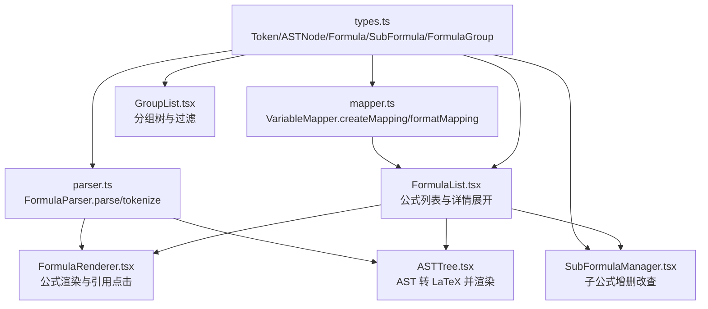
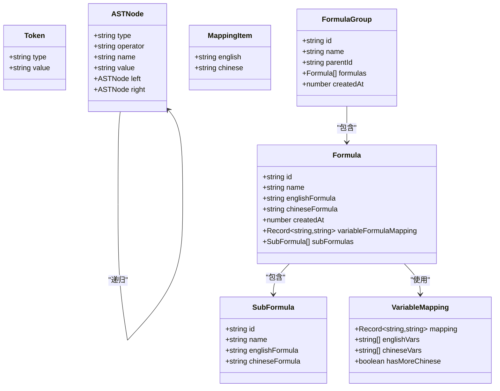
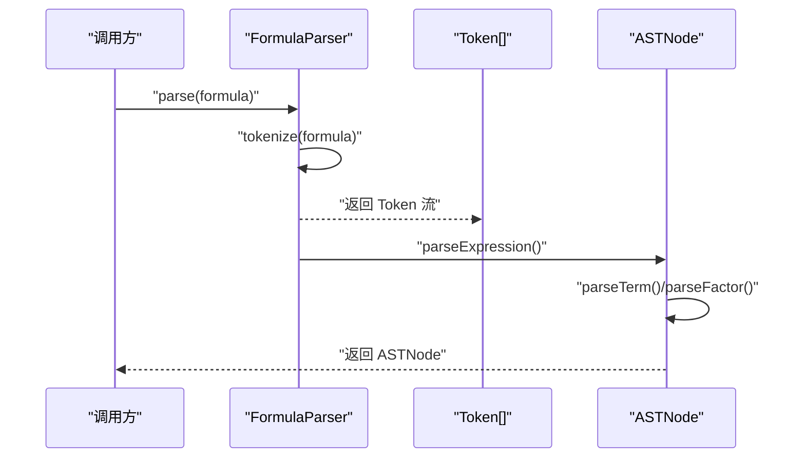
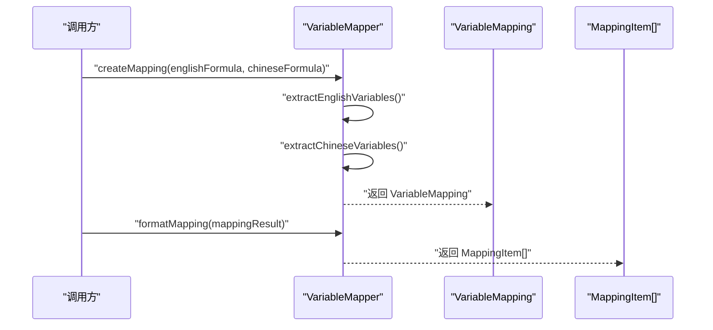
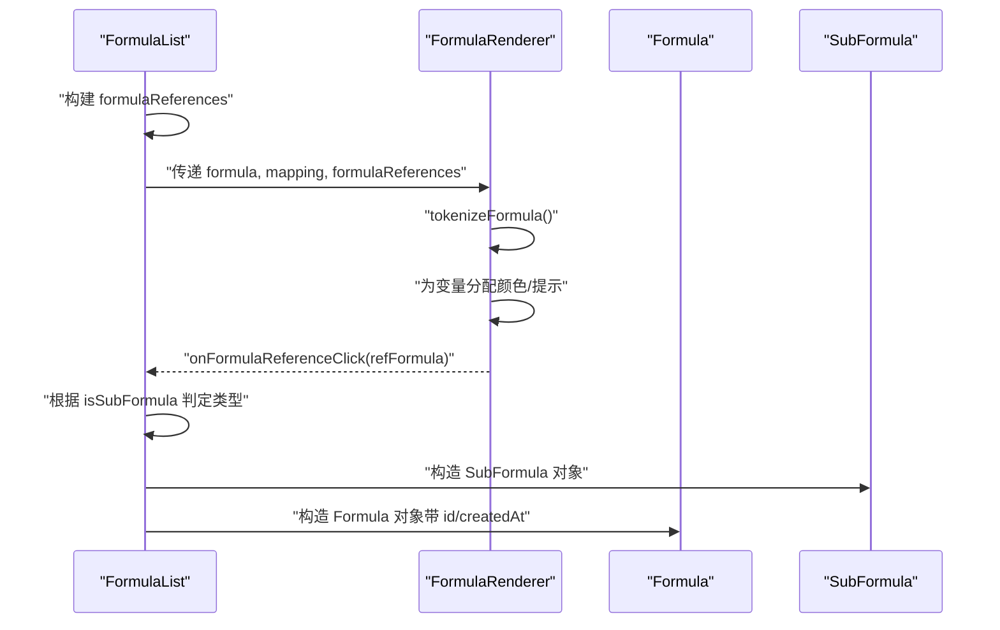
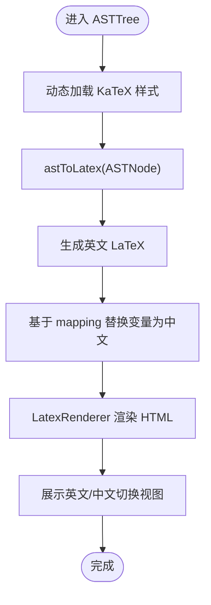
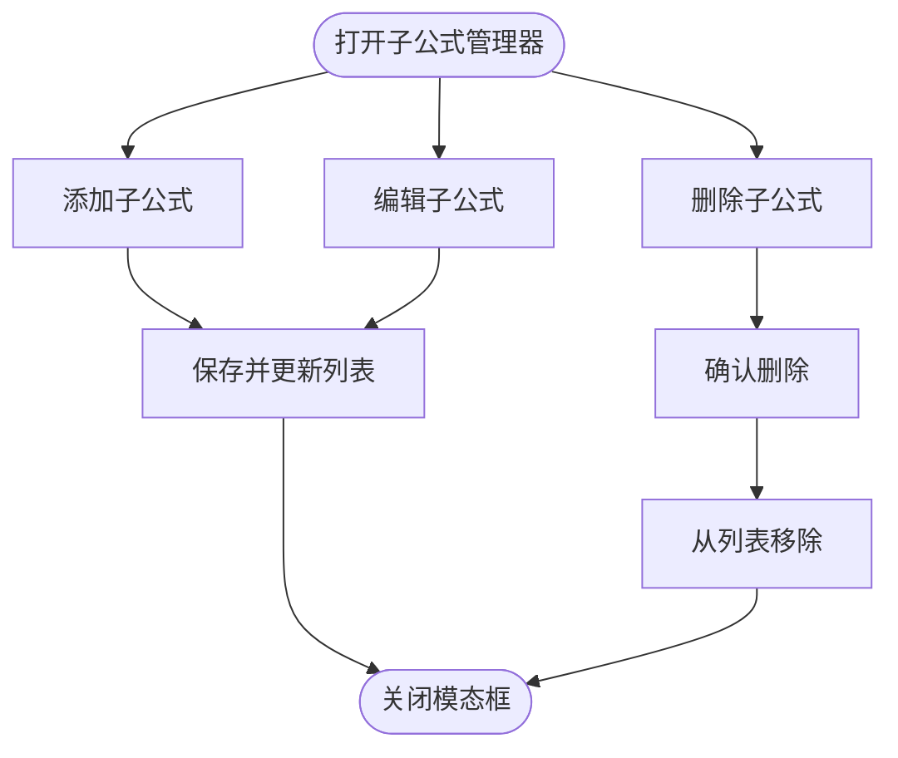
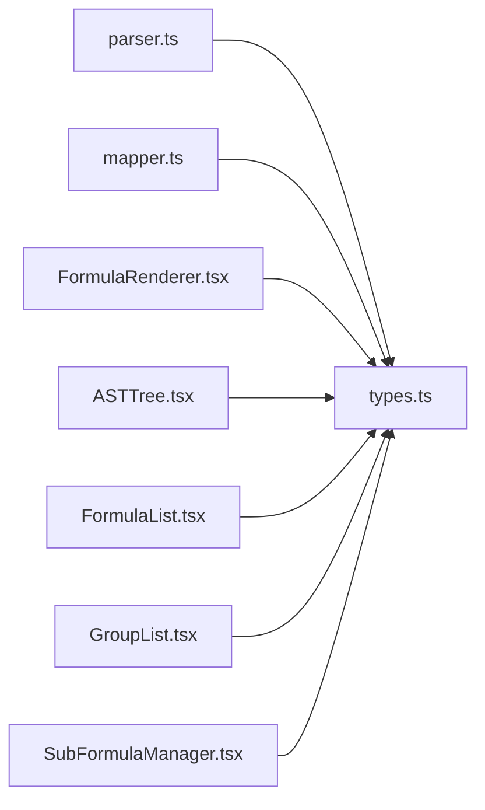

# 核心类型定义

<cite>
**本文档引用的文件**
- [src/lib/types.ts](file://src/lib/types.ts)
- [src/lib/mapper.ts](file://src/lib/mapper.ts)
- [src/lib/parser.ts](file://src/lib/parser.ts)
- [src/components/FormulaRenderer.tsx](file://src/components/FormulaRenderer.tsx)
- [src/components/ASTTree.tsx](file://src/components/ASTTree.tsx)
- [src/components/SubFormulaManager.tsx](file://src/components/SubFormulaManager.tsx)
- [src/components/FormulaList.tsx](file://src/components/FormulaList.tsx)
- [src/components/GroupList.tsx](file://src/components/GroupList.tsx)
</cite>

## 目录
1. [简介](#简介)
2. [项目结构](#项目结构)
3. [核心组件](#核心组件)
4. [架构总览](#架构总览)
5. [详细组件分析](#详细组件分析)
6. [依赖关系分析](#依赖关系分析)
7. [性能考虑](#性能考虑)
8. [故障排除指南](#故障排除指南)
9. [结论](#结论)

## 简介
本文件面向公式变量映射与可视化工具的核心类型定义，系统性阐述 Token、ASTNode、Formula、SubFormula、FormulaGroup 等核心接口的字段定义、数据类型、约束条件与使用场景。文档同时解释类型间的继承与组合关系，给出最佳实践与注意事项，并通过图示展示关键流程，帮助开发者准确理解并扩展项目中的核心数据模型。

## 项目结构
该项目采用前端 Next.js 应用结构，核心类型定义位于 `src/lib/types.ts`，解析器与变量映射器分别位于 `src/lib/parser.ts` 和 `src/lib/mapper.ts`。UI 组件通过 `src/components/` 目录实现，包括公式渲染器、AST 树可视化、子公式管理器以及分组列表等。

图表来源
- [src/lib/types.ts:1-51](file://src/lib/types.ts#L1-L51)
- [src/lib/parser.ts:1-159](file://src/lib/parser.ts#L1-L159)
- [src/lib/mapper.ts:1-89](file://src/lib/mapper.ts#L1-L89)
- [src/components/FormulaRenderer.tsx:1-169](file://src/components/FormulaRenderer.tsx#L1-L169)
- [src/components/ASTTree.tsx:1-179](file://src/components/ASTTree.tsx#L1-L179)
- [src/components/SubFormulaManager.tsx:1-201](file://src/components/SubFormulaManager.tsx#L1-L201)
- [src/components/FormulaList.tsx:1-387](file://src/components/FormulaList.tsx#L1-L387)
- [src/components/GroupList.tsx:1-294](file://src/components/GroupList.tsx#L1-L294)

章节来源
- [src/lib/types.ts:1-51](file://src/lib/types.ts#L1-L51)
- [src/lib/parser.ts:1-159](file://src/lib/parser.ts#L1-L159)
- [src/lib/mapper.ts:1-89](file://src/lib/mapper.ts#L1-L89)
- [src/components/FormulaRenderer.tsx:1-169](file://src/components/FormulaRenderer.tsx#L1-L169)
- [src/components/ASTTree.tsx:1-179](file://src/components/ASTTree.tsx#L1-L179)
- [src/components/SubFormulaManager.tsx:1-201](file://src/components/SubFormulaManager.tsx#L1-L201)
- [src/components/FormulaList.tsx:1-387](file://src/components/FormulaList.tsx#L1-L387)
- [src/components/GroupList.tsx:1-294](file://src/components/GroupList.tsx#L1-L294)

## 核心组件
本节从类型定义出发，逐一说明各核心接口的字段、类型与约束，并结合使用场景给出最佳实践。

- Token（词法单元）
  - 字段
    - type: 'operator' | 'variable' | 'number' | 'paren'
    - value: string
  - 用途与约束
    - 表达式词法分析的最小单元，用于构建 Token 流。
    - type 必须严格属于预定义集合；value 为对应符号或标识符文本。
  - 使用场景
    - 解析器在词法阶段产出 Token 流，供语法分析使用。
  - 最佳实践
    - 在词法阶段统一处理空白字符与括号，避免后续解析歧义。
    - 对未知字符抛出明确错误，便于定位输入问题。

- ASTNode（抽象语法树节点）
  - 字段
    - type: 'operator' | 'variable' | 'number'
    - operator?: string（仅当 type='operator'）
    - name?: string（仅当 type='variable'）
    - value?: string（仅当 type='number'）
    - left?: ASTNode（仅当 type='operator'）
    - right?: ASTNode（仅当 type='operator'）
  - 用途与约束
    - 表达式语法树的标准节点结构，支持二元运算符、变量与数字。
    - operator、name、value 与 left/right 的存在性由 type 决定，形成严格的互斥关系。
  - 使用场景
    - 解析器在语法分析后生成 AST，用于渲染与进一步处理。
  - 最佳实践
    - 保持 operator 与左右子节点的类型一致性，避免混合不同运算符导致的逻辑错误。
    - 在可视化组件中优先使用 operator 的具体值进行分支渲染。

- VariableMapping（变量映射结果）
  - 字段
    - mapping: Record<string, string>（英文变量到中文变量的映射表）
    - englishVars: string[]（提取的英文变量列表，去重且有序）
    - chineseVars: string[]（提取的中文变量列表，去重且有序）
    - hasMoreChinese: boolean（中文变量数量是否多于英文变量）
  - 用途与约束
    - 作为变量提取与映射的聚合结果，便于 UI 展示与后续引用解析。
  - 使用场景
    - 在公式详情展开时，用于生成变量映射卡片与公式渲染。
  - 最佳实践
    - 保证 mapping 的键来自 englishVars，值来自 chineseVars，长度不一致时通过占位符处理。
    - hasMoreChinese 用于提示用户中文变量可能未完全覆盖。

- MappingItem（映射项）
  - 字段
    - english: string
    - chinese: string
  - 用途与约束
    - 将 VariableMapping 格式化为 UI 友好的列表项。
  - 使用场景
    - 在 FormulaRenderer 或变量说明面板中展示映射关系。
  - 最佳实践
    - 保持 english 与 chinese 的一一对应，避免重复或缺失。

- Formula（公式）
  - 字段
    - id: string（唯一标识）
    - name: string（公式名称）
    - englishFormula: string（英文公式表达式）
    - chineseFormula: string（中文公式表达式）
    - createdAt: number（创建时间戳）
    - variableFormulaMapping?: Record<string, string>（变量到公式ID的映射）
    - subFormulas?: SubFormula[]（子公式列表）
  - 用途与约束
    - 顶层公式实体，承载英文/中文公式、变量映射与子公式。
    - variableFormulaMapping 的值可指向内部子公式（以特定前缀标识）或外部公式。
  - 使用场景
    - 作为 FormulaList 的渲染对象，驱动公式展示、AST 渲染与引用解析。
  - 最佳实践
    - 保持 englishFormula 与 chineseFormula 的语义一致性，避免跨语言不一致。
    - 在引用解析时区分内部子公式与外部公式，避免循环引用。

- SubFormula（子公式）
  - 字段
    - id: string（唯一标识，通常以特定前缀标识内部引用）
    - name: string（子公式名称）
    - englishFormula: string（英文公式表达式）
    - chineseFormula: string（中文公式表达式）
  - 用途与约束
    - 作为 Formula 的内部组成部分，参与变量引用解析与渲染。
  - 使用场景
    - 在 FormulaList 中与 Formula 同步管理，支持引用跳转。
  - 最佳实践
    - 子公式命名应清晰，避免与外部公式冲突。
    - 与 Formula 的 variableFormulaMapping 协同维护，确保引用稳定。

- FormulaGroup（公式分组）
  - 字段
    - id: string（唯一标识）
    - name: string（分组名称）
    - parentId: string | null（父分组 ID，null 表示顶级）
    - formulas: Formula[]（该分组下的公式列表）
    - createdAt: number（创建时间戳）
  - 用途与约束
    - 支持树状分组结构，便于组织与筛选公式。
  - 使用场景
    - 在 GroupList 中渲染树形结构，FormulaList 根据分组过滤公式。
  - 最佳实践
    - 父子关系必须满足树结构，避免环路。
    - 顶级分组的 parentId 为 null，非顶级分组必须有有效父 ID。

章节来源
- [src/lib/types.ts:1-51](file://src/lib/types.ts#L1-L51)

## 架构总览
下图展示了类型定义与组件之间的交互关系，以及解析与映射流程如何贯穿 UI 展示。

图表来源
- [src/lib/types.ts:1-51](file://src/lib/types.ts#L1-L51)
- [src/lib/parser.ts:1-159](file://src/lib/parser.ts#L1-L159)
- [src/lib/mapper.ts:1-89](file://src/lib/mapper.ts#L1-L89)
- [src/components/FormulaRenderer.tsx:1-169](file://src/components/FormulaRenderer.tsx#L1-L169)
- [src/components/ASTTree.tsx:1-179](file://src/components/ASTTree.tsx#L1-L179)
- [src/components/SubFormulaManager.tsx:1-201](file://src/components/SubFormulaManager.tsx#L1-L201)
- [src/components/FormulaList.tsx:1-387](file://src/components/FormulaList.tsx#L1-L387)
- [src/components/GroupList.tsx:1-294](file://src/components/GroupList.tsx#L1-L294)

## 详细组件分析

### 类型关系与组合关系
- 继承关系
  - 无显式继承，类型间通过组合与嵌套体现层次关系。
- 组合关系
  - Formula 包含 SubFormula[] 与可选的 variableFormulaMapping。
  - FormulaGroup 包含 Formula[]，形成树状分组。
  - ASTNode 递归组合左右子节点，构成表达式树。
  - VariableMapping 由 VariableMapper 生成，供 FormulaRenderer 与 ASTTree 使用。

图表来源
- [src/lib/types.ts:1-51](file://src/lib/types.ts#L1-L51)

章节来源
- [src/lib/types.ts:1-51](file://src/lib/types.ts#L1-L51)

### 解析流程（Tokenization → AST）

图表来源
- [src/lib/parser.ts:12-22](file://src/lib/parser.ts#L12-L22)
- [src/lib/parser.ts:24-68](file://src/lib/parser.ts#L24-L68)
- [src/lib/parser.ts:78-157](file://src/lib/parser.ts#L78-L157)

章节来源
- [src/lib/parser.ts:1-159](file://src/lib/parser.ts#L1-L159)

### 变量映射流程（提取 → 构建 → 格式化）

图表来源
- [src/lib/mapper.ts:52-70](file://src/lib/mapper.ts#L52-L70)
- [src/lib/mapper.ts:72-87](file://src/lib/mapper.ts#L72-L87)

章节来源
- [src/lib/mapper.ts:1-89](file://src/lib/mapper.ts#L1-L89)

### 公式渲染与引用解析

图表来源
- [src/components/FormulaList.tsx:194-228](file://src/components/FormulaList.tsx#L194-L228)
- [src/components/FormulaRenderer.tsx:27-116](file://src/components/FormulaRenderer.tsx#L27-L116)
- [src/components/FormulaRenderer.tsx:67-84](file://src/components/FormulaRenderer.tsx#L67-L84)

章节来源
- [src/components/FormulaList.tsx:1-387](file://src/components/FormulaList.tsx#L1-L387)
- [src/components/FormulaRenderer.tsx:1-169](file://src/components/FormulaRenderer.tsx#L1-L169)

### AST 树渲染（LaTeX）

图表来源
- [src/components/ASTTree.tsx:11-112](file://src/components/ASTTree.tsx#L11-L112)
- [src/components/ASTTree.tsx:27-61](file://src/components/ASTTree.tsx#L27-L61)
- [src/components/ASTTree.tsx:120-178](file://src/components/ASTTree.tsx#L120-L178)

章节来源
- [src/components/ASTTree.tsx:1-179](file://src/components/ASTTree.tsx#L1-L179)

### 子公式管理

图表来源
- [src/components/SubFormulaManager.tsx:12-75](file://src/components/SubFormulaManager.tsx#L12-L75)
- [src/components/SubFormulaManager.tsx:26-63](file://src/components/SubFormulaManager.tsx#L26-L63)

章节来源
- [src/components/SubFormulaManager.tsx:1-201](file://src/components/SubFormulaManager.tsx#L1-L201)

## 依赖关系分析
- 类型依赖
  - FormulaParser 依赖 Token、ASTNode。
  - VariableMapper 依赖 VariableMapping、MappingItem。
  - FormulaRenderer 依赖 Token（局部）、Formula、SubFormula。
  - ASTTree 依赖 ASTNode、Formula。
  - FormulaList 依赖 Formula、FormulaGroup、SubFormula、ASTTree、FormulaRenderer。
  - GroupList 依赖 FormulaGroup。
- 组件耦合
  - FormulaList 与 ASTTree、FormulaRenderer 高度耦合，共同负责公式展示。
  - SubFormulaManager 与 FormulaList 协作，维护子公式集合。
  - GroupList 与 FormulaList 协作，提供分组筛选能力。

图表来源
- [src/lib/parser.ts:1-159](file://src/lib/parser.ts#L1-L159)
- [src/lib/mapper.ts:1-89](file://src/lib/mapper.ts#L1-L89)
- [src/components/FormulaRenderer.tsx:1-169](file://src/components/FormulaRenderer.tsx#L1-L169)
- [src/components/ASTTree.tsx:1-179](file://src/components/ASTTree.tsx#L1-L179)
- [src/components/FormulaList.tsx:1-387](file://src/components/FormulaList.tsx#L1-L387)
- [src/components/GroupList.tsx:1-294](file://src/components/GroupList.tsx#L1-L294)
- [src/components/SubFormulaManager.tsx:1-201](file://src/components/SubFormulaManager.tsx#L1-L201)
- [src/lib/types.ts:1-51](file://src/lib/types.ts#L1-L51)

章节来源
- [src/lib/parser.ts:1-159](file://src/lib/parser.ts#L1-L159)
- [src/lib/mapper.ts:1-89](file://src/lib/mapper.ts#L1-L89)
- [src/components/FormulaRenderer.tsx:1-169](file://src/components/FormulaRenderer.tsx#L1-L169)
- [src/components/ASTTree.tsx:1-179](file://src/components/ASTTree.tsx#L1-L179)
- [src/components/FormulaList.tsx:1-387](file://src/components/FormulaList.tsx#L1-L387)
- [src/components/GroupList.tsx:1-294](file://src/components/GroupList.tsx#L1-L294)
- [src/components/SubFormulaManager.tsx:1-201](file://src/components/SubFormulaManager.tsx#L1-L201)
- [src/lib/types.ts:1-51](file://src/lib/types.ts#L1-L51)

## 性能考虑
- 词法与语法分析
  - tokenize 与 parseExpression/parseTerm/parseFactor 为线性复杂度，建议在大公式场景下避免频繁重复解析。
- 变量映射
  - extractEnglishVariables/extractChineseVariables 使用正则与 Set 去重，时间复杂度近似 O(n)。
- 渲染优化
  - ASTTree 使用动态加载 KaTeX 样式与缓存渲染结果，减少重复渲染开销。
  - FormulaRenderer 为变量分配颜色索引，避免重复计算。
- 数据结构
  - 使用 Record<string, string> 作为映射容器，查找与更新均为 O(1)。

[本节为通用指导，无需列出章节来源]

## 故障排除指南
- 词法错误
  - 症状：解析时报“无法识别的字符”。
  - 排查：检查输入字符串是否包含不在词法表中的字符。
  - 参考实现位置：[src/lib/parser.ts:64](file://src/lib/parser.ts#L64)
- 括号不匹配
  - 症状：解析时报“括号不匹配”。
  - 排查：核对左右括号配对，支持多种括号形式。
  - 参考实现位置：[src/lib/parser.ts:148-149](file://src/lib/parser.ts#L148-L149)
- 表达式不完整
  - 症状：解析时报“表达式不完整：缺少操作数/存在未处理的字符”。
  - 排查：检查末尾是否有多余字符或操作数缺失。
  - 参考实现位置：[src/lib/parser.ts:17-18](file://src/lib/parser.ts#L17-L18)、[src/lib/parser.ts:120](file://src/lib/parser.ts#L120)
- 渲染失败
  - 症状：AST 树渲染失败。
  - 排查：确认 KaTeX 加载成功，LaTeX 字符串合法。
  - 参考实现位置：[src/components/ASTTree.tsx:124-142](file://src/components/ASTTree.tsx#L124-L142)
- 引用解析异常
  - 症状：点击变量引用无响应或跳转错误。
  - 排查：检查 variableFormulaMapping 的键值是否与 subFormulas 或外部公式匹配。
  - 参考实现位置：[src/components/FormulaList.tsx:194-228](file://src/components/FormulaList.tsx#L194-L228)

章节来源
- [src/lib/parser.ts:1-159](file://src/lib/parser.ts#L1-L159)
- [src/components/ASTTree.tsx:1-179](file://src/components/ASTTree.tsx#L1-L179)
- [src/components/FormulaList.tsx:1-387](file://src/components/FormulaList.tsx#L1-L387)

## 结论
本文档系统梳理了 Token、ASTNode、Formula、SubFormula、FormulaGroup 等核心类型，明确了字段定义、数据类型与约束条件，并通过图示展示了解析、映射与渲染的关键流程。遵循本文的最佳实践与注意事项，开发者可以更稳健地扩展与维护公式变量映射与可视化工具的数据模型与 UI 交互。