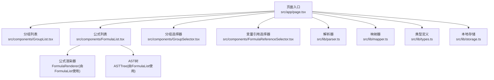
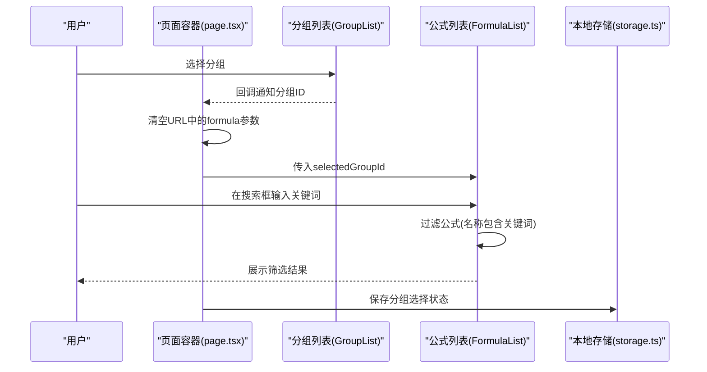
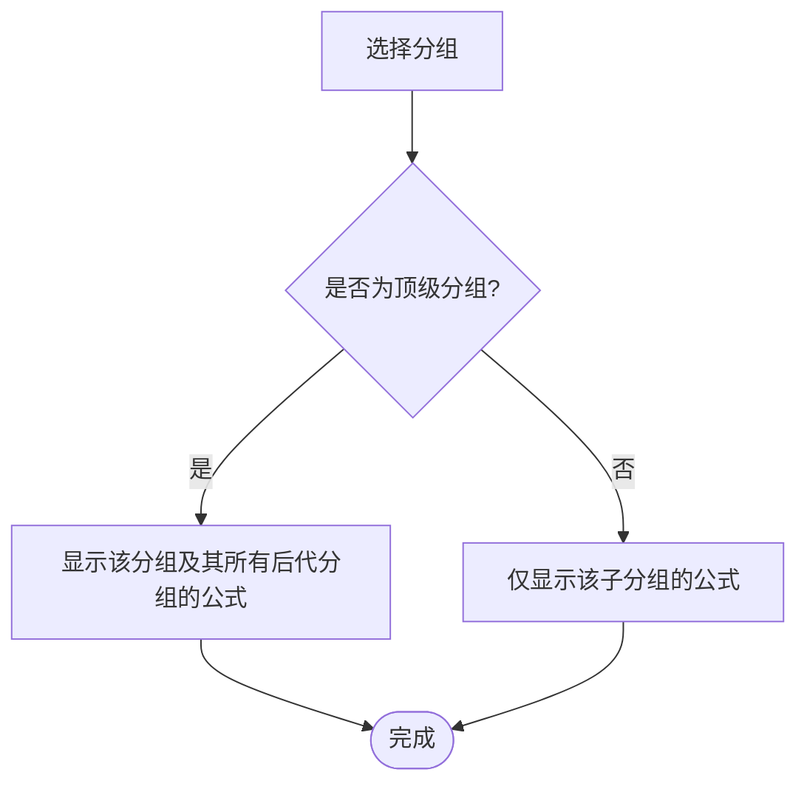
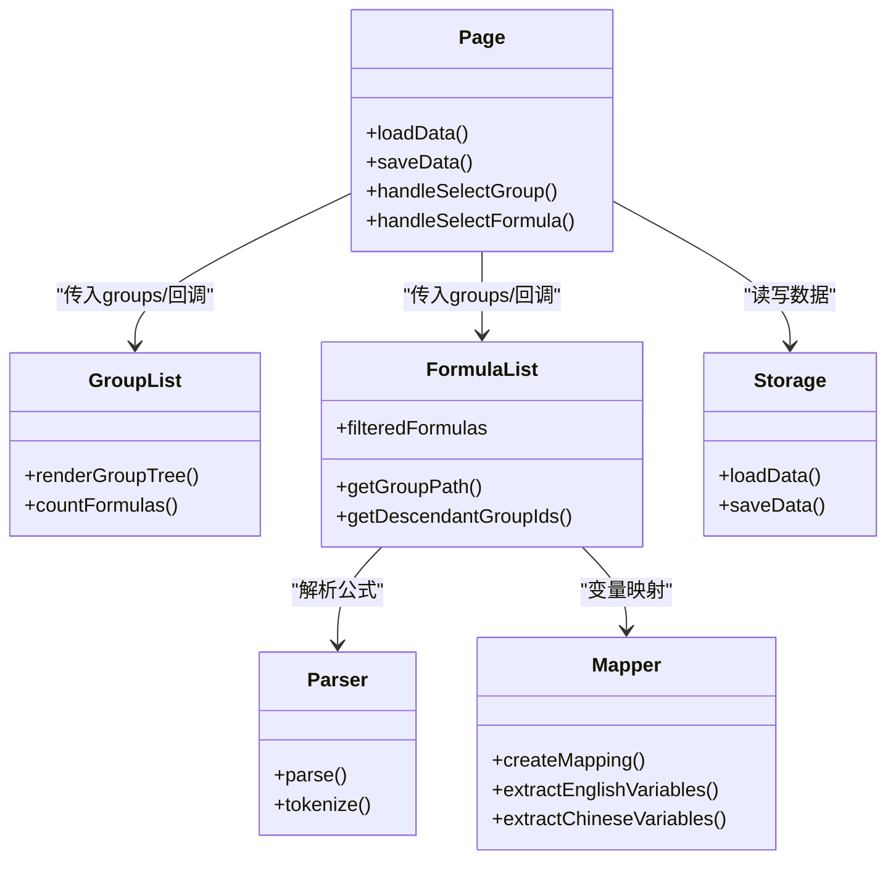
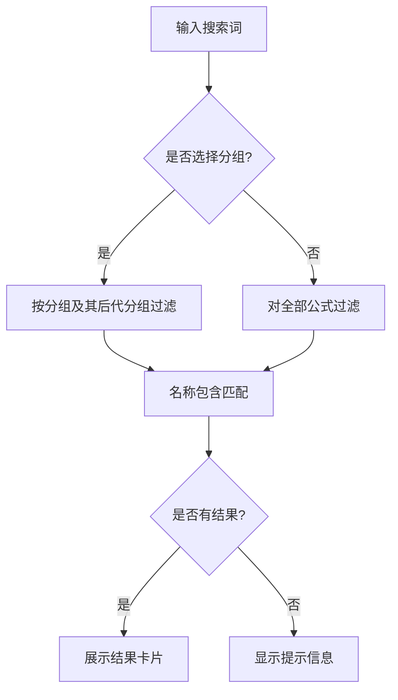

# 公式搜索与筛选

<cite>
**本文档引用的文件**
- [src/app/page.tsx](file://src/app/page.tsx)
- [src/components/FormulaList.tsx](file://src/components/FormulaList.tsx)
- [src/components/GroupList.tsx](file://src/components/GroupList.tsx)
- [src/lib/parser.ts](file://src/lib/parser.ts)
- [src/lib/mapper.ts](file://src/lib/mapper.ts)
- [src/lib/types.ts](file://src/lib/types.ts)
- [src/lib/storage.ts](file://src/lib/storage.ts)
- [src/components/FormulaReferenceSelector.tsx](file://src/components/FormulaReferenceSelector.tsx)
- [src/components/GroupSelector.tsx](file://src/components/GroupSelector.tsx)
</cite>

## 目录
1. [简介](#简介)
2. [项目结构](#项目结构)
3. [核心组件](#核心组件)
4. [架构总览](#架构总览)
5. [详细组件分析](#详细组件分析)
6. [依赖关系分析](#依赖关系分析)
7. [性能考虑](#性能考虑)
8. [故障排查指南](#故障排查指南)
9. [结论](#结论)
10. [附录](#附录)

## 简介
本指南面向“公式搜索与筛选”功能，帮助用户高效地在公式库中查找、定位和浏览公式。内容涵盖：
- 搜索框的使用方法与搜索语法
- 按分组筛选的层级结构与行为
- 搜索结果的排序与显示方式
- 高级搜索技巧与搜索词优化建议
- 搜索性能优化与大数据量下的使用建议
- 搜索历史与常用搜索的管理方法

## 项目结构
本应用采用 Next.js 客户端组件模式，围绕“分组-公式”的树形结构组织数据，并通过 URL 参数与本地缓存实现状态持久化与分享能力。

图表来源
- [src/app/page.tsx:14-798](file://src/app/page.tsx#L14-L798)
- [src/components/FormulaList.tsx:1-387](file://src/components/FormulaList.tsx#L1-L387)
- [src/components/GroupList.tsx:1-294](file://src/components/GroupList.tsx#L1-L294)
- [src/lib/parser.ts:1-159](file://src/lib/parser.ts#L1-L159)
- [src/lib/mapper.ts:1-89](file://src/lib/mapper.ts#L1-L89)
- [src/lib/types.ts:1-51](file://src/lib/types.ts#L1-L51)
- [src/lib/storage.ts:1-50](file://src/lib/storage.ts#L1-L50)
- [src/components/FormulaReferenceSelector.tsx:1-132](file://src/components/FormulaReferenceSelector.tsx#L1-L132)
- [src/components/GroupSelector.tsx:1-197](file://src/components/GroupSelector.tsx#L1-L197)

章节来源
- [src/app/page.tsx:14-798](file://src/app/page.tsx#L14-L798)

## 核心组件
- 页面容器与状态中心：负责加载数据、维护分组与公式状态、同步 URL 与本地缓存、提供创建/编辑/删除等操作。
- 分组列表：展示树形分组结构，支持展开/折叠、选择分组、创建/编辑/删除分组。
- 公式列表：提供搜索框与分组筛选，展示公式列表，支持展开查看详情、编辑、删除。
- 解析与映射：解析公式表达式生成 AST，提取变量并建立中英文映射。
- 选择器：分组选择器与变量引用选择器辅助配置公式归属与变量引用。

章节来源
- [src/app/page.tsx:14-798](file://src/app/page.tsx#L14-L798)
- [src/components/FormulaList.tsx:1-387](file://src/components/FormulaList.tsx#L1-L387)
- [src/components/GroupList.tsx:1-294](file://src/components/GroupList.tsx#L1-L294)
- [src/lib/parser.ts:1-159](file://src/lib/parser.ts#L1-L159)
- [src/lib/mapper.ts:1-89](file://src/lib/mapper.ts#L1-L89)
- [src/lib/types.ts:1-51](file://src/lib/types.ts#L1-L51)
- [src/lib/storage.ts:1-50](file://src/lib/storage.ts#L1-L50)
- [src/components/FormulaReferenceSelector.tsx:1-132](file://src/components/FormulaReferenceSelector.tsx#L1-L132)
- [src/components/GroupSelector.tsx:1-197](file://src/components/GroupSelector.tsx#L1-L197)

## 架构总览
公式搜索与筛选的控制流如下：
- 用户在公式列表顶部输入搜索词，触发公式名称的模糊匹配过滤。
- 用户在左侧分组树中选择分组，公式列表根据所选分组及其后代分组进行范围过滤。
- 结果以卡片形式展示，支持展开查看变量映射、公式展示与 AST 结构树。
- URL 参数与本地缓存确保状态可分享与持久化。

图表来源
- [src/app/page.tsx:44-52](file://src/app/page.tsx#L44-L52)
- [src/components/FormulaList.tsx:66-79](file://src/components/FormulaList.tsx#L66-L79)
- [src/lib/storage.ts:17-25](file://src/lib/storage.ts#L17-L25)

## 详细组件分析

### 搜索框与搜索语法
- 搜索位置：位于公式列表顶部，输入框支持清空按钮。
- 搜索范围：默认对所有公式进行过滤；若选择了分组，则仅对所选分组及其后代分组内的公式进行过滤。
- 搜索条件：基于公式名称的大小写不敏感包含匹配。
- 搜索词优化建议：
  - 使用更具体的关键词以减少结果集，提高定位效率。
  - 若公式名称包含特定领域术语，优先使用该术语作为关键词。
  - 对于多关键字场景，建议先按分组缩小范围，再在范围内使用关键词进一步筛选。

章节来源
- [src/components/FormulaList.tsx:90-112](file://src/components/FormulaList.tsx#L90-L112)
- [src/components/FormulaList.tsx:74-79](file://src/components/FormulaList.tsx#L74-L79)

### 按分组筛选与层级结构
- 分组层级：支持两级分组（顶级分组与子分组），分组树可展开/折叠。
- 筛选行为：
  - 选择顶级分组：显示该分组及其所有后代分组中的公式。
  - 选择子分组：仅显示该子分组自身的公式。
- 分组路径显示：公式卡片上会显示所属分组的完整路径（如“父分组/子分组”）。
- 自动展开：当选择某分组时，页面会自动展开其所有祖先分组，便于导航。

图表来源
- [src/components/FormulaList.tsx:56-72](file://src/components/FormulaList.tsx#L56-L72)
- [src/components/FormulaList.tsx:31-45](file://src/components/FormulaList.tsx#L31-L45)

章节来源
- [src/components/GroupList.tsx:33-111](file://src/components/GroupList.tsx#L33-L111)
- [src/components/FormulaList.tsx:56-72](file://src/components/FormulaList.tsx#L56-L72)

### 搜索结果的排序与显示
- 排序规则：当前实现未对结果进行显式排序，结果顺序遵循“按分组遍历 + 公式数组顺序”的自然顺序。
- 显示方式：
  - 每条结果以卡片形式呈现，包含公式名称、所属分组标签、英文公式预览。
  - 点击卡片可展开查看变量映射、公式展示与 AST 结构树。
  - 无结果时显示提示信息，区分“未找到匹配的公式”和“暂无公式”。

章节来源
- [src/components/FormulaList.tsx:114-136](file://src/components/FormulaList.tsx#L114-L136)
- [src/components/FormulaList.tsx:120-135](file://src/components/FormulaList.tsx#L120-L135)

### 高级搜索技巧与搜索词优化
- 组合策略：
  - 先在左侧分组树中选择目标分组，缩小范围后再在搜索框输入关键词，可显著提升命中率。
  - 对于命名规范统一的公式，优先使用名称中的关键词；对于复杂公式，可结合变量名进行检索。
- 变量引用辅助：
  - 通过变量引用选择器为变量绑定具体公式，有助于在公式展示中快速跳转到被引用的公式。
- AST 与解析：
  - 展开公式详情可查看 AST 结构树，便于理解表达式结构，间接辅助定位相关公式。

章节来源
- [src/components/FormulaReferenceSelector.tsx:14-132](file://src/components/FormulaReferenceSelector.tsx#L14-L132)
- [src/lib/parser.ts:12-22](file://src/lib/parser.ts#L12-L22)

### 搜索历史与常用搜索管理
- URL 分享：页面支持通过 URL 参数分享当前选中的公式，便于他人访问。
- 本地缓存：页面会缓存分组选择状态与侧边栏展开状态，刷新后自动恢复。
- 历史记录：当前实现未内置“搜索历史”或“常用搜索”列表，但可通过以下方式实现类似效果：
  - 使用浏览器书签保存特定 URL（含 formula 参数）。
  - 使用分组筛选 + 关键词组合形成“固定查询模板”，重复使用。

章节来源
- [src/app/page.tsx:25-52](file://src/app/page.tsx#L25-L52)
- [src/app/page.tsx:89-133](file://src/app/page.tsx#L89-L133)

## 依赖关系分析

图表来源
- [src/app/page.tsx:14-798](file://src/app/page.tsx#L14-L798)
- [src/components/FormulaList.tsx:1-387](file://src/components/FormulaList.tsx#L1-L387)
- [src/lib/parser.ts:1-159](file://src/lib/parser.ts#L1-L159)
- [src/lib/mapper.ts:1-89](file://src/lib/mapper.ts#L1-L89)
- [src/lib/storage.ts:1-50](file://src/lib/storage.ts#L1-L50)

章节来源
- [src/lib/types.ts:1-51](file://src/lib/types.ts#L1-L51)

## 性能考虑
- 计算优化：
  - 使用 useMemo 缓存变量提取与公式列表，避免重复计算。
  - 分组树构建与公式计数逻辑保持简洁，减少不必要的递归与遍历。
- 渲染优化：
  - 公式详情仅在展开时解析与渲染，避免一次性渲染大量 AST。
  - 使用受控组件与精确的状态更新，减少无效重渲染。
- 数据持久化：
  - 本地存储仅在数据变更时写入，避免频繁 I/O。
- 大数据量建议：
  - 优先使用分组筛选缩小范围，再配合关键词搜索。
  - 对于超大公式集，建议拆分到更多分组层级，降低单次渲染压力。
  - 避免在搜索框中输入过长或过于宽泛的关键词，以免产生大量中间结果。

章节来源
- [src/components/FormulaReferenceSelector.tsx:21-34](file://src/components/FormulaReferenceSelector.tsx#L21-L34)
- [src/components/FormulaList.tsx:169-192](file://src/components/FormulaList.tsx#L169-L192)
- [src/lib/storage.ts:17-25](file://src/lib/storage.ts#L17-L25)

## 故障排查指南
- 搜索无结果：
  - 确认是否选择了正确的分组；顶级分组会显示所有后代分组的公式。
  - 检查关键词大小写是否影响匹配（当前为大小写不敏感）。
- 分组筛选异常：
  - 确认所选分组是否为顶级分组；顶级分组显示所有后代分组的公式，子分组仅显示自身。
  - 检查分组树是否正确展开，必要时手动展开父分组。
- 公式详情不显示：
  - 确认公式已展开；仅展开时才会解析并渲染变量映射与 AST。
  - 检查公式表达式是否符合解析器支持的语法（变量、数字、四则运算与括号）。
- URL 分享失效：
  - 确认 URL 中包含 formula 参数且对应公式仍存在于数据中。
  - 刷新页面后，URL 参数会自动恢复选中状态。
- 本地缓存异常：
  - 检查浏览器是否禁用本地存储；必要时清除缓存后重试。

章节来源
- [src/components/FormulaList.tsx:169-192](file://src/components/FormulaList.tsx#L169-L192)
- [src/lib/parser.ts:12-22](file://src/lib/parser.ts#L12-L22)
- [src/app/page.tsx:89-133](file://src/app/page.tsx#L89-L133)

## 结论
本应用提供了直观的“分组筛选 + 名称搜索”的组合式检索体验。通过合理使用分组层级与关键词，用户可以快速定位所需公式；借助变量映射与 AST 展示，能够深入理解公式结构与变量关系。对于大规模数据，建议优先利用分组体系与缓存机制，以获得最佳性能与体验。

## 附录

### 搜索流程图（概念性）

[本图为概念性流程，不直接映射具体源码文件，故无图表来源]