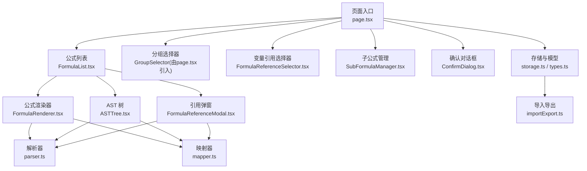
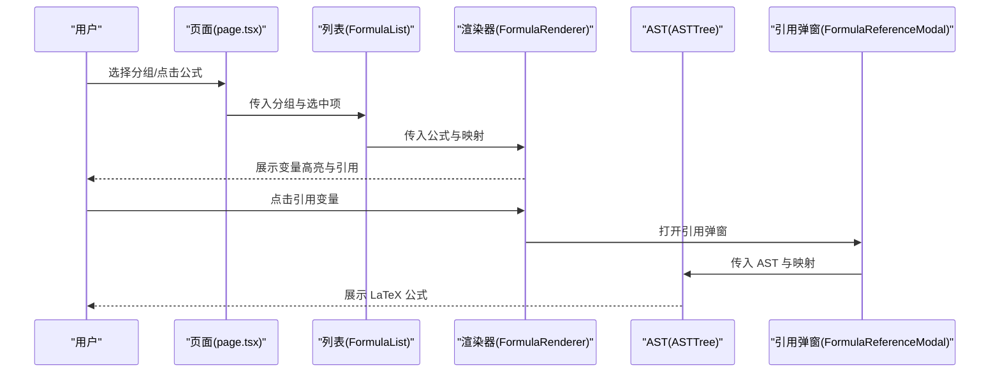
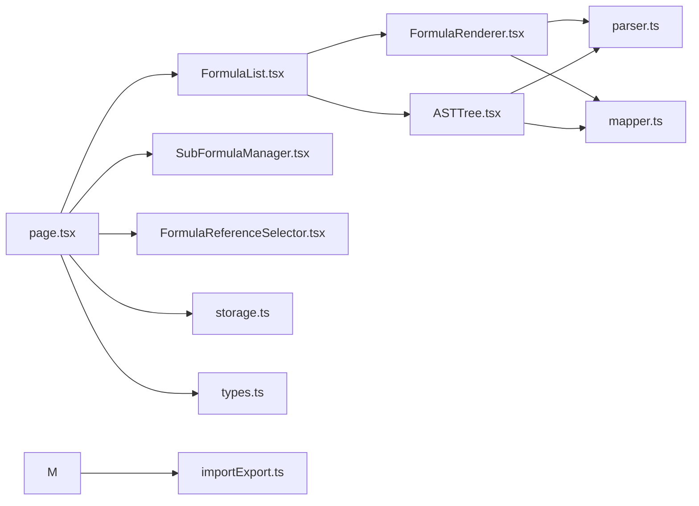
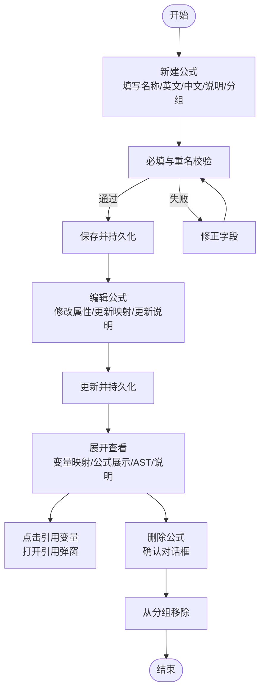
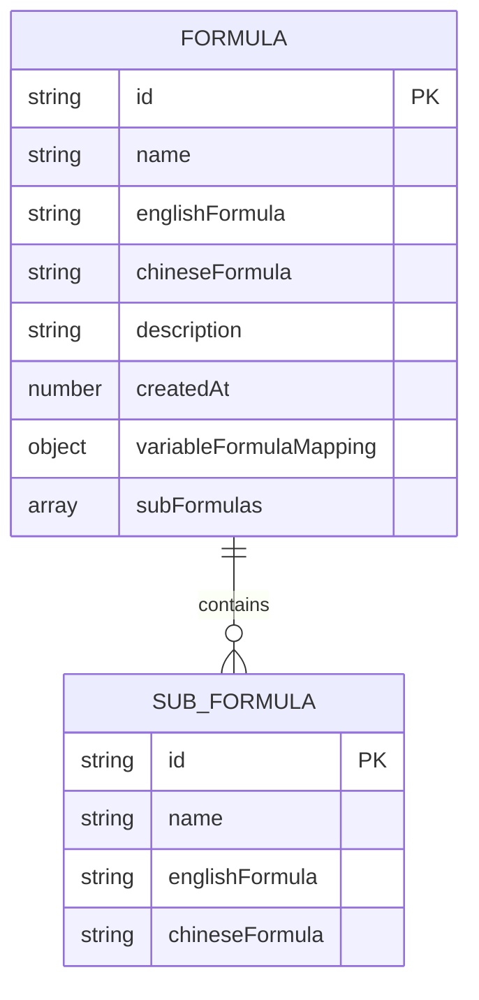

# 公式管理

<cite>
**本文引用的文件**
- [src/app/page.tsx](file://src/app/page.tsx)
- [src/components/FormulaList.tsx](file://src/components/FormulaList.tsx)
- [src/components/FormulaRenderer.tsx](file://src/components/FormulaRenderer.tsx)
- [src/components/ASTTree.tsx](file://src/components/ASTTree.tsx)
- [src/components/FormulaReferenceModal.tsx](file://src/components/FormulaReferenceModal.tsx)
- [src/components/FormulaReferenceSelector.tsx](file://src/components/FormulaReferenceSelector.tsx)
- [src/components/SubFormulaManager.tsx](file://src/components/SubFormulaManager.tsx)
- [src/components/ConfirmDialog.tsx](file://src/components/ConfirmDialog.tsx)
- [src/lib/types.ts](file://src/lib/types.ts)
- [src/lib/parser.ts](file://src/lib/parser.ts)
- [src/lib/mapper.ts](file://src/lib/mapper.ts)
- [src/lib/storage.ts](file://src/lib/storage.ts)
- [src/lib/importExport.ts](file://src/lib/importExport.ts)
- [public/demo-data.json](file://public/demo-data.json)
- [package.json](file://package.json)
</cite>

## 更新摘要
**变更内容**
- 新增公式描述字段功能，包括数据模型扩展、表单界面增强和列表展示改进
- 更新公式创建和编辑表单，增加可选的说明字段
- 增强公式列表展示，支持显示公式描述信息
- 更新数据导入导出功能，兼容新的描述字段
- **更新演示数据状态：当前演示数据中仍包含 min、sum、max 函数示例，文档需反映实际演示数据状态**

## 目录
1. [简介](#简介)
2. [项目结构](#项目结构)
3. [核心组件](#核心组件)
4. [架构总览](#架构总览)
5. [详细组件分析](#详细组件分析)
6. [依赖分析](#依赖分析)
7. [性能考虑](#性能考虑)
8. [故障排查指南](#故障排查指南)
9. [结论](#结论)
10. [附录](#附录)

## 简介
本指南面向使用者，系统讲解"公式管理"功能的完整操作流程与最佳实践，覆盖公式全生命周期：创建、编辑、删除、复制（批量）、查看与引用、变量映射配置、搜索与筛选、以及常见问题与注意事项。通过清晰的操作步骤与图示，帮助不同技术背景的用户高效上手。

**更新** 新增公式描述字段功能，为公式提供更丰富的元数据信息，支持详细的使用说明和备注。当前演示数据中仍包含 min、sum、max 函数示例，展示了函数型公式的实际应用场景。

## 项目结构
本应用采用 Next.js 客户端组件模式，围绕"分组-公式-子公式"的层次结构组织数据，并通过本地存储持久化。主要模块如下：
- 页面入口与主控制器：负责状态管理、URL 同步、分组与公式 CRUD、导入导出
- 列表与详情：公式列表、公式项展开、公式渲染、AST 结构树、引用弹窗
- 配置与映射：变量引用选择器、子公式管理、变量映射生成
- 工具与解析：公式词法/语法解析、变量抽取与映射、类型定义
- UI 组件：通用按钮、对话框、下拉菜单、输入控件

**图表来源**
- [src/app/page.tsx:14-707](file://src/app/page.tsx#L14-L707)
- [src/components/FormulaList.tsx:1-387](file://src/components/FormulaList.tsx#L1-L387)
- [src/components/FormulaRenderer.tsx:1-169](file://src/components/FormulaRenderer.tsx#L1-L169)
- [src/components/ASTTree.tsx:1-179](file://src/components/ASTTree.tsx#L1-L179)
- [src/components/FormulaReferenceModal.tsx:1-180](file://src/components/FormulaReferenceModal.tsx#L1-L180)
- [src/components/FormulaReferenceSelector.tsx:1-132](file://src/components/FormulaReferenceSelector.tsx#L1-L132)
- [src/components/SubFormulaManager.tsx:1-201](file://src/components/SubFormulaManager.tsx#L1-L201)
- [src/components/ConfirmDialog.tsx:1-54](file://src/components/ConfirmDialog.tsx#L1-L54)
- [src/lib/storage.ts:1-50](file://src/lib/storage.ts#L1-L50)
- [src/lib/types.ts:1-52](file://src/lib/types.ts#L1-L52)
- [src/lib/parser.ts:1-159](file://src/lib/parser.ts#L1-L159)
- [src/lib/mapper.ts:1-89](file://src/lib/mapper.ts#L1-L89)
- [src/lib/importExport.ts:1-56](file://src/lib/importExport.ts#L1-L56)

**章节来源**
- [src/app/page.tsx:14-707](file://src/app/page.tsx#L14-L707)

## 核心组件
- 公式列表与搜索筛选：支持按分组层级过滤、按公式名称模糊搜索、展开查看详情、编辑与删除
- 公式表单：名称、英文公式、中文公式、**新增说明字段**、分组选择、变量引用映射、子公式管理
- 公式渲染与可视化：变量高亮、变量映射、引用跳转、AST 结构树（LaTeX）
- 变量映射与引用：自动生成变量映射、支持引用外部公式或子公式
- 确认对话框：删除等危险操作的二次确认
- 本地存储与导入导出：基于浏览器本地存储，支持 JSON 文件导入导出

**更新** 公式表单现已包含可选的说明字段，支持为公式添加详细的使用说明、备注信息等。当前演示数据中仍包含 min、sum、max 函数示例，展示了函数型公式的实际应用场景。

**章节来源**
- [src/components/FormulaList.tsx:21-139](file://src/components/FormulaList.tsx#L21-L139)
- [src/app/page.tsx:204-360](file://src/app/page.tsx#L204-L360)
- [src/components/FormulaRenderer.tsx:27-115](file://src/components/FormulaRenderer.tsx#L27-L115)
- [src/components/ASTTree.tsx:11-111](file://src/components/ASTTree.tsx#L11-L111)
- [src/components/FormulaReferenceSelector.tsx:14-112](file://src/components/FormulaReferenceSelector.tsx#L14-L112)
- [src/components/SubFormulaManager.tsx:12-63](file://src/components/SubFormulaManager.tsx#L12-L63)
- [src/components/ConfirmDialog.tsx:16-52](file://src/components/ConfirmDialog.tsx#L16-L52)
- [src/lib/storage.ts:5-25](file://src/lib/storage.ts#L5-L25)

## 架构总览
公式管理采用"页面级状态 + 组件化渲染 + 工具层解析"的分层设计：
- 页面层：维护分组、公式、当前选中项、URL 同步、导入导出
- 列表层：聚合分组与公式，实现分组过滤与名称搜索
- 渲染层：公式展示、AST 树、引用弹窗
- 工具层：解析器（词法/语法）、映射器（变量抽取与配对）

**图表来源**
- [src/app/page.tsx:537-544](file://src/app/page.tsx#L537-L544)
- [src/components/FormulaList.tsx:120-136](file://src/components/FormulaList.tsx#L120-L136)
- [src/components/FormulaRenderer.tsx:27-115](file://src/components/FormulaRenderer.tsx#L27-L115)
- [src/components/ASTTree.tsx:11-111](file://src/components/ASTTree.tsx#L11-L111)
- [src/components/FormulaReferenceModal.tsx:18-87](file://src/components/FormulaReferenceModal.tsx#L18-L87)

## 详细组件分析

### 公式创建与表单字段规范
- 字段说明
  - 公式名称：必填，同一分组内不可重复
  - 英文公式：必填，作为解析与映射的基础表达式
  - 中文公式：必填，用于生成变量映射与中文展示
  - **新增说明字段**：可选，支持添加详细的使用说明、备注信息
  - 分组选择：必选，决定公式归属；支持父子分组
  - 变量引用映射：可选，将变量映射到外部公式或子公式
  - 子公式管理：可选，嵌入局部子公式，便于复用与拆分
- 输入规范
  - 英文公式应符合词法/语法：变量名以字母开头，支持 + - * / 与括号
  - 中文公式需与英文公式变量一一对应，顺序建议一致
  - 分组名称唯一性仅在当前父分组内校验
  - 说明字段支持多行文本，建议简洁明了
- 表单交互
  - 新建时默认填充当前选中分组；编辑时回显原值
  - 保存前进行必填校验与重名校验

**更新** 新增的说明字段为可选字段，支持用户添加详细的使用说明、注意事项、版本信息等。当前演示数据中仍包含 min、sum、max 函数示例，展示了函数型公式的实际应用场景。

**章节来源**
- [src/app/page.tsx:204-239](file://src/app/page.tsx#L204-L239)
- [src/app/page.tsx:253-289](file://src/app/page.tsx#L253-L289)
- [src/app/page.tsx:392-420](file://src/app/page.tsx#L392-L420)
- [src/components/SubFormulaManager.tsx:20-63](file://src/components/SubFormulaManager.tsx#L20-L63)
- [src/components/FormulaReferenceSelector.tsx:39-47](file://src/components/FormulaReferenceSelector.tsx#L39-L47)

### 公式编辑与更新
- 步骤
  - 在公式列表点击"编辑"，打开表单
  - 修改任一字段后点击"更新"
  - 若变更分组，系统会从原分组移除并在新分组添加
- 注意事项
  - 同一分组内重名禁止
  - 分组变更不会影响变量映射与子公式内容
  - **说明字段支持随时更新，无需重新解析公式**

**更新** 编辑功能现已包含说明字段的更新，用户可以随时修改公式的详细说明。当前演示数据中仍包含 min、sum、max 函数示例，展示了函数型公式的实际应用场景。

**章节来源**
- [src/app/page.tsx:253-289](file://src/app/page.tsx#L253-L289)
- [src/app/page.tsx:291-360](file://src/app/page.tsx#L291-L360)

### 公式删除与确认
- 步骤
  - 在公式项点击"删除"，弹出确认对话框
  - 确认后从分组中移除该公式
- 数据清理
  - 删除不涉及变量映射与子公式的级联清理，仅移除公式本身

**章节来源**
- [src/components/FormulaList.tsx:164-167](file://src/components/FormulaList.tsx#L164-L167)
- [src/components/FormulaList.tsx:370-383](file://src/components/FormulaList.tsx#L370-L383)
- [src/app/page.tsx:241-251](file://src/app/page.tsx#L241-L251)

### 公式复制（批量操作）
- 说明
  - 当前实现未提供"复制公式"快捷按钮；可通过"新建公式"+粘贴原文方式批量复用
  - 建议在"编辑公式"后，将英文/中文公式复制到剪贴板，再在"新建公式"中粘贴
- 建议
  - 对于频繁使用的公式，优先使用"变量引用映射"指向现有公式，减少重复录入
  - **说明字段需要手动重新输入，无法通过复制功能继承**

**更新** 说明字段无法通过复制功能继承，需要用户手动重新输入。当前演示数据中仍包含 min、sum、max 函数示例，展示了函数型公式的实际应用场景。

**章节来源**
- [src/app/page.tsx:253-289](file://src/app/page.tsx#L253-L289)
- [src/app/page.tsx:204-239](file://src/app/page.tsx#L204-L239)

### 公式搜索与筛选
- 名称搜索
  - 在公式列表顶部输入框中输入关键词，按名称模糊匹配
- 分组筛选
  - 通过左侧分组列表选择分组，仅显示该分组及其所有后代分组的公式
- 清空搜索
  - 输入框右侧提供清空按钮，一键清除搜索条件

**更新** 搜索功能目前仅支持按公式名称进行模糊匹配，不包含说明字段的搜索。当前演示数据中仍包含 min、sum、max 函数示例，展示了函数型公式的实际应用场景。

**章节来源**
- [src/components/FormulaList.tsx:29-79](file://src/components/FormulaList.tsx#L29-L79)
- [src/app/page.tsx:44-52](file://src/app/page.tsx#L44-L52)

### 变量映射设置与最佳实践
- 自动生成
  - 基于英文公式变量与中文公式片段，自动生成变量映射
- 手动优化
  - 中文变量多于英文时，多余部分会标注为"未定义"
  - 建议保持中英文变量数量一致、顺序一致，提升可读性
- 引用映射
  - 使用"变量引用映射"将变量指向外部公式或子公式，点击变量可直接跳转查看

**章节来源**
- [src/lib/mapper.ts:52-70](file://src/lib/mapper.ts#L52-L70)
- [src/components/FormulaReferenceSelector.tsx:39-47](file://src/components/FormulaReferenceSelector.tsx#L39-L47)
- [src/components/FormulaRenderer.tsx:54-86](file://src/components/FormulaRenderer.tsx#L54-L86)

### 公式展示与 AST 可视化
- 公式展示
  - 变量高亮、颜色区分、悬浮提示、引用点击跳转
- AST 结构树
  - 支持切换英文/中文变量展示，LaTeX 渲染，变量映射说明
- 错误处理
  - 解析失败时显示错误信息，避免误导

**更新** 公式展示功能现已包含说明字段的显示，用户可以在公式列表中看到公式的详细说明。当前演示数据中仍包含 min、sum、max 函数示例，展示了函数型公式的实际应用场景。

**章节来源**
- [src/components/FormulaRenderer.tsx:27-115](file://src/components/FormulaRenderer.tsx#L27-L115)
- [src/components/ASTTree.tsx:11-111](file://src/components/ASTTree.tsx#L11-L111)
- [src/components/FormulaList.tsx:169-192](file://src/components/FormulaList.tsx#L169-L192)

### 子公式管理
- 功能
  - 新增、编辑、删除子公式
  - 子公式在变量引用映射中以"sub_"前缀标识
- 使用场景
  - 将复杂公式拆分为可复用的子公式，提升可维护性

**章节来源**
- [src/components/SubFormulaManager.tsx:12-63](file://src/components/SubFormulaManager.tsx#L12-L63)
- [src/components/FormulaReferenceSelector.tsx:75-84](file://src/components/FormulaReferenceSelector.tsx#L75-L84)

### 数据导入导出与持久化
- 本地存储
  - 使用浏览器本地存储，刷新不丢失
- 导入导出
  - 支持 JSON 文件导入导出，导入前会提示覆盖确认
  - **新增说明字段已完全兼容导入导出功能**

**更新** 导入导出功能已完全兼容新增的说明字段，旧版本数据导入时说明字段将保持为空。当前演示数据中仍包含 min、sum、max 函数示例，展示了函数型公式的实际应用场景。

**章节来源**
- [src/lib/storage.ts:5-25](file://src/lib/storage.ts#L5-L25)
- [src/app/page.tsx:362-390](file://src/app/page.tsx#L362-L390)
- [src/lib/importExport.ts:1-56](file://src/lib/importExport.ts#L1-L56)

## 依赖分析
- 外部依赖
  - 渲染：KaTeX 用于公式 LaTeX 渲染
  - UI：Radix UI、Lucide React、Tailwind CSS
- 内部依赖
  - 类型与工具：types.ts、parser.ts、mapper.ts
  - 组件：FormulaList、FormulaRenderer、ASTTree、FormulaReferenceModal、FormulaReferenceSelector、SubFormulaManager、ConfirmDialog

**图表来源**
- [src/app/page.tsx:1-13](file://src/app/page.tsx#L1-L13)
- [src/components/FormulaList.tsx:1-11](file://src/components/FormulaList.tsx#L1-L11)
- [src/components/FormulaRenderer.tsx:1-5](file://src/components/FormulaRenderer.tsx#L1-L5)
- [src/components/ASTTree.tsx:1-5](file://src/components/ASTTree.tsx#L1-L5)
- [src/components/SubFormulaManager.tsx:1-6](file://src/components/SubFormulaManager.tsx#L1-L6)
- [src/components/FormulaReferenceSelector.tsx:1-5](file://src/components/FormulaReferenceSelector.tsx#L1-L5)
- [src/lib/parser.ts:1-2](file://src/lib/parser.ts#L1-L2)
- [src/lib/mapper.ts:1-2](file://src/lib/mapper.ts#L1-L2)
- [src/lib/storage.ts:1-3](file://src/lib/storage.ts#L1-L3)
- [src/lib/types.ts:1-5](file://src/lib/types.ts#L1-L5)
- [src/lib/importExport.ts:1-5](file://src/lib/importExport.ts#L1-L5)

**章节来源**
- [package.json:15-34](file://package.json#L15-L34)

## 性能考虑
- 计算缓存
  - 变量提取与公式列表构建使用记忆化，避免重复计算
- 渲染优化
  - 公式展开时才解析 AST 与生成映射，折叠时清空状态，降低渲染压力
- 搜索与筛选
  - 仅在输入变化时触发过滤，避免全量重排

**更新** 说明字段的渲染采用条件显示逻辑，只有当公式存在说明时才会渲染，避免不必要的 DOM 元素创建。当前演示数据中仍包含 min、sum、max 函数示例，展示了函数型公式的实际应用场景。

**章节来源**
- [src/components/FormulaReferenceSelector.tsx:21-34](file://src/components/FormulaReferenceSelector.tsx#L21-L34)
- [src/components/FormulaList.tsx:169-192](file://src/components/FormulaList.tsx#L169-L192)

## 故障排查指南
- 公式解析报错
  - 现象：展开公式详情时显示"解析错误"
  - 排查：检查英文公式是否包含非法字符、括号是否匹配、变量命名是否规范
- 变量映射不完整
  - 现象：中文变量多于英文变量或顺序不一致
  - 排查：确保中英文公式变量数量与顺序一致，必要时调整中文公式片段
- 引用变量无法点击
  - 现象：变量显示为普通文本而非可点击链接
  - 排查：确认变量已在"变量引用映射"中正确配置，且目标公式存在
- 删除后仍可见
  - 现象：删除后公式仍在列表中
  - 排查：确认删除成功并已保存；如使用浏览器隐私模式，注意本地存储限制
- 导入覆盖风险
  - 现象：导入后数据被覆盖
  - 排查：导入前系统会提示确认，谨慎操作
- **新增说明字段显示异常**
  - 现象：公式列表中看不到说明文字
  - 排查：确认公式确实包含了说明字段，检查说明内容是否为空或过长导致截断

**更新** 新增了说明字段相关的故障排查指南。当前演示数据中仍包含 min、sum、max 函数示例，展示了函数型公式的实际应用场景。

**章节来源**
- [src/components/FormulaList.tsx:169-192](file://src/components/FormulaList.tsx#L169-L192)
- [src/components/FormulaRenderer.tsx:54-86](file://src/components/FormulaRenderer.tsx#L54-L86)
- [src/app/page.tsx:371-390](file://src/app/page.tsx#L371-L390)

## 结论
本指南提供了从创建到可视化的完整公式管理操作路径。通过合理的变量映射与引用机制、清晰的搜索筛选与分组体系，以及本地存储与导入导出能力，用户可以高效地组织与维护公式资产。

**更新** 新增的说明字段功能进一步增强了公式的元数据管理能力，用户可以通过详细的说明信息提升公式的可读性和可维护性。当前演示数据中仍包含 min、sum、max 函数示例，展示了函数型公式的实际应用场景。建议在日常使用中充分利用说明字段，为重要的公式添加必要的使用说明和注意事项。

## 附录

### 公式生命周期操作流程图

**更新** 操作流程图已更新，包含说明字段的创建、编辑和更新流程。当前演示数据中仍包含 min、sum、max 函数示例，展示了函数型公式的实际应用场景。

**图表来源**
- [src/app/page.tsx:204-239](file://src/app/page.tsx#L204-L239)
- [src/app/page.tsx:253-360](file://src/app/page.tsx#L253-L360)
- [src/components/FormulaList.tsx:169-192](file://src/components/FormulaList.tsx#L169-L192)
- [src/components/FormulaReferenceModal.tsx:18-87](file://src/components/FormulaReferenceModal.tsx#L18-L87)

### 公式数据模型更新

**更新** 数据模型图已更新，包含新增的 description 字段。当前演示数据中仍包含 min、sum、max 函数示例，展示了函数型公式的实际应用场景。

**图表来源**
- [src/lib/types.ts:27-43](file://src/lib/types.ts#L27-L43)

### 演示数据状态说明
**更新** 当前演示数据状态：
- 财务公式分组中包含 min、sum、max 函数示例
- min版本：委托保证金计算，使用 min 函数
- sum版本：开仓手续费计算，使用 sum 函数  
- max版本：仓位保证金计算，使用 max 函数
- 永续业务分组中包含标准财务公式示例
- 测试分组中包含基础加法公式示例

这些示例展示了函数型公式的实际应用场景，包括衍生品合约保证金计算、手续费统计等业务场景。

**章节来源**
- [public/demo-data.json:10-67](file://public/demo-data.json#L10-L67)
- [public/demo-data.json:89-116](file://public/demo-data.json#L89-L116)
- [public/demo-data.json:123-132](file://public/demo-data.json#L123-L132)