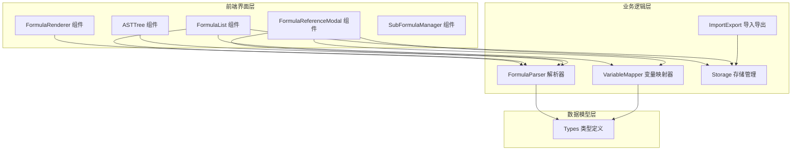
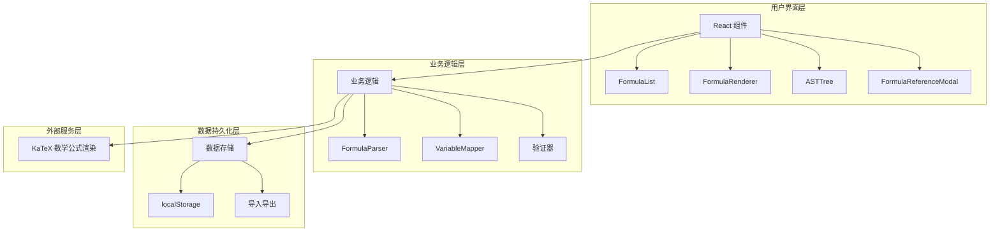
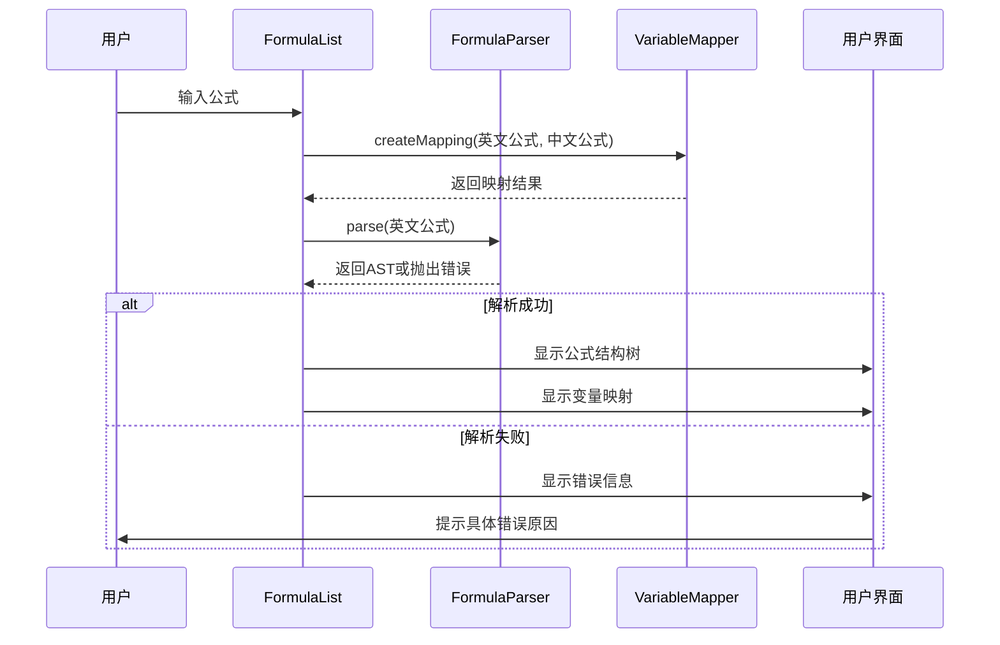
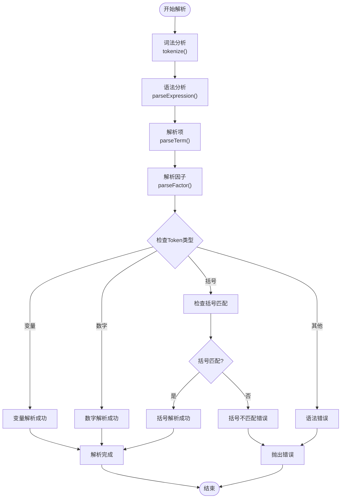
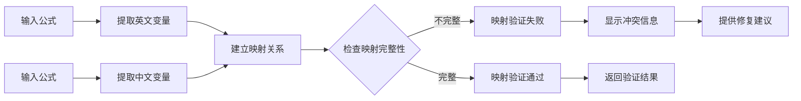
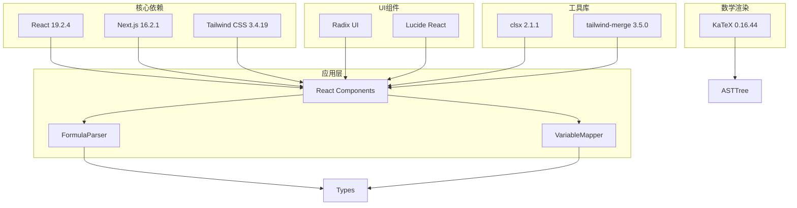

# 公式验证与错误处理

<cite>
**本文档引用的文件**
- [parser.ts](file://src/lib/parser.ts)
- [mapper.ts](file://src/lib/mapper.ts)
- [types.ts](file://src/lib/types.ts)
- [FormulaList.tsx](file://src/components/FormulaList.tsx)
- [FormulaRenderer.tsx](file://src/components/FormulaRenderer.tsx)
- [ASTTree.tsx](file://src/components/ASTTree.tsx)
- [FormulaReferenceModal.tsx](file://src/components/FormulaReferenceModal.tsx)
- [SubFormulaManager.tsx](file://src/components/SubFormulaManager.tsx)
- [storage.ts](file://src/lib/storage.ts)
- [importExport.ts](file://src/lib/importExport.ts)
</cite>

## 目录
1. [简介](#简介)
2. [项目结构](#项目结构)
3. [核心组件](#核心组件)
4. [架构概览](#架构概览)
5. [详细组件分析](#详细组件分析)
6. [依赖关系分析](#依赖关系分析)
7. [性能考虑](#性能考虑)
8. [故障排除指南](#故障排除指南)
9. [结论](#结论)

## 简介

本项目是一个公式验证和错误处理系统，提供了完整的公式语法验证、变量映射验证、错误诊断和修复功能。系统支持英文和中文公式混合输入，能够自动检测和报告公式中的语法错误，并提供可视化的错误诊断界面。

该系统的核心功能包括：
- 公式语法验证和错误检测
- 变量映射验证和冲突处理
- 自动化错误诊断工具
- 手动验证方法
- 错误日志查看和分析技巧

## 项目结构

项目采用模块化设计，主要分为以下层次：



**图表来源**
- [FormulaList.tsx:1-387](file://src/components/FormulaList.tsx#L1-L387)
- [parser.ts:1-159](file://src/lib/parser.ts#L1-L159)
- [mapper.ts:1-89](file://src/lib/mapper.ts#L1-L89)

**章节来源**
- [FormulaList.tsx:1-387](file://src/components/FormulaList.tsx#L1-L387)
- [parser.ts:1-159](file://src/lib/parser.ts#L1-L159)
- [mapper.ts:1-89](file://src/lib/mapper.ts#L1-L89)

## 核心组件

### 公式解析器 (FormulaParser)

公式解析器负责将字符串形式的公式转换为抽象语法树(AST)，并进行语法验证。

**主要功能：**
- 词法分析：将公式字符串分解为Token序列
- 语法分析：构建抽象语法树
- 语法验证：检查括号匹配、操作符使用等
- 错误检测：捕获语法错误并提供详细信息

**关键特性：**
- 支持多种括号类型：`()`, `[]`, `{}` 和全角括号 `（）`
- 支持基本算术运算符：`+`, `-`, `*`, `/`
- 自动检测未匹配的括号和意外字符
- 提供详细的错误位置信息

**章节来源**
- [parser.ts:12-159](file://src/lib/parser.ts#L12-L159)

### 变量映射器 (VariableMapper)

变量映射器负责提取公式中的变量并建立中英文变量之间的映射关系。

**主要功能：**
- 变量提取：从公式中识别和提取变量名
- 映射创建：建立英文变量到中文变量的对应关系
- 冲突检测：识别重复变量和不匹配的变量数量
- 格式化输出：将映射结果格式化为可显示的列表

**关键特性：**
- 支持英文变量识别：以字母开头的标识符
- 支持中文变量识别：通过运算符分割提取
- 自动处理变量数量不匹配的情况
- 提供去重和排序功能

**章节来源**
- [mapper.ts:1-89](file://src/lib/mapper.ts#L1-L89)

### 数据模型 (Types)

定义了系统中使用的数据结构和接口。

**核心数据结构：**
- `Token`: 词法分析的基本单元
- `ASTNode`: 抽象语法树节点
- `Formula`: 公式对象
- `VariableMapping`: 变量映射结果
- `FormulaGroup`: 公式分组

**章节来源**
- [types.ts:1-51](file://src/lib/types.ts#L1-L51)

## 架构概览

系统采用分层架构设计，各层职责明确，耦合度低：



**图表来源**
- [FormulaList.tsx:1-387](file://src/components/FormulaList.tsx#L1-L387)
- [parser.ts:1-159](file://src/lib/parser.ts#L1-L159)
- [mapper.ts:1-89](file://src/lib/mapper.ts#L1-L89)

## 详细组件分析

### 公式验证流程



**图表来源**
- [FormulaList.tsx:169-192](file://src/components/FormulaList.tsx#L169-L192)
- [parser.ts:12-22](file://src/lib/parser.ts#L12-L22)
- [mapper.ts:52-70](file://src/lib/mapper.ts#L52-L70)

### 错误处理机制

系统实现了多层次的错误处理机制：



**图表来源**
- [parser.ts:78-157](file://src/lib/parser.ts#L78-L157)

### 变量映射验证



**图表来源**
- [mapper.ts:4-27](file://src/lib/mapper.ts#L4-L27)
- [mapper.ts:52-70](file://src/lib/mapper.ts#L52-L70)

**章节来源**
- [FormulaList.tsx:170-192](file://src/components/FormulaList.tsx#L170-L192)
- [mapper.ts:1-89](file://src/lib/mapper.ts#L1-L89)

## 依赖关系分析

系统的主要依赖关系如下：



**图表来源**
- [package.json:15-34](file://package.json#L15-L34)
- [FormulaList.tsx:1-11](file://src/components/FormulaList.tsx#L1-L11)

**章节来源**
- [package.json:15-48](file://package.json#L15-L48)

## 性能考虑

### 解析性能优化

1. **懒加载策略**：只有在用户展开公式详情时才进行解析，避免不必要的计算开销
2. **缓存机制**：利用React的状态缓存避免重复解析相同公式
3. **增量更新**：当公式内容发生变化时才重新解析，而不是全局刷新

### 内存管理

1. **及时清理**：当用户收起公式详情时，及时清理AST和映射状态
2. **事件监听器清理**：确保组件卸载时清理定时器和事件监听器
3. **DOM元素管理**：动态加载KaTeX样式表，避免重复加载

### 渲染优化

1. **虚拟滚动**：对于大量公式的情况，可以考虑实现虚拟滚动
2. **组件拆分**：将复杂的组件拆分为更小的可复用组件
3. **条件渲染**：只渲染用户可见的部分内容

## 故障排除指南

### 常见语法错误及解决方案

#### 1. 括号不匹配错误

**错误表现：**
- 提示"括号不匹配：缺少右括号 X"
- 解析在特定位置中断

**诊断步骤：**
1. 检查公式中每种括号的配对情况
2. 确认括号嵌套层级正确
3. 验证不同类型的括号使用是否正确

**修复方法：**
```javascript
// 错误示例
price * (rate + discount  // 缺少右括号

// 正确示例
price * (rate + discount)  // 正确配对
```

#### 2. 未知字符错误

**错误表现：**
- 提示"无法识别的字符: 'X' (位置 N)"
- 解析在特定位置停止

**诊断步骤：**
1. 查看错误消息中的位置信息
2. 检查该位置的字符是否为特殊符号
3. 确认是否使用了不支持的运算符

**修复方法：**
- 使用支持的运算符：`+`, `-`, `*`, `/`
- 避免使用特殊字符作为变量名
- 确保公式中只包含允许的字符

#### 3. 变量映射冲突

**错误表现：**
- 变量数量不匹配
- 映射结果中出现"（未定义）"

**诊断步骤：**
1. 比较英文和中文变量的数量
2. 检查变量命名的一致性
3. 验证变量在两个语言版本中的对应关系

**修复方法：**
```javascript
// 英文公式
total = price * quantity * (1 - discount_rate)

// 中文公式
total = 价格 × 数量 × (1 - 折扣率)
```

### 错误日志查看和分析

#### 1. 控制台日志

系统会在解析失败时抛出详细的错误信息：

```javascript
try {
  const ast = FormulaParser.parse(formula);
} catch (error) {
  console.error('解析错误:', error.message);
  console.error('错误位置:', error.position);
}
```

#### 2. 用户界面错误显示

错误信息会以友好的方式显示给用户：

```jsx
{error && (
  <div className="bg-red-50 border-l-4 border-red-500 p-4 rounded-lg">
    <p className="text-red-700 font-medium text-sm">解析错误</p>
    <p className="text-red-600 text-sm mt-1">{error}</p>
  </div>
)}
```

#### 3. 错误分类和处理

系统将错误分为以下几类：

| 错误类型 | 触发条件 | 解决方案 |
|---------|---------|---------|
| 语法错误 | 不支持的运算符或字符 | 使用标准运算符，移除特殊字符 |
| 括号错误 | 括号不匹配或嵌套错误 | 确保括号成对出现，正确嵌套 |
| 变量错误 | 变量名不符合规范 | 使用字母开头的标识符 |
| 结构错误 | 公式结构不完整 | 完善操作数和运算符 |

**章节来源**
- [parser.ts:17-18](file://src/lib/parser.ts#L17-L18)
- [parser.ts:64](file://src/lib/parser.ts#L64)
- [parser.ts:148-149](file://src/lib/parser.ts#L148-L149)
- [FormulaList.tsx:350-356](file://src/components/FormulaList.tsx#L350-L356)

### 自动化验证工具

#### 1. 实时验证

系统提供实时验证功能，在用户输入时自动检查公式有效性：

```javascript
// 在输入框变更时触发验证
const handleFormulaChange = (value) => {
  try {
    VariableMapper.createMapping(englishFormula, chineseFormula);
    FormulaParser.parse(englishFormula);
    setError('');
  } catch (err) {
    setError(err.message);
  }
};
```

#### 2. 批量验证

对于大量公式的场景，可以实现批量验证功能：

```javascript
const validateAllFormulas = (formulas) => {
  const results = formulas.map(formula => ({
    id: formula.id,
    isValid: true,
    errors: []
  }));

  results.forEach(result => {
    try {
      FormulaParser.parse(formula.englishFormula);
    } catch (error) {
      result.isValid = false;
      result.errors.push(error.message);
    }
  });

  return results;
};
```

#### 3. 导入导出验证

系统支持数据导入导出时的格式验证：

```javascript
// 导入数据验证
const validateImportData = (jsonData) => {
  try {
    const data = JSON.parse(jsonData);
    
    // 验证必需字段
    if (!data.version || !Array.isArray(data.groups)) {
      throw new Error('数据格式不正确');
    }
    
    // 验证每个分组
    data.groups.forEach((group, index) => {
      if (!group.id || !group.name) {
        throw new Error(`分组 ${index + 1} 缺少必需字段`);
      }
    });
    
    return true;
  } catch (error) {
    throw new Error(`导入验证失败: ${error.message}`);
  }
};
```

**章节来源**
- [FormulaList.tsx:170-192](file://src/components/FormulaList.tsx#L170-L192)
- [importExport.ts:43-75](file://src/lib/importExport.ts#L43-L75)

## 结论

本公式验证与错误处理系统提供了完整的公式管理解决方案，具有以下特点：

### 主要优势

1. **全面的语法验证**：支持多种括号类型和运算符，能够准确检测语法错误
2. **智能变量映射**：自动提取和映射变量，支持中英文混合使用
3. **友好的错误处理**：提供详细的错误信息和修复建议
4. **可视化界面**：通过AST树和公式渲染提供直观的验证结果
5. **灵活的数据管理**：支持本地存储和导入导出功能

### 技术特色

- **模块化设计**：清晰的分层架构，便于维护和扩展
- **性能优化**：懒加载和缓存机制，提升用户体验
- **错误恢复**：完善的错误处理和恢复机制
- **可扩展性**：支持自定义验证规则和扩展功能

### 应用价值

该系统适用于需要管理复杂公式的企业应用场景，如财务计算、工程设计、数据分析等领域。通过提供自动化的验证和错误处理功能，显著提高了公式的可靠性和维护效率。

未来可以进一步增强的功能包括：
- 更丰富的数学函数支持
- 公式版本管理和历史记录
- 团队协作和权限管理
- 高级验证规则配置
- 性能监控和分析工具