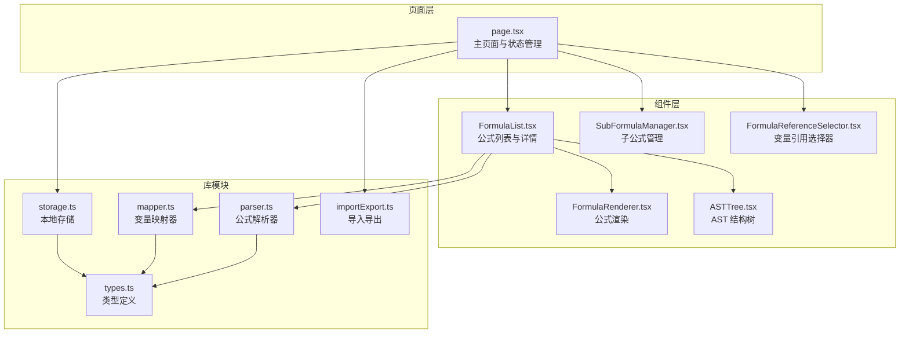
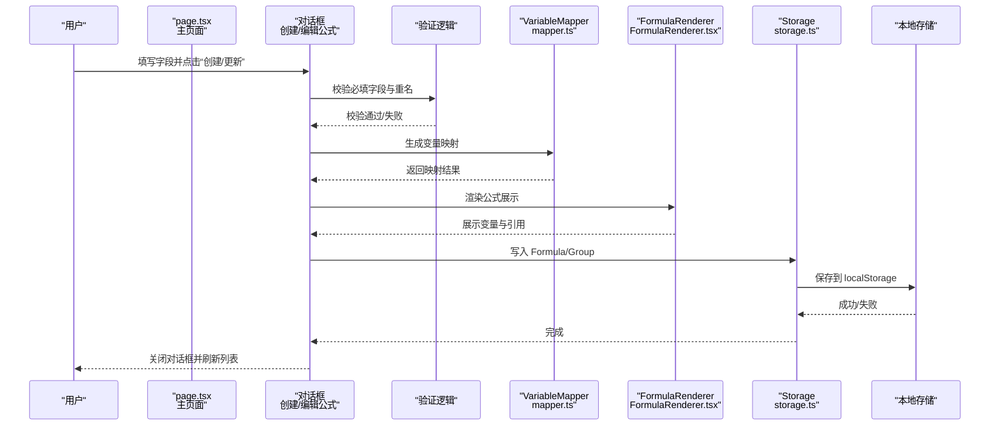
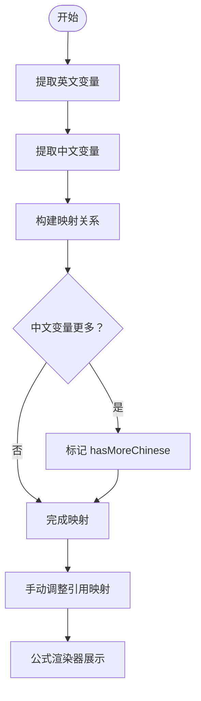
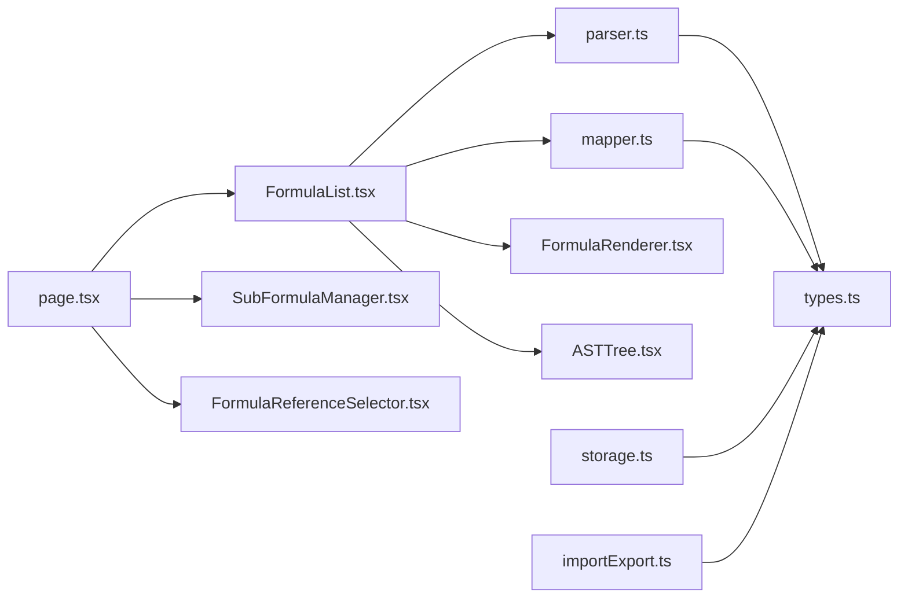

# 创建公式

<cite>
**本文档引用的文件**
- [page.tsx](file://src/app/page.tsx)
- [FormulaList.tsx](file://src/components/FormulaList.tsx)
- [SubFormulaManager.tsx](file://src/components/SubFormulaManager.tsx)
- [FormulaReferenceSelector.tsx](file://src/components/FormulaReferenceSelector.tsx)
- [FormulaRenderer.tsx](file://src/components/FormulaRenderer.tsx)
- [ASTTree.tsx](file://src/components/ASTTree.tsx)
- [parser.ts](file://src/lib/parser.ts)
- [mapper.ts](file://src/lib/mapper.ts)
- [storage.ts](file://src/lib/storage.ts)
- [types.ts](file://src/lib/types.ts)
- [importExport.ts](file://src/lib/importExport.ts)
</cite>

## 目录
1. [简介](#简介)
2. [项目结构](#项目结构)
3. [核心组件](#核心组件)
4. [架构总览](#架构总览)
5. [详细组件分析](#详细组件分析)
6. [依赖关系分析](#依赖关系分析)
7. [性能考量](#性能考量)
8. [故障排查指南](#故障排查指南)
9. [结论](#结论)
10. [附录](#附录)

## 简介
本指南面向“创建公式”功能，围绕公式创建表单的字段含义、输入规范与验证规则进行系统说明；解释变量映射的自动生成机制与手动调整方法；提供公式语法最佳实践与常见错误规避策略；并给出创建成功后的验证步骤与后续操作建议。同时提供实际创建示例与模板，帮助快速上手。

## 项目结构
该项目采用 Next.js 客户端应用结构，核心逻辑集中在页面组件与业务库模块之间：
- 页面入口负责状态管理、表单交互与持久化存储
- 组件层负责 UI 展示与用户交互
- 库模块负责解析、映射、类型定义与导入导出

图表来源
- [page.tsx:1-798](file://src/app/page.tsx#L1-L798)
- [FormulaList.tsx:1-387](file://src/components/FormulaList.tsx#L1-L387)
- [SubFormulaManager.tsx:1-201](file://src/components/SubFormulaManager.tsx#L1-L201)
- [FormulaReferenceSelector.tsx:1-132](file://src/components/FormulaReferenceSelector.tsx#L1-L132)
- [FormulaRenderer.tsx:1-169](file://src/components/FormulaRenderer.tsx#L1-L169)
- [ASTTree.tsx:1-179](file://src/components/ASTTree.tsx#L1-L179)
- [parser.ts:1-159](file://src/lib/parser.ts#L1-L159)
- [mapper.ts:1-89](file://src/lib/mapper.ts#L1-L89)
- [storage.ts:1-50](file://src/lib/storage.ts#L1-L50)
- [importExport.ts:1-120](file://src/lib/importExport.ts#L1-L120)

章节来源
- [page.tsx:1-798](file://src/app/page.tsx#L1-L798)

## 核心组件
- 创建/编辑公式对话框：承载公式名称、英文公式、中文公式、所属分组、变量引用映射、子公式管理等字段与交互
- 子公式管理器：支持为公式添加/编辑/删除子公式，并自动校验必填字段
- 变量引用选择器：基于英文公式变量自动提取并提供外部公式或子公式引用映射
- 公式渲染器：将变量映射为带颜色的可点击元素，支持引用跳转
- AST 结构树：将公式解析为 AST 并以 LaTeX 渲染，支持中英文切换
- 解析器与映射器：负责词法分析、语法解析与变量映射生成
- 类型系统与存储：统一的数据结构定义与本地持久化

章节来源
- [page.tsx:631-737](file://src/app/page.tsx#L631-L737)
- [SubFormulaManager.tsx:12-63](file://src/components/SubFormulaManager.tsx#L12-L63)
- [FormulaReferenceSelector.tsx:14-47](file://src/components/FormulaReferenceSelector.tsx#L14-L47)
- [FormulaRenderer.tsx:27-115](file://src/components/FormulaRenderer.tsx#L27-L115)
- [ASTTree.tsx:11-112](file://src/components/ASTTree.tsx#L11-L112)
- [parser.ts:12-22](file://src/lib/parser.ts#L12-L22)
- [mapper.ts:52-70](file://src/lib/mapper.ts#L52-L70)
- [types.ts:27-50](file://src/lib/types.ts#L27-L50)
- [storage.ts:37-45](file://src/lib/storage.ts#L37-L45)

## 架构总览
创建公式流程涉及表单输入、字段校验、变量映射生成、公式解析与持久化存储等环节。下图展示了从用户提交到数据落盘的关键调用序列。

图表来源
- [page.tsx:207-242](file://src/app/page.tsx#L207-L242)
- [page.tsx:294-363](file://src/app/page.tsx#L294-L363)
- [mapper.ts:52-70](file://src/lib/mapper.ts#L52-L70)
- [FormulaRenderer.tsx:27-115](file://src/components/FormulaRenderer.tsx#L27-L115)
- [storage.ts:17-25](file://src/lib/storage.ts#L17-L25)

## 详细组件分析

### 创建/编辑公式对话框
- 字段说明
  - 公式名称：必填，用于标识公式，需在所属分组内唯一
  - 英文公式：必填，支持变量、数字、四则运算符与括号，用于语法解析与 AST 渲染
  - 中文公式：必填，用于变量映射与中文展示
  - 所属分组：必填，选择父分组或直接子分组
  - 变量引用映射：可选，将变量映射到外部公式或子公式
  - 子公式管理：可选，为公式添加子公式集合
- 输入规范与验证规则
  - 必填字段校验：名称、英文公式、中文公式均不能为空
  - 重名校验：在同一分组内不允许存在同名公式
  - 分组选择：必须选择一个分组
  - 子公式校验：子公式名称、英文公式、中文公式三者均不能为空
- 自动化与交互
  - 变量映射自动提取：根据英文公式变量自动生成映射项
  - 变量引用选择器：提供外部公式与子公式下拉选择，支持清空
  - 子公式管理：支持增删改查，实时预览
- 保存与更新
  - 创建：生成新 Formula 对象并写入目标分组
  - 更新：支持跨分组移动与重命名，保持引用关系不变

章节来源
- [page.tsx:657-737](file://src/app/page.tsx#L657-L737)
- [page.tsx:207-242](file://src/app/page.tsx#L207-L242)
- [page.tsx:294-363](file://src/app/page.tsx#L294-L363)
- [SubFormulaManager.tsx:42-63](file://src/components/SubFormulaManager.tsx#L42-L63)
- [FormulaReferenceSelector.tsx:36-47](file://src/components/FormulaReferenceSelector.tsx#L36-L47)

### 变量映射的自动生成与手动调整
- 自动生成机制
  - 英文变量提取：从英文公式中提取唯一变量集合
  - 中文变量提取：从中文公式中提取非数字且非空的片段作为中文变量
  - 映射生成：按变量顺序建立一一对应关系，若中文变量不足则标注“（未定义）”
- 手动调整方法
  - 在变量引用选择器中，为每个变量选择外部公式或子公式
  - 选择“不引用公式”可清除该变量的引用映射
  - 引用映射将影响公式渲染器中的变量颜色与点击行为
- 注意事项
  - 若变量数量不一致，映射结果会自动补齐或提示“更多中文变量”
  - 引用公式不会改变变量映射的键值，仅在展示层面增强可读性

图表来源
- [mapper.ts:4-27](file://src/lib/mapper.ts#L4-L27)
- [mapper.ts:29-50](file://src/lib/mapper.ts#L29-L50)
- [mapper.ts:52-70](file://src/lib/mapper.ts#L52-L70)
- [FormulaReferenceSelector.tsx:39-47](file://src/components/FormulaReferenceSelector.tsx#L39-L47)

章节来源
- [mapper.ts:4-89](file://src/lib/mapper.ts#L4-L89)
- [FormulaReferenceSelector.tsx:14-113](file://src/components/FormulaReferenceSelector.tsx#L14-L113)

### 公式语法最佳实践与常见错误
- 语法要求
  - 支持变量（字母开头，可含数字）、数字、四则运算符、括号（含英文与中文括号）
  - 不支持非法字符，解析器会抛出错误
- 最佳实践
  - 使用清晰的变量命名，避免与保留关键字冲突
  - 合理使用括号明确优先级，提升可读性
  - 中英文公式保持变量顺序一致，便于映射与维护
- 常见错误与规避
  - 缺少操作数或括号不匹配：确保表达式完整
  - 未识别字符：检查特殊符号是否为允许的运算符或括号
  - 变量拼写不一致：保证英文与中文公式中的变量名一致

章节来源
- [parser.ts:24-68](file://src/lib/parser.ts#L24-L68)
- [parser.ts:78-157](file://src/lib/parser.ts#L78-L157)

### 创建成功后的验证步骤与后续操作
- 验证步骤
  - 列表中出现新公式，名称与所属分组正确
  - 展开详情后，变量映射与 AST 结构树正常渲染
  - 公式渲染器中变量颜色区分清晰，引用链接可点击
- 后续操作建议
  - 为变量配置引用公式，提升复用性与可读性
  - 添加子公式，拆分复杂公式，便于维护
  - 导出数据备份，或从 URL 导入共享数据

章节来源
- [FormulaList.tsx:169-192](file://src/components/FormulaList.tsx#L169-L192)
- [ASTTree.tsx:11-112](file://src/components/ASTTree.tsx#L11-L112)
- [FormulaRenderer.tsx:27-115](file://src/components/FormulaRenderer.tsx#L27-L115)
- [page.tsx:365-420](file://src/app/page.tsx#L365-L420)

## 依赖关系分析
- 组件间依赖
  - 主页面依赖公式列表、子公式管理器、变量引用选择器等组件
  - 公式列表依赖解析器、映射器、渲染器与 AST 组件
- 库模块依赖
  - 解析器与映射器依赖类型定义
  - 存储模块依赖类型定义
  - 导入导出模块依赖类型定义
- 外部依赖
  - AST 渲染使用 KaTeX，动态加载样式资源

图表来源
- [page.tsx:1-13](file://src/app/page.tsx#L1-L13)
- [FormulaList.tsx:7-10](file://src/components/FormulaList.tsx#L7-L10)
- [parser.ts:1-1](file://src/lib/parser.ts#L1-L1)
- [mapper.ts:1-1](file://src/lib/mapper.ts#L1-L1)
- [storage.ts:1-1](file://src/lib/storage.ts#L1-L1)
- [importExport.ts:1-1](file://src/lib/importExport.ts#L1-L1)

章节来源
- [page.tsx:1-13](file://src/app/page.tsx#L1-L13)
- [FormulaList.tsx:7-10](file://src/components/FormulaList.tsx#L7-L10)

## 性能考量
- 计算优化
  - 变量提取与映射生成使用 Set 去重，避免重复计算
  - 公式渲染器按变量首次出现顺序分配颜色，减少查找成本
- 渲染优化
  - AST 渲染使用动态加载 KaTeX，避免首屏阻塞
  - 公式详情按需展开，减少不必要的解析与渲染
- 存储优化
  - 本地存储采用 JSON 序列化，批量写入降低频繁 IO

章节来源
- [FormulaReferenceSelector.tsx:21-34](file://src/components/FormulaReferenceSelector.tsx#L21-L34)
- [FormulaRenderer.tsx:42-45](file://src/components/FormulaRenderer.tsx#L42-L45)
- [ASTTree.tsx:15-24](file://src/components/ASTTree.tsx#L15-L24)
- [storage.ts:17-25](file://src/lib/storage.ts#L17-L25)

## 故障排查指南
- 创建失败
  - 检查必填字段是否为空
  - 确认分组选择是否正确
  - 检查是否存在同名公式
- 解析错误
  - 检查英文公式是否包含非法字符或括号不匹配
  - 确保变量命名符合规则（字母开头，可含数字）
- 显示异常
  - 检查变量映射是否完整
  - 确认引用公式是否存在且可访问
- 导入导出问题
  - 检查 JSON 文件格式与版本字段
  - 确认网络请求可达与返回状态码

章节来源
- [page.tsx:207-242](file://src/app/page.tsx#L207-L242)
- [parser.ts:12-22](file://src/lib/parser.ts#L12-L22)
- [FormulaList.tsx:170-192](file://src/components/FormulaList.tsx#L170-L192)
- [importExport.ts:43-75](file://src/lib/importExport.ts#L43-L75)

## 结论
通过规范化的字段输入、自动化的变量映射与严谨的语法解析，本系统为公式创建提供了高效、直观的体验。遵循本文档的最佳实践与验证步骤，可显著降低错误率并提升维护效率。建议在团队内部制定统一的变量命名规范与公式组织策略，进一步提升协作效率。

## 附录

### 字段输入规范与验证清单
- 公式名称
  - 必填：是
  - 唯一性：同一分组内不可重复
  - 规范：简洁明确，避免歧义
- 英文公式
  - 必填：是
  - 规范：变量命名合法，运算符与括号正确
  - 验证：解析器校验语法完整性
- 中文公式
  - 必填：是
  - 规范：与英文公式变量顺序一致，语义清晰
- 所属分组
  - 必填：是
  - 规范：选择正确的父分组或直接子分组
- 变量引用映射（可选）
  - 规范：为每个变量选择合适的引用公式或子公式
  - 注意：不影响变量映射键值，仅增强展示与导航
- 子公式（可选）
  - 规范：子公式名称、英文公式、中文公式均不能为空
  - 验证：保存前进行必填校验

章节来源
- [page.tsx:207-242](file://src/app/page.tsx#L207-L242)
- [SubFormulaManager.tsx:42-63](file://src/components/SubFormulaManager.tsx#L42-L63)
- [FormulaReferenceSelector.tsx:39-47](file://src/components/FormulaReferenceSelector.tsx#L39-L47)

### 实际创建示例与模板
- 示例一：基础加法公式
  - 公式名称：基础加法
  - 英文公式：a+b+c*d
  - 中文公式：变量1+变量2+变量3*变量4
  - 所属分组：数学公式
  - 变量引用映射：可选，为 a、b、c、d 指定引用公式
  - 子公式：可选，如“折扣计算”、“税费计算”
- 示例二：复合公式
  - 公式名称：综合计算
  - 英文公式：(price*rate)+discount-tax
  - 中文公式：(价格*折扣率)+折扣-税额
  - 所属分组：财务计算
  - 变量引用映射：为 price、rate、discount、tax 指定引用公式
  - 子公式：可选，拆分为“单价计算”、“折扣计算”、“税费计算”

章节来源
- [page.tsx:657-737](file://src/app/page.tsx#L657-L737)
- [SubFormulaManager.tsx:12-63](file://src/components/SubFormulaManager.tsx#L12-L63)
- [FormulaReferenceSelector.tsx:14-113](file://src/components/FormulaReferenceSelector.tsx#L14-L113)