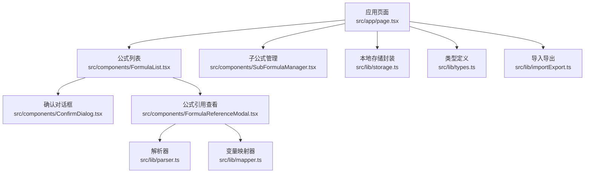
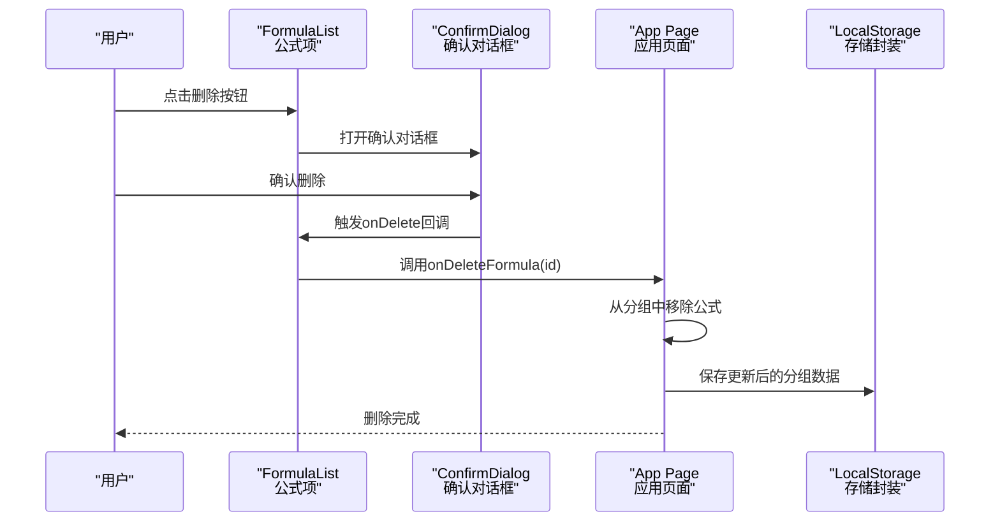
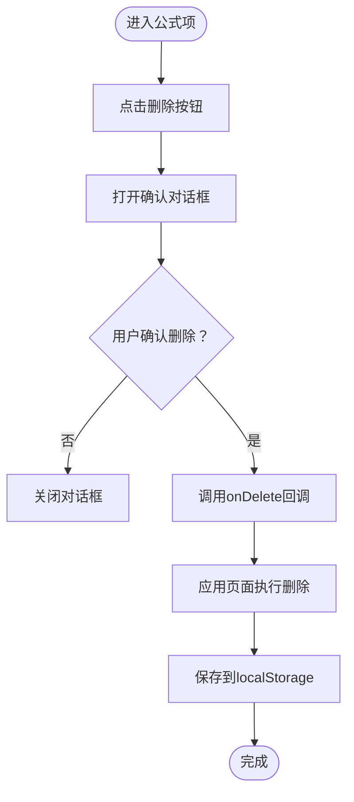
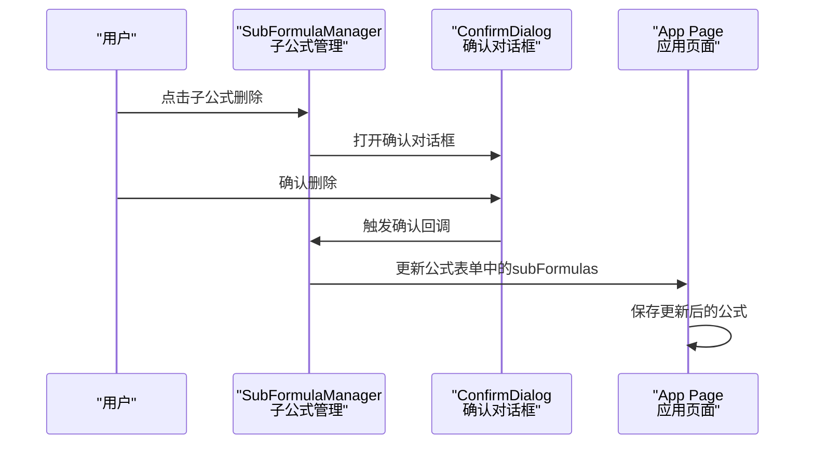
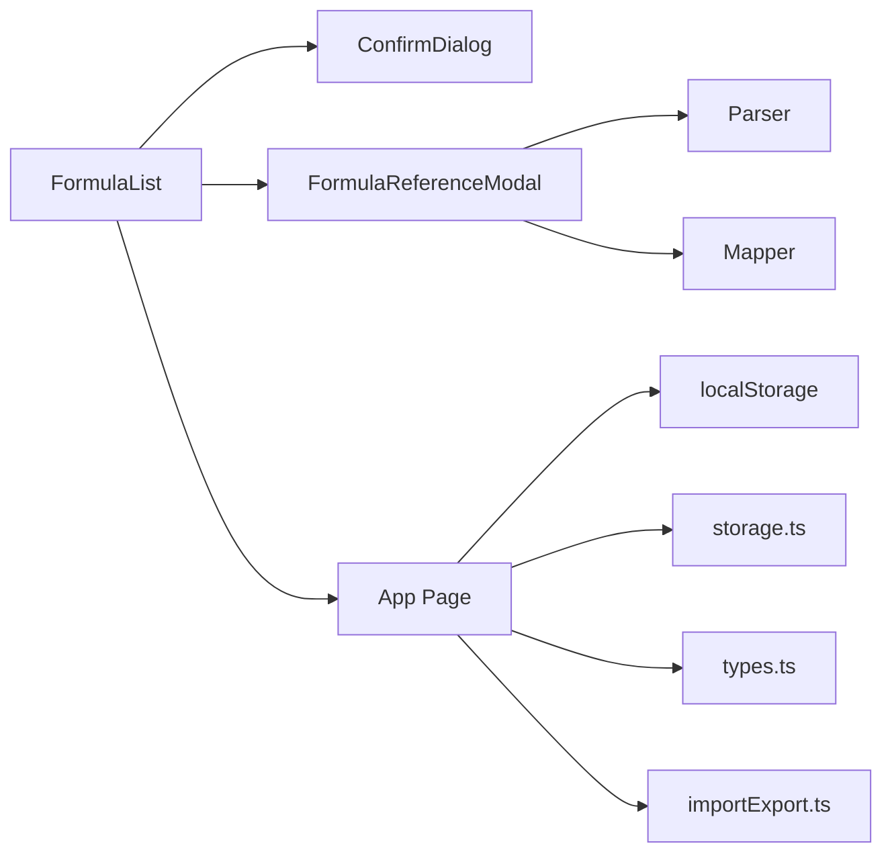

# 删除公式

<cite>
**本文档引用的文件**
- [src/app/page.tsx](file://src/app/page.tsx)
- [src/components/FormulaList.tsx](file://src/components/FormulaList.tsx)
- [src/components/ConfirmDialog.tsx](file://src/components/ConfirmDialog.tsx)
- [src/components/SubFormulaManager.tsx](file://src/components/SubFormulaManager.tsx)
- [src/components/FormulaReferenceModal.tsx](file://src/components/FormulaReferenceModal.tsx)
- [src/lib/types.ts](file://src/lib/types.ts)
- [src/lib/storage.ts](file://src/lib/storage.ts)
- [src/lib/parser.ts](file://src/lib/parser.ts)
- [src/lib/mapper.ts](file://src/lib/mapper.ts)
- [src/lib/importExport.ts](file://src/lib/importExport.ts)
</cite>

## 目录
1. [简介](#简介)
2. [项目结构](#项目结构)
3. [核心组件](#核心组件)
4. [架构总览](#架构总览)
5. [详细组件分析](#详细组件分析)
6. [依赖关系分析](#依赖关系分析)
7. [性能考虑](#性能考虑)
8. [故障排查指南](#故障排查指南)
9. [结论](#结论)
10. [附录](#附录)

## 简介
本指南面向需要删除公式（含子公式）的用户与维护者，系统性说明删除操作的安全机制、确认流程、删除前的数据检查策略、删除对相关数据的影响与清理机制、常见失败原因与解决方案、批量删除方法与注意事项，以及日志记录与审计能力现状与建议。

## 项目结构
与删除公式相关的前端模块主要分布在以下位置：
- 应用入口与状态管理：src/app/page.tsx
- 公式列表与删除触发：src/components/FormulaList.tsx
- 通用确认对话框：src/components/ConfirmDialog.tsx
- 子公式管理与删除：src/components/SubFormulaManager.tsx
- 公式引用查看与影响评估：src/components/FormulaReferenceModal.tsx
- 类型定义与存储：src/lib/types.ts、src/lib/storage.ts
- 解析与映射：src/lib/parser.ts、src/lib/mapper.ts
- 导入导出：src/lib/importExport.ts

图表来源
- [src/app/page.tsx:1-798](file://src/app/page.tsx#L1-L798)
- [src/components/FormulaList.tsx:1-387](file://src/components/FormulaList.tsx#L1-L387)
- [src/components/ConfirmDialog.tsx:1-54](file://src/components/ConfirmDialog.tsx#L1-L54)
- [src/components/SubFormulaManager.tsx:1-201](file://src/components/SubFormulaManager.tsx#L1-L201)
- [src/components/FormulaReferenceModal.tsx:1-180](file://src/components/FormulaReferenceModal.tsx#L1-L180)
- [src/lib/storage.ts:1-50](file://src/lib/storage.ts#L1-L50)
- [src/lib/parser.ts:1-159](file://src/lib/parser.ts#L1-L159)
- [src/lib/mapper.ts:1-89](file://src/lib/mapper.ts#L1-L89)
- [src/lib/types.ts:1-51](file://src/lib/types.ts#L1-L51)
- [src/lib/importExport.ts:1-120](file://src/lib/importExport.ts#L1-L120)

章节来源
- [src/app/page.tsx:1-798](file://src/app/page.tsx#L1-L798)
- [src/components/FormulaList.tsx:1-387](file://src/components/FormulaList.tsx#L1-L387)
- [src/components/ConfirmDialog.tsx:1-54](file://src/components/ConfirmDialog.tsx#L1-L54)
- [src/components/SubFormulaManager.tsx:1-201](file://src/components/SubFormulaManager.tsx#L1-L201)
- [src/components/FormulaReferenceModal.tsx:1-180](file://src/components/FormulaReferenceModal.tsx#L1-L180)
- [src/lib/storage.ts:1-50](file://src/lib/storage.ts#L1-L50)
- [src/lib/parser.ts:1-159](file://src/lib/parser.ts#L1-L159)
- [src/lib/mapper.ts:1-89](file://src/lib/mapper.ts#L1-L89)
- [src/lib/types.ts:1-51](file://src/lib/types.ts#L1-L51)
- [src/lib/importExport.ts:1-120](file://src/lib/importExport.ts#L1-L120)

## 核心组件
- 删除触发与确认流程
  - 公式项中的删除按钮会打开通用确认对话框，用户确认后调用上层传入的删除回调，完成删除。
  - 子公式删除采用同样的确认对话框模式，但仅影响当前公式内的子公式集合。
- 删除实现逻辑
  - 应用页面负责实际的删除操作：从对应分组中移除公式，并持久化保存。
  - 子公式删除直接修改公式表单对象中的子公式数组。
- 数据检查与清理
  - 删除前不会进行跨公式引用检查或子公式依赖检查；删除后不会自动清理引用映射或子公式引用。
  - 如需避免破坏性删除，应在删除前通过“公式引用查看”或“公式结构树”自行评估影响。

章节来源
- [src/components/FormulaList.tsx:267-383](file://src/components/FormulaList.tsx#L267-L383)
- [src/components/ConfirmDialog.tsx:16-53](file://src/components/ConfirmDialog.tsx#L16-L53)
- [src/components/SubFormulaManager.tsx:65-74](file://src/components/SubFormulaManager.tsx#L65-L74)
- [src/app/page.tsx:244-254](file://src/app/page.tsx#L244-L254)

## 架构总览
删除公式涉及的调用链路如下：

图表来源
- [src/components/FormulaList.tsx:267-383](file://src/components/FormulaList.tsx#L267-L383)
- [src/components/ConfirmDialog.tsx:16-53](file://src/components/ConfirmDialog.tsx#L16-L53)
- [src/app/page.tsx:244-254](file://src/app/page.tsx#L244-L254)
- [src/lib/storage.ts:17-25](file://src/lib/storage.ts#L17-L25)

## 详细组件分析

### 删除公式组件分析
- 组件职责
  - 渲染公式项，提供删除按钮。
  - 打开确认对话框，接收用户确认后执行删除回调。
  - 在展开状态下展示变量映射、公式展示与AST树，便于删除前影响评估。
- 安全机制
  - 采用二次确认对话框，防止误删。
  - 不进行跨公式引用检查或子公式依赖检查。
- 删除流程
  - 用户点击删除 → 打开确认对话框 → 确认后调用onDelete回调 → 应用页面执行删除并保存。

图表来源
- [src/components/FormulaList.tsx:267-383](file://src/components/FormulaList.tsx#L267-L383)
- [src/components/ConfirmDialog.tsx:16-53](file://src/components/ConfirmDialog.tsx#L16-L53)
- [src/app/page.tsx:244-254](file://src/app/page.tsx#L244-L254)
- [src/lib/storage.ts:17-25](file://src/lib/storage.ts#L17-L25)

章节来源
- [src/components/FormulaList.tsx:151-386](file://src/components/FormulaList.tsx#L151-L386)
- [src/components/ConfirmDialog.tsx:16-53](file://src/components/ConfirmDialog.tsx#L16-L53)
- [src/app/page.tsx:244-254](file://src/app/page.tsx#L244-L254)
- [src/lib/storage.ts:17-25](file://src/lib/storage.ts#L17-L25)

### 子公式删除组件分析
- 组件职责
  - 管理当前公式内的子公式集合，提供增删改查。
  - 删除子公式同样采用确认对话框。
- 影响范围
  - 仅影响当前公式内部的子公式集合，不涉及跨公式引用。
- 删除流程
  - 点击删除 → 打开确认 → 确认后从子公式数组中移除对应项。

图表来源
- [src/components/SubFormulaManager.tsx:65-74](file://src/components/SubFormulaManager.tsx#L65-L74)
- [src/components/ConfirmDialog.tsx:16-53](file://src/components/ConfirmDialog.tsx#L16-L53)
- [src/app/page.tsx:294-363](file://src/app/page.tsx#L294-L363)

章节来源
- [src/components/SubFormulaManager.tsx:1-201](file://src/components/SubFormulaManager.tsx#L1-L201)
- [src/components/ConfirmDialog.tsx:16-53](file://src/components/ConfirmDialog.tsx#L16-L53)
- [src/app/page.tsx:294-363](file://src/app/page.tsx#L294-L363)

### 删除前的数据检查与影响评估
- 变量映射与引用查看
  - 公式项展开后可查看变量映射与公式展示，有助于判断删除对业务含义的影响。
  - 公式引用查看模态框可展示变量到公式/子公式的映射，帮助识别是否存在外部引用或子公式引用。
- 结构树分析
  - AST树展示公式结构，辅助判断删除后是否仍满足表达式完整性。
- 注意事项
  - 代码未实现自动化的“是否被其他公式引用”或“是否有关联子公式”的检查。
  - 删除后不会自动清理变量映射或子公式引用映射。

章节来源
- [src/components/FormulaList.tsx:160-192](file://src/components/FormulaList.tsx#L160-L192)
- [src/components/FormulaReferenceModal.tsx:18-87](file://src/components/FormulaReferenceModal.tsx#L18-L87)
- [src/lib/parser.ts:12-22](file://src/lib/parser.ts#L12-L22)
- [src/lib/mapper.ts:52-70](file://src/lib/mapper.ts#L52-L70)

### 删除对相关数据的影响与清理机制
- 对公式数据的影响
  - 从所属分组的公式列表中移除该公式。
  - 若当前选中的是被删除公式，则清除URL参数并取消选中。
- 对子公式的影响
  - 仅影响当前公式内的子公式集合，不涉及跨公式引用。
- 对引用映射的影响
  - 删除后不会自动清理变量映射或子公式引用映射。
  - 如需保持数据一致性，应在删除前手动清理相关映射。

章节来源
- [src/app/page.tsx:244-254](file://src/app/page.tsx#L244-L254)
- [src/lib/storage.ts:17-25](file://src/lib/storage.ts#L17-L25)

### 批量删除操作方法与注意事项
- 方法
  - 逐条删除：在公式列表中逐个点击删除按钮，确认后逐条删除。
  - 批量删除建议：由于界面未提供多选批量删除功能，可在删除前通过“导出数据”备份，删除后再“从 URL 导入”恢复或调整。
- 注意事项
  - 删除前务必确认影响范围，必要时先在“公式引用查看”中核验变量映射。
  - 删除后如发现映射残留，需手动清理。

章节来源
- [src/components/FormulaList.tsx:120-139](file://src/components/FormulaList.tsx#L120-L139)
- [src/lib/importExport.ts:25-38](file://src/lib/importExport.ts#L25-L38)

### 日志记录与审计功能说明
- 现状
  - 代码库未实现专门的删除日志记录与审计功能。
  - 删除操作通过localStorage持久化，可通过浏览器开发者工具查看存储变化。
- 建议
  - 如需审计，可在应用页面的删除回调中增加自定义日志记录（例如写入本地存储或发送到日志服务），记录操作人、时间、公式ID、公式名称等信息。

章节来源
- [src/lib/storage.ts:17-25](file://src/lib/storage.ts#L17-L25)
- [src/app/page.tsx:244-254](file://src/app/page.tsx#L244-L254)

## 依赖关系分析
- 组件耦合
  - FormulaList依赖ConfirmDialog进行二次确认。
  - FormulaReferenceModal用于展示变量映射与引用关系，辅助删除前评估。
  - App Page负责实际删除与持久化。
- 外部依赖
  - localStorage用于数据持久化。
  - 解析器与映射器用于公式结构与变量映射的展示。

图表来源
- [src/components/FormulaList.tsx:1-387](file://src/components/FormulaList.tsx#L1-L387)
- [src/components/ConfirmDialog.tsx:1-54](file://src/components/ConfirmDialog.tsx#L1-L54)
- [src/components/FormulaReferenceModal.tsx:1-180](file://src/components/FormulaReferenceModal.tsx#L1-L180)
- [src/app/page.tsx:1-798](file://src/app/page.tsx#L1-L798)
- [src/lib/storage.ts:1-50](file://src/lib/storage.ts#L1-L50)
- [src/lib/parser.ts:1-159](file://src/lib/parser.ts#L1-L159)
- [src/lib/mapper.ts:1-89](file://src/lib/mapper.ts#L1-L89)
- [src/lib/types.ts:1-51](file://src/lib/types.ts#L1-L51)
- [src/lib/importExport.ts:1-120](file://src/lib/importExport.ts#L1-L120)

## 性能考虑
- 删除操作的时间复杂度为O(n)，其中n为当前分组中的公式数量。
- 展开公式项时进行解析与映射计算，可能带来额外开销；建议在大批量删除时避免同时展开过多项。
- localStorage写入为同步操作，频繁删除可能影响UI流畅度，建议合并多次更新后再保存。

## 故障排查指南
- 删除后数据未更新
  - 检查localStorage中是否存在异常，确认保存函数是否抛错。
  - 章节来源: [src/lib/storage.ts:17-25](file://src/lib/storage.ts#L17-L25)
- 删除确认对话框无法打开
  - 检查ConfirmDialog的isOpen状态传递是否正确。
  - 章节来源: [src/components/ConfirmDialog.tsx:16-53](file://src/components/ConfirmDialog.tsx#L16-L53)
- 删除后URL参数未清除
  - 检查handleSelectFormula是否正确调用URL更新逻辑。
  - 章节来源: [src/app/page.tsx:25-42](file://src/app/page.tsx#L25-L42)
- 删除前影响评估困难
  - 使用公式引用查看与AST树辅助判断，确保删除不会破坏业务逻辑。
  - 章节来源: [src/components/FormulaReferenceModal.tsx:18-87](file://src/components/FormulaReferenceModal.tsx#L18-L87)

## 结论
删除公式功能采用“二次确认 + 本地持久化”的设计，具备基本的安全保障。当前实现未内置跨公式引用检查与自动清理机制，因此在删除前应通过界面提供的展示能力进行充分评估。若需审计与追踪，建议在应用层扩展日志记录能力。

## 附录
- 删除操作的关键路径
  - 公式项删除：[src/components/FormulaList.tsx:267-383](file://src/components/FormulaList.tsx#L267-L383)
  - 子公式删除：[src/components/SubFormulaManager.tsx:65-74](file://src/components/SubFormulaManager.tsx#L65-L74)
  - 实际删除与保存：[src/app/page.tsx:244-254](file://src/app/page.tsx#L244-L254)
  - 本地存储封装：[src/lib/storage.ts:17-25](file://src/lib/storage.ts#L17-L25)