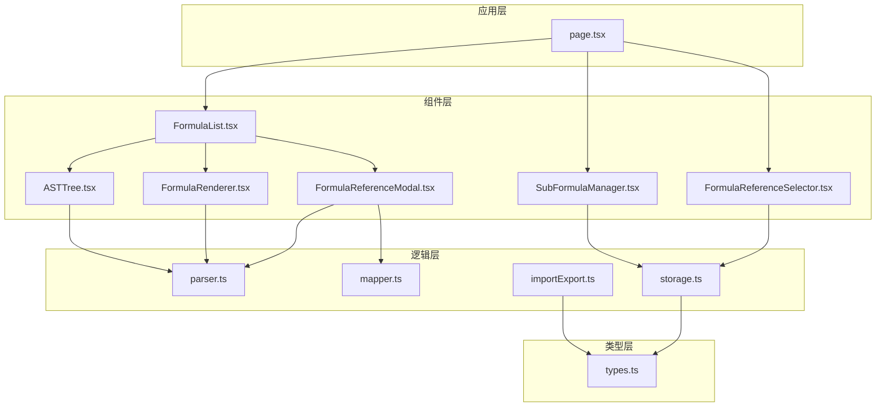
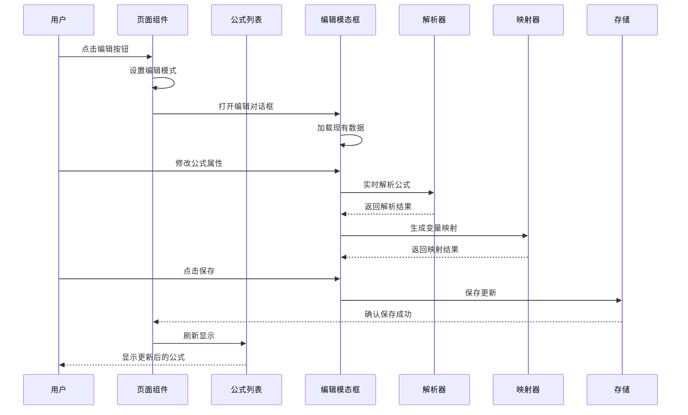
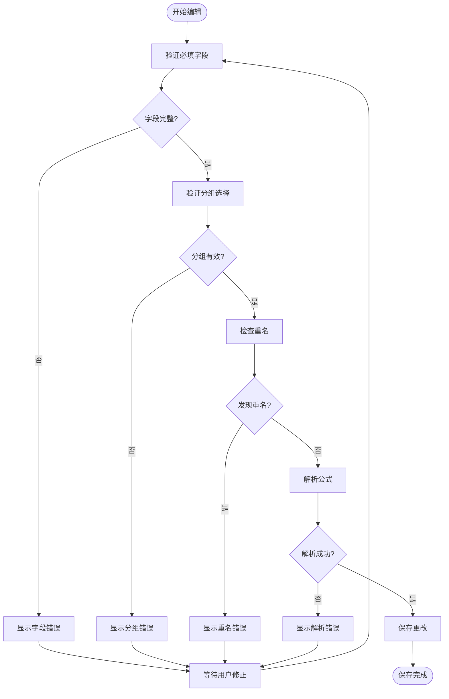
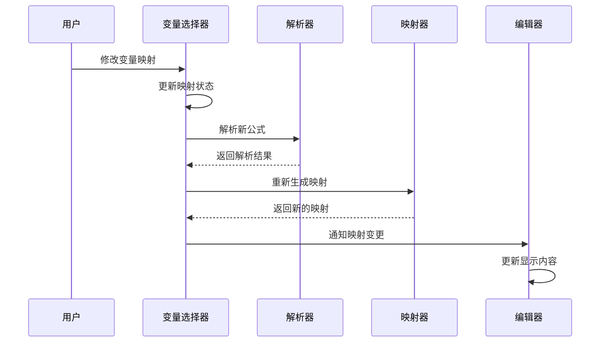
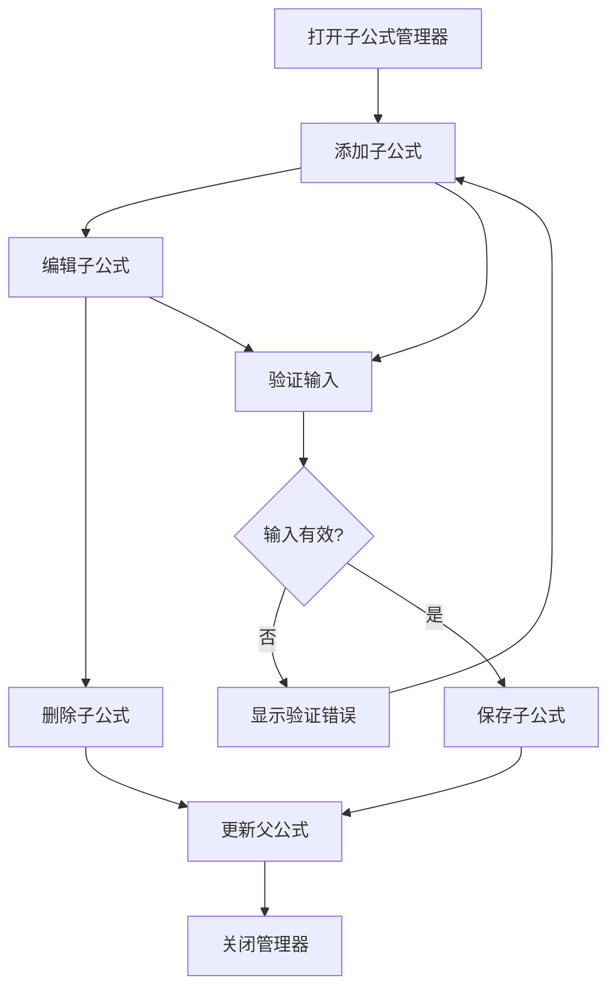
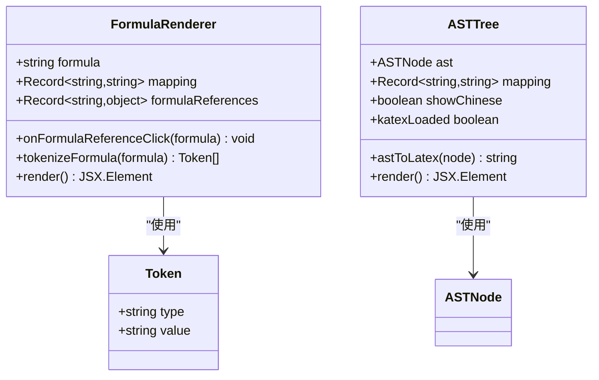
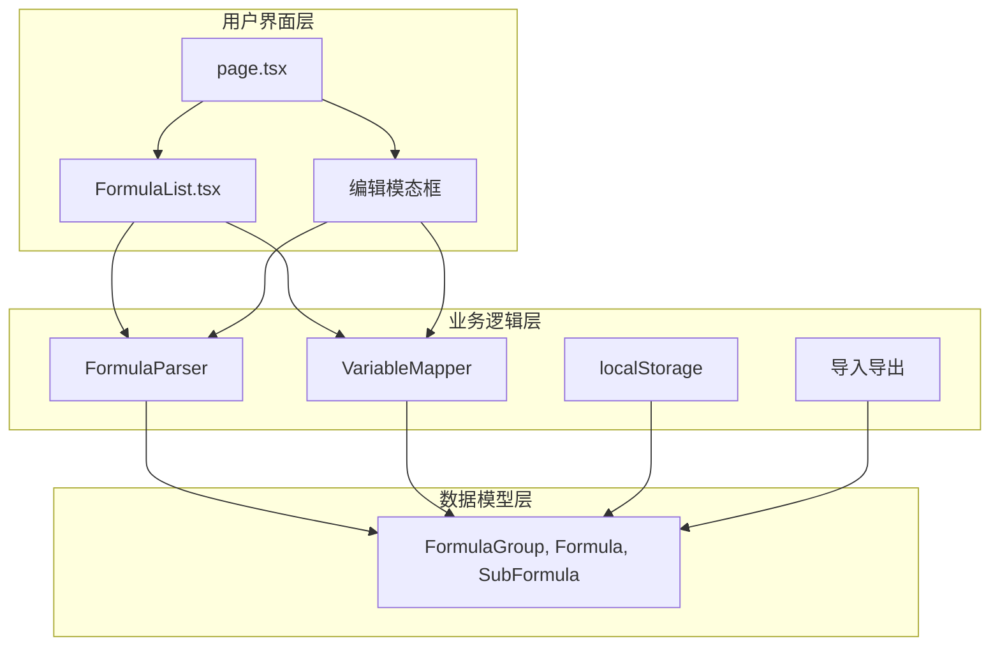

# 编辑公式

<cite>
**本文档引用的文件**
- [page.tsx](file://src/app/page.tsx)
- [FormulaList.tsx](file://src/components/FormulaList.tsx)
- [FormulaReferenceSelector.tsx](file://src/components/FormulaReferenceSelector.tsx)
- [SubFormulaManager.tsx](file://src/components/SubFormulaManager.tsx)
- [FormulaReferenceModal.tsx](file://src/components/FormulaReferenceModal.tsx)
- [FormulaRenderer.tsx](file://src/components/FormulaRenderer.tsx)
- [ASTTree.tsx](file://src/components/ASTTree.tsx)
- [parser.ts](file://src/lib/parser.ts)
- [mapper.ts](file://src/lib/mapper.ts)
- [storage.ts](file://src/lib/storage.ts)
- [importExport.ts](file://src/lib/importExport.ts)
- [types.ts](file://src/lib/types.ts)
</cite>

## 目录
1. [简介](#简介)
2. [项目结构](#项目结构)
3. [核心组件](#核心组件)
4. [架构概览](#架构概览)
5. [详细组件分析](#详细组件分析)
6. [依赖关系分析](#依赖关系分析)
7. [性能考虑](#性能考虑)
8. [故障排除指南](#故障排除指南)
9. [结论](#结论)

## 简介
本指南详细说明了如何编辑公式功能，包括修改公式名称、公式内容、分组归属等操作。文档涵盖了实时验证和错误提示机制、变量映射的动态更新和冲突处理、编辑前的数据备份建议和版本管理策略、撤销操作和数据恢复方法，以及复杂公式编辑的技巧和注意事项。

## 项目结构
该项目采用基于功能的模块化组织方式，主要分为以下层次：
- 应用层：页面组件负责整体布局和状态管理
- 组件层：专门的功能组件处理特定任务
- 逻辑层：解析器、映射器、存储等核心业务逻辑
- 类型层：定义数据结构和接口规范

**图表来源**
- [page.tsx:1-798](file://src/app/page.tsx#L1-L798)
- [FormulaList.tsx:1-387](file://src/components/FormulaList.tsx#L1-L387)
- [parser.ts:1-159](file://src/lib/parser.ts#L1-L159)

**章节来源**
- [page.tsx:1-798](file://src/app/page.tsx#L1-L798)

## 核心组件
编辑公式功能由多个协同工作的组件构成，每个组件都有明确的职责分工：

### 主要组件职责
- **页面控制器**：管理全局状态、处理用户交互、协调各组件间的数据流转
- **公式列表**：展示公式列表、处理公式选择和编辑操作
- **公式引用选择器**：管理变量到公式的映射关系
- **子公式管理器**：维护公式内部的子公式集合
- **公式引用模态框**：提供公式详情的详细视图
- **公式渲染器**：将公式转换为可读的可视化展示
- **AST树**：将公式解析为抽象语法树进行结构化展示

**章节来源**
- [FormulaList.tsx:1-387](file://src/components/FormulaList.tsx#L1-L387)
- [FormulaReferenceSelector.tsx:1-132](file://src/components/FormulaReferenceSelector.tsx#L1-L132)
- [SubFormulaManager.tsx:1-201](file://src/components/SubFormulaManager.tsx#L1-L201)

## 架构概览
编辑公式功能采用响应式架构设计，实现了数据驱动的UI更新和实时验证机制。

**图表来源**
- [page.tsx:256-363](file://src/app/page.tsx#L256-L363)
- [FormulaList.tsx:151-387](file://src/components/FormulaList.tsx#L151-L387)
- [parser.ts:12-22](file://src/lib/parser.ts#L12-L22)

## 详细组件分析

### 编辑模态框组件
编辑模态框是编辑公式的核心界面，提供了完整的编辑体验。

#### 组件架构

```mermaid
classDiagram
class FormulaEditor {
+string name
+string englishFormula
+string chineseFormula
+Record~string,string~ variableFormulaMapping
+SubFormula[] subFormulas
+string groupId
+string parentGroupId
+handleSave() void
+handleCancel() void
+validateForm() boolean
+updateVariableMapping(mapping) void
}
class FormulaReferenceSelector {
+FormulaGroup[] groups
+Record~string,string~ variableFormulaMapping
+onChange(mapping) void
+extractVariables(formula) string[]
+handleSelectFormula(variable, formulaId) void
}
class SubFormulaManager {
+SubFormula[] subFormulas
+onChange(subFormulas) void
+handleAdd() void
+handleEdit(subFormula) void
+handleDelete(subFormula) void
}
FormulaEditor --> FormulaReferenceSelector : "使用"
FormulaEditor --> SubFormulaManager : "使用"
FormulaReferenceSelector --> FormulaGroup : "依赖"
SubFormulaManager --> SubFormula : "管理"
```

**图表来源**
- [page.tsx:67-83](file://src/app/page.tsx#L67-L83)
- [FormulaReferenceSelector.tsx:6-12](file://src/components/FormulaReferenceSelector.tsx#L6-L12)
- [SubFormulaManager.tsx:7-10](file://src/components/SubFormulaManager.tsx#L7-L10)

#### 实时验证机制
编辑模态框实现了多层次的实时验证：

1. **必填字段验证**：确保名称、英文公式、中文公式都已填写
2. **分组选择验证**：确认选择了有效的分组
3. **重名验证**：检查目标分组内是否存在同名公式
4. **公式语法验证**：通过解析器实时检查公式语法

**图表来源**
- [page.tsx:294-363](file://src/app/page.tsx#L294-L363)
- [parser.ts:12-22](file://src/lib/parser.ts#L12-L22)

**章节来源**
- [page.tsx:256-363](file://src/app/page.tsx#L256-L363)

### 变量映射系统
变量映射系统是编辑功能的重要组成部分，支持动态更新和冲突处理。

#### 映射工作流程

**图表来源**
- [FormulaReferenceSelector.tsx:39-47](file://src/components/FormulaReferenceSelector.tsx#L39-L47)
- [mapper.ts:52-70](file://src/lib/mapper.ts#L52-L70)

#### 冲突处理机制
系统提供了完善的冲突检测和处理机制：

1. **变量冲突检测**：当多个变量映射到同一公式时，系统会提示潜在冲突
2. **循环引用检测**：防止公式引用自身或形成循环引用链
3. **变量数量不匹配**：当中文变量数量超过英文变量时，系统会标记为"更多中文变量"

**章节来源**
- [FormulaReferenceSelector.tsx:1-132](file://src/components/FormulaReferenceSelector.tsx#L1-L132)
- [mapper.ts:1-89](file://src/lib/mapper.ts#L1-L89)

### 子公式管理系统
子公式管理器允许在公式内部创建和管理子公式，提供更复杂的公式结构。

#### 子公式操作流程

**图表来源**
- [SubFormulaManager.tsx:26-74](file://src/components/SubFormulaManager.tsx#L26-L74)

**章节来源**
- [SubFormulaManager.tsx:1-201](file://src/components/SubFormulaManager.tsx#L1-L201)

### 实时预览系统
系统提供了实时的公式预览功能，帮助用户更好地理解和编辑公式。

#### 预览组件架构

**图表来源**
- [FormulaRenderer.tsx:27-116](file://src/components/FormulaRenderer.tsx#L27-L116)
- [ASTTree.tsx:11-112](file://src/components/ASTTree.tsx#L11-L112)

**章节来源**
- [FormulaRenderer.tsx:1-169](file://src/components/FormulaRenderer.tsx#L1-L169)
- [ASTTree.tsx:1-179](file://src/components/ASTTree.tsx#L1-L179)

## 依赖关系分析

### 核心依赖关系
编辑公式功能涉及多个层次的依赖关系：

**图表来源**
- [types.ts:27-50](file://src/lib/types.ts#L27-L50)
- [storage.ts:1-50](file://src/lib/storage.ts#L1-L50)

### 数据流分析
编辑过程中的数据流向清晰明确：

1. **输入阶段**：用户在编辑模态框中输入数据
2. **验证阶段**：系统进行多层验证确保数据完整性
3. **处理阶段**：解析器和映射器处理公式和变量
4. **存储阶段**：更新后的数据保存到本地存储
5. **展示阶段**：UI组件响应数据变化更新显示

**章节来源**
- [page.tsx:63-83](file://src/app/page.tsx#L63-L83)
- [parser.ts:1-159](file://src/lib/parser.ts#L1-L159)

## 性能考虑
编辑公式功能在设计时充分考虑了性能优化：

### 优化策略
1. **懒加载机制**：只有在用户展开公式详情时才进行解析和渲染
2. **记忆化缓存**：使用useMemo缓存昂贵的计算结果
3. **增量更新**：只更新受影响的组件，避免全量重渲染
4. **异步处理**：解析和渲染操作采用异步方式，不影响用户体验

### 性能监控
- 解析器采用高效的递归下降算法
- 映射器使用Set进行去重，提高查找效率
- UI组件使用React.memo避免不必要的重渲染

## 故障排除指南

### 常见问题及解决方案

#### 公式解析错误
**症状**：编辑公式时出现解析错误提示
**原因**：公式语法不符合要求
**解决方法**：
1. 检查括号是否匹配
2. 确认运算符使用正确
3. 验证变量名符合命名规则

#### 变量映射冲突
**症状**：变量映射选择器显示冲突警告
**原因**：多个变量映射到同一公式
**解决方法**：
1. 检查变量引用关系
2. 调整变量映射配置
3. 避免循环引用

#### 数据保存失败
**症状**：编辑完成后数据未保存
**原因**：浏览器存储空间不足或权限问题
**解决方法**：
1. 清理浏览器缓存
2. 检查存储权限设置
3. 尝试在隐私模式下操作

**章节来源**
- [FormulaList.tsx:169-192](file://src/components/FormulaList.tsx#L169-L192)
- [page.tsx:374-420](file://src/app/page.tsx#L374-L420)

## 结论
编辑公式功能通过精心设计的组件架构和完善的验证机制，为用户提供了一个强大而易用的公式编辑环境。系统支持实时验证、动态映射、冲突检测和错误提示，确保用户能够高效地管理和维护复杂的公式体系。

通过本文档提供的操作指南和最佳实践，用户可以充分利用系统的各项功能，实现专业级的公式编辑体验。同时，完善的错误处理和数据保护机制确保了用户数据的安全性和可靠性。