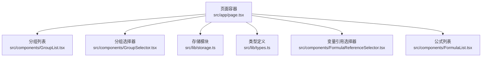
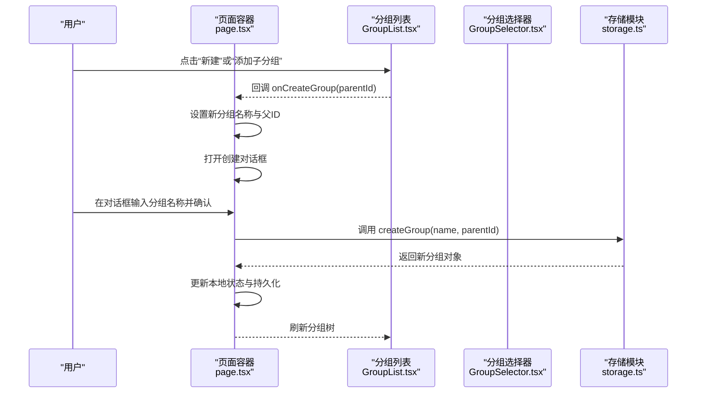
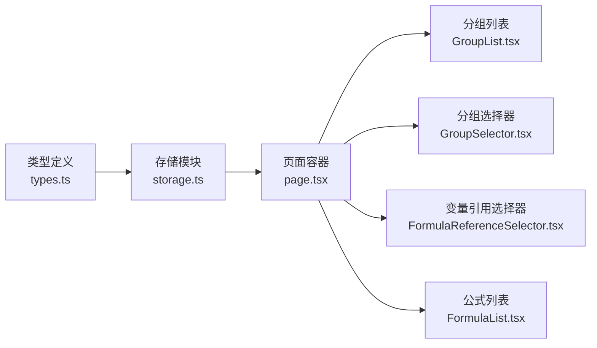

# 分组创建

<cite>
**本文档引用的文件**
- [page.tsx](file://src/app/page.tsx)
- [GroupList.tsx](file://src/components/GroupList.tsx)
- [GroupSelector.tsx](file://src/components/GroupSelector.tsx)
- [storage.ts](file://src/lib/storage.ts)
- [types.ts](file://src/lib/types.ts)
- [FormulaReferenceSelector.tsx](file://src/components/FormulaReferenceSelector.tsx)
- [FormulaList.tsx](file://src/components/FormulaList.tsx)
</cite>

## 目录
1. [简介](#简介)
2. [项目结构](#项目结构)
3. [核心组件](#核心组件)
4. [架构总览](#架构总览)
5. [详细组件分析](#详细组件分析)
6. [依赖分析](#依赖分析)
7. [性能考虑](#性能考虑)
8. [故障排查指南](#故障排查指南)
9. [结论](#结论)

## 简介
本指南面向“分组创建”功能，帮助用户理解如何在系统中创建根分组与子分组，掌握分组层级结构的建立与父子关系设置方法，并说明创建表单的使用、验证规则与特殊字符处理。同时提供创建后的默认状态、初始配置、最佳实践建议以及常见失败原因与解决方案。

## 项目结构
分组创建功能由页面级容器组件协调，配合分组列表组件与分组选择器组件共同完成交互；底层通过存储模块持久化数据。

图表来源
- [page.tsx:14-798](file://src/app/page.tsx#L14-L798)
- [GroupList.tsx:1-294](file://src/components/GroupList.tsx#L1-L294)
- [GroupSelector.tsx:1-197](file://src/components/GroupSelector.tsx#L1-L197)
- [storage.ts:1-50](file://src/lib/storage.ts#L1-L50)
- [types.ts:1-51](file://src/lib/types.ts#L1-L51)
- [FormulaReferenceSelector.tsx:1-132](file://src/components/FormulaReferenceSelector.tsx#L1-L132)
- [FormulaList.tsx:1-45](file://src/components/FormulaList.tsx#L1-L45)

章节来源
- [page.tsx:14-798](file://src/app/page.tsx#L14-L798)
- [GroupList.tsx:1-294](file://src/components/GroupList.tsx#L1-L294)
- [GroupSelector.tsx:1-197](file://src/components/GroupSelector.tsx#L1-L197)
- [storage.ts:1-50](file://src/lib/storage.ts#L1-L50)
- [types.ts:1-51](file://src/lib/types.ts#L1-L51)
- [FormulaReferenceSelector.tsx:1-132](file://src/components/FormulaReferenceSelector.tsx#L1-L132)
- [FormulaList.tsx:1-45](file://src/components/FormulaList.tsx#L1-L45)

## 核心组件
- 页面容器组件负责：
  - 维护分组列表状态与选中分组
  - 提供创建、编辑、删除分组的回调
  - 调用存储模块进行持久化
- 分组列表组件负责：
  - 展示分组树、展开/折叠
  - 提供创建子分组入口与编辑/删除操作
- 分组选择器组件负责：
  - 以面包屑导航的方式选择父分组
  - 支持直接选择当前分组或进入下一级
- 存储模块负责：
  - 生成分组唯一标识
  - 创建分组对象（含默认属性）
  - 读写本地存储

章节来源
- [page.tsx:161-205](file://src/app/page.tsx#L161-L205)
- [GroupList.tsx:16-196](file://src/components/GroupList.tsx#L16-L196)
- [GroupSelector.tsx:17-107](file://src/components/GroupSelector.tsx#L17-L107)
- [storage.ts:27-45](file://src/lib/storage.ts#L27-L45)

## 架构总览
分组创建遵循“页面容器协调 + 组件职责分离”的模式，数据流自上而下传递，事件自下而上回传。

图表来源
- [page.tsx:161-176](file://src/app/page.tsx#L161-L176)
- [GroupList.tsx:203-212](file://src/components/GroupList.tsx#L203-L212)
- [GroupList.tsx:153-164](file://src/components/GroupList.tsx#L153-L164)
- [storage.ts:27-35](file://src/lib/storage.ts#L27-L35)

## 详细组件分析

### 分组创建流程与交互
- 创建根分组
  - 在分组列表顶部标题栏点击“新建”按钮，触发 onCreateGroup(null)，随后打开创建对话框。
  - 在对话框中输入分组名称，确认后调用存储模块创建新分组并持久化。
- 创建子分组
  - 在任意分组条目右侧点击“+”按钮，触发 onCreateGroup(当前分组ID)，随后打开创建对话框。
  - 在对话框中输入分组名称，确认后创建子分组并刷新树视图。
- 分组选择器
  - 在需要设置父分组时，使用分组选择器以面包屑方式逐级选择父分组。
  - 选择完成后，onChange 回调返回父分组ID与当前分组ID，便于后续创建使用。

章节来源
- [GroupList.tsx:203-212](file://src/components/GroupList.tsx#L203-L212)
- [GroupList.tsx:153-164](file://src/components/GroupList.tsx#L153-L164)
- [GroupSelector.tsx:71-90](file://src/components/GroupSelector.tsx#L71-L90)
- [page.tsx:161-176](file://src/app/page.tsx#L161-L176)

### 分组层级结构与父子关系
- 层级结构
  - 根分组：parentId 为 null
  - 子分组：parentId 指向其父分组的 id
- 建立父子关系
  - 创建时通过 parentId 字段建立关系
  - 选择器支持多级导航，最终返回父分组与当前分组的 ID
- 树形渲染
  - 分组列表根据 parentId 构建父子映射，按层级缩进渲染

章节来源
- [types.ts:44-50](file://src/lib/types.ts#L44-L50)
- [GroupList.tsx:34-41](file://src/components/GroupList.tsx#L34-L41)
- [GroupSelector.tsx:27-35](file://src/components/GroupSelector.tsx#L27-L35)

### 创建表单使用与验证规则
- 表单位置与触发
  - 根分组：分组列表顶部“新建”
  - 子分组：任意分组右侧“+”
- 表单字段
  - 分组名称：必填，非空校验
- 特殊字符处理
  - 名称输入框未做额外特殊字符限制，建议遵循命名规范（见最佳实践）
- 提交行为
  - 输入回车或点击“创建”按钮提交
  - 提交前会检查名称是否为空，空则阻止创建

章节来源
- [GroupList.tsx:203-212](file://src/components/GroupList.tsx#L203-L212)
- [GroupList.tsx:153-164](file://src/components/GroupList.tsx#L153-L164)
- [page.tsx:592-629](file://src/app/page.tsx#L592-L629)
- [page.tsx:168-176](file://src/app/page.tsx#L168-L176)

### 创建后的默认状态与初始配置
- 默认状态
  - 新创建的分组为空集合，不包含任何公式
  - 默认创建时间戳为当前时间
- 初始配置
  - 未设置额外元数据，如图标、颜色等
  - 未设置默认排序或权重字段

章节来源
- [storage.ts:27-35](file://src/lib/storage.ts#L27-L35)
- [types.ts:44-50](file://src/lib/types.ts#L44-L50)

### 最佳实践建议
- 命名规范
  - 使用清晰、简洁且具描述性的名称
  - 避免使用可能被解析器误识别的特殊字符
- 层级深度控制
  - 建议保持不超过 3-4 级的层级，便于维护与导航
- 父子关系设置
  - 明确父子关系后再创建，必要时使用分组选择器进行确认
- 数据一致性
  - 创建后及时保存，确保本地存储同步

章节来源
- [GroupSelector.tsx:17-107](file://src/components/GroupSelector.tsx#L17-L107)
- [storage.ts:27-35](file://src/lib/storage.ts#L27-L35)

### 常见失败原因与解决方案
- 输入为空
  - 现象：点击“创建”无响应
  - 原因：名称为空
  - 解决：输入有效名称后重试
- 无法选择父分组
  - 现象：分组选择器无选项或无法展开
  - 原因：当前分组列表为空或选择器状态异常
  - 解决：先创建根分组，再使用分组选择器进行选择
- 重复创建导致状态不同步
  - 现象：界面显示与本地存储不一致
  - 原因：未正确调用保存逻辑
  - 解决：确保每次创建后调用保存并刷新状态

章节来源
- [page.tsx:168-176](file://src/app/page.tsx#L168-L176)
- [GroupSelector.tsx:17-107](file://src/components/GroupSelector.tsx#L17-L107)

## 依赖分析
分组创建涉及的主要依赖关系如下：

图表来源
- [types.ts:44-50](file://src/lib/types.ts#L44-L50)
- [storage.ts:27-45](file://src/lib/storage.ts#L27-L45)
- [page.tsx:14-798](file://src/app/page.tsx#L14-L798)
- [GroupList.tsx:1-294](file://src/components/GroupList.tsx#L1-L294)
- [GroupSelector.tsx:1-197](file://src/components/GroupSelector.tsx#L1-L197)
- [FormulaReferenceSelector.tsx:1-132](file://src/components/FormulaReferenceSelector.tsx#L1-L132)
- [FormulaList.tsx:1-45](file://src/components/FormulaList.tsx#L1-L45)

章节来源
- [types.ts:44-50](file://src/lib/types.ts#L44-L50)
- [storage.ts:27-45](file://src/lib/storage.ts#L27-L45)
- [page.tsx:14-798](file://src/app/page.tsx#L14-L798)
- [GroupList.tsx:1-294](file://src/components/GroupList.tsx#L1-L294)
- [GroupSelector.tsx:1-197](file://src/components/GroupSelector.tsx#L1-L197)
- [FormulaReferenceSelector.tsx:1-132](file://src/components/FormulaReferenceSelector.tsx#L1-L132)
- [FormulaList.tsx:1-45](file://src/components/FormulaList.tsx#L1-L45)

## 性能考虑
- 树构建与渲染
  - 分组列表在渲染时会基于 parentId 构建父子映射，建议分组数量较多时避免频繁全量重建
- 选择器导航
  - 分组选择器采用记忆化与路径追踪，减少不必要的重新计算
- 存储与持久化
  - 本地存储写入为一次性批量写入，避免频繁小粒度写入

章节来源
- [GroupList.tsx:34-41](file://src/components/GroupList.tsx#L34-L41)
- [GroupSelector.tsx:27-47](file://src/components/GroupSelector.tsx#L27-L47)
- [storage.ts:17-25](file://src/lib/storage.ts#L17-L25)

## 故障排查指南
- 无法打开创建对话框
  - 检查 onCreateGroup 回调是否正确传递至分组列表
  - 确认页面容器中 isCreateGroupModalOpen 状态切换逻辑
- 创建后未显示新分组
  - 检查 handleSaveGroup 是否调用了存储模块并更新了状态
  - 确认 saveData 是否成功写入本地存储
- 子分组创建无效
  - 检查 onCreateGroup 传入的 parentId 是否为 null 或当前分组 ID
  - 确认分组树渲染逻辑是否正确识别父子关系

章节来源
- [GroupList.tsx:203-212](file://src/components/GroupList.tsx#L203-L212)
- [GroupList.tsx:153-164](file://src/components/GroupList.tsx#L153-L164)
- [page.tsx:161-176](file://src/app/page.tsx#L161-L176)
- [storage.ts:27-35](file://src/lib/storage.ts#L27-L35)

## 结论
分组创建功能通过页面容器协调、组件职责清晰、存储模块持久化，实现了根分组与子分组的便捷创建。遵循命名规范与层级深度控制，结合正确的父子关系设置，可获得良好的使用体验。遇到问题时，优先检查输入校验、状态更新与存储写入环节，即可快速定位并解决。