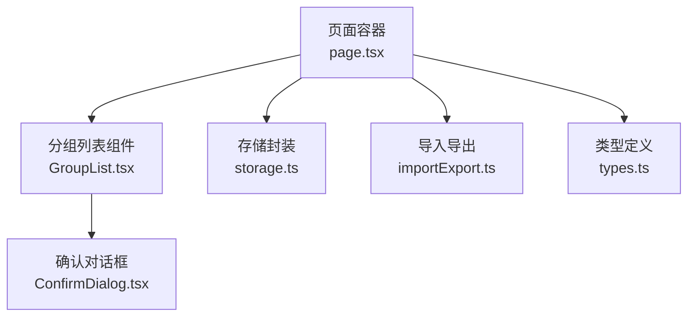
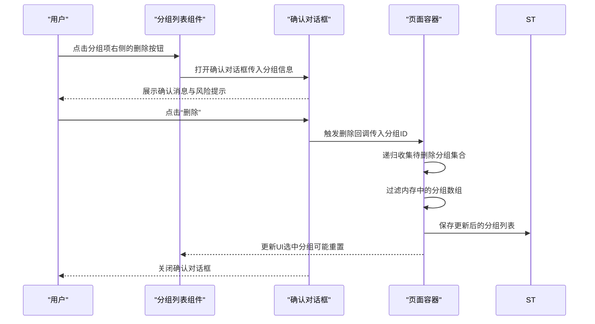
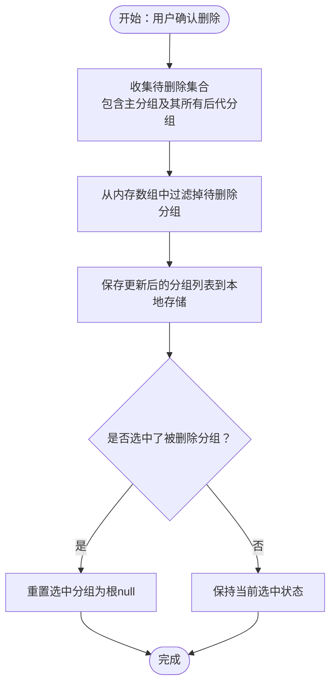
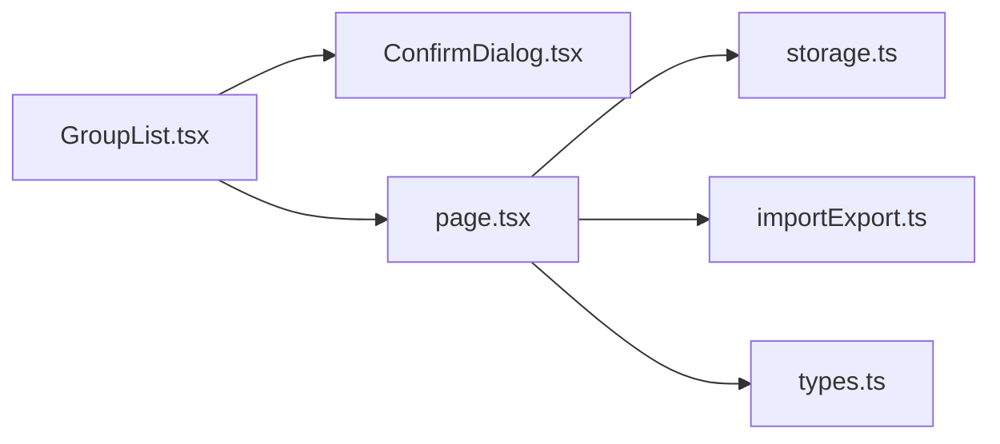

# 分组删除

<cite>
**本文引用的文件**
- [GroupList.tsx](file://src/components/GroupList.tsx)
- [ConfirmDialog.tsx](file://src/components/ConfirmDialog.tsx)
- [page.tsx](file://src/app/page.tsx)
- [storage.ts](file://src/lib/storage.ts)
- [types.ts](file://src/lib/types.ts)
- [importExport.ts](file://src/lib/importExport.ts)
</cite>

## 目录
1. [简介](#简介)
2. [项目结构](#项目结构)
3. [核心组件](#核心组件)
4. [架构总览](#架构总览)
5. [详细组件分析](#详细组件分析)
6. [依赖关系分析](#依赖关系分析)
7. [性能考量](#性能考量)
8. [故障排除指南](#故障排除指南)
9. [结论](#结论)
10. [附录](#附录)

## 简介
本指南面向“分组删除”功能，提供一套完整、可操作的安全操作流程与最佳实践。内容涵盖：
- 删除操作的触发方式与安全确认机制
- 删除按钮位置与视觉反馈
- 删除确认对话框工作原理与风险提示
- 级联删除概念与数据处理策略
- 删除前的数据备份与预防措施
- 删除失败的常见原因与故障排除方法

## 项目结构
分组删除涉及以下关键模块：
- 页面容器：负责状态管理、删除主流程与持久化
- 分组列表组件：渲染树形结构、触发删除确认
- 通用确认对话框：统一的二次确认交互
- 存储与类型：本地存储封装与数据模型定义
- 导入导出：数据备份与恢复的基础能力

图表来源
- [page.tsx:14-798](file://src/app/page.tsx#L14-L798)
- [GroupList.tsx:1-294](file://src/components/GroupList.tsx#L1-L294)
- [ConfirmDialog.tsx:1-54](file://src/components/ConfirmDialog.tsx#L1-L54)
- [storage.ts:1-50](file://src/lib/storage.ts#L1-L50)
- [importExport.ts:1-120](file://src/lib/importExport.ts#L1-L120)
- [types.ts:1-51](file://src/lib/types.ts#L1-L51)

章节来源
- [page.tsx:14-798](file://src/app/page.tsx#L14-L798)
- [GroupList.tsx:1-294](file://src/components/GroupList.tsx#L1-L294)
- [ConfirmDialog.tsx:1-54](file://src/components/ConfirmDialog.tsx#L1-L54)
- [storage.ts:1-50](file://src/lib/storage.ts#L1-L50)
- [importExport.ts:1-120](file://src/lib/importExport.ts#L1-L120)
- [types.ts:1-51](file://src/lib/types.ts#L1-L51)

## 核心组件
- 分组列表组件：负责渲染树形分组、计算公式总数、触发删除确认对话框，并在确认后调用上层删除回调。
- 确认对话框：提供标题、消息、确认/取消按钮与危险样式变体，确保用户明确操作后果。
- 页面容器：实现删除主流程（递归收集待删除分组集合）、更新内存状态、持久化到本地存储，并处理选中分组切换。

章节来源
- [GroupList.tsx:16-294](file://src/components/GroupList.tsx#L16-L294)
- [ConfirmDialog.tsx:16-53](file://src/components/ConfirmDialog.tsx#L16-L53)
- [page.tsx:178-197](file://src/app/page.tsx#L178-L197)

## 架构总览
分组删除的端到端流程如下：

图表来源
- [GroupList.tsx:72-81](file://src/components/GroupList.tsx#L72-L81)
- [ConfirmDialog.tsx:16-53](file://src/components/ConfirmDialog.tsx#L16-L53)
- [page.tsx:178-197](file://src/app/page.tsx#L178-L197)
- [storage.ts:17-25](file://src/lib/storage.ts#L17-L25)

## 详细组件分析

### 删除按钮与触发流程
- 位置与可见性：每个分组行右侧提供一组操作按钮，其中删除按钮位于最右侧；当鼠标悬停在分组行上时，按钮组透明度过渡显示。
- 触发行为：点击删除按钮会设置内部状态以打开确认对话框，并将当前分组对象传递给对话框。
- 视觉反馈：删除按钮采用红色高亮，配合旋转动画与图标变化，增强警示效果。

章节来源
- [GroupList.tsx:152-187](file://src/components/GroupList.tsx#L152-L187)
- [GroupList.tsx:72-81](file://src/components/GroupList.tsx#L72-L81)

### 删除确认对话框工作原理
- 组件职责：接收标题、消息、确认/取消文本、样式变体以及回调函数；在打开状态下渲染遮罩层与对话框主体。
- 风险提示：消息明确指出将删除当前分组及其“所有子分组内的公式”，帮助用户理解级联影响。
- 操作选项：提供“删除”与“取消”两个选项；危险样式变体用于强调破坏性操作。
- 交互细节：点击遮罩层可取消；确认按钮调用回调，取消按钮关闭对话框。

章节来源
- [ConfirmDialog.tsx:16-53](file://src/components/ConfirmDialog.tsx#L16-L53)
- [GroupList.tsx:281-290](file://src/components/GroupList.tsx#L281-L290)

### 级联删除与数据处理策略
- 级联范围：删除主分组时，系统会递归收集其所有后代分组（包括子分组、孙分组等），并将这些分组一并删除。
- 数据处理：从内存数组中过滤掉所有待删除分组，然后立即保存到本地存储；同时若当前选中的是被删除分组，则重置选中状态。
- 公式清理：由于分组与其子分组均被删除，分组内的公式也随之被移除；系统未实现额外的“迁移或清理”逻辑，删除即彻底移除。

图表来源
- [page.tsx:178-197](file://src/app/page.tsx#L178-L197)

章节来源
- [page.tsx:178-197](file://src/app/page.tsx#L178-L197)

### 删除前的数据备份与预防措施
- 建议步骤：
  - 使用“数据管理”菜单中的“导出数据”功能，将当前分组与公式数据导出为本地 JSON 文件，作为删除前的备份。
  - 导出文件包含版本号与导出时间戳，便于后续核对与恢复。
- 预防措施：
  - 在执行删除前，先在界面中确认要删除的分组层级与包含的公式数量，避免误删。
  - 对于重要分组，建议先将其拆分为更小的子分组，降低一次性删除的影响面。

章节来源
- [page.tsx:365-372](file://src/app/page.tsx#L365-L372)
- [importExport.ts:12-38](file://src/lib/importExport.ts#L12-L38)

### 删除失败的常见原因与故障排除
- 本地存储写入失败：当浏览器禁用本地存储或磁盘空间不足时，保存操作可能抛出异常并记录错误日志。
- 数据结构异常：如果本地存储中的数据格式不符合预期，读取时会返回空数组并记录错误。
- 网络导入失败（间接关联）：虽然删除本身不涉及网络请求，但导入/导出功能依赖网络与文件系统，若出现网络问题，可能影响备份与恢复流程。

章节来源
- [storage.ts:8-24](file://src/lib/storage.ts#L8-L24)
- [page.tsx:374-420](file://src/app/page.tsx#L374-L420)
- [importExport.ts:105-119](file://src/lib/importExport.ts#L105-L119)

## 依赖关系分析
- 分组列表组件依赖确认对话框组件进行二次确认。
- 页面容器负责删除主流程与本地存储交互，向分组列表组件暴露删除回调。
- 类型定义为分组与公式提供结构约束，确保数据一致性。
- 导入导出模块提供备份与恢复能力，是删除安全性的关键支撑。

图表来源
- [GroupList.tsx:1-294](file://src/components/GroupList.tsx#L1-L294)
- [ConfirmDialog.tsx:1-54](file://src/components/ConfirmDialog.tsx#L1-L54)
- [page.tsx:14-798](file://src/app/page.tsx#L14-L798)
- [storage.ts:1-50](file://src/lib/storage.ts#L1-L50)
- [importExport.ts:1-120](file://src/lib/importExport.ts#L1-L120)
- [types.ts:1-51](file://src/lib/types.ts#L1-L51)

章节来源
- [GroupList.tsx:1-294](file://src/components/GroupList.tsx#L1-L294)
- [ConfirmDialog.tsx:1-54](file://src/components/ConfirmDialog.tsx#L1-L54)
- [page.tsx:14-798](file://src/app/page.tsx#L14-L798)
- [storage.ts:1-50](file://src/lib/storage.ts#L1-L50)
- [importExport.ts:1-120](file://src/lib/importExport.ts#L1-L120)
- [types.ts:1-51](file://src/lib/types.ts#L1-L51)

## 性能考量
- 级联删除的集合收集采用迭代方式，复杂度与分组树深度线性相关；在大型树结构中仍具备良好性能。
- 本地存储写入为同步操作，建议在批量更新后统一保存，减少频繁 IO。
- 公式计数与树渲染在渲染层完成，删除后即时刷新，用户体验流畅。

## 故障排除指南
- 删除后数据未持久化：检查浏览器是否允许本地存储，确认保存函数未抛出异常。
- 删除后界面未更新：确认回调已正确传递至页面容器，且内存状态已更新。
- 导出/导入失败：检查文件格式与网络连接，确保 JSON 结构符合规范。

章节来源
- [storage.ts:17-25](file://src/lib/storage.ts#L17-L25)
- [importExport.ts:43-75](file://src/lib/importExport.ts#L43-L75)

## 结论
分组删除功能通过“树形结构 + 二次确认 + 本地存储”的组合，实现了安全可控的级联删除。建议在每次删除前进行数据导出备份，并在确认对话框中仔细阅读风险提示，以避免不可逆的数据损失。

## 附录
- 数据模型要点（与删除相关的字段）：
  - 分组：id、name、parentId、formulas、createdAt
  - 公式：id、name、englishFormula、chineseFormula、variableFormulaMapping、subFormulas、createdAt

章节来源
- [types.ts:44-50](file://src/lib/types.ts#L44-L50)
- [types.ts:27-35](file://src/lib/types.ts#L27-L35)