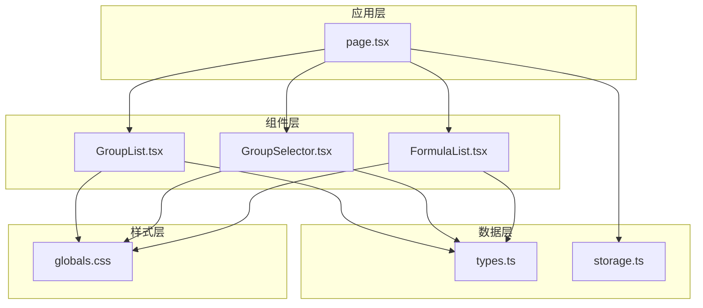
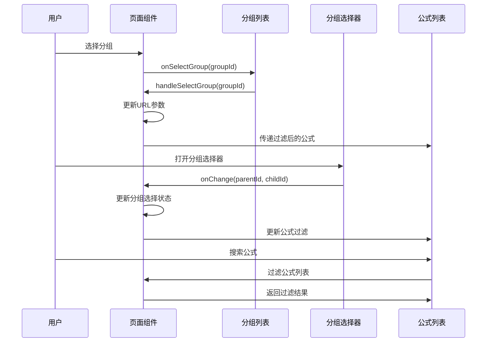
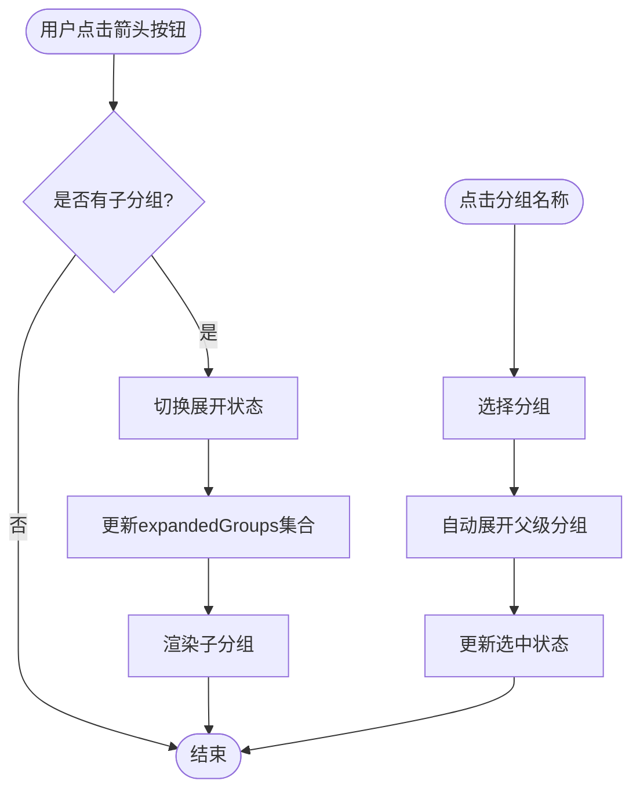
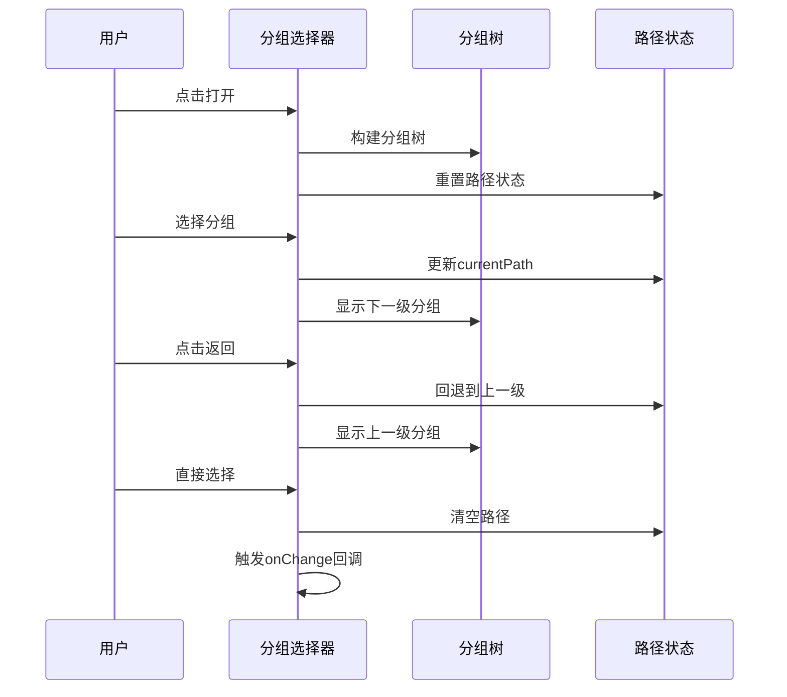
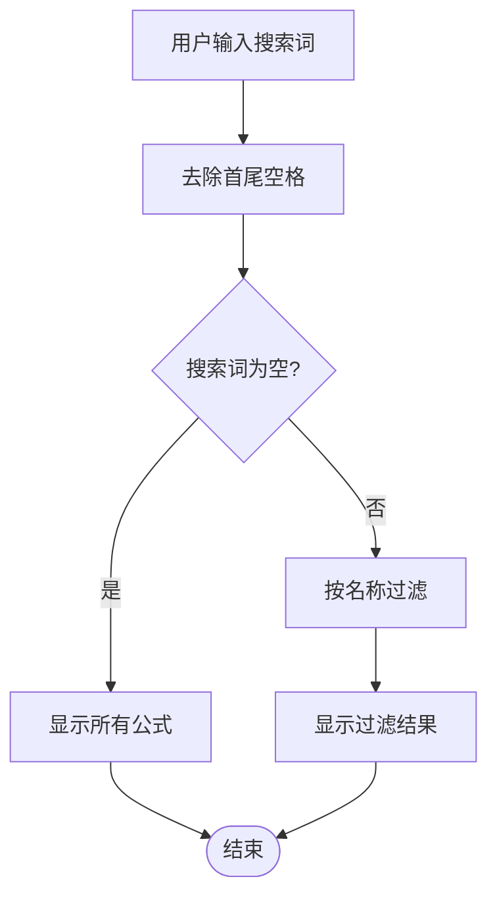
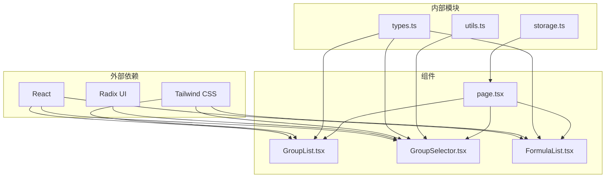
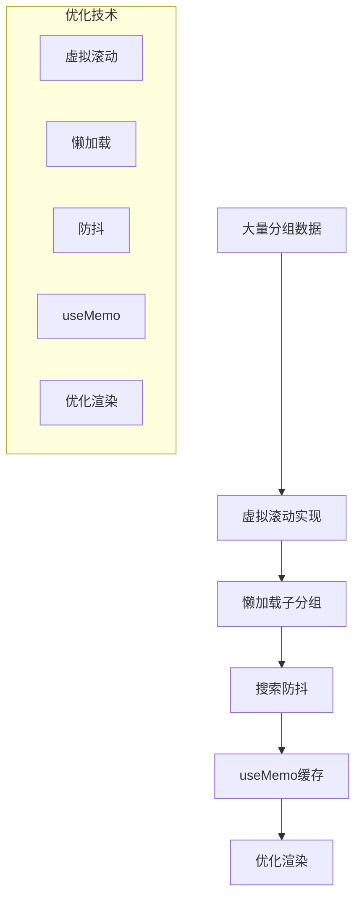

# 分组导航

<cite>
**本文档引用的文件**
- [GroupList.tsx](file://src/components/GroupList.tsx)
- [GroupSelector.tsx](file://src/components/GroupSelector.tsx)
- [FormulaList.tsx](file://src/components/FormulaList.tsx)
- [page.tsx](file://src/app/page.tsx)
- [types.ts](file://src/lib/types.ts)
- [globals.css](file://src/app/globals.css)
</cite>

## 目录
1. [简介](#简介)
2. [项目结构](#项目结构)
3. [核心组件](#核心组件)
4. [架构概览](#架构概览)
5. [详细组件分析](#详细组件分析)
6. [依赖关系分析](#依赖关系分析)
7. [性能考虑](#性能考虑)
8. [故障排除指南](#故障排除指南)
9. [结论](#结论)

## 简介

分组导航功能是公式管理系统的核心交互组件，提供了完整的分组树浏览、选择和管理能力。该功能支持多级分组结构，包含展开折叠机制、层级缩进显示、状态记忆、多种选择方式以及搜索过滤功能。

## 项目结构

分组导航功能主要由以下核心文件组成：

**图表来源**
- [page.tsx:14-798](file://src/app/page.tsx#L14-L798)
- [GroupList.tsx:1-294](file://src/components/GroupList.tsx#L1-L294)
- [GroupSelector.tsx:1-197](file://src/components/GroupSelector.tsx#L1-L197)
- [FormulaList.tsx:1-387](file://src/components/FormulaList.tsx#L1-L387)

**章节来源**
- [page.tsx:14-798](file://src/app/page.tsx#L14-L798)
- [GroupList.tsx:1-294](file://src/components/GroupList.tsx#L1-L294)
- [GroupSelector.tsx:1-197](file://src/components/GroupSelector.tsx#L1-L197)
- [FormulaList.tsx:1-387](file://src/components/FormulaList.tsx#L1-L387)

## 核心组件

分组导航系统包含三个核心组件，每个组件都有特定的功能职责：

### 组件职责分配

| 组件 | 主要功能 | 状态管理 | 交互方式 |
|------|----------|----------|----------|
| GroupList | 分组树展示、展开折叠、分组操作 | 展开状态、编辑状态、删除确认 | 点击选择、悬停菜单、键盘导航 |
| GroupSelector | 分组选择器、面包屑导航 | 选择状态、路径状态 | 下拉选择、面包屑导航 |
| FormulaList | 公式列表、搜索过滤 | 搜索状态、展开状态 | 点击展开、搜索过滤 |

**章节来源**
- [GroupList.tsx:16-294](file://src/components/GroupList.tsx#L16-L294)
- [GroupSelector.tsx:17-197](file://src/components/GroupSelector.tsx#L17-L197)
- [FormulaList.tsx:21-387](file://src/components/FormulaList.tsx#L21-L387)

## 架构概览

分组导航采用单向数据流架构，状态集中在页面组件中，通过props向下传递给子组件。

**图表来源**
- [page.tsx:45-52](file://src/app/page.tsx#L45-L52)
- [GroupList.tsx:128](file://src/components/GroupList.tsx#L128)
- [GroupSelector.tsx:71-90](file://src/components/GroupSelector.tsx#L71-L90)
- [FormulaList.tsx:75-79](file://src/components/FormulaList.tsx#L75-L79)

## 详细组件分析

### 分组列表组件 (GroupList)

分组列表组件实现了完整的分组树功能，包括展开折叠机制、层级缩进和状态记忆。

#### 展开折叠机制

**图表来源**
- [GroupList.tsx:83-111](file://src/components/GroupList.tsx#L83-L111)
- [GroupList.tsx:132-147](file://src/components/GroupList.tsx#L132-L147)

#### 层级缩进显示

组件使用CSS margin-left 实现层级缩进，每深入一层增加12px的缩进：

- 顶级分组：margin-left: 0px
- 一级子分组：margin-left: 12px  
- 二级子分组：margin-left: 24px
- 以此类推...

#### 展开状态记忆

组件维护一个Set来跟踪展开的分组ID，确保用户操作不会丢失展开状态。

**章节来源**
- [GroupList.tsx:31](file://src/components/GroupList.tsx#L31)
- [GroupList.tsx:83-111](file://src/components/GroupList.tsx#L83-L111)
- [GroupList.tsx:121](file://src/components/GroupList.tsx#L121)

### 分组选择器组件 (GroupSelector)

分组选择器提供了类似面包屑的分层选择界面，支持快速定位到目标分组。

#### 面包屑导航机制

**图表来源**
- [GroupSelector.tsx:27-35](file://src/components/GroupSelector.tsx#L27-L35)
- [GroupSelector.tsx:63-68](file://src/components/GroupSelector.tsx#L63-L68)
- [GroupSelector.tsx:93-107](file://src/components/GroupSelector.tsx#L93-L107)

#### 选择方式

组件支持两种选择方式：
1. **逐级展开选择**：点击分组展开下一级
2. **直接选择**：对于没有子分组的节点，点击右侧"选择"按钮直接完成选择

**章节来源**
- [GroupSelector.tsx:71-90](file://src/components/GroupSelector.tsx#L71-L90)
- [GroupSelector.tsx:130-196](file://src/components/GroupSelector.tsx#L130-L196)

### 公式列表组件 (FormulaList)

公式列表组件负责显示和过滤公式，支持搜索功能和分组筛选。

#### 搜索过滤机制

**图表来源**
- [FormulaList.tsx:75-79](file://src/components/FormulaList.tsx#L75-L79)

#### 分组筛选逻辑

组件根据选中的分组ID，递归获取该分组及其所有后代分组的公式ID，然后进行过滤显示。

**章节来源**
- [FormulaList.tsx:67-72](file://src/components/FormulaList.tsx#L67-L72)
- [FormulaList.tsx:75-79](file://src/components/FormulaList.tsx#L75-L79)

## 依赖关系分析

分组导航系统的依赖关系清晰明确，遵循单向数据流原则。

**图表来源**
- [GroupList.tsx:3-4](file://src/components/GroupList.tsx#L3-L4)
- [GroupSelector.tsx:3-4](file://src/components/GroupSelector.tsx#L3-L4)
- [FormulaList.tsx:3-10](file://src/components/FormulaList.tsx#L3-L10)
- [page.tsx:5-12](file://src/app/page.tsx#L5-L12)

**章节来源**
- [types.ts:1-51](file://src/lib/types.ts#L1-L51)
- [utils.ts:1-7](file://src/lib/utils.ts#L1-L7)

## 性能考虑

### 内存优化策略

1. **状态记忆优化**
   - 使用Set存储展开状态，避免重复渲染
   - 通过useMemo缓存分组树构建结果

2. **渲染性能优化**
   - 使用CSS transform替代DOM操作
   - 条件渲染减少不必要的组件实例化

3. **数据结构优化**
   - 使用Map进行子分组查找，时间复杂度O(1)
   - 预计算公式数量，避免重复计算

### 滚动体验改进

1. **虚拟滚动**
   - 对于大量分组的情况，建议实现虚拟滚动
   - 只渲染可见区域内的分组项

2. **懒加载**
   - 子分组采用懒加载模式
   - 仅在展开时渲染子分组内容

3. **防抖处理**
   - 搜索功能添加防抖机制
   - 避免频繁的重新渲染

### 建议的性能优化方案

## 故障排除指南

### 常见问题及解决方案

1. **展开状态丢失**
   - 症状：刷新页面后展开状态恢复默认
   - 解决：检查localStorage缓存逻辑
   - 相关代码：[page.tsx:89-129](file://src/app/page.tsx#L89-L129)

2. **分组选择异常**
   - 症状：选择分组后无法正确展开
   - 解决：验证父级分组ID链路
   - 相关代码：[GroupList.tsx:94-111](file://src/components/GroupList.tsx#L94-L111)

3. **搜索功能失效**
   - 症状：搜索框输入无响应
   - 解决：检查searchQuery状态绑定
   - 相关代码：[FormulaList.tsx:29](file://src/components/FormulaList.tsx#L29)

4. **面包屑导航错误**
   - 症状：面包屑显示不正确
   - 解决：验证currentPath状态管理
   - 相关代码：[GroupSelector.tsx:18-24](file://src/components/GroupSelector.tsx#L18-L24)

**章节来源**
- [page.tsx:89-129](file://src/app/page.tsx#L89-L129)
- [GroupList.tsx:94-111](file://src/components/GroupList.tsx#L94-L111)
- [FormulaList.tsx:29](file://src/components/FormulaList.tsx#L29)
- [GroupSelector.tsx:18-24](file://src/components/GroupSelector.tsx#L18-L24)

## 结论

分组导航功能通过精心设计的组件架构和交互模式，为用户提供了直观高效的分组管理体验。系统的主要优势包括：

1. **直观的层次结构**：通过箭头按钮和层级缩进清晰展示分组关系
2. **智能的状态记忆**：自动展开父级分组，保持用户的浏览连续性
3. **灵活的选择方式**：支持点击选择、悬停菜单和面包屑导航
4. **强大的搜索功能**：实时过滤公式，快速定位目标内容
5. **优秀的性能表现**：通过多种优化策略确保大体量数据的流畅体验

该系统为后续的功能扩展奠定了良好的基础，包括虚拟滚动、拖拽排序、批量操作等功能都可以在此架构上进行增强。