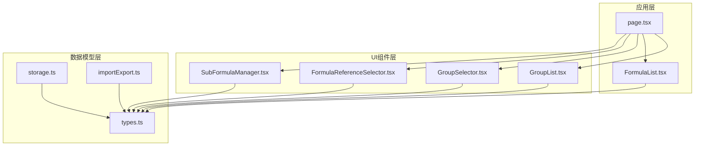
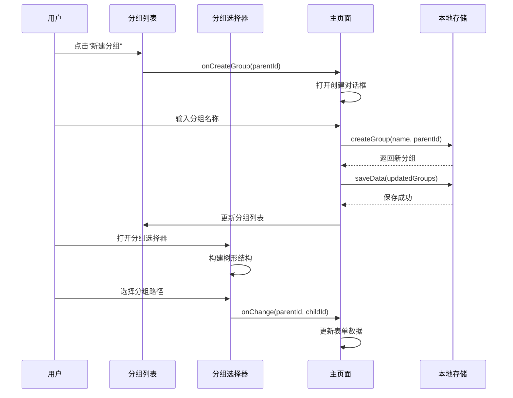
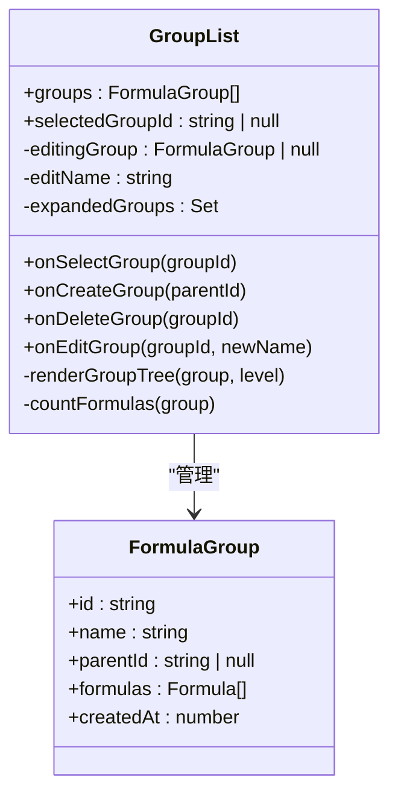
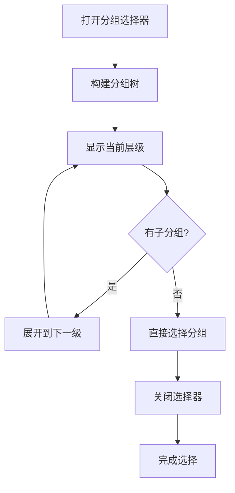
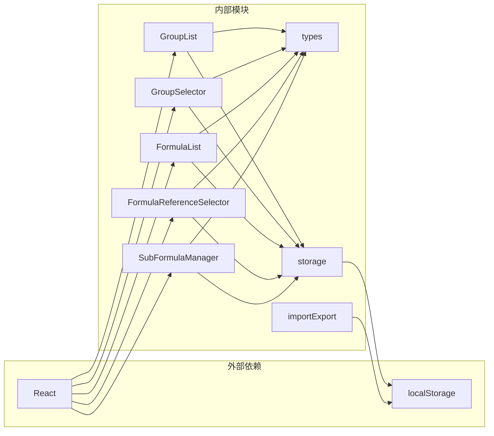

# 分组管理

<cite>
**本文档引用的文件**
- [GroupList.tsx](file://src/components/GroupList.tsx)
- [GroupSelector.tsx](file://src/components/GroupSelector.tsx)
- [page.tsx](file://src/app/page.tsx)
- [FormulaList.tsx](file://src/components/FormulaList.tsx)
- [FormulaReferenceSelector.tsx](file://src/components/FormulaReferenceSelector.tsx)
- [SubFormulaManager.tsx](file://src/components/SubFormulaManager.tsx)
- [types.ts](file://src/lib/types.ts)
- [storage.ts](file://src/lib/storage.ts)
- [importExport.ts](file://src/lib/importExport.ts)
</cite>

## 目录
1. [简介](#简介)
2. [项目结构](#项目结构)
3. [核心组件](#核心组件)
4. [架构概览](#架构概览)
5. [详细组件分析](#详细组件分析)
6. [依赖分析](#依赖分析)
7. [性能考虑](#性能考虑)
8. [故障排除指南](#故障排除指南)
9. [结论](#结论)

## 简介

分组管理功能是公式管理系统的核心模块，提供了完整的分组层级结构管理能力。该系统支持多级分组（最多两级）、父子关系设置、动态树形导航、公式组织和权限继承等高级功能。

本指南将详细介绍如何使用分组管理功能，包括创建、编辑、删除分组的操作流程，以及分组选择器的使用方法、分组在公式组织中的作用和最佳实践。

## 项目结构

分组管理功能主要分布在以下文件中：

**图表来源**
- [page.tsx:1-737](file://src/app/page.tsx#L1-L737)
- [GroupList.tsx:1-294](file://src/components/GroupList.tsx#L1-L294)
- [GroupSelector.tsx:1-197](file://src/components/GroupSelector.tsx#L1-L197)

**章节来源**
- [page.tsx:1-737](file://src/app/page.tsx#L1-L737)
- [types.ts:1-51](file://src/lib/types.ts#L1-L51)

## 核心组件

分组管理功能由多个核心组件协同工作：

### 数据模型
- **FormulaGroup**: 定义分组的基本属性，包括ID、名称、父分组ID和公式列表
- **Formula**: 定义公式的基本属性，包括变量映射和子公式支持
- **SubFormula**: 定义子公式的属性

### UI组件
- **GroupList**: 提供分组树形列表界面，支持展开/折叠、重命名、删除等操作
- **GroupSelector**: 提供分组选择器，支持多级导航和面包屑显示
- **FormulaList**: 展示分组下的公式列表，并支持搜索和过滤

**章节来源**
- [types.ts:44-51](file://src/lib/types.ts#L44-L51)
- [GroupList.tsx:7-14](file://src/components/GroupList.tsx#L7-L14)
- [GroupSelector.tsx:6-10](file://src/components/GroupSelector.tsx#L6-L10)

## 架构概览

分组管理采用React Hooks模式，通过状态管理和事件处理实现完整的CRUD操作：

**图表来源**
- [page.tsx:161-176](file://src/app/page.tsx#L161-L176)
- [GroupList.tsx:16-23](file://src/components/GroupList.tsx#L16-L23)
- [GroupSelector.tsx:17-107](file://src/components/GroupSelector.tsx#L17-L107)

## 详细组件分析

### 分组列表组件 (GroupList)

分组列表组件提供了完整的分组管理界面：

#### 核心功能
- **树形结构显示**: 支持最多两级分组的层次化显示
- **交互操作**: 支持展开/折叠、重命名、删除等操作
- **公式计数**: 自动统计分组及其子分组中的公式总数
- **选中状态**: 高亮显示当前选中的分组

#### 组件特性
- 使用`useState`管理编辑状态、删除确认和展开状态
- 通过`useEffect`实现选中分组时的自动展开功能
- 实现了完整的分组树构建算法

**图表来源**
- [GroupList.tsx:16-23](file://src/components/GroupList.tsx#L16-L23)
- [types.ts:44-51](file://src/lib/types.ts#L44-L51)

**章节来源**
- [GroupList.tsx:1-294](file://src/components/GroupList.tsx#L1-L294)

### 分组选择器组件 (GroupSelector)

分组选择器提供了直观的多级分组导航体验：

#### 导航特性
- **面包屑导航**: 显示当前选择路径，支持返回上一级
- **层级浏览**: 支持逐级展开查看子分组
- **直接选择**: 支持跳过中间层级直接选择目标分组
- **智能排序**: 按字母顺序显示分组选项

#### 核心算法
- 使用`buildTree`函数构建分组树结构
- 通过`currentPath`管理当前浏览路径
- 实现了`getDescendantGroupIds`递归算法

**图表来源**
- [GroupSelector.tsx:27-35](file://src/components/GroupSelector.tsx#L27-L35)
- [GroupSelector.tsx:71-90](file://src/components/GroupSelector.tsx#L71-L90)

**章节来源**
- [GroupSelector.tsx:1-197](file://src/components/GroupSelector.tsx#L1-L197)

### 主页面集成

主页面负责协调各个组件的工作：

#### 状态管理
- **分组状态**: 管理所有分组数据和选中状态
- **表单状态**: 管理公式创建和编辑表单
- **对话框状态**: 控制各种模态框的显示/隐藏

#### 数据持久化
- 使用localStorage实现数据持久化
- 支持分组和公式的增删改查操作
- 实现了完整的数据导入导出功能

**章节来源**
- [page.tsx:14-134](file://src/app/page.tsx#L14-L134)
- [storage.ts:1-50](file://src/lib/storage.ts#L1-L50)

### 公式列表组件

公式列表组件展示了分组过滤功能：

#### 过滤逻辑
- **主分组**: 显示自身及所有子分组的公式
- **子分组**: 仅显示自身的公式
- **搜索功能**: 支持按公式名称搜索

#### 性能优化
- 使用`useMemo`缓存分组树构建
- 实现了高效的后代分组查找算法

**章节来源**
- [FormulaList.tsx:47-72](file://src/components/FormulaList.tsx#L47-L72)

## 依赖分析

分组管理功能的依赖关系如下：

**图表来源**
- [GroupList.tsx:3-5](file://src/components/GroupList.tsx#L3-L5)
- [GroupSelector.tsx:3-4](file://src/components/GroupSelector.tsx#L3-L4)
- [FormulaList.tsx:3-10](file://src/components/FormulaList.tsx#L3-L10)

**章节来源**
- [types.ts:1-51](file://src/lib/types.ts#L1-L51)
- [storage.ts:1-50](file://src/lib/storage.ts#L1-L50)

## 性能考虑

分组管理功能在设计时充分考虑了性能优化：

### 内存优化
- 使用`useMemo`缓存昂贵的计算结果
- 通过`useCallback`优化函数引用稳定性
- 实现了懒加载的分组树构建

### 渲染优化
- 条件渲染减少不必要的DOM元素
- 局部状态更新避免全组件重渲染
- 使用CSS类名切换而非重新渲染整个组件

### 数据处理优化
- 递归算法实现高效的后代分组查找
- Map数据结构提供O(1)的分组查找性能
- 避免重复的数组遍历操作

## 故障排除指南

### 常见问题及解决方案

#### 分组无法展开
**问题**: 分组列表中的展开按钮无响应
**原因**: 分组数据结构异常或状态管理问题
**解决**: 检查分组的parentId字段，确保父子关系正确

#### 删除分组后数据丢失
**问题**: 删除分组时公式数据消失
**原因**: 删除算法错误或数据持久化失败
**解决**: 检查删除逻辑中的递归算法，确认localStorage写入成功

#### 分组选择器显示异常
**问题**: 分组选择器无法正确显示分组层级
**原因**: 分组树构建算法错误
**解决**: 验证`buildTree`函数的递归逻辑，检查分组ID关联

#### 公式过滤不准确
**问题**: 主分组显示的公式数量不正确
**原因**: 后代分组查找算法错误
**解决**: 检查`getDescendantGroupIds`函数的递归实现

**章节来源**
- [GroupList.tsx:180-197](file://src/components/GroupList.tsx#L180-L197)
- [FormulaList.tsx:56-64](file://src/components/FormulaList.tsx#L56-L64)

## 结论

分组管理功能提供了完整的公式组织解决方案，具有以下特点：

### 功能完整性
- 支持最多两级分组的灵活层级结构
- 提供直观的树形导航和面包屑显示
- 实现了完整的CRUD操作流程

### 用户体验
- 响应式设计适配不同屏幕尺寸
- 即时反馈的交互状态
- 直观的视觉层次结构

### 技术优势
- 基于React Hooks的状态管理
- 高效的算法实现和性能优化
- 类型安全的TypeScript实现

该系统为公式管理提供了强大的组织能力，用户可以通过清晰的分组结构有效地管理和查找公式，提高工作效率。