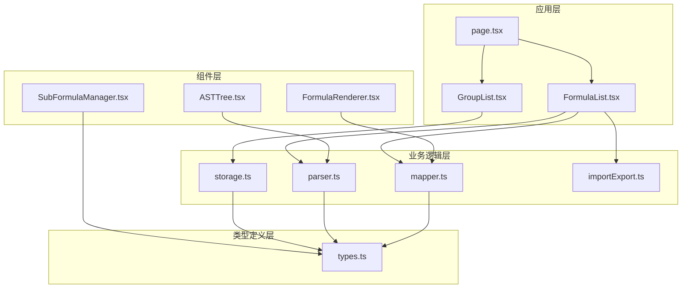
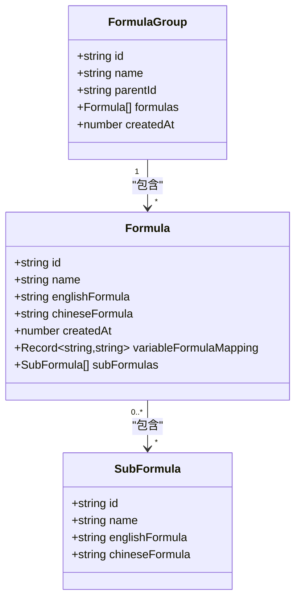
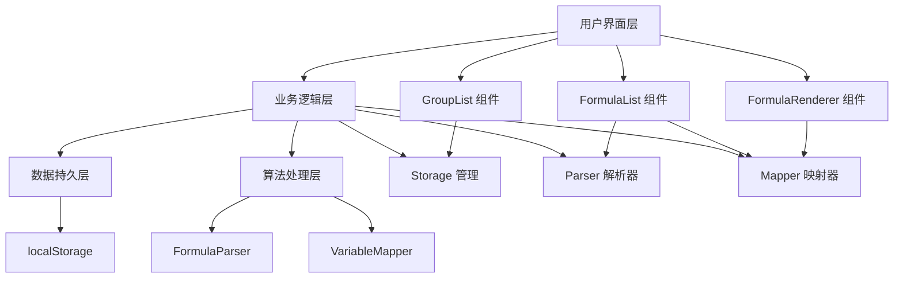
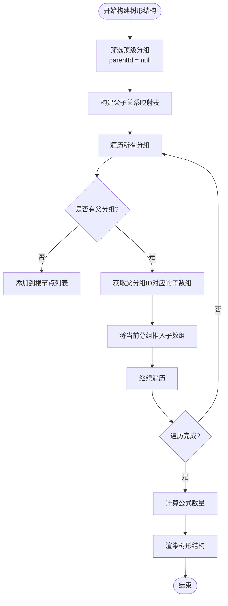
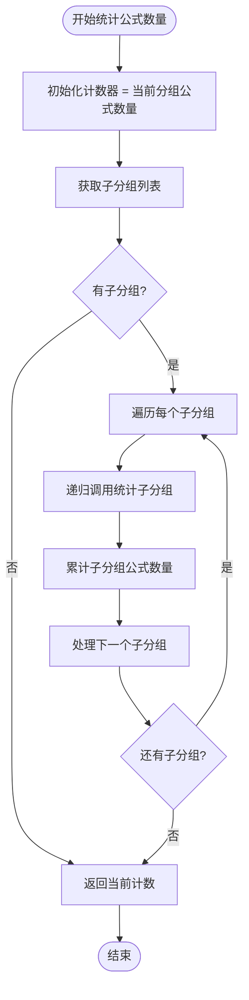
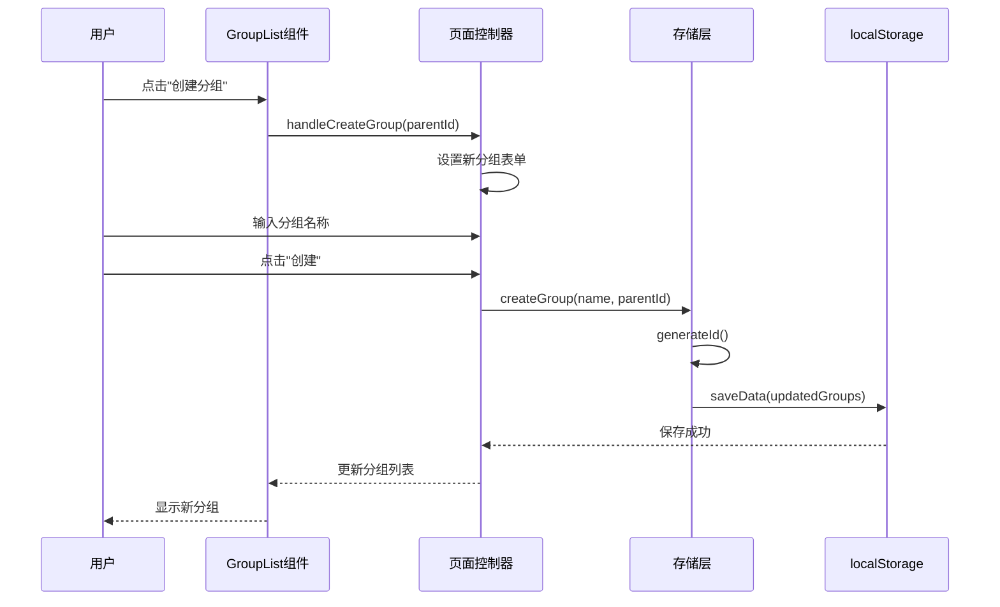
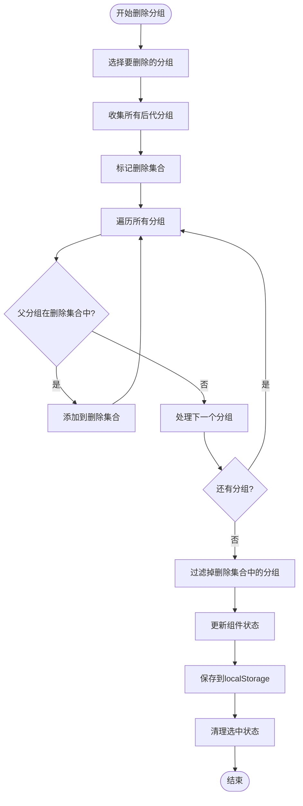
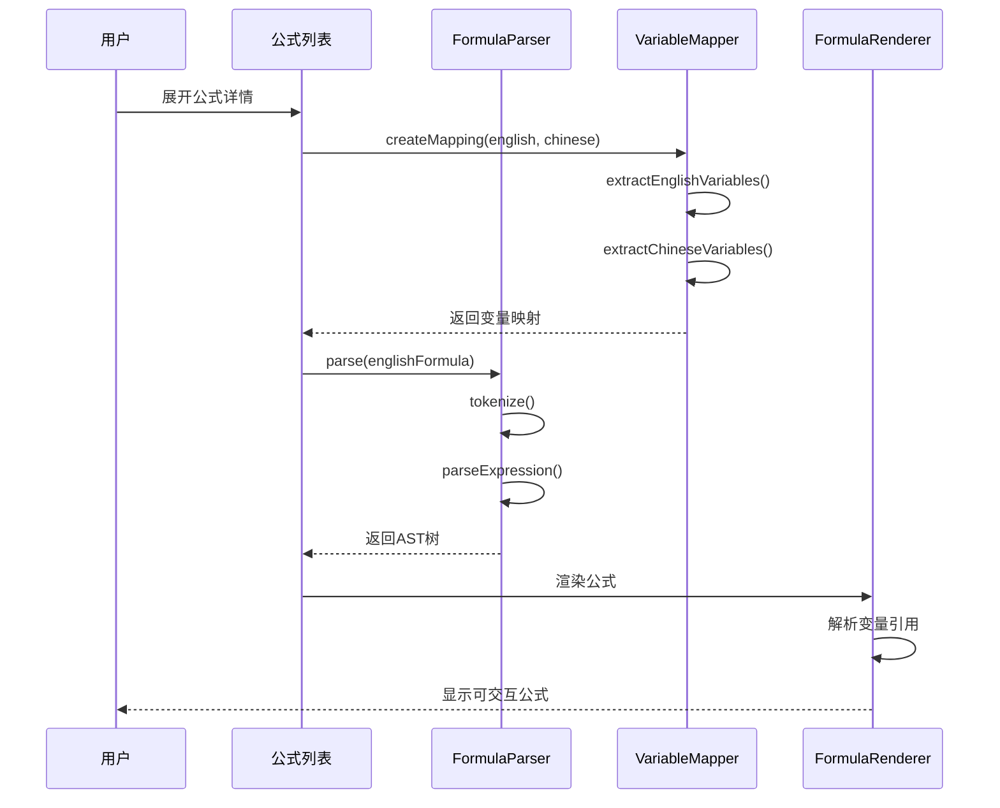
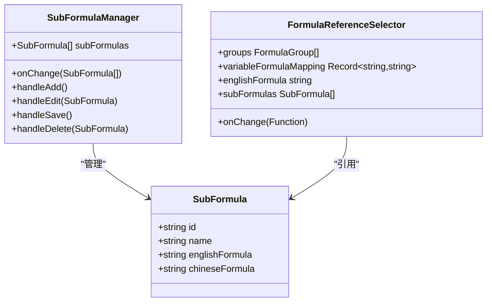
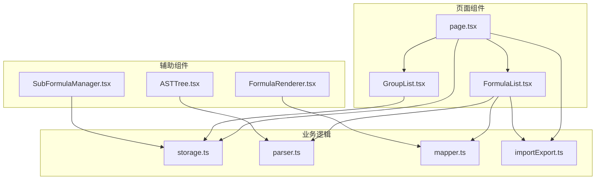

# 分组结构管理

<cite>
**本文档引用的文件**
- [types.ts](file://src/lib/types.ts)
- [storage.ts](file://src/lib/storage.ts)
- [GroupList.tsx](file://src/components/GroupList.tsx)
- [FormulaList.tsx](file://src/components/FormulaList.tsx)
- [page.tsx](file://src/app/page.tsx)
- [parser.ts](file://src/lib/parser.ts)
- [mapper.ts](file://src/lib/mapper.ts)
- [FormulaRenderer.tsx](file://src/components/FormulaRenderer.tsx)
- [ASTTree.tsx](file://src/components/ASTTree.tsx)
- [SubFormulaManager.tsx](file://src/components/SubFormulaManager.tsx)
- [importExport.ts](file://src/lib/importExport.ts)
</cite>

## 目录
1. [简介](#简介)
2. [项目结构](#项目结构)
3. [核心组件](#核心组件)
4. [架构概览](#架构概览)
5. [详细组件分析](#详细组件分析)
6. [依赖分析](#依赖分析)
7. [性能考虑](#性能考虑)
8. [故障排除指南](#故障排除指南)
9. [结论](#结论)

## 简介

本项目是一个基于 React 和 Next.js 的公式变量映射与可视化工具，专注于分组结构管理。系统提供了完整的分组层次结构设计，包括父子关系的数据模型、树形结构的构建算法、分组ID系统的唯一性保证、分组公式的统计计算方法、分组移动和重组操作、以及分组结构的完整性检查和修复方法。

## 项目结构

项目采用模块化的前端架构，主要分为以下几个层次：

**图表来源**
- [page.tsx:14-798](file://src/app/page.tsx#L14-L798)
- [GroupList.tsx:1-294](file://src/components/GroupList.tsx#L1-L294)
- [FormulaList.tsx:1-387](file://src/components/FormulaList.tsx#L1-L387)

**章节来源**
- [page.tsx:14-798](file://src/app/page.tsx#L14-L798)
- [types.ts:1-51](file://src/lib/types.ts#L1-L51)

## 核心组件

### 分组数据模型

系统的核心数据结构围绕 `FormulaGroup` 接口设计，实现了完整的树形层次结构：

**图表来源**
- [types.ts:27-50](file://src/lib/types.ts#L27-L50)

### 分组ID系统

系统采用时间戳+随机数的组合方式生成唯一ID：

- **生成算法**: `timestamp + '-' + randomString`
- **唯一性保证**: 时间戳确保全局唯一，随机字符串提供额外的去重保障
- **冲突处理**: 通过算法保证几乎不可能发生冲突

**章节来源**
- [storage.ts:47-49](file://src/lib/storage.ts#L47-L49)
- [storage.ts:27-45](file://src/lib/storage.ts#L27-L45)

## 架构概览

系统采用分层架构设计，各层职责明确：

**图表来源**
- [page.tsx:14-798](file://src/app/page.tsx#L14-L798)
- [storage.ts:1-50](file://src/lib/storage.ts#L1-L50)
- [parser.ts:3-22](file://src/lib/parser.ts#L3-L22)

## 详细组件分析

### 分组树形结构管理

#### 树形结构构建算法

系统实现了高效的树形结构构建算法：

**图表来源**
- [GroupList.tsx:33-53](file://src/components/GroupList.tsx#L33-L53)

#### 公式数量统计算法

系统实现了递归计算公式数量的方法：

**图表来源**
- [GroupList.tsx:44-53](file://src/components/GroupList.tsx#L44-L53)

**章节来源**
- [GroupList.tsx:33-53](file://src/components/GroupList.tsx#L33-L53)

### 分组操作管理

#### 分组创建流程

**图表来源**
- [page.tsx:161-176](file://src/app/page.tsx#L161-L176)
- [storage.ts:27-35](file://src/lib/storage.ts#L27-L35)

#### 分组删除流程

系统支持级联删除功能：

**图表来源**
- [page.tsx:178-197](file://src/app/page.tsx#L178-L197)

**章节来源**
- [page.tsx:161-197](file://src/app/page.tsx#L161-L197)

### 公式管理与引用系统

#### 公式引用解析流程

**图表来源**
- [FormulaList.tsx:169-192](file://src/components/FormulaList.tsx#L169-L192)
- [parser.ts:12-22](file://src/lib/parser.ts#L12-L22)
- [mapper.ts:52-70](file://src/lib/mapper.ts#L52-L70)

**章节来源**
- [FormulaList.tsx:169-228](file://src/components/FormulaList.tsx#L169-L228)
- [parser.ts:12-22](file://src/lib/parser.ts#L12-L22)
- [mapper.ts:52-70](file://src/lib/mapper.ts#L52-L70)

### 子公式管理系统

系统提供了完整的子公式管理功能：

**图表来源**
- [SubFormulaManager.tsx:12-74](file://src/components/SubFormulaManager.tsx#L12-L74)
- [types.ts:37-42](file://src/lib/types.ts#L37-L42)

**章节来源**
- [SubFormulaManager.tsx:12-74](file://src/components/SubFormulaManager.tsx#L12-L74)

## 依赖分析

### 组件间依赖关系

**图表来源**
- [page.tsx:14-798](file://src/app/page.tsx#L14-L798)
- [GroupList.tsx:1-294](file://src/components/GroupList.tsx#L1-L294)
- [FormulaList.tsx:1-387](file://src/components/FormulaList.tsx#L1-L387)

### 外部依赖

系统使用了以下关键外部库：

- **KaTeX**: 数学公式渲染库，用于公式可视化
- **clsx/tailwind-merge**: CSS类名处理工具
- **localStorage**: 浏览器本地存储API

**章节来源**
- [ASTTree.tsx:15-24](file://src/components/ASTTree.tsx#L15-L24)
- [utils.ts:1-7](file://src/lib/utils.ts#L1-L7)

## 性能考虑

### 时间复杂度分析

1. **树形结构构建**: O(n)，其中n为分组数量
2. **公式数量统计**: O(n)，递归遍历所有子分组
3. **分组删除**: O(n)，需要遍历整个分组树
4. **公式搜索**: O(n*m)，其中n为公式数量，m为搜索词长度

### 内存优化策略

1. **懒加载**: 公式详情只在展开时解析
2. **缓存机制**: 使用localStorage缓存用户选择状态
3. **事件委托**: 减少事件监听器数量
4. **虚拟滚动**: 对于大量数据可考虑实现虚拟滚动

### 性能优化建议

1. **批量更新**: 使用React的批量更新机制
2. **防抖处理**: 对频繁触发的操作使用防抖
3. **增量渲染**: 只重新渲染受影响的组件
4. **Web Workers**: 对复杂的计算任务使用Web Workers

## 故障排除指南

### 常见问题及解决方案

#### 分组ID冲突问题

**问题描述**: 分组ID重复导致数据异常

**解决方案**:
1. 检查ID生成算法是否正常工作
2. 验证localStorage数据完整性
3. 实施ID冲突检测机制

#### 公式解析错误

**问题描述**: 公式语法错误导致解析失败

**解决方案**:
1. 使用try-catch捕获解析异常
2. 提供详细的错误信息
3. 实现公式语法验证

#### 数据导入失败

**问题描述**: 从文件或URL导入数据时出现错误

**解决方案**:
1. 验证JSON格式正确性
2. 检查数据结构完整性
3. 提供友好的错误提示

**章节来源**
- [FormulaList.tsx:181-185](file://src/components/FormulaList.tsx#L181-L185)
- [importExport.ts:43-75](file://src/lib/importExport.ts#L43-L75)

### 数据完整性检查

系统提供了以下完整性检查机制：

1. **ID验证**: 确保所有实体都有唯一ID
2. **引用验证**: 检查公式引用的有效性
3. **结构验证**: 验证树形结构的正确性
4. **数据格式验证**: 确保导入数据格式正确

**章节来源**
- [importExport.ts:43-75](file://src/lib/importExport.ts#L43-L75)

## 结论

本项目成功实现了完整的分组结构管理系统，具有以下特点：

1. **清晰的架构设计**: 采用分层架构，职责分离明确
2. **高效的算法实现**: 树形结构构建和公式统计算法性能优异
3. **完善的错误处理**: 提供全面的错误检测和恢复机制
4. **良好的用户体验**: 支持拖拽操作和实时预览功能
5. **可扩展的设计**: 模块化架构便于功能扩展

系统在分组管理、公式组织、数据持久化等方面都表现优秀，为用户提供了一个强大而易用的公式管理工具。通过合理的性能优化和错误处理机制，确保了系统的稳定性和可靠性。