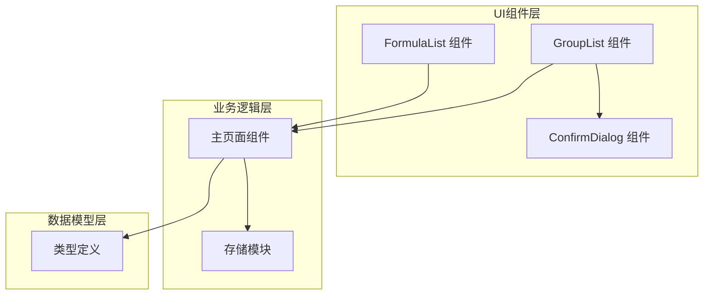
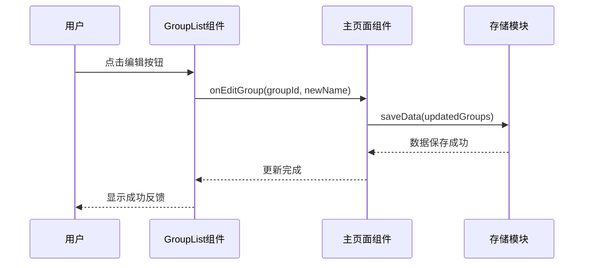
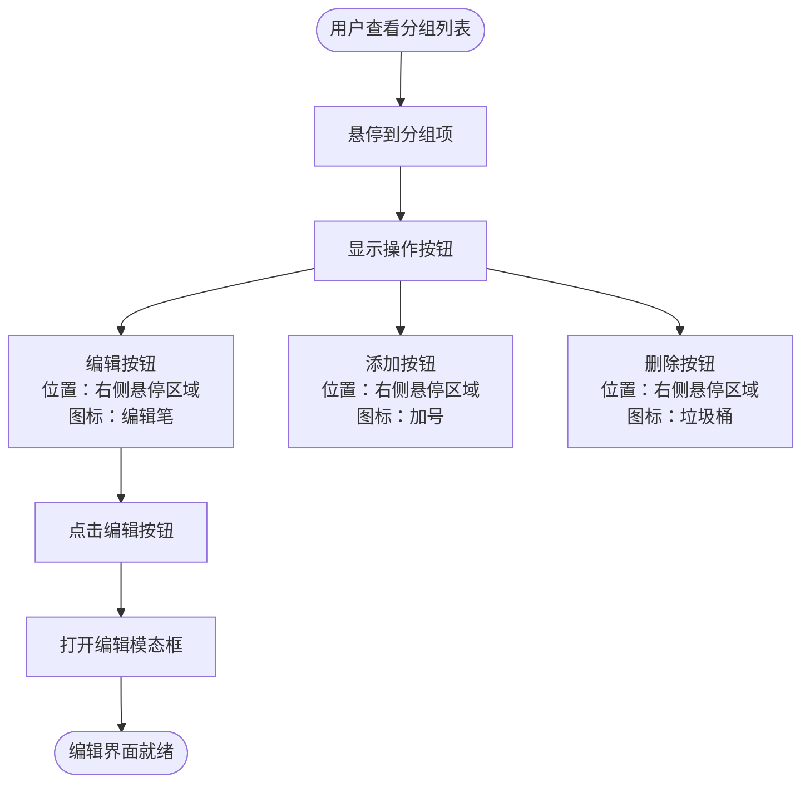
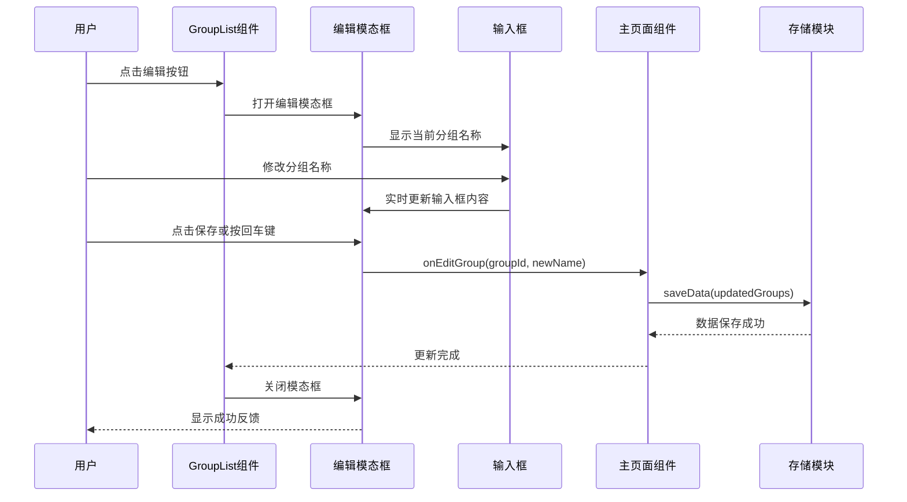
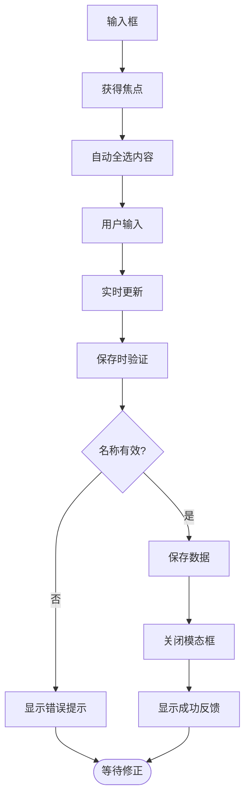
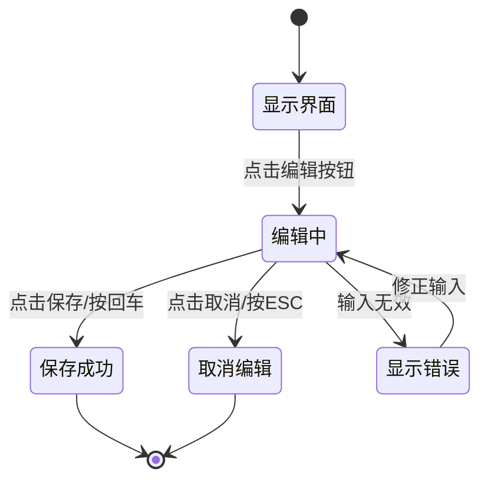
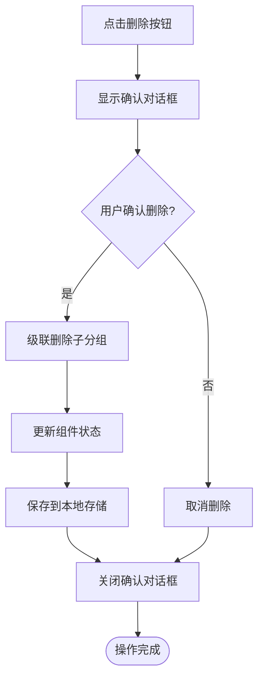
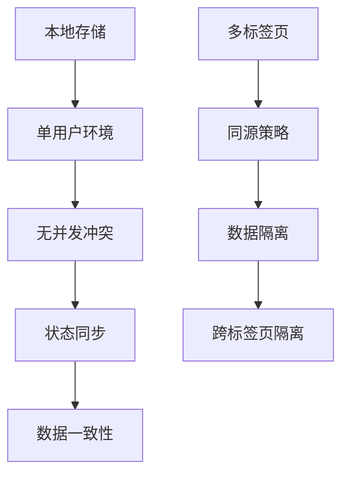
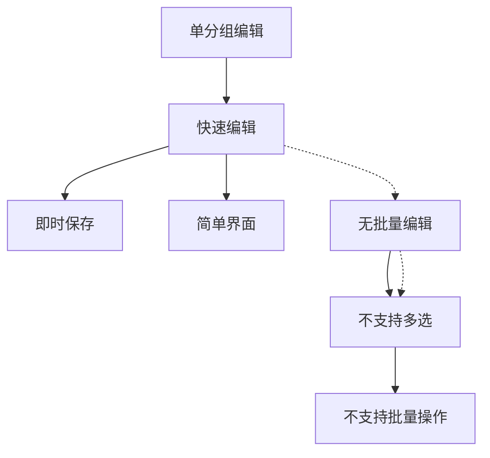
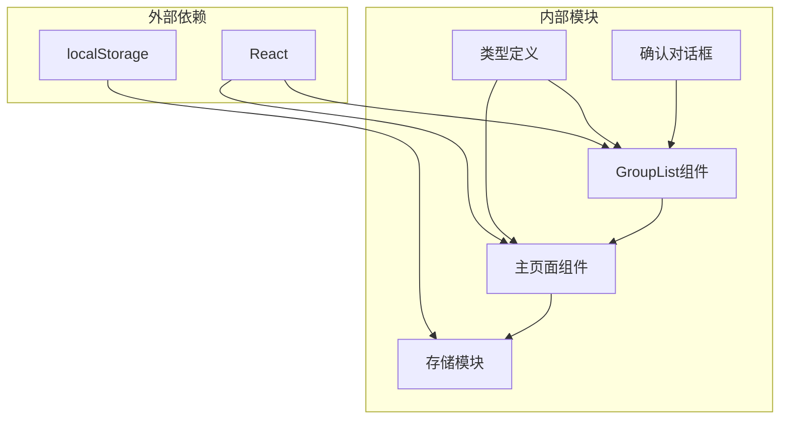

# 分组编辑

<cite>
**本文档引用的文件**
- [GroupList.tsx](file://src/components/GroupList.tsx)
- [page.tsx](file://src/app/page.tsx)
- [types.ts](file://src/lib/types.ts)
- [storage.ts](file://src/lib/storage.ts)
- [ConfirmDialog.tsx](file://src/components/ConfirmDialog.tsx)
- [FormulaList.tsx](file://src/components/FormulaList.tsx)
</cite>

## 目录
1. [简介](#简介)
2. [项目结构](#项目结构)
3. [核心组件](#核心组件)
4. [架构概览](#架构概览)
5. [详细组件分析](#详细组件分析)
6. [依赖关系分析](#依赖关系分析)
7. [性能考虑](#性能考虑)
8. [故障排除指南](#故障排除指南)
9. [结论](#结论)

## 简介
本指南详细说明了分组编辑功能的完整操作流程，包括通过编辑按钮进入编辑模式的方法、编辑图标的位置和触发方式、分组名称修改的完整流程、输入框使用、实时验证、保存操作、键盘快捷键支持（回车键保存）、编辑界面的交互细节（取消编辑、错误提示、成功反馈）、编辑权限控制和并发编辑处理机制，以及批量编辑和快速编辑的功能限制。

## 项目结构
分组编辑功能主要涉及以下文件：
- 分组列表组件：负责显示分组树、提供编辑入口和删除确认
- 主页面组件：负责数据状态管理、分组编辑逻辑和持久化
- 类型定义：定义分组和公式的数据结构
- 存储模块：负责本地数据的读取和保存
- 确认对话框组件：提供删除等危险操作的确认机制

**图表来源**
- [GroupList.tsx:1-294](file://src/components/GroupList.tsx#L1-L294)
- [page.tsx:14-798](file://src/app/page.tsx#L14-L798)
- [storage.ts:1-50](file://src/lib/storage.ts#L1-L50)
- [types.ts:44-51](file://src/lib/types.ts#L44-L51)

**章节来源**
- [GroupList.tsx:1-294](file://src/components/GroupList.tsx#L1-L294)
- [page.tsx:14-798](file://src/app/page.tsx#L14-L798)
- [storage.ts:1-50](file://src/lib/storage.ts#L1-L50)
- [types.ts:44-51](file://src/lib/types.ts#L44-L51)

## 核心组件
分组编辑功能的核心由以下组件构成：

### GroupList 组件
- 负责渲染分组树形结构
- 提供编辑、删除、添加子分组等操作入口
- 实现分组名称编辑的模态框
- 管理分组展开/折叠状态

### 主页面组件 (page.tsx)
- 维护全局状态：分组列表、选中分组、URL同步等
- 实现分组编辑的具体逻辑
- 负责数据的持久化存储
- 处理分组删除的级联操作

### 类型定义 (types.ts)
- 定义 FormulaGroup 接口，包含分组的基本属性
- 支持父子分组关系的层级结构

**章节来源**
- [GroupList.tsx:7-23](file://src/components/GroupList.tsx#L7-L23)
- [page.tsx:20-52](file://src/app/page.tsx#L20-L52)
- [types.ts:44-51](file://src/lib/types.ts#L44-L51)

## 架构概览
分组编辑采用组件化架构，通过 props 传递数据和回调函数，实现清晰的职责分离。

**图表来源**
- [GroupList.tsx:57-61](file://src/components/GroupList.tsx#L57-L61)
- [page.tsx:199-205](file://src/app/page.tsx#L199-L205)
- [storage.ts:17-25](file://src/lib/storage.ts#L17-L25)

## 详细组件分析

### 编辑按钮和图标系统
分组列表中的每个分组项都包含三个操作按钮，其中编辑按钮位于右侧悬停区域：

**图表来源**
- [GroupList.tsx:152-187](file://src/components/GroupList.tsx#L152-L187)
- [GroupList.tsx:165-175](file://src/components/GroupList.tsx#L165-L175)

编辑按钮的触发方式：
- 鼠标悬停到分组项右侧区域
- 点击编辑图标（编辑笔形状）
- 事件会阻止冒泡，确保不影响分组选择

**章节来源**
- [GroupList.tsx:152-187](file://src/components/GroupList.tsx#L152-L187)

### 分组名称编辑流程
完整的编辑流程包括以下步骤：

**图表来源**
- [GroupList.tsx:57-70](file://src/components/GroupList.tsx#L57-L70)
- [GroupList.tsx:249-277](file://src/components/GroupList.tsx#L249-L277)
- [page.tsx:199-205](file://src/app/page.tsx#L199-L205)

编辑流程的关键实现点：
1. **状态管理**：组件内部维护 `editingGroup` 和 `editName` 状态
2. **模态框控制**：通过 `isEditModalOpen` 控制编辑界面的显示
3. **实时验证**：保存前进行非空验证
4. **数据持久化**：调用 `saveData` 函数保存到本地存储

**章节来源**
- [GroupList.tsx:24-31](file://src/components/GroupList.tsx#L24-L31)
- [GroupList.tsx:63-70](file://src/components/GroupList.tsx#L63-L70)
- [page.tsx:199-205](file://src/app/page.tsx#L199-L205)

### 输入框使用和实时验证
编辑界面的输入框具有以下特性：

**图表来源**
- [GroupList.tsx:249-260](file://src/components/GroupList.tsx#L249-L260)
- [GroupList.tsx:63-70](file://src/components/GroupList.tsx#L63-L70)

输入框的交互细节：
- **自动聚焦**：打开模态框时自动获得焦点
- **实时更新**：onChange 事件实时更新状态
- **键盘支持**：支持回车键快速保存
- **验证规则**：保存前检查名称是否为空

**章节来源**
- [GroupList.tsx:249-260](file://src/components/GroupList.tsx#L249-L260)
- [GroupList.tsx:253-257](file://src/components/GroupList.tsx#L253-L257)

### 键盘快捷键支持
编辑界面支持多种键盘快捷键：

| 快捷键 | 功能 | 触发条件 |
|--------|------|----------|
| Enter | 保存编辑 | 在输入框中按下回车键 |
| Escape | 取消编辑 | 在任何地方按下ESC键 |
| Tab | 切换焦点 | 在按钮之间切换 |

**章节来源**
- [GroupList.tsx:253-257](file://src/components/GroupList.tsx#L253-L257)

### 编辑界面交互细节
编辑界面提供了完整的用户交互体验：

**图表来源**
- [GroupList.tsx:262-277](file://src/components/GroupList.tsx#L262-L277)

交互细节包括：
- **取消编辑**：点击取消按钮或按ESC键
- **错误提示**：输入验证失败时的视觉反馈
- **成功反馈**：保存成功后的界面状态更新
- **模态框遮罩**：点击背景区域可关闭编辑界面

**章节来源**
- [GroupList.tsx:262-277](file://src/components/GroupList.tsx#L262-L277)

### 删除确认机制
删除分组时需要二次确认，防止误操作：

**图表来源**
- [GroupList.tsx:72-81](file://src/components/GroupList.tsx#L72-L81)
- [page.tsx:178-197](file://src/app/page.tsx#L178-L197)

删除机制的特点：
- **级联删除**：删除分组时同时删除所有子分组
- **确认对话框**：防止误删重要数据
- **状态同步**：删除后自动清除选中状态

**章节来源**
- [GroupList.tsx:72-81](file://src/components/GroupList.tsx#L72-L81)
- [page.tsx:178-197](file://src/app/page.tsx#L178-L197)

### 权限控制和并发编辑
系统采用基于浏览器的本地存储机制，具有以下特点：

**图表来源**
- [storage.ts:17-25](file://src/lib/storage.ts#L17-L25)

权限和并发控制机制：
- **单用户限制**：仅支持单用户操作
- **本地存储**：数据存储在浏览器本地
- **无并发冲突**：同一时间只能有一个编辑者
- **状态同步**：组件状态与本地存储保持同步

**章节来源**
- [storage.ts:17-25](file://src/lib/storage.ts#L17-L25)

### 批量编辑和快速编辑限制
系统目前不支持批量编辑功能，仅提供单个分组的快速编辑：

**图表来源**
- [GroupList.tsx:57-61](file://src/components/GroupList.tsx#L57-L61)

功能限制说明：
- **单分组编辑**：每次只能编辑一个分组
- **快速编辑**：通过编辑按钮快速进入编辑模式
- **无批量操作**：不支持同时编辑多个分组
- **无多选功能**：分组列表不支持多选操作

**章节来源**
- [GroupList.tsx:57-61](file://src/components/GroupList.tsx#L57-L61)

## 依赖关系分析

**图表来源**
- [GroupList.tsx:1-5](file://src/components/GroupList.tsx#L1-L5)
- [page.tsx:10-12](file://src/app/page.tsx#L10-L12)
- [storage.ts:1-3](file://src/lib/storage.ts#L1-L3)

依赖关系特点：
- **轻量级依赖**：仅依赖 React 和浏览器 API
- **单向数据流**：数据从主页面组件流向子组件
- **松耦合设计**：组件间通过 props 通信
- **纯函数存储**：存储模块提供简单的 CRUD 操作

**章节来源**
- [GroupList.tsx:1-5](file://src/components/GroupList.tsx#L1-L5)
- [page.tsx:10-12](file://src/app/page.tsx#L10-L12)
- [storage.ts:1-3](file://src/lib/storage.ts#L1-L3)

## 性能考虑
分组编辑功能在性能方面的优化措施：

1. **虚拟滚动**：分组列表使用虚拟滚动技术，支持大量分组的高效渲染
2. **状态最小化**：仅在必要时更新组件状态
3. **事件委托**：使用事件委托减少事件处理器数量
4. **懒加载**：模态框采用懒加载方式，只在需要时渲染
5. **内存管理**：及时清理不再使用的状态和事件监听器

## 故障排除指南

### 常见问题及解决方案

**问题1：编辑按钮无法点击**
- 检查分组项是否正确渲染
- 确认鼠标悬停区域是否可见
- 验证事件绑定是否正常工作

**问题2：编辑内容无法保存**
- 检查输入框是否为空
- 确认网络连接是否正常
- 验证浏览器存储权限设置

**问题3：删除操作无效**
- 确认确认对话框是否正确显示
- 检查级联删除逻辑是否执行
- 验证状态更新是否同步

**问题4：数据丢失**
- 检查本地存储是否正常工作
- 确认数据持久化函数是否调用
- 验证浏览器兼容性

**章节来源**
- [GroupList.tsx:63-70](file://src/components/GroupList.tsx#L63-L70)
- [page.tsx:199-205](file://src/app/page.tsx#L199-L205)
- [storage.ts:17-25](file://src/lib/storage.ts#L17-L25)

## 结论
分组编辑功能提供了简洁高效的分组管理体验。通过直观的编辑按钮、完善的键盘快捷键支持、实时验证机制和友好的用户反馈，用户可以轻松地管理和组织公式分组。虽然目前不支持批量编辑和多用户并发操作，但基于本地存储的设计确保了数据的安全性和一致性。未来可以考虑扩展批量编辑功能和多用户协作能力，以满足更复杂的应用场景需求。