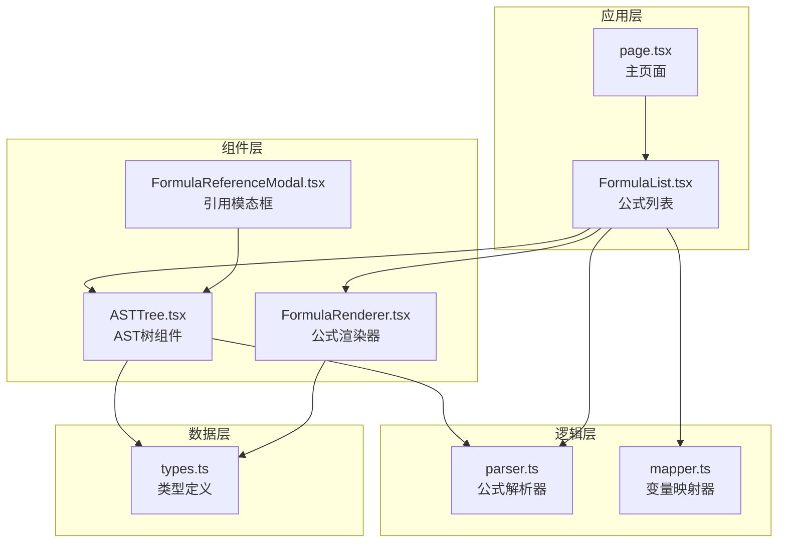
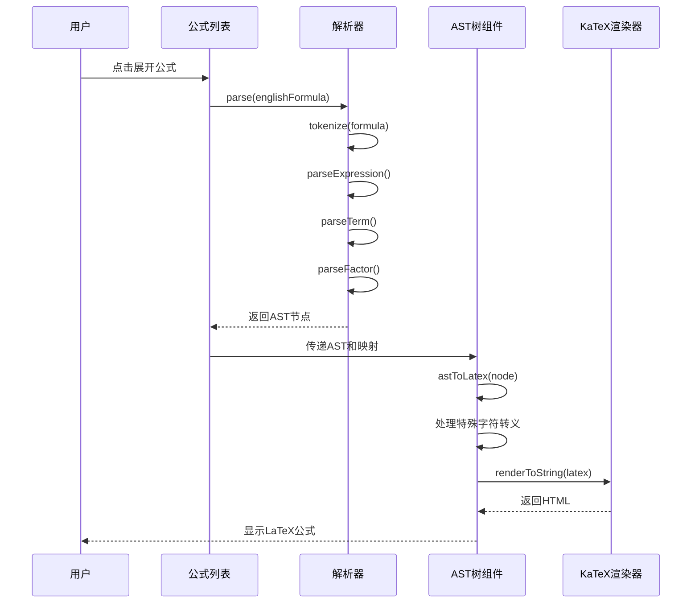
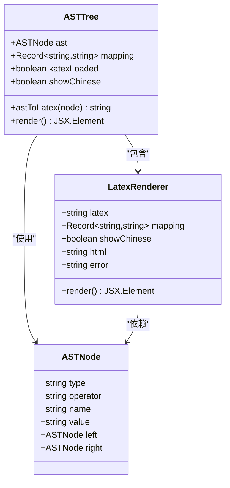
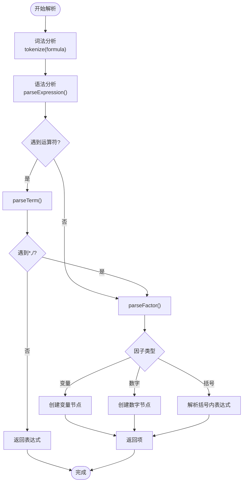
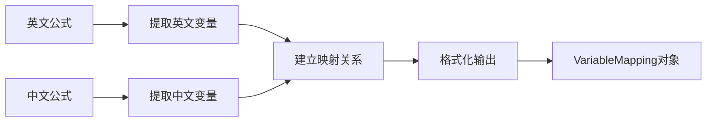
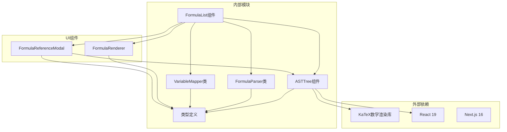

# AST树可视化

<cite>
**本文档引用的文件**
- [ASTTree.tsx](file://src/components/ASTTree.tsx)
- [parser.ts](file://src/lib/parser.ts)
- [types.ts](file://src/lib/types.ts)
- [FormulaList.tsx](file://src/components/FormulaList.tsx)
- [FormulaRenderer.tsx](file://src/components/FormulaRenderer.tsx)
- [FormulaReferenceModal.tsx](file://src/components/FormulaReferenceModal.tsx)
- [mapper.ts](file://src/lib/mapper.ts)
- [page.tsx](file://src/app/page.tsx)
</cite>

## 更新摘要
**变更内容**
- 增强了LaTeX输出的特殊字符处理，特别是下划线字符的转义机制
- 改进了变量映射展示功能，增加了变量说明面板
- 优化了AST树组件的LaTeX转换算法，增强了双语言支持
- 完善了错误处理和用户反馈机制

## 目录
1. [简介](#简介)
2. [项目结构](#项目结构)
3. [核心组件](#核心组件)
4. [架构概览](#架构概览)
5. [详细组件分析](#详细组件分析)
6. [依赖关系分析](#依赖关系分析)
7. [性能考虑](#性能考虑)
8. [故障排除指南](#故障排除指南)
9. [结论](#结论)

## 简介

AST树可视化功能是本项目的核心特性之一，它允许用户以图形化的方式理解和分析公式表达式的内部结构。通过将抽象语法树（Abstract Syntax Tree）转换为LaTeX格式并在网页上渲染，用户可以直观地看到公式的层次结构、运算符优先级以及变量之间的关系。

本功能基于递归下降解析器构建，支持基本的数学运算符（+、-、*、/、^），能够正确处理括号优先级和运算符结合性。通过KaTeX数学渲染引擎，复杂的数学表达式可以以专业的数学符号形式显示。

**更新** 增强了对特殊字符（特别是下划线）的处理能力，改进了LaTeX输出的质量和准确性。

## 项目结构

该项目采用模块化设计，AST树可视化功能主要分布在以下文件中：

**图表来源**
- [page.tsx:1-800](file://src/app/page.tsx#L1-L800)
- [FormulaList.tsx:1-387](file://src/components/FormulaList.tsx#L1-L387)
- [ASTTree.tsx:1-191](file://src/components/ASTTree.tsx#L1-L191)

**章节来源**
- [page.tsx:1-800](file://src/app/page.tsx#L1-L800)
- [FormulaList.tsx:1-387](file://src/components/FormulaList.tsx#L1-L387)

## 核心组件

### ASTTree 组件

ASTTree组件是整个可视化系统的核心，负责将解析后的AST节点转换为LaTeX格式并进行渲染。该组件具有以下关键特性：

- **动态LaTeX渲染**：使用KaTeX引擎实时渲染数学表达式
- **双语言支持**：支持英文和中文变量显示切换
- **智能括号处理**：根据运算符优先级自动添加必要的括号
- **特殊字符转义**：增强的LaTeX转义机制，特别是下划线字符处理
- **响应式设计**：适配不同屏幕尺寸的显示需求
- **变量映射展示**：提供详细的变量说明面板

**更新** 新增了专门的变量映射说明功能，用户可以清楚地看到每个变量的中英文对应关系。

### 公式解析器

FormulaParser类实现了递归下降解析算法，能够准确解析数学表达式并构建对应的AST结构：

- **词法分析**：将输入字符串分解为Token序列
- **语法分析**：根据运算符优先级构建正确的AST结构
- **错误处理**：提供详细的语法错误信息
- **括号匹配**：支持多种括号类型的正确处理

### 变量映射器

VariableMapper类负责建立英文变量与中文变量之间的对应关系：

- **变量提取**：从公式字符串中识别和提取变量
- **映射创建**：建立一对一的变量对应关系
- **格式化输出**：提供结构化的映射数据格式

**章节来源**
- [ASTTree.tsx:1-191](file://src/components/ASTTree.tsx#L1-L191)
- [parser.ts:1-178](file://src/lib/parser.ts#L1-L178)
- [mapper.ts:1-89](file://src/lib/mapper.ts#L1-L89)

## 架构概览

AST树可视化系统的整体架构采用分层设计，确保了良好的模块化和可维护性：

**图表来源**
- [FormulaList.tsx:169-192](file://src/components/FormulaList.tsx#L169-L192)
- [parser.ts:12-22](file://src/lib/parser.ts#L12-L22)
- [ASTTree.tsx:27-61](file://src/components/ASTTree.tsx#L27-L61)

系统的关键流程包括：
1. 用户在公式列表中选择要查看的公式
2. 组件触发解析器对英文公式进行语法分析
3. 解析器构建AST树结构并返回给调用方
4. ASTTree组件将AST转换为LaTeX格式，处理特殊字符转义
5. KaTeX引擎渲染LaTeX为最终的可视化结果
6. 显示变量映射说明面板

**章节来源**
- [FormulaList.tsx:1-387](file://src/components/FormulaList.tsx#L1-L387)
- [parser.ts:1-178](file://src/lib/parser.ts#L1-L178)

## 详细组件分析

### ASTTree 组件深度分析

ASTTree组件采用了函数式组件的设计模式，结合React Hooks实现了完整的状态管理和生命周期控制：

**图表来源**
- [ASTTree.tsx:6-112](file://src/components/ASTTree.tsx#L6-L112)
- [types.ts:6-13](file://src/lib/types.ts#L6-L13)

#### 核心实现原理

1. **LaTeX转换算法**：组件实现了递归的astToLatex函数，根据不同节点类型生成相应的LaTeX代码
2. **运算符优先级处理**：通过检查子节点的运算符类型和优先级，自动添加必要的括号
3. **双语言支持机制**：利用映射表将英文变量替换为对应的中文变量
4. **动态资源加载**：在运行时动态加载KaTeX CSS样式文件
5. **特殊字符转义**：增强的下划线转义机制，确保LaTeX输出的正确性

**更新** 新增了专门的变量映射说明功能，在英文模式下显示详细的变量对应关系。

#### 节点类型处理策略

| 节点类型 | 处理方式 | LaTeX输出示例 |
|---------|---------|---------------|
| variable | 包装在\text{}中，处理下划线转义 | `\text{变量\_名}` |
| number | 直接输出数值 | `123` |
| operator | 根据运算符类型生成相应LaTeX | `a + b` 或 `\frac{a}{b}` |

**章节来源**
- [ASTTree.tsx:27-61](file://src/components/ASTTree.tsx#L27-L61)

### 公式解析器工作流程

FormulaParser类实现了经典的递归下降解析算法，遵循自顶向下的语法分析原则：

**图表来源**
- [parser.ts:78-176](file://src/lib/parser.ts#L78-L176)

#### 语法分析规则

解析器遵循以下优先级规则：
1. **括号优先级最高**：括号内的表达式优先计算
2. **乘除运算优先于加减**：`a + b * c` 等价于 `a + (b * c)`
3. **左结合性**：相同优先级的运算符从左到右计算

**章节来源**
- [parser.ts:78-176](file://src/lib/parser.ts#L78-L176)

### 变量映射系统

VariableMapper提供了完整的变量映射功能，确保中英文变量的一致性：

**图表来源**
- [mapper.ts:52-70](file://src/lib/mapper.ts#L52-L70)

#### 映射算法特点

1. **变量识别准确性**：使用正则表达式精确识别变量名
2. **去重处理**：确保每个变量只映射一次
3. **容错机制**：当中文变量数量不足时标注"（未定义）"
4. **有序输出**：保持变量在公式中的出现顺序

**章节来源**
- [mapper.ts:52-70](file://src/lib/mapper.ts#L52-L70)

## 依赖关系分析

AST树可视化功能涉及多个组件间的复杂依赖关系：

**图表来源**
- [ASTTree.tsx:1-191](file://src/components/ASTTree.tsx#L1-L191)
- [FormulaList.tsx:1-387](file://src/components/FormulaList.tsx#L1-L387)

### 关键依赖关系

1. **ASTTree → KaTeX**：运行时动态加载KaTeX样式和脚本
2. **FormulaList → Parser/Mapper**：在展开公式时触发解析和映射
3. **FormulaReferenceModal → ASTTree**：支持嵌套的公式引用查看
4. **各组件 → Types**：统一的数据类型定义和接口规范

**章节来源**
- [ASTTree.tsx:15-24](file://src/components/ASTTree.tsx#L15-L24)
- [FormulaList.tsx:169-192](file://src/components/FormulaList.tsx#L169-L192)

## 性能考虑

AST树可视化功能在设计时充分考虑了性能优化：

### 渲染性能优化

1. **懒加载机制**：只有在用户展开公式时才进行解析和渲染
2. **状态缓存**：组件状态在收起时自动清理，避免内存泄漏
3. **条件渲染**：使用条件判断避免不必要的DOM更新
4. **特殊字符处理优化**：高效的字符串转义和替换算法

### 解析性能优化

1. **单次解析**：每个展开的公式只解析一次，结果缓存到组件状态
2. **增量更新**：只有当公式内容或展开状态改变时才重新解析
3. **错误边界**：解析失败时提供友好的错误提示，避免应用崩溃

### 内存管理

1. **自动清理**：组件卸载时自动清理定时器和事件监听器
2. **资源释放**：动态加载的CSS样式在组件卸载时自动移除
3. **状态重置**：组件收起时重置所有状态，防止状态污染

## 故障排除指南

### 常见问题及解决方案

#### AST树不显示

**可能原因**：
1. 公式解析失败
2. LaTeX渲染错误
3. KaTeX资源加载失败
4. 特殊字符转义问题

**解决步骤**：
1. 检查公式语法是否正确
2. 查看浏览器控制台是否有错误信息
3. 确认网络连接正常，KaTeX CDN可访问
4. 验证变量名中是否包含特殊字符

#### 变量映射不正确

**可能原因**：
1. 中英文公式变量数量不匹配
2. 变量命名不规范
3. 公式中包含特殊字符
4. 下划线字符处理问题

**解决步骤**：
1. 确保中英文变量一一对应
2. 检查变量是否包含数字开头
3. 避免使用保留字符作为变量名
4. 确认下划线字符正确转义

#### 性能问题

**症状**：页面响应缓慢，特别是展开多个公式时

**解决方案**：
1. 减少同时展开的公式数量
2. 简化复杂的数学表达式
3. 清理浏览器缓存和Cookie
4. 检查网络连接速度

**更新** 新增了特殊字符转义问题的排查步骤。

**章节来源**
- [ASTTree.tsx:124-142](file://src/components/ASTTree.tsx#L124-L142)
- [FormulaList.tsx:169-192](file://src/components/FormulaList.tsx#L169-L192)

## 结论

AST树可视化功能通过精心设计的架构和实现，成功地将复杂的数学表达式转换为直观的图形界面。该系统的主要优势包括：

1. **准确性**：基于标准的递归下降解析算法，确保语法分析的正确性
2. **易用性**：提供直观的双语言切换和清晰的视觉层次
3. **扩展性**：模块化设计便于功能扩展和维护
4. **性能**：懒加载和状态管理确保良好的用户体验
5. **可靠性**：完善的错误处理和用户反馈机制

**更新** 新版本显著增强了特殊字符处理能力和变量映射展示功能，提高了LaTeX输出的质量和用户的使用体验。

通过这个功能，用户可以深入理解公式的内部结构，分析运算符优先级，识别变量关系，并进行有效的公式调试和验证。这对于教育、学术研究和工程应用都具有重要的价值。

未来可以考虑的功能增强包括：
- 支持更复杂的数学函数
- 添加交互式编辑功能
- 实现多级折叠显示
- 提供导出功能
- 增强特殊字符处理能力