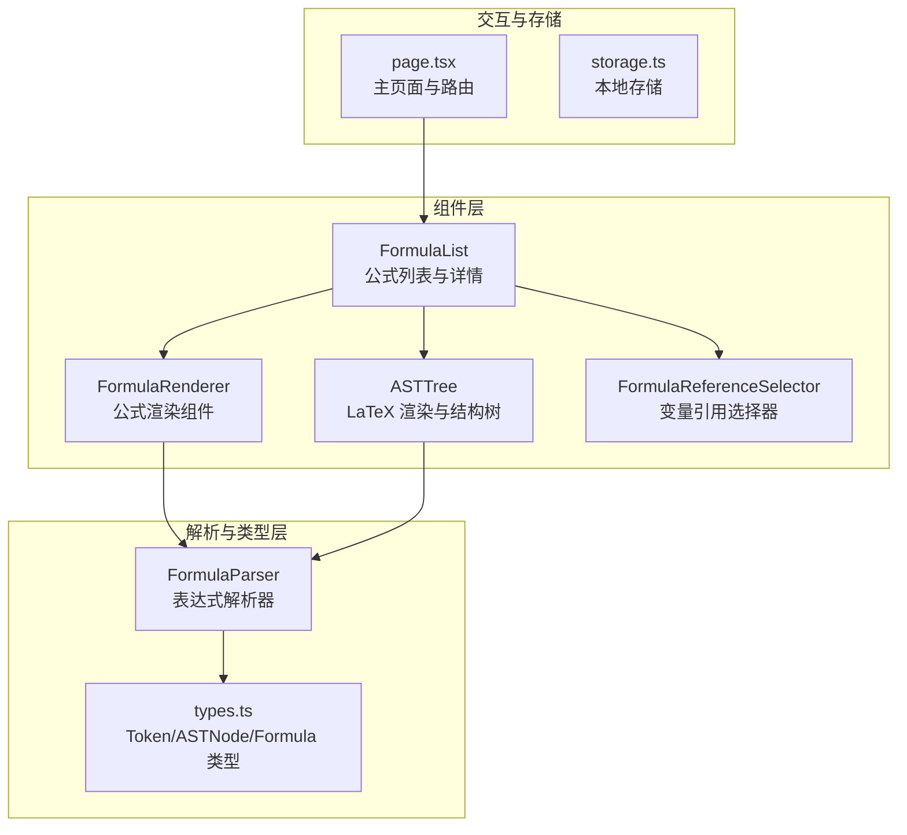
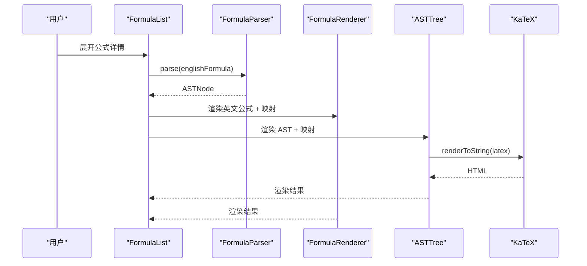
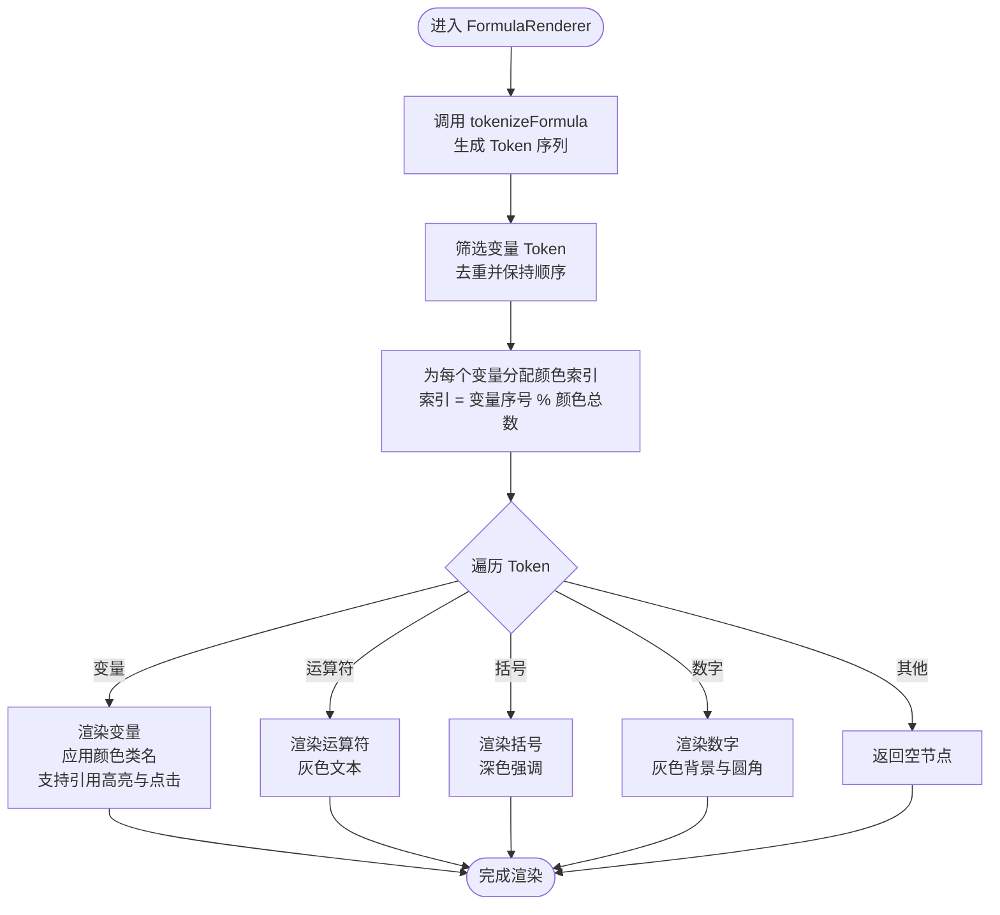
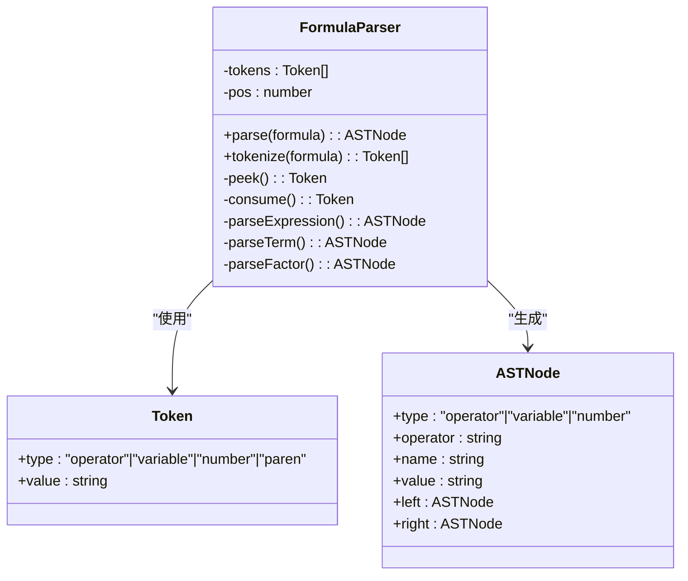
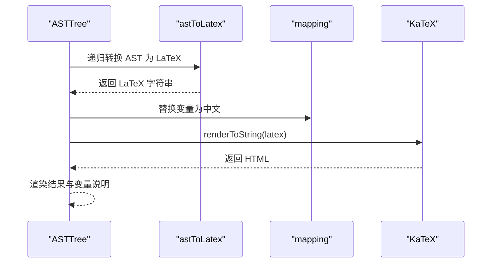
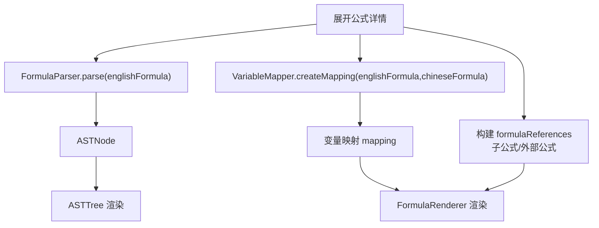
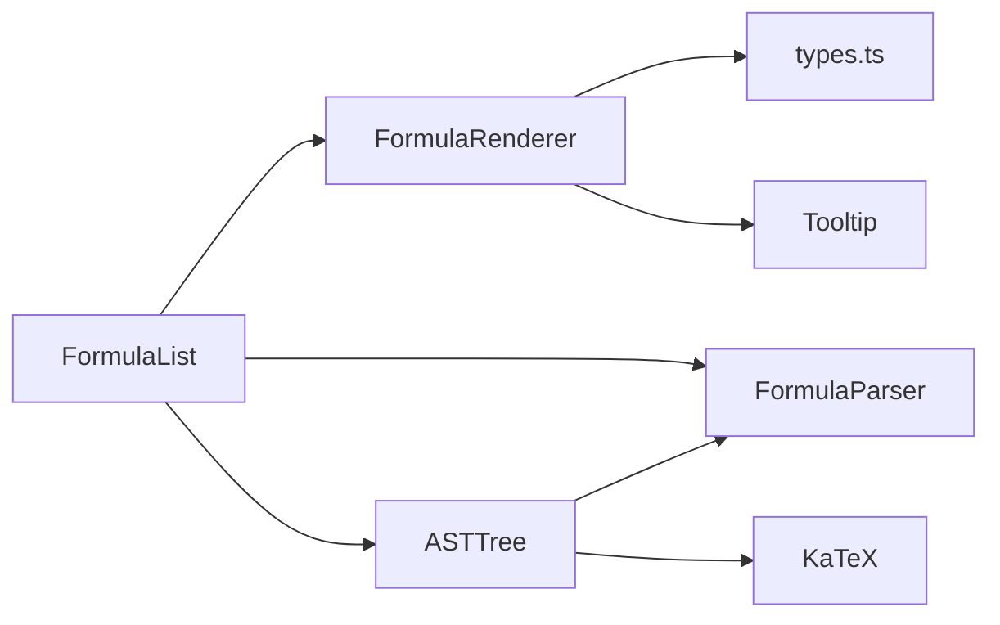

# 公式渲染

<cite>
**本文档引用的文件**
- [FormulaRenderer.tsx](file://src/components/FormulaRenderer.tsx)
- [parser.ts](file://src/lib/parser.ts)
- [types.ts](file://src/lib/types.ts)
- [ASTTree.tsx](file://src/components/ASTTree.tsx)
- [FormulaList.tsx](file://src/components/FormulaList.tsx)
- [FormulaReferenceSelector.tsx](file://src/components/FormulaReferenceSelector.tsx)
- [page.tsx](file://src/app/page.tsx)
- [storage.ts](file://src/lib/storage.ts)
- [package.json](file://package.json)
</cite>

## 目录
1. [简介](#简介)
2. [项目结构](#项目结构)
3. [核心组件](#核心组件)
4. [架构总览](#架构总览)
5. [详细组件分析](#详细组件分析)
6. [依赖关系分析](#依赖关系分析)
7. [性能考虑](#性能考虑)
8. [故障排查指南](#故障排查指南)
9. [结论](#结论)
10. [附录](#附录)

## 简介
本指南面向使用公式渲染功能的用户与开发者，详细说明LaTeX数学公式渲染的工作原理与实现机制。文档涵盖以下内容：
- FormulaRenderer 组件的渲染流程：公式解析、令牌化、颜色分配与样式应用
- 变量颜色编码系统：颜色索引计算与变量到颜色的映射策略
- 各类公式元素的渲染样式规范：变量（彩色背景与文字）、运算符（灰色显示）、括号（深色强调）、数字（灰色背景）
- 使用示例与最佳实践：复杂表达式与特殊字符的处理建议
- 性能优化技巧与兼容性注意事项

## 项目结构
该项目采用 Next.js 应用结构，公式渲染功能主要由以下模块组成：
- 组件层：FormulaRenderer（公式展示）、ASTTree（LaTeX 渲染与结构树）、FormulaList（公式列表与展开详情）
- 解析与类型层：parser（表达式解析为AST）、types（Token/ASTNode/Formula 类型定义）
- 交互与存储：FormulaReferenceSelector（变量引用选择器）、storage（本地存储封装）、page（主页面与路由）

**图表来源**
- [FormulaRenderer.tsx:1-169](file://src/components/FormulaRenderer.tsx#L1-L169)
- [ASTTree.tsx:1-179](file://src/components/ASTTree.tsx#L1-L179)
- [FormulaList.tsx:1-387](file://src/components/FormulaList.tsx#L1-L387)
- [FormulaReferenceSelector.tsx:1-132](file://src/components/FormulaReferenceSelector.tsx#L1-L132)
- [parser.ts:1-159](file://src/lib/parser.ts#L1-L159)
- [types.ts:1-51](file://src/lib/types.ts#L1-L51)
- [page.tsx:1-798](file://src/app/page.tsx#L1-L798)
- [storage.ts:1-50](file://src/lib/storage.ts#L1-L50)

**章节来源**
- [FormulaRenderer.tsx:1-169](file://src/components/FormulaRenderer.tsx#L1-L169)
- [ASTTree.tsx:1-179](file://src/components/ASTTree.tsx#L1-L179)
- [FormulaList.tsx:1-387](file://src/components/FormulaList.tsx#L1-L387)
- [FormulaReferenceSelector.tsx:1-132](file://src/components/FormulaReferenceSelector.tsx#L1-L132)
- [parser.ts:1-159](file://src/lib/parser.ts#L1-L159)
- [types.ts:1-51](file://src/lib/types.ts#L1-L51)
- [page.tsx:1-798](file://src/app/page.tsx#L1-L798)
- [storage.ts:1-50](file://src/lib/storage.ts#L1-L50)

## 核心组件
本节聚焦公式渲染的核心组件与职责：
- FormulaRenderer：负责将字符串公式转换为带样式的元素序列，包含变量颜色分配、引用高亮与点击跳转逻辑
- FormulaParser：将字符串公式解析为抽象语法树（AST），支持变量、数字与括号的优先级处理
- ASTTree：将 AST 转换为 LaTeX 字符串，并通过 KaTeX 渲染为数学公式，支持中英文切换与变量映射说明
- FormulaList：承载公式列表与展开详情，协调 FormulaRenderer 与 ASTTree 的渲染时机与数据传递
- FormulaReferenceSelector：提取公式中的变量并提供变量到公式（含子公式）的引用映射选择

**章节来源**
- [FormulaRenderer.tsx:27-116](file://src/components/FormulaRenderer.tsx#L27-L116)
- [parser.ts:3-22](file://src/lib/parser.ts#L3-L22)
- [ASTTree.tsx:11-112](file://src/components/ASTTree.tsx#L11-L112)
- [FormulaList.tsx:151-386](file://src/components/FormulaList.tsx#L151-L386)
- [FormulaReferenceSelector.tsx:14-47](file://src/components/FormulaReferenceSelector.tsx#L14-L47)

## 架构总览
公式渲染的整体流程如下：
- 用户在 FormulaList 中展开某条公式，触发解析与渲染
- FormulaList 调用 FormulaParser 对英文公式进行解析，得到 AST
- FormulaList 调用 VariableMapper（位于 mapper.ts，被 FormulaList 引入）生成变量映射
- FormulaRenderer 接收英文公式与映射，进行令牌化与颜色分配，渲染为带样式的元素
- ASTTree 接收 AST 与映射，生成 LaTeX 并通过 KaTeX 渲染，支持中英文切换

**图表来源**
- [FormulaList.tsx:169-192](file://src/components/FormulaList.tsx#L169-L192)
- [parser.ts:12-22](file://src/lib/parser.ts#L12-L22)
- [FormulaRenderer.tsx:27-116](file://src/components/FormulaRenderer.tsx#L27-L116)
- [ASTTree.tsx:120-142](file://src/components/ASTTree.tsx#L120-L142)

## 详细组件分析

### FormulaRenderer 组件
FormulaRenderer 是公式渲染的核心组件，负责：
- 将字符串公式进行令牌化（tokenizeFormula）
- 提取唯一变量并按出现顺序建立颜色索引
- 为变量分配颜色（蓝/天蓝/青/绿/靛蓝等浅色系）
- 为不同元素设置样式：变量（彩色背景与文字）、运算符（灰色）、括号（深色强调）、数字（灰色背景）
- 支持变量引用高亮与点击跳转（结合 formulaReferences 与 onFormulaReferenceClick）

**图表来源**
- [FormulaRenderer.tsx:123-168](file://src/components/FormulaRenderer.tsx#L123-L168)
- [FormulaRenderer.tsx:27-116](file://src/components/FormulaRenderer.tsx#L27-L116)

**章节来源**
- [FormulaRenderer.tsx:13-25](file://src/components/FormulaRenderer.tsx#L13-L25)
- [FormulaRenderer.tsx:27-116](file://src/components/FormulaRenderer.tsx#L27-L116)
- [FormulaRenderer.tsx:123-168](file://src/components/FormulaRenderer.tsx#L123-L168)

### FormulaParser 解析器
FormulaParser 负责将字符串公式解析为 AST，支持：
- 变量识别（字母开头，后续可跟数字）
- 数字识别
- 运算符识别（+、-、*、/）
- 括号识别（包括英文与中文括号）
- 语法校验与错误抛出（如括号不匹配、未处理字符等）

**图表来源**
- [parser.ts:3-158](file://src/lib/parser.ts#L3-L158)
- [types.ts:1-13](file://src/lib/types.ts#L1-L13)

**章节来源**
- [parser.ts:12-68](file://src/lib/parser.ts#L12-L68)
- [parser.ts:78-157](file://src/lib/parser.ts#L78-L157)
- [types.ts:1-13](file://src/lib/types.ts#L1-L13)

### ASTTree 与 LaTeX 渲染
ASTTree 将 AST 转换为 LaTeX 字符串，并通过 KaTeX 渲染为数学公式：
- 将变量包装为 \text{}，数字直接输出
- 运算符转换为 LaTeX 对应符号（+、-、\cdot、/、^ 等）
- 自动插入必要的括号以保证优先级正确
- 支持中英文切换：根据 mapping 将英文变量替换为中文变量
- 提供变量映射说明面板（仅英文模式）

**图表来源**
- [ASTTree.tsx:27-61](file://src/components/ASTTree.tsx#L27-L61)
- [ASTTree.tsx:66-73](file://src/components/ASTTree.tsx#L66-L73)
- [ASTTree.tsx:120-142](file://src/components/ASTTree.tsx#L120-L142)

**章节来源**
- [ASTTree.tsx:27-73](file://src/components/ASTTree.tsx#L27-L73)
- [ASTTree.tsx:120-178](file://src/components/ASTTree.tsx#L120-L178)

### FormulaList 与引用映射
FormulaList 在展开公式详情时：
- 调用 FormulaParser.parse 生成 AST
- 调用 VariableMapper（mapper.ts）生成变量映射
- 构建 formulaReferences：将变量映射到子公式或外部公式，支持点击跳转
- 将 mapping 传给 FormulaRenderer 与 ASTTree

**图表来源**
- [FormulaList.tsx:169-192](file://src/components/FormulaList.tsx#L169-L192)
- [FormulaList.tsx:194-228](file://src/components/FormulaList.tsx#L194-L228)
- [FormulaList.tsx:322-331](file://src/components/FormulaList.tsx#L322-L331)

**章节来源**
- [FormulaList.tsx:169-192](file://src/components/FormulaList.tsx#L169-L192)
- [FormulaList.tsx:194-228](file://src/components/FormulaList.tsx#L194-L228)
- [FormulaList.tsx:322-331](file://src/components/FormulaList.tsx#L322-L331)

### FormulaReferenceSelector 变量引用选择器
- 从英文公式中提取变量（去重）
- 提供下拉选择：可选择子公式或外部公式作为变量引用
- 支持子公式前缀 sub_ 的特殊处理
- 将选择结果回调给父组件，形成 variableFormulaMapping

**章节来源**
- [FormulaReferenceSelector.tsx:14-47](file://src/components/FormulaReferenceSelector.tsx#L14-L47)
- [FormulaReferenceSelector.tsx:115-131](file://src/components/FormulaReferenceSelector.tsx#L115-L131)

## 依赖关系分析
- 组件间依赖
  - FormulaList 依赖 FormulaRenderer、ASTTree、FormulaParser、VariableMapper
  - ASTTree 依赖 KaTeX（动态加载）
  - FormulaRenderer 依赖 Tooltip（UI 组件）
- 外部依赖
  - KaTeX：LaTeX 渲染
  - TailwindCSS：样式类名
  - Radix UI：Tooltip 等 UI 组件

**图表来源**
- [FormulaRenderer.tsx:3-4](file://src/components/FormulaRenderer.tsx#L3-L4)
- [FormulaList.tsx:5-9](file://src/components/FormulaList.tsx#L5-L9)
- [ASTTree.tsx:1-4](file://src/components/ASTTree.tsx#L1-L4)
- [package.json:24-33](file://package.json#L24-L33)

**章节来源**
- [package.json:15-33](file://package.json#L15-L33)

## 性能考虑
- 令牌化与颜色分配
  - tokenizeFormula 采用线性扫描，时间复杂度 O(n)，空间复杂度 O(n)
  - 变量颜色分配通过取模实现，避免重复计算颜色索引
- AST 转 LaTeX
  - astToLatex 递归遍历 AST，时间复杂度 O(n)，其中 n 为 AST 节点数
  - mapping 替换使用正则全局替换，注意变量数量较多时的性能影响
- 渲染优化
  - ASTTree 中 KaTeX 渲染在客户端异步执行，避免阻塞主线程
  - FormulaList 使用 useMemo 缓存变量提取与公式列表，减少重复计算
- 内存与状态
  - FormulaList 在收起时清理 AST 与 mapping，避免内存泄漏
  - FormulaRenderer 仅在展开时进行令牌化与颜色分配

**章节来源**
- [FormulaRenderer.tsx:123-168](file://src/components/FormulaRenderer.tsx#L123-L168)
- [ASTTree.tsx:120-142](file://src/components/ASTTree.tsx#L120-L142)
- [FormulaList.tsx:169-192](file://src/components/FormulaList.tsx#L169-L192)
- [FormulaReferenceSelector.tsx:21-34](file://src/components/FormulaReferenceSelector.tsx#L21-L34)

## 故障排查指南
- 公式解析错误
  - 现象：展开公式详情时报错“表达式解析不完整”或“括号不匹配”
  - 排查：检查英文公式是否包含非法字符、括号是否成对出现
  - 参考：[parser.ts:17-18](file://src/lib/parser.ts#L17-L18)、[parser.ts:148-149](file://src/lib/parser.ts#L148-L149)
- LaTeX 渲染失败
  - 现象：ASTTree 显示“渲染失败”
  - 排查：确认网络可访问 KaTeX CDN；检查 LaTeX 字符串是否包含不支持的命令
  - 参考：[ASTTree.tsx:134-138](file://src/components/ASTTree.tsx#L134-L138)
- 变量颜色异常
  - 现象：变量颜色不一致或超出颜色范围
  - 排查：确保变量唯一性与顺序稳定；颜色数组长度固定，超出部分会循环取模
  - 参考：[FormulaRenderer.tsx:42-45](file://src/components/FormulaRenderer.tsx#L42-L45)
- 变量引用无效
  - 现象：点击变量无反应或引用链接不显示
  - 排查：确认 variableFormulaMapping 是否正确配置；子公式需使用 sub_ 前缀
  - 参考：[FormulaList.tsx:199-228](file://src/components/FormulaList.tsx#L199-L228)

**章节来源**
- [parser.ts:17-18](file://src/lib/parser.ts#L17-L18)
- [parser.ts:148-149](file://src/lib/parser.ts#L148-L149)
- [ASTTree.tsx:134-138](file://src/components/ASTTree.tsx#L134-L138)
- [FormulaRenderer.tsx:42-45](file://src/components/FormulaRenderer.tsx#L42-L45)
- [FormulaList.tsx:199-228](file://src/components/FormulaList.tsx#L199-L228)

## 结论
本公式渲染系统通过清晰的组件分工与解析流程，实现了从字符串公式到富文本与 LaTeX 的多形态渲染。FormulaRenderer 负责直观的变量着色与交互，ASTTree 提供严谨的 LaTeX 渲染与中英文切换能力。配合 FormulaList 的引用映射与 FormulaReferenceSelector 的变量选择，用户可以高效地管理与展示复杂的数学表达式。

## 附录

### 使用示例与最佳实践
- 基本用法
  - 在 FormulaList 中展开公式，即可看到 FormulaRenderer 与 ASTTree 的渲染结果
  - 通过 FormulaReferenceSelector 为变量绑定引用公式，提升可读性与可追溯性
- 复杂表达式处理
  - 使用括号明确优先级，避免歧义
  - 合理拆分子公式并通过子公式引用减少重复
- 特殊字符与变量命名
  - 变量命名建议使用字母开头，后续可跟数字
  - 中文括号与英文括号均可识别，但建议统一风格
- 样式一致性
  - 变量使用彩色背景与文字，突出语义
  - 运算符与数字采用灰色或浅色背景，降低视觉噪音
  - 括号使用深色强调，增强层级感

### 兼容性注意事项
- 浏览器环境
  - KaTeX 通过 CDN 加载，需确保网络可达
  - Tooltip 组件依赖 Radix UI，确保版本兼容
- 字体与排版
  - 使用 TailwindCSS 类名控制样式，确保在不同设备上的一致性
- 数据持久化
  - 使用 localStorage 存储分组与公式数据，注意数据格式与版本迁移

**章节来源**
- [FormulaList.tsx:322-331](file://src/components/FormulaList.tsx#L322-L331)
- [FormulaReferenceSelector.tsx:14-47](file://src/components/FormulaReferenceSelector.tsx#L14-L47)
- [ASTTree.tsx:16-24](file://src/components/ASTTree.tsx#L16-L24)
- [storage.ts:1-25](file://src/lib/storage.ts#L1-L25)