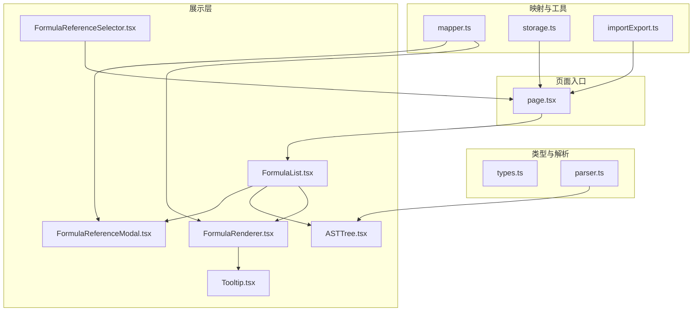
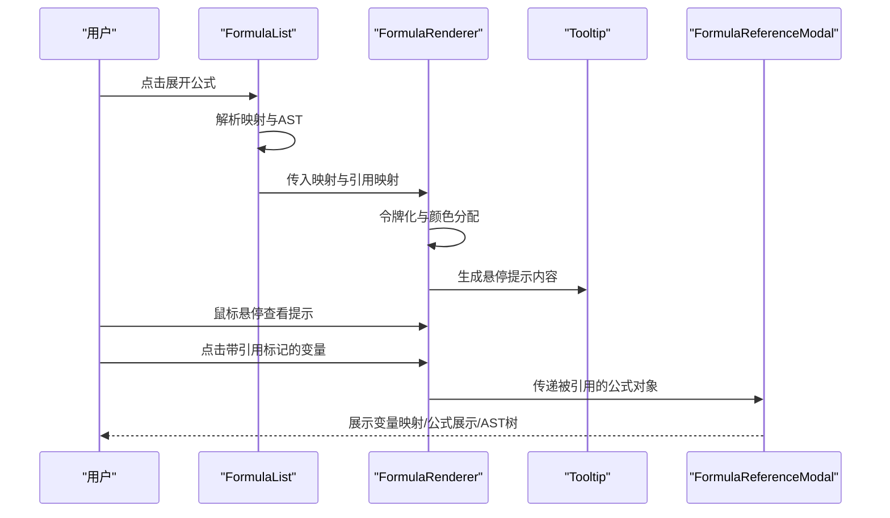
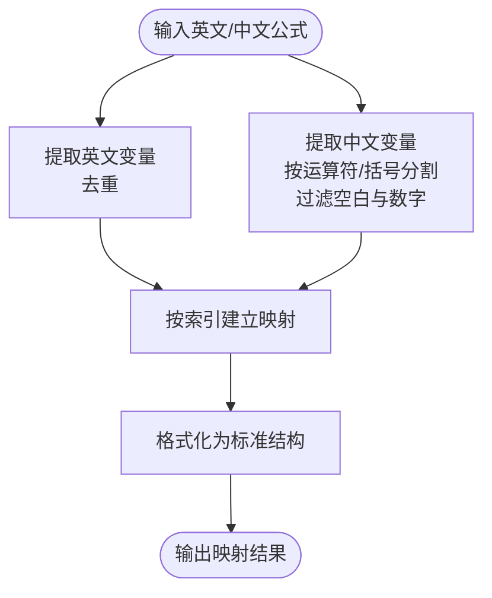
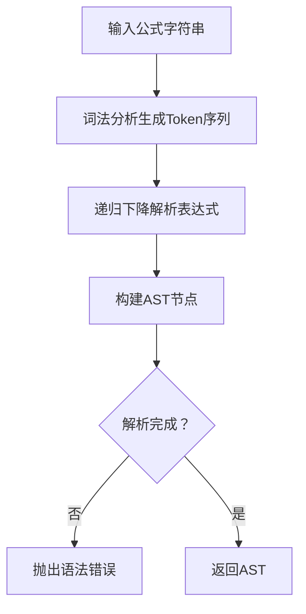
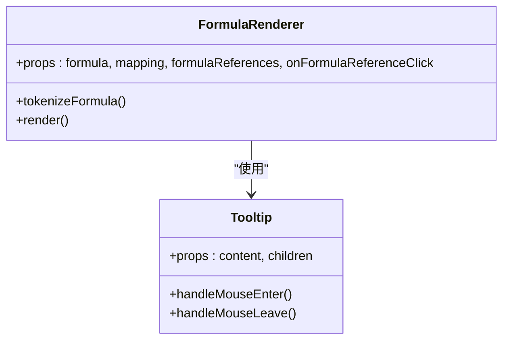
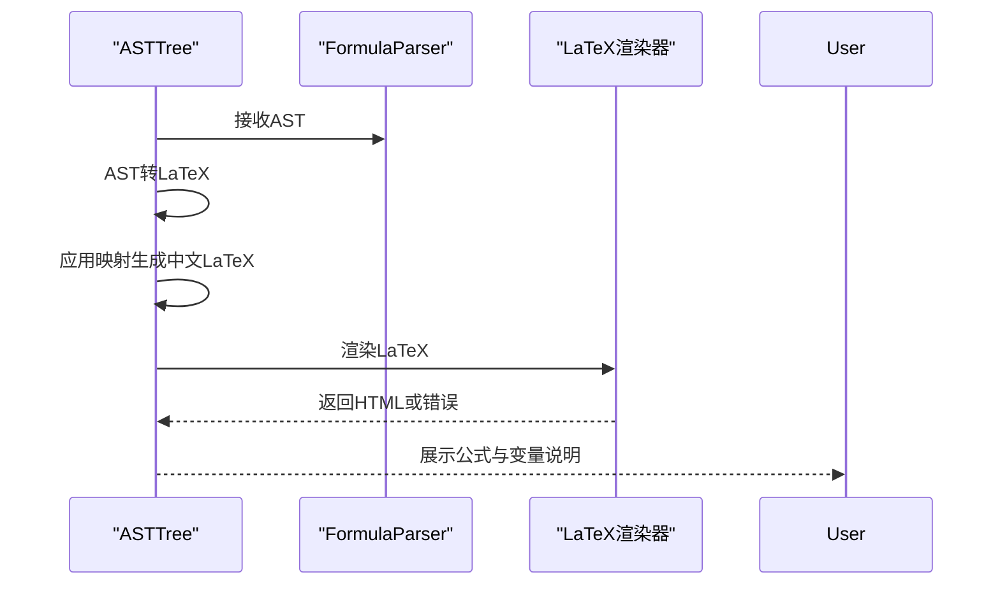
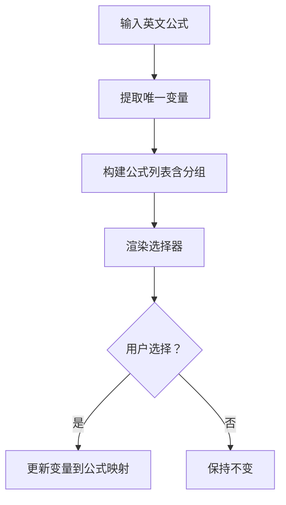
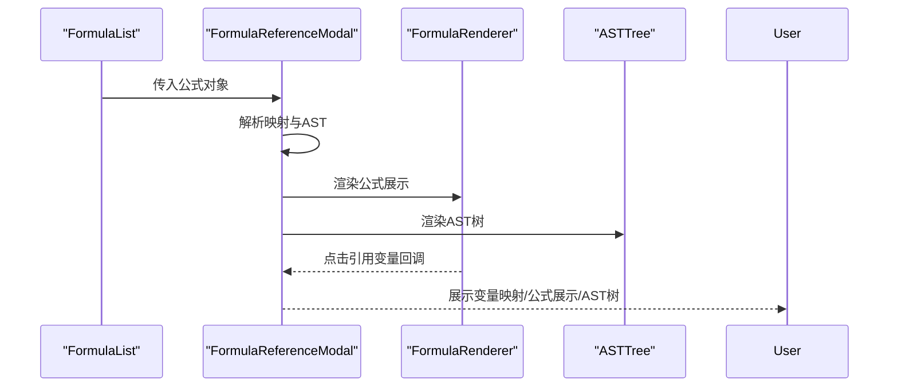
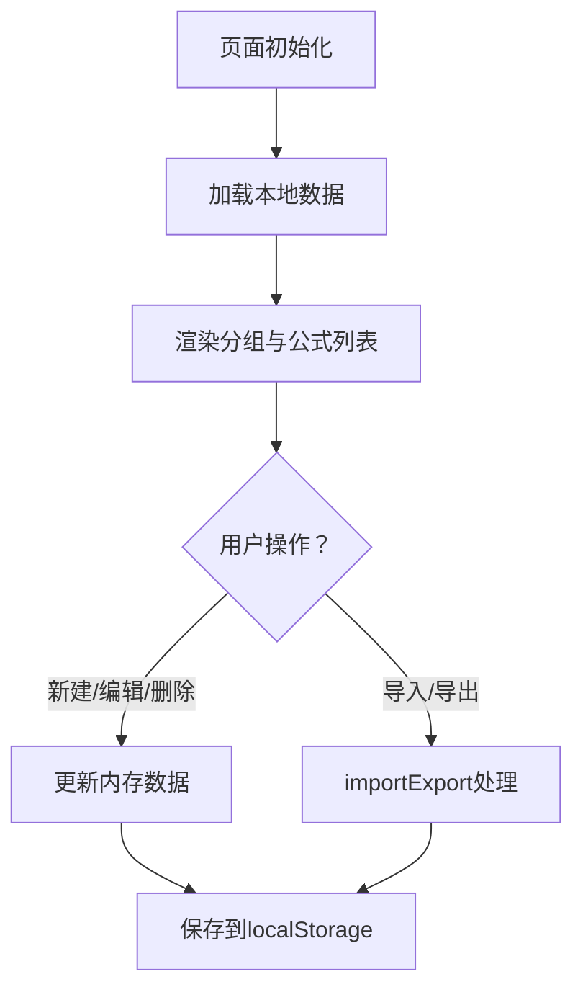
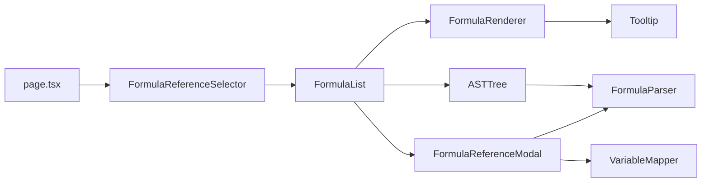

# 变量映射展示

<cite>
**本文档引用的文件**
- [mapper.ts](file://src/lib/mapper.ts)
- [types.ts](file://src/lib/types.ts)
- [FormulaReferenceModal.tsx](file://src/components/FormulaReferenceModal.tsx)
- [FormulaReferenceSelector.tsx](file://src/components/FormulaReferenceSelector.tsx)
- [FormulaRenderer.tsx](file://src/components/FormulaRenderer.tsx)
- [ASTTree.tsx](file://src/components/ASTTree.tsx)
- [parser.ts](file://src/lib/parser.ts)
- [FormulaList.tsx](file://src/components/FormulaList.tsx)
- [page.tsx](file://src/app/page.tsx)
- [storage.ts](file://src/lib/storage.ts)
- [importExport.ts](file://src/lib/importExport.ts)
- [Tooltip.tsx](file://src/components/Tooltip.tsx)
</cite>

## 目录
1. [简介](#简介)
2. [项目结构](#项目结构)
3. [核心组件](#核心组件)
4. [架构总览](#架构总览)
5. [详细组件分析](#详细组件分析)
6. [依赖关系分析](#依赖关系分析)
7. [性能考虑](#性能考虑)
8. [故障排查指南](#故障排查指南)
9. [结论](#结论)
10. [附录](#附录)

## 简介
本指南面向使用“变量映射展示”功能的用户，详细说明变量映射系统的工作原理与使用方法，包括：
- 中文变量到英文变量的双向映射机制
- 颜色编码系统的设计思路与实现方法
- 变量引用检测功能（内部子公式与外部公式引用）
- 交互式高亮效果（鼠标悬停提示、点击跳转、引用标记）
- 变量映射的查看与编辑流程
- 在公式理解和维护中的作用与最佳实践

## 项目结构
该应用采用 Next.js 客户端组件架构，核心逻辑集中在以下模块：
- 类型定义与解析：types.ts、parser.ts
- 变量映射：mapper.ts
- 展示组件：FormulaRenderer.tsx、ASTTree.tsx、FormulaReferenceModal.tsx、FormulaReferenceSelector.tsx、Tooltip.tsx
- 列表与页面：FormulaList.tsx、page.tsx
- 数据持久化与导入导出：storage.ts、importExport.ts

图表来源
- [types.ts:1-51](file://src/lib/types.ts#L1-L51)
- [parser.ts:1-159](file://src/lib/parser.ts#L1-L159)
- [mapper.ts:1-89](file://src/lib/mapper.ts#L1-L89)
- [FormulaRenderer.tsx:1-169](file://src/components/FormulaRenderer.tsx#L1-L169)
- [ASTTree.tsx:1-179](file://src/components/ASTTree.tsx#L1-L179)
- [FormulaReferenceModal.tsx:1-180](file://src/components/FormulaReferenceModal.tsx#L1-L180)
- [FormulaReferenceSelector.tsx:1-132](file://src/components/FormulaReferenceSelector.tsx#L1-L132)
- [FormulaList.tsx:1-387](file://src/components/FormulaList.tsx#L1-L387)
- [page.tsx:1-798](file://src/app/page.tsx#L1-L798)
- [storage.ts:1-50](file://src/lib/storage.ts#L1-L50)
- [importExport.ts:1-120](file://src/lib/importExport.ts#L1-L120)

章节来源
- [page.tsx:1-798](file://src/app/page.tsx#L1-L798)

## 核心组件
- VariableMapper：负责从英文与中文公式中提取变量，建立双向映射关系，并格式化输出。
- FormulaParser：将英文公式解析为抽象语法树（AST），用于结构树展示与 LaTeX 渲染。
- FormulaRenderer：将公式令牌化，按变量分配颜色，支持悬停提示与点击跳转引用。
- ASTTree：基于 AST 生成 LaTeX，支持中英文切换与变量说明。
- FormulaReferenceModal：在独立模态框中展示变量映射、公式展示与 AST 结构树。
- FormulaReferenceSelector：为变量选择引用的子公式或外部公式，支持子公式与外部公式区分。
- FormulaList：公式列表项，展开时解析映射、构建引用映射并渲染展示区域。
- Tooltip：通用悬浮提示组件，用于变量映射信息展示。

章节来源
- [mapper.ts:1-89](file://src/lib/mapper.ts#L1-L89)
- [parser.ts:1-159](file://src/lib/parser.ts#L1-L159)
- [FormulaRenderer.tsx:1-169](file://src/components/FormulaRenderer.tsx#L1-L169)
- [ASTTree.tsx:1-179](file://src/components/ASTTree.tsx#L1-L179)
- [FormulaReferenceModal.tsx:1-180](file://src/components/FormulaReferenceModal.tsx#L1-L180)
- [FormulaReferenceSelector.tsx:1-132](file://src/components/FormulaReferenceSelector.tsx#L1-L132)
- [FormulaList.tsx:1-387](file://src/components/FormulaList.tsx#L1-L387)
- [Tooltip.tsx:1-48](file://src/components/Tooltip.tsx#L1-L48)

## 架构总览
变量映射展示的整体工作流如下：
- 用户在页面中选择公式，FormulaList 展开对应条目并解析映射与 AST。
- FormulaRenderer 对变量进行颜色编码与引用标记，并通过 Tooltip 提供悬停信息。
- 点击带引用标记的变量，触发 FormulaReferenceModal 展示被引用的子公式或外部公式。
- FormulaReferenceSelector 允许用户为变量配置引用关系，区分内部子公式（以 sub_ 前缀）与外部公式。

图表来源
- [FormulaList.tsx:151-387](file://src/components/FormulaList.tsx#L151-L387)
- [FormulaRenderer.tsx:27-169](file://src/components/FormulaRenderer.tsx#L27-L169)
- [Tooltip.tsx:10-48](file://src/components/Tooltip.tsx#L10-L48)
- [FormulaReferenceModal.tsx:18-180](file://src/components/FormulaReferenceModal.tsx#L18-L180)

## 详细组件分析

### 变量映射系统（VariableMapper）
- 提取英文变量：使用正则匹配单词边界，去重后返回英文变量列表。
- 提取中文变量：按中英文运算符与括号分割，过滤空白与纯数字，保留唯一中文变量。
- 创建映射：按索引将英文变量与中文变量一一对应，多余中文变量标记为“（未定义）”。
- 格式化输出：将映射转换为标准结构，便于渲染与引用。

图表来源
- [mapper.ts:4-87](file://src/lib/mapper.ts#L4-L87)

章节来源
- [mapper.ts:1-89](file://src/lib/mapper.ts#L1-L89)
- [types.ts:15-25](file://src/lib/types.ts#L15-L25)

### 公式解析与 AST（FormulaParser）
- 词法分析：识别变量、数字、运算符与括号，支持中英文括号。
- 语法分析：递归下降解析表达式、项与因子，构建 AST。
- 错误处理：对不完整表达式、括号不匹配与未知字符抛出明确错误。

图表来源
- [parser.ts:12-159](file://src/lib/parser.ts#L12-L159)

章节来源
- [parser.ts:1-159](file://src/lib/parser.ts#L1-L159)

### 公式展示与颜色编码（FormulaRenderer）
- 令牌化：将公式分解为变量、运算符、括号与数字。
- 颜色分配：根据变量首次出现顺序分配颜色，确保同一变量颜色一致。
- 引用标记：若变量存在引用，则显示引用标记并改变样式。
- 交互行为：悬停显示 Tooltip；点击引用变量跳转至被引用的子公式或外部公式。
- 颜色方案：预定义一组浅蓝/青/水绿/薄荷等色调，保证可读性与区分度。

图表来源
- [FormulaRenderer.tsx:27-169](file://src/components/FormulaRenderer.tsx#L27-L169)
- [Tooltip.tsx:10-48](file://src/components/Tooltip.tsx#L10-L48)

章节来源
- [FormulaRenderer.tsx:1-169](file://src/components/FormulaRenderer.tsx#L1-L169)
- [Tooltip.tsx:1-48](file://src/components/Tooltip.tsx#L1-L48)

### AST 树与 LaTeX 渲染（ASTTree）
- AST 转 LaTeX：将 AST 节点转换为 LaTeX 表达式，支持加减乘除与幂运算。
- 中英文切换：通过映射将英文变量替换为中文变量，动态切换显示。
- 错误处理：异步加载 KaTeX 并捕获渲染异常，回退显示原始文本。

图表来源
- [ASTTree.tsx:27-179](file://src/components/ASTTree.tsx#L27-L179)
- [parser.ts:12-22](file://src/lib/parser.ts#L12-L22)

章节来源
- [ASTTree.tsx:1-179](file://src/components/ASTTree.tsx#L1-L179)

### 变量引用检测与选择（FormulaReferenceSelector）
- 变量提取：从英文公式中提取唯一变量集合。
- 引用选择：为每个变量提供下拉框，可选择子公式（以 sub_ 前缀）或外部公式。
- 显示选中结果：右侧显示当前选中公式的英文公式片段，便于核对。

图表来源
- [FormulaReferenceSelector.tsx:21-132](file://src/components/FormulaReferenceSelector.tsx#L21-L132)

章节来源
- [FormulaReferenceSelector.tsx:1-132](file://src/components/FormulaReferenceSelector.tsx#L1-L132)

### 弹窗展示（FormulaReferenceModal）
- 解析与映射：在弹窗打开时解析当前公式映射与 AST。
- 引用映射：区分内部子公式（以 sub_ 前缀）与外部公式，构建引用映射。
- 嵌套引用：点击引用变量可直接打开被引用的子公式或外部公式弹窗。

图表来源
- [FormulaReferenceModal.tsx:18-180](file://src/components/FormulaReferenceModal.tsx#L18-L180)
- [FormulaList.tsx:361-387](file://src/components/FormulaList.tsx#L361-L387)

章节来源
- [FormulaReferenceModal.tsx:1-180](file://src/components/FormulaReferenceModal.tsx#L1-L180)

### 列表与页面（FormulaList、page.tsx）
- 列表渲染：支持搜索、分组筛选与展开/折叠。
- 数据持久化：本地存储加载与保存，支持分组与公式增删改。
- 导入导出：支持文件与 URL 导入，JSON 导出。

图表来源
- [page.tsx:85-134](file://src/app/page.tsx#L85-L134)
- [storage.ts:5-25](file://src/lib/storage.ts#L5-L25)
- [importExport.ts:12-120](file://src/lib/importExport.ts#L12-L120)

章节来源
- [FormulaList.tsx:1-387](file://src/components/FormulaList.tsx#L1-L387)
- [page.tsx:1-798](file://src/app/page.tsx#L1-L798)
- [storage.ts:1-50](file://src/lib/storage.ts#L1-L50)
- [importExport.ts:1-120](file://src/lib/importExport.ts#L1-L120)

## 依赖关系分析
- 组件耦合：
  - FormulaList 依赖 FormulaRenderer、ASTTree、FormulaReferenceModal。
  - FormulaRenderer 依赖 Tooltip。
  - ASTTree 依赖 FormulaParser 与 KaTeX。
  - FormulaReferenceModal 依赖 VariableMapper、FormulaParser、ASTTree。
- 数据流：
  - 页面通过 FormulaReferenceSelector 更新变量到公式映射，FormulaList 与 FormulaReferenceModal 读取该映射。
  - VariableMapper 与 FormulaParser 为展示层提供基础数据。

图表来源
- [FormulaList.tsx:151-387](file://src/components/FormulaList.tsx#L151-L387)
- [FormulaRenderer.tsx:27-169](file://src/components/FormulaRenderer.tsx#L27-L169)
- [ASTTree.tsx:27-179](file://src/components/ASTTree.tsx#L27-L179)
- [FormulaReferenceModal.tsx:18-180](file://src/components/FormulaReferenceModal.tsx#L18-L180)
- [FormulaReferenceSelector.tsx:14-132](file://src/components/FormulaReferenceSelector.tsx#L14-L132)
- [page.tsx:703-710](file://src/app/page.tsx#L703-L710)

章节来源
- [FormulaList.tsx:1-387](file://src/components/FormulaList.tsx#L1-L387)
- [FormulaReferenceModal.tsx:1-180](file://src/components/FormulaReferenceModal.tsx#L1-L180)
- [FormulaReferenceSelector.tsx:1-132](file://src/components/FormulaReferenceSelector.tsx#L1-L132)
- [FormulaRenderer.tsx:1-169](file://src/components/FormulaRenderer.tsx#L1-L169)
- [ASTTree.tsx:1-179](file://src/components/ASTTree.tsx#L1-L179)
- [parser.ts:1-159](file://src/lib/parser.ts#L1-L159)
- [mapper.ts:1-89](file://src/lib/mapper.ts#L1-L89)
- [page.tsx:1-798](file://src/app/page.tsx#L1-L798)

## 性能考虑
- 计算优化：
  - FormulaReferenceSelector 使用 useMemo 缓存变量提取与公式列表，避免重复计算。
  - FormulaRenderer 仅在变量顺序变化时重建颜色索引。
- 渲染优化：
  - FormulaList 仅在展开时解析映射与 AST，收起时清理状态，减少不必要的渲染。
  - ASTTree 动态加载 KaTeX 样式，避免阻塞首屏。
- 数据持久化：
  - 本地存储一次性加载与保存，避免频繁 IO。

章节来源
- [FormulaReferenceSelector.tsx:21-34](file://src/components/FormulaReferenceSelector.tsx#L21-L34)
- [FormulaRenderer.tsx:35-45](file://src/components/FormulaRenderer.tsx#L35-L45)
- [FormulaList.tsx:169-192](file://src/components/FormulaList.tsx#L169-L192)
- [ASTTree.tsx:15-24](file://src/components/ASTTree.tsx#L15-L24)
- [storage.ts:5-25](file://src/lib/storage.ts#L5-L25)

## 故障排查指南
- 解析错误：
  - 现象：公式展示区域出现“解析错误”提示。
  - 原因：FormulaParser 抛出语法错误（如括号不匹配、未知字符）。
  - 处理：检查公式字符串是否包含非法字符或括号未闭合。
- 引用失效：
  - 现象：变量引用标记显示但点击无反应。
  - 原因：引用的公式 ID 不存在于当前数据集中。
  - 处理：在 FormulaReferenceSelector 中重新选择正确的子公式或外部公式。
- 颜色不一致：
  - 现象：同一变量颜色在不同公式中不一致。
  - 原因：FormulaRenderer 按变量首次出现顺序分配颜色。
  - 处理：调整变量命名顺序或统一变量命名，确保一致性。
- LaTeX 渲染失败：
  - 现象：AST 树区域显示“渲染失败”。
  - 原因：KaTeX 加载或渲染异常。
  - 处理：检查网络连接与 CDN 可用性，稍后重试。

章节来源
- [FormulaList.tsx:170-192](file://src/components/FormulaList.tsx#L170-L192)
- [FormulaReferenceModal.tsx:30-45](file://src/components/FormulaReferenceModal.tsx#L30-L45)
- [ASTTree.tsx:124-142](file://src/components/ASTTree.tsx#L124-L142)
- [parser.ts:17-18](file://src/lib/parser.ts#L17-L18)

## 结论
变量映射展示功能通过清晰的映射机制、直观的颜色编码与交互式高亮，显著提升了公式理解与维护效率。借助内部子公式与外部公式的引用能力，用户可以快速定位变量来源，形成完整的知识关联网络。建议在实际使用中：
- 统一变量命名规范，确保颜色与引用的一致性。
- 合理组织分组与子公式，提升引用的可发现性。
- 利用导入导出功能备份与迁移数据，保障协作与版本管理。

## 附录

### 使用步骤速览
- 查看变量映射：
  - 在公式列表中展开任意公式，查看“变量映射”区域。
- 颜色编码与悬停：
  - 变量按首次出现顺序着色，悬停 Tooltip 显示中文变量或引用信息。
- 点击跳转引用：
  - 带引用标记的变量可点击跳转至被引用的子公式或外部公式。
- 编辑变量映射：
  - 在“创建/编辑公式”对话框中使用“变量引用公式映射”选择器，为变量绑定子公式或外部公式。
- 导入导出：
  - 通过页面顶部“数据管理”菜单进行导入与导出，支持文件与 URL 方式。

章节来源
- [FormulaList.tsx:294-358](file://src/components/FormulaList.tsx#L294-L358)
- [FormulaReferenceModal.tsx:112-176](file://src/components/FormulaReferenceModal.tsx#L112-L176)
- [FormulaReferenceSelector.tsx:39-47](file://src/components/FormulaReferenceSelector.tsx#L39-L47)
- [page.tsx:477-542](file://src/app/page.tsx#L477-L542)
- [importExport.ts:12-120](file://src/lib/importExport.ts#L12-L120)