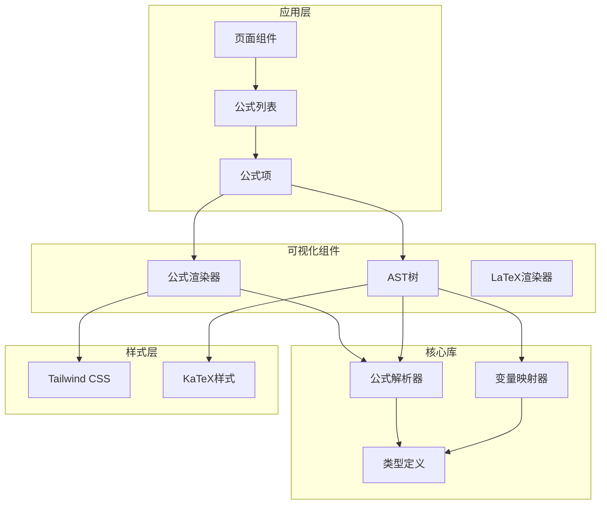
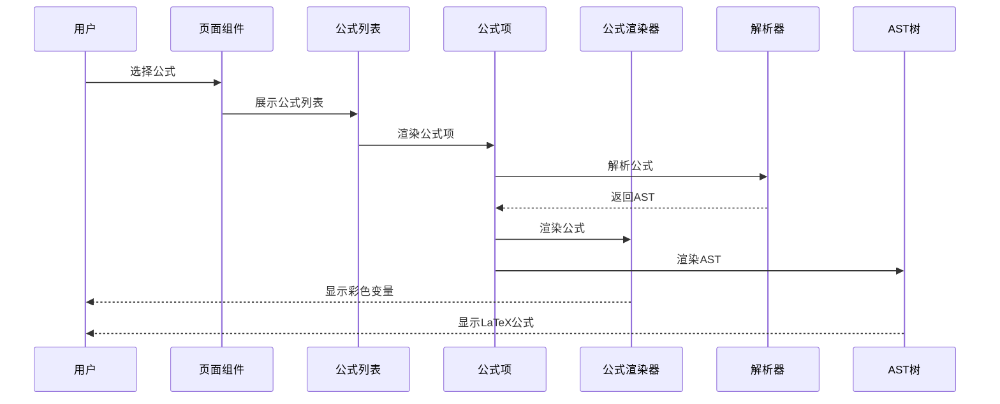
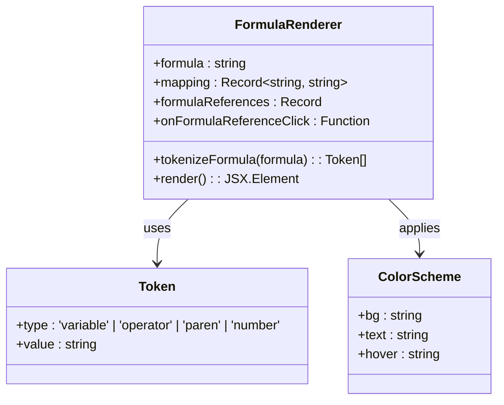
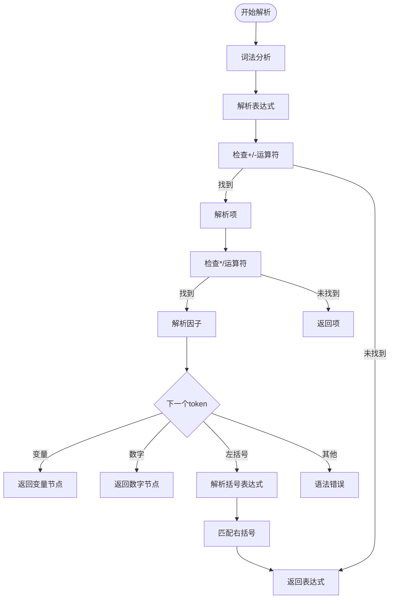
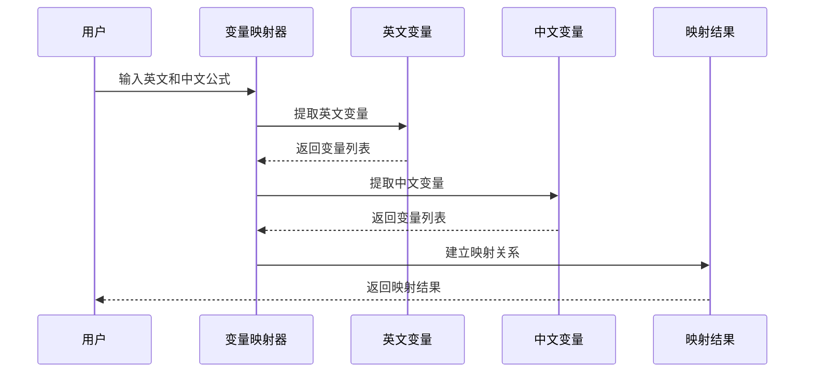
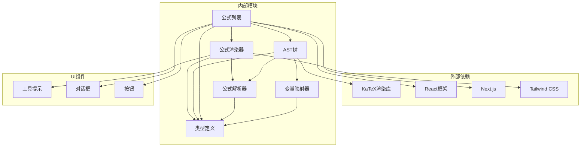

# 可视化展示

<cite>
**本文档引用的文件**
- [FormulaRenderer.tsx](file://src/components/FormulaRenderer.tsx)
- [ASTTree.tsx](file://src/components/ASTTree.tsx)
- [FormulaList.tsx](file://src/components/FormulaList.tsx)
- [FormulaReferenceModal.tsx](file://src/components/FormulaReferenceModal.tsx)
- [parser.ts](file://src/lib/parser.ts)
- [mapper.ts](file://src/lib/mapper.ts)
- [types.ts](file://src/lib/types.ts)
- [page.tsx](file://src/app/page.tsx)
- [package.json](file://package.json)
</cite>

## 目录
1. [简介](#简介)
2. [项目结构](#项目结构)
3. [核心组件](#核心组件)
4. [架构概览](#架构概览)
5. [详细组件分析](#详细组件分析)
6. [依赖关系分析](#依赖关系分析)
7. [性能考虑](#性能考虑)
8. [故障排除指南](#故障排除指南)
9. [结论](#结论)

## 简介

本项目是一个强大的公式可视化展示工具，提供了两种主要的可视化模式：LaTeX数学公式渲染和交互式结构树展示。该工具能够将复杂的数学公式转换为美观的LaTeX格式，并通过抽象语法树(AST)展示公式的层次结构关系。

系统的核心功能包括：
- **LaTeX数学公式渲染**：将数学表达式转换为高质量的LaTeX格式
- **交互式结构树展示**：通过AST可视化展示公式的组成关系
- **变量映射系统**：提供中英文变量对照和颜色编码
- **公式引用机制**：支持公式间的相互引用和导航
- **调试和验证工具**：帮助用户理解和验证复杂公式的结构

## 项目结构

该项目采用React + Next.js技术栈构建，具有清晰的模块化结构：



**图表来源**
- [page.tsx:1-798](file://src/app/page.tsx#L1-L798)
- [FormulaList.tsx:1-387](file://src/components/FormulaList.tsx#L1-L387)
- [FormulaRenderer.tsx:1-169](file://src/components/FormulaRenderer.tsx#L1-L169)
- [ASTTree.tsx:1-179](file://src/components/ASTTree.tsx#L1-L179)

**章节来源**
- [page.tsx:1-798](file://src/app/page.tsx#L1-L798)
- [package.json:1-48](file://package.json#L1-L48)

## 核心组件

### 公式渲染器 (FormulaRenderer)

公式渲染器负责将数学公式转换为可交互的可视化元素，支持以下特性：

- **变量颜色编码**：为每个唯一变量分配不同的蓝色色调
- **引用检测**：识别并标记公式中的引用变量
- **交互式高亮**：提供悬停和点击反馈
- **工具提示支持**：显示变量的详细信息

### AST树组件 (ASTTree)

AST树组件提供LaTeX格式的数学公式渲染，具有以下功能：

- **动态LaTeX渲染**：使用KaTeX库实时渲染数学公式
- **中英文切换**：支持英文和中文变量的显示
- **变量映射说明**：显示变量对应的中文解释
- **错误处理**：优雅处理渲染失败的情况

### 公式解析器 (FormulaParser)

基于递归下降解析算法的解析器，支持：
- **四则运算**：加、减、乘、除运算
- **括号优先级**：正确处理运算符优先级
- **变量识别**：识别数学变量
- **数字处理**：支持整数和小数

### 变量映射器 (VariableMapper)

负责变量的提取和映射：
- **英文变量提取**：从英文公式中提取变量
- **中文变量提取**：从中文公式中提取对应变量
- **双向映射**：建立中英文变量的对应关系
- **重复处理**：避免重复变量的重复映射

**章节来源**
- [FormulaRenderer.tsx:1-169](file://src/components/FormulaRenderer.tsx#L1-L169)
- [ASTTree.tsx:1-179](file://src/components/ASTTree.tsx#L1-L179)
- [parser.ts:1-159](file://src/lib/parser.ts#L1-L159)
- [mapper.ts:1-89](file://src/lib/mapper.ts#L1-L89)

## 架构概览

系统采用分层架构设计，确保各组件职责明确且易于维护：



**图表来源**
- [FormulaList.tsx:160-192](file://src/components/FormulaList.tsx#L160-L192)
- [FormulaRenderer.tsx:27-116](file://src/components/FormulaRenderer.tsx#L27-L116)
- [ASTTree.tsx:11-112](file://src/components/ASTTree.tsx#L11-L112)

系统的核心数据流包括：

1. **公式输入**：用户输入英文和中文公式
2. **变量提取**：从公式中提取变量并建立映射
3. **语法解析**：将公式转换为抽象语法树
4. **可视化渲染**：将数据转换为用户友好的界面元素

**章节来源**
- [FormulaList.tsx:1-387](file://src/components/FormulaList.tsx#L1-L387)
- [FormulaReferenceModal.tsx:1-180](file://src/components/FormulaReferenceModal.tsx#L1-L180)

## 详细组件分析

### 公式渲染器组件

公式渲染器实现了复杂的变量颜色编码系统和交互式高亮效果：



**图表来源**
- [FormulaRenderer.tsx:6-116](file://src/components/FormulaRenderer.tsx#L6-L116)
- [FormulaRenderer.tsx:118-168](file://src/components/FormulaRenderer.tsx#L118-L168)

#### 变量颜色编码系统

系统为每个唯一变量分配预定义的颜色方案，使用10种不同的蓝色色调：

| 颜色索引 | 背景色 | 文字色 | 悬停效果 |
|---------|--------|--------|----------|
| 0 | bg-blue-50 | text-blue-600 | hover:bg-blue-100 |
| 1 | bg-sky-50 | text-sky-600 | hover:bg-sky-100 |
| 2 | bg-cyan-50 | text-cyan-600 | hover:bg-cyan-100 |
| 3 | bg-teal-50 | text-teal-600 | hover:bg-teal-100 |
| 4 | bg-indigo-50 | text-indigo-600 | hover:bg-indigo-100 |
| 5 | bg-blue-100 | text-blue-700 | hover:bg-blue-200 |
| 6 | bg-sky-100 | text-sky-700 | hover:bg-sky-200 |
| 7 | bg-cyan-100 | text-cyan-700 | hover:bg-cyan-200 |
| 8 | bg-teal-100 | text-teal-700 | hover:bg-teal-200 |
| 9 | bg-indigo-100 | text-indigo-700 | hover:bg-indigo-200 |

#### 交互式高亮效果

渲染器提供多层次的交互反馈：

1. **悬停效果**：鼠标悬停时显示浅色背景
2. **点击反馈**：点击变量时触发引用事件
3. **引用标识**：被引用的变量显示特殊标记
4. **工具提示**：显示变量的详细信息

**章节来源**
- [FormulaRenderer.tsx:1-169](file://src/components/FormulaRenderer.tsx#L1-L169)

### AST树组件

AST树组件提供了LaTeX格式的数学公式渲染功能：

```mermaid
flowchart TD
Start([开始渲染]) --> ParseAST[解析AST节点]
ParseAST --> CheckType{节点类型?}
CheckType --> |variable| VarNode[变量节点<br/>\\text{变量名}]
CheckType --> |number| NumNode[数字节点<br/>数值]
CheckType --> |operator| OpNode[运算符节点]
OpNode --> LeftChild[递归处理左子树]
OpNode --> RightChild[递归处理右子树]
OpNode --> OpSwitch{运算符类型?}
OpSwitch --> |+| AddOp[加法: left + right]
OpSwitch --> |-| SubOp[减法: left - right]
OpSwitch --> |*| MulOp[乘法: left \\cdot right]
OpSwitch --> |/| DivOp[除法: \\frac{left}{right}]
OpSwitch --> |^| PowOp[幂运算: left^{right}]
VarNode --> Combine[组合LaTeX表达式]
NumNode --> Combine
AddOp --> Combine
SubOp --> Combine
MulOp --> Combine
DivOp --> Combine
PowOp --> Combine
Combine --> End([渲染完成])
```

**图表来源**
- [ASTTree.tsx:26-61](file://src/components/ASTTree.tsx#L26-L61)

#### LaTeX转换规则

系统根据运算符类型应用相应的LaTeX转换规则：

| 运算符 | LaTeX表示 | 特殊处理 |
|--------|-----------|----------|
| + | left + right | 无 |
| - | left - right | 无 |
| * | left \\cdot right | 需要括号判断 |
| / | \\frac{left}{right} | 分数格式 |
| ^ | left^{right} | 上标格式 |

#### 中英文切换机制

AST树支持动态切换中英文显示模式：

1. **英文模式**：显示英文变量名
2. **中文模式**：将英文变量替换为中文解释
3. **变量映射**：通过映射表实现变量翻译

**章节来源**
- [ASTTree.tsx:1-179](file://src/components/ASTTree.tsx#L1-L179)

### 公式解析器

公式解析器实现了标准的递归下降解析算法：



**图表来源**
- [parser.ts:78-157](file://src/lib/parser.ts#L78-L157)

#### 语法分析流程

解析器遵循标准的运算符优先级规则：

1. **因子解析**：处理变量、数字和括号表达式
2. **项解析**：处理乘法和除法运算
3. **表达式解析**：处理加法和减法运算

#### 错误处理机制

系统提供完善的错误处理：
- **语法错误**：检测意外的token类型
- **括号不匹配**：验证括号的正确配对
- **表达式完整性**：确保没有未处理的字符

**章节来源**
- [parser.ts:1-159](file://src/lib/parser.ts#L1-L159)

### 变量映射器

变量映射器负责建立中英文变量之间的对应关系：



**图表来源**
- [mapper.ts:52-89](file://src/lib/mapper.ts#L52-L89)

#### 变量提取策略

系统采用智能的变量提取算法：

1. **英文变量提取**：使用正则表达式识别变量模式
2. **中文变量提取**：基于运算符分割提取变量
3. **去重处理**：确保变量列表的唯一性
4. **序号保持**：保持变量在公式中的出现顺序

#### 映射格式化

映射结果提供多种格式化选项：
- **直接映射**：返回原始映射对象
- **数组格式**：转换为有序的映射项数组
- **统计信息**：提供映射统计和验证信息

**章节来源**
- [mapper.ts:1-89](file://src/lib/mapper.ts#L1-L89)

## 依赖关系分析

系统依赖关系清晰，各模块职责明确：



**图表来源**
- [package.json:15-34](file://package.json#L15-L34)
- [FormulaList.tsx:1-387](file://src/components/FormulaList.tsx#L1-L387)

### 核心依赖

系统的关键依赖包括：

1. **KaTeX渲染库**：提供LaTeX数学公式的高质量渲染
2. **React生态系统**：提供组件化开发的基础框架
3. **Tailwind CSS**：提供实用的样式解决方案
4. **类型安全**：使用TypeScript确保代码质量

### 组件间通信

系统采用props传递和回调函数的方式实现组件间通信：

1. **父到子通信**：通过props传递数据和配置
2. **子到父通信**：通过回调函数传递用户交互事件
3. **跨组件通信**：通过全局状态管理共享数据

**章节来源**
- [package.json:1-48](file://package.json#L1-L48)
- [types.ts:1-51](file://src/lib/types.ts#L1-L51)

## 性能考虑

### 渲染性能优化

系统在多个层面实现了性能优化：

1. **懒加载机制**：KaTeX库按需加载，减少初始包大小
2. **状态缓存**：避免重复计算和渲染
3. **条件渲染**：只在需要时渲染复杂的可视化组件
4. **虚拟滚动**：对于大量公式列表使用虚拟滚动技术

### 内存管理

系统采用有效的内存管理策略：

1. **组件卸载清理**：及时清理事件监听器和定时器
2. **状态最小化**：只存储必要的状态数据
3. **引用优化**：避免不必要的对象复制

### 渲染优化建议

针对LaTeX渲染的性能优化建议：

1. **预加载资源**：在应用启动时预加载KaTeX资源
2. **批量更新**：合并多个状态更新以减少重渲染
3. **防抖处理**：对频繁的用户输入进行防抖处理
4. **渐进式渲染**：先显示基本内容，再异步加载复杂组件

### 兼容性说明

系统在不同环境下的兼容性表现：

1. **浏览器兼容性**：支持现代浏览器的最新版本
2. **移动端适配**：响应式设计适配移动设备
3. **无障碍访问**：支持屏幕阅读器和键盘导航
4. **离线功能**：部分功能可在离线状态下工作

## 故障排除指南

### 常见问题诊断

#### 公式渲染失败

**症状**：LaTeX公式显示为纯文本而非数学符号

**可能原因**：
1. KaTeX库加载失败
2. 公式语法不符合LaTeX规范
3. 网络连接问题导致资源加载失败

**解决方法**：
1. 检查网络连接和CDN可用性
2. 验证公式的语法正确性
3. 查看浏览器控制台的错误信息

#### 变量颜色显示异常

**症状**：变量颜色显示不正确或缺失

**可能原因**：
1. 变量映射数据损坏
2. CSS类名冲突
3. 浏览器缓存问题

**解决方法**：
1. 清除浏览器缓存
2. 检查自定义CSS样式
3. 重新加载页面

#### AST解析错误

**症状**：公式结构树无法显示

**可能原因**：
1. 公式语法错误
2. 解析器异常
3. 数据格式不正确

**解决方法**：
1. 检查公式的语法结构
2. 验证变量的正确性
3. 简化公式进行测试

### 调试技巧

#### 公式结构分析方法

1. **逐步简化**：从简单公式开始，逐步增加复杂度
2. **语法检查**：使用在线LaTeX语法检查工具
3. **分段测试**：将复杂公式分解为多个简单部分
4. **对比验证**：与已知正确的公式进行对比

#### 性能监控

1. **时间测量**：使用浏览器开发者工具测量渲染时间
2. **内存监控**：观察内存使用情况的变化
3. **网络分析**：检查资源加载时间和成功率
4. **错误日志**：记录和分析JavaScript错误

#### 公式调试验证

1. **手动验证**：通过手算验证公式的正确性
2. **单元测试**：为关键功能编写自动化测试
3. **边界测试**：测试极端情况和边界条件
4. **回归测试**：确保修复不会引入新的问题

**章节来源**
- [ASTTree.tsx:124-142](file://src/components/ASTTree.tsx#L124-L142)
- [FormulaList.tsx:170-192](file://src/components/FormulaList.tsx#L170-L192)

## 结论

本可视化展示工具为数学公式的理解和分析提供了强大而直观的解决方案。通过结合LaTeX渲染和AST结构树展示，用户可以：

1. **直观理解公式结构**：通过AST树清晰看到公式的层次关系
2. **快速识别变量关系**：通过颜色编码和交互高亮快速定位变量
3. **高效调试和验证**：通过多种验证方法确保公式的正确性
4. **灵活的显示模式**：支持中英文切换和多种显示选项

系统的模块化设计和清晰的依赖关系使其易于维护和扩展。通过合理的性能优化和错误处理机制，确保了良好的用户体验。

未来可以考虑的功能增强包括：
- 更丰富的公式编辑器
- 公式导出和分享功能
- 更多的可视化图表类型
- 实时协作和版本管理