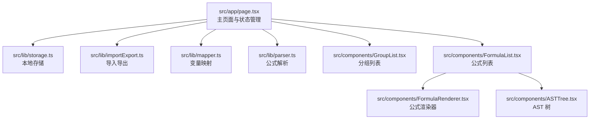
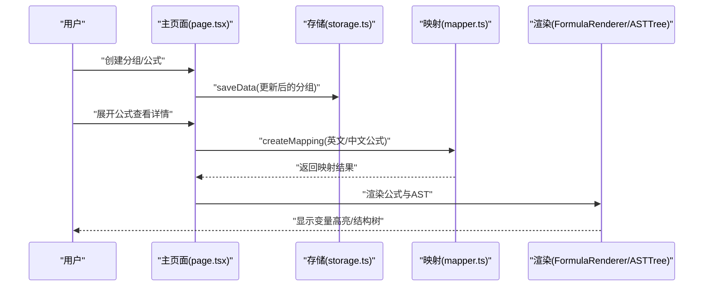
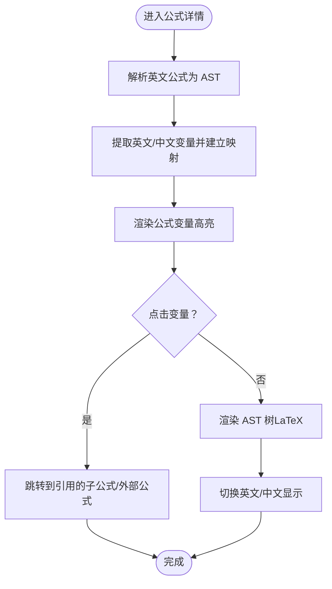
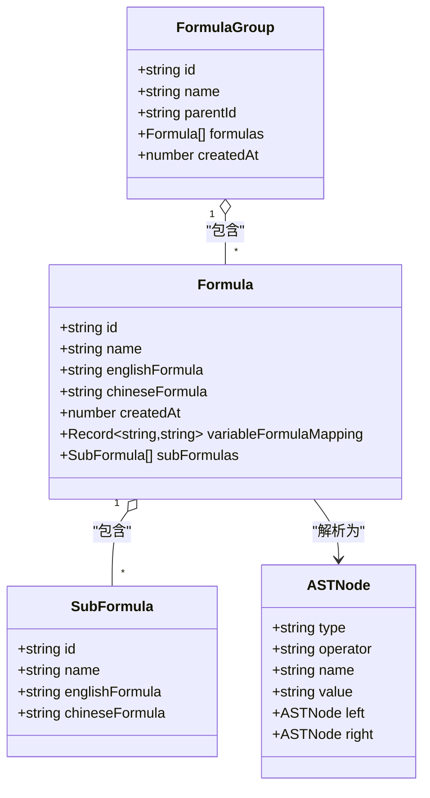

# 快速开始

<cite>
**本文引用的文件**
- [package.json](file://package.json)
- [next.config.js](file://next.config.js)
- [src/app/page.tsx](file://src/app/page.tsx)
- [src/lib/types.ts](file://src/lib/types.ts)
- [src/lib/mapper.ts](file://src/lib/mapper.ts)
- [src/lib/parser.ts](file://src/lib/parser.ts)
- [src/lib/storage.ts](file://src/lib/storage.ts)
- [src/lib/importExport.ts](file://src/lib/importExport.ts)
- [src/components/FormulaRenderer.tsx](file://src/components/FormulaRenderer.tsx)
- [src/components/ASTTree.tsx](file://src/components/ASTTree.tsx)
- [src/components/FormulaList.tsx](file://src/components/FormulaList.tsx)
- [src/components/GroupList.tsx](file://src/components/GroupList.tsx)
</cite>

## 目录
1. [简介](#简介)
2. [项目结构](#项目结构)
3. [核心组件](#核心组件)
4. [架构总览](#架构总览)
5. [详细组件分析](#详细组件分析)
6. [依赖关系分析](#依赖关系分析)
7. [性能考虑](#性能考虑)
8. [故障排除指南](#故障排除指南)
9. [结论](#结论)
10. [附录](#附录)

## 简介
本工具是一个基于 Next.js 的“公式变量映射与可视化”应用，帮助你：
- 创建分组管理多个公式
- 输入英文与中文公式，自动生成变量映射
- 可视化公式结构树（AST），并支持切换英文/中文显示
- 通过点击变量高亮跳转到引用的子公式或外部公式
- 本地持久化存储与 JSON 导出/导入

目标是在 5 分钟内完成环境准备、安装运行、创建第一个分组与公式，并查看变量映射与结构树。

## 项目结构
项目采用 Next.js App Router 结构，核心目录如下：
- src/app/page.tsx：应用主页面，负责状态管理、URL 同步、分组/公式 CRUD、导入导出
- src/lib/*：核心逻辑（类型定义、变量映射、公式解析、存储、导入导出）
- src/components/*：UI 组件（分组列表、公式列表、公式渲染器、AST 树等）

图表来源
- [src/app/page.tsx:1-707](file://src/app/page.tsx#L1-L707)
- [src/lib/storage.ts:1-50](file://src/lib/storage.ts#L1-L50)
- [src/lib/importExport.ts:1-101](file://src/lib/importExport.ts#L1-L101)
- [src/lib/mapper.ts:1-89](file://src/lib/mapper.ts#L1-L89)
- [src/lib/parser.ts:1-159](file://src/lib/parser.ts#L1-L159)
- [src/components/GroupList.tsx:1-294](file://src/components/GroupList.tsx#L1-L294)
- [src/components/FormulaList.tsx:1-387](file://src/components/FormulaList.tsx#L1-L387)
- [src/components/FormulaRenderer.tsx:1-169](file://src/components/FormulaRenderer.tsx#L1-L169)
- [src/components/ASTTree.tsx:1-179](file://src/components/ASTTree.tsx#L1-L179)

章节来源
- [src/app/page.tsx:1-707](file://src/app/page.tsx#L1-L707)
- [package.json:1-48](file://package.json#L1-L48)

## 核心组件
- 主页面与状态管理：负责加载/保存数据、URL 参数同步、分组/公式增删改、导入导出
- 变量映射器：从英文与中文公式提取变量并建立映射
- 公式解析器：将英文公式词法/语法解析为 AST
- 公式渲染器：将公式渲染为带颜色高亮的可交互元素
- AST 树：将 AST 转换为 LaTeX 并渲染，支持中英文切换
- 分组/公式列表：树形分组导航、公式列表展示与详情展开

章节来源
- [src/lib/types.ts:1-51](file://src/lib/types.ts#L1-L51)
- [src/lib/mapper.ts:1-89](file://src/lib/mapper.ts#L1-L89)
- [src/lib/parser.ts:1-159](file://src/lib/parser.ts#L1-L159)
- [src/components/FormulaRenderer.tsx:1-169](file://src/components/FormulaRenderer.tsx#L1-L169)
- [src/components/ASTTree.tsx:1-179](file://src/components/ASTTree.tsx#L1-L179)
- [src/components/GroupList.tsx:1-294](file://src/components/GroupList.tsx#L1-L294)
- [src/components/FormulaList.tsx:1-387](file://src/components/FormulaList.tsx#L1-L387)

## 架构总览
系统采用“页面驱动的状态管理 + 本地存储 + 组件化渲染”的架构：
- 页面层：集中管理全局状态、URL 同步、导入导出
- 业务层：变量映射、公式解析、数据持久化
- 视图层：公式渲染器与 AST 树组件负责可视化

图表来源
- [src/app/page.tsx:1-707](file://src/app/page.tsx#L1-L707)
- [src/lib/storage.ts:1-50](file://src/lib/storage.ts#L1-L50)
- [src/lib/mapper.ts:1-89](file://src/lib/mapper.ts#L1-L89)
- [src/components/FormulaRenderer.tsx:1-169](file://src/components/FormulaRenderer.tsx#L1-L169)
- [src/components/ASTTree.tsx:1-179](file://src/components/ASTTree.tsx#L1-L179)

## 详细组件分析

### 环境要求与安装
- Node.js 版本：根据依赖声明，项目使用 Next.js 16.x，建议使用 Node.js 18 或以上 LTS 版本
- 包管理器：推荐使用 npm（与 scripts 对应）
- 安装步骤
  1) 在项目根目录执行安装命令（如 npm install）
  2) 启动开发服务器（npm run dev）
  3) 浏览器访问 http://localhost:3000

章节来源
- [package.json:5-10](file://package.json#L5-L10)
- [package.json:15-34](file://package.json#L15-L34)

### 项目启动流程
- 开发模式：npm run dev → Next.js 启动本地服务
- 构建模式：npm run build → Next.js 编译产物
- 生产模式：npm run start → Next.js 启动生产服务

章节来源
- [package.json:5-10](file://package.json#L5-L10)
- [next.config.js:1-7](file://next.config.js#L1-L7)

### 基本使用场景演示（5 分钟入门）
以下为新用户的“5 分钟上手”步骤，涵盖创建分组、添加公式、查看变量映射与结构树。

- 步骤 1：打开应用，点击“数据管理”→“导出数据”，确认本地已有示例数据
- 步骤 2：点击“新建分组”，输入分组名称（如“数学公式”），点击“创建”
- 步骤 3：在右侧“公式列表”中点击“新建公式”，填写：
  - 公式名称（如“基础加法”）
  - 英文公式（如 a+b*c）
  - 中文公式（如 变量1+变量2*变量3）
  - 选择所属分组
  - 点击“创建”
- 步骤 4：展开刚创建的公式，查看：
  - 变量映射：英文变量 → 中文变量
  - 公式展示：变量高亮，点击变量可跳转到引用的子公式或外部公式
  - 公式结构树：LaTeX 渲染，支持切换英文/中文
- 步骤 5：回到顶部“数据管理”，导出/导入数据，验证持久化

章节来源
- [src/app/page.tsx:158-239](file://src/app/page.tsx#L158-L239)
- [src/app/page.tsx:422-696](file://src/app/page.tsx#L422-L696)
- [src/components/FormulaList.tsx:120-139](file://src/components/FormulaList.tsx#L120-L139)
- [src/components/FormulaRenderer.tsx:27-116](file://src/components/FormulaRenderer.tsx#L27-L116)
- [src/components/ASTTree.tsx:11-112](file://src/components/ASTTree.tsx#L11-L112)

### 关键流程图：变量映射与公式渲染

图表来源
- [src/lib/parser.ts:12-22](file://src/lib/parser.ts#L12-L22)
- [src/lib/mapper.ts:52-70](file://src/lib/mapper.ts#L52-L70)
- [src/components/FormulaRenderer.tsx:27-116](file://src/components/FormulaRenderer.tsx#L27-L116)
- [src/components/ASTTree.tsx:26-61](file://src/components/ASTTree.tsx#L26-L61)

### 类图：数据模型与关系

图表来源
- [src/lib/types.ts:27-50](file://src/lib/types.ts#L27-L50)
- [src/lib/parser.ts:3-22](file://src/lib/parser.ts#L3-L22)

## 依赖关系分析
- 运行时依赖
  - next：框架与构建
  - react/react-dom：UI 框架
  - katex：LaTeX 渲染
  - radix-ui：UI 组件库
  - tailwindcss/tailwind-merge：样式系统
- 开发依赖
  - typescript/eslint 等：类型与质量保障

章节来源
- [package.json:15-46](file://package.json#L15-L46)

## 性能考虑
- 本地存储：使用 localStorage 存储，避免网络请求；注意数据大小限制与序列化开销
- 渲染优化：公式详情仅在展开时解析与渲染，避免不必要的计算
- 图片/资源：LaTeX CSS 采用动态加载，减少首屏负担
- 大数据量：分组/公式列表支持搜索与层级筛选，降低渲染压力

[本节为通用指导，无需特定文件来源]

## 故障排除指南
- 无法启动开发服务器
  - 确认 Node.js 版本满足要求（建议 18+）
  - 清理缓存后重装依赖（如 npm ci 或删除 node_modules 后安装）
- 公式解析报错
  - 检查英文公式是否符合词法规则（仅允许字母、数字、运算符与括号）
  - 检查括号是否成对匹配
- 变量高亮不生效
  - 确认英文公式与中文公式变量一一对应
  - 若变量数量不一致，中文多出的部分会标注“未定义”
- 导入/导出失败
  - 导入文件必须为 JSON，且包含正确的版本与结构
  - 导出文件可用于备份与迁移

章节来源
- [src/lib/parser.ts:12-22](file://src/lib/parser.ts#L12-L22)
- [src/lib/importExport.ts:43-75](file://src/lib/importExport.ts#L43-L75)
- [src/lib/storage.ts:5-25](file://src/lib/storage.ts#L5-L25)

## 结论
本工具通过清晰的分层架构与直观的 UI，帮助你在 5 分钟内完成从安装到创建第一个公式并查看变量映射与结构树的全流程。建议后续扩展：
- 支持公式引用的双向链接与引用统计
- 增强公式模板与批量导入能力
- 添加公式版本历史与对比功能

[本节为总结性内容，无需特定文件来源]

## 附录

### 常见初始化配置说明
- 本地存储键：formulaMapper（用于保存分组与公式数据）
- URL 参数：formula=公式ID（用于在页面间共享选中公式）
- 默认行为：首次加载恢复上次选中的分组与侧边栏状态

章节来源
- [src/lib/storage.ts:3](file://src/lib/storage.ts#L3)
- [src/app/page.tsx:25-52](file://src/app/page.tsx#L25-L52)
- [src/app/page.tsx:82-130](file://src/app/page.tsx#L82-L130)