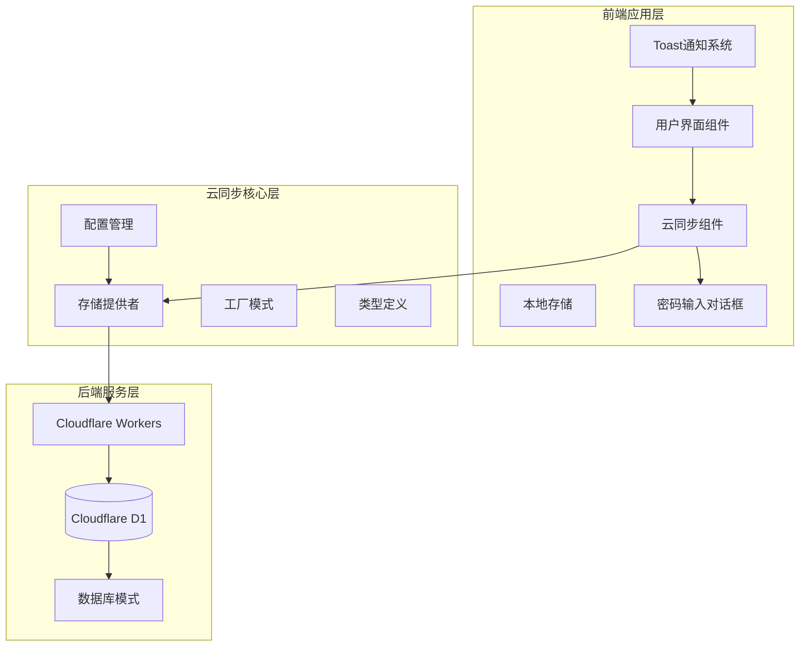
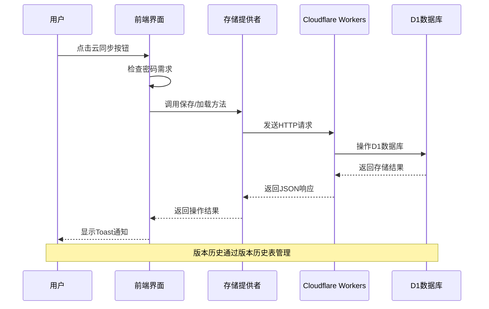
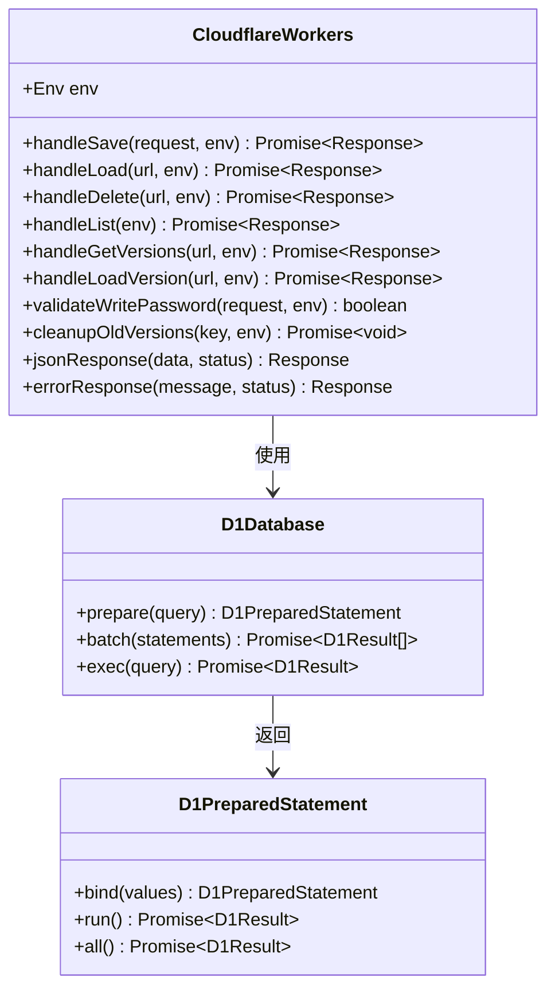
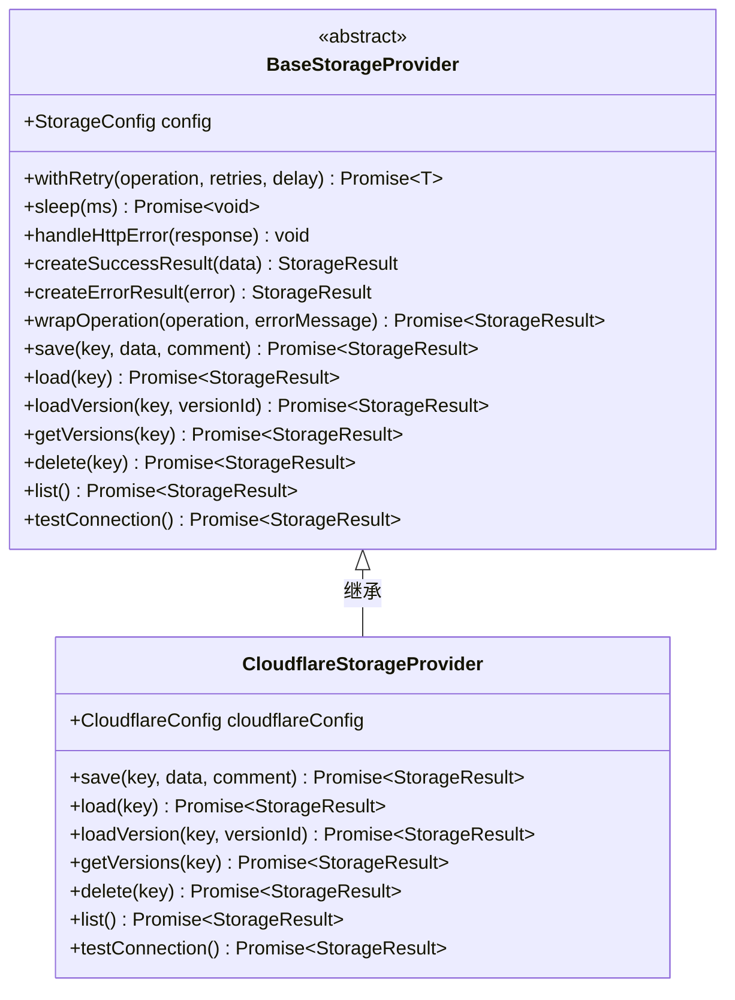
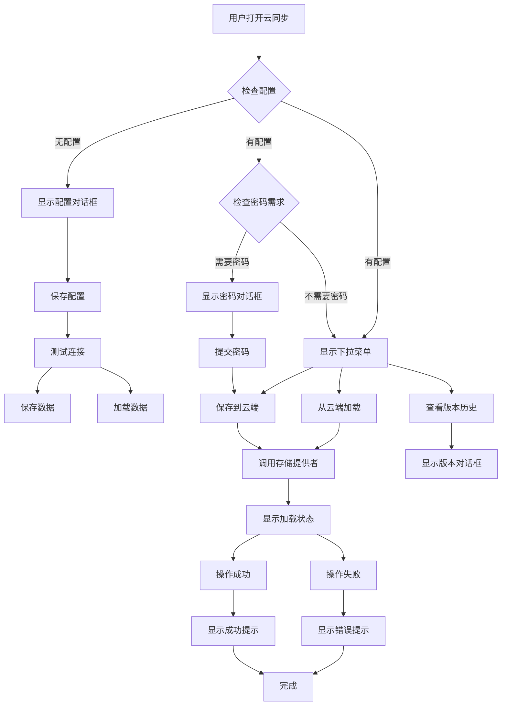
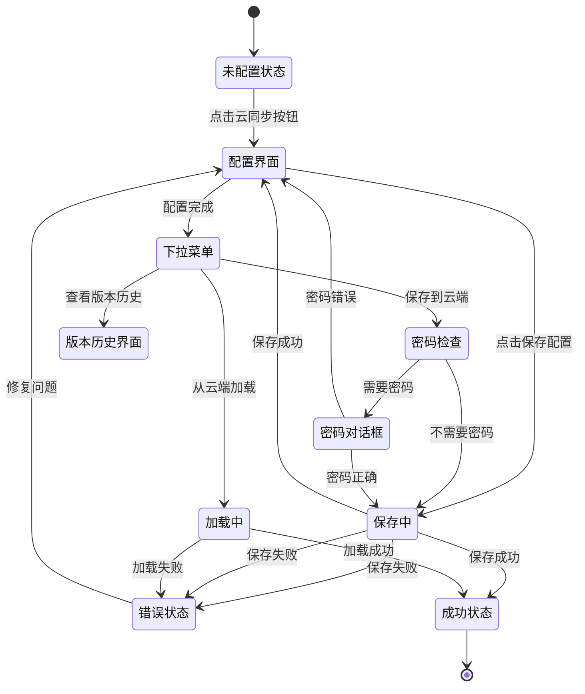
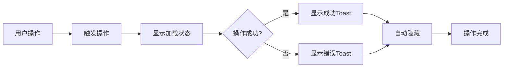
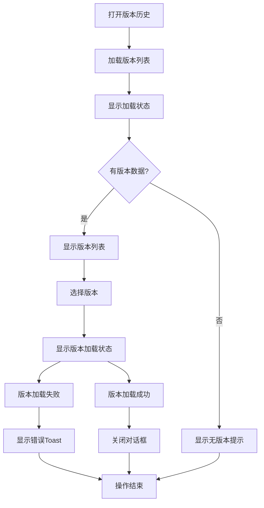
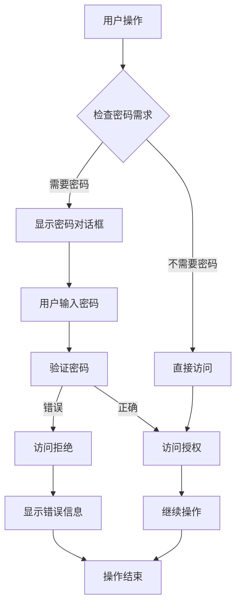
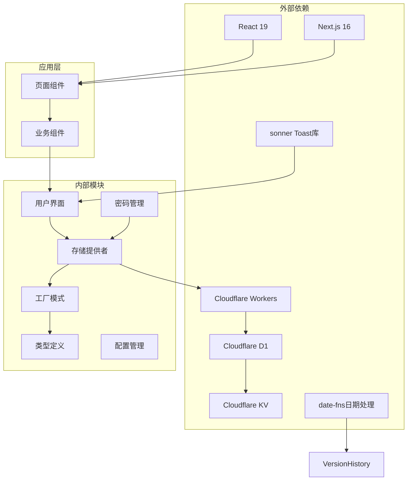

# 云同步集成

<cite>
**本文档引用的文件**
- [README.md](file://README.md)
- [README_zh.md](file://README_zh.md)
- [docs/CLOUD_SYNC.md](file://docs/CLOUD_SYNC.md)
- [docs/CLOUD_SYNC_zh.md](file://docs/CLOUD_SYNC_zh.md)
- [package.json](file://package.json)
- [src/lib/cloud/index.ts](file://src/lib/cloud/index.ts)
- [src/lib/cloud/types.ts](file://src/lib/cloud/types.ts)
- [src/lib/cloud/factory.ts](file://src/lib/cloud/factory.ts)
- [src/lib/cloud/providers/base.ts](file://src/lib/cloud/providers/base.ts)
- [src/lib/cloud/providers/cloudflare.ts](file://src/lib/cloud/providers/cloudflare.ts)
- [cloud/cloudflare-workers/index.ts](file://cloud/cloudflare-workers/index.ts)
- [cloud/cloudflare-workers/wrangler.toml](file://cloud/cloudflare-workers/wrangler.toml)
- [cloud/cloudflare-workers/schema.sql](file://cloud/cloudflare-workers/schema.sql)
- [src/components/CloudSyncButton.tsx](file://src/components/CloudSyncButton.tsx)
- [src/components/CloudSyncModal.tsx](file://src/components/CloudSyncModal.tsx)
- [src/components/VersionHistoryModal.tsx](file://src/components/VersionHistoryModal.tsx)
- [src/app/page.tsx](file://src/app/page.tsx)
- [src/lib/types.ts](file://src/lib/types.ts)
- [src/components/ui/sonner.tsx](file://src/components/ui/sonner.tsx)
</cite>

## 更新摘要
**变更内容**
- 从 KV 迁移到 D1 数据库，提供更可靠的持久化存储
- 新增密码保护系统，支持写入密码验证和 API Key 认证
- 集成模态密码输入对话框，提供安全的密码输入体验
- 改进 JSON 解析功能，增强错误处理和数据验证
- 更新版本历史管理，支持 D1 数据库的版本控制
- 优化数据库架构，包含版本历史表和索引优化

## 目录
1. [简介](#简介)
2. [云同步功能文档](#云同步功能文档)
3. [项目结构](#项目结构)
4. [核心组件](#核心组件)
5. [架构概览](#架构概览)
6. [详细组件分析](#详细组件分析)
7. [增强的状态指示系统](#增强的状态指示系统)
8. [版本历史管理功能](#版本历史管理功能)
9. [密码保护系统](#密码保护系统)
10. [依赖关系分析](#依赖关系分析)
11. [性能考虑](#性能考虑)
12. [故障排除指南](#故障排除指南)
13. [结论](#结论)

## 简介

Formula Mapper 是一个强大的公式映射和可视化工具，支持双语变量映射、层次化分组、嵌套子公式和AST（抽象语法树）可视化。该项目的核心特性之一是云同步功能，允许用户将公式数据安全地存储在云端，并支持版本历史管理和多设备同步。

**重要更新** 系统已完成从 Cloudflare KV 到 D1 数据库的重大迁移，提供了更可靠和高性能的云端数据持久化解决方案。新增的密码保护系统增强了数据安全性，支持写入密码验证和 API Key 认证双重保护机制。

云同步系统基于 Cloudflare Workers 和 D1 数据库构建，提供了完整的云端数据持久化解决方案，包括数据保存、加载、版本控制和错误处理机制。系统现已增强状态指示功能，为用户提供实时的操作反馈和版本历史管理能力。

## 云同步功能文档

Formula Mapper提供了一个完整的云端同步解决方案，现已从 Cloudflare KV 迁移到 D1 数据库，支持将数据安全地存储在 Cloudflare D1 中，并提供版本历史管理功能。

### 功能特性

- **自动版本管理**：最多保留100个版本历史
- **版本历史查看**：查看并恢复到任意历史版本
- **跨设备访问**：在任何设备上访问您的数据
- **安全配置**：支持 API Key 认证和写入密码双重保护
- **D1 数据库**：基于 Cloudflare D1 的可靠存储

### 配置步骤

1. **创建Cloudflare账户**：在cloudflare.com注册免费账户
2. **创建D1数据库**：使用 Wrangler CLI 创建 D1 数据库
3. **执行数据库迁移**：应用 schema.sql 模式定义
4. **更新配置文件**：在 wrangler.toml 中配置数据库绑定
5. **部署Worker**：使用 Wrangler 部署 Cloudflare Workers
6. **设置安全参数**：配置可选的 API Key 和写入密码
7. **应用中配置**：在 Formula Mapper 中输入 Worker URL

### 使用方法

| 操作 | 步骤 |
|------|------|
| 保存到云端 | 点击「云端同步」→「保存到云端」 |
| 从云端加载 | 点击「云端同步」→「从云端加载」 |
| 查看历史 | 点击「云端同步」→「版本历史」 |
| 恢复版本 | 在历史列表中选择版本，点击「恢复此版本」 |

**章节来源**
- [docs/CLOUD_SYNC_zh.md:1-87](file://docs/CLOUD_SYNC_zh.md#L1-L87)
- [README.md:20](file://README.md#L20)
- [README_zh.md:17](file://README_zh.md#L17)

## 项目结构

项目采用模块化的架构设计，主要分为以下几个部分：

**图表来源**
- [src/components/CloudSyncButton.tsx:232-270](file://src/components/CloudSyncButton.tsx#L232-L270)
- [src/lib/cloud/providers/cloudflare.ts:1-244](file://src/lib/cloud/providers/cloudflare.ts#L1-L244)
- [cloud/cloudflare-workers/index.ts:1-378](file://cloud/cloudflare-workers/index.ts#L1-L378)
- [cloud/cloudflare-workers/schema.sql:1-25](file://cloud/cloudflare-workers/schema.sql#L1-L25)
- [src/components/ui/sonner.tsx:1-33](file://src/components/ui/sonner.tsx#L1-L33)

**章节来源**
- [README.md:65-85](file://README.md#L65-L85)
- [package.json:1-51](file://package.json#L1-L51)

## 核心组件

云同步系统由以下核心组件构成：

### 1. 存储提供者接口
定义了统一的存储操作接口，包括保存、加载、版本管理等基本操作。

### 2. Cloudflare存储提供者
实现了 Cloudflare D1 存储的具体逻辑，通过 Workers API 与云端服务通信。

### 3. 工厂模式管理器
提供了存储提供者的创建和管理功能，支持扩展新的存储后端。

### 4. 用户界面组件
包含云同步按钮、配置对话框、版本历史管理界面和密码输入对话框。

### 5. 状态指示系统
集成了实时状态反馈和 Toast 通知，提供更好的用户体验。

**章节来源**
- [src/lib/cloud/types.ts:64-120](file://src/lib/cloud/types.ts#L64-L120)
- [src/lib/cloud/providers/cloudflare.ts:14-244](file://src/lib/cloud/providers/cloudflare.ts#L14-L244)
- [src/lib/cloud/factory.ts:13-86](file://src/lib/cloud/factory.ts#L13-L86)

## 架构概览

云同步系统采用分层架构设计，确保了良好的可扩展性和维护性：

**图表来源**
- [src/components/CloudSyncButton.tsx:76-100](file://src/components/CloudSyncButton.tsx#L76-L100)
- [cloud/cloudflare-workers/index.ts:95-118](file://cloud/cloudflare-workers/index.ts#L95-L118)

系统架构的关键特点：
- **分层设计**：清晰的职责分离，便于维护和扩展
- **接口抽象**：统一的存储接口，支持多种存储后端
- **错误处理**：完善的异常处理和重试机制
- **版本控制**：自动版本历史管理和清理策略
- **状态反馈**：实时的操作状态指示和用户反馈
- **密码保护**：双重认证机制，增强数据安全性

## 详细组件分析

### Cloudflare Workers 后端服务

Cloudflare Workers 作为后端服务，提供了 RESTful API 接口来管理云端数据：

**图表来源**
- [cloud/cloudflare-workers/index.ts:47-51](file://cloud/cloudflare-workers/index.ts#L47-L51)
- [cloud/cloudflare-workers/index.ts:150-201](file://cloud/cloudflare-workers/index.ts#L150-L201)

#### 核心功能实现

1. **数据保存**：支持带版本历史的数据存储到 D1 数据库
2. **数据加载**：支持最新版本和指定版本的数据检索
3. **版本管理**：自动版本历史记录和清理
4. **密码验证**：支持写入密码和 API Key 双重认证
5. **批量操作**：支持键列表查询和批量删除

**章节来源**
- [cloud/cloudflare-workers/index.ts:150-378](file://cloud/cloudflare-workers/index.ts#L150-L378)

### 存储提供者抽象基类

BaseStorageProvider 提供了统一的错误处理和重试机制：

**图表来源**
- [src/lib/cloud/providers/base.ts:15-142](file://src/lib/cloud/providers/base.ts#L15-L142)
- [src/lib/cloud/providers/cloudflare.ts:14-244](file://src/lib/cloud/providers/cloudflare.ts#L14-L244)

#### 关键特性

1. **指数退避重试**：网络请求失败时自动重试，最多3次
2. **统一错误处理**：标准化的 HTTP 错误码映射
3. **操作包装器**：统一的异步操作处理机制

**章节来源**
- [src/lib/cloud/providers/base.ts:42-141](file://src/lib/cloud/providers/base.ts#L42-L141)

### 用户界面组件

前端提供了直观的云同步用户界面：

**图表来源**
- [src/components/CloudSyncButton.tsx:76-100](file://src/components/CloudSyncButton.tsx#L76-L100)
- [src/components/CloudSyncModal.tsx:140-200](file://src/components/CloudSyncModal.tsx#L140-L200)

#### 组件功能

1. **CloudSyncButton**：主入口按钮，根据配置状态显示不同界面
2. **CloudSyncModal**：完整的配置和操作界面
3. **VersionHistoryModal**：版本历史管理和恢复功能
4. **密码输入对话框**：模态密码输入界面

**章节来源**
- [src/components/CloudSyncButton.tsx:17-273](file://src/components/CloudSyncButton.tsx#L17-L273)
- [src/components/CloudSyncModal.tsx:42-398](file://src/components/CloudSyncModal.tsx#L42-L398)
- [src/components/VersionHistoryModal.tsx:23-196](file://src/components/VersionHistoryModal.tsx#L23-L196)

## 增强的状态指示系统

系统现已集成完善的状态指示功能，为用户提供实时的操作反馈：

### 实时状态管理

**图表来源**
- [src/components/CloudSyncButton.tsx:31-103](file://src/components/CloudSyncButton.tsx#L31-L103)
- [src/components/CloudSyncModal.tsx:47-200](file://src/components/CloudSyncModal.tsx#L47-L200)

### 状态指示实现

1. **保存状态指示**：在保存过程中显示旋转动画和"保存中..."文本
2. **加载状态指示**：在加载过程中显示旋转动画和"加载中..."文本
3. **版本加载状态**：在版本恢复过程中显示特定的加载状态
4. **禁用按钮功能**：在操作进行时自动禁用相关按钮
5. **密码输入状态**：在密码验证过程中显示加载状态

**章节来源**
- [src/components/CloudSyncButton.tsx:145-172](file://src/components/CloudSyncButton.tsx#L145-L172)
- [src/components/CloudSyncModal.tsx:140-200](file://src/components/CloudSyncModal.tsx#L140-L200)
- [src/components/VersionHistoryModal.tsx:162-177](file://src/components/VersionHistoryModal.tsx#L162-L177)

### Toast通知系统

系统集成了 Toast 通知机制，提供即时的操作反馈：

**图表来源**
- [src/components/CloudSyncButton.tsx:62-69](file://src/components/CloudSyncButton.tsx#L62-L69)
- [src/components/CloudSyncModal.tsx:159-169](file://src/components/CloudSyncModal.tsx#L159-L169)

**章节来源**
- [src/components/CloudSyncButton.tsx:62-69](file://src/components/CloudSyncButton.tsx#L62-L69)
- [src/components/CloudSyncModal.tsx:159-169](file://src/components/CloudSyncModal.tsx#L159-L169)
- [src/components/VersionHistoryModal.tsx:74-85](file://src/components/VersionHistoryModal.tsx#L74-L85)

## 版本历史管理功能

系统现已集成完整的版本历史访问功能，支持版本查看和恢复：

### 版本历史界面

**图表来源**
- [src/components/VersionHistoryModal.tsx:34-86](file://src/components/VersionHistoryModal.tsx#L34-L86)

### 版本历史特性

1. **版本列表显示**：按时间倒序显示版本历史
2. **版本详情展示**：显示保存时间和版本备注
3. **版本恢复功能**：支持一键恢复到指定版本
4. **版本数量限制**：最多保留100个版本历史
5. **自动清理机制**：超出限制时自动清理旧版本

**章节来源**
- [src/components/VersionHistoryModal.tsx:125-181](file://src/components/VersionHistoryModal.tsx#L125-L181)
- [cloud/cloudflare-workers/index.ts:206-225](file://cloud/cloudflare-workers/index.ts#L206-L225)

### 版本历史数据结构

版本历史数据包含以下关键信息：

- **versionId**：版本唯一标识符（时间戳）
- **savedAt**：保存时间（ISO格式字符串）
- **comment**：版本备注信息（可选）

**章节来源**
- [src/lib/cloud/types.ts:45-49](file://src/lib/cloud/types.ts#L45-L49)
- [cloud/cloudflare-workers/index.ts:269-286](file://cloud/cloudflare-workers/index.ts#L269-L286)

## 密码保护系统

系统新增了完整的密码保护机制，提供双重认证安全保障：

### 密码保护架构

**图表来源**
- [src/components/CloudSyncButton.tsx:76-100](file://src/components/CloudSyncButton.tsx#L76-L100)
- [cloud/cloudflare-workers/index.ts:83-85](file://cloud/cloudflare-workers/index.ts#L83-L85)

### 密码保护特性

1. **写入密码验证**：保护保存和删除操作
2. **API Key 认证**：可选的身份验证机制
3. **模态密码输入**：安全的密码输入对话框
4. **自动密码检测**：Worker 端检测密码需求
5. **请求头验证**：通过 X-Write-Password 请求头传递密码

**章节来源**
- [cloud/cloudflare-workers/index.ts:132-145](file://cloud/cloudflare-workers/index.ts#L132-L145)
- [src/lib/cloud/providers/cloudflare.ts:48-51](file://src/lib/cloud/providers/cloudflare.ts#L48-L51)

### 密码配置和管理

密码保护系统支持以下配置方式：

1. **写入密码**：通过 `wrangler secret put WRITE_PASSWORD` 设置
2. **API Key**：通过 `wrangler secret put API_KEY` 设置
3. **Worker 端配置**：在 wrangler.toml 中配置环境变量
4. **前端安全**：密码仅在服务器端验证，不存储在前端

**章节来源**
- [docs/CLOUD_SYNC_zh.md:34-54](file://docs/CLOUD_SYNC_zh.md#L34-L54)
- [cloud/cloudflare-workers/wrangler.toml:11-15](file://cloud/cloudflare-workers/wrangler.toml#L11-L15)

## 依赖关系分析

云同步系统的依赖关系体现了清晰的分层架构：

**图表来源**
- [package.json:15-36](file://package.json#L15-L36)
- [src/lib/cloud/index.ts:1-20](file://src/lib/cloud/index.ts#L1-L20)

### 主要依赖关系

1. **前端框架依赖**：React 19 + Next.js 16提供基础运行环境
2. **UI组件库**：Radix UI提供可访问性友好的基础组件
3. **样式系统**：Tailwind CSS提供实用的样式解决方案
4. **云服务集成**：Cloudflare Workers + D1提供云端存储
5. **通知系统**：sonner提供Toast通知功能
6. **日期处理**：date-fns提供本地化日期格式化
7. **密码管理**：安全的密码验证和存储机制

**章节来源**
- [package.json:15-36](file://package.json#L15-L36)
- [src/lib/cloud/index.ts:1-20](file://src/lib/cloud/index.ts#L1-L20)

## 性能考虑

云同步系统在设计时充分考虑了性能优化：

### 1. 网络请求优化
- **指数退避重试**：避免频繁重试造成服务器压力
- **请求合并**：减少不必要的网络往返
- **缓存策略**：合理利用浏览器缓存机制

### 2. 数据传输优化
- **压缩传输**：JSON数据的最小化传输
- **增量更新**：支持部分数据更新而非全量替换
- **版本控制**：避免重复数据传输

### 3. 前端性能优化
- **懒加载**：按需加载云同步相关模块
- **虚拟滚动**：大量版本历史的高效渲染
- **防抖处理**：避免频繁的API调用
- **状态管理优化**：使用React状态钩子避免不必要的重渲染

### 4. 状态指示优化
- **条件渲染**：仅在需要时显示加载状态
- **按钮禁用**：防止重复操作
- **Toast延迟**：避免频繁的Toast弹窗

### 5. 数据库性能优化
- **索引优化**：为版本历史表创建复合索引
- **查询优化**：使用 LIMIT 子句限制版本数量
- **批量操作**：支持批量插入和删除操作

## 故障排除指南

### 常见问题及解决方案

#### 1. 连接失败
**症状**：测试连接或保存数据时出现网络错误
**可能原因**：
- Workers URL配置错误
- API Key认证失败
- 网络连接问题
- D1 数据库连接失败

**解决步骤**：
1. 验证Workers部署URL是否正确
2. 检查API Key配置
3. 确认网络连接正常
4. 验证D1数据库连接状态
5. 查看浏览器开发者工具的网络面板

#### 2. 权限错误
**症状**：HTTP 401或403错误
**解决方法**：
1. 确认API Key设置正确
2. 检查Workers的API Key配置
3. 验证D1数据库权限
4. 确认写入密码正确

#### 3. 数据加载失败
**症状**：从云端加载数据时出现错误
**排查步骤**：
1. 检查云端数据是否存在
2. 验证数据格式是否正确
3. 确认版本历史完整性
4. 检查D1数据库连接状态

#### 4. 版本历史问题
**症状**：版本历史显示异常或无法加载
**解决方法**：
1. 检查版本历史表结构
2. 验证版本数量限制（最多100个）
3. 确认版本数据的完整性
4. 检查数据库索引状态

#### 5. 密码验证问题
**症状**：密码输入无效或认证失败
**解决方法**：
1. 检查写入密码是否正确
2. 验证密码是否通过secret命令设置
3. 确认请求头中X-Write-Password是否正确传递
4. 检查Worker端密码验证逻辑

#### 6. 状态指示问题
**症状**：加载状态不显示或按钮无法禁用
**解决方法**：
1. 检查React状态钩子的正确使用
2. 验证事件处理器的绑定
3. 确认CSS类名的正确应用
4. 检查模态对话框的状态管理

**章节来源**
- [src/lib/cloud/providers/base.ts:78-103](file://src/lib/cloud/providers/base.ts#L78-L103)
- [cloud/cloudflare-workers/index.ts:56-61](file://cloud/cloudflare-workers/index.ts#L56-L61)

## 结论

Formula Mapper的云同步集成为用户提供了可靠的云端数据持久化解决方案。系统已完成从 Cloudflare KV 到 D1 数据库的重大迁移，具有以下优势：

### 技术优势
1. **架构清晰**：分层设计确保了良好的可维护性
2. **扩展性强**：工厂模式支持轻松添加新的存储后端
3. **用户体验好**：直观的界面和完善的错误处理
4. **性能优化**：合理的重试机制和网络优化
5. **状态反馈完善**：实时的状态指示和Toast通知
6. **安全性增强**：双重认证机制保护数据安全
7. **数据库优化**：D1数据库提供更好的性能和可靠性

### 功能特性
1. **版本历史管理**：自动版本控制和清理机制
2. **多设备同步**：支持跨设备数据共享
3. **安全可靠**：基于Cloudflare的高可用基础设施
4. **易于部署**：简化的Workers部署流程
5. **增强的用户反馈**：实时状态指示和操作确认
6. **密码保护**：写入密码和API Key双重认证
7. **模态输入**：安全的密码输入体验

### 发展前景
系统为未来的功能扩展奠定了良好基础，可以轻松集成其他云存储服务提供商，如 AWS S3、阿里云OSS 等，进一步提升系统的灵活性和可靠性。

通过本文档的详细分析，开发者可以深入理解云同步系统的实现原理和最佳实践，为后续的功能扩展和维护工作提供有力支持。

**更新** 新增的密码保护系统和 D1 数据库迁移显著提升了系统的安全性和可靠性，为用户提供了更加稳定和安全的云端同步体验。