# 云存储系统

<cite>
**本文档引用的文件**
- [README.md](file://README.md)
- [README_zh.md](file://README_zh.md)
- [package.json](file://package.json)
- [src/lib/types.ts](file://src/lib/types.ts)
- [src/lib/storage.ts](file://src/lib/storage.ts)
- [src/lib/parser.ts](file://src/lib/parser.ts)
- [src/lib/mapper.ts](file://src/lib/mapper.ts)
- [src/lib/importExport.ts](file://src/lib/importExport.ts)
- [src/lib/cloud/types.ts](file://src/lib/cloud/types.ts)
- [src/lib/cloud/factory.ts](file://src/lib/cloud/factory.ts)
- [src/lib/cloud/index.ts](file://src/lib/cloud/index.ts)
- [src/lib/cloud/providers/base.ts](file://src/lib/cloud/providers/base.ts)
- [src/lib/cloud/providers/cloudflare.ts](file://src/lib/cloud/providers/cloudflare.ts)
- [src/app/page.tsx](file://src/app/page.tsx)
- [src/components/CloudSyncButton.tsx](file://src/components/CloudSyncButton.tsx)
- [src/components/CloudSyncModal.tsx](file://src/components/CloudSyncModal.tsx)
- [src/components/VersionHistoryModal.tsx](file://src/components/VersionHistoryModal.tsx)
- [cloud/cloudflare-workers/index.ts](file://cloud/cloudflare-workers/index.ts)
- [cloud/cloudflare-workers/index-kv.ts](file://cloud/cloudflare-workers/index-kv.ts)
- [cloud/cloudflare-workers/schema.sql](file://cloud/cloudflare-workers/schema.sql)
- [cloud/cloudflare-workers/wrangler.toml](file://cloud/cloudflare-workers/wrangler.toml)
- [cloud/cloudflare-workers/package.json](file://cloud/cloudflare-workers/package.json)
- [cloud/cloudflare-workers/tsconfig.json](file://cloud/cloudflare-workers/tsconfig.json)
- [cloud/CORS_SOLUTION_SUMMARY.md](file://cloud/CORS_SOLUTION_SUMMARY.md)
- [cloud/CORS_TROUBLESHOOTING.md](file://cloud/CORS_TROUBLESHOOTING.md)
- [cloud/DEPLOYMENT_CHECKLIST.md](file://cloud/DEPLOYMENT_CHECKLIST.md)
- [cloud/QUICK_FIX.md](file://cloud/QUICK_FIX.md)
- [docs/CLOUD_SYNC.md](file://docs/CLOUD_SYNC.md)
- [docs/CLOUD_SYNC_zh.md](file://docs/CLOUD_SYNC_zh.md)
</cite>

## 更新摘要
**变更内容**
- 重大架构迁移：从 Cloudflare KV 存储迁移到 Cloudflare D1 关系型数据库
- 新增 D1 数据库模式和版本管理系统
- 增强安全功能：支持写入密码保护和 API 密钥认证
- 优化版本历史管理：使用关系型数据库实现更高效的版本控制
- 更新 Cloudflare Workers 后端实现以支持 D1 数据库
- 完善 CORS 配置和预检请求处理
- 新增独立的云同步功能文档和集成文档集合

## 目录
1. [简介](#简介)
2. [项目结构](#项目结构)
3. [核心组件](#核心组件)
4. [架构概览](#架构概览)
5. [详细组件分析](#详细组件分析)
6. [云同步功能文档](#云同步功能文档)
7. [Cloudflare Workers集成文档](#cloudflare-workers集成文档)
8. [云查询参数绑定功能](#云查询参数绑定功能)
9. [依赖关系分析](#依赖关系分析)
10. [性能考虑](#性能考虑)
11. [故障排除指南](#故障排除指南)
12. [结论](#结论)

## 简介

云存储系统是一个基于 Cloudflare Workers 和 D1 数据库的公式映射与可视化工具。该系统提供了本地持久化、云端同步、版本管理和数据导入导出等功能，支持复杂的数学和业务公式管理。

**更新** 系统已完成从 Cloudflare KV 到 Cloudflare D1 的重大架构迁移，采用关系型数据库提供更强大的数据管理和版本控制能力。新架构支持：

- **公式管理**：支持分组、子公式嵌套、变量映射
- **AST 可视化**：递归下降解析器生成抽象语法树
- **云端同步**：基于 D1 数据库的云端数据同步
- **版本控制**：基于关系型数据库的高效版本历史管理
- **数据导入导出**：支持 JSON 格式的数据交换
- **版本历史管理**：完整的版本历史查看和回滚功能
- **云查询参数绑定**：通过URL查询参数自动绑定Cloudflare Workers服务，实现一键云端数据加载
- **CORS支持**：完整的跨域资源共享配置和预检请求处理
- **安全认证**：可选的API密钥验证和写入密码保护
- **数据库优化**：使用索引和约束确保数据一致性和查询性能

## 项目结构

项目采用模块化的组织方式，主要分为以下几个部分：

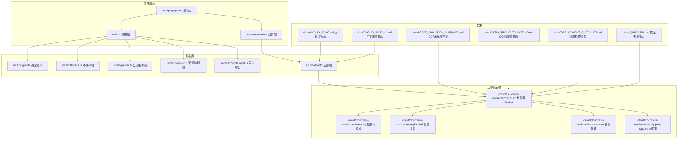

**图表来源**
- [src/app/page.tsx:1-800](file://src/app/page.tsx#L1-L800)
- [cloud/cloudflare-workers/index.ts:1-378](file://cloud/cloudflare-workers/index.ts#L1-L378)
- [cloud/cloudflare-workers/schema.sql:1-25](file://cloud/cloudflare-workers/schema.sql#L1-L25)
- [docs/CLOUD_SYNC.md:1-66](file://docs/CLOUD_SYNC.md#L1-L66)
- [docs/CLOUD_SYNC_zh.md:1-66](file://docs/CLOUD_SYNC_zh.md#L1-L66)
- [cloud/CORS_SOLUTION_SUMMARY.md:1-154](file://cloud/CORS_SOLUTION_SUMMARY.md#L1-L154)
- [cloud/CORS_TROUBLESHOOTING.md:1-247](file://cloud/CORS_TROUBLESHOOTING.md#L1-L247)
- [cloud/DEPLOYMENT_CHECKLIST.md:1-96](file://cloud/DEPLOYMENT_CHECKLIST.md#L1-L96)
- [cloud/QUICK_FIX.md:1-48](file://cloud/QUICK_FIX.md#L1-L48)

**章节来源**
- [README.md:64-84](file://README.md#L64-L84)
- [package.json:15-37](file://package.json#L15-L37)

## 核心组件

### 数据模型系统

系统定义了完整的数据模型来管理公式、分组和变量映射：

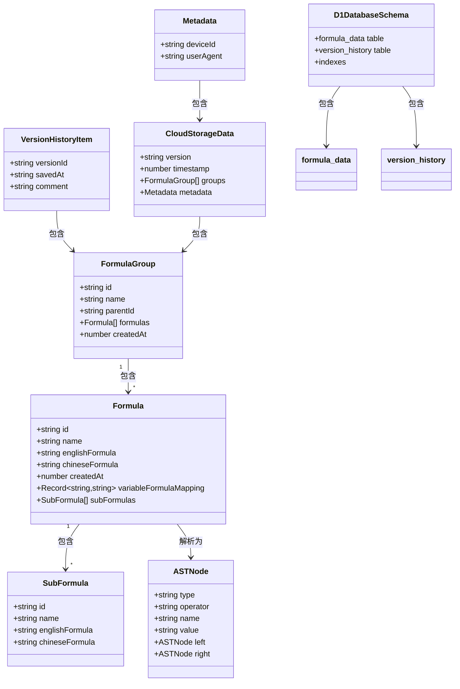

**图表来源**
- [src/lib/types.ts:27-50](file://src/lib/types.ts#L27-L50)
- [src/lib/types.ts:6-13](file://src/lib/types.ts#L6-L13)
- [src/lib/cloud/types.ts:32-49](file://src/lib/cloud/types.ts#L32-L49)
- [src/lib/cloud/types.ts:45-49](file://src/lib/cloud/types.ts#L45-L49)
- [cloud/cloudflare-workers/schema.sql:1-25](file://cloud/cloudflare-workers/schema.sql#L1-L25)

### 云存储架构

系统实现了灵活的云存储抽象层，支持多种存储提供商：

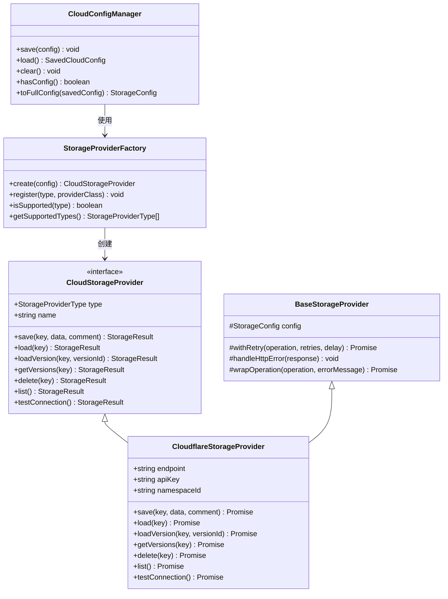

**图表来源**
- [src/lib/cloud/types.ts:67-120](file://src/lib/cloud/types.ts#L67-L120)
- [src/lib/cloud/factory.ts:13-86](file://src/lib/cloud/factory.ts#L13-L86)
- [src/lib/cloud/providers/base.ts:15-35](file://src/lib/cloud/providers/base.ts#L15-L35)

**章节来源**
- [src/lib/types.ts:1-51](file://src/lib/types.ts#L1-L51)
- [src/lib/cloud/types.ts:1-134](file://src/lib/cloud/types.ts#L1-L134)

## 架构概览

系统采用三层架构设计，从前端用户界面到云端存储形成完整的数据流：

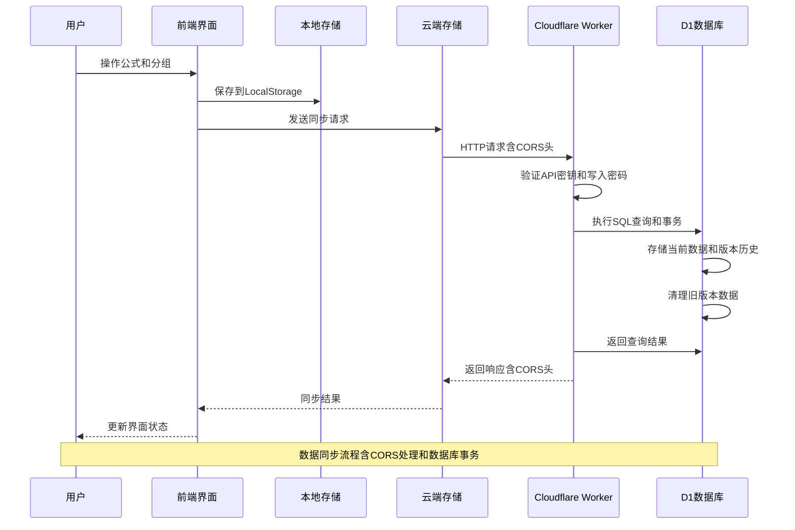

**图表来源**
- [src/app/page.tsx:104-131](file://src/app/page.tsx#L104-L131)
- [cloud/cloudflare-workers/index.ts:44-92](file://cloud/cloudflare-workers/index.ts#L44-L92)

系统的核心特性包括：

- **实时同步**：用户操作立即反映到本地存储，并异步同步到云端
- **版本控制**：每次保存自动创建版本，最多保留100个版本
- **错误处理**：完善的异常捕获和用户友好的错误提示
- **安全认证**：可选的API密钥验证机制和写入密码保护
- **版本历史管理**：完整的版本历史查看和回滚功能
- **云查询参数绑定**：通过URL查询参数自动绑定云端服务，实现一键数据加载
- **CORS支持**：完整的跨域资源共享配置，包括预检请求处理
- **数据库优化**：使用索引和约束确保数据一致性和查询性能

## 详细组件分析

### 前端组件系统

前端采用模块化组件设计，主要组件包括：

#### 主页面组件
主页面负责协调整个应用的状态管理和组件交互：

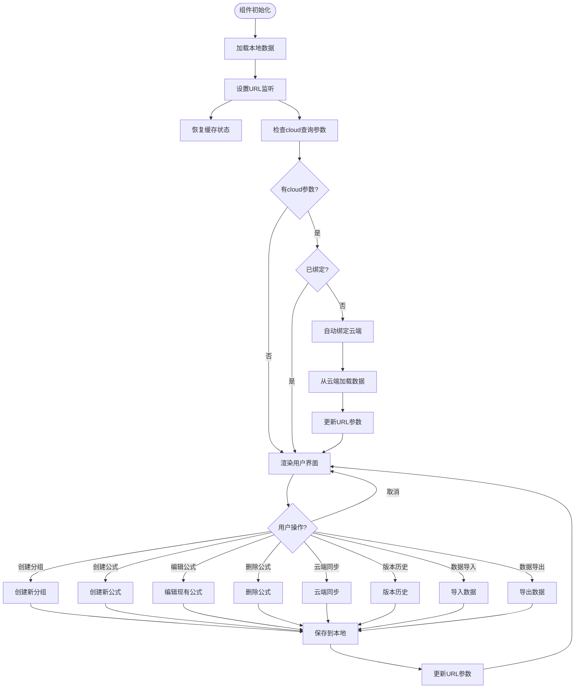

**图表来源**
- [src/app/page.tsx:104-131](file://src/app/page.tsx#L104-L131)
- [src/app/page.tsx:226-261](file://src/app/page.tsx#L226-L261)

#### 云端同步组件
云端同步功能提供了完整的云存储集成：

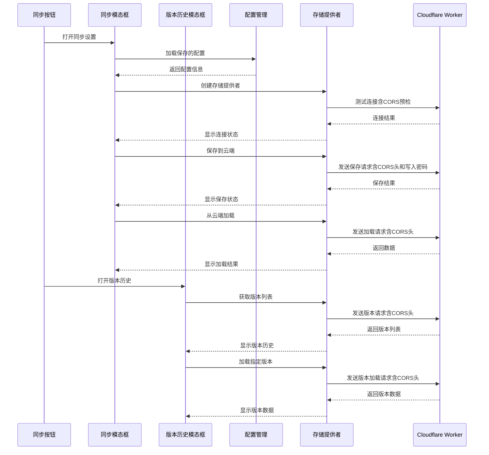

**图表来源**
- [src/components/CloudSyncButton.tsx:40-95](file://src/components/CloudSyncButton.tsx#L40-L95)
- [src/components/CloudSyncModal.tsx:140-200](file://src/components/CloudSyncModal.tsx#L140-L200)
- [src/components/VersionHistoryModal.tsx:34-86](file://src/components/VersionHistoryModal.tsx#L34-L86)

**章节来源**
- [src/app/page.tsx:18-800](file://src/app/page.tsx#L18-L800)
- [src/components/CloudSyncButton.tsx:1-206](file://src/components/CloudSyncButton.tsx#L1-L206)
- [src/components/CloudSyncModal.tsx:1-390](file://src/components/CloudSyncModal.tsx#L1-L390)
- [src/components/VersionHistoryModal.tsx:1-196](file://src/components/VersionHistoryModal.tsx#L1-L196)

### 版本历史管理系统

#### 版本历史模态框
版本历史模态框提供了完整的版本管理功能：

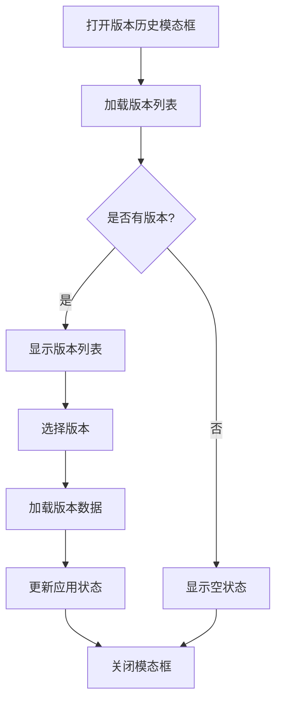

**图表来源**
- [src/components/VersionHistoryModal.tsx:28-86](file://src/components/VersionHistoryModal.tsx#L28-L86)

#### 版本清理机制
系统实现了智能的版本控制机制：

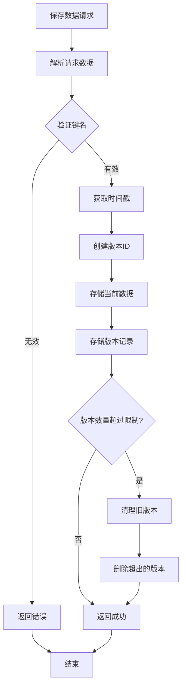

**图表来源**
- [cloud/cloudflare-workers/index.ts:97-139](file://cloud/cloudflare-workers/index.ts#L97-L139)
- [cloud/cloudflare-workers/index.ts:144-161](file://cloud/cloudflare-workers/index.ts#L144-L161)

**章节来源**
- [src/components/VersionHistoryModal.tsx:1-196](file://src/components/VersionHistoryModal.tsx#L1-L196)
- [cloud/cloudflare-workers/index.ts:1-378](file://cloud/cloudflare-workers/index.ts#L1-L378)

### 后端云存储服务

Cloudflare Workers 提供了完整的云端存储解决方案，现已迁移到 D1 数据库：

#### API 接口设计
后端实现了RESTful API接口，支持完整的CRUD操作和版本管理：

| 端点 | 方法 | 功能 | 请求体 | 响应 |
|------|------|------|--------|------|
| `/health` | GET | 健康检查 | 无 | `{status: 'ok', timestamp: number}` |
| `/need-password` | GET | 检查是否需要写入密码 | 无 | `{needPassword: boolean}` |
| `/save` | POST | 保存数据 | `{key: string, data: any, comment?: string}` | `{success: boolean, versionId: string, timestamp: number}` |
| `/load` | GET | 加载数据 | `key: string` | `{success: boolean, data: any, versionId: string, savedAt: string}` |
| `/delete` | GET | 删除数据 | `key: string` | `{success: boolean, message: string}` |
| `/list` | GET | 列出所有键 | 无 | `{success: boolean, keys: string[]}` |
| `/versions` | GET | 获取版本历史 | `key: string` | `{success: boolean, versions: VersionHistoryItem[]}` |
| `/load-version` | GET | 加载指定版本 | `key: string, versionId: string` | `{success: boolean, data: any}` |

#### CORS配置和预检请求处理
系统实现了完整的CORS支持，包括预检请求处理：

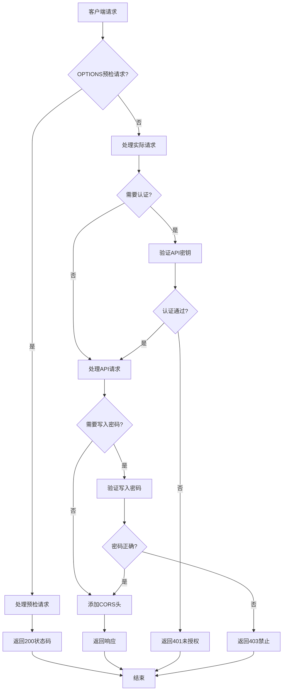

**图表来源**
- [cloud/cloudflare-workers/index.ts:31-38](file://cloud/cloudflare-workers/index.ts#L31-L38)
- [cloud/cloudflare-workers/index.ts:44-51](file://cloud/cloudflare-workers/index.ts#L44-L51)
- [cloud/cloudflare-workers/index.ts:61-66](file://cloud/cloudflare-workers/index.ts#L61-L66)
- [cloud/cloudflare-workers/index.ts:132-145](file://cloud/cloudflare-workers/index.ts#L132-L145)

#### 版本管理系统
系统实现了智能的版本控制机制：


**图表来源**
- [cloud/cloudflare-workers/index.ts:97-139](file://cloud/cloudflare-workers/index.ts#L97-L139)
- [cloud/cloudflare-workers/index.ts:144-161](file://cloud/cloudflare-workers/index.ts#L144-L161)

#### 数据库模式设计
系统使用关系型数据库模式管理数据：

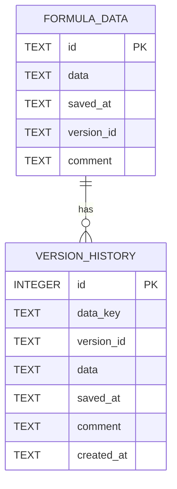

**图表来源**
- [cloud/cloudflare-workers/schema.sql:1-25](file://cloud/cloudflare-workers/schema.sql#L1-L25)

**章节来源**
- [cloud/cloudflare-workers/index.ts:1-378](file://cloud/cloudflare-workers/index.ts#L1-L378)
- [cloud/cloudflare-workers/wrangler.toml:1-15](file://cloud/cloudflare-workers/wrangler.toml#L1-L15)
- [cloud/cloudflare-workers/schema.sql:1-25](file://cloud/cloudflare-workers/schema.sql#L1-L25)

### 数据处理系统

#### 公式解析器
系统内置了递归下降解析器，支持复杂的数学表达式：

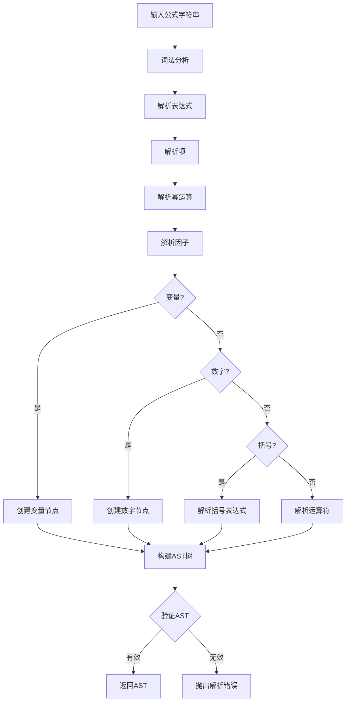

**图表来源**
- [src/lib/parser.ts:12-22](file://src/lib/parser.ts#L12-L22)
- [src/lib/parser.ts:78-133](file://src/lib/parser.ts#L78-L133)

#### 变量映射器
支持中英文变量的双向映射：

**章节来源**
- [src/lib/parser.ts:1-178](file://src/lib/parser.ts#L1-L178)
- [src/lib/mapper.ts:1-89](file://src/lib/mapper.ts#L1-L89)

## 云同步功能文档

### 功能特性

Formula Mapper 支持将数据同步到 Cloudflare D1 数据库进行备份和跨设备访问。这是完全可选的功能 - 您的数据默认始终保存在本地。

**功能特性**
- **自动版本管理**: 自动保留最多 100 个版本历史
- **版本历史查看**: 查看并恢复到任意历史版本
- **跨设备访问**: 在任何设备上访问您的数据
- **写入密码保护**: 可选的写入密码保护，防止意外修改
- **API密钥认证**: 可选的API密钥认证，增强安全性

### 配置步骤

#### 1. 创建 Cloudflare 账号
如果还没有账号，请在 [cloudflare.com](https://cloudflare.com) 注册

#### 2. 创建 D1 数据库
```bash
cd cloud/cloudflare-workers
npx wrangler d1 create formula-mapper-db
```

#### 3. 更新 wrangler.toml
复制上一步得到的 database_id，更新 `wrangler.toml` 文件：

```toml
[[d1_databases]]
binding = "DB"
database_name = "formula-mapper-db"
database_id = "your-database-id-here"
```

#### 4. 执行数据库迁移
```bash
npx wrangler d1 execute formula-mapper-db --file=schema.sql
```

#### 5. 部署 Worker
```bash
npx wrangler deploy
```

#### 6. 在应用中配置
1. 点击应用右上角的「云端同步」按钮
2. 输入 Worker URL（例如：`https://your-worker.your-subdomain.workers.dev`）
3.（可选）添加 API 密钥以增强安全性
4.（可选）添加写入密码以保护写入操作

### 使用方法

| 操作 | 步骤 |
|------|------|
| 保存到云端 | 点击「云端同步」→「保存到云端」 |
| 从云端加载 | 点击「云端同步」→「从云端加载」 |
| 查看历史 | 点击「云端同步」→「版本历史」 |
| 恢复版本 | 在历史列表中选择版本，点击「恢复此版本」 |

### 架构说明

云端同步功能采用策略模式设计，便于扩展：

- **当前实现**: Cloudflare D1 + Cloudflare Workers
- **存储接口**: `CloudStorageProvider` - 易于添加其他提供商（AWS、阿里云等）
- **版本管理**: 基于关系型数据库的智能版本控制，可配置保留数量（默认 100 个）
- **安全功能**: 支持API密钥认证和写入密码保护

**章节来源**
- [docs/CLOUD_SYNC.md:1-66](file://docs/CLOUD_SYNC.md#L1-L66)
- [docs/CLOUD_SYNC_zh.md:1-66](file://docs/CLOUD_SYNC_zh.md#L1-L66)

## Cloudflare Workers集成文档

### CORS解决方案

#### 问题诊断
系统已识别并解决了常见的CORS问题：

1. ✅ **CORS 头配置本身是正确的**（Worker 代码已包含）
2. ⚠️ **OPTIONS 预检请求可能未返回 200 状态码**（已修复）
3. ⚠️ **CORS 头配置不够完整**（已增强）

#### 已实施的修复

##### 1. 增强 CORS 头配置
```typescript
const corsHeaders = {
  'Access-Control-Allow-Origin': '*',
  'Access-Control-Allow-Methods': 'GET, POST, DELETE, OPTIONS, PUT',
  'Access-Control-Allow-Headers': 'Content-Type, Authorization, X-Requested-With, X-Write-Password',
  'Access-Control-Max-Age': '86400',  // 预检请求缓存24小时
  'Access-Control-Allow-Credentials': 'false',
};
```

**改进点**：
- ✅ 添加了 PUT 方法支持
- ✅ 添加了 X-Requested-With 头支持
- ✅ 添加了 X-Write-Password 头支持
- ✅ 添加了预检缓存配置（减少浏览器预检请求）
- ✅ 明确声明不允许凭证

##### 2. 修复 OPTIONS 预检响应
```typescript
if (request.method === 'OPTIONS') {
  return new Response(null, { 
    status: 200,  // 明确设置 200 状态码
    headers: corsHeaders 
  });
}
```

#### 快速恢复步骤

##### 1️⃣ 更新 Worker 代码
```bash
cd cloud/cloudflare-workers
```

确保 `index.ts` 已应用上述修改（已自动应用）

##### 2️⃣ 安装依赖
```bash
npm install
```

##### 3️⃣ 部署到生产
```bash
wrangler deploy
```

部署完成后，你会看到：
```
✓ Uploaded formula-mapper-sync (1.23 MB)
✓ Published to https://your-worker.your-subdomain.workers.dev
```

##### 4️⃣ 验证部署
```bash
# 测试 OPTIONS 预检请求
curl -v -X OPTIONS \
  -H "Origin: http://localhost:3000" \
  https://your-worker.your-subdomain.workers.dev/load
```

**成功标志**：响应头包含 `Access-Control-Allow-Origin: *`

##### 5️⃣ 清除浏览器缓存
- Chrome: `Ctrl+Shift+Delete` → 清除所有内容
- Safari: 菜单 → 开发 → 清空网站数据
- Firefox: `Ctrl+Shift+Delete` → 清除所有数据

#### 文件变更清单

| 文件 | 变更 | 说明 |
|------|------|------|
| `index.ts` | ✏️ 修改 | OPTIONS 预检添加 200 状态码 + CORS 头增强 + 写入密码支持 |
| `wrangler.toml` | ✏️ 修改 | 添加 D1 数据库绑定 |
| `schema.sql` | ✨ 新增 | D1 数据库模式定义 |
| `package.json` | ✨ 新增 | Node.js 依赖管理 |
| `tsconfig.json` | ✨ 新增 | TypeScript 编译配置 |
| `.gitignore` | ✨ 新增 | Git 忽略配置 |
| `CORS_TROUBLESHOOTING.md` | ✨ 新增 | 详细排查指南 |
| `DEPLOYMENT_CHECKLIST.md` | ✨ 新增 | 部署检查清单 |

#### 验证清单

在前端应用中测试：
- [ ] 点击「云端同步」按钮
- [ ] 输入 Worker URL：`https://your-worker.your-subdomain.workers.dev`
- [ ] 点击「保存到云端」
  - ✅ 预期：成功保存，无 CORS 错误
  - ❌ 错误：显示 CORS 错误 → 检查 Worker URL 是否正确
- [ ] 点击「从云端加载」
  - ✅ 预期：成功加载数据
  - ❌ 错误：显示加载错误 → 查看浏览器控制台日志

#### 如果仍然出现 CORS 错误

##### 检查清单

1. **确认 Worker 已重新部署**
   ```bash
   wrangler deploy
   ```

2. **查看 Worker 日志**
   ```bash
   wrangler tail --format pretty
   ```

3. **检查请求 URL 是否正确**
   - 格式：`https://your-worker.your-subdomain.workers.dev`
   - 不要包含路径（如 `/health`）

4. **清除浏览器缓存并重新刷新**
   - 确保加载了最新代码

5. **在浏览器控制台测试**
   ```javascript
   fetch('https://your-worker.your-subdomain.workers.dev/health')
     .then(r => {
       console.log('Status:', r.status);
       console.log('Headers:', {
         'Content-Type': r.headers.get('Content-Type'),
         'Access-Control-Allow-Origin': r.headers.get('Access-Control-Allow-Origin')
       });
       return r.json();
     })
     .then(d => console.log('Data:', d))
     .catch(e => console.error('Error:', e));
   ```

**章节来源**
- [cloud/CORS_SOLUTION_SUMMARY.md:1-154](file://cloud/CORS_SOLUTION_SUMMARY.md#L1-L154)
- [cloud/CORS_TROUBLESHOOTING.md:1-247](file://cloud/CORS_TROUBLESHOOTING.md#L1-L247)
- [cloud/DEPLOYMENT_CHECKLIST.md:1-96](file://cloud/DEPLOYMENT_CHECKLIST.md#L1-L96)
- [cloud/QUICK_FIX.md:1-48](file://cloud/QUICK_FIX.md#L1-L48)

## 云查询参数绑定功能

### 功能概述

云查询参数绑定功能允许用户通过URL查询参数自动绑定Cloudflare Workers服务，实现一键云端数据加载和绑定。当用户访问带有特定查询参数的URL时，系统会自动检测并执行云端数据绑定流程。

### 查询参数规范

系统支持以下查询参数：

- **cloud**：Cloudflare Workers服务端点URL
- **示例**：`https://your-app.com?cloud=https://your-worker.your-subdomain.workers.dev`

### 自动绑定流程

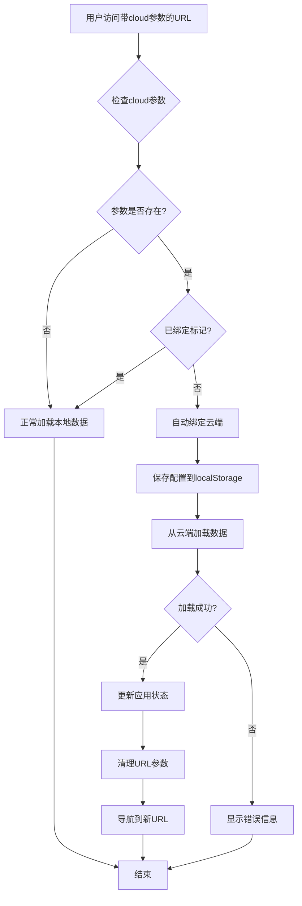

**图表来源**
- [src/app/page.tsx:135-192](file://src/app/page.tsx#L135-L192)

### 技术实现

#### URL参数检测
系统在组件挂载时检查URL查询参数：

```typescript
const urlCloudEndpoint = searchParams.get('cloud');
if (urlCloudEndpoint) {
  const hasQueryBound = localStorage.getItem('cloudQueryBound');
  if (!hasQueryBound) {
    handleCloudQueryBind(urlCloudEndpoint);
  }
}
```

#### 自动绑定逻辑
自动绑定过程包括配置保存、数据加载和URL清理：

```typescript
const handleCloudQueryBind = async (endpoint: string) => {
  // 保存配置到localStorage
  const cloudConfig = {
    endpoint: endpoint.trim(),
    apiKey: undefined,
    namespaceId: undefined,
  };
  localStorage.setItem('formulaMapper_cloudConfig', JSON.stringify(cloudConfig));
  
  // 标记为已通过query绑定
  localStorage.setItem('cloudQueryBound', 'true');
  
  // 从云端加载数据
  const provider = new CloudflareStorageProvider({
    type: StorageProviderType.CLOUDFLARE,
    endpoint: endpoint.trim(),
  });
  
  const result = await provider.load('formula-data');
  
  // 更新应用状态并清理URL参数
  const params = new URLSearchParams(window.location.search);
  params.delete('cloud');
  const newUrl = params.toString() ? `${pathname}?${params.toString()}` : pathname;
  router.push(newUrl, { scroll: false });
};
```

### 安全考虑

- **一次性绑定**：系统使用`cloudQueryBound`标记确保每个URL只绑定一次
- **配置持久化**：绑定后的配置会保存到localStorage，后续访问无需重复绑定
- **URL清理**：成功绑定后自动清理URL中的cloud参数，避免重复触发

### 使用场景

- **共享链接**：通过URL分享云端数据，接收方可直接访问
- **跨设备访问**：在不同设备间快速同步云端数据
- **演示场景**：快速展示云端数据而无需手动配置

**章节来源**
- [src/app/page.tsx:135-192](file://src/app/page.tsx#L135-L192)

## 依赖关系分析

系统采用了清晰的依赖层次结构：

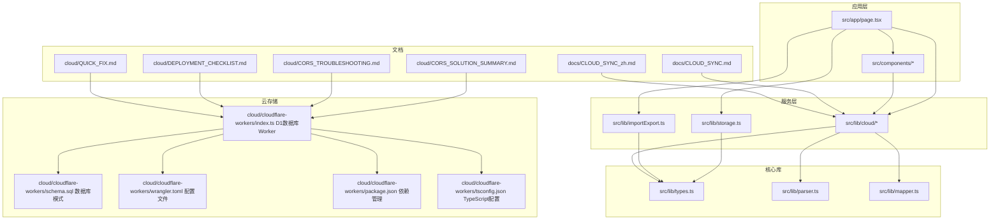

**图表来源**
- [src/app/page.tsx:14-16](file://src/app/page.tsx#L14-L16)
- [src/lib/cloud/index.ts:1-20](file://src/lib/cloud/index.ts#L1-L20)

**章节来源**
- [package.json:15-37](file://package.json#L15-L37)
- [src/lib/cloud/index.ts:1-20](file://src/lib/cloud/index.ts#L1-L20)

## 性能考虑

系统在设计时充分考虑了性能优化：

### 本地存储优化
- **增量更新**：只更新受影响的分组和公式
- **批量操作**：支持批量导入导出减少DOM操作
- **缓存策略**：利用LocalStorage缓存用户选择状态

### 云端同步优化
- **异步处理**：云端同步不影响用户体验
- **错误重试**：网络异常时自动重试机制
- **版本压缩**：自动清理旧版本释放存储空间（最多100个版本）
- **懒加载**：云存储提供者按需加载，避免不必要的初始化
- **数据库索引**：使用索引优化版本历史查询性能

### 数据结构优化
- **扁平化存储**：避免深层嵌套导致的性能问题
- **索引优化**：通过ID快速定位数据项
- **内存管理**：及时清理不再使用的数据引用
- **关系型数据库**：使用SQL查询和事务确保数据一致性

### 云查询参数绑定优化
- **条件检查**：仅在首次访问且未绑定时执行
- **防抖处理**：避免重复绑定操作
- **URL清理**：减少不必要的参数传递

### CORS性能优化
- **预检缓存**：使用 `Access-Control-Max-Age` 减少重复预检请求
- **统一CORS头**：在所有响应中包含CORS头，避免重复配置
- **预检快速响应**：OPTIONS请求直接返回200状态码

### D1数据库性能优化
- **索引设计**：为版本历史表创建多个索引以优化查询
- **事务处理**：使用数据库事务确保数据一致性
- **查询优化**：使用LIMIT子句限制版本数量
- **约束保证**：使用PRIMARY KEY和FOREIGN KEY约束确保数据完整性

## 故障排除指南

### 常见问题及解决方案

#### 云端同步失败
**症状**：保存或加载数据时出现错误
**可能原因**：
- 网络连接不稳定
- API密钥配置错误
- D1数据库连接问题
- 写入密码错误

**解决步骤**：
1. 检查网络连接状态
2. 验证API密钥配置
3. 确认D1数据库部署正常
4. 检查Worker日志
5. 验证写入密码设置

#### 数据丢失问题
**症状**：刷新页面后数据消失
**可能原因**：
- LocalStorage权限被拒绝
- 浏览器缓存清理
- 浏览器兼容性问题

**解决步骤**：
1. 检查浏览器的LocalStorage设置
2. 确认网站具有存储权限
3. 尝试使用其他浏览器
4. 检查浏览器扩展程序是否阻止存储

#### 版本历史异常
**症状**：版本历史显示不正确或无法加载
**可能原因**：
- D1数据库损坏
- 版本数据格式错误
- 权限配置问题

**解决步骤**：
1. 清理浏览器缓存
2. 重新配置云存储设置
3. 检查Worker日志
4. 联系技术支持

#### 版本清理问题
**症状**：版本历史过多或过少
**可能原因**：
- 版本清理机制异常
- 存储空间限制
- 数据损坏

**解决步骤**：
1. 检查版本清理日志
2. 验证存储空间使用情况
3. 重新部署Worker以修复数据
4. 联系技术支持

#### 云查询参数绑定失败
**症状**：访问带cloud参数的URL但无法自动绑定
**可能原因**：
- URL格式不正确
- 云端服务不可用
- 浏览器阻止localStorage
- 已经绑定过该URL

**解决步骤**：
1. 检查URL格式是否正确
2. 确认Cloudflare Workers服务正常运行
3. 验证浏览器的localStorage权限
4. 清除`cloudQueryBound`标记后重试
5. 检查浏览器控制台的错误信息

#### CORS问题
**症状**：浏览器报错 `CORS policy: Response to preflight request doesn't pass access control check`
**可能原因**：
- CORS头配置不正确
- Worker未重新部署
- 浏览器缓存问题
- API密钥认证失败

**解决步骤**：
1. 确认Worker代码包含正确的CORS配置
2. 运行 `wrangler deploy` 重新部署
3. 清除浏览器缓存
4. 检查Worker日志 `wrangler tail`
5. 验证Worker URL格式正确

#### D1数据库连接问题
**症状**：Worker无法连接到D1数据库
**可能原因**：
- database_id配置错误
- 数据库未创建
- 权限配置问题

**解决步骤**：
1. 检查wrangler.toml中的database_id
2. 确认D1数据库已创建
3. 验证数据库绑定配置
4. 查看Worker日志获取详细错误信息

#### 写入密码保护问题
**症状**：保存数据时提示需要写入密码
**可能原因**：
- 已配置写入密码但未提供
- 写入密码错误
- 密码配置问题

**解决步骤**：
1. 检查是否已配置写入密码
2. 确认密码设置正确
3. 验证密码在请求头中正确传递
4. 查看Worker日志获取详细错误信息

**章节来源**
- [src/components/CloudSyncButton.tsx:40-95](file://src/components/CloudSyncButton.tsx#L40-L95)
- [cloud/cloudflare-workers/index.ts:79-85](file://cloud/cloudflare-workers/index.ts#L79-L85)
- [src/components/VersionHistoryModal.tsx:184-191](file://src/components/VersionHistoryModal.tsx#L184-L191)
- [src/app/page.tsx:135-192](file://src/app/page.tsx#L135-L192)
- [cloud/CORS_SOLUTION_SUMMARY.md:112-147](file://cloud/CORS_SOLUTION_SUMMARY.md#L112-L147)

## 结论

云存储系统提供了一个完整、可靠的公式管理解决方案。通过采用现代化的技术栈和架构设计，系统在功能完整性、性能表现和用户体验方面都达到了较高水平。

**更新** 系统已完成从 Cloudflare KV 到 Cloudflare D1 的重大架构迁移，这一升级带来了显著的改进：

### 主要优势
- **技术先进**：基于Cloudflare D1的关系型数据库架构
- **功能丰富**：支持复杂的公式管理和云端同步
- **版本控制完善**：基于关系型数据库的高效版本历史管理
- **扩展性强**：模块化设计便于功能扩展
- **用户体验好**：直观的界面和流畅的操作体验
- **版本历史管理**：完整的版本查看和回滚功能
- **文档完善**：提供了详细的配置指南和使用说明
- **云查询参数绑定**：通过URL查询参数自动绑定云端服务，实现一键数据加载
- **CORS支持完善**：完整的跨域资源共享配置和预检请求处理
- **安全功能增强**：支持API密钥认证和写入密码保护
- **数据库优化**：使用索引和约束确保数据一致性和查询性能

### 技术特色
- **关系型数据库**：使用D1数据库提供更好的数据管理能力
- **版本控制**：基于关系型数据库的高效版本历史管理
- **安全可靠**：可选的API密钥验证和写入密码保护
- **性能优化**：异步处理、缓存机制和数据库索引
- **跨平台支持**：响应式设计适配各种设备
- **版本清理机制**：智能版本管理，防止存储空间无限增长
- **加载状态指示**：增强的用户交互体验
- **策略模式设计**：易于扩展其他存储提供商
- **云查询参数绑定**：通过URL查询参数自动绑定云端服务，实现一键数据加载
- **CORS预检处理**：完整的跨域资源共享支持
- **部署自动化**：包含完整的部署检查清单和快速修复指南

### 架构升级亮点
- **从KV到D1**：从键值存储迁移到关系型数据库，支持复杂查询和事务
- **版本管理优化**：使用关系型数据库的JOIN操作和索引优化版本历史查询
- **安全增强**：新增写入密码保护和API密钥认证双重安全机制
- **性能提升**：数据库索引和约束确保数据一致性和查询效率
- **运维简化**：统一的数据库模式和迁移脚本简化部署流程

该系统为公式管理和知识分享提供了一个强大的技术平台，适合学术研究、商业建模和技术文档等多种应用场景。新增的独立云同步功能文档、Cloudflare Workers集成文档集合和云查询参数绑定功能进一步完善了系统的易用性和可维护性，为用户提供了更加便捷的云端数据管理体验。

**章节来源**
- [cloud/cloudflare-workers/index.ts:1-378](file://cloud/cloudflare-workers/index.ts#L1-L378)
- [cloud/cloudflare-workers/schema.sql:1-25](file://cloud/cloudflare-workers/schema.sql#L1-L25)
- [src/lib/cloud/providers/cloudflare.ts:1-244](file://src/lib/cloud/providers/cloudflare.ts#L1-L244)