# 云存储系统

<cite>
**本文档引用的文件**
- [README.md](file://README.md)
- [package.json](file://package.json)
- [src/lib/types.ts](file://src/lib/types.ts)
- [src/lib/storage.ts](file://src/lib/storage.ts)
- [src/lib/parser.ts](file://src/lib/parser.ts)
- [src/lib/mapper.ts](file://src/lib/mapper.ts)
- [src/lib/importExport.ts](file://src/lib/importExport.ts)
- [src/lib/cloud/types.ts](file://src/lib/cloud/types.ts)
- [src/lib/cloud/factory.ts](file://src/lib/cloud/factory.ts)
- [src/lib/cloud/index.ts](file://src/lib/cloud/index.ts)
- [src/app/page.tsx](file://src/app/page.tsx)
- [src/components/CloudSyncButton.tsx](file://src/components/CloudSyncButton.tsx)
- [src/components/CloudSyncModal.tsx](file://src/components/CloudSyncModal.tsx)
- [src/components/VersionHistoryModal.tsx](file://src/components/VersionHistoryModal.tsx)
- [cloud/cloudflare-workers/index.ts](file://cloud/cloudflare-workers/index.ts)
- [cloud/cloudflare-workers/wrangler.toml](file://cloud/cloudflare-workers/wrangler.toml)
</cite>

## 更新摘要
**变更内容**
- 新增版本历史管理系统，包括VersionHistoryModal组件和版本清理机制
- 增强CloudSyncButton的加载状态指示功能，支持保存和加载状态显示
- 实现版本历史查看和版本回滚功能
- 优化云端同步组件的用户交互体验

## 目录
1. [简介](#简介)
2. [项目结构](#项目结构)
3. [核心组件](#核心组件)
4. [架构概览](#架构概览)
5. [详细组件分析](#详细组件分析)
6. [依赖关系分析](#依赖关系分析)
7. [性能考虑](#性能考虑)
8. [故障排除指南](#故障排除指南)
9. [结论](#结论)

## 简介

云存储系统是一个基于 Cloudflare Workers 和 KV 存储的公式映射与可视化工具。该系统提供了本地持久化、云端同步、版本管理和数据导入导出等功能，支持复杂的数学和业务公式管理。

系统采用前后端分离架构，前端使用 Next.js 16.2.1 和 React 19，后端基于 Cloudflare Workers 提供 RESTful API 接口。核心功能包括：

- **公式管理**：支持分组、子公式嵌套、变量映射
- **AST 可视化**：递归下降解析器生成抽象语法树
- **云端同步**：基于 KV 存储的云端数据同步
- **版本控制**：自动版本历史管理和回滚
- **数据导入导出**：支持 JSON 格式的数据交换
- **版本历史管理**：完整的版本历史查看和回滚功能

## 项目结构

项目采用模块化的组织方式，主要分为以下几个部分：

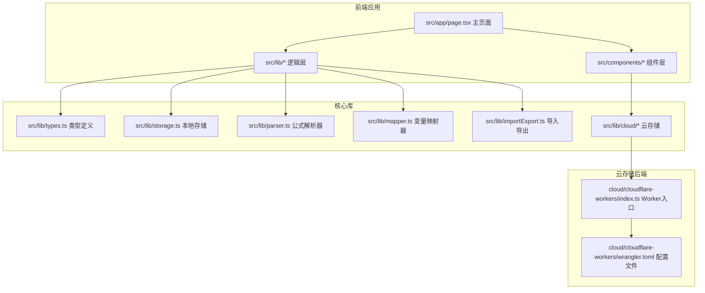

**图表来源**
- [src/app/page.tsx:1-800](file://src/app/page.tsx#L1-L800)
- [cloud/cloudflare-workers/index.ts:1-314](file://cloud/cloudflare-workers/index.ts#L1-L314)

**章节来源**
- [README.md:64-84](file://README.md#L64-L84)
- [package.json:15-37](file://package.json#L15-L37)

## 核心组件

### 数据模型系统

系统定义了完整的数据模型来管理公式、分组和变量映射：

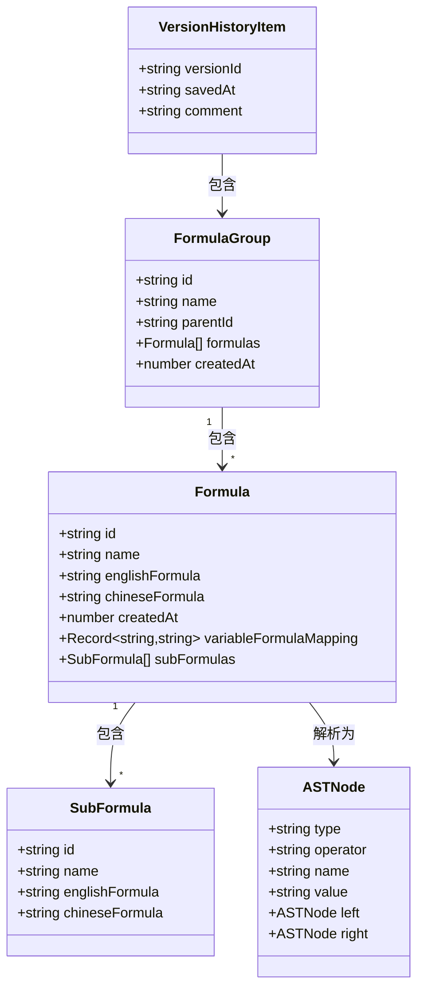

**图表来源**
- [src/lib/types.ts:27-50](file://src/lib/types.ts#L27-L50)
- [src/lib/types.ts:6-13](file://src/lib/types.ts#L6-L13)
- [src/lib/cloud/types.ts:45-49](file://src/lib/cloud/types.ts#L45-L49)

### 云存储架构

系统实现了灵活的云存储抽象层，支持多种存储提供商：

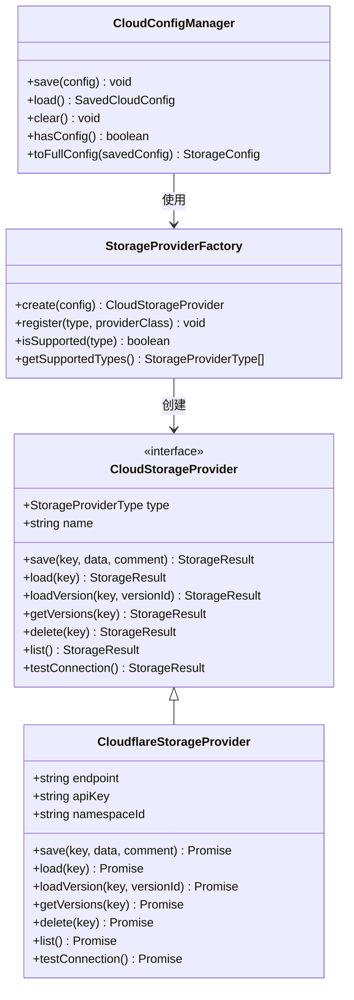

**图表来源**
- [src/lib/cloud/types.ts:67-120](file://src/lib/cloud/types.ts#L67-L120)
- [src/lib/cloud/factory.ts:13-86](file://src/lib/cloud/factory.ts#L13-L86)

**章节来源**
- [src/lib/types.ts:1-51](file://src/lib/types.ts#L1-L51)
- [src/lib/cloud/types.ts:1-134](file://src/lib/cloud/types.ts#L1-L134)

## 架构概览

系统采用三层架构设计，从前端用户界面到云端存储形成完整的数据流：

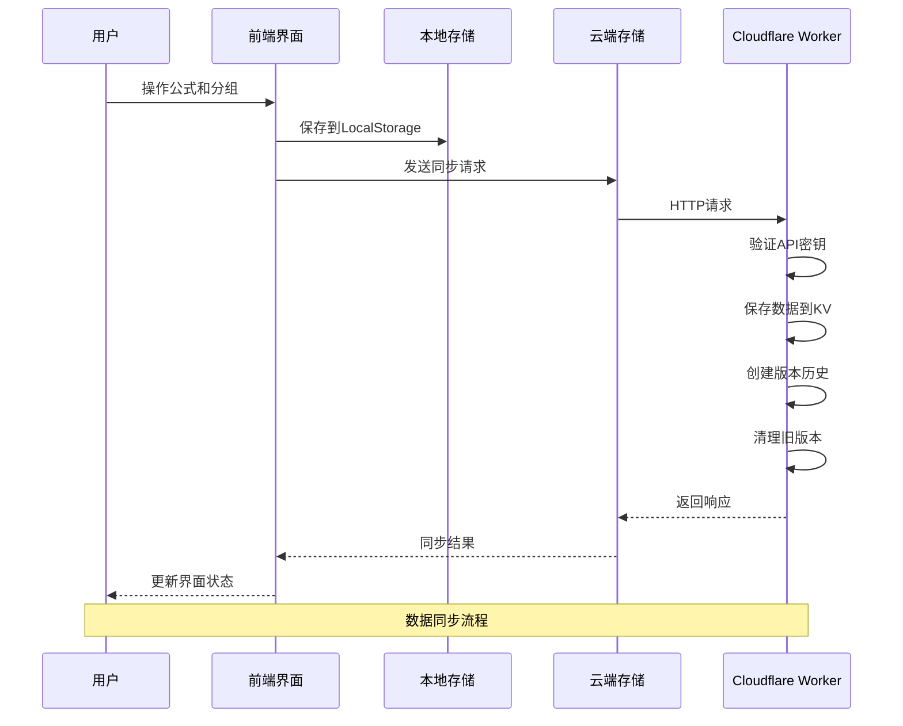

**图表来源**
- [src/app/page.tsx:104-131](file://src/app/page.tsx#L104-L131)
- [cloud/cloudflare-workers/index.ts:43-86](file://cloud/cloudflare-workers/index.ts#L43-L86)

系统的核心特性包括：

- **实时同步**：用户操作立即反映到本地存储，并异步同步到云端
- **版本控制**：每次保存自动创建版本，最多保留100个版本
- **错误处理**：完善的异常捕获和用户友好的错误提示
- **安全认证**：可选的API密钥验证机制
- **版本历史管理**：完整的版本历史查看和回滚功能

## 详细组件分析

### 前端组件系统

前端采用模块化组件设计，主要组件包括：

#### 主页面组件
主页面负责协调整个应用的状态管理和组件交互：

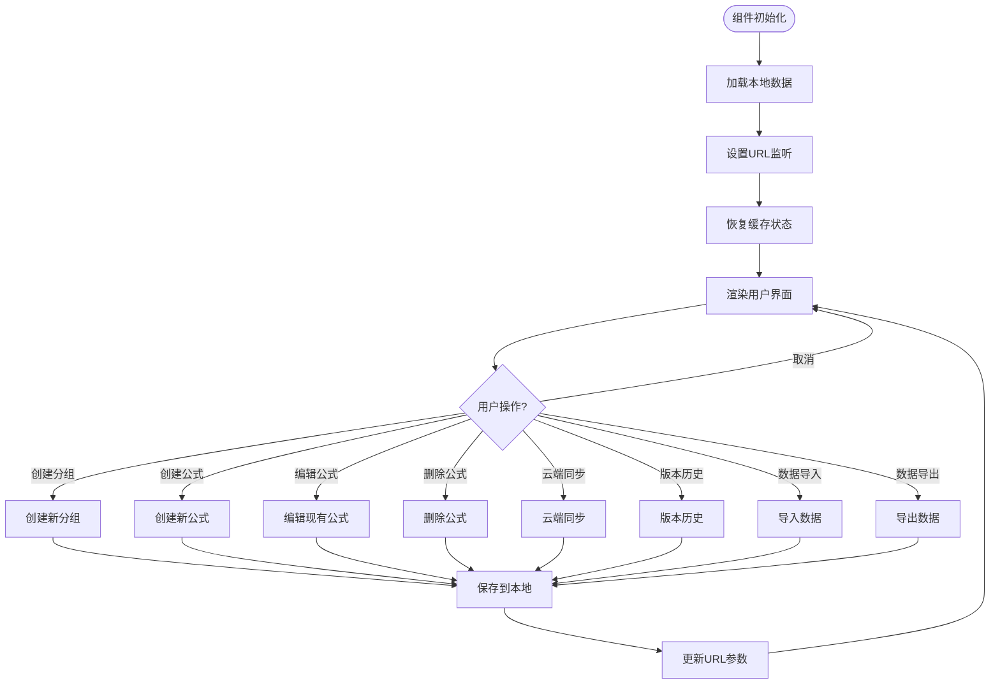

**图表来源**
- [src/app/page.tsx:104-131](file://src/app/page.tsx#L104-L131)
- [src/app/page.tsx:226-261](file://src/app/page.tsx#L226-L261)

#### 云端同步组件
云端同步功能提供了完整的云存储集成：

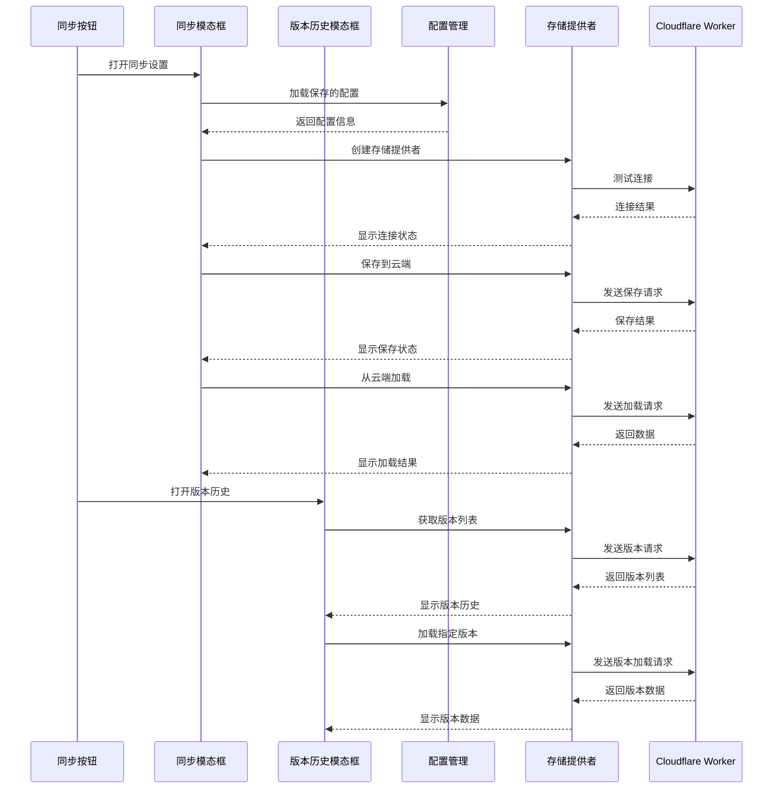

**图表来源**
- [src/components/CloudSyncButton.tsx:40-95](file://src/components/CloudSyncButton.tsx#L40-L95)
- [src/components/CloudSyncModal.tsx:140-200](file://src/components/CloudSyncModal.tsx#L140-L200)
- [src/components/VersionHistoryModal.tsx:34-86](file://src/components/VersionHistoryModal.tsx#L34-L86)

**章节来源**
- [src/app/page.tsx:18-800](file://src/app/page.tsx#L18-L800)
- [src/components/CloudSyncButton.tsx:1-206](file://src/components/CloudSyncButton.tsx#L1-L206)
- [src/components/CloudSyncModal.tsx:1-390](file://src/components/CloudSyncModal.tsx#L1-L390)
- [src/components/VersionHistoryModal.tsx:1-196](file://src/components/VersionHistoryModal.tsx#L1-L196)

### 版本历史管理系统

#### 版本历史模态框
版本历史模态框提供了完整的版本管理功能：

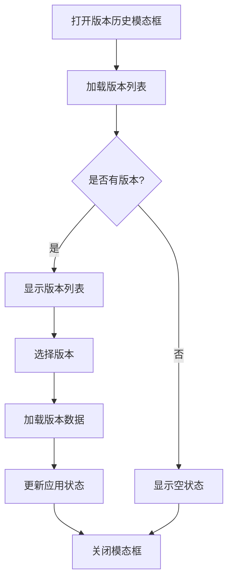

**图表来源**
- [src/components/VersionHistoryModal.tsx:28-86](file://src/components/VersionHistoryModal.tsx#L28-L86)

#### 版本清理机制
系统实现了智能的版本控制机制：

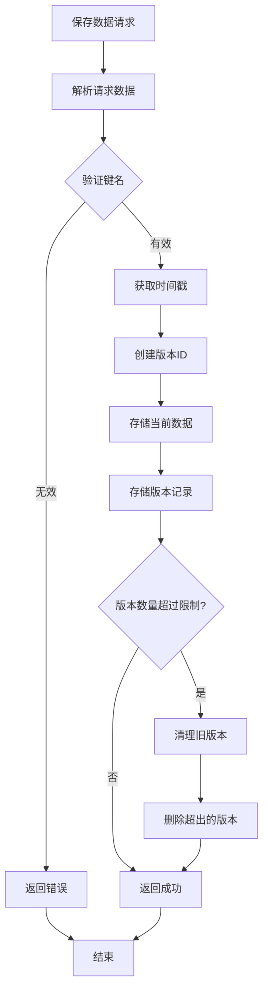

**图表来源**
- [cloud/cloudflare-workers/index.ts:92-134](file://cloud/cloudflare-workers/index.ts#L92-L134)
- [cloud/cloudflare-workers/index.ts:139-156](file://cloud/cloudflare-workers/index.ts#L139-L156)

**章节来源**
- [src/components/VersionHistoryModal.tsx:1-196](file://src/components/VersionHistoryModal.tsx#L1-L196)
- [cloud/cloudflare-workers/index.ts:1-314](file://cloud/cloudflare-workers/index.ts#L1-L314)

### 后端云存储服务

Cloudflare Workers 提供了完整的云端存储解决方案：

#### API 接口设计
后端实现了RESTful API接口，支持完整的CRUD操作和版本管理：

| 端点 | 方法 | 功能 | 请求体 | 响应 |
|------|------|------|--------|------|
| `/health` | GET | 健康检查 | 无 | `{status: 'ok', timestamp: number}` |
| `/save` | POST | 保存数据 | `{key: string, data: any, comment?: string}` | `{success: boolean, versionId: string, timestamp: number}` |
| `/load` | GET | 加载数据 | `key: string` | `{success: boolean, data: any, versionId: string, savedAt: string}` |
| `/delete` | GET | 删除数据 | `key: string` | `{success: boolean, message: string}` |
| `/list` | GET | 列出所有键 | 无 | `{success: boolean, keys: string[]}` |
| `/versions` | GET | 获取版本历史 | `key: string` | `{success: boolean, versions: VersionHistoryItem[]}` |
| `/load-version` | GET | 加载指定版本 | `key: string, versionId: string` | `{success: boolean, data: any}` |

#### 版本管理系统
系统实现了智能的版本控制机制：

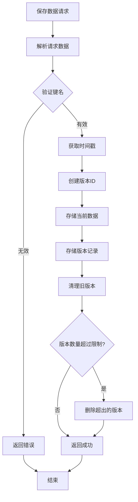

**图表来源**
- [cloud/cloudflare-workers/index.ts:92-134](file://cloud/cloudflare-workers/index.ts#L92-L134)
- [cloud/cloudflare-workers/index.ts:139-156](file://cloud/cloudflare-workers/index.ts#L139-L156)

**章节来源**
- [cloud/cloudflare-workers/index.ts:1-314](file://cloud/cloudflare-workers/index.ts#L1-L314)
- [cloud/cloudflare-workers/wrangler.toml:1-13](file://cloud/cloudflare-workers/wrangler.toml#L1-L13)

### 数据处理系统

#### 公式解析器
系统内置了递归下降解析器，支持复杂的数学表达式：

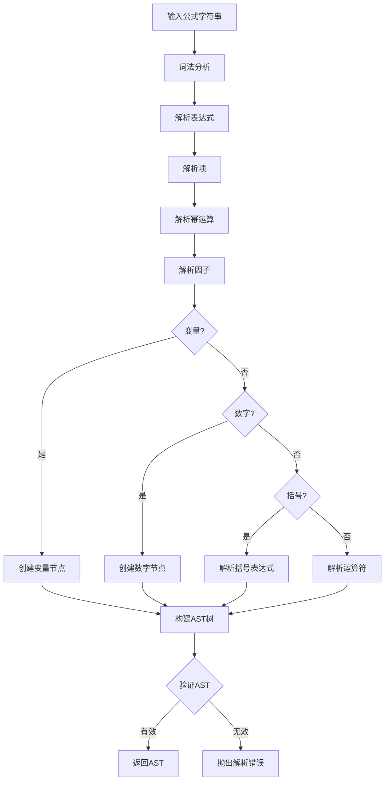

**图表来源**
- [src/lib/parser.ts:12-22](file://src/lib/parser.ts#L12-L22)
- [src/lib/parser.ts:78-133](file://src/lib/parser.ts#L78-L133)

#### 变量映射器
支持中英文变量的双向映射：

**章节来源**
- [src/lib/parser.ts:1-178](file://src/lib/parser.ts#L1-L178)
- [src/lib/mapper.ts:1-89](file://src/lib/mapper.ts#L1-L89)

## 依赖关系分析

系统采用了清晰的依赖层次结构：

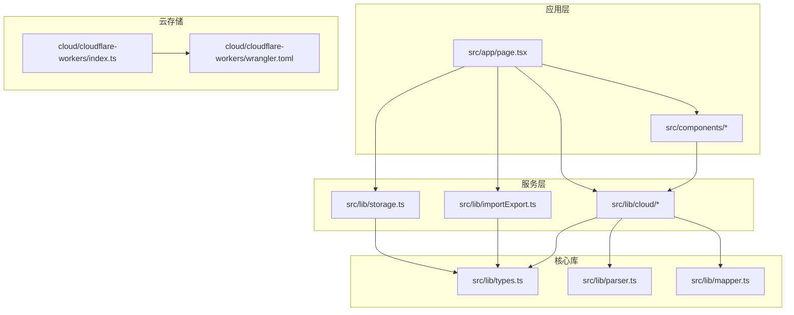

**图表来源**
- [src/app/page.tsx:14-16](file://src/app/page.tsx#L14-L16)
- [src/lib/cloud/index.ts:1-20](file://src/lib/cloud/index.ts#L1-L20)

**章节来源**
- [package.json:15-37](file://package.json#L15-L37)
- [src/lib/cloud/index.ts:1-20](file://src/lib/cloud/index.ts#L1-L20)

## 性能考虑

系统在设计时充分考虑了性能优化：

### 本地存储优化
- **增量更新**：只更新受影响的分组和公式
- **批量操作**：支持批量导入导出减少DOM操作
- **缓存策略**：利用LocalStorage缓存用户选择状态

### 云端同步优化
- **异步处理**：云端同步不影响用户体验
- **错误重试**：网络异常时自动重试机制
- **版本压缩**：自动清理旧版本释放存储空间（最多100个版本）

### 数据结构优化
- **扁平化存储**：避免深层嵌套导致的性能问题
- **索引优化**：通过ID快速定位数据项
- **内存管理**：及时清理不再使用的数据引用

## 故障排除指南

### 常见问题及解决方案

#### 云端同步失败
**症状**：保存或加载数据时出现错误
**可能原因**：
- 网络连接不稳定
- API密钥配置错误
- KV存储空间不足

**解决步骤**：
1. 检查网络连接状态
2. 验证API密钥配置
3. 确认Worker部署正常
4. 查看浏览器开发者工具的网络面板

#### 数据丢失问题
**症状**：刷新页面后数据消失
**可能原因**：
- LocalStorage权限被拒绝
- 浏览器缓存清理
- 浏览器兼容性问题

**解决步骤**：
1. 检查浏览器的LocalStorage设置
2. 确认网站具有存储权限
3. 尝试使用其他浏览器
4. 检查浏览器扩展程序是否阻止存储

#### 版本历史异常
**症状**：版本历史显示不正确或无法加载
**可能原因**：
- KV存储损坏
- 版本数据格式错误
- 权限配置问题

**解决步骤**：
1. 清理浏览器缓存
2. 重新配置云存储设置
3. 检查Worker日志
4. 联系技术支持

#### 版本清理问题
**症状**：版本历史过多或过少
**可能原因**：
- 版本清理机制异常
- 存储空间限制
- 数据损坏

**解决步骤**：
1. 检查版本清理日志
2. 验证存储空间使用情况
3. 重新部署Worker以修复数据
4. 联系技术支持

**章节来源**
- [src/components/CloudSyncButton.tsx:40-95](file://src/components/CloudSyncButton.tsx#L40-L95)
- [cloud/cloudflare-workers/index.ts:79-85](file://cloud/cloudflare-workers/index.ts#L79-L85)
- [src/components/VersionHistoryModal.tsx:184-191](file://src/components/VersionHistoryModal.tsx#L184-L191)

## 结论

云存储系统提供了一个完整、可靠的公式管理解决方案。通过采用现代化的技术栈和架构设计，系统在功能完整性、性能表现和用户体验方面都达到了较高水平。

### 主要优势
- **技术先进**：基于Cloudflare Workers的无服务器架构
- **功能丰富**：支持复杂的公式管理和云端同步
- **版本控制完善**：自动版本历史管理，最多保留100个版本
- **扩展性强**：模块化设计便于功能扩展
- **用户体验好**：直观的界面和流畅的操作体验
- **版本历史管理**：完整的版本查看和回滚功能

### 技术特色
- **版本控制**：自动版本历史管理
- **安全可靠**：可选的API密钥认证
- **性能优化**：异步处理和缓存机制
- **跨平台支持**：响应式设计适配各种设备
- **版本清理机制**：智能版本管理，防止存储空间无限增长
- **加载状态指示**：增强的用户交互体验

该系统为公式管理和知识分享提供了一个强大的技术平台，适合学术研究、商业建模和技术文档等多种应用场景。